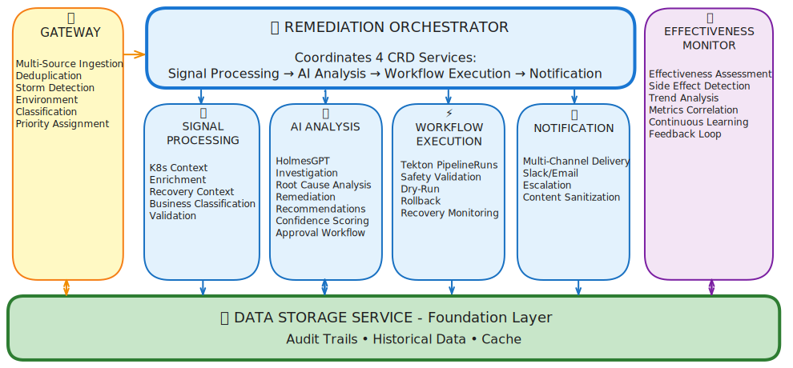

# Kubernaut

**AI-Powered Kubernetes Operations Platform**

[](https://goreportcard.com/report/github.com/jordigilh/kubernaut)
[](https://golang.org/dl/)
[](https://kubernetes.io/)
[](LICENSE)
[](https://github.com/jordigilh/kubernaut/actions/workflows/ci-pipeline.yml)

Kubernaut is an open-source Kubernetes AIOps platform that combines AI-driven investigation with automated remediation. It analyzes Kubernetes incidents, orchestrates multi-step remediation workflows, and executes validated actions—targeting mean time to resolution reduction from 60 minutes to under 5 minutes while maintaining operational safety.

---

## 🎯 What is Kubernaut?

Kubernaut automates the entire incident response lifecycle for Kubernetes:

1. **Signal Ingestion**: Receives alerts from Prometheus AlertManager and Kubernetes Events
2. **AI Analysis**: Uses HolmesGPT for root cause analysis and remediation recommendations
3. **Workflow Orchestration**: Executes OCI-containerized remediation workflows via Tekton Pipelines
4. **Continuous Learning**: Tracks effectiveness of workflow executions and successful remediations over time

### Key Capabilities

- **Multi-Source Signal Processing**: Prometheus alerts, Kubernetes events, with deduplication and storm detection
- **AI-Powered Root Cause Analysis**: HolmesGPT integration for intelligent investigation
- **Remediation Workflows**: OCI-containerized Tekton workflows with flexible single or multi-step execution
- **Safety-First Execution**: Admission webhook validation, human-in-the-loop approval gates, and effectiveness tracking
- **Continuous Learning**: Multi-dimensional effectiveness tracking (incident type, workflow, action)
- **Production-Ready**: Comprehensive CI coverage reporting, SOC2-compliant audit traces, 10 of 10 V1.0 services ready
- **SOC2 Type II Compliance**: Full RemediationRequest reconstruction from audit traces, operator attribution via webhooks, hash chain integrity verification (DD-AUDIT-004, DD-WEBHOOK-001, ADR-034)
- **Enterprise Diagnostics**: Must-gather diagnostic collection following OpenShift industry standard (BR-PLATFORM-001)

---

## 🏗️ Architecture

Kubernaut follows a microservices architecture with 10 production-ready services (5 CRD controllers + 4 stateless services + 1 diagnostic tool):



### Architecture Flow

1. **Gateway Service** receives signals (Prometheus alerts, K8s events) and creates `RemediationRequest` CRDs
2. **Remediation Orchestrator** (CRD controller) coordinates remediation lifecycle across 4 other CRD controllers:
   - **Signal Processing Service**: Enriches signals with Kubernetes context
   - **AI Analysis Service**: Performs HolmesGPT investigation and generates recommendations
   - **Workflow Execution**: Orchestrates Tekton Pipelines for multi-step workflows
   - **Notification Service**: Delivers multi-channel notifications (Slack, Email, etc.)
3. **Data Storage Service** provides centralized PostgreSQL access (ADR-032)
4. **Effectiveness Monitor** tracks workflow remediation outcomes (deferred to V1.1)

### Communication Pattern

Kubernaut uses **Kubernetes Custom Resources (CRDs)** for all inter-service communication, enabling:
- Event-driven, resilient workflows
- Built-in retry and reconciliation
- Complete audit trail
- Horizontal scaling

---

## 📊 Implementation Status

**V1.0 Release** (In Development) | **Timeline**: Pre-release February 2026
**Production-Ready Services**: 10 of 10 (100%) ✅ | **SOC2 Type II Compliance**: ✅ Completed

| Service | Status | Purpose | All Tiers Coverage |
|---------|--------|---------|-------------------|
| **Signal Processing** | ✅ v1.0 | Signal enrichment with K8s context | 84.8% |
| **Remediation Orchestrator** | ✅ v1.0 | Cross-CRD lifecycle coordination | 81.8% |
| **AI Analysis** | ✅ v1.0 | AI-powered analysis & recommendations | 81.9% |
| **Gateway** | ✅ v1.0 | Signal ingestion & deduplication | 80.1% |
| **Workflow Execution** | ✅ v1.0 | Tekton workflow orchestration | 79.1% |
| **HolmesGPT API** | ✅ v3.10 | AI investigation wrapper | 76.0% |
| **Notification** | ✅ v1.0 | Multi-channel delivery | 73.2% |
| **Data Storage** | ✅ v1.0 | REST API for PostgreSQL (ADR-032) | 61.1% |
| **Auth Webhook** | ✅ v1.0 | SOC2 operator attribution (DD-WEBHOOK-001) | 54.5% |
| **Must-Gather** | ✅ v1.0 | Enterprise diagnostic collection (BR-PLATFORM-001) | N/A (bats) |
| ~~Effectiveness Monitor~~ | ❌ V1.1 | Continuous improvement (DD-017) | — |

> **Coverage** is the merged "All Tiers" metric: line-by-line deduplication across unit, integration, and E2E tiers. See the [Coverage Analysis Report](docs/testing/COVERAGE_ANALYSIS_REPORT.md) for per-tier breakdown. Coverage is reported automatically on every PR via CI.

**V1.0 Completion**:
- ✅ **SOC2 Type II Compliance** (January 2026): RR reconstruction (DD-AUDIT-004), operator attribution (DD-WEBHOOK-001), hash chain integrity (ADR-034)
- ✅ **CI/CD Coverage Pipeline** (February 2026): Per-tier analysis with line-by-line merging, automated PR comments
- ✅ **SAR Authentication**: Middleware-based SubjectAccessReview for all stateless services (DD-AUTH-014)
- 🚧 **Remaining** (2 PRs):
  1. **Resource Scope Management** (#38): `kubernaut.ai/managed` label-based opt-in (BR-SCOPE-001, ADR-053)
  2. **Segmented E2E Scenarios** (#39): Progressive integration validation across all services

---

## 🚀 Quick Start

### Prerequisites

- **Go 1.25+** for building services
- **Kubernetes cluster** (Kind recommended for development, v1.30+)
  - **Note**: v1.30+ required for CRD selectableFields support (field selectors on spec fields)
- **PostgreSQL** (for Data Storage service)
- **kubectl** with cluster access

### Build

```bash
# Build all services
make build-all

# Build a specific service (gateway, datastorage, notification, etc.)
make build-gateway
make build-datastorage
```

### Testing

```bash
# Run unit tests for a specific service
make test-unit-gateway
make test-unit-signalprocessing

# Run all unit tests across all services
make test-tier-unit

# Run integration/E2E tests for a specific service
make test-integration-gateway
make test-e2e-gateway

# Run all test tiers for a single service
make test-all-gateway

# Generate coverage report (markdown, table, or JSON)
make coverage-report-markdown
make coverage-report
make coverage-report-json
```

## 🚢 **Deployment**

Kubernaut services use **Kustomize** for Kubernetes deployment.

### **Stateless Services** (Deployment Manifests Available)

| Service | Deployment Path | Notes |
|---|---|---|
| **Gateway** | `deploy/gateway/` | Kustomize with base/overlays |
| **Data Storage** | `deploy/data-storage/` | Includes PostgreSQL infrastructure |
| **HolmesGPT API** | `deploy/holmesgpt-api/` | Full manifest set |
| **Notification** | `deploy/notification/` | Full manifest set |
| **Auth Webhook** | `deploy/authwebhook/` | Includes webhook configurations |

### **CRD Controllers** (Manifests Pending)

CRD controller deployment manifests (Signal Processing, AI Analysis, Workflow Execution, Remediation Orchestrator) will be finalized after the **Resource Scope Management** task (#38), which introduces the `kubernaut.ai/managed` label required for resource scoping.

### **Deployment Guides**

- **[Gateway Service](deploy/gateway/README.md)**: Signal ingestion with K8s-native state management (DD-GATEWAY-012)
- **[Data Storage Service](deploy/data-storage/README.md)**: PostgreSQL-backed unified audit table (ADR-034)
- **[HolmesGPT API](deploy/holmesgpt-api/README.md)**: AI-powered root cause analysis
- **[Auth Webhook](deploy/authwebhook/README.md)**: SOC2 operator attribution (DD-WEBHOOK-001)

---

## 🔍 **Diagnostic Collection - Must-Gather**

Kubernaut provides industry-standard diagnostic collection following the OpenShift must-gather pattern:

```bash
# OpenShift-style (oc adm must-gather)
oc adm must-gather --image=quay.io/jordigilh/must-gather:latest

# Kubernetes-style (kubectl debug)
kubectl debug node/<node-name> \
  --image=quay.io/jordigilh/must-gather:latest \
  --image-pull-policy=Always -- /usr/bin/gather

# Direct pod execution (fallback)
kubectl run kubernaut-must-gather \
  --image=quay.io/jordigilh/must-gather:latest \
  --rm --attach -- /usr/bin/gather
```

**Collects**:
- All Kubernaut CRDs (RemediationRequests, SignalProcessings, AIAnalyses, etc.)
- Service logs (Gateway, Data Storage, HolmesGPT API, CRD controllers)
- Configurations (ConfigMaps, Secrets sanitized)
- Tekton Pipelines (PipelineRuns, TaskRuns, logs)
- Database infrastructure (PostgreSQL, Redis)
- Metrics snapshots and audit event samples

**Output**: Compressed tarball (`kubernaut-must-gather-<cluster>-<timestamp>.tar.gz`)

**Status**: ✅ **v1.0 PRODUCTION-READY** - 45 containerized tests, multi-arch support, GDPR/CCPA sanitization, CI pipeline
**Documentation**: See [BR-PLATFORM-001](docs/requirements/BR-PLATFORM-001-must-gather-diagnostic-collection.md) and [Must-Gather README](cmd/must-gather/README.md)

---

## 👨‍💻 **For Developers**

**New to Kubernaut development?** Start here:

### 📘 **[Developer Guide](docs/DEVELOPER_GUIDE.md)** ⭐ **START HERE**

Complete onboarding guide for contributors:
- **Adding a new service** → 12-day implementation plan with APDC-TDD methodology
- **Extending existing services** → Feature implementation patterns
- **Development environment setup** → Prerequisites, tools, IDE configuration
- **Testing strategy** → Defense-in-depth pyramid (Unit 70%+ / Integration >50% / E2E <10%)
- **Deployment** → Kustomize manifests for Kubernetes (v1.30+)

### **Quick Links for Developers**

| I want to... | Go to... |
|--------------|----------|
| **Implement a new service** | [SERVICE_IMPLEMENTATION_PLAN_TEMPLATE.md](docs/services/SERVICE_IMPLEMENTATION_PLAN_TEMPLATE.md) (11-12 days) |
| **Extend an existing service** | [FEATURE_EXTENSION_PLAN_TEMPLATE.md](docs/services/FEATURE_EXTENSION_PLAN_TEMPLATE.md) (3-12 days) |
| **Document a service** | [SERVICE_DOCUMENTATION_GUIDE.md](docs/services/SERVICE_DOCUMENTATION_GUIDE.md) |
| **Understand architecture** | [Kubernaut CRD Architecture](docs/architecture/KUBERNAUT_CRD_ARCHITECTURE.md) |
| **Learn testing strategy** | [03-testing-strategy.mdc](.cursor/rules/03-testing-strategy.mdc) |
| **Follow Go standards** | [02-go-coding-standards.mdc](.cursor/rules/02-go-coding-standards.mdc) |

---

## 📚 Documentation

### **📖 Documentation Structure Guide** ⭐ **NEW**

**[docs/DOCS_DIRECTORY_STRUCTURE_GUIDE.md](docs/DOCS_DIRECTORY_STRUCTURE_GUIDE.md)** - Complete guide to Kubernaut's documentation organization

**Quick Reference**:
- **Design Decisions (DD-*)**: `docs/architecture/decisions/` - Permanent architectural choices
- **Session Handoffs**: `docs/handoff/` - AI session summaries and implementation status (~2,776 documents)
- **Development Guides**: `docs/development/` - Methodology, testing, standards
- **Test Documentation**: `docs/testing/` - Test plans and strategies
- **Planning**: `docs/plans/` - Implementation plans and roadmaps

**Examples**:
```
Session summary → docs/handoff/DS_E2E_COMPLETE_JAN_26_2026.md
Design decision → docs/architecture/decisions/DD-AUTH-013-http-status-codes.md
Test plan → docs/development/testing/V1_0_SERVICE_MATURITY_TEST_PLAN_TEMPLATE.md
```

---

### Architecture Documentation

- **[Approved Microservices Architecture](docs/architecture/APPROVED_MICROSERVICES_ARCHITECTURE.md)**: Service boundaries and V1/V2 roadmap
- **[Multi-CRD Reconciliation Architecture](docs/architecture/MULTI_CRD_RECONCILIATION_ARCHITECTURE.md)**: CRD communication patterns
- **[CRD Schemas](docs/architecture/CRD_SCHEMAS.md)**: Authoritative CRD field definitions
- **[Tekton Execution Architecture](docs/architecture/TEKTON_EXECUTION_ARCHITECTURE.md)**: Workflow orchestration with Tekton
- **[Design Decisions](docs/architecture/decisions/)**: All DD-* and ADR-* architectural decisions

### Service Documentation

- **[CRD Controllers](docs/services/crd-controllers/)**: Remediation Orchestrator, Signal Processing Service, AI Analysis Service, Workflow Execution
- **[Stateless Services](docs/services/stateless/)**: Gateway Service, Data Storage Service, HolmesGPT API, Notification Service, Effectiveness Monitor

### Development Resources

- **[Testing Strategy](.cursor/rules/03-testing-strategy.mdc)**: Defense-in-depth testing pyramid
- **[CRD Controller Templates](docs/templates/crd-controller-gap-remediation/)**: Production-ready scaffolding (saves 40-60% development time)
- **[Development Methodology](docs/development/methodology/)**: APDC framework, TDD workflow

---

## 🧪 Testing Strategy

Kubernaut follows a **defense-in-depth testing pyramid** with coverage tracked automatically via CI:

- **Unit-Testable**: ≥70% target — Pure business logic with external mocks only
- **Integration-Testable**: ≥60% target — Cross-service coordination, CRD-based flows, DB adapters
- **E2E**: Full end-to-end user journeys (Kind cluster)
- **All Tiers**: ≥80% target — Line-by-line deduplication across all tiers

| Service | Unit-Testable | Integration | E2E | All Tiers |
|---------|---------------|-------------|-----|-----------|
| **Signal Processing** | 82.1% | 60.7% | 56.8% | 84.8% |
| **Remediation Orchestrator** | 75.8% | 56.6% | 44.5% | 81.8% |
| **AI Analysis** | 71.7% | 72.0% | 56.0% | 81.9% |
| **Gateway** | 65.2% | 41.7% | 58.6% | 80.1% |
| **Workflow Execution** | 44.9% | 70.4% | 57.0% | 79.1% |
| **HolmesGPT API** | 76.0% | 43.5% | — | 76.0% |
| **Notification** | 78.8% | 57.9% | 49.4% | 73.2% |
| **Data Storage** | 58.3% | 34.0% | 46.3% | 61.1% |
| **Auth Webhook** | 50.0% | 48.4% | 0.0% | 54.5% |

> Coverage is reported on every PR via GitHub Actions. "All Tiers" uses line-by-line merging — a statement covered by any tier counts once. See [Coverage Analysis Report](docs/testing/COVERAGE_ANALYSIS_REPORT.md) for methodology and patterns.

---

## 🛡️ Security

### RBAC Configuration

Each CRD controller requires specific Kubernetes permissions. See [RBAC documentation](docs/architecture/APPROVED_MICROSERVICES_ARCHITECTURE.md#security-considerations) for details.

### Service-to-Service Authentication

- **Gateway Service**: Network-level security (NetworkPolicies + TLS)
- **CRD Controllers**: Kubernetes ServiceAccount authentication
- **Inter-service**: Service mesh (Istio/Linkerd) with mTLS

---

## 📊 Monitoring & Observability

- **Metrics**: All services expose Prometheus metrics on `:9090/metrics`
- **Health Checks**: `GET /health` and `GET /ready` endpoints on all services
- **Logging**: Structured JSON logging with configurable levels
- **Tracing**: OpenTelemetry support (planned for V1.1)

---

## 🤝 Contributing

### Development Standards

- **Go**: Standard conventions with comprehensive error handling
- **Testing**: Ginkgo/Gomega BDD tests, >70% unit coverage
- **Documentation**: Comprehensive inline documentation
- **CRD Changes**: Update [CRD_SCHEMAS.md](docs/architecture/CRD_SCHEMAS.md)

### Pull Request Process

1. Create feature branch from `main`
2. Implement with comprehensive tests
3. Follow [Service Development Order](docs/planning/SERVICE_DEVELOPMENT_ORDER_STRATEGY.md)
4. Update relevant documentation
5. Code review and merge

---

## 📄 License

Apache License 2.0

---

## 🔗 Support & Community

- **Issues**: [GitHub Issues](https://github.com/jordigilh/kubernaut/issues)
- **Discussions**: [GitHub Discussions](https://github.com/jordigilh/kubernaut/discussions)
- **Documentation**: Comprehensive guides in `docs/` directory

---

**Kubernaut** - Building the next evolution of Kubernetes operations through intelligent, CRD-based microservices that learn and adapt.

**V1.0 Status**: 10 services production-ready ✅ | SOC2 compliance ✅ | CI coverage pipeline ✅ | 2 PRs remaining | 1 deferred to V1.1 (DD-017) | Pre-release: February 2026

**Current Sprint**: Resource Scope Management (#38, BR-SCOPE-001) → Segmented E2E (#39) → V1.0 Pre-release

