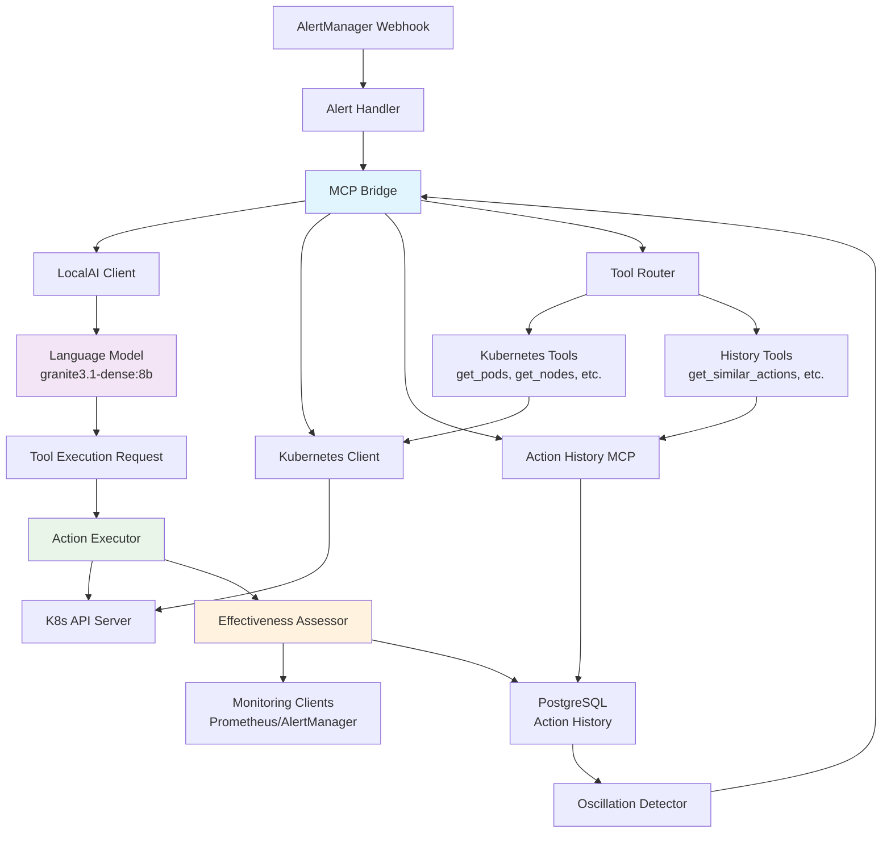

# Prometheus Alerts SLM

A Kubernetes remediation system that analyzes Prometheus alerts using Small Language Models (SLM) and executes remediation actions on Kubernetes/OpenShift clusters.

## Overview

This system processes monitoring alerts and uses language models to recommend appropriate actions based on alert characteristics, resource state, and historical data.

## Key Features

- **Alert Analysis** - Uses IBM Granite models via Ollama for alert interpretation
- **Automated Actions** - Executes Kubernetes remediation actions based on model recommendations
- **Oscillation Prevention** - Detects and prevents action loops and cascading failures
- **AlertManager Integration** - Webhook integration with RBAC and security controls
- **Observability** - Metrics, logging, and action history tracking
- **Persistent Storage** - PostgreSQL-based action history and pattern detection
- **Notification System** - Configurable notification channels
- **Safety Controls** - Dry-run mode, cooldown periods, and confidence thresholds
- **Effectiveness Tracking** - Evaluation of action outcomes and pattern learning
- **MCP Interface** - Structured JSON responses for model processing

## Architecture

The system implements an AI-driven Kubernetes remediation pipeline with dynamic tool calling capabilities, effectiveness assessment, and oscillation prevention mechanisms.

### Key Components

- **MCP Bridge**: Coordinates between the language model and available tools, managing multi-turn conversations and dynamic tool execution
- **LocalAI Client**: Interfaces with IBM Granite models via LocalAI for alert analysis and action recommendation
- **Tool Router**: Routes tool execution requests to appropriate handlers (Kubernetes operations, action history queries)
- **Action Executor**: Executes recommended Kubernetes actions with safety controls and validation
- **Effectiveness Assessor**: Evaluates action outcomes using monitoring data and updates historical effectiveness scores
- **Oscillation Detector**: Prevents action loops by analyzing historical patterns and resource thrashing scenarios

### Data Flow

1. **Alert Processing**: AlertManager webhooks trigger alert analysis through the MCP Bridge
2. **Dynamic Analysis**: Language model requests cluster context via Kubernetes tools and historical data via action history tools
3. **Decision Making**: Model processes real-time cluster state and historical patterns to recommend actions
4. **Safe Execution**: Action executor applies recommendations with safety controls and effectiveness tracking
5. **Learning Loop**: Outcomes feed back into action history for future decision enhancement and oscillation prevention

For comprehensive architectural details, see `docs/ARCHITECTURE.md`.

## Quick Start

### Prerequisites

- Go 1.23.9+
- Ollama with IBM Granite model
- Kubernetes/OpenShift cluster access
- PostgreSQL database (for action history)

### Installation and Setup

Detailed installation instructions, configuration options, and deployment guides are available in `docs/DEPLOYMENT.md`.

Build and test the system using the provided Makefile targets:
- `make build` - Build application binary
- `make test` - Run unit tests
- `make test-integration` - Run integration test suite

## Available Actions

The system supports 25+ Kubernetes remediation actions across categories including scaling, resource management, storage operations, security controls, and diagnostic collection.

See `docs/API_REFERENCE.md` for complete action specifications.

## Additional Features

### Oscillation Detection
Prevention of repeated actions, resource thrashing, and cascading failures through pattern analysis.

### Notification System
Configurable notification channels including console output, Slack, email, and webhooks.

### Action History & Effectiveness Assessment
PostgreSQL-based action tracking with automated evaluation of remediation outcomes and continuous learning from historical patterns.

### MCP Integration
Model Context Protocol interface providing structured JSON and human-readable response formats for language model processing and user display.

## Configuration

Configuration via environment variables or YAML files. Support for SLM provider settings, database connections, Kubernetes access, and application parameters.

See `docs/DEPLOYMENT.md` for detailed configuration options and examples.

## Documentation

Documentation is organized in the `docs/` directory covering system architecture, deployment guides, testing frameworks, and technical analysis.

Key documents:
- `docs/ARCHITECTURE.md` - System design and components
- `docs/DEPLOYMENT.md` - Installation and configuration
- `docs/TESTING.md` - Test framework and coverage
- `docs/ROADMAP.md` - Development roadmap

## Testing

The project uses Ginkgo v2 and Gomega for BDD-style testing with unit and integration test suites.

Run tests using Makefile targets:
- `make test` - Unit tests
- `make test-integration` - Integration tests (requires Ollama and PostgreSQL)
- `make test-coverage` - Generate coverage reports

See `docs/TESTING.md` for detailed testing documentation and coverage analysis.

## Deployment

Kubernetes deployment via Kustomize with RBAC configuration. Requires PostgreSQL database setup and AlertManager webhook configuration.

See `docs/DEPLOYMENT.md` for detailed deployment instructions and security configuration.

## Contributing

See development guidelines and contribution process in the `docs/` directory.

## License

Apache 2.0