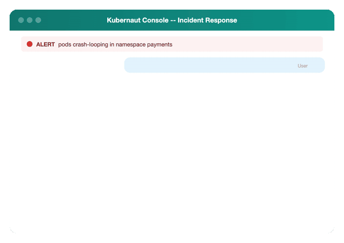

# Kubernaut

**AIOps Platform for Intelligent Kubernetes Remediation**

[](https://goreportcard.com/report/github.com/jordigilh/kubernaut)
[](https://golang.org/dl/)
[](https://kubernetes.io/)
[](LICENSE)
[](https://github.com/jordigilh/kubernaut/actions/workflows/ci-pipeline.yml)

Kubernaut closes the loop from Kubernetes alert to automated remediation. When something goes wrong in your cluster, Kubernaut detects the signal, sends it to an LLM-powered agent that investigates the root cause using native Go client-go bindings against the Kubernetes API, log, and Prometheus endpoints, selects a remediation workflow, and executes the fix — or escalates to a human with a full RCA when it can't.

<p align="center">
  
</p>

<p align="center">
  <a href="https://jordigilh.github.io/kubernaut-docs/"><strong>Full Documentation</strong></a> &nbsp;·&nbsp;
  <a href="https://github.com/jordigilh/kubernaut-demo-scenarios"><strong>Demo Scenarios</strong></a> &nbsp;·&nbsp;
  <a href="https://github.com/jordigilh/kubernaut/releases/tag/v1.3.0"><strong>Latest Release</strong></a>
</p>

---

## Why

Kubernetes operators spend hours manually triaging alerts, diagnosing root causes from scattered logs and metrics, and executing remediation steps from runbooks that drift out of date. The response depends on tribal knowledge, human availability, and often happens at 3am.

Rule-based remediation tools help with known, deterministic problems — "if X, do Y." But when the same symptom has multiple root causes, or the right fix depends on context the rule can't see, they fall short.

Kubernaut bridges that gap. It uses an LLM agent that investigates the actual root cause through native Go bindings against the Kubernetes API and observability stack, selects the right remediation from a workflow catalog, executes it, and verifies the fix worked — escalating to humans only when it should. Rule-based tools are thermostats. Kubernaut is a diagnostician that also adjusts the thermostat.

**[Why Kubernaut? — full comparison with rule-based tools](https://jordigilh.github.io/kubernaut-docs/latest/getting-started/why-kubernaut/)**

---

## What It Does

- **Detects** — Ingests Prometheus AlertManager alerts and Kubernetes Events, validates resource scope, and deduplicates by fingerprint
- **Investigates** — Performs live root cause analysis using Kubernetes inspection tools, configurable observability toolsets (Prometheus, etc.), and remediation history
- **Remediates** — Selects and executes a workflow from a searchable catalog via Tekton Pipelines, Kubernetes Jobs, or Ansible (AWX/AAP), with optional human approval gates
- **Closes the loop** — Notifies the team (Slack, console), evaluates whether the fix worked via health checks, alert resolution, and spec hash drift detection, and feeds effectiveness scores back into future investigations

<details>
<summary>Architecture</summary>


</details>

---

## Roadmap

### v1.4 — Operator Overrides and Platform Hardening (current)

- **Prompt injection guardrails** — Shadow agent with a dedicated scanning model to protect the agentic pipeline against prompt injection attacks ([#601](https://github.com/jordigilh/kubernaut/issues/601))
- **Operator workflow/parameter override** — Operators can override workflow selection and parameters during RAR approval, with authwebhook validation ([#594](https://github.com/jordigilh/kubernaut/issues/594))
- **PagerDuty and Microsoft Teams** — New notification delivery channels alongside Slack and console ([#60](https://github.com/jordigilh/kubernaut/issues/60), [#593](https://github.com/jordigilh/kubernaut/issues/593))
- **Unified monitoring config** — Single `monitoring:` Helm block replacing per-component Prometheus/AlertManager keys, with OCP auto-detection ([#463](https://github.com/jordigilh/kubernaut/issues/463))
- **NetworkPolicies** — Default-deny network policies for all services based on the traffic matrix ([#285](https://github.com/jordigilh/kubernaut/issues/285))

Track progress on the [v1.4 milestone](https://github.com/jordigilh/kubernaut/milestone/5).

**[Full roadmap](docs/roadmap/ROADMAP.md)** — Live Investigation Control, Agentic Integration (MCP/A2A), Collective Intelligence, Fleet Operations (ACM/AAP), and Operational Expansion (cost, security, non-K8s).

<p align="center">
  
</p>

---

## Installation

See the [Installation Guide](https://jordigilh.github.io/kubernaut-docs/latest/getting-started/installation/) for prerequisites, configuration, and deployment instructions.

---

## Documentation

| Resource | Link |
|---|---|
| **User & Operator Guide** | [jordigilh.github.io/kubernaut-docs](https://jordigilh.github.io/kubernaut-docs/) |
| **Architecture Overview** | [Architecture](https://jordigilh.github.io/kubernaut-docs/latest/getting-started/architecture-overview/) |
| **Developer Guide** | [docs/DEVELOPER_GUIDE.md](docs/DEVELOPER_GUIDE.md) |
| **Must-Gather Diagnostics** | [cmd/must-gather/README.md](cmd/must-gather/README.md) |

---

## Related Repositories

| Repository | Description |
|---|---|
| [kubernaut-docs](https://github.com/jordigilh/kubernaut-docs) | Documentation website (MkDocs Material) |
| [kubernaut-demo-scenarios](https://github.com/jordigilh/kubernaut-demo-scenarios) | Demo scenarios, scripts, and recordings |

---

## Development

```bash
make build-all          # Build all services
make test-tier-unit     # Run unit tests
make test-all-gateway   # Run all test tiers for a service
```

We use **Ginkgo/Gomega BDD** for testing and follow a TDD workflow. See the [Developer Guide](docs/DEVELOPER_GUIDE.md) for environment setup, build targets, and test commands.

---

## Contributing

See [CONTRIBUTING.md](CONTRIBUTING.md) for guidelines. In short: create a feature branch, implement with tests, update docs, and open a PR.

---

## License

Apache License 2.0 — see [LICENSE](LICENSE).

---

**Issues**: [GitHub Issues](https://github.com/jordigilh/kubernaut/issues) · **Discussions**: [GitHub Discussions](https://github.com/jordigilh/kubernaut/discussions)

**Kubernaut** — From alert to remediation, intelligently.
