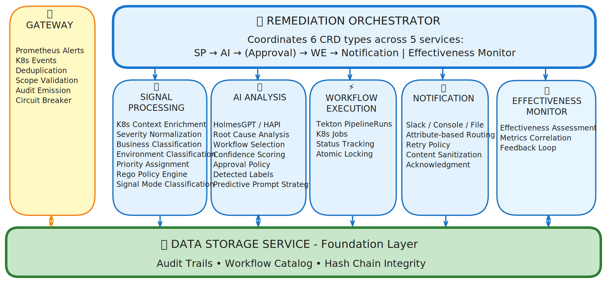

# Kubernaut

**AIOps Platform for Intelligent Kubernetes Remediation**

[](https://goreportcard.com/report/github.com/jordigilh/kubernaut)
[](https://golang.org/dl/)
[](https://kubernetes.io/)
[](LICENSE)
[](https://github.com/jordigilh/kubernaut/actions/workflows/ci-pipeline.yml)

Kubernaut is an open-source **AIOps platform** that closes the loop from Kubernetes alert to automated remediation — without a human in the middle. When something goes wrong in your cluster (an OOMKill, a CrashLoopBackOff, node pressure), Kubernaut detects the signal, enriches it with context, sends it to an LLM for live root cause investigation using real `kubectl` access, matches a remediation workflow from a searchable catalog, and executes the fix — or escalates to a human with a full RCA when it can't.

The result: **mean time to resolution drops from 60 minutes to under 5**, while humans stay in control through approval gates, configurable confidence thresholds, and SOC2-compliant audit trails.

**[Full Documentation](https://jordigilh.github.io/kubernaut-docs/)**

---

## How It Works

<p align="center">
  
</p>

Kubernaut automates the entire incident response lifecycle through a five-stage pipeline:

1. **Signal Detection** — The Gateway receives Prometheus AlertManager alerts and Kubernetes Events, validates resource scope (`kubernaut.ai/managed`), performs fingerprint-based deduplication, and creates a `RemediationRequest` CRD.
2. **Signal Processing** — Enriches the signal with Kubernetes context (owner chain, namespace, workload), environment classification, priority assignment, business classification, severity normalization, and signal mode (reactive vs. proactive) via Rego policies.
3. **AI Analysis** — HolmesGPT investigates the incident live using Kubernetes inspection tools and configurable observability toolsets (Prometheus, Grafana Loki/Tempo). It produces a root cause analysis, detects infrastructure labels (GitOps, Helm, service mesh, HPA, PDB), fetches remediation history so the LLM avoids repeating failed approaches, and selects a workflow from the catalog.
4. **Workflow Execution** — Runs the selected remediation via Tekton Pipelines or Kubernetes Jobs, with optional human approval gates controlled by Rego policies.
5. **Close the Loop** — Notifies the team (Slack, console, file, log) and evaluates whether the fix worked via health checks, alert resolution, metric comparison, and spec hash drift detection. Effectiveness scores feed back into future investigations.

---

## Quick Start

### Prerequisites

- **Go 1.25+** for building services
- **Kubernetes cluster** (Kind recommended for development, v1.34+)
- **PostgreSQL** (for Data Storage service)
- **kubectl** with cluster access

### Build

```bash
make build-all

make build-gateway
make build-datastorage
```

### Testing

```bash
make test-unit-gateway
make test-tier-unit

make test-integration-gateway
make test-e2e-gateway

make test-all-gateway
```

### Deployment

See the [Installation Guide](https://jordigilh.github.io/kubernaut-docs/getting-started/installation/) for Helm-based deployment, or the [demo deployment guide](docs/demo/README.md) for a local walkthrough.

---

## Documentation

| Resource | Link |
|---|---|
| **User & Operator Documentation** | [jordigilh.github.io/kubernaut-docs](https://jordigilh.github.io/kubernaut-docs/) |
| **Developer Guide** | [docs/DEVELOPER_GUIDE.md](docs/DEVELOPER_GUIDE.md) |
| **Must-Gather Diagnostics** | [cmd/must-gather/README.md](cmd/must-gather/README.md) |

---

## Contributing

We use **Ginkgo/Gomega BDD** for testing and follow a TDD workflow. See the [Developer Guide](docs/DEVELOPER_GUIDE.md) for environment setup and the [Contributing Guide](https://jordigilh.github.io/kubernaut-docs/contributing/) for contribution guidelines.

1. Create a feature branch from `main`
2. Implement with tests
3. Update relevant documentation
4. Open a pull request for review

---

## License

Apache License 2.0

---

**Issues**: [GitHub Issues](https://github.com/jordigilh/kubernaut/issues) | **Discussions**: [GitHub Discussions](https://github.com/jordigilh/kubernaut/discussions)

**Kubernaut** — From alert to remediation, intelligently.
