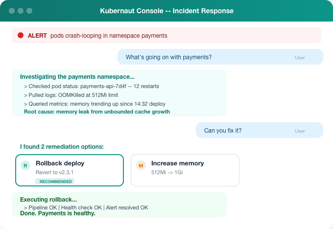

# Kubernaut

**AIOps Platform for Intelligent Kubernetes Remediation**

[](https://goreportcard.com/report/github.com/jordigilh/kubernaut)
[](https://golang.org/dl/)
[](https://kubernetes.io/)
[](LICENSE)
[](https://github.com/jordigilh/kubernaut/actions/workflows/ci-pipeline.yml)

Kubernaut closes the loop from Kubernetes alert to automated remediation. When something goes wrong in your cluster, Kubernaut detects the signal, sends it to an LLM-powered agent that investigates the root cause using native Go client-go bindings against the Kubernetes API, log, and Prometheus endpoints, selects a remediation workflow, and executes the fix — or escalates to a human with a full RCA when it can't.


**[Full Documentation](https://jordigilh.github.io/kubernaut-docs/)** · **[Demo Scenarios](https://github.com/jordigilh/kubernaut-demo-scenarios)**

---

## Why

Kubernetes operators spend hours manually triaging alerts, diagnosing root causes from scattered logs and metrics, and executing remediation steps from runbooks that drift out of date. The response depends on tribal knowledge, human availability, and often happens at 3am.

Rule-based remediation tools help with known, deterministic problems — "if X, do Y." But when the same symptom has multiple root causes, or the right fix depends on context the rule can't see, they fall short.

Kubernaut bridges that gap. It uses an LLM agent that investigates the actual root cause through native Go bindings against the Kubernetes API and observability stack, selects the right remediation from a workflow catalog, executes it, and verifies the fix worked — escalating to humans only when it should. Rule-based tools are thermostats. Kubernaut is a diagnostician that also adjusts the thermostat.

**[Why Kubernaut? — full comparison with rule-based tools](https://jordigilh.github.io/kubernaut-docs/latest/getting-started/why-kubernaut/)**

---

## What It Does

- **Detects** — Ingests Prometheus AlertManager alerts and Kubernetes Events, validates resource scope, and deduplicates by fingerprint
- **Investigates** — Performs live root cause analysis using Kubernetes inspection tools, configurable observability toolsets (Prometheus, etc.), and remediation history
- **Remediates** — Selects and executes a workflow from a searchable catalog via Tekton Pipelines, Kubernetes Jobs, or Ansible (AWX/AAP), with optional human approval gates
- **Closes the loop** — Notifies the team (Slack, console), evaluates whether the fix worked via health checks, alert resolution, and spec hash drift detection, and feeds effectiveness scores back into future investigations

<details>
<summary>Architecture</summary>


</details>

---

## Roadmap

### v1.3 — Go Unification and Enterprise Distribution (current)

- **Kubernaut Agent (KA)** — Ground-up rewrite of the HolmesGPT-API (HAPI) service in Go, designed for security-first operation and agentic investigation flow with layered prompt-injection defenses; architecture enables shadow-agent audit in v1.4 ([#601](https://github.com/jordigilh/kubernaut/issues/601)) and multi-agent consensus investigation in v1.5 ([#648](https://github.com/jordigilh/kubernaut/issues/648)) ([#433](https://github.com/jordigilh/kubernaut/issues/433))
- **Mock LLM Go rewrite** — DAG-based conversation engine with declarative YAML scenarios and fault injection for resilience testing
- **Kubernaut Operator** — OLM-packaged operator for OperatorHub distribution on OpenShift
- **Inter-pod TLS** — Encrypted communication between all internal services
- **Audit event retention** — Automated deletion of expired audit events
- **Label-based notification routing** — Route notifications to signal and RCA target resource owners

Track progress on the [v1.3 milestone](https://github.com/jordigilh/kubernaut/milestone/4).

### v1.4 — Agentic Integration and AI Safety (next)

- **Kubernaut Console** — Web-based operator dashboard with chat UI, live remediation streaming, and workflow selection. Standalone React app (MVP) evolving into a Backstage plugin ([#713](https://github.com/jordigilh/kubernaut/issues/713))
- **Natural language investigation** — Operators can trigger investigations by describing the problem in plain text; Kubernaut extracts a structured signal and runs the full remediation pipeline ([#714](https://github.com/jordigilh/kubernaut/issues/714))
- **MCP interactive mode** — Human operators can investigate, enrich, and select remediation workflows through any MCP-compatible chat interface — IDE copilots, Slack bots, operational consoles, or custom UIs ([#703](https://github.com/jordigilh/kubernaut/issues/703))
- **A2A protocol support** — External AI agents can delegate remediation to Kubernaut and track task lifecycle via the [Agent-to-Agent](https://a2aproject.github.io/A2A/latest/specification/) standard ([#705](https://github.com/jordigilh/kubernaut/issues/705))
- **API Frontend service** — Unified external protocol layer hosting MCP and inbound A2A endpoints, with shared CRD watching for live remediation status streaming ([#708](https://github.com/jordigilh/kubernaut/issues/708))
- **Investigation Prompt Bundles** — Customers inject their SOPs into the investigation pipeline via OCI-packaged prompts and skills, laying the groundwork for hook phases and customizable RCA flows while the current prompt-builder-driven path is validated ([#711](https://github.com/jordigilh/kubernaut/issues/711))
- **Prompt injection guardrails** — Shadow agent with a dedicated scanning model to protect the agentic pipeline against prompt injection attacks ([#601](https://github.com/jordigilh/kubernaut/issues/601))
- **Operator workflow/parameter override** — Allow operators to override workflow selection and parameters during RAR approval



See the [partner integration deck](docs/presentations/kubernaut-integration-partner-deck.md) for the full visual walkthrough.

Track progress on the [v1.4 milestone](https://github.com/jordigilh/kubernaut/milestone/5).

### v1.5 — Multi-Agent Consensus RCA (planned)

- **Ensemble RCA investigation** — Two independent LLM agents (different model families) perform parallel root cause analysis; a consolidator validates agreement and cross-examines on divergence to improve diagnostic accuracy

Track progress on the [v1.5 milestone](https://github.com/jordigilh/kubernaut/milestone/6). See [#648](https://github.com/jordigilh/kubernaut/issues/648) for the design discussion.

### v1.6 — Multi-Cluster Federation (planned)

- **Fleet-wide remediation** — A2A-based multi-cluster architecture enabling centralized signal ingestion, cross-cluster RCA investigation, and federated workflow execution across Kubernetes fleets

Goose/ACP remains under architectural evaluation as a future runtime option and is not a near-term dependency for the v1.4-v1.6 roadmap.

### v1.2 — Operational Resilience and Security Hardening ([released](https://github.com/jordigilh/kubernaut/releases/tag/v1.2.0))

- **Per-workflow ServiceAccount** — Each remediation workflow runs under its own SA with least-privilege RBAC, replacing the shared default
- **Short-lived token injection** — Ansible executor uses Kubernetes TokenRequest API with configurable TTL instead of long-lived secrets
- **PVC-wipe resilience** — Deterministic workflow IDs and startup reconciliation recover the workflow catalog automatically after data loss
- **Smarter effectiveness assessment** — Partial vs full assessment paths based on actual workflow completion, with configurable Prometheus lookback and concurrency
- **CRD schema hardening** — Typed enums across all 9 CRDs with OpenAPI validation at admission time
- **Hash-capture degradation visibility** — Explicit conditions and notification enrichment when spec hash capture fails

See [CHANGELOG.md](CHANGELOG.md) for the complete list.

---

## Installation

See the [Installation Guide](https://jordigilh.github.io/kubernaut-docs/latest/getting-started/installation/) for prerequisites, configuration, and deployment instructions.

---

## Documentation

| Resource | Link |
|---|---|
| **User & Operator Guide** | [jordigilh.github.io/kubernaut-docs](https://jordigilh.github.io/kubernaut-docs/) |
| **Architecture Overview** | [Architecture](https://jordigilh.github.io/kubernaut-docs/latest/getting-started/architecture-overview/) |
| **Developer Guide** | [docs/DEVELOPER_GUIDE.md](docs/DEVELOPER_GUIDE.md) |
| **Must-Gather Diagnostics** | [cmd/must-gather/README.md](cmd/must-gather/README.md) |

---

## Related Repositories

| Repository | Description |
|---|---|
| [kubernaut-docs](https://github.com/jordigilh/kubernaut-docs) | Documentation website (MkDocs Material) |
| [kubernaut-demo-scenarios](https://github.com/jordigilh/kubernaut-demo-scenarios) | Demo scenarios, scripts, and recordings |

---

## Development

```bash
make build-all          # Build all services
make test-tier-unit     # Run unit tests
make test-all-gateway   # Run all test tiers for a service
```

We use **Ginkgo/Gomega BDD** for testing and follow a TDD workflow. See the [Developer Guide](docs/DEVELOPER_GUIDE.md) for environment setup, build targets, and test commands.

---

## Contributing

See [CONTRIBUTING.md](CONTRIBUTING.md) for guidelines. In short: create a feature branch, implement with tests, update docs, and open a PR.

---

## License

Apache License 2.0 — see [LICENSE](LICENSE).

---

**Issues**: [GitHub Issues](https://github.com/jordigilh/kubernaut/issues) · **Discussions**: [GitHub Discussions](https://github.com/jordigilh/kubernaut/discussions)

**Kubernaut** — From alert to remediation, intelligently.
