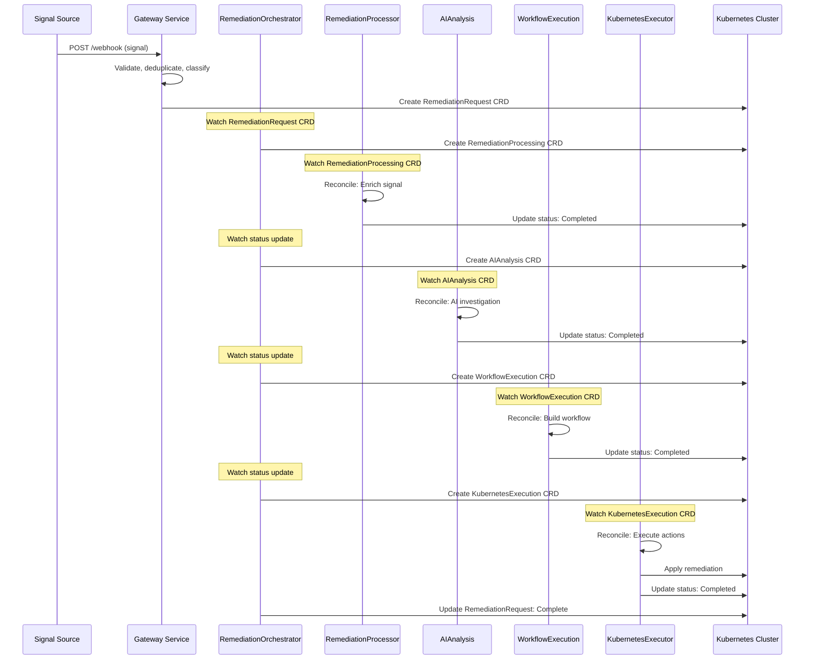

# Kubernaut

> ⚠️ **ARCHITECTURE MIGRATION IN PROGRESS** ⚠️
>
> Kubernaut is currently undergoing its 3rd major refactoring from monolithic to **microservices+CRD architecture**.
>
> **Current Implementation Status**: **Phase 1 (Foundation) - 4 of 12 services complete**
> - ✅ **Gateway Service**: COMPLETE ([Integration Tests Complete](GATEWAY_TESTS_PHASE2_PHASE3_COMPLETE.md))
> - ✅ **Data Storage Service**: COMPLETE ([Handoff Summary](docs/services/stateless/data-storage/implementation/HANDOFF_SUMMARY.md))
> - ✅ **Dynamic Toolset Service**: COMPLETE ([Handoff Summary](docs/services/stateless/dynamic-toolset/implementation/00-HANDOFF-SUMMARY.md))
> - ✅ **Notification Service**: COMPLETE ([Service Completion](docs/services/crd-controllers/06-notification/SERVICE_COMPLETION_FINAL.md))
> - 🔄 **Context API**: In-progress (Days 2-3 DO-RED ✅ COMPLETE, 84/84 tests passing, Day 4 DO-GREEN next)
> - ⏸️ **7 services pending**: HolmesGPT API, RemediationProcessor, WorkflowExecution, KubernetesExecutor, AIAnalysis, RemediationOrchestrator, Effectiveness Monitor
>
> **Timeline**: Weeks 1-13 development plan (currently in Week 1-2)
>
> **For Current V1 Architecture**, see:
> - [APPROVED_MICROSERVICES_ARCHITECTURE.md](docs/architecture/APPROVED_MICROSERVICES_ARCHITECTURE.md) - Authoritative V1 architecture (12 services)
> - [SERVICE_DEVELOPMENT_ORDER_STRATEGY.md](docs/planning/SERVICE_DEVELOPMENT_ORDER_STRATEGY.md) - Development timeline & dependencies
> - [V1_SOURCE_OF_TRUTH_HIERARCHY.md](docs/V1_SOURCE_OF_TRUTH_HIERARCHY.md) - Documentation hierarchy

An intelligent Kubernetes remediation platform built on **microservices architecture** that autonomously analyzes **multiple signal types** (Prometheus alerts, Kubernetes events, CloudWatch alarms, custom webhooks) and executes automated actions using AI-powered decision making, with complete CRD-based orchestration.

---

## 📖 **V1 Microservices Architecture - START HERE**

**For implementation, always refer to these authoritative V1 documents:**

- ⭐ **[V1 Source of Truth Hierarchy](docs/V1_SOURCE_OF_TRUTH_HIERARCHY.md)** - **ESSENTIAL READING**
  - 3-tier documentation hierarchy (Architecture → Services → Design)
  - Identifies which documents are authoritative vs reference
  - **95% confidence** - Production-ready documentation

- 🏗️ **[Kubernaut Architecture Overview](docs/architecture/KUBERNAUT_ARCHITECTURE_OVERVIEW.md)**
  - High-level system design and architectural principles
  - V1 microservices overview (12 core services)

- 🏛️ **[Approved Microservices Architecture](docs/architecture/APPROVED_MICROSERVICES_ARCHITECTURE.md)** ⭐ **AUTHORITATIVE**
  - **V1 Implementation Specification**: 12 services (5 CRD controllers + 7 stateless services)
  - Detailed microservices decomposition and service boundaries
  - CRD-based communication architecture
  - Service dependencies and integration patterns

- 📋 **[Kubernaut Service Catalog](docs/architecture/KUBERNAUT_SERVICE_CATALOG.md)**
  - Comprehensive service specifications and API contracts
  - Dependencies for all V1 services

- 📐 **[CRD Schemas](docs/architecture/CRD_SCHEMAS.md)** - **AUTHORITATIVE**
  - Single source of truth for all CRD field definitions
  - OpenAPI v3 schemas for RemediationRequest, RemediationProcessing, AIAnalysis, WorkflowExecution, KubernetesExecution

**Quality Assurance**: [V1 Documentation Triage Report](docs/analysis/V1_DOCUMENTATION_TRIAGE_REPORT.md) - 239 files analyzed, 0 critical issues

---

## 🏗️ **V1 MICROSERVICES ARCHITECTURE**

**CURRENT IMPLEMENTATION**: **Phase 1 of 5** - CRD-based microservices with independent scaling, deployment, and failure domains.

### **🎯 V1 Architecture: 12 Services (5 CRD Controllers + 7 Stateless Services)**

**Reference**: [Approved Microservices Architecture](docs/architecture/APPROVED_MICROSERVICES_ARCHITECTURE.md) (**Tier 1: AUTHORITATIVE**)

#### **CRD Controllers** (5 services)
Each controller runs as a separate microservice with its own binary:

| Service | Status | CRD | Purpose | Docs |
|---------|--------|-----|---------|------|
| **RemediationOrchestrator** | ⏸️ Phase 5 | RemediationRequest | Cross-CRD coordination & lifecycle management | [docs](docs/services/crd-controllers/05-remediationorchestrator/) |
| **RemediationProcessor** | ⏸️ Phase 3 | RemediationProcessing | Signal processing and enrichment | [docs](docs/services/crd-controllers/01-remediationprocessor/) |
| **AIAnalysis** | ⏸️ Phase 4 | AIAnalysis | AI-powered analysis and recommendations | [docs](docs/services/crd-controllers/02-aianalysis/) |
| **WorkflowExecution** | ⏸️ Phase 3 | WorkflowExecution | Multi-step workflow orchestration | [docs](docs/services/crd-controllers/03-workflowexecution/) |
| **KubernetesExecutor** | ⏸️ Phase 3 | KubernetesExecution | Safe Kubernetes operation execution | [docs](docs/services/crd-controllers/04-kubernetesexecutor/) |

#### **Stateless Services** (7 services)

| Service | Status | Purpose | Port | Docs |
|---------|--------|---------|------|------|
| **Gateway Service** | ✅ **COMPLETE** | Multi-signal webhook ingestion | 8080 | [Integration Tests](GATEWAY_TESTS_PHASE2_PHASE3_COMPLETE.md) |
| **Dynamic Toolset** | ✅ **COMPLETE** | HolmesGPT toolset configuration | 8080 | [Handoff Summary](docs/services/stateless/dynamic-toolset/implementation/00-HANDOFF-SUMMARY.md) |
| **Data Storage** | ✅ **COMPLETE** | PostgreSQL + Vector DB management | 8080 | [Handoff Summary](docs/services/stateless/data-storage/implementation/HANDOFF_SUMMARY.md) |
| **Notification Service** | ✅ **COMPLETE** | Multi-channel notification delivery (CRD-based) | 8080 | [Service Completion](docs/services/crd-controllers/06-notification/SERVICE_COMPLETION_FINAL.md) |
| **Context API** | 🔄 **In-Progress** | Dynamic context orchestration | 8080 | [Implementation Plan](docs/services/stateless/context-api/implementation/IMPLEMENTATION_PLAN_V1.0.md) \| [Progress](docs/services/stateless/context-api/implementation/NEXT_TASKS.md) |
| **HolmesGPT API** | ⏸️ Phase 2 | AI investigation wrapper (Python) | 8080 | [docs](docs/services/stateless/) |
| **Effectiveness Monitor** | ⏸️ Phase 5 | Action outcome assessment & learning | 8080 | [docs](docs/services/stateless/) |

**Port Standards**:
- **8080**: Health/Ready endpoints + API (all services)
- **9090**: Metrics endpoints (all services)

**Development Status**: **4 of 12 services complete (33%) + 1 in-progress**

---

## 🔄 **V1 SERVICE COMMUNICATION ARCHITECTURE**

**Reference**: [Multi-CRD Reconciliation Architecture](docs/architecture/MULTI_CRD_RECONCILIATION_ARCHITECTURE.md) (**Tier 1: AUTHORITATIVE**)

### **CRD-Based Multi-Signal Flow**

Kubernaut uses **Kubernetes Custom Resources (CRDs)** for all inter-service communication, enabling event-driven, resilient, and auditable workflows:

```
Signal Sources → Gateway Service → RemediationRequest CRD (created)
(Prometheus Alerts,       ↓
 K8s Events,         RemediationOrchestrator (watches RemediationRequest)
 CloudWatch Alarms,       ↓
 Custom Webhooks)    Creates child CRDs (RemediationProcessing, AIAnalysis, WorkflowExecution, KubernetesExecution)
                          ↓
                     Each CRD Controller watches its CRD type
                          ↓
                     Controllers reconcile independently (event-driven)
                          ↓
                     Status updates trigger parent watches (RemediationOrchestrator)
                          ↓
                     Complete audit trail stored in CRDs + PostgreSQL
```

### **Communication Features**
- ✅ **CRD-Based**: Kubernetes-native communication via Custom Resources
- ✅ **Event-Driven**: Controllers watch CRD changes for reconciliation
- ✅ **Resilient**: Built-in retry and reconciliation loops
- ✅ **Scalable**: Horizontal scaling via controller replicas
- ✅ **Observable**: Complete audit trail via CRD status updates
- ✅ **Decoupled**: Services communicate through CRDs, not direct HTTP

### **V1 Service Flow Example**



---

## 📊 **IMPLEMENTATION STATUS & ROADMAP**

### **Current Status: Phase 1 (Foundation) - 4 of 12 services**

**Reference**: [Service Development Order Strategy](docs/planning/SERVICE_DEVELOPMENT_ORDER_STRATEGY.md)

| Phase | Services | Status | Timeline |
|-------|----------|--------|----------|
| **Phase 1: Foundation** | Gateway, Dynamic Toolset, Data Storage, Notifications | ✅✅✅✅ | Weeks 1-3 |
| **Phase 2: Intelligence** | Context API, HolmesGPT API | ⏸️⏸️ | Weeks 3-5 |
| **Phase 3: Core Controllers** | RemediationProcessor, WorkflowExecution, KubernetesExecutor | ⏸️⏸️⏸️ | Weeks 5-8 |
| **Phase 4: AI Integration** | AIAnalysis | ⏸️ | Weeks 8-10 |
| **Phase 5: Orchestration** | RemediationOrchestrator, Effectiveness Monitor | ⏸️⏸️ | Weeks 10-13 |

**Legend**: ✅ Complete | 🔄 In-Progress | ⏸️ Pending

### **Phase 1 Completed Features**

#### ✅ **Gateway Service** (COMPLETE)
- **Status**: Production-ready with comprehensive integration tests
- **Features**:
  - Multi-signal webhook ingestion (Prometheus, K8s Events, CloudWatch, custom)
  - Signal deduplication with Redis
  - Storm detection and aggregation
  - Environment classification (prod/staging/dev)
  - Priority assignment (P0/P1/P2)
  - RemediationRequest CRD creation
  - TokenReview-based authentication
  - Rate limiting (token bucket)
  - 17+ Prometheus metrics
- **Testing**: [Gateway Integration Tests Complete](GATEWAY_TESTS_PHASE2_PHASE3_COMPLETE.md)
- **Test Coverage**: Unit (70%+), Integration (20%), E2E scenarios
- **Confidence**: **98%** - Production-ready

#### ✅ **Dynamic Toolset Service** (COMPLETE)
- **Status**: Production-ready with comprehensive documentation
- **Features**:
  - 5 service detectors (Prometheus, Grafana, Jaeger, Elasticsearch, Custom)
  - Multi-detector orchestration with periodic discovery (5-minute interval)
  - HolmesGPT-compatible toolset generation and ConfigMap management
  - Three-way merge reconciliation (detected + overrides + manual)
  - REST API with OAuth2 authentication (6 endpoints)
  - 10+ Prometheus metrics and structured logging
  - Kubernetes deployment manifests (RBAC, ConfigMap, Service)
- **Documentation**: [Handoff Summary](docs/services/stateless/dynamic-toolset/implementation/00-HANDOFF-SUMMARY.md)
- **Testing**: 232/232 tests passing (194 unit + 38 integration)
- **Test Coverage**: Unit (70%+), Integration (100% pass rate)
- **Confidence**: **95%** - Production-ready

#### ✅ **Notification Service** (COMPLETE)
- **Status**: Production-ready with comprehensive testing
- **Features**:
  - CRD-based architecture (NotificationRequest v1alpha1)
  - Multi-channel delivery (Console, Slack, Email, Teams, SMS, Webhook)
  - Custom retry policies with exponential backoff
  - Data sanitization (password redaction, token masking)
  - Graceful degradation (partial delivery success)
  - Comprehensive status management with audit trail
  - Optimistic concurrency control for status updates
  - Multi-arch Docker build support (amd64, arm64)
- **Documentation**: [Service Completion](docs/services/crd-controllers/06-notification/SERVICE_COMPLETION_FINAL.md)
- **Testing**: 40 tests passing (19 unit + 21 integration)
- **Test Coverage**: Unit (95%), Integration (92%), BR Coverage (100%)
- **Confidence**: **95%** - Production-ready

---

## 🎯 **PLANNED V1 FEATURES** (Phases 2-5)

### **Phase 2: Intelligence Layer** (Weeks 3-5)
- **Context API**: Dynamic context orchestration for AI investigations
- **HolmesGPT API**: Python wrapper for HolmesGPT SDK with LLM integration

### **Phase 3: Core Business Logic** (Weeks 5-8)
- **RemediationProcessor**: Signal enrichment with cluster context
- **WorkflowExecution**: Multi-step workflow orchestration with dependency resolution
- **KubernetesExecutor**: 25+ Kubernetes remediation actions with safety validation

### **Phase 4: AI Integration** (Weeks 8-10)
- **AIAnalysis**: AI-powered root cause analysis and action recommendations
- Multi-LLM support (OpenAI, Anthropic, Azure, AWS Bedrock, Ollama)

### **Phase 5: Orchestration & Observability** (Weeks 10-13)
- **RemediationOrchestrator**: End-to-end lifecycle coordination across all CRDs
- **Effectiveness Monitor**: Action outcome assessment and continuous learning

---

## 🚀 **V1 PLANNED CAPABILITIES** (Post-Phase 5)

When V1 implementation completes (Week 13), Kubernaut will support:

### **Multi-Signal Processing**
- Prometheus AlertManager webhooks
- Kubernetes events (pod crashes, node issues)
- CloudWatch alarms (AWS integration)
- Custom webhook integrations

### **AI-Powered Analysis**
- Root cause analysis via HolmesGPT
- Historical pattern matching
- Confidence scoring for recommendations
- Multi-LLM provider support

### **Automated Remediation Actions** (25+)
Planned for KubernetesExecutor service (Phase 3):

**Scaling & Resources**:
- `scale_deployment`, `increase_resources`, `update_hpa`, `scale_statefulset`

**Pod & Application Lifecycle**:
- `restart_pod`, `rollback_deployment`, `quarantine_pod`, `migrate_workload`

**Node Operations**:
- `drain_node`, `cordon_node`, `restart_daemonset`

**Storage Operations**:
- `expand_pvc`, `cleanup_storage`, `backup_data`, `compact_storage`

**Network & Connectivity**:
- `update_network_policy`, `restart_network`, `reset_service_mesh`

**Database & Stateful Services**:
- `failover_database`, `repair_database`

**Security & Compliance**:
- `rotate_secrets`, `audit_logs`

**Diagnostics & Monitoring**:
- `collect_diagnostics`, `enable_debug_mode`, `create_heap_dump`, `notify_only`

All actions will include comprehensive safety validation, rollback capabilities, and effectiveness tracking.

---

## 📋 **QUICK START (Current Phase 1)**

### **Prerequisites**
- **Go 1.23.9+** for building services
- **Kubernetes cluster** (Kind recommended for development)
- **Redis** (for Gateway service deduplication)
- **kubectl** with cluster access

### **Build Gateway Service** (Currently Available)

```bash
# Install CRDs (required for all services)
make install

# Build all CRD controllers (single binary for development)
make build
# Creates: bin/manager (includes RemediationOrchestrator, RemediationProcessor, AIAnalysis, WorkflowExecution, KubernetesExecutor)

# Build individual services (when available)
go build -o bin/gateway-service ./cmd/gateway
go build -o bin/dynamic-toolset ./cmd/dynamictoolset  # Coming soon
```

### **Run Gateway Integration Tests**

```bash
# Setup Kind cluster for Gateway testing
make test-gateway-setup

# Run Gateway integration tests
make test-gateway

# Teardown test cluster
make test-gateway-teardown
```

### **Development Workflow** (When All Services Available)

```bash
# Setup Kind cluster with all dependencies
make bootstrap-dev-kind          # Coming soon - will setup full environment

# Run tests by tier
make test                        # Unit tests (all services)
make test-integration           # Integration tests
make test-e2e                   # End-to-end tests

# Clean up
make cleanup-dev-kind
```

### **Configuration Structure** (Phase 1)

```yaml
# config/development.yaml (Gateway Service)
gateway:
  port: 8080
  redis:
    address: "localhost:6379"
    db: 0
  kubernetes:
    kubeconfig: "${HOME}/.kube/config"
  metrics:
    port: 9090

# Additional service configs will be added in subsequent phases
```

---

## 🧪 **TESTING STRATEGY**

### **Defense-in-Depth Testing Pyramid** (Microservices Architecture)

**Reference**: [Testing Strategy Rule](.cursor/rules/03-testing-strategy.mdc)

- **Unit Tests**: **70%+ coverage** (AT LEAST 70% of all business requirements - extensive business logic with external mocks only)
- **Integration Tests**: **>50% coverage** (Cross-service coordination, CRD-based flows, microservices interactions)
- **E2E Tests**: **<10% coverage** (Critical end-to-end user journeys)

**Note**: Percentages add up to >120% due to **defense-in-depth** approach - requirements are tested at multiple layers for resilience

### **Current Test Status**

| Service | Unit | Integration | E2E | Confidence |
|---------|------|-------------|-----|------------|
| ✅ **Gateway** | ✅ 70%+ | ✅ >50% (CRD, Redis, storm detection) | ✅ E2E scenarios | **98%** |
| ✅ **Data Storage** | ✅ 70%+ | ✅ >50% (PostgreSQL, pgvector) | ✅ Complete | **98%** |
| ✅ **Dynamic Toolset** | ✅ 84% (194/232) | ✅ 16% (38/232) | ⏸️ V2 | **95%** |
| ✅ **Notification Service** | ✅ 95% (19 tests) | ✅ 92% (21 tests) | ⏸️ Deferred | **95%** |
| 🔄 **Context API** | 🔄 DO-RED complete (84 tests) | ⏸️ DO-GREEN next | ⏸️ Pending | TBD |
| ⏸️ **Remaining 7 services** | ⏸️ Pending | ⏸️ Pending | ⏸️ Pending | TBD |

### **Testing Framework**

- **BDD Framework**: Ginkgo/Gomega
- **Integration Testing**: Kind clusters + Testcontainers
- **Mocking Strategy**: Mock external dependencies, use real kubernaut services

---

## 📚 **DOCUMENTATION**

### **🎯 For Developers - Start Here**

**NEW DEVELOPERS**: Before diving into code, review these essential documents:

1. ⭐ **[V1 Source of Truth Hierarchy](docs/V1_SOURCE_OF_TRUTH_HIERARCHY.md)** - **START HERE**
   - Defines authoritative documentation for V1 implementation
   - 3-tier hierarchy: Architecture → Services → Design
   - Essential reading before contributing

2. 📊 **[V1 Documentation Triage Report](docs/analysis/V1_DOCUMENTATION_TRIAGE_REPORT.md)**
   - Quality assessment: 95% (EXCELLENT)
   - 239 files analyzed, 201 cross-references validated
   - Zero critical issues, production-ready for V1

3. 🔄 **[ADR-015: Alert to Signal Naming Migration](docs/architecture/decisions/ADR-015-alert-to-signal-naming-migration.md)**
   - Critical naming convention change
   - Multi-signal architecture (alerts, events, alarms)
   - 5-phase migration strategy

### **Architecture Documentation**
- **[Kubernaut Architecture Overview](docs/architecture/KUBERNAUT_ARCHITECTURE_OVERVIEW.md)**: Detailed system architecture
- **[Approved Microservices Architecture](docs/architecture/APPROVED_MICROSERVICES_ARCHITECTURE.md)**: Service boundaries and V1/V2 roadmap
- **[Multi-CRD Reconciliation Architecture](docs/architecture/MULTI_CRD_RECONCILIATION_ARCHITECTURE.md)**: CRD communication patterns
- **[CRD Schemas](docs/architecture/CRD_SCHEMAS.md)**: Authoritative CRD field definitions

### **Service Documentation**
- **[CRD Controllers](docs/services/crd-controllers/)**: RemediationOrchestrator, RemediationProcessor, AIAnalysis, WorkflowExecution, KubernetesExecutor
- **[Stateless Services](docs/services/stateless/)**: Gateway, Dynamic Toolset, Data Storage, Context API, HolmesGPT API, Effectiveness Monitor, Notifications

### **Development Guides**
- **[Service Development Order Strategy](docs/planning/SERVICE_DEVELOPMENT_ORDER_STRATEGY.md)**: Implementation timeline & dependencies
- **[Testing Strategy](docs/testing/README.md)**: Testing pyramid and coverage requirements
- **[Testing Strategy Rule](.cursor/rules/03-testing-strategy.mdc)**: Authoritative testing requirements
- **[HolmesGPT Integration Guide](docs/development/HOLMESGPT_DEPLOYMENT.md)**: AI service integration

---

## 🛡️ **SECURITY CONSIDERATIONS**

### **RBAC Configuration**
Each CRD controller requires specific Kubernetes permissions:

```yaml
apiVersion: rbac.authorization.k8s.io/v1
kind: ClusterRole
metadata:
  name: kubernaut-operator
rules:
- apiGroups: ["remediation.kubernaut.io"]
  resources: ["remediationrequests", "remediationprocessings", "aianalyses", "workflowexecutions", "kubernetesexecutions"]
  verbs: ["get", "list", "watch", "create", "update", "patch", "delete"]
- apiGroups: [""]
  resources: ["pods", "nodes", "events", "configmaps"]
  verbs: ["get", "list", "watch", "create", "update", "patch"]
- apiGroups: ["apps"]
  resources: ["deployments", "replicasets", "statefulsets", "daemonsets"]
  verbs: ["get", "list", "watch", "update", "patch"]
```

### **Service-to-Service Authentication**
- Gateway Service: TokenReview-based bearer token validation
- CRD Controllers: Kubernetes ServiceAccount authentication
- Inter-service: Service mesh (Istio/Linkerd) with mTLS

### **Network Security**
- Network Policies: Kubernetes NetworkPolicies for service isolation
- Rate Limiting: Token bucket algorithm in Gateway service
- TLS: All external communication encrypted

---

## 📊 **MONITORING & OBSERVABILITY**

### **Metrics Endpoints**
- **All Services**: `:9090/metrics` (Prometheus format)
- **Gateway Service**: 17+ metrics (deduplication, storm detection, CRD creation)

### **Health Endpoints**
- **All Services**: `GET /health`, `GET /ready`

### **Logging**
- Structured JSON logging
- Configurable log levels (debug, info, warn, error)

---

## 🤝 **CONTRIBUTING**

### **Development Standards**
- **Go**: Standard conventions with comprehensive error handling
- **Testing**: Ginkgo/Gomega BDD tests, >70% unit coverage
- **Documentation**: Comprehensive inline documentation
- **CRD Changes**: Update [CRD_SCHEMAS.md](docs/architecture/CRD_SCHEMAS.md)

### **Pull Request Process**
1. Create feature branch from `main`
2. Implement with comprehensive tests
3. Follow [Service Development Order](docs/planning/SERVICE_DEVELOPMENT_ORDER_STRATEGY.md)
4. Update relevant documentation
5. Code review and merge

---

## 📄 **LICENSE**

Apache License 2.0

---

## 🔗 **SUPPORT & COMMUNITY**

- **Issues**: [GitHub Issues](https://github.com/jordigilh/kubernaut/issues)
- **Discussions**: [GitHub Discussions](https://github.com/jordigilh/kubernaut/discussions)
- **Documentation**: Comprehensive guides in `docs/` directory

---

**Kubernaut V1 Microservices Architecture** - Building the next evolution of Kubernetes operations through intelligent, CRD-based microservices that learn and adapt.

**Current Status**: Phase 1 (Foundation) - 4 of 12 services implemented (33%) | **Target**: Week 13 for V1 completion

