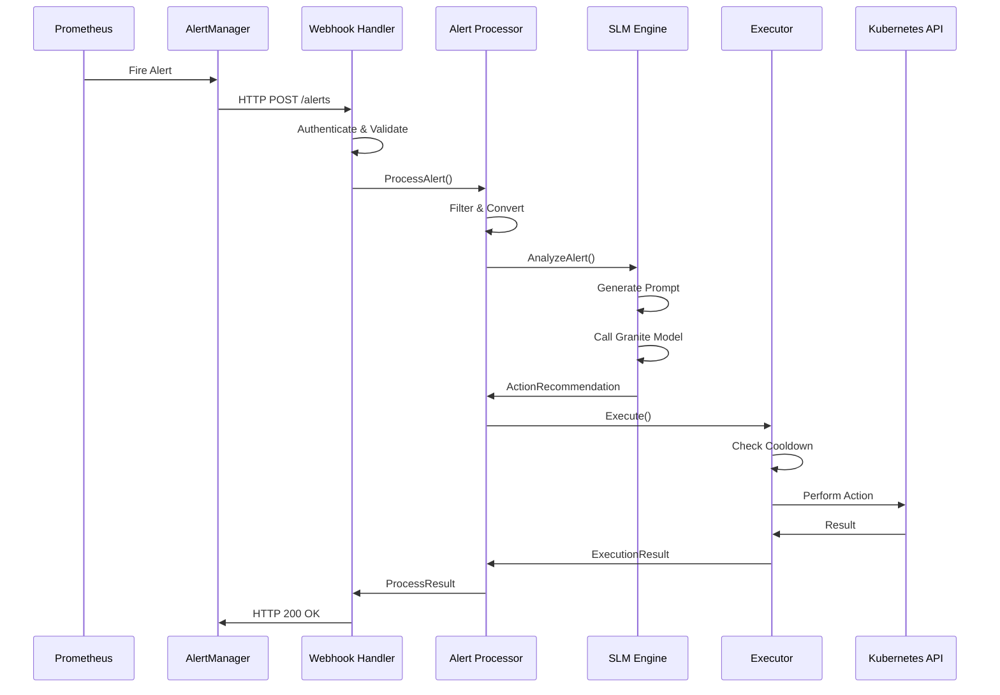

# Prometheus Alerts SLM - Architecture Document

## Executive Summary

The **Prometheus Alerts SLM** is a proof-of-concept application that integrates Prometheus monitoring alerts with IBM Granite Small Language Models (SLM) to provide intelligent, automated remediation actions for Kubernetes/OpenShift clusters. The system receives AlertManager webhooks, analyzes alerts using Granite models via Ollama, and executes recommended actions through Kubernetes APIs.

## Table of Contents

1. [System Overview](#system-overview)
2. [Architecture Design](#architecture-design)
3. [Component Details](#component-details)
4. [Data Flow](#data-flow)
5. [Technology Stack](#technology-stack)
6. [Security Considerations](#security-considerations)
7. [Testing Strategy](#testing-strategy)
8. [Deployment Options](#deployment-options)
9. [Performance Considerations](#performance-considerations)
10. [Future Enhancements](#future-enhancements)

## System Overview

### Purpose
Automate Kubernetes/OpenShift cluster remediation by leveraging AI-powered analysis of Prometheus alerts to recommend and execute appropriate actions.

### Key Features
- 🔗 **AlertManager Integration** - Receives and processes Prometheus webhook alerts
- 🧠 **AI-Powered Analysis** - Uses IBM Granite 3.1 Dense 8B model for intelligent alert analysis
- ⚡ **Automated Actions** - Executes scaling, restart, and resource adjustment operations
- 🚀 **Production Ready** - No mock dependencies, full LocalAI/Ollama integration
- 📊 **Observability** - Logging and Prometheus metrics
- 🔒 **Security** - RBAC integration and secure webhook authentication

### High-Level Architecture

```
┌─────────────────┐    ┌──────────────────┐    ┌───────────────────┐
│   Prometheus    │    │   AlertManager   │    │  Webhook Receiver │
│                 │───▶│                  │───▶│                   │
│ - Metrics       │    │ - Alert Rules    │    │ - Authentication  │
│ - Rule Engine   │    │ - Routing        │    │ - Payload Parsing │
└─────────────────┘    └──────────────────┘    └───────────────────┘
                                                         │
                                                         ▼
┌─────────────────┐    ┌──────────────────┐    ┌───────────────────┐
│ Action Executor │    │   SLM Engine     │    │  Alert Processor  │
│                 │◀───│                  │◀───│                   │
│ - Scaling       │    │ - Granite Model  │    │ - Filtering       │
│ - Restarts      │    │ - Ollama API     │    │ - Conversion      │
│ - Resources     │    │ - Prompt Engine  │    │ - Validation      │
│ - Effectiveness │    │ - MCP Interface  │    │ - History Context │
└─────────────────┘    └──────────────────┘    └───────────────────┘
         │                       │                       │
         ▼                       ▼                       ▼
┌─────────────────┐    ┌──────────────────┐    ┌───────────────────┐
│ External K8s    │    │ Hybrid MCP       │    │ Effectiveness     │
│ MCP Server      │    │ Action History   │    │ Assessment        │
│                 │    │                  │    │                   │
│ - Pod Status    │    │ - JSON + Text    │    │ - Outcome Eval    │
│ - Node Capacity │    │ - Structured     │    │ - Learning Loop   │
│ - Resource Data │    │ - Pattern Data   │    │ - Success Predict │
│ (containers/    │    │ (Our Custom)     │    │                   │
│ k8s-mcp-server) │    └──────────────────┘    └───────────────────┘
└─────────────────┘             │                       │
         │                      ▼                       ▼
         ▼              ┌──────────────────┐    ┌──────────────────┐
┌─────────────────┐     │   PostgreSQL     │    │ Kubernetes API   │
│ Kubernetes API  │     │                  │    │                  │
│                 │     │ - Action History │    │ - Deployments    │
│ - Deployments   │     │ - Pattern Store  │    │ - Pods           │
│ - Pods          │     │ - Effectiveness  │    │ - Resources      │
│ - Resources     │     └──────────────────┘    └──────────────────┘
└─────────────────┘
```

## Architecture Design

### Design Principles

1. **Separation of Concerns**: Each component has a single, well-defined responsibility
2. **Interface-Driven**: Components communicate through well-defined interfaces
3. **Observability**: Logging and metrics at every layer
4. **Security First**: Authentication, authorization, and audit logging
5. **Fail-Safe**: Graceful error handling and dry-run capabilities
6. **Extensibility**: Plugin architecture for new action types and SLM providers

### Component Architecture

```
prometheus-alerts-slm/
├── cmd/                           # Application entry points
│   ├── prometheus-alerts-slm/     # Main application
│   └── test-slm/                  # SLM testing utility
├── pkg/                           # Public packages
│   ├── webhook/                   # HTTP webhook handler
│   ├── processor/                 # Alert processing logic
│   ├── slm/                       # SLM integration
│   ├── executor/                  # Action execution
│   └── mcp/                       # Kubernetes client
├── internal/                      # Private packages
│   ├── config/                    # Configuration management
│   └── metrics/                   # Prometheus metrics
├── test/                          # Test infrastructure
│   ├── fixtures/                  # Test data
│   ├── integration/               # Integration tests
│   ├── e2e/                       # End-to-end tests
│   └── manifests/                 # Test deployments
└── deploy/                        # Deployment manifests
```

## Component Details

### 1. Webhook Handler (`pkg/webhook`)

**Purpose**: Receives and validates AlertManager webhook requests

**Key Components**:
- `Handler` interface - HTTP request handling contract
- `AlertManagerWebhook` - AlertManager payload structure
- `Alert` - Individual alert representation
- `WebhookResponse` - Response format

**Responsibilities**:
- HTTP method validation (POST only)
- Content-Type validation (application/json)
- Authentication (Bearer token support)
- Payload parsing and validation
- Error handling and response formatting

**Configuration**:
```yaml
webhook:
  port: "8080"
  path: "/alerts"
  auth:
    type: "bearer"
    token: "${WEBHOOK_AUTH_TOKEN}"
```

### 2. Alert Processor (`pkg/processor`)

**Purpose**: Filters, validates, and converts AlertManager alerts to internal format

**Key Components**:
- `Processor` interface - Alert processing contract
- `Filter` - Alert filtering logic
- `Converter` - Alert format conversion

**Responsibilities**:
- Alert filtering based on severity, namespace, labels
- Data extraction and normalization
- Alert deduplication
- Conversion to SLM-compatible format

**Processing Logic**:
```go
func (p *processor) ProcessAlert(ctx context.Context, alert Alert) error {
    // 1. Filter alert based on configured rules
    if !p.shouldProcess(alert) {
        return nil
    }

    // 2. Convert to internal format
    slmAlert := p.convertAlert(alert)

    // 3. Send for SLM analysis
    return p.slmClient.AnalyzeAlert(ctx, slmAlert)
}
```

### 3. SLM Integration (`pkg/slm`)

**Purpose**: Interfaces with IBM Granite models via Ollama for intelligent alert analysis

**Key Components**:
- `Client` interface - SLM interaction contract
- `Alert` - SLM input format
- `ActionRecommendation` - SLM output format
- `LocalAIRequest/Response` - Ollama API structures

**Model Configuration**:
```yaml
slm:
  provider: "localai"
  endpoint: "http://localhost:11434"
  model: "granite3.1-dense:8b"
  temperature: 0.3
  max_tokens: 500
  timeout: 30s
  retry_count: 3
```

**Prompt Engineering**:
The system uses carefully crafted prompts to guide the Granite model:

```
<|system|>
You are a Kubernetes operations expert specialized in analyzing alerts and recommending automated remediation actions. Always respond with valid JSON only.

<|user|>
Analyze this Kubernetes alert and recommend an action:

Alert: {alert_name}
Severity: {severity}
Description: {description}
Namespace: {namespace}
Resource: {resource}

Available actions:
- scale_deployment: Scale deployment replicas up or down
- restart_pod: Restart the affected pod(s)
- increase_resources: Increase CPU/memory limits
- notify_only: No automated action, notify operators only

Guidelines:
- For high memory/CPU usage: consider scale_deployment or increase_resources
- For pod crashes/failures: consider restart_pod
- For critical alerts in production: prefer notify_only unless certain
- Include confidence score (0.0-1.0) and reasoning

Respond with valid JSON in this exact format:
{
  "action": "one_of_the_available_actions",
  "parameters": {
    "replicas": 3,
    "cpu_limit": "500m",
    "memory_limit": "1Gi"
  },
  "confidence": 0.85,
  "reasoning": "Brief explanation of why this action was chosen"
}
<|assistant|>
```

### 4. Action Executor (`pkg/executor`)

**Purpose**: Executes recommended actions on Kubernetes clusters

**Key Components**:
- `Executor` interface - Action execution contract
- `ExecutionResult` - Action execution outcome
- Cooldown tracking and concurrency control

**Supported Actions**:

1. **Scale Deployment**
   ```go
   type ScaleAction struct {
       Deployment string `json:"deployment"`
       Namespace  string `json:"namespace"`
       Replicas   int32  `json:"replicas"`
   }
   ```

2. **Restart Pod**
   ```go
   type RestartAction struct {
       Pod       string `json:"pod"`
       Namespace string `json:"namespace"`
   }
   ```

3. **Increase Resources**
   ```go
   type ResourceAction struct {
       Resource   string            `json:"resource"`
       Namespace  string            `json:"namespace"`
       Limits     map[string]string `json:"limits"`
   }
   ```

**Safety Features**:
- **Dry Run Mode**: Test actions without actual execution
- **Cooldown Periods**: Prevent action storms
- **Concurrency Limits**: Control parallel executions
- **Audit Logging**: Track all actions for compliance

### 5. MCP Client (`pkg/mcp`)

**Purpose**: Kubernetes API client implementing Model Context Protocol patterns

**Key Components**:
- `Client` interface - Kubernetes operations contract
- Connection management and authentication
- Resource manipulation methods

**Supported Operations**:
```go
type Client interface {
    GetDeployment(ctx context.Context, namespace, name string) (*appsv1.Deployment, error)
    ScaleDeployment(ctx context.Context, namespace, name string, replicas int32) error
    GetPod(ctx context.Context, namespace, name string) (*corev1.Pod, error)
    DeletePod(ctx context.Context, namespace, name string) error
    UpdatePodResources(ctx context.Context, namespace, name string, resources corev1.ResourceRequirements) error
    ListPodsWithLabel(ctx context.Context, namespace, labelSelector string) (*corev1.PodList, error)
    IsHealthy() bool
}
```

### 6. Configuration Management (`internal/config`)

**Purpose**: Centralized configuration management with environment variable support

**Configuration Structure**:
```go
type Config struct {
    App      AppConfig      `yaml:"app"`
    Webhook  WebhookConfig  `yaml:"webhook"`
    SLM      SLMConfig      `yaml:"slm"`
    Actions  ActionsConfig  `yaml:"actions"`
    OpenShift OpenShiftConfig `yaml:"openshift"`
    Logging  LoggingConfig  `yaml:"logging"`
}
```

**Environment Variable Mapping**:
- `SLM_PROVIDER` → `slm.provider`
- `SLM_ENDPOINT` → `slm.endpoint`
- `SLM_MODEL` → `slm.model`
- `SLM_TEMPERATURE` → `slm.temperature`
- `DRY_RUN` → `actions.dry_run`
- `WEBHOOK_PORT` → `webhook.port`

### 7. Effectiveness Assessment Service (`pkg/effectiveness`)

**Purpose**: Automated evaluation of action outcomes and continuous learning system

**Key Components**:
- `EffectivenessAssessor` interface - Action outcome evaluation contract
- `AssessmentService` - Automated effectiveness scoring and analysis
- `LearningEngine` - Pattern recognition and success prediction

**Core Assessment Logic**:
```go
type EffectivenessAssessor interface {
    AssessAction(ctx context.Context, trace *actionhistory.ResourceActionTrace) (*EffectivenessResult, error)
    PredictSuccess(ctx context.Context, action *types.ActionRecommendation, resource actionhistory.ResourceReference) (float64, error)
    AnalyzePatterns(ctx context.Context, traces []actionhistory.ResourceActionTrace) (*PatternAnalysis, error)
}

type EffectivenessResult struct {
    Score         float64                `json:"score"`          // 0.0-1.0 effectiveness
    Confidence    float64                `json:"confidence"`     // Assessment confidence
    Factors       map[string]float64     `json:"factors"`        // Contributing factors
    Reasoning     string                 `json:"reasoning"`      // AI-generated explanation
    Improvements  []string               `json:"improvements"`   // Suggested optimizations
}
```

**Assessment Criteria**:
- **Problem Resolution** - Did the action solve the original alert?
- **Side Effects** - Were new problems introduced?
- **Resource Efficiency** - Cost/performance impact analysis
- **Time to Resolution** - Speed of problem resolution
- **Stability Impact** - Effect on system stability

### 8. Hybrid MCP Action History Server (`internal/mcp`)

**Purpose**: Model Context Protocol server providing both structured data and human-readable responses

**Implementation**: Dual response format for LLM processing
```go
type MCPToolResponse struct {
    Content []MCPContent `json:"content"`
}

type MCPContent struct {
    Type string      `json:"type"`  // "application/json" or "text"
    Text string      `json:"text,omitempty"`  // Human-readable format
    Data interface{} `json:"data,omitempty"`  // Structured JSON format
}
```

**Structured Response Types**:
```go
// Action History with rich metadata
type ActionHistoryResponse struct {
    ResourceInfo  ResourceInfo    `json:"resource_info"`
    TotalActions  int             `json:"total_actions"`
    Actions       []ActionSummary `json:"actions"`
}

// Oscillation Analysis with numerical precision
type OscillationAnalysisResponse struct {
    ResourceInfo      ResourceInfo                `json:"resource_info"`
    OverallSeverity   string                      `json:"overall_severity"`
    Confidence        float64                     `json:"confidence"`
    ScaleOscillation  *ScaleOscillationPattern    `json:"scale_oscillation,omitempty"`
    SafetyReasoning   string                      `json:"safety_reasoning"`
}

// Safety Check with boolean decision data
type SafetyCheckResponse struct {
    ResourceInfo      ResourceInfo `json:"resource_info"`
    ActionType        string       `json:"action_type"`
    IsSafe            bool         `json:"is_safe"`
    OverallSeverity   string       `json:"overall_severity"`
    Confidence        float64      `json:"confidence"`
    RecommendedAction string       `json:"recommended_action"`
    SafetyReasoning   string       `json:"safety_reasoning"`
}
```

**Benefits for LLM Processing**:
- **Precise Numeric Comparisons** - `confidence >= 0.8` checks
- **Boolean Decision Making** - `is_safe` flag for clear decisions
- **Array Iteration** - Structured loops through pattern data
- **Nested Property Access** - `scale_oscillation.direction_changes`
- **Human Explanation** - Natural language for user communication

### 9. External Kubernetes MCP Server Integration

**Purpose**: Leverage existing production-ready Kubernetes MCP server for real-time cluster state queries

**Implementation**: **containers/kubernetes-mcp-server** (External Service)
```yaml
# Deployment Integration
apiVersion: v1
kind: Pod
spec:
  containers:
  - name: prometheus-alerts-slm
    image: prometheus-alerts-slm:latest
  - name: k8s-mcp-server
    image: ghcr.io/containers/kubernetes-mcp-server:latest
  - name: action-history-mcp
    image: prometheus-alerts-slm-mcp:latest
```

**Key Integration Points**:
- **Multi-Server MCP Client**: Extended to connect to multiple MCP servers
- **External Communication**: HTTP/gRPC connections to external MCP server
- **Tool Discovery**: Dynamic discovery of available tools from external server
- **Error Handling**: Graceful fallback when external server unavailable

**Available Capabilities** (from containers/kubernetes-mcp-server):
```go
type ExternalMCPCapabilities struct {
    PodOperations       []string  // get, list, describe, logs
    NodeOperations      []string  // get, list, describe
    DeploymentOps       []string  // get, list, scale, rollback
    ServiceOperations   []string  // get, list, endpoints
    ConfigMapOps        []string  // get, list, data access
    SecretOperations    []string  // get, list (secure access)
    EventQueries        []string  // recent events, filtering
    ResourceQuotaOps    []string  // usage, limits, availability
    HPAOperations       []string  // current metrics, scaling status
    NamespaceOps        []string  // list, resource usage
    HelmOperations      []string  // chart status, releases
    OpenShiftSupport    bool      // native OpenShift compatibility
}
```

**Benefits of External Server Approach**:
- **Development Time Savings**: 4-5 weeks of implementation time saved
- **Production Readiness**: Battle-tested, community-maintained implementation
- **Security Hardening**: Pre-implemented RBAC and security controls
- **OpenShift Compatibility**: Verified compatibility with our target platform
- **Feature Completeness**: More tools than originally planned
- **Maintenance**: Community support and regular updates

## Data Flow

### Alert Processing Flow



### Data Transformation

1. **AlertManager Webhook** → **Internal Alert**:
   ```json
   {
     "alerts": [{
       "status": "firing",
       "labels": {
         "alertname": "HighMemoryUsage",
         "severity": "warning",
         "namespace": "production",
         "pod": "webapp-123"
       },
       "annotations": {
         "description": "Pod using 95% memory"
       }
     }]
   }
   ```

2. **Internal Alert** → **SLM Input**:
   ```go
   slm.Alert{
       Name:        "HighMemoryUsage",
       Status:      "firing",
       Severity:    "warning",
       Description: "Pod using 95% memory",
       Namespace:   "production",
       Resource:    "webapp-123",
       Labels:      map[string]string{...},
       Annotations: map[string]string{...},
   }
   ```

3. **SLM Output** → **Action Execution**:
   ```json
   {
     "action": "increase_resources",
     "parameters": {
       "memory_limit": "2Gi"
     },
     "confidence": 0.90,
     "reasoning": "Pod is using 95% memory. Increasing limit provides headroom."
   }
   ```

## Technology Stack

### Core Technologies

| Component | Technology | Version | Purpose |
|-----------|------------|---------|---------|
| **Language** | Go | 1.23.9+ | Primary implementation language |
| **SLM Provider** | Ollama | Latest | Local model serving |
| **AI Model** | IBM Granite | 3.1-dense:8b | Alert analysis and recommendations |
| **Container Runtime** | Podman | Latest | Container orchestration |
| **Orchestration** | Kubernetes/OpenShift | 1.27+ | Target platform |
| **Testing Framework** | Ginkgo/Gomega | v2 | BDD testing |
| **HTTP Framework** | Gorilla Mux | Latest | HTTP routing |
| **Logging** | Logrus | Latest | Structured logging |

### Dependencies

```go
// Core Dependencies
k8s.io/client-go         // Kubernetes API client
k8s.io/apimachinery      // Kubernetes types
github.com/sirupsen/logrus // Logging
github.com/gorilla/mux   // HTTP routing

// Testing Dependencies
github.com/onsi/ginkgo/v2  // BDD testing framework
github.com/onsi/gomega     // Assertion library
```

### Build Tools

- **Make** - Build automation
- **KinD** - Local Kubernetes testing
- **Podman** - Container builds
- **golangci-lint** - Code linting

## Security Considerations

### Authentication & Authorization

1. **Webhook Authentication**:
   - Bearer token validation
   - Configurable authentication types
   - Request source validation

2. **Kubernetes RBAC**:
   ```yaml
   apiVersion: rbac.authorization.k8s.io/v1
   kind: ClusterRole
   metadata:
     name: prometheus-alerts-slm
   rules:
   - apiGroups: ["apps"]
     resources: ["deployments"]
     verbs: ["get", "list", "patch", "update"]
   - apiGroups: [""]
     resources: ["pods"]
     verbs: ["get", "list", "delete"]
   ```

3. **Service Account**:
   - Dedicated service account with minimal permissions
   - Token-based authentication
   - Namespace-scoped where possible

### Data Security

1. **Secrets Management**:
   - No hardcoded credentials
   - Environment variable configuration
   - Kubernetes secrets integration

2. **Communication Security**:
   - TLS for external communications
   - Secure service-to-service communication
   - Network policies for isolation

3. **Audit & Compliance**:
   - Audit logging
   - Action tracking and attribution
   - Retention policy compliance

### Operational Security

1. **Input Validation**:
   - Strict payload validation
   - SQL injection prevention
   - XSS protection

2. **Rate Limiting**:
   - Request rate limiting
   - Action execution throttling
   - Resource usage monitoring

3. **Error Handling**:
   - No sensitive data in error messages
   - Graceful degradation
   - Security event logging

## Testing Strategy

### Test Pyramid

```
               ┌─────────────────┐
               │   E2E Tests     │ ← Full system with KinD + Monitoring
               │                 │
               └─────────────────┘
              ┌───────────────────┐
              │ Integration Tests │ ← Component interactions
              │                   │
              └───────────────────┘
             ┌─────────────────────┐
             │    Unit Tests       │ ← Individual components
             │                     │
             └─────────────────────┘
```

### Testing Framework
The project uses **Ginkgo v2** and **Gomega** for all testing with modular organization by functional areas.

### Test Categories

1. **Unit Tests** (`pkg/*_test.go`):
   - Individual component testing with fake Kubernetes client API
   - Interface contract validation and error condition handling

2. **Integration Tests** (`test/integration/`):
   - 8 focused test modules organized by action category
   - Real SLM integration with Ollama/Granite models
   - 25+ remediation actions across all categories
   - Build tag: `//go:build integration`

3. **End-to-End Tests** (`test/e2e/`):
   - KinD cluster setup scripts and configuration (implemented)
   - Complete alert processing workflows (planned)
   - Full monitoring stack integration (in development)
   - Build tag: `//go:build e2e`

### KinD Testing Infrastructure

**Cluster Setup** (Available):
```bash
# Automated KinD cluster setup
make setup-kind

# Components ready for deployment:
# - KinD cluster with monitoring configuration
# - Test manifests for Prometheus/AlertManager
# - RBAC and monitoring stack preparation
```

**Monitoring Stack** (In Development):
- Prometheus server deployment
- AlertManager configuration
- Kube-state-metrics integration
- Test alert rules and synthetic alerts

### Testing Commands

```bash
# Unit tests (all packages) with Ginkgo
go test ./...

# Integration tests with Ollama using Ginkgo
make test-integration

# Run specific action category tests
go test -tags=integration -ginkgo.focus="Storage and Persistence Actions" ./test/integration/
go test -tags=integration -ginkgo.focus="Security and Compliance Actions" ./test/integration/

# Integration tests with specific model
OLLAMA_ENDPOINT=http://localhost:11434 OLLAMA_MODEL=granite3.1-dense:8b \
go test -v -tags=integration ./test/integration/...

# Quick integration tests (skip slow scenarios)
SKIP_SLOW_TESTS=true make test-integration

# Validate integration test environment
make validate-integration

# Database integration tests with MCP context
make test-database-integration

# E2E tests with KinD (in development)
# make test-e2e-kind

# Monitoring stack E2E (in development)
# make test-e2e-monitoring

# Coverage report with Ginkgo
make test-coverage
```

## Deployment Options

### 1. Kubernetes Native with External MCP Server

```yaml
# deploy/manifests/deployment.yaml
apiVersion: apps/v1
kind: Deployment
metadata:
  name: prometheus-alerts-slm
spec:
  replicas: 2
  selector:
    matchLabels:
      app: prometheus-alerts-slm
  template:
    spec:
      serviceAccountName: prometheus-alerts-slm
      containers:
      - name: prometheus-alerts-slm
        image: quay.io/jordigilh/prometheus-alerts-slm:latest
        env:
        - name: SLM_PROVIDER
          value: "localai"
        - name: SLM_ENDPOINT
          value: "http://ollama-service:11434"
        - name: MCP_K8S_SERVER
          value: "http://localhost:8080"
      - name: k8s-mcp-server
        image: ghcr.io/containers/kubernetes-mcp-server:latest
        ports:
        - containerPort: 8080
        env:
        - name: MCP_PORT
          value: "8080"
        - name: KUBECONFIG
          value: "/var/run/secrets/kubernetes.io/serviceaccount"
      - name: action-history-mcp
        image: quay.io/jordigilh/prometheus-alerts-slm-mcp:latest
        ports:
        - containerPort: 8081
        env:
        - name: DATABASE_HOST
          valueFrom:
            secretKeyRef:
              name: database-secret
              key: host
```

### 2. OpenShift Deployment

```yaml
# OpenShift-specific features
apiVersion: apps.openshift.io/v1
kind: DeploymentConfig
metadata:
  name: prometheus-alerts-slm
spec:
  triggers:
  - type: ImageChange
    imageChangeParams:
      automatic: true
      containerNames:
      - prometheus-alerts-slm
      from:
        kind: ImageStreamTag
        name: prometheus-alerts-slm:latest
```

### 3. Helm Chart

```yaml
# charts/prometheus-alerts-slm/values.yaml
replicaCount: 2

image:
  repository: quay.io/jordigilh/prometheus-alerts-slm
  tag: latest
  pullPolicy: IfNotPresent

slm:
  provider: "localai"
  endpoint: "http://ollama-service:11434"
  model: "granite3.1-dense:8b"

actions:
  dryRun: false
  maxConcurrent: 5
  cooldownPeriod: "5m"
```

### 4. Development Setup

```bash
# Local development
export SLM_PROVIDER="localai"
export SLM_ENDPOINT="http://localhost:11434"
export SLM_MODEL="granite3.1-dense:8b"
export DRY_RUN="true"

# Start Ollama
ollama serve &
ollama pull granite3.1-dense:8b

# Run application
make build && ./bin/prometheus-alerts-slm
```

## Performance Considerations

### Scalability

1. **Horizontal Scaling**:
   - Stateless application design
   - Multiple replica support
   - Load balancing compatible

2. **Vertical Scaling**:
   - Configurable resource limits
   - Memory and CPU optimization
   - Garbage collection tuning

### Performance Optimizations

1. **SLM Integration**:
   - Connection pooling
   - Response caching (5-minute window)
   - Timeout and retry configuration

2. **Kubernetes API**:
   - Client-side rate limiting
   - Watch API for efficiency
   - Resource-specific clients

3. **Concurrency**:
   - Configurable worker pools
   - Action execution limits
   - Context-based cancellation

### Monitoring & Metrics

**Prometheus Metrics**:
```go
// Custom metrics
alerts_received_total{severity, namespace}
alerts_processed_total{action, status}
slm_requests_duration_seconds{model}
k8s_actions_total{type, result}
```

**Health Checks**:
- `/health` - Application health
- `/ready` - Readiness probe
- `/metrics` - Prometheus metrics

## Future Enhancements

### Short Term (3-6 months)

1. **Enhanced SLM Integration**:
   - Support for multiple SLM providers
   - Model A/B testing capabilities
   - Response quality metrics

2. **Extended Actions**:
   - Custom script execution
   - Multi-step workflows
   - Rollback capabilities

3. **Improved Observability**:
   - Distributed tracing
   - Enhanced dashboards
   - Alert correlation

### Medium Term (6-12 months)

1. **InstructLab Integration**:
   - Custom model training
   - Domain-specific fine-tuning
   - Performance optimization

2. **Machine Learning Pipeline**:
   - Automated model retraining
   - Performance feedback loops
   - Anomaly detection

3. **Enterprise Features**:
   - Multi-tenancy support
   - Enhanced RBAC
   - Compliance reporting

### Long Term (12+ months)

1. **AI-Powered Operations**:
   - Predictive alerting
   - Capacity planning
   - Automated SLO optimization

2. **Platform Integration**:
   - GitOps workflows
   - CI/CD integration
   - Policy-as-code

3. **Extended Analytics**:
   - Alert pattern analysis
   - Cost optimization
   - Performance insights

## Conclusion

The Prometheus Alerts SLM proof-of-concept demonstrates the potential for AI-powered automated operations in Kubernetes environments. By combining proven monitoring tools (Prometheus/AlertManager) with language models (IBM Granite), the system provides intelligent, context-aware remediation capabilities.

The architecture emphasizes modularity, security, and observability while maintaining the flexibility to evolve with advancing AI capabilities. The testing infrastructure ensures reliability and enables confident deployment in production environments.

### Integration with External MCP Servers

A key architectural decision was to leverage the existing **containers/kubernetes-mcp-server** instead of implementing a custom Kubernetes MCP server. This approach provides:

- **Accelerated Development**: 4-5 weeks of development time saved
- **Production Readiness**: Mature, community-maintained implementation
- **OpenShift Compatibility**: Verified support for our target platform
- **Enhanced Security**: Pre-implemented RBAC and security controls
- **Extended Capabilities**: More functionality than originally planned

The hybrid approach of using both custom MCP servers (for action history and effectiveness assessment) and external MCP servers (for cluster state queries) demonstrates how modular architecture enables leveraging existing solutions while maintaining innovation in core differentiating features.

This foundation provides a solid platform for exploring the future of AI-powered infrastructure operations, with clear paths for enhancement and integration into existing operational workflows.

---

*This architecture document reflects the current implementation as of August 2025. For the latest updates and implementation details, refer to the project repository and WARP.md guidance document.*