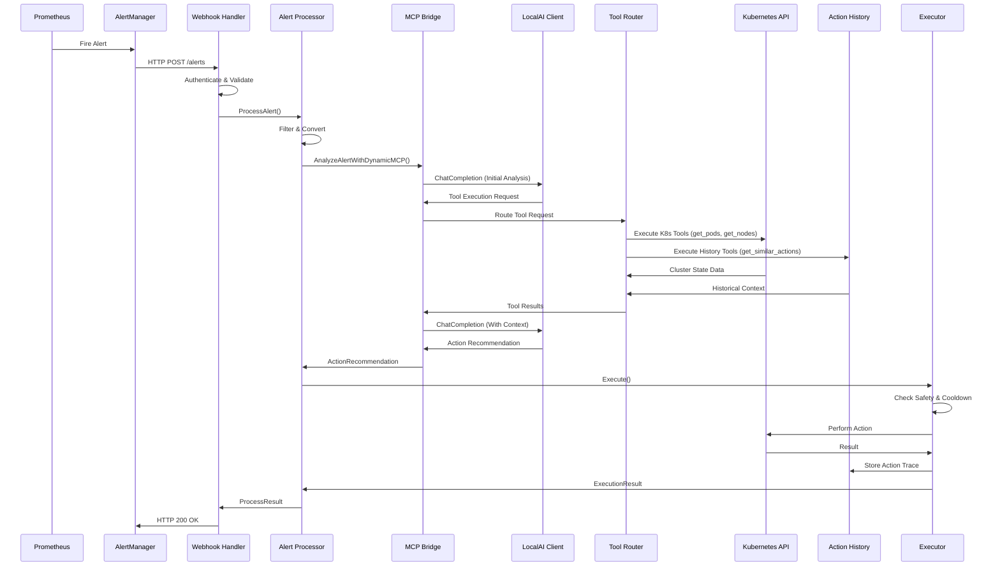

# Prometheus Alerts SLM - Architecture Document

## Overview

The Prometheus Alerts SLM integrates Prometheus monitoring alerts with IBM Granite Small Language Models (SLM) to provide automated remediation actions for Kubernetes/OpenShift clusters. The system receives AlertManager webhooks, analyzes alerts using Granite models via Ollama, and executes recommended actions through Kubernetes APIs.

## Table of Contents

1. [System Overview](#system-overview)
2. [Architecture Design](#architecture-design)
3. [Component Details](#component-details)
4. [Data Flow](#data-flow)
5. [Technology Stack](#technology-stack)
6. [Security Considerations](#security-considerations)
7. [Testing Strategy](#testing-strategy)
8. [Deployment Options](#deployment-options)
9. [Performance Considerations](#performance-considerations)
10. [Future Enhancements](#future-enhancements)

## System Overview

### Purpose
Automate Kubernetes/OpenShift cluster remediation through analysis of Prometheus alerts to recommend and execute appropriate actions.

### Key Features
- **AlertManager Integration** - Receives and processes Prometheus webhook alerts
- **MCP Bridge Architecture** - Central orchestration with dynamic tool calling
- **Language Model Analysis** - Uses IBM Granite 3.1 Dense 8B model via LocalAI
- **Dynamic Tool Execution** - Real-time Kubernetes and history context gathering
- **Automated Actions** - 25+ Kubernetes remediation actions with safety controls
- **Oscillation Prevention** - SQL-based pattern detection and action loop prevention
- **Effectiveness Assessment** - Framework for monitoring-based outcome evaluation
- **Observability** - Comprehensive logging and Prometheus metrics

### High-Level Architecture

```
┌─────────────────┐    ┌──────────────────┐    ┌───────────────────┐
│   Prometheus    │    │   AlertManager   │    │  Webhook Receiver │
│                 │───▶│                  │───▶│                   │
│ - Metrics       │    │ - Alert Rules    │    │ - Authentication  │
│ - Rule Engine   │    │ - Routing        │    │ - Payload Parsing │
└─────────────────┘    └──────────────────┘    └───────────────────┘
                                                         │
                                                         ▼
┌─────────────────┐                           ┌───────────────────┐
│ Action Executor │                           │  Alert Processor  │
│                 │                           │                   │
│ - Scaling       │◀──────────────────────────│ - Filtering       │
│ - Restarts      │                           │ - Conversion      │
│ - Resources     │                           │ - Validation      │
│ - Safety Check  │                           │ - History Context │
└─────────────────┘                           └───────────────────┘
         │                                             │
         ▼                                             ▼
┌─────────────────┐                           ┌───────────────────┐
│ Kubernetes API  │    ┌──────────────────┐   │    MCP Bridge     │
│                 │    │   PostgreSQL     │   │                   │
│ - Deployments   │    │                  │   │ - Tool Router     │
│ - Pods          │    │ - Action History │   │ - LocalAI Client  │
│ - Resources     │    │ - Pattern Store  │   │ - K8s Tools       │
│ - Events        │    │ - Effectiveness  │   │ - History Tools   │
└─────────────────┘    └──────────────────┘   │ - Multi-turn Conv │
         ▲                       ▲             └───────────────────┘
         │                       │                       │
         └───────────────────────┴───────────────────────┘
                                 │
                                 ▼
                        ┌──────────────────┐
                        │ Effectiveness    │
                        │ Assessment       │
                        │                  │
                        │ - Framework      │
                        │ - Stub Clients   │
                        │ - Pattern Learn  │
                        └──────────────────┘
```

## Architecture Design

### Design Principles

1. **Separation of Concerns**: Each component has a single, well-defined responsibility
2. **Interface-Driven**: Components communicate through well-defined interfaces
3. **Observability**: Logging and metrics at every layer
4. **Security First**: Authentication, authorization, and audit logging
5. **Fail-Safe**: Graceful error handling and dry-run capabilities
6. **Extensibility**: Plugin architecture for new action types and SLM providers

### Component Architecture

```
prometheus-alerts-slm/
├── cmd/                           # Application entry points
│   ├── prometheus-alerts-slm/     # Main application
│   └── test-slm/                  # SLM testing utility
├── pkg/                           # Public packages
│   ├── webhook/                   # HTTP webhook handler
│   ├── processor/                 # Alert processing logic
│   ├── slm/                       # SLM integration + MCP Bridge
│   ├── executor/                  # Action execution
│   ├── k8s/                       # Kubernetes client (unified)
│   ├── effectiveness/             # Effectiveness assessment
│   ├── monitoring/                # Monitoring interfaces + stubs
│   └── types/                     # Core type definitions
├── internal/                      # Private packages
│   ├── config/                    # Configuration management
│   ├── metrics/                   # Prometheus metrics
│   ├── actionhistory/             # Action history repository
│   └── mcp/                       # Action History MCP server
├── test/                          # Test infrastructure
│   ├── fixtures/                  # Test data
│   ├── integration/               # Integration tests
│   │   ├── shared/                # Shared test utilities
│   │   ├── infrastructure/        # Infrastructure tests
│   │   └── model_comparison/      # Model evaluation tests
│   ├── e2e/                       # End-to-end tests
│   └── manifests/                 # Test deployments
└── deploy/                        # Deployment manifests
```

## Component Details

### 1. Webhook Handler (`pkg/webhook`)

**Purpose**: Receives and validates AlertManager webhook requests

**Key Components**:
- `Handler` interface - HTTP request handling contract
- `AlertManagerWebhook` - AlertManager payload structure
- `Alert` - Individual alert representation
- `WebhookResponse` - Response format

**Responsibilities**:
- HTTP method validation (POST only)
- Content-Type validation (application/json)
- Authentication (Bearer token support)
- Payload parsing and validation
- Error handling and response formatting

**Configuration**:
```yaml
webhook:
  port: "8080"
  path: "/alerts"
  auth:
    type: "bearer"
    token: "${WEBHOOK_AUTH_TOKEN}"
```

### 2. Alert Processor (`pkg/processor`)

**Purpose**: Filters, validates, and converts AlertManager alerts to internal format

**Key Components**:
- `Processor` interface - Alert processing contract
- `Filter` - Alert filtering logic
- `Converter` - Alert format conversion

**Responsibilities**:
- Alert filtering based on severity, namespace, labels
- Data extraction and normalization
- Alert deduplication
- Conversion to SLM-compatible format

**Processing Logic**:
```go
func (p *processor) ProcessAlert(ctx context.Context, alert Alert) error {
    // 1. Filter alert based on configured rules
    if !p.shouldProcess(alert) {
        return nil
    }

    // 2. Convert to internal format
    slmAlert := p.convertAlert(alert)

    // 3. Send for SLM analysis
    return p.slmClient.AnalyzeAlert(ctx, slmAlert)
}
```

### 3. SLM Integration & MCP Bridge (`pkg/slm`)

**Purpose**: Central orchestration for IBM Granite model interactions with dynamic tool calling

**Key Components**:
- `Client` interface - Traditional SLM interaction contract
- `MCPBridge` struct - Core orchestration component for tool-based interactions
- `LocalAIClient` - HTTP client for LocalAI/Ollama integration
- `ActionHistoryMCPServer` - Internal action history service
- `extractJSONFromResponse` - Robust JSON parsing from mixed model responses

**Model Configuration**:
```yaml
slm:
  provider: "localai"
  endpoint: "http://localhost:11434"
  model: "granite3.1-dense:8b"
  temperature: 0.3
  max_tokens: 500
  timeout: 30s
  retry_count: 3
```

**Prompt Engineering**:
The system uses carefully crafted prompts to guide the Granite model:

```
<|system|>
You are a Kubernetes operations expert specialized in analyzing alerts and recommending automated remediation actions. Always respond with valid JSON only.

<|user|>
Analyze this Kubernetes alert and recommend an action:

Alert: {alert_name}
Severity: {severity}
Description: {description}
Namespace: {namespace}
Resource: {resource}

Available actions:
- scale_deployment: Scale deployment replicas up or down
- restart_pod: Restart the affected pod(s)
- increase_resources: Increase CPU/memory limits
- notify_only: No automated action, notify operators only

Guidelines:
- For high memory/CPU usage: consider scale_deployment or increase_resources
- For pod crashes/failures: consider restart_pod
- For critical alerts in production: prefer notify_only unless certain
- Include confidence score (0.0-1.0) and reasoning

Respond with valid JSON in this exact format:
{
  "action": "one_of_the_available_actions",
  "parameters": {
    "replicas": 3,
    "cpu_limit": "500m",
    "memory_limit": "1Gi"
  },
  "confidence": 0.85,
  "reasoning": "Brief explanation of why this action was chosen"
}
<|assistant|>
```

### 4. Action Executor (`pkg/executor`)

**Purpose**: Executes recommended actions on Kubernetes clusters

**Key Components**:
- `Executor` interface - Action execution contract
- `ExecutionResult` - Action execution outcome
- Cooldown tracking and concurrency control

**Supported Actions**:

1. **Scale Deployment**
   ```go
   type ScaleAction struct {
       Deployment string `json:"deployment"`
       Namespace  string `json:"namespace"`
       Replicas   int32  `json:"replicas"`
   }
   ```

2. **Restart Pod**
   ```go
   type RestartAction struct {
       Pod       string `json:"pod"`
       Namespace string `json:"namespace"`
   }
   ```

3. **Increase Resources**
   ```go
   type ResourceAction struct {
       Resource   string            `json:"resource"`
       Namespace  string            `json:"namespace"`
       Limits     map[string]string `json:"limits"`
   }
   ```

**Safety Features**:
- **Dry Run Mode**: Test actions without actual execution
- **Cooldown Periods**: Prevent action storms
- **Concurrency Limits**: Control parallel executions
- **Audit Logging**: Track all actions for compliance

### 5. Kubernetes Client (`pkg/k8s`)

**Purpose**: Unified Kubernetes API client with comprehensive resource management

**Key Components**:
- `Client` interface (BasicClient) - Kubernetes operations contract
- `UnifiedClient` struct - Concrete implementation with client-go integration
- Connection management with in-cluster and kubeconfig support
- Resource manipulation and query methods

**Supported Operations**:
```go
type Client interface {
    // Deployment operations
    GetDeployment(ctx context.Context, namespace, name string) (*appsv1.Deployment, error)
    ScaleDeployment(ctx context.Context, namespace, name string, replicas int32) error

    // Pod operations
    GetPod(ctx context.Context, namespace, name string) (*corev1.Pod, error)
    ListPods(ctx context.Context, namespace string, options metav1.ListOptions) (*corev1.PodList, error)
    DeletePod(ctx context.Context, namespace, name string) error

    // Node and cluster operations
    ListNodes(ctx context.Context) (*corev1.NodeList, error)
    GetEvents(ctx context.Context, namespace string) (*corev1.EventList, error)
    GetResourceQuotas(ctx context.Context, namespace string) (*corev1.ResourceQuotaList, error)

    // Health and connectivity
    IsHealthy() bool
    AuditLogs(ctx context.Context, options AuditLogOptions) ([]byte, error)
}
```

### 6. Configuration Management (`internal/config`)

**Purpose**: Centralized configuration management with environment variable support

**Configuration Structure**:
```go
type Config struct {
    App      AppConfig      `yaml:"app"`
    Webhook  WebhookConfig  `yaml:"webhook"`
    SLM      SLMConfig      `yaml:"slm"`
    Actions  ActionsConfig  `yaml:"actions"`
    OpenShift OpenShiftConfig `yaml:"openshift"`
    Logging  LoggingConfig  `yaml:"logging"`
}
```

**Environment Variable Mapping**:
- `SLM_PROVIDER` → `slm.provider`
- `SLM_ENDPOINT` → `slm.endpoint`
- `SLM_MODEL` → `slm.model`
- `SLM_TEMPERATURE` → `slm.temperature`
- `DRY_RUN` → `actions.dry_run`
- `WEBHOOK_PORT` → `webhook.port`

### 7. Effectiveness Assessment Service (`pkg/effectiveness`)

**Purpose**: Framework for evaluating action outcomes (currently using stub monitoring clients)

**Current Implementation Status**: Framework complete, monitoring integrations pending

**Key Components**:
- `Assessor` struct - Core effectiveness evaluation service
- `EffectivenessFactors` - Multi-factor assessment calculation
- **Stub Monitoring Clients** - Simple heuristics pending real integrations

**Core Assessment Logic**:
```go
type Assessor struct {
    repo               actionhistory.Repository
    alertClient        monitoring.AlertClient        // Currently: StubAlertClient
    metricsClient      monitoring.MetricsClient      // Currently: StubMetricsClient
    sideEffectDetector monitoring.SideEffectDetector // Currently: StubSideEffectDetector
    log                *logrus.Logger
}

type EffectivenessFactors struct {
    AlertResolved       bool    `json:"alert_resolved"`
    AlertRecurred       bool    `json:"alert_recurred"`
    MetricsImproved     bool    `json:"metrics_improved"`
    SideEffectsDetected bool    `json:"side_effects_detected"`
    ResourceStabilized  bool    `json:"resource_stabilized"`
    EffectivenessScore  float64 `json:"effectiveness_score"`
    AssessmentNotes     string  `json:"assessment_notes"`
}
```

**Assessment Implementation Status**:
- **✅ Framework**: Complete scoring algorithms and database integration
- **⚠️ Monitoring Integration**: Using stub clients with simple heuristics
- **❌ Production Ready**: Requires real Prometheus/AlertManager integration

**Pending Integrations** (See Roadmap 1.2):
- **AlertManager API client** for real alert resolution checking
- **Prometheus metrics client** for actual improvement validation
- **Side effect monitoring** with cluster event correlation

### 8. Action History MCP Server (`internal/mcp`)

**Purpose**: Internal MCP server providing action history data with both structured and human-readable responses

**Implementation**: Integrated server accessed through MCP Bridge
```go
type ActionHistoryMCPServer struct {
    repository actionhistory.Repository
    logger     *logrus.Logger
}

type MCPToolResponse struct {
    Content []MCPContent `json:"content"`
}

type MCPContent struct {
    Type string      `json:"type"`  // "application/json" or "text"
    Text string      `json:"text,omitempty"`  // Human-readable format
    Data interface{} `json:"data,omitempty"`  // Structured JSON format
}
```

**Structured Response Types**:
```go
// Action History with rich metadata
type ActionHistoryResponse struct {
    ResourceInfo  ResourceInfo    `json:"resource_info"`
    TotalActions  int             `json:"total_actions"`
    Actions       []ActionSummary `json:"actions"`
}

// Oscillation Analysis with numerical precision
type OscillationAnalysisResponse struct {
    ResourceInfo      ResourceInfo                `json:"resource_info"`
    OverallSeverity   string                      `json:"overall_severity"`
    Confidence        float64                     `json:"confidence"`
    ScaleOscillation  *ScaleOscillationPattern    `json:"scale_oscillation,omitempty"`
    SafetyReasoning   string                      `json:"safety_reasoning"`
}

// Safety Check with boolean decision data
type SafetyCheckResponse struct {
    ResourceInfo      ResourceInfo `json:"resource_info"`
    ActionType        string       `json:"action_type"`
    IsSafe            bool         `json:"is_safe"`
    OverallSeverity   string       `json:"overall_severity"`
    Confidence        float64      `json:"confidence"`
    RecommendedAction string       `json:"recommended_action"`
    SafetyReasoning   string       `json:"safety_reasoning"`
}
```

**Benefits for LLM Processing**:
- **Precise Numeric Comparisons** - `confidence >= 0.8` checks
- **Boolean Decision Making** - `is_safe` flag for clear decisions
- **Array Iteration** - Structured loops through pattern data
- **Nested Property Access** - `scale_oscillation.direction_changes`
- **Human Explanation** - Natural language for user communication

### 9. MCP Bridge Architecture

**Purpose**: Central orchestration component that coordinates between language models and available tools

**Implementation**: Core component managing dynamic tool calling and multi-turn conversations
```go
type MCPBridge struct {
    localAIClient       LocalAIClientInterface
    actionHistoryServer ActionHistoryMCPServerInterface
    k8sClient           k8s.Client
    logger              *logrus.Logger
    config              MCPBridgeConfig
}
```

**Key Capabilities**:
- **Tool Router**: Routes tool execution requests to appropriate handlers
- **Multi-turn Conversations**: Manages context across multiple model interactions
- **Dynamic Tool Execution**: Real-time cluster state and history queries
- **JSON Response Parsing**: Robust parsing of LocalAI model responses
- **Error Handling**: Graceful degradation with comprehensive fallback mechanisms

**Available Tool Categories**:
```go
type ToolCategories struct {
    KubernetesTools     []string  // get_pods, get_nodes, get_events, get_deployments
    HistoryTools        []string  // get_action_history, check_oscillation, get_similar_actions
    SafetyTools         []string  // check_action_safety, validate_resource_state
    AnalysisTools       []string  // analyze_resource_patterns, assess_cluster_health
}
```

**Architecture Benefits**:
- **Single Container Deployment**: Simplified deployment and management
- **Direct K8s Integration**: No external dependencies for cluster operations
- **Integrated Action History**: Built-in MCP server for historical data
- **Performance Optimization**: Local tool execution without network overhead
- **Security**: No external service communication required
- **Maintainability**: Single codebase for all MCP functionality

## Data Flow

### Alert Processing Flow



### Data Transformation

1. **AlertManager Webhook** → **Internal Alert**:
   ```json
   {
     "alerts": [{
       "status": "firing",
       "labels": {
         "alertname": "HighMemoryUsage",
         "severity": "warning",
         "namespace": "production",
         "pod": "webapp-123"
       },
       "annotations": {
         "description": "Pod using 95% memory"
       }
     }]
   }
   ```

2. **Internal Alert** → **SLM Input**:
   ```go
   slm.Alert{
       Name:        "HighMemoryUsage",
       Status:      "firing",
       Severity:    "warning",
       Description: "Pod using 95% memory",
       Namespace:   "production",
       Resource:    "webapp-123",
       Labels:      map[string]string{...},
       Annotations: map[string]string{...},
   }
   ```

3. **SLM Output** → **Action Execution**:
   ```json
   {
     "action": "increase_resources",
     "parameters": {
       "memory_limit": "2Gi"
     },
     "confidence": 0.90,
     "reasoning": "Pod is using 95% memory. Increasing limit provides headroom."
   }
   ```

## Technology Stack

### Core Technologies

| Component | Technology | Version | Purpose |
|-----------|------------|---------|---------|
| **Language** | Go | 1.23.9+ | Primary implementation language |
| **SLM Provider** | Ollama | Latest | Local model serving |
| **AI Model** | IBM Granite | 3.1-dense:8b | Alert analysis and recommendations |
| **Container Runtime** | Podman | Latest | Container orchestration |
| **Orchestration** | Kubernetes/OpenShift | 1.27+ | Target platform |
| **Testing Framework** | Ginkgo/Gomega | v2 | BDD testing |
| **HTTP Framework** | Gorilla Mux | Latest | HTTP routing |
| **Logging** | Logrus | Latest | Structured logging |

### Dependencies

```go
// Core Dependencies
k8s.io/client-go         // Kubernetes API client
k8s.io/apimachinery      // Kubernetes types
github.com/sirupsen/logrus // Logging
github.com/gorilla/mux   // HTTP routing

// Testing Dependencies
github.com/onsi/ginkgo/v2  // BDD testing framework
github.com/onsi/gomega     // Assertion library
```

### Build Tools

- **Make** - Build automation
- **KinD** - Local Kubernetes testing
- **Podman** - Container builds
- **golangci-lint** - Code linting

## Security Considerations

### Authentication & Authorization

1. **Webhook Authentication**:
   - Bearer token validation
   - Configurable authentication types
   - Request source validation

2. **Kubernetes RBAC**:
   ```yaml
   apiVersion: rbac.authorization.k8s.io/v1
   kind: ClusterRole
   metadata:
     name: prometheus-alerts-slm
   rules:
   - apiGroups: ["apps"]
     resources: ["deployments"]
     verbs: ["get", "list", "patch", "update"]
   - apiGroups: [""]
     resources: ["pods"]
     verbs: ["get", "list", "delete"]
   ```

3. **Service Account**:
   - Dedicated service account with minimal permissions
   - Token-based authentication
   - Namespace-scoped where possible

### Data Security

1. **Secrets Management**:
   - No hardcoded credentials
   - Environment variable configuration
   - Kubernetes secrets integration

2. **Communication Security**:
   - TLS for external communications
   - Secure service-to-service communication
   - Network policies for isolation

3. **Audit & Compliance**:
   - Audit logging
   - Action tracking and attribution
   - Retention policy compliance

### Operational Security

1. **Input Validation**:
   - Strict payload validation
   - SQL injection prevention
   - XSS protection

2. **Rate Limiting**:
   - Request rate limiting
   - Action execution throttling
   - Resource usage monitoring

3. **Error Handling**:
   - No sensitive data in error messages
   - Graceful degradation
   - Security event logging

## Testing Strategy

### Test Pyramid

```
               ┌─────────────────┐
               │   E2E Tests     │ ← Full system with KinD + Monitoring
               │                 │
               └─────────────────┘
              ┌───────────────────┐
              │ Integration Tests │ ← Component interactions
              │                   │
              └───────────────────┘
             ┌─────────────────────┐
             │    Unit Tests       │ ← Individual components
             │                     │
             └─────────────────────┘
```

### Testing Framework
The project uses **Ginkgo v2** and **Gomega** for all testing with modular organization by functional areas.

### Test Categories

1. **Unit Tests** (`pkg/*_test.go`):
   - Individual component testing with fake Kubernetes client API
   - Interface contract validation and error condition handling

2. **Integration Tests** (`test/integration/`):
   - 8 focused test modules organized by action category
   - Real SLM integration with Ollama/Granite models
   - 25+ remediation actions across all categories
   - Build tag: `//go:build integration`

3. **End-to-End Tests** (`test/e2e/`):
   - KinD cluster setup scripts and configuration (implemented)
   - Complete alert processing workflows (planned)
   - Full monitoring stack integration (in development)
   - Build tag: `//go:build e2e`

### KinD Testing Infrastructure

**Cluster Setup** (Available):
```bash
# Automated KinD cluster setup
make setup-kind

# Components ready for deployment:
# - KinD cluster with monitoring configuration
# - Test manifests for Prometheus/AlertManager
# - RBAC and monitoring stack preparation
```

**Monitoring Stack** (In Development):
- Prometheus server deployment
- AlertManager configuration
- Kube-state-metrics integration
- Test alert rules and synthetic alerts

### Testing Commands

```bash
# Unit tests (all packages) with Ginkgo
go test ./...

# Integration tests with MCP Bridge and Ollama
make test-integration

# Run specific action category tests
go test -tags=integration -ginkgo.focus="Storage and Persistence Actions" ./test/integration/
go test -tags=integration -ginkgo.focus="Security and Compliance Actions" ./test/integration/

# Integration tests with specific model
OLLAMA_ENDPOINT=http://localhost:11434 OLLAMA_MODEL=granite3.1-dense:8b \
go test -v -tags=integration ./test/integration/...

# MCP Bridge specific tests
go test -v ./pkg/slm/mcp_bridge_test.go

# Model comparison tests
make model-comparison-demo

# Quick integration tests (skip slow scenarios)
SKIP_SLOW_TESTS=true make test-integration

# Validate integration test environment
make validate-integration

# Database integration tests with action history
make test-database-integration

# E2E tests with KinD (in development)
# make test-e2e-kind

# Coverage report with Ginkgo
make test-coverage
```

## Deployment Options

### 1. Kubernetes Native Deployment

```yaml
# deploy/manifests/deployment.yaml
apiVersion: apps/v1
kind: Deployment
metadata:
  name: prometheus-alerts-slm
spec:
  replicas: 2
  selector:
    matchLabels:
      app: prometheus-alerts-slm
  template:
    spec:
      serviceAccountName: prometheus-alerts-slm
      containers:
      - name: prometheus-alerts-slm
        image: quay.io/jordigilh/prometheus-alerts-slm:latest
        ports:
        - containerPort: 8080
          name: webhook
        - containerPort: 8090
          name: metrics
        env:
        - name: SLM_PROVIDER
          value: "localai"
        - name: SLM_ENDPOINT
          value: "http://ollama-service:11434"
        - name: SLM_MODEL
          value: "granite3.1-dense:8b"
        - name: DATABASE_HOST
          valueFrom:
            secretKeyRef:
              name: database-secret
              key: host
        - name: DATABASE_PASSWORD
          valueFrom:
            secretKeyRef:
              name: database-secret
              key: password
        resources:
          requests:
            memory: "512Mi"
            cpu: "250m"
          limits:
            memory: "1Gi"
            cpu: "500m"
```

### 2. OpenShift Deployment

```yaml
# OpenShift-specific features
apiVersion: apps.openshift.io/v1
kind: DeploymentConfig
metadata:
  name: prometheus-alerts-slm
spec:
  replicas: 2
  selector:
    app: prometheus-alerts-slm
  template:
    spec:
      serviceAccountName: prometheus-alerts-slm
      containers:
      - name: prometheus-alerts-slm
        image: prometheus-alerts-slm:latest
        ports:
        - containerPort: 8080
          name: webhook
        env:
        - name: SLM_PROVIDER
          value: "localai"
        - name: SLM_MODEL
          value: "granite3.1-dense:8b"
  triggers:
  - type: ImageChange
    imageChangeParams:
      automatic: true
      containerNames:
      - prometheus-alerts-slm
      from:
        kind: ImageStreamTag
        name: prometheus-alerts-slm:latest
```

### 3. Helm Chart

```yaml
# charts/prometheus-alerts-slm/values.yaml
replicaCount: 2

image:
  repository: quay.io/jordigilh/prometheus-alerts-slm
  tag: latest
  pullPolicy: IfNotPresent

slm:
  provider: "localai"
  endpoint: "http://ollama-service:11434"
  model: "granite3.1-dense:8b"

actions:
  dryRun: false
  maxConcurrent: 5
  cooldownPeriod: "5m"
```

### 4. Development Setup

```bash
# Local development
export SLM_PROVIDER="localai"
export SLM_ENDPOINT="http://localhost:11434"
export SLM_MODEL="granite3.1-dense:8b"
export DRY_RUN="true"
export DATABASE_URL="postgres://localhost:5432/prometheus_alerts_slm"

# Start dependencies
ollama serve &
ollama pull granite3.1-dense:8b

# Start PostgreSQL (for action history)
podman run --name postgres-test -e POSTGRES_PASSWORD=test -e POSTGRES_DB=prometheus_alerts_slm -p 5432:5432 -d postgres:15

# Run database migrations
make migrate-up

# Run application with MCP Bridge
make build && ./bin/prometheus-alerts-slm
```

## Performance Considerations

### Scalability

1. **Horizontal Scaling**:
   - Stateless application design
   - Multiple replica support
   - Load balancing compatible

2. **Vertical Scaling**:
   - Configurable resource limits
   - Memory and CPU optimization
   - Garbage collection tuning

### Performance Optimizations

1. **SLM Integration**:
   - Connection pooling
   - Response caching (5-minute window)
   - Timeout and retry configuration

2. **Kubernetes API**:
   - Client-side rate limiting
   - Watch API for efficiency
   - Resource-specific clients

3. **Concurrency**:
   - Configurable worker pools
   - Action execution limits
   - Context-based cancellation

### Monitoring & Metrics

**Prometheus Metrics**:
```go
// Custom metrics
alerts_received_total{severity, namespace}
alerts_processed_total{action, status}
slm_requests_duration_seconds{model}
k8s_actions_total{type, result}
```

**Health Checks**:
- `/health` - Application health
- `/ready` - Readiness probe
- `/metrics` - Prometheus metrics

## Future Enhancements

### Short Term (3-6 months)

1. **Monitoring Integrations** (Roadmap 1.2):
   - Real Prometheus/AlertManager API clients
   - Production effectiveness assessment
   - Side effect detection with cluster events

2. **Prometheus Metrics MCP Server** (Roadmap 1.5):
   - Real-time metrics context for AI decisions
   - Historical trend analysis capabilities
   - Performance correlation identification

3. **Extended Model Evaluation** (Roadmap 1.1):
   - Additional model comparisons (Phi-2, Gemma, Qwen2)
   - Metrics-enhanced model comparison framework
   - Production model recommendations

### Medium Term (6-12 months)

1. **Vector Database & RAG Enhancement** (Roadmap 2.4-2.5):
   - Hybrid PostgreSQL + Vector database architecture
   - Retrieval-Augmented Generation for historical context
   - Semantic action search and pattern recognition

2. **Production Safety & Reliability** (Roadmap 2.1-2.3):
   - Circuit breakers and rate limiting
   - Chaos engineering with Litmus framework
   - Enhanced observability with Grafana dashboards

3. **Multi-Instance Scaling** (Roadmap 1.4):
   - Load balancing across model instances
   - Intelligent routing strategies
   - Performance optimization under load

### Long Term (12+ months)

1. **Enterprise Features** (Roadmap 4.0):
   - Cost Management MCP Server with multi-cloud billing integration
   - Security Intelligence MCP Server with CVE analysis
   - High-risk actions with approval workflows

2. **AI/ML Enhancement Pipeline** (Roadmap 4.2):
   - Model fine-tuning based on operational feedback
   - Automated pattern learning and effectiveness prediction
   - Custom prompt generation from learned behaviors

3. **Advanced Capabilities**:
   - Intelligent model routing based on scenario complexity
   - Future actions implementation (25+ additional actions)
   - Multi-tenant governance and policy enforcement

## Summary

The Prometheus Alerts SLM integrates monitoring tools (Prometheus/AlertManager) with language models (IBM Granite) through a central MCP Bridge architecture to provide automated remediation capabilities in Kubernetes environments.

The system uses dynamic tool calling to gather real-time cluster context and historical patterns, enabling data-driven AI decisions with oscillation prevention and effectiveness assessment.

Key architectural advantages:
- **MCP Bridge Orchestration**: Central coordination of model interactions with available tools
- **Integrated Tool Providers**: Direct Kubernetes API and action history integration
- **Single Container Deployment**: Simplified operations with no external service dependencies
- **Comprehensive Safety**: Oscillation detection, cooldown periods, and safety validations
- **Effectiveness Framework**: Monitoring-based assessment of action outcomes (pending real integrations)

The testing infrastructure supports production deployment with comprehensive unit, integration, and model comparison capabilities.

### MCP Bridge Integration Architecture

The system implements an integrated **MCP Bridge** approach rather than using external MCP servers. This design provides:

- **Simplified Deployment**: Single container with all MCP functionality integrated
- **Direct K8s Integration**: No network overhead for cluster state queries
- **Consistent Error Handling**: Unified error handling and retry logic
- **Performance Optimization**: Local tool execution without external service dependencies
- **Security**: No external service communication or additional attack vectors
- **Maintainability**: Single codebase for all MCP tools and orchestration

The architecture combines the MCP Bridge orchestration with integrated tool providers (Kubernetes client and Action History server), demonstrating efficient resource utilization and simplified operational complexity.

The system provides a foundation for automated infrastructure operations with paths for enhancement and integration into operational workflows.

---

*Architecture documentation updated August 2025. See project repository for implementation details.*