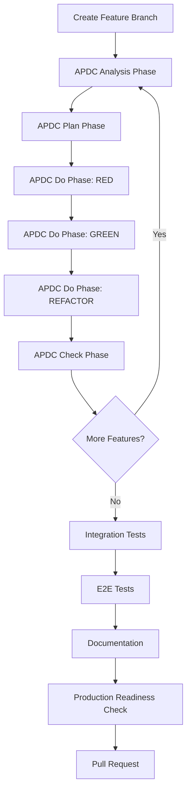

# Kubernaut Developer Guide

**Version**: 1.0
**Date**: 2025-11-19
**Status**: Active

---

## 🎯 **Purpose**

This guide provides a complete developer onboarding path for contributing to Kubernaut, whether you're:
- **Adding a new service** to the platform
- **Extending an existing service** with new features
- **Contributing bug fixes** or improvements

---

## 📚 **Quick Navigation**

| I want to... | Go to... |
|--------------|----------|
| **Add a new service** | [New Service Implementation](#-implementing-a-new-service) |
| **Extend existing service** | [Feature Extension](#-extending-existing-services) |
| **Understand architecture** | [Architecture Overview](#-architecture-overview) |
| **Set up development environment** | [Development Setup](#-development-environment-setup) |
| **Run tests** | [Testing Guide](#-testing) |
| **Deploy services** | [Deployment](#-deployment) |

---

## 🏗️ **Architecture Overview**

### **System Architecture**

Kubernaut is a microservices platform with 10 services:
- **4 CRD Controllers**: Signal Processing, AI Analysis, Remediation Execution, Remediation Orchestrator
- **6 Stateless Services**: Gateway, Data Storage, HolmesGPT API, Dynamic Toolset, Notification, Effectiveness Monitor

**Communication**: All services communicate via **Kubernetes Custom Resources (CRDs)** for event-driven, resilient workflows.

### **Essential Architecture Documents**

Read these in order:

1. **[Kubernaut CRD Architecture](architecture/KUBERNAUT_CRD_ARCHITECTURE.md)** ⭐ **START HERE**
   - Complete system overview
   - Service specifications
   - Code examples

2. **[V1 Source of Truth Hierarchy](V1_SOURCE_OF_TRUTH_HIERARCHY.md)**
   - Authoritative documentation structure
   - 3-tier hierarchy: Architecture → Services → Design

3. **[Multi-CRD Reconciliation Architecture](architecture/MULTI_CRD_RECONCILIATION_ARCHITECTURE.md)**
   - CRD communication patterns
   - Watch-based coordination
   - Owner references & cascade deletion

4. **[CRD Schemas](architecture/CRD_SCHEMAS.md)**
   - Authoritative CRD field definitions
   - Schema validation rules

---

## 🛠️ **Development Environment Setup**

### **Prerequisites**

| Tool | Version | Purpose |
|------|---------|---------|
| **Go** | 1.23.9+ | Service development |
| **Kubernetes** | 1.28+ | Runtime platform (Kind recommended) |
| **kubectl** | 1.28+ | Cluster management |
| **Redis** | 7.0+ | Gateway service (deduplication, storm detection) |
| **PostgreSQL** | 15+ | Data persistence |
| **Podman/Docker** | Latest | Container builds |
| **Ginkgo** | v2+ | BDD testing framework |

### **Initial Setup**

```bash
# Clone repository
git clone https://github.com/jordigilh/kubernaut.git
cd kubernaut

# Install CRDs
make install

# Build all services
make build

# Setup test infrastructure (Kind cluster + Redis)
make test-gateway-setup

# Run tests to verify setup
make test
```

### **IDE Setup**

**Recommended**: VSCode or GoLand with:
- Go extension
- Kubernetes extension
- YAML extension
- Ginkgo test runner

**Workspace Rules**: The `.cursor/rules/` directory contains development standards:
- `00-core-development-methodology.mdc` - TDD methodology
- `03-testing-strategy.mdc` - Testing framework
- `02-go-coding-standards.mdc` - Go patterns

---

## 🚀 **Implementing a New Service**

### **Step 1: Use the Implementation Plan Template**

📘 **[SERVICE_IMPLEMENTATION_PLAN_TEMPLATE.md](services/SERVICE_IMPLEMENTATION_PLAN_TEMPLATE.md)**

**What it provides**:
- ✅ **12-day implementation timeline** with daily breakdown
- ✅ **APDC-TDD methodology** (Analysis → Plan → Do → Check)
- ✅ **Integration-first testing strategy** (5 critical tests on Day 8)
- ✅ **60+ complete code examples** (zero TODO placeholders)
- ✅ **Production readiness checklist** (109-point assessment)

**Timeline Overview**:
| Phase | Days | Focus | Deliverables |
|-------|------|-------|--------------|
| **Foundation** | 1 | Types, interfaces, K8s client | Package structure, interfaces |
| **Core Logic** | 2-6 | Business logic components | All components implemented |
| **Integration** | 7 | Server, API, metrics | Complete service |
| **Testing** | 8-10 | Integration + Unit tests | 70%+ coverage |
| **Finalization** | 11-12 | E2E, docs, production readiness | Ready for deployment |

### **Step 2: Follow APDC-TDD Methodology**

**APDC Phases** (per feature/component):
1. **Analysis** (5-15 min): Comprehensive context understanding
2. **Plan** (10-20 min): Detailed implementation strategy
3. **Do** (Variable): RED → GREEN → REFACTOR with integration
4. **Check** (5-10 min): Comprehensive validation

**Key Principle**: Write tests FIRST, then implementation.

### **Step 3: Create Service Documentation**

After implementation (Day 11-12), use:

📘 **[SERVICE_DOCUMENTATION_GUIDE.md](services/SERVICE_DOCUMENTATION_GUIDE.md)**

**Required Documents** (7 minimum):
1. `overview.md` - Service purpose, CRD schema, architecture
2. `security-configuration.md` - RBAC, NetworkPolicy, Secrets
3. `observability-logging.md` - Structured logging, tracing
4. `metrics-slos.md` - Prometheus metrics, SLI/SLO
5. `testing-strategy.md` - Unit/Integration/E2E tests
6. `finalizers-lifecycle.md` - Cleanup coordination (CRD controllers)
7. `controller-implementation.md` - Reconciliation loop (CRD controllers)

**Reference Services** (copy and adapt):
- **Service 1 (Signal Processing)**: Data processing patterns
- **Service 2 (AI Analysis)**: AI/ML integration patterns
- **Service 3 (Workflow Execution)**: Multi-step orchestration
- **Service 4 (Kubernetes Executor)**: Action execution patterns
- **Service 5 (Remediation Orchestrator)**: Central orchestration

---

## 🔧 **Extending Existing Services**

### **When to Extend vs. Create New**

**Extend existing service** when:
- ✅ Feature fits within service's bounded context
- ✅ No new CRD required
- ✅ Shares same data model and dependencies

**Create new service** when:
- ❌ Feature requires new CRD
- ❌ Different scaling/deployment requirements
- ❌ Distinct bounded context

### **Feature Extension Process**

**Currently**: Use existing feature implementation plans as reference:
- **[DD-GATEWAY-008 Implementation Plan](services/stateless/gateway-service/DD_GATEWAY_008_IMPLEMENTATION_PLAN.md)** - Storm buffering (12 days)
- **[DD-GATEWAY-009 Implementation Plan](services/stateless/gateway-service/DD_GATEWAY_009_IMPLEMENTATION_PLAN.md)** - State-based deduplication (5 days)

**Structure**:
1. **Feature Overview** (Design Decision reference, business requirements)
2. **Timeline Estimation** (3-12 days based on complexity)
3. **Day-by-Day Breakdown** (adapted from SERVICE_IMPLEMENTATION_PLAN_TEMPLATE)
4. **Integration Points** (how feature integrates with existing code)
5. **Testing Strategy** (new feature tests + regression tests)
6. **Production Readiness** (impact assessment, rollback plan)

**Key Differences from New Service**:
- ✅ Shorter timeline (no foundation setup)
- ✅ Focus on enhancing existing code (not creating new)
- ✅ Regression testing emphasis
- ✅ Integration impact assessment

---

## 🧪 **Testing**

### **Testing Strategy**

Kubernaut follows **defense-in-depth testing pyramid**:

- **Unit Tests**: **70%+ coverage** - Business logic with external mocks only
- **Integration Tests**: **>50% coverage** - Component interactions, real K8s API
- **E2E Tests**: **<10% coverage** - Critical user journeys

**Reference**: [03-testing-strategy.mdc](../.cursor/rules/03-testing-strategy.mdc)

### **Testing Commands**

```bash
# Unit tests (fast, no infrastructure)
make test

# Integration tests (requires Kind + Redis)
make test-integration

# E2E tests (full system)
make test-e2e

# Service-specific tests
go test ./pkg/gateway/... -v
go test ./test/integration/gateway/... -v
go test ./test/e2e/gateway/... -v
```

### **Testing Principles**

**✅ DO**:
- Test WHAT the system does (behavior), not HOW (implementation)
- Use real business scenarios in test names
- Map tests to business requirements (BR-XXX-YYY)
- Use specific assertions (not `ToNot(BeNil())`)

**❌ DON'T**:
- Test internal state (Redis keys, buffer internals)
- Use weak assertions (`> 0`, `ToNot(BeEmpty())`)
- Test library/framework behavior
- Create tests without business context

**Reference**: [SERVICE_DOCUMENTATION_GUIDE.md - Testing Protocol](services/SERVICE_DOCUMENTATION_GUIDE.md#-critical-behavior--correctness-testing-protocol-)

---

## 🚢 **Deployment**

### **Deployment Structure**

Each service uses **Kustomize overlays** for cross-platform deployment:

```
deploy/[service]/
├── base/                    # Platform-agnostic manifests
├── overlays/
│   ├── openshift/           # OpenShift-specific (SCC fixes)
│   └── kubernetes/          # Vanilla K8s
└── README.md                # Service deployment guide
```

### **Deploy a Service**

```bash
# OpenShift
oc apply -k deploy/gateway/overlays/openshift/

# Vanilla Kubernetes
kubectl apply -k deploy/gateway/overlays/kubernetes/
```

### **Available Deployments**

| Service | Status | Path |
|---------|--------|------|
| **Gateway + Redis** | ✅ Production-Ready | `deploy/gateway/` |
| **HolmesGPT API** | ⏸️ Coming Soon | `deploy/holmesgpt-api/` |
| **PostgreSQL** | ⏸️ Coming Soon | `deploy/postgres/` |

---

## 📋 **Development Workflow**

### **Standard Development Flow**



### **Pull Request Checklist**

Before submitting a PR:

- [ ] All tests passing (unit + integration + E2E)
- [ ] No lint errors (`golangci-lint run`)
- [ ] Business requirements documented (BR-XXX-YYY)
- [ ] Code follows Go standards (`.cursor/rules/02-go-coding-standards.mdc`)
- [ ] Tests follow behavior/correctness protocol
- [ ] Documentation updated (if applicable)
- [ ] Deployment manifests updated (if applicable)
- [ ] Confidence assessment provided (60-100%)

---

## 🎯 **Business Requirements (BR)**

### **BR Format**

All code must map to business requirements: `BR-[CATEGORY]-[NUMBER]`

**Categories**:
- `BR-WORKFLOW-XXX` - Workflow orchestration
- `BR-AI-XXX` - AI/ML functionality
- `BR-INTEGRATION-XXX` - Cross-component integration
- `BR-SECURITY-XXX` - Security features
- `BR-PLATFORM-XXX` - Kubernetes/infrastructure
- `BR-API-XXX` - API endpoints
- `BR-STORAGE-XXX` - Data persistence
- `BR-MONITORING-XXX` - Observability
- `BR-SAFETY-XXX` - Safety frameworks
- `BR-PERFORMANCE-XXX` - Performance optimization

**Example**:
```go
// BufferFirstAlert buffers alert and returns whether aggregation should start
// Business Requirement: BR-GATEWAY-016 - Buffer first N alerts before creating aggregation window
func (a *StormAggregator) BufferFirstAlert(ctx context.Context, signal *types.NormalizedSignal) (int, bool, error) {
    // ...
}
```

---

## 🔍 **Code Review Standards**

### **What Reviewers Look For**

1. **TDD Compliance**: Tests written first, implementation follows
2. **Business Alignment**: All code maps to BR-XXX-YYY
3. **Testing Quality**: Behavior-focused, not implementation-focused
4. **Error Handling**: All errors handled and logged
5. **Type Safety**: No `any` or `interface{}` unless necessary
6. **Integration**: New business code integrated in main applications
7. **Documentation**: Clear comments explaining business purpose

### **Common Review Feedback**

| Issue | Solution |
|-------|----------|
| "Tests are too implementation-focused" | Refactor to test behavior through public API |
| "Missing BR reference" | Add `// Business Requirement: BR-XXX-YYY` |
| "Weak assertions (ToNot(BeNil()))" | Use specific business assertions |
| "Code not integrated in main app" | Wire up in `cmd/*/main.go` |
| "Missing error handling" | Add error checks and logging |

---

## 📊 **Metrics & Observability**

### **Standard Metrics**

Every service must expose:
- **Counter**: Total entities processed (`_total` suffix)
- **Histogram**: Processing duration (`_seconds` suffix)
- **Gauge**: Current active processing
- **Counter**: Errors by type and phase

**Example**:
```go
import "github.com/prometheus/client_golang/prometheus/promauto"

var (
    EntitiesProcessedTotal = promauto.NewCounterVec(prometheus.CounterOpts{
        Name: "kubernaut_service_entities_processed_total",
        Help: "Total number of entities processed by service",
    }, []string{"status", "namespace"})
)
```

### **Health Checks**

All services must expose:
- `GET /health` - Liveness probe
- `GET /ready` - Readiness probe
- `GET /metrics` - Prometheus metrics (port 9090)

---

## 🆘 **Getting Help**

### **Documentation Hierarchy**

1. **Architecture** → [Kubernaut CRD Architecture](architecture/KUBERNAUT_CRD_ARCHITECTURE.md)
2. **Service Implementation** → [SERVICE_IMPLEMENTATION_PLAN_TEMPLATE.md](services/SERVICE_IMPLEMENTATION_PLAN_TEMPLATE.md)
3. **Service Documentation** → [SERVICE_DOCUMENTATION_GUIDE.md](services/SERVICE_DOCUMENTATION_GUIDE.md)
4. **Testing** → [03-testing-strategy.mdc](../.cursor/rules/03-testing-strategy.mdc)
5. **Go Standards** → [02-go-coding-standards.mdc](../.cursor/rules/02-go-coding-standards.mdc)

### **Common Questions**

**Q: How do I add a new CRD?**
A: Update `api/v1alpha1/`, run `make manifests`, update [CRD_SCHEMAS.md](architecture/CRD_SCHEMAS.md)

**Q: How do I test CRD controllers?**
A: Use `envtest` for integration tests (fake K8s API), see [testing-strategy.mdc](../.cursor/rules/03-testing-strategy.mdc)

**Q: How do I add a new metric?**
A: Use `promauto` for automatic registration, see [SERVICE_DOCUMENTATION_GUIDE.md - Metrics](services/SERVICE_DOCUMENTATION_GUIDE.md#-metrics-implementation-guidance)

**Q: How do I handle errors?**
A: Always handle errors, add log entry, use structured error types from `internal/errors/`

**Q: How do I know if my tests are good?**
A: Run the self-review checklist in [SERVICE_DOCUMENTATION_GUIDE.md - Testing Protocol](services/SERVICE_DOCUMENTATION_GUIDE.md#self-review-checklist-mandatory-after-writing-tests)

### **Support Channels**

- **Issues**: [GitHub Issues](https://github.com/jordigilh/kubernaut/issues)
- **Discussions**: [GitHub Discussions](https://github.com/jordigilh/kubernaut/discussions)
- **Documentation**: This guide and linked references

---

## 📚 **Additional Resources**

### **Templates**

- [SERVICE_IMPLEMENTATION_PLAN_TEMPLATE.md](services/SERVICE_IMPLEMENTATION_PLAN_TEMPLATE.md) - New service implementation
- [SERVICE_DOCUMENTATION_GUIDE.md](services/SERVICE_DOCUMENTATION_GUIDE.md) - Service documentation
- [CRD Service Specification Template](development/templates/CRD_SERVICE_SPECIFICATION_TEMPLATE.md) - CRD controller scaffolding

### **Reference Implementations**

- **Gateway Service**: [docs/services/stateless/gateway-service/](services/stateless/gateway-service/)
- **Data Storage Service**: [docs/services/stateless/data-storage/](services/stateless/data-storage/)
- **Dynamic Toolset Service**: [docs/services/stateless/dynamic-toolset/](services/stateless/dynamic-toolset/)

### **Architecture Decisions**

- [DESIGN_DECISIONS.md](architecture/DESIGN_DECISIONS.md) - All architectural decisions
- [ADR Directory](architecture/decisions/) - Architecture Decision Records

---

**Document Status**: ✅ **ACTIVE**
**Last Updated**: 2025-11-19
**Version**: 1.0
**Maintained By**: Development Team

---

**Welcome to Kubernaut development!** 🚀

Start with [Architecture Overview](#-architecture-overview), then choose your path:
- **New service** → [Implementing a New Service](#-implementing-a-new-service)
- **Feature extension** → [Extending Existing Services](#-extending-existing-services)

