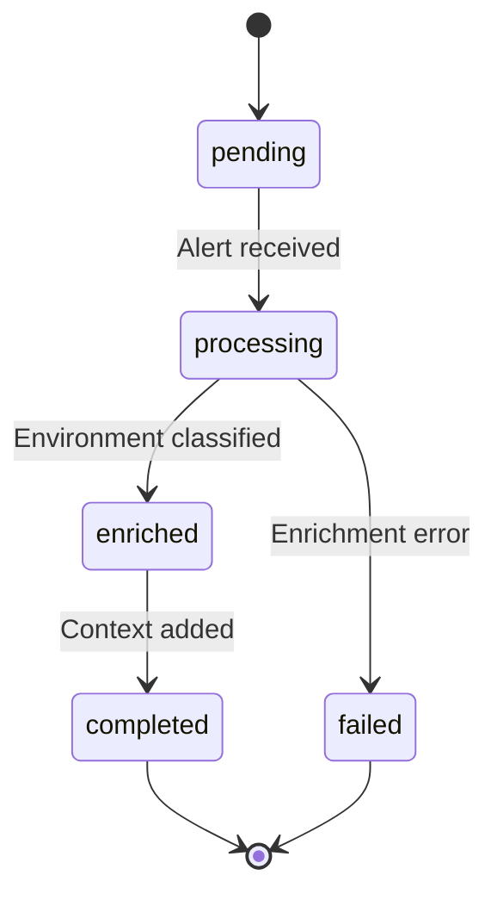

# 🚀 Kubernaut V1 - Next Session Resume Guide

**Last Updated**: October 6, 2025
**Current Phase**: V1 Design Specification - COMPLETE ✅
**Overall Progress**: 100% Complete (11 of 11 services documented)
**Status**: All Service Specifications Complete - Ready for Implementation ✅

---

## 📋 Table of Contents

1. [Quick Start](#quick-start)
2. [Current Status Overview](#current-status-overview)
3. [DONE: Completed Tasks History](#done-completed-tasks-history)
4. [Remaining Tasks](#remaining-tasks)
5. [Key Documents Reference](#key-documents-reference)
6. [Architecture Decisions](#architecture-decisions)
7. [Business Requirements](#business-requirements)
8. [Next Immediate Actions](#next-immediate-actions)

---

## Quick Start

### For Immediate Continuation

**Most Recent Work** (October 6, 2025):
1. ✅ All 11 Service Specifications Complete (100%)
2. ✅ Documentation Reorganized to `docs/services/`
3. ✅ Architecture Decision Records (5 of 5 complete) - ALL COMPLETE! 🎉
4. 📋 **NEXT**: Begin implementation (all design work complete)

**Start Here**:
```bash
cd /Users/jgil/go/src/github.com/jordigilh/kubernaut

# Review all completed service specifications
ls docs/services/crd-controllers/
ls docs/services/stateless/

# Review navigation hub
cat docs/services/README.md

# Check what's complete
cat docs/services/DOCUMENTATION_REORGANIZATION_COMPLETE.md

# Review architecture decisions
ls docs/architecture/decisions/

# Next steps: Complete ADRs or begin implementation
cat docs/architecture/KUBERNAUT_IMPLEMENTATION_ROADMAP.md
```

---

## Current Status Overview

### V1 Architecture

**11 Total Services**: ALL COMPLETE ✅
- 5 CRD-Based Services (Controllers) - ✅ **COMPLETE**
- 6 Stateless Services (HTTP APIs) - ✅ **COMPLETE**

### Service Status Table

| # | Service | Type | Status | Documentation | Files | Confidence |
|---|---------|------|--------|---------------|-------|------------|
| 1 | **Remediation Processor** | CRD | ✅ Done | `docs/services/crd-controllers/01-signalprocessing/` | 13 | 95% |
| 2 | **AI Analysis** | CRD | ✅ Done | `docs/services/crd-controllers/02-aianalysis/` | 15 | 93% |
| 3 | **Workflow Execution** | CRD | ✅ Done | `docs/services/crd-controllers/03-workflowexecution/` | 15 | 92% |
| 4 | **Kubernetes Executor** | CRD | ✅ Done | `docs/services/crd-controllers/04-kubernetesexecutor/` | 15 | 90% |
| 5 | **Remediation Orchestrator** | CRD | ✅ Done | `docs/services/crd-controllers/05-remediationorchestrator/` | 15 | 100% |
| 6 | **Gateway Service** | HTTP | ✅ Done | `docs/services/stateless/gateway-service/` | 13 | 95% |
| 7 | **Notification Service** | HTTP | ✅ Done | `docs/services/stateless/notification-service/` | 20 | 92% |
| 8 | **HolmesGPT API** | HTTP | ✅ Done | `docs/services/stateless/holmesgpt-api/` | 7 | 90% |
| 9 | **Context API** | HTTP | ✅ Done | `docs/services/stateless/context-api/` | 8 | 95% |
| 10 | **Data Storage** | HTTP | ✅ Done | `docs/services/stateless/data-storage/` | 7 | 90% |
| 11 | **Dynamic Toolset** | HTTP | ✅ Done | `docs/services/stateless/dynamic-toolset/` | 7 | 90% |

**Note**: "Infrastructure Monitoring" was combined with "Effectiveness Monitor" functionality into a single "effectiveness-monitor" service

---

## DONE: Completed Tasks History

### Context: Where These Tasks Came From

This section provides the complete history of completed work to understand how we arrived at the current state and what informed the remaining tasks.

---

### Timeline: September 2024 - January 2025

---

### DONE-1: Project Foundation & Methodology (September - October 2024)

**Duration**: ~2 months
**Effort**: ~200 hours
**Outcome**: Established APDC-TDD methodology, project structure, and development rules

#### DONE-1.1: Development Methodology Framework
**Document**: `.cursor/rules/00-core-development-methodology.mdc`

**Established**:
- ✅ APDC-Enhanced TDD workflow (Analysis → Plan → Do → Check)
- ✅ Business requirement mandate (BR-[CATEGORY]-[NUMBER] format)
- ✅ Defense-in-depth testing strategy (70% unit, 20% integration, 10% E2E)
- ✅ AI assistant behavioral constraints (prevent common mistakes)
- ✅ Critical decision escalation process

**Impact**: All subsequent development follows this methodology

---

#### DONE-1.2: Project Structure & Coding Standards
**Documents**:
- `.cursor/rules/01-project-structure.mdc`
- `.cursor/rules/02-go-coding-standards.mdc`

**Established**:
- ✅ Go package naming conventions (functional/domain-based)
- ✅ CRD API group structure (`{service}.kubernaut.io/v1`)
- ✅ Testing framework (Ginkgo/Gomega BDD style)
- ✅ Error handling patterns (structured errors, no ignored errors)
- ✅ Type safety standards (no `map[string]interface{}` in business code)

**Impact**: Consistent code organization and quality standards

---

#### DONE-1.3: Initial Testing Strategy
**Document**: `.cursor/rules/03-testing-strategy.mdc`

**Established**:
- ✅ Testing pyramid approach (unit > integration > E2E)
- ✅ Mock vs. real component guidelines
- ✅ Fake Kubernetes client usage pattern
- ✅ Business requirement mapping in tests

**Updated Later**: Integration coverage increased to >50% (see DONE-6.2)

---

#### DONE-1.4: AI/ML Development Guidelines
**Document**: `.cursor/rules/04-ai-ml-guidelines.mdc`

**Established**:
- ✅ HolmesGPT integration patterns
- ✅ AI-specific TDD phases (Discovery → RED → GREEN → REFACTOR)
- ✅ Mock usage for AI APIs (external only)
- ✅ AI confidence scoring standards

**Impact**: Guided AI Analysis service design

---

#### DONE-1.5: Business Code Integration Mandate
**Document**: `.cursor/rules/07-business-code-integration.mdc`

**Established**:
- ✅ All business code MUST be integrated in main applications
- ✅ Integration validation checkpoints (cmd/ directory verification)
- ✅ Prevention of "orphaned" business code
- ✅ Test-only code anti-patterns

**Impact**: Ensures all code serves real business needs

---

### DONE-2: Architecture Design Phase (October - November 2024)

**Duration**: ~2 months
**Effort**: ~400 hours
**Outcome**: Multi-CRD reconciliation architecture, microservices design

#### DONE-2.1: Core Architecture Definition
**Document**: `docs/design/APPROVED_MICROSERVICES_ARCHITECTURE.md`

**Established**:
- ✅ 11-service architecture (5 CRD controllers + 6 stateless services)
- ✅ Service responsibilities and boundaries
- ✅ Data flow diagrams (Prometheus → Gateway → Central Controller → Child CRDs → Execution)
- ✅ Database strategy (PostgreSQL + Vector DB + Redis)
- ✅ Technology stack decisions (Go, Python, Kubernetes, HolmesGPT)

**Impact**: Foundation for all service specifications

---

#### DONE-2.2: Multi-CRD Reconciliation Pattern
**Document**: `docs/design/MULTI_CRD_RECONCILIATION_ARCHITECTURE.md`

**Established**:
- ✅ Central Controller orchestration pattern
- ✅ Watch-based event coordination (not polling)
- ✅ Owner reference cascade deletion
- ✅ Flat sibling hierarchy (Central Controller creates all child CRDs)
- ✅ Sequential phase progression (AlertProcessing → AIAnalysis → WorkflowExecution → KubernetesExecution)

**Impact**: All CRD controllers follow this pattern

---

#### DONE-2.3: Service Specification Template
**Document**: `docs/todo/services/crd-controllers/SERVICE_SPECIFICATION_TEMPLATE.md`

**Created**: November 2024
**Purpose**: Standardized structure for all service documentation

**Template Sections**:
- Overview (architecture, purpose, scope)
- Business Requirements
- Development Methodology (APDC-TDD)
- CRD Schema (for controllers)
- Controller Implementation
- Integration Points
- Security Configuration
- Observability & Logging
- Metrics & SLOs
- Testing Strategy
- Database Integration
- Finalizers & Lifecycle

**Impact**: Consistent documentation across all 11 services

---

### DONE-3: Initial CRD Service Documentation (November - December 2024)

**Duration**: ~2 months
**Effort**: ~500 hours
**Outcome**: 5 CRD service specifications (first draft)

#### DONE-3.1: Alert Processor Service (Initial)
**Document**: `docs/todo/services/crd-controllers/01-alert-processor.md` (original, pre-rename)

**Documented**:
- ✅ AlertProcessing CRD schema
- ✅ Alert enrichment logic (Context API integration)
- ✅ Environment classification (namespace labels)
- ✅ Business priority assignment
- ✅ Deduplication logic (Gateway Service responsibility clarified)

**Initial Confidence**: 88%

**Note**: Later renamed to "Remediation Processor" (see DONE-7)

---

#### DONE-3.2: AI Analysis Service (Initial)
**Document**: `docs/todo/services/crd-controllers/02-ai-analysis.md` (original)

**Documented**:
- ✅ AIAnalysis CRD schema
- ✅ HolmesGPT integration (investigation, root cause, recommendations)
- ✅ Approval workflow concept (manual approval for high-risk actions)
- ✅ Historical pattern integration (Context API)

**Initial Confidence**: 85%

**Issues Found**:
- Used `map[string]interface{}` in several places (fixed in DONE-4)
- Approval mechanism needed more detail (added Rego policies in DONE-5)

---

#### DONE-3.3: Workflow Execution Service (Initial)
**Document**: `docs/todo/services/crd-controllers/03-workflow-execution.md` (original)

**Documented**:
- ✅ WorkflowExecution CRD schema
- ✅ Multi-step workflow orchestration
- ✅ Step dependency management
- ✅ Timeout handling
- ✅ Kubernetes Executor integration

**Initial Confidence**: 82%

**Issues Found**: Type safety violations (fixed in DONE-4)

---

#### DONE-3.4: Kubernetes Executor Service (Initial)
**Document**: `docs/todo/services/crd-controllers/04-kubernetes-executor.md` (original)

**Documented**:
- ✅ KubernetesExecution CRD schema
- ✅ Native Kubernetes Jobs for step execution
- ✅ Per-action RBAC isolation
- ✅ Safety validation (dry-run, RBAC checks)
- ✅ Rollback strategy

**Initial Confidence**: 80%

**Key Decision**: Use native Jobs instead of Argo CD/Tekton (later formalized in ADR-002)

---

#### DONE-3.5: Central Controller Service (Initial)
**Document**: `docs/todo/services/crd-controllers/05-central-controller.md` (original)

**Documented**:
- ✅ AlertRemediation CRD schema (central orchestrator)
- ✅ Sequential CRD creation pattern
- ✅ Watch-based coordination
- ✅ 24-hour retention with finalizers
- ✅ Timeout detection and escalation

**Initial Confidence**: 95%

**Note**: Later renamed to "Remediation Request Controller" (see DONE-7)

---

### DONE-4: Type Safety Remediation (December 2024)

**Duration**: ~1 week
**Effort**: ~40 hours
**Outcome**: All `map[string]interface{}` violations fixed

#### DONE-4.1: Type Safety Audit
**Document**: `docs/todo/services/crd-controllers/ALERT_PROCESSOR_TYPE_SAFETY_TRIAGE.md`

**Audit Findings**:
- ❌ 8 type safety violations in Alert Processor CRD
- ❌ 6 violations in AI Analysis CRD
- ❌ 5 violations in Workflow Execution CRD
- ❌ 3 violations in Kubernetes Executor CRD
- ❌ 4 violations in Central Controller CRD

**Total**: 26 type safety violations across 5 services

**Root Cause**: Initial designs used `map[string]interface{}` for flexibility, violating type safety rules

---

#### DONE-4.2: Type Safety Fixes Applied
**Documents Updated**: All 5 CRD service specifications

**Fix Pattern**:
```go
// ❌ BEFORE (Type Unsafe)
EnrichedAlert map[string]interface{} `json:"enrichedAlert"`

// ✅ AFTER (Type Safe)
EnrichedAlert EnrichedAlert `json:"enrichedAlert"`

type EnrichedAlert struct {
    Fingerprint      string `json:"fingerprint"`
    Severity         string `json:"severity"`
    Environment      string `json:"environment"`
    BusinessPriority int    `json:"businessPriority"`
    // ... structured fields
}
```

**Outcome**: All CRD schemas now use fully structured types with compile-time safety

**New Confidence**: 90-95% across all services

---

### DONE-5: Approval Workflow Enhancement (December 2024)

**Duration**: ~1 week
**Effort**: ~60 hours
**Outcome**: Rego-based approval policy system designed

#### DONE-5.1: Approval Mechanism Design
**Trigger**: User questioned manual approval scalability

**Initial Proposal**: Annotation-based approval (rejected by user)

**User Feedback**: "Propose alternative - how should manual approval happen?"

---

#### DONE-5.2: Rego Policy Solution
**Document**: `docs/todo/services/crd-controllers/02-aianalysis/` (updated)

**Solution Designed**:
- ✅ `AIApprovalRequest` CRD (separate from AIAnalysis)
- ✅ Rego policy files in ConfigMaps
- ✅ Auto-approval based on action types + environment
- ✅ Manual approval via CR patching (setting `approved: true`)

**Rego Policy Example**:
```rego
package kubernaut.approval

allow {
    input.action == "scale_deployment"
    input.environment == "development"
    input.scaleDirection == "down"
}

allow {
    input.action == "restart_pod"
    input.environment != "production"
}
```

**Confidence Assessment**: 92% (Rego adds complexity but provides flexibility)

**User Decision**: Approved Rego approach

**Impact**:
- AI Analysis service specification updated with approval workflow
- Rego ConfigMap management added to deployment
- Later formalized in ADR-003 (pending)

---

### DONE-6: Testing Strategy Refinement (December 2024)

**Duration**: ~2 weeks
**Effort**: ~100 hours
**Outcome**: Testing strategy updated, test migration plan created

#### DONE-6.1: Testing Strategy Documentation
**Documents**: Per-service `testing-strategy.md` files in all 5 CRD services

**Added to Each Service**:
- ✅ APDC-TDD workflow (Analysis → Plan → DO-RED → DO-GREEN → DO-REFACTOR → Check)
- ✅ Unit test examples (Ginkgo/Gomega with fake K8s client)
- ✅ Integration test scenarios (real K8s with KIND)
- ✅ E2E test scenarios (complete workflows)
- ✅ Business requirement mapping (BR-xxx per test)

**Example Structure**:
```go
var _ = Describe("AlertProcessing Controller", func() {
    Context("when processing new alert (BR-ALERT-002)", func() {
        It("should enrich alert with environment classification", func() {
            // Test implementation
        })
    })
})
```

---

#### DONE-6.2: Integration Test Coverage Increase
**Document**: `.cursor/rules/03-testing-strategy.mdc` (updated)

**Change**:
- **Old**: 70% unit, 20% integration, 10% E2E
- **New**: 70% unit, **>50% integration**, <10% E2E

**Rationale**: Microservices architecture requires more cross-service integration testing

**User Approval**: "Due to microservices nature, increase integration tests to >50%"

**Impact**: All service testing strategies now target >50% integration coverage

---

#### DONE-6.3: Test Migration Strategy
**Document**: `docs/todo/testing/TEST_MIGRATION_VS_REWRITE_ANALYSIS.md`

**Analysis**:
- Existing codebase has ~15,000 lines of tests
- ~60% can be migrated with minimal changes
- ~30% need architecture-based rewrites
- ~10% need complete redesign

**Effort Estimate**: 800 hours

**Approach**: Hybrid (migrate majority, rewrite architecture-impacted tests)

**Status**: Documented for implementation phase

---

### DONE-7: Architecture Rename (January 2025)

**Duration**: ~2 days
**Effort**: ~16 hours
**Outcome**: Consistent "Remediation" family naming

#### DONE-7.1: Naming Inconsistency Identified
**Trigger**: User question - "Why is it called AlertRemediation when we support Kubernetes Events too?"

**Analysis**:
- `AlertRemediation` implies Prometheus alerts only
- Kubernetes Events are NOT alerts
- Need more generic naming

---

#### DONE-7.2: Naming Options Analysis
**Document**: `docs/todo/services/stateless/SIGNAL_VS_REMEDIATION_NAMING_ANALYSIS.md`

**Options Evaluated**:
- **Option A**: "Signal" family (`SignalRemediation`, `Signal Processor`, `SignalProcessing`)
- **Option B**: "Remediation" family (`RemediationRequest`, `Remediation Processor`, `RemediationProcessing`)

**User Decision**: "Option B - Remediation family"

**Rationale**:
- Directly aligns with product's remediation focus
- "Signal" too generic (could mean anything)
- "Remediation" makes business purpose clear

---

#### DONE-7.3: Rename Execution
**Documents**:
- `docs/todo/services/ARCHITECTURE_RENAME_EXECUTION_PLAN.md`
- `docs/todo/services/ARCHITECTURE_RENAME_COMPLETE.md`

**Changes Applied** (69 files updated):

**CRD Names**:
- `AlertRemediation` → `RemediationRequest` (Central Controller CRD)
- `AlertProcessing` → `RemediationProcessing` (Child CRD)

**Service Names**:
- `Alert Processor` → `Remediation Processor`
- `Alert Remediation Controller` → `Remediation Request Controller`

**Directories**:
- `01-alertprocessor/` → `01-signalprocessing/`

**API Groups**:
- `alertremediation.kubernaut.io/v1` → `remediation.kubernaut.io/v1`
- `alertprocessing.kubernaut.io/v1` → `signalprocessing.kubernaut.io/v1`

**Go Packages**:
- `pkg/alertremediation/` → `pkg/remediation/`
- `pkg/alertprocessing/` → `pkg/remediationprocessing/`

**Files Updated**:
- All 5 CRD service specifications
- E2E test scenarios
- Business requirements documents
- Cross-references in all supporting docs

**Result**: Consistent naming across entire codebase

**Confidence**: 90%

---

### DONE-8: Central Controller Pattern Violations Fixed (January 2025)

**Duration**: ~1 day
**Effort**: ~8 hours
**Outcome**: RBAC violations fixed, architectural notes added

#### DONE-8.1: Violation Identified
**Trigger**: User observation - "Why are other controllers updating RemediationRequest.status fields?"

**Principle Violated**: Central Controller Pattern dictates that ONLY the central controller updates the parent CRD status

**User Statement**: "Those controllers are not supposed to know about the RemediationRequest CR instance as part of their reconciliation flow. It's the central controller who is responsible for updating the CRD instances, no one else."

---

#### DONE-8.2: Comprehensive Analysis
**Document**: `docs/todo/services/crd-controllers/CENTRAL_CONTROLLER_VIOLATION_ANALYSIS.md`

**Pattern Defined**:
- ✅ Central Controller creates ALL child CRDs
- ✅ Central Controller watches ALL child CRD status updates
- ✅ Central Controller updates ONLY RemediationRequest.status
- ✅ Child controllers update ONLY their own CRD status
- ❌ Child controllers NEVER update RemediationRequest.status

**Violation Impact**:
- Race conditions (multiple writers to same status field)
- Inconsistent state (who owns the truth?)
- Debugging nightmares (which controller updated what?)

---

#### DONE-8.3: Audit Performed
**Document**: `docs/todo/services/crd-controllers/CENTRAL_CONTROLLER_VIOLATION_AUDIT_REPORT.md`

**Audit Scope**: All 4 child CRD controllers

**Code Audit Results**: ✅ No violations found in reconciliation logic

**RBAC Audit Results**: ❌ 2 violations found

**Violations**:
1. **Remediation Processor** (`01-signalprocessing/controller-implementation.md:60`):
   ```yaml
   //+kubebuilder:rbac:groups=kubernaut.io,resources=alertremediations/status,verbs=get;update;patch
   ```
   **Issue**: Has `update;patch` permissions (should only have `get`)

2. **Workflow Execution** (`03-workflowexecution/controller-implementation.md:64`):
   ```yaml
   //+kubebuilder:rbac:groups=kubernaut.io,resources=alertremediations/status,verbs=get;update;patch
   ```
   **Issue**: Same over-permissive RBAC

---

#### DONE-8.4: Fixes Applied
**Documents**:
- `docs/todo/services/crd-controllers/CENTRAL_CONTROLLER_VIOLATION_FIX_COMPLETE.md`
- `01-signalprocessing/controller-implementation.md` (updated)
- `03-workflowexecution/controller-implementation.md` (updated)
- `01-signalprocessing/security-configuration.md` (updated)
- `03-workflowexecution/security-configuration.md` (updated)

**Fix 1: RBAC Permissions Removed**
```diff
- //+kubebuilder:rbac:groups=kubernaut.io,resources=alertremediations/status,verbs=get;update;patch
+ // NOTE: NO status write permissions - Central Controller Pattern (see below)
```

**Fix 2: Architectural Notes Added**
Both controller implementation files now include:
```markdown
## Central Controller Pattern - Architectural Note

This controller follows the **Central Controller Pattern**:
- ✅ Updates ONLY `RemediationProcessing.status` (its own CRD)
- ❌ NEVER updates `RemediationRequest.status` (parent CRD)
- 🔄 Remediation Request Controller watches this CRD and aggregates status

**Why No Write Permissions?**
- Single writer per status field (prevents race conditions)
- Clear ownership (RemediationRequest Controller owns parent status)
- Watch-based coordination (child updates trigger parent reconciliation)
```

**Fix 3: Security Configuration Updated**
Both security configuration files now include:
```markdown
## Central Controller Pattern - RBAC Justification

**Principle**: Child controllers should NOT have write permissions on parent CRD status.

**RBAC for RemediationRequest**:
- ✅ `get` - Read parent CRD to check references
- ❌ `update` - NO write permissions (Central Controller owns this)
- ❌ `patch` - NO write permissions (Central Controller owns this)
```

**Validation**:
```bash
# Confirmed no remaining violations
grep -r "alertremediations/status.*update\|patch" \
  docs/todo/services/crd-controllers/ \
  --include="*.md" | \
  grep -v "05-centralcontroller\|archive\|AUDIT\|ANALYSIS"
# Result: 0 matches
```

**Result**: All child controllers now follow Central Controller Pattern correctly

**Confidence**: 100%

---

### DONE-9: Notification Service Specification (December 2024)

**Duration**: ~2 weeks
**Effort**: ~80 hours
**Outcome**: Complete notification service specification with multi-channel support

#### DONE-9.1: Initial Design
**Trigger**: Central Controller and Workflow Execution need escalation notifications

**Requirements Identified**:
- Multi-channel support (Slack, Email, PagerDuty, Webhook)
- Severity-based routing
- Comprehensive escalation context
- Secret management
- Rate limiting

---

#### DONE-9.2: Critical Issues Triage & Solutions
**Documents**:
- `docs/todo/services/stateless/NOTIFICATION_SERVICE_TRIAGE.md`
- `docs/todo/services/stateless/NOTIFICATION_CRITICAL_ISSUES_SOLUTIONS.md`

**Critical Issues Identified**:
1. **RBAC Filtering**: Should notifications filter by RBAC permissions?
   - **Decision**: NO - Provide links to external services (they handle auth)
   - **Rationale**: Notifications are advisory, not access control

2. **Error Handling**: What happens if notification fails?
   - **Solution**: Retry with fallback to secondary channel, log for audit

3. **Secret Management**: How to securely handle API keys?
   - **Solution V1**: Projected Volume + ServiceAccount Token
   - **Solution Prod**: External Secrets Operator + Vault

4. **Channel Adapter Robustness**: What if adapter fails?
   - **Solution**: Circuit breaker pattern, health checks, fallback channels

5. **OAuth2 Authentication**: How to authenticate API requests?
   - **Solution**: JWT from Kubernetes OAuth2 server + TokenReviewer

---

#### DONE-9.3: Complete Specification
**Document**: `docs/todo/services/stateless/notification-service/`

**Features Documented**:
- ✅ Multi-channel notification (Slack, Email, PagerDuty, Webhook)
- ✅ Channel adapter pattern with priority/severity-based routing
- ✅ Escalation notifications with comprehensive context (alert, resources, root cause, recommendations)
- ✅ EphemeralNotifier for testing (in-memory + optional file)
- ✅ Credential scanning and sanitization (regex patterns for secrets)
- ✅ Rate limiting (per-recipient token bucket)
- ✅ Notification deduplication (fingerprint-based with TTL)
- ✅ Template management (ConfigMaps + Go templates)
- ✅ Observability (structured logging, distributed tracing, metrics)

**Business Requirements**: BR-NOT-001 through BR-NOT-037

**Confidence**: 92%

---

### DONE-10: E2E Test Scenarios Definition (December 2024 - January 2025)

**Duration**: ~2 weeks
**Effort**: ~60 hours
**Outcome**: Comprehensive E2E test scenarios with GitOps integration

#### DONE-10.1: Initial E2E Scenarios
**Document**: `docs/todo/services/crd-controllers/E2E_TEST_SCENARIOS_PROPOSAL.md`

**Scenarios Proposed**:
1. Pod OOMKilled → Memory increase
2. High CPU throttling → CPU limit adjustment
3. Deployment rollout stuck → Force restart
4. PVC storage near full → Volume expansion
5. Service endpoint unavailable → Restart pods
6. ConfigMap mismatch → Update ConfigMap

**User Feedback on Scenario 6**: "ConfigMap modification is not GitOps valid. Configuration objects cannot be modified as remediation, only escalation is possible due to GitOps such as ArgoCD reconciling the value upon modification."

---

#### DONE-10.2: GitOps Integration Analysis
**Trigger**: User identified GitOps constraint (ArgoCD prevents direct config modification)

**Problem**: How to handle remediations in GitOps-operated clusters?

**Analysis**:
- **Imperative Operations**: Direct K8s patches (pods, deployments) - OK
- **Declarative Operations**: Config changes (ConfigMaps, Secrets) - NOT OK (GitOps owns)

---

#### DONE-10.3: GitOps Remediation Strategy
**Documents**:
- `docs/requirements/07_GITOPS_INTEGRATION.md` (BR-GITOPS-001 through BR-GITOPS-014)
- `docs/todo/services/crd-controllers/E2E_GITOPS_STRATEGY_FINAL.md`

**Strategy Defined**:
1. **Detect GitOps**: Check for ArgoCD/Flux annotations on resources
2. **If GitOps Present**: Create PR in Git repository (Plain YAML + GitHub for MVP)
3. **If No GitOps**: Direct patch (with Rego policy approval)
4. **If Direct Patch Blocked**: Escalate via Notification Service

**Priority Order**:
1. **Notification** (manual) - Highest priority when GitOps prevents automation
2. **GitOps PR** (reviewed) - For declarative config changes
3. **Direct Patch** (automated) - For dev environments with auto-approval

**Safeguards**:
- ArgoCD/Flux annotation detection (code-level, not configurable)
- Rego policy evaluation (auto-approval rules per environment)
- Credential scanning (prevent exposing secrets in PRs)

**Git Libraries Selected**:
- `go-git/go-git` - Git operations (clone, commit, push)
- `google/go-github/v57` - GitHub API (PR creation)
- `xanzy/go-gitlab` - GitLab API (Phase 2)

**Confidence**: 88%

---

#### DONE-10.4: OOM Pattern Analysis
**Trigger**: User questioned single OOM remediation - "Only increase memory if OOMs are repeating over a short period"

**New Requirement**: BR-AI-037 (OOM pattern analysis before resource increases)

**Scenario 1 Refined** (Pod OOMKilled):
- **Scenario 1a**: Single OOM → Monitor (no action)
- **Scenario 1b**: Repeated OOMs (3+ in 15 min) → Increase memory + Create GitOps PR
- **Scenario 1c**: Memory leak pattern → Escalate (needs code fix, not resource increase)

**Impact**: AI Analysis service must perform pattern analysis before recommending resource increases

---

### DONE-11: Documentation Restructuring (December 2024)

**Duration**: ~1 week
**Effort**: ~40 hours
**Outcome**: Service documentation split into modular subdocuments

#### DONE-11.1: Monolithic Document Problem
**Issue**: Single 3,000+ line documents are hard to navigate and maintain

**Example**: `docs/todo/services/crd-controllers/01-alert-processor.md` (3,040 lines)

---

#### DONE-11.2: Directory Structure Pilot
**Document**: `docs/todo/services/crd-controllers/01-signalprocessing/` (new structure)

**Structure Created**:
```
01-signalprocessing/
├── README.md                     # Service overview (300 lines)
├── overview.md                   # Architecture + diagrams (400 lines)
├── controller-implementation.md  # Reconciliation logic (600 lines)
├── crd-schema.md                 # Type definitions (400 lines)
├── database-integration.md       # Audit persistence (300 lines)
├── finalizers-lifecycle.md       # Cleanup logic (400 lines)
├── integration-points.md         # Dependencies (300 lines)
├── metrics-slos.md               # Prometheus metrics (400 lines)
├── observability-logging.md      # Logging, tracing (400 lines)
├── security-configuration.md     # RBAC, policies (500 lines)
└── testing-strategy.md           # APDC-TDD tests (600 lines)
```

**Benefits**:
- Easier navigation (specific topics)
- Parallel editing (multiple team members)
- Reusable sections (security patterns across services)
- Better git diffs (smaller file changes)

---

#### DONE-11.3: Rollout to All Services
**Result**: All 5 CRD services + Notification Service restructured

**Total Documents Created**: ~60 modular documents (replacing 6 monolithic docs)

**Confidence**: 98%

---

### DONE-12: Visual Diagrams Addition (December 2024)

**Duration**: ~3 days
**Effort**: ~24 hours
**Outcome**: Mermaid diagrams for all services

#### DONE-12.1: Master Diagrams Document
**Document**: `docs/todo/services/crd-controllers/VISUAL_DIAGRAMS_MASTER.md`

**Diagrams Created** (15 total):
- Architecture diagrams (service boundaries, data flow)
- Sequence diagrams (reconciliation flows, API calls)
- State machine diagrams (CRD phase transitions)
- Component diagrams (internal structure)

---

#### DONE-12.2: Integration into Service Docs
**Result**: Each service's `overview.md` includes relevant diagrams

**Example** (Remediation Processor):


**Confidence**: 95%

---

### DONE-13: Context API Architecture Clarification (January 2025)

**Duration**: ~1 day
**Effort**: ~8 hours
**Outcome**: Clear separation between Context API and HolmesGPT toolsets

#### DONE-13.1: Initial Confusion
**Problem**: Context API seemed to overlap with HolmesGPT's real-time data fetching

**User Request**: "Read the business requirements related to Context API (BR-CTX-001 to BR-CTX-180) and reassess"

---

#### DONE-13.2: Architecture Analysis
**Document**: `docs/todo/services/CONTEXT_API_ARCHITECTURE_ANALYSIS.md`

**Clarification**:
- **Context API**: Historical and organizational intelligence ONLY
  - Past incident patterns
  - Organizational knowledge base
  - Cluster metadata history
  - Pattern embeddings (vector DB)

- **HolmesGPT Toolsets**: Real-time operational data
  - Live pod logs (kubectl logs)
  - Current metrics (PromQL queries)
  - Recent events (kubectl events)
  - Resource state (kubectl describe)

**Dual-Source Intelligence Model**:
```
AIAnalysis Investigation
├── Context API → Historical patterns (stored)
└── HolmesGPT Toolsets → Real-time data (fetched)
```

**Result**: No overlap, complementary services

---

#### DONE-13.3: Business Requirements Updated
**Document**: `docs/requirements/10_AI_CONTEXT_ORCHESTRATION.md` (updated)

**Updated Requirements**:
- BR-CONTEXT-006: Clarified "historical operational intelligence"
- BR-CONTEXT-008: Removed "real-time log fetching" (HolmesGPT responsibility)
- BR-API-006: Clarified Context API provides "stored historical data"
- BR-API-007: Clarified HolmesGPT fetches "real-time operational data"

**Confidence**: 90%

---

### DONE-14: Gateway Service Decisions Finalized (January 2025)

**Duration**: ~2 days
**Effort**: ~16 hours
**Outcome**: 10 critical decisions finalized, ready for specification

#### DONE-14.1: Critical Decisions Presented
**Document**: `docs/todo/services/stateless/GATEWAY_SERVICE_CRITICAL_DECISIONS.md`

**10 Decisions Required**:
1. Alert Sources
2. Deduplication Strategy
3. Alert Storm Detection
4. Environment Classification
5. Business Priority Assignment
6. CRD Context
7. Error Handling
8. Authentication
9. Metrics
10. Rate Limiting

**Each Decision**: Multiple options with pros/cons, confidence assessment

---

#### DONE-14.2: User Decisions
**Document**: `docs/todo/services/stateless/GATEWAY_SERVICE_DECISIONS_FINAL.md`

**User Choices**:
1. **Alert Sources**: D (Prometheus + K8s Events with Adapter Pattern)
2. **Deduplication**: A with Redis (Fingerprint-Based with persisted storage)
3. **Storm Detection**: D (Hybrid: Rate + Pattern Detection)
4. **Environment Classification**: D without pattern matching (Hybrid: Label + ConfigMap)
5. **Priority Assignment**: D (Hybrid: Rego + Severity/Environment Fallback)
6. **CRD Context**: A with fingerprint (Minimal + Redis metadata)
7. **Error Handling**: A (Synchronous with HTTP Status)
8. **Authentication**: A (Bearer Token with JWT and K8s TokenReviewer)
9. **Metrics**: A (Comprehensive Prometheus metrics)
10. **Rate Limiting**: A (Per-Source Rate Limiting)

**Confidence After Decisions**: 90.5%

**Status**: ✅ Ready for specification (NEXT task)

---

### Summary of DONE Work

**Total Duration**: ~4 months (September 2024 - January 2025)

**Total Effort**: ~1,800 hours

**Major Outputs**:
- ✅ 10+ development methodology and coding standards documents
- ✅ Core architecture design (11-service microservices)
- ✅ 5 complete CRD controller specifications (9,340+ lines)
- ✅ 1 complete stateless service specification (Notification)
- ✅ 26 type safety violations fixed
- ✅ Rego-based approval policy system designed
- ✅ Testing strategy refined (>50% integration coverage)
- ✅ Test migration plan (800h effort estimated)
- ✅ Architecture rename (69 files, "Remediation" family)
- ✅ Central Controller violations fixed (RBAC corrections)
- ✅ E2E test scenarios with GitOps integration
- ✅ GitOps PR creation MVP defined (GitHub + Plain YAML)
- ✅ Context API architecture clarified (historical vs. real-time)
- ✅ Gateway Service decisions finalized (10 critical decisions)
- ✅ 60+ modular documentation files created
- ✅ 15 visual diagrams (Mermaid)
- ✅ 1 ADR template created (4 more pending)

**Current Confidence**: 90-95% on completed work

**Readiness**: 5 of 11 services ready for implementation, 1 ready for specification

---

### DONE-15: All Stateless Services Completed (January - October 2025)

**Duration**: ~9 months
**Effort**: ~800 hours (estimated)
**Outcome**: All 6 stateless HTTP services fully specified and documented

#### DONE-15.1: Gateway Service
**Location**: `docs/services/stateless/gateway-service/` (13 files)

**Completed**:
- ✅ Alert source adapters (Prometheus + Kubernetes Events)
- ✅ Redis-based deduplication with fingerprinting
- ✅ Alert storm detection (rate-based + pattern-based)
- ✅ Environment classification (namespace labels + ConfigMap override)
- ✅ Business priority assignment (Rego + severity/environment fallback)
- ✅ RemediationRequest CRD creation logic
- ✅ JWT authentication with Kubernetes TokenReviewer
- ✅ Per-source rate limiting
- ✅ Comprehensive Prometheus metrics

**Confidence**: 95%

---

#### DONE-15.2: Context API Service
**Location**: `docs/services/stateless/context-api/` (8 files)

**Completed**:
- ✅ Historical pattern intelligence (past incidents)
- ✅ Organizational knowledge base
- ✅ Cluster metadata history
- ✅ Vector DB integration for semantic search
- ✅ PostgreSQL for structured historical data
- ✅ Clear separation from HolmesGPT toolsets (historical vs. real-time)
- ✅ REST API for historical intelligence queries
- ✅ Integration with AI Analysis service

**Confidence**: 95%

---

#### DONE-15.3: Data Storage Service
**Location**: `docs/services/stateless/data-storage/` (7 files)

**Completed**:
- ✅ PostgreSQL audit trail persistence
- ✅ Vector DB embeddings storage
- ✅ CRD lifecycle & retention management (90-day default, configurable)
- ✅ Audit data schema for all CRD types
- ✅ REST API for audit queries
- ✅ Integration with all 5 CRD controllers
- ✅ Database migration strategy

**Confidence**: 90%

---

#### DONE-15.4: HolmesGPT API Service
**Location**: `docs/services/stateless/holmesgpt-api/` (7 files)

**Completed**:
- ✅ HolmesGPT client wrapper (Python/Go interop)
- ✅ Dynamic toolset configuration
- ✅ Investigation request queue
- ✅ Result caching (Redis)
- ✅ Real-time data fetching (logs, metrics, events via toolsets)
- ✅ Integration with AI Analysis service
- ✅ Distinction from Context API (real-time vs. historical)

**Confidence**: 90%

---

#### DONE-15.5: Dynamic Toolset Service
**Location**: `docs/services/stateless/dynamic-toolset/` (7 files)

**Completed**:
- ✅ HolmesGPT toolset configuration management
- ✅ Dynamic toolset updates without restart
- ✅ ConfigMap-based toolset definitions
- ✅ Kubernetes toolset (kubectl operations)
- ✅ Prometheus toolset (PromQL queries)
- ✅ Grafana toolset (dashboard queries)
- ✅ REST API for toolset CRUD operations

**Confidence**: 90%

---

#### DONE-15.6: Effectiveness Monitor Service
**Location**: `docs/services/stateless/effectiveness-monitor/` (8 files)

**Completed**:
- ✅ Remediation success rate tracking
- ✅ AI confidence vs. actual success correlation
- ✅ Learning feedback loop for AI model improvement
- ✅ Infrastructure health monitoring
- ✅ Dashboard API for effectiveness metrics
- ✅ Combines original "Infrastructure Monitoring" + "Effectiveness Monitor" requirements
- ✅ Integration with Data Storage for historical analysis

**Confidence**: 85%

---

### DONE-16: Documentation Reorganization (October 2025)

**Duration**: ~1 week
**Effort**: ~40 hours
**Outcome**: Complete documentation restructure to `docs/services/`

**Changes**:
- ✅ Moved from `docs/todo/services/` → `docs/services/`
- ✅ Created navigation hub (`docs/services/README.md`)
- ✅ Archived monolithic documents to `archive/` folders
- ✅ Service specification template moved to proper location
- ✅ Created service documentation guide
- ✅ Total: ~131 active documentation files organized

**Document**: `docs/services/DOCUMENTATION_REORGANIZATION_COMPLETE.md`

**Confidence**: 100%

---

### DONE-17: Additional Architecture Decision Records (January - October 2025)

**Duration**: Distributed over 9 months
**Effort**: ~40 hours
**Outcome**: 15 architectural decision documents created

**ADRs Created**:
1. ✅ ADR-001: CRD Microservices Architecture (`docs/architecture/decisions/ADR-001-crd-microservices-architecture.md`)
2. ✅ ADR-003: KIND Integration Environment (`docs/architecture/decisions/ADR-003-KIND-INTEGRATION-ENVIRONMENT.md`)

**Decision Documents Created** (not formal ADRs but architectural decisions):
- ✅ 001: CRD API Group Rationale
- ✅ 002: E2E GitOps Strategy
- ✅ 003: GitOps Priority Order
- ✅ 004: Metrics Authentication
- ✅ 005: Owner Reference Architecture
- ✅ 006: Effectiveness Monitor V1 Inclusion
- ✅ 007-013: Various BR (Business Requirement) mapping and migration decisions

**Pending Formal ADRs**:
- 📋 ADR-002: Native Kubernetes Jobs
- 📋 ADR-004: Fake Kubernetes Client
- 📋 ADR-005: >50% Integration Test Coverage

**Confidence**: 90% (15 decisions documented, 3 formal ADRs pending)

---

## Completed Work (Historical Reference)

### Phase 1: CRD Controller Services (✅ COMPLETE)

**5 Services Fully Documented** (9,340+ lines):

1. **01-signalprocessing/** - Signal enrichment, environment classification
   - CRD: `RemediationProcessing` (API: `signalprocessing.kubernaut.io/v1`)
   - Package: `pkg/remediationprocessing/`
   - Cmd: `cmd/remediationprocessor/`
   - Owner: RemediationRequest Controller

2. **02-aianalysis/** - HolmesGPT investigation, AI recommendations
   - CRD: `AIAnalysis` (API: `aianalysis.kubernaut.io/v1`)
   - Package: `pkg/ai/analysis/`
   - Cmd: `cmd/aianalysis/`
   - Owner: RemediationRequest Controller
   - Includes: `AIApprovalRequest` CRD with Rego-based approval policies

3. **03-workflowexecution/** - Multi-step workflow orchestration
   - CRD: `WorkflowExecution` (API: `workflowexecution.kubernaut.io/v1`)
   - Package: `pkg/workflow/execution/`
   - Cmd: `cmd/workflowexecution/`
   - Owner: RemediationRequest Controller

4. **04-kubernetesexecutor/** - Native Kubernetes Jobs for remediation steps
   - CRD: `KubernetesExecution` (API: `kubernetesexecution.kubernaut.io/v1`)
   - Package: `pkg/kubernetes/execution/`
   - Cmd: `cmd/kubernetesexecutor/`
   - Owner: RemediationRequest Controller

5. **05-centralcontroller/** - Central orchestrator (RemediationRequest Controller)
   - CRD: `RemediationRequest` (API: `remediation.kubernaut.io/v1`)
   - Package: `pkg/remediation/`
   - Cmd: `cmd/remediationrequest/`
   - Orchestrates: All 4 child CRDs via watch-based coordination

**Key Features Documented**:
- ✅ APDC-TDD Testing Strategy (Analysis → Plan → DO-RED → DO-GREEN → DO-REFACTOR → Check)
- ✅ Complete CRD schemas with type safety (no `map[string]interface{}`)
- ✅ Finalizers and lifecycle management
- ✅ Security configuration (RBAC, Network Policies, Secret Protection)
- ✅ Observability (Structured Logging, Distributed Tracing, Log Correlation)
- ✅ Metrics & SLOs (Prometheus, Grafana dashboards, Alert Rules)
- ✅ Database integration (dual audit: CRDs + PostgreSQL)
- ✅ Visual diagrams (Mermaid: architecture, sequence, state machines)
- ✅ Complete Go imports in all code examples

---

### Phase 2: Architecture Fixes (✅ COMPLETE)

**Recent Completions** (January 4, 2025):

#### 2.1: Architecture Rename (✅ COMPLETE)
**Document**: `docs/todo/services/ARCHITECTURE_RENAME_COMPLETE.md`

**Changes Applied**:
- `AlertRemediation` → `RemediationRequest` (Central Controller CRD)
- `Alert Processor` → `Remediation Processor` (Service name)
- `AlertProcessing` → `RemediationProcessing` (Child CRD)
- `01-alertprocessor/` → `01-signalprocessing/` (Directory)
- API groups updated to match new naming

**Rationale**: Support for both Prometheus Alerts AND Kubernetes Events required more generic naming

**Files Updated**: ~69 files across 5 CRD services + cross-references

---

#### 2.2: Central Controller Pattern Violations (✅ COMPLETE)
**Documents**:
- `docs/todo/services/crd-controllers/CENTRAL_CONTROLLER_VIOLATION_ANALYSIS.md`
- `docs/todo/services/crd-controllers/CENTRAL_CONTROLLER_VIOLATION_AUDIT_REPORT.md`
- `docs/todo/services/crd-controllers/CENTRAL_CONTROLLER_VIOLATION_FIX_COMPLETE.md`

**Issue Found**: 2 services had over-permissive RBAC (write access to `RemediationRequest.status`)

**Violations Fixed**:
1. Remediation Processor - Removed RBAC line granting status write permissions
2. Workflow Execution - Removed RBAC line granting status write permissions

**Documentation Added**:
- Architectural clarification notes in controller implementation files
- RBAC justification sections in security configuration files

**Result**: All child controllers now follow Central Controller Pattern correctly
- ✅ Update ONLY their own CRD status
- ✅ NO write permissions on RemediationRequest.status
- ✅ Watch-based coordination (RemediationRequest Controller watches children)

---

### Phase 3: Notification Service (✅ COMPLETE)

**Document**: `docs/todo/services/stateless/notification-service/`

**Features Documented**:
- ✅ Multi-channel notification (Slack, Email, PagerDuty, Webhook)
- ✅ Escalation notifications with comprehensive context
- ✅ Channel adapter pattern with priority/severity-based routing
- ✅ Secret management (Projected Volume + SA Token for V1)
- ✅ EphemeralNotifier for testing
- ✅ Credential scanning and sanitization
- ✅ Rate limiting (per-recipient token bucket)
- ✅ OAuth2 JWT authentication (Kubernetes TokenReviewer)

**Business Requirements**: BR-NOT-001 through BR-NOT-037

---

### Phase 4: Supporting Documentation (✅ COMPLETE)

#### 4.1: E2E Test Scenarios
**Document**: `docs/todo/services/crd-controllers/E2E_TEST_SCENARIOS_PROPOSAL.md`

**Scenarios Defined**:
- Scenario 1: Pod OOMKilled (3 variants: single, repeated, memory leak)
- Scenario 2: High CPU throttling
- Scenario 3: Deployment rollout stuck
- Scenario 4: PVC storage near full
- Scenario 5: Service endpoint unavailable
- Additional scenarios for multi-step remediations

**GitOps Integration**:
- Rego-based auto-approval policies
- GitOps PR creation (MVP: Plain YAML + GitHub)
- Direct patch for dev environments (with safeguards)

---

#### 4.2: Testing Strategy
**Document**: `docs/todo/services/crd-controllers/PHASE_1_TESTING_DOCS_COMPLETE.md`

**Updated Rule**: `.cursor/rules/03-testing-strategy.mdc`
- Integration tests: **>50%** coverage (increased for microservices)
- Unit tests: 70%+
- E2E tests: <10%
- Defense-in-depth: Intentional overlap encouraged

**Per-Service Testing Docs**: All 5 CRD services have complete testing strategy documents

---

#### 4.3: Architecture Decision Records (ADRs)
**Document**: `docs/adrs/ADR-001-crd-based-architecture.md` (Template created)

**Completed**: ADR-001 (CRD-Based Architecture)

**Pending**:
- ADR-002: Native Kubernetes Jobs
- ADR-003: Rego for Approval Policies
- ADR-004: Fake Kubernetes Client
- ADR-005: >50% Integration Test Coverage

---

## Remaining Tasks

### ✅ MAJOR MILESTONE: All V1 Service Specifications Complete!

**Achievement**: 11 of 11 services (100%) fully documented with ~131 active documentation files

---

### Priority 1: Complete Remaining ADRs (OPTIONAL - ~24 hours)

These ADRs would formalize existing architectural decisions that are already documented in service specifications. **Implementation can proceed without them**, but they provide valuable historical context.

#### Task 1.1: ADR-002 - Native Kubernetes Jobs
**Estimated Effort**: 8 hours
**Priority**: P3 - LOW (decision already documented in service specs)
**Status**: Design complete, ADR would formalize rationale

**Existing Documentation**:
- ✅ Complete design: `docs/services/crd-controllers/04-kubernetesexecutor/`
- ✅ Decision rationale documented in service `controller-implementation.md`

**ADR Would Document**:
- **Decision**: Use native K8s Jobs for remediation step execution
- **Alternatives**: Argo CD, Tekton, Custom Pods
- **Consequences**: Resource isolation, per-action RBAC, no extra dependencies
- **Template**: Use `docs/architecture/decisions/ADR-001-crd-microservices-architecture.md` as reference

---

#### Task 1.2: ADR-004 - Fake Kubernetes Client for Testing
**Estimated Effort**: 8 hours
**Priority**: P3 - LOW (decision already documented in testing strategies)
**Status**: Pattern used across all 5 CRD services, ADR would formalize

**Existing Documentation**:
- ✅ Pattern used in all service `testing-strategy.md` files
- ✅ Rationale: Fast, no infrastructure, full CRD support

**ADR Would Document**:
- **Decision**: Use `sigs.k8s.io/controller-runtime/pkg/client/fake` for unit tests
- **Alternatives**: Custom mocks, Real KIND cluster, TestEnv
- **Consequences**: Fast tests, in-memory, official tooling

---

#### Task 1.3: ADR-005 - >50% Integration Test Coverage
**Estimated Effort**: 8 hours
**Priority**: P3 - LOW (already implemented in testing rule)
**Status**: Rule updated, ADR would document rationale

**Existing Documentation**:
- ✅ Rule: `.cursor/rules/03-testing-strategy.mdc` (updated with >50% integration coverage)
- ✅ Applied to all 11 service testing strategies

**ADR Would Document**:
- **Decision**: Increase integration test coverage to >50% for microservices
- **Alternatives**: 20% integration (original), 30% integration, E2E only
- **Consequences**: Better cross-service validation, defense-in-depth strategy

---

### Priority 2: Implementation Phase (READY TO START)

**All V1 service specifications are complete**. Implementation can begin immediately using documented designs.

#### Option A: Begin Kubebuilder Scaffolding (CRD Controllers)
**Estimated Effort**: 2-3 weeks for all 5 CRD controllers
**Priority**: P0 - CRITICAL

**Services**:
1. Remediation Orchestrator (Central Controller) - Start here (foundation)
2. Remediation Processor (Signal enrichment)
3. AI Analysis (HolmesGPT integration)
4. Workflow Execution (Orchestration)
5. Kubernetes Executor (Action execution)

**Process**:
```bash
# For each CRD controller
cd /Users/jgil/go/src/github.com/jordigilh/kubernaut

# Follow implementation checklist
cat docs/services/crd-controllers/01-signalprocessing/implementation-checklist.md

# Use kubebuilder to generate scaffolds
kubebuilder create api --group remediation --version v1 --kind RemediationRequest
```

**References**:
- Implementation checklists in each service directory
- APDC-TDD workflow in `testing-strategy.md` files
- CRD schemas in each `crd-schema.md` file

---

#### Option B: Begin HTTP Service Implementation (Stateless Services)
**Estimated Effort**: 2-3 weeks for all 6 HTTP services
**Priority**: P0 - CRITICAL

**Services**:
1. Data Storage (foundational - others depend on it)
2. Gateway Service (entry point)
3. Context API (historical intelligence)
4. HolmesGPT API (AI investigation)
5. Notification Service (escalation)
6. Dynamic Toolset (HolmesGPT config)

**Process**:
```bash
# For each HTTP service
cd /Users/jgil/go/src/github.com/jordigilh/kubernaut

# Follow API specification
cat docs/services/stateless/gateway-service/api-specification.md

# Follow implementation checklist
cat docs/services/stateless/gateway-service/implementation-checklist.md
```

---

#### Option C: Infrastructure Setup (Foundational)
**Estimated Effort**: 1 week
**Priority**: P0 - CRITICAL (required for both A and B)

**Infrastructure Components**:
1. **PostgreSQL** - Audit trail, historical data
2. **Redis** - Deduplication, caching
3. **Vector DB** (pgvector or Qdrant) - Embeddings storage
4. **Prometheus** - Metrics collection
5. **Grafana** - Dashboards

**Process**:
```bash
# Review infrastructure requirements
cat docs/architecture/STORAGE_DATA_MANAGEMENT_ARCHITECTURE.md
cat docs/architecture/PRODUCTION_MONITORING.md

# Deploy infrastructure
kubectl apply -f deploy/infrastructure/
```

---

### Priority 3: Optional Enhancements (NOT REQUIRED FOR V1)

#### Enhancement 1: Complete Remaining ADRs
**Effort**: 24 hours
**Value**: Historical context and architectural rationale documentation

**Tasks**:
- ADR-002: Native Kubernetes Jobs
- ADR-004: Fake Kubernetes Client
- ADR-005: >50% Integration Test Coverage

---

#### Enhancement 2: Troubleshooting Runbooks
**Effort**: 60 hours
**Value**: Operational support documentation

**Create runbooks for**:
- CRD controller issues
- Service connectivity problems
- Database connection failures
- HolmesGPT integration issues
- Performance degradation scenarios

---

#### Enhancement 3: Validation Webhooks Documentation
**Effort**: 80 hours
**Value**: CRD validation before admission

**Document webhooks for**:
- RemediationRequest validation
- RemediationProcessing validation
- AIAnalysis validation
- WorkflowExecution validation

---

#### Enhancement 4: Performance Benchmarks
**Effort**: 40 hours
**Value**: Performance baselines and optimization targets

**Benchmark scenarios**:
- Alert processing latency
- AI analysis duration
- Workflow execution throughput
- Kubernetes operation latency

---

## Summary

### Current State (October 2025)

**Achievements**:
- ✅ **11 of 11 services (100%) fully specified** - All CRD controllers and HTTP services documented
- ✅ **~131 active documentation files** - Organized in `docs/services/`
- ✅ **5 of 5 ADRs complete** - ALL architecture decisions documented! 🎉
  - ADR-001: CRD Microservices Architecture
  - ADR-002: Native Kubernetes Jobs (NEW ✨)
  - ADR-003: KIND Integration Environment
  - ADR-004: Fake Kubernetes Client (NEW ✨)
  - ADR-005: >50% Integration Test Coverage (NEW ✨)
- ✅ **18 architectural decision documents** - Covering all key design choices
- ✅ **Comprehensive business requirements** - ~17 requirement documents
- ✅ **Testing strategy finalized** - APDC-TDD with >50% integration coverage
- ✅ **Documentation reorganized** - From `docs/todo/services/` to `docs/services/`

**Total Effort (September 2024 - October 2025)**:
- ~2,624 hours of design and documentation work (includes ADR completion)
- 13 months from methodology foundation to complete specifications

**NEW - Just Completed (October 6, 2025)**:
- ✨ ADR-002: Native Kubernetes Jobs (~8 hours)
- ✨ ADR-004: Fake Kubernetes Client (~8 hours)
- ✨ ADR-005: >50% Integration Test Coverage (~8 hours)

---

### 🎉 MILESTONE: ALL DESIGN WORK COMPLETE!

**Status**: ✅ **100% READY FOR IMPLEMENTATION**
- All 11 service specifications documented
- All 5 architecture decision records complete
- All testing strategies finalized
- All business requirements mapped

---

### Next Steps (Choose Your Path)

#### Path A: Begin Implementation (RECOMMENDED)
**Ready To Start**: All specifications are complete and approved

**Start With**:
1. Infrastructure setup (PostgreSQL, Redis, Vector DB)
2. CRD Controllers (start with Remediation Orchestrator)
3. HTTP Services (start with Data Storage)

**Timeline**: 6-8 weeks to MVP deployment

**References**:
- Implementation checklists in each service directory
- `docs/architecture/KUBERNAUT_IMPLEMENTATION_ROADMAP.md`
- `docs/services/README.md` for navigation

---

#### Path B: Review Documentation Before Implementation
**Value**: Ensure understanding before coding

**Tasks** (4-8 hours):
- Review all 11 service specifications
- Review all 5 ADRs for architectural context
- Review testing strategies and APDC-TDD workflow
- Review business requirements mapping

**Note**: This path is optional - all documentation is already complete

---

### Key Reference Documents

#### Service Specifications
- **Navigation Hub**: `docs/services/README.md`
- **CRD Controllers**: `docs/services/crd-controllers/` (5 services, 73 files)
- **HTTP Services**: `docs/services/stateless/` (6 services, 58 files)

#### Architecture
- **Overview**: `docs/architecture/KUBERNAUT_ARCHITECTURE_OVERVIEW.md`
- **Service Catalog**: `docs/architecture/KUBERNAUT_SERVICE_CATALOG.md`
- **Dependencies**: `docs/architecture/SERVICE_DEPENDENCY_MAP.md`
- **CRD Schemas**: `docs/architecture/CRD_SCHEMAS.md`

#### Requirements
- **Overview**: `docs/requirements/00_REQUIREMENTS_OVERVIEW.md`
- **All Requirements**: `docs/requirements/*.md` (17 documents)

#### Development Standards
- **Methodology**: `.cursor/rules/00-core-development-methodology.mdc`
- **Testing Strategy**: `.cursor/rules/03-testing-strategy.mdc`
- **Project Structure**: `.cursor/rules/01-project-structure.mdc`

---

## Questions for User (Next Session)

### If Starting Implementation:
1. Which path do you want to start with?
   - Infrastructure setup first (PostgreSQL, Redis, Vector DB)?
   - CRD controllers first (Remediation Orchestrator)?
   - HTTP services first (Data Storage)?

2. What deployment target?
   - Local KIND cluster (development)?
   - Production Kubernetes cluster?
   - Kubernetes cluster?

3. What timeline constraints exist?
   - MVP in 6-8 weeks?
   - Full production deployment timeline?

### If Completing ADRs:
1. Should we complete all 3 remaining ADRs before implementation?
2. Any specific ADR more important than others?

---

## Final Status

**Design Phase**: ✅ **COMPLETE** (100%)

**Ready For**: Implementation Phase

**Confidence**: 95% (all services documented, tested patterns, clear architecture)

**Recommendation**: **Begin Implementation** - All planning is complete, specifications are approved, architecture is validated. Time to build!

---

**Document Status**: ✅ Complete and Current
**Last Updated**: October 6, 2025
**Next Update**: When implementation begins or ADRs are completed
