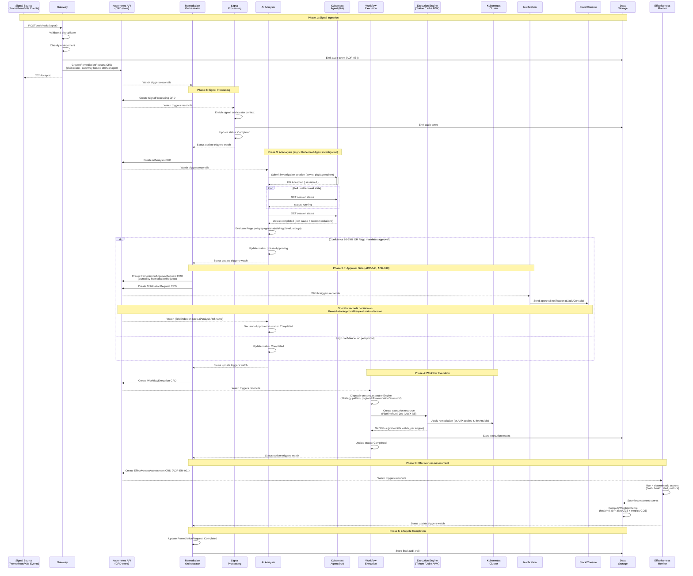
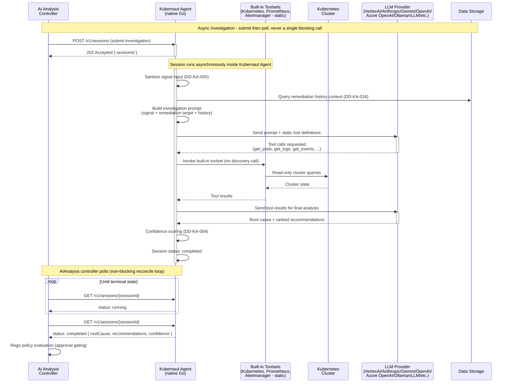
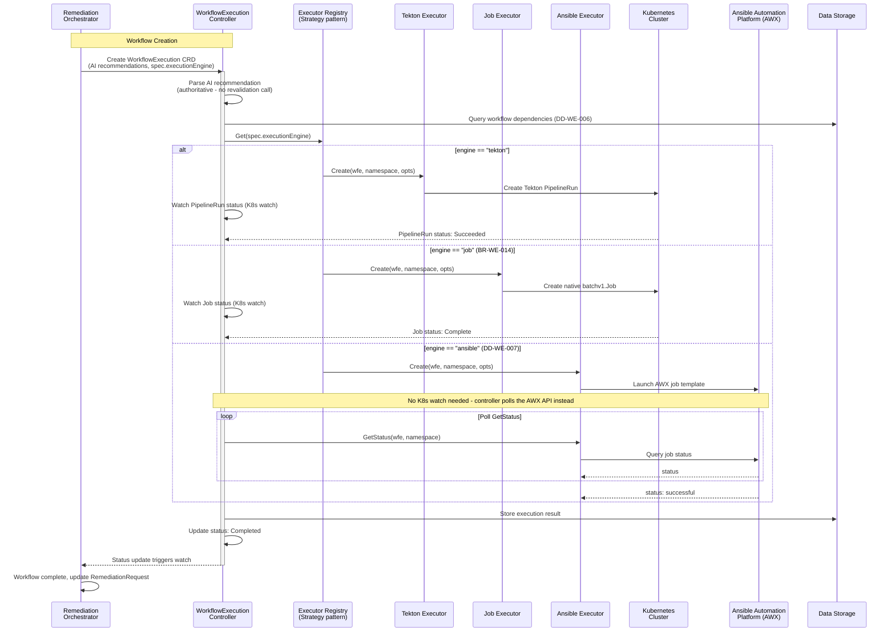

# Kubernaut - Approved Microservices Architecture

> **⚠️ AUGUST 2026 ACCURACY REWRITE (Issue #1806)** — read before using this document.
>
> This document previously described a design that never reached production: a standalone
> Python "HolmesGPT API" service, a synchronous `AI Analysis ↔ HolmesGPT API ↔ Context API`
> investigation loop, and a Dynamic Toolset discovery service. **None of that is the current
> architecture.** This revision replaces that content with the verified, currently-running
> system as of August 2026.
>
> **Confirmed dead / eliminated** (do not re-introduce as active components):
> - **HolmesGPT API (HAPI)**, standalone Python service — never reached GA; fully replaced by
>   **Kubernaut Agent (KA)**, a native Go rewrite ([DD-KA-019](decisions/DD-KA-019-go-rewrite-design/DD-KA-019-go-rewrite-design.md)).
>   The `BR-HAPI-001` to `BR-HAPI-185` requirement IDs are **retained for historical
>   traceability only** — per this document's ID-preservation rule, they are not renumbered,
>   but they no longer describe a currently active standalone Python service.
> - **Context API** — fully removed, no code, no active docs directory. Data Storage Service
>   absorbed its role ([DD-CONTEXT-006](decisions/DD-CONTEXT-006-CONTEXT-API-DEPRECATION.md)).
> - **Dynamic Toolset** — code deleted. Kept only as a V2.0-deferred historical record
>   ([DD-016](decisions/DD-016-dynamic-toolset-v2-deferral.md),
>   [DEPRECATED_V1_0.md](../services/stateless/dynamic-toolset/DEPRECATED_V1_0.md)). Kubernaut
>   Agent's toolsets (Kubernetes, Prometheus, Alertmanager) are static/built-in, not
>   dynamically discovered via a separate service.
> - **Kubernetes Executor** — designed as a standalone V1 service but **never implemented**.
>   Eliminated in favor of WorkflowExecution's in-process execution engines
>   ([ADR-025](decisions/ADR-025-kubernetesexecutor-service-elimination.md)).
> - **Multi-Model Orchestration Service** — zero code ever written. Remains a V2.0 backlog
>   concept only (`docs/requirements/15_ENHANCED_AI_MULTI_MODEL_ORCHESTRATION.md`).
> - **Effectiveness Monitor Level 2** (AI-powered post-execution analysis) — planned V1.1,
>   **not implemented**. Level 1 (deterministic automated assessment) is Active in V1.0
>   ([DD-017 v2.6](decisions/DD-017-effectiveness-monitor-v1.1-deferral.md)). Its docs live at
>   [`docs/services/crd-controllers/07-effectivenessmonitor/`](../services/crd-controllers/07-effectivenessmonitor/)
>   — **not** the old `docs/services/stateless/effectiveness-monitor/` path.
>
> **New real services this document predated** (added in this revision): **Kubernaut Agent
> (KA)**, **apifrontend**, **Auth Webhook**, **Fleet Metadata Cache**.

**Document Version**: 3.0
**Date**: August 2026
**Status**: **CURRENT PRODUCTION ARCHITECTURE** — full architectural-accuracy rewrite (Issue #1806)
**Architecture Type**: **12 active production services** (6 CRD controllers + 3 pure stateless
HTTP services + 1 admission-webhook/CRD hybrid + 1 stateless-HTTP/mini-CRD hybrid + 1 fleet
stateless HTTP service), plus 1 V1.1-planned capability and a V2.0 backlog

## 📋 Version History

| Version | Date | Changes | Author |
|---------|------|---------|--------|
| 3.0 | Aug 2026 | **Full architectural-accuracy rewrite** (Issue #1806): replaced all HolmesGPT API/HAPI references with Kubernaut Agent (KA); removed Context API and Dynamic Toolset from active service lists; corrected Multi-Model Orchestration to "never implemented, V2.0 backlog"; added the real services this document predated (Kubernaut Agent, apifrontend, Auth Webhook, Fleet Metadata Cache); rebuilt the Mermaid diagrams to show the real async KA submit/poll flow, RemediationApprovalRequest approval gate, and 3-engine WorkflowExecution dispatch (Tekton/Job/Ansible); fixed the Effectiveness Monitor doc link to `07-effectivenessmonitor/`; removed unverifiable claims (generic "8080 for all services", unattributed "oscillation detection" capability); fixed two dangling internal links (`05-central-controller.md`, `KUBERNAUT_IMPLEMENTATION_ROADMAP.md`). | AI Assistant |
| 2.7 | Feb 2026 | DD-017 v2.0 Integration: Effectiveness Monitor Level 1 (automated assessment) reinstated to V1.0. Level 2 (AI-powered analysis) remains V1.1. | AI Assistant |
| 2.6 | Dec 1, 2025 | DD-016 & DD-017 Integration: Dynamic Toolset deferred to V2.0. Effectiveness Monitor deferred to V1.1. | AI Assistant |
| 2.5 | Nov 13, 2025 | Context API Deprecation: service count 11 → 10. Context API deprecated in favor of Data Storage Service (DD-CONTEXT-006). | AI Assistant |
| 2.4 | Oct 31, 2025 | Updated 2 sequence diagrams: K8s Executor → Tekton Pipelines (per ADR-023, ADR-025) | AI Assistant |
| 2.3 | Oct 2025 | RemediationOrchestrator Specification & Approval Notification Integration | - |

---

## 🎯 **EXECUTIVE SUMMARY**

This document defines the **approved microservices architecture** for Kubernaut, an
intelligent Kubernetes remediation agent. As of August 2026, the production system comprises
**12 active services**, each adhering to the **Single Responsibility Principle**:

- **6 CRD controllers**: SignalProcessing, AIAnalysis, WorkflowExecution,
  RemediationOrchestrator, Notification, EffectivenessMonitor
- **3 pure stateless HTTP services**: Gateway, Data Storage, Kubernaut Agent (KA)
- **3 hybrid/platform services**: apifrontend (stateless HTTP + an embedded mini CRD
  controller for its own `InvestigationSession` CRD), Auth Webhook (K8s admission webhook +
  CRD controller), and Fleet Metadata Cache (stateless HTTP, multi-cluster fleet feature)

A `RemediationRequest` CRD is the backbone of every remediation. **Gateway** creates it from
inbound signals via a plain Kubernetes client (Gateway itself runs no `ctrl.Manager`).
**RemediationOrchestrator** is the reconciliation hub: it owns and watches six child CRD
kinds — `SignalProcessing`, `AIAnalysis`, `WorkflowExecution`, `RemediationApprovalRequest`,
`NotificationRequest`, and `EffectivenessAssessment` — carrying the request through
enrichment, AI-assisted root-cause analysis, an optional approval gate, execution, and
effectiveness scoring. **Kubernaut Agent (KA)** — a native Go AI engine, not a Python/HolmesGPT
SDK wrapper — is invoked **asynchronously** by AIAnalysis (submit a session, then poll for its
result), never as a single synchronous call. **Data Storage** is the single, unified audit sink
for the entire lifecycle ([ADR-034](decisions/ADR-034-unified-audit-table-design.md)) and also
computes the final weighted effectiveness score on demand. A separate external-facing entry
point, **apifrontend**, accepts natural-language queries (A2A/MCP), creates `RemediationRequest`
CRDs directly, and calls Kubernaut Agent independently through its own REST client for deep
investigation — "AF owns triage, KA owns investigation"
([DD-AF-004](decisions/DD-AF-004-investigation-tool-split.md)).

### **Key Architecture Principles**
- **Single Responsibility Principle**: Each service has exactly one responsibility
- **Business-Driven Decomposition**: Services align with business capabilities
- **Minimal Coupling**: Services communicate only when business requirements demand it
- **External System Integration**: Proper integration with all required external systems
- **Independent Scaling**: Each service scales based on its specific workload

---

## 🏗️ **ACTIVE SERVICE PORTFOLIO (12 Services)**

### **Core Production Services**

| Service | Type | Responsibility | Business Requirements | Status |
|---------|------|-----------------|------------------------|--------|
| **🔗 Gateway** | Stateless HTTP (no `ctrl.Manager`) | HTTP webhook ingestion & security; creates `RemediationRequest` CRDs via plain client | BR-WH-001 to BR-WH-015 | ✅ Active |
| **🔍 Signal Processing** | CRD controller | Signal enrichment + business/environment classification | BR-SP-001 to BR-SP-050, BR-ENV-001 to BR-ENV-050 | ✅ Active |
| **🤖 AI Analysis** | CRD controller | Root-cause analysis & workflow selection via **async** Kubernaut Agent submit/poll (`pkg/agentclient`); Rego policy gating (`pkg/aianalysis/rego/evaluator.go`) | BR-AI-001 to BR-AI-050 | ✅ Active |
| **🎯 Workflow Execution** | CRD controller | Multi-engine execution — Tekton `PipelineRun` \| native `batchv1.Job` \| Ansible/AWX — dispatched by Strategy pattern on `spec.executionEngine` (`pkg/workflowexecution/executor/`) | BR-WF-001 to BR-WF-165, BR-WE-014 | ✅ Active |
| **🎛️ Remediation Orchestrator** | CRD controller (reconciliation hub) | End-to-end remediation lifecycle; `.For(&RemediationRequest{})`, owns/watches 6 child CRD kinds | BR-ORCH-001 to BR-ORCH-050 | ✅ Active |
| **📢 Notification** | CRD controller | Multi-channel notifications driven by `NotificationRequest` CRDs (migrated from stateless HTTP in Oct 2025 — the old stateless design is dead) | BR-NOTIF-001 to BR-NOTIF-120 | ✅ Active |
| **📈 Effectiveness Monitor (Level 1)** | CRD controller, **no business API port** | Automated assessment via 4 deterministic scorers (hash, health, alert, metrics packages) — zero AI/LLM dependency in V1.0 | BR-INS-001, BR-INS-002, BR-INS-005 (partial) | ✅ Active (Level 1 only) |
| **📊 Data Storage** | Stateless HTTP | Data persistence, vector search, and the **unified audit sink for every other service** (ADR-034); computes the final weighted effectiveness score on demand | BR-STOR-001 to BR-STOR-135, BR-VDB-001 to BR-VDB-030 | ✅ Active |
| **🔍 Kubernaut Agent (KA)** | Stateless HTTP + MCP (native Go) | AI investigation engine; async session-based API (submit, then poll); multi-provider LLM support | Historical `BR-HAPI-001` to `BR-HAPI-185` IDs (legacy naming, **not** describing a live Python service) + `BR-KA-*` catalog | ✅ Active |
| **🚪 apifrontend (AF)** | Stateless HTTP + embedded mini CRD controller (`InvestigationSession`) | External-facing A2A/MCP natural-language gateway; own "Severity Triager" LLM (Claude via Vertex AI); creates `RemediationRequest` CRDs directly; separate REST client to KA for deep investigation | apifrontend-scoped BRs (see `docs/services/apifrontend/`) | ✅ Active |
| **🔐 Auth Webhook** | K8s admission webhook (port 9443) + CRD controller | Validates admission for `RemediationWorkflow` and `ActionType` CRDs and `NotificationRequest` deletions (ADR-058, ADR-059); runs the `RemediationWorkflow` finalizer reconciler (versioned, semver-validated workflow catalog) | (see `docs/services/shared/authentication-webhook/`) | ✅ Active |
| **🗺️ Fleet Metadata Cache (FMC)** | Stateless HTTP (no `ctrl.Manager`) | Multi-cluster "fleet" metadata caching for cross-cluster workflow targeting | (see ADR-068, DD-FLEET-001 to DD-FLEET-005) | ✅ Active |

**Service Breakdown**:
- **CRD Controllers** (6): Signal Processing, AI Analysis, Workflow Execution, Remediation Orchestrator, Notification, Effectiveness Monitor
- **Pure Stateless HTTP** (3): Gateway, Data Storage, Kubernaut Agent
- **Hybrid Stateless/CRD or Webhook** (3): apifrontend, Auth Webhook, Fleet Metadata Cache

**Important Notes**:
- **Environment Classification** (`BR-ENV-*`) is implemented as a sub-capability of Signal
  Processing, not a separate service. No standalone "Environment Classification Service" has
  ever been built (no `cmd/` entrypoint exists for it) — see the deprecated/backlog table below.
- **External infrastructure monitoring** (Prometheus, Grafana, Jaeger) are external systems,
  not Kubernaut microservices.
- **Package Naming**: Signal Processing is implemented in `pkg/signalprocessing/` for naming
  consistency with the service name.

### **V1.1 — Planned, Not Yet Implemented**

| Capability | Responsibility | Business Requirements | Status |
|------------|-----------------|------------------------|--------|
| **📈 Effectiveness Monitor (Level 2)** | AI-powered post-execution analysis via Kubernaut Agent, pattern learning, batch processing | BR-INS-003, BR-INS-004, BR-INS-006 to BR-INS-010 | ⏸️ **Not implemented.** DD-017 v2.6: requires 8+ weeks of Level 1 data before Level 2 can be meaningfully built. If ever built, it would call Kubernaut Agent — **not** "HolmesGPT" as described in earlier revisions of this document. |

### **V2.0 — Backlog Concepts (Zero Code, No `cmd/` Entrypoint)**

| Service Concept | Responsibility | Business Requirements | Status |
|------------------|-----------------|------------------------|--------|
| **🧠 Multi-Model Orchestration** | Ensemble AI decision-making across multiple LLMs | BR-ENSEMBLE-001 to BR-ENSEMBLE-020 | ⛔ Never implemented. Pure backlog concept — see `docs/requirements/15_ENHANCED_AI_MULTI_MODEL_ORCHESTRATION.md`. Not a peer of the active V1.0 services above. |
| **🔍 Intelligence** | Advanced pattern discovery across historical remediations | BR-INT-001 to BR-INT-150 | ⛔ Not started |
| **🔐 Security & Access Control** | Dedicated RBAC/secrets-management service | BR-RBAC-001 to BR-SEC-050 | ⛔ Not started (auth today is handled per-service, e.g. Auth Webhook's admission control — no dedicated standalone service exists) |
| **💚 Enhanced Health Monitoring** | LLM health & enterprise monitoring | BR-HEALTH-020 to BR-HEALTH-050 | ⛔ Not started |
| **🏷️ Environment Classification** (as a standalone service) | Namespace environment classification | BR-ENV-001 to BR-ENV-050 | ⛔ Never built standalone — implemented today inside Signal Processing |

### **Confirmed Dead / Eliminated (Do Not Re-Introduce)**

| Item | What Happened | Authority |
|------|----------------|-----------|
| **HolmesGPT API (HAPI)**, standalone Python service | Never reached GA. Fully replaced by Kubernaut Agent (KA), a native Go rewrite. | [DD-KA-019](decisions/DD-KA-019-go-rewrite-design/DD-KA-019-go-rewrite-design.md) |
| **Context API** | Fully removed — no code, no docs directory. Data Storage absorbed its role. | [DD-CONTEXT-006](decisions/DD-CONTEXT-006-CONTEXT-API-DEPRECATION.md) |
| **Dynamic Toolset** | Code deleted. Historical record only. KA's toolsets are static/built-in. | [DD-016](decisions/DD-016-dynamic-toolset-v2-deferral.md) |
| **Kubernetes Executor** (standalone service) | Designed, never implemented. Replaced by WorkflowExecution's execution engines. | [ADR-025](decisions/ADR-025-kubernetesexecutor-service-elimination.md) |

---

## 🔄 **SERVICE FLOW ARCHITECTURE**

### **Current Architecture — All 12 Active Services**


```mermaid
flowchart TB
    subgraph EXTERNAL["🌐 External Systems"]
        SIG[📊 Signal Sources<br/>Prometheus, K8s Events<br/>CloudWatch, Webhooks]
        NLQ[💬 NL Query Clients<br/>A2A / MCP callers]
        K8S[☸️ Kubernetes<br/>Clusters]
        PROM[📊 External Infrastructure<br/>Prometheus, Grafana, Jaeger]
        LLM[🧠 LLM Providers<br/>VertexAI, Anthropic, Gemini, OpenAI,<br/>Azure OpenAI, Ollama, vLLM, etc.]
        CHAT[📣 Slack / Teams / Email<br/>PagerDuty]
        AAP[⚙️ Ansible Automation<br/>Platform - AWX]
    end

    subgraph MAIN["🎯 Core Remediation Pipeline (CRD Controllers)"]
        direction LR
        GW[🔗 Gateway]
        ORCH[🎛️ Remediation<br/>Orchestrator]
        SP[🔍 Signal<br/>Processing]
        AI[🤖 AI Analysis]
        WF[🎯 Workflow<br/>Execution]
    end

    subgraph AIENGINE["🧠 AI Engine (Async)"]
        KA[🔍 Kubernaut Agent<br/>native Go, submit/poll]
    end

    subgraph EXEC["⚙️ Execution Engines (Strategy Pattern)"]
        TEK[🔧 Tekton PipelineRun]
        JOB[📦 Native batchv1.Job]
        AWX[🤖 Ansible/AWX Job]
    end

    subgraph SUPPORT["🔧 Support Services"]
        ST[📊 Data Storage<br/>Unified Audit Sink]
        EFF[📈 Effectiveness<br/>Monitor]
        NOT[📢 Notification]
    end

    subgraph EDGE["🚪 External-Facing Entry"]
        AF[apifrontend<br/>NL-query gateway]
    end

    subgraph PLATFORM["🛰️ Platform / Fleet Services"]
        AUTHWH[🔐 Auth Webhook]
        FMC[🗺️ Fleet Metadata<br/>Cache]
    end

    %% Primary signal flow
    SIG --> GW
    NLQ --> AF
    GW -->|creates RemediationRequest CRD<br/>via plain client| ORCH
    AF -->|creates RemediationRequest CRD<br/>directly, separate entry point| ORCH

    %% Orchestration: owns/watches child CRD kinds
    ORCH -->|creates & watches| SP
    ORCH -->|creates & watches| AI
    ORCH -->|creates & watches| WF
    ORCH -->|creates & watches| NOT
    ORCH -->|creates & watches| EFF
    SP -.->|status update| ORCH
    AI -.->|status update| ORCH
    WF -.->|status update| ORCH

    %% Approval gate (ADR-040)
    AI -->|phase=Approving<br/>confidence 60-79% or<br/>Rego-mandated| ORCH
    ORCH -->|creates| RAR[(RemediationApprovalRequest)]
    RAR -.->|watched via field index;<br/>Approved unblocks next phase| AI

    %% AI Analysis <-> Kubernaut Agent (async, no Context API, no toolset-fetch call)
    AI -.->|async submit + poll| KA
    KA -.->|static built-in toolsets<br/>query cluster state| K8S
    KA <-.-> LLM

    %% Workflow dispatch - exactly one engine per spec.executionEngine
    WF -->|engine=tekton| TEK
    WF -->|engine=job| JOB
    WF -->|engine=ansible, no K8s watch| AWX
    TEK --> K8S
    JOB --> K8S
    AWX --> AAP

    %% Audit sink (ADR-034) - every service emits audit events
    GW -.->|audit events| ST
    SP -.->|audit events| ST
    AI -.->|audit events| ST
    WF -.->|audit events| ST
    ORCH -.->|audit events| ST
    NOT -.->|audit events| ST
    EFF -->|4 component scores| ST
    ST -.->|computes final weighted score<br/>on demand: health*0.40+alert*0.35+metrics*0.25| EFF

    %% Effectiveness
    EFF -.->|queries metrics| PROM

    %% Notifications
    NOT --> CHAT

    %% External-facing entry point calls KA independently
    AF -.->|separate REST client,<br/>deep investigation - DD-AF-004| KA
    AF -.-> LLM

    %% Platform services (not part of the main remediation path)
    AUTHWH -.->|admission review +<br/>reconciles workflow catalog CRD| K8S
    FMC -.->|caches cluster metadata| K8S

    style EXTERNAL fill:#f5f5f5,stroke:#9e9e9e,stroke-width:2px,color:#000
    style MAIN fill:#e3f2fd,stroke:#1976d2,stroke-width:3px,color:#000
    style AIENGINE fill:#f3e5f5,stroke:#7b1fa2,stroke-width:3px,color:#000
    style EXEC fill:#fff3e0,stroke:#e65100,stroke-width:3px,color:#000
    style SUPPORT fill:#e8f5e9,stroke:#388e3c,stroke-width:3px,color:#000
    style EDGE fill:#ede7f6,stroke:#5e35b1,stroke-width:3px,color:#000
    style PLATFORM fill:#eceff1,stroke:#455a64,stroke-width:3px,color:#000

    style GW fill:#bbdefb,stroke:#1976d2,stroke-width:2px,color:#000
    style SP fill:#bbdefb,stroke:#1976d2,stroke-width:2px,color:#000
    style AI fill:#e1bee7,stroke:#7b1fa2,stroke-width:2px,color:#000
    style WF fill:#bbdefb,stroke:#1976d2,stroke-width:2px,color:#000
    style ORCH fill:#ffcdd2,stroke:#c62828,stroke-width:2px,color:#000
    style KA fill:#e1bee7,stroke:#7b1fa2,stroke-width:2px,color:#000
    style TEK fill:#ffe0b2,stroke:#e65100,stroke-width:2px,color:#000
    style JOB fill:#ffe0b2,stroke:#e65100,stroke-width:2px,color:#000
    style AWX fill:#ffe0b2,stroke:#e65100,stroke-width:2px,color:#000
    style ST fill:#c8e6c9,stroke:#388e3c,stroke-width:2px,color:#000
    style EFF fill:#c8e6c9,stroke:#388e3c,stroke-width:2px,color:#000
    style NOT fill:#c8e6c9,stroke:#388e3c,stroke-width:2px,color:#000
    style AF fill:#d1c4e9,stroke:#5e35b1,stroke-width:2px,color:#000
    style AUTHWH fill:#cfd8dc,stroke:#455a64,stroke-width:2px,color:#000
    style FMC fill:#cfd8dc,stroke:#455a64,stroke-width:2px,color:#000
    style RAR fill:#ffcdd2,stroke:#c62828,stroke-width:2px,color:#000
    style SIG fill:#e0e0e0,stroke:#616161,stroke-width:2px,color:#000
    style NLQ fill:#e0e0e0,stroke:#616161,stroke-width:2px,color:#000
    style K8S fill:#e0e0e0,stroke:#616161,stroke-width:2px,color:#000
    style PROM fill:#e0e0e0,stroke:#616161,stroke-width:2px,color:#000
    style LLM fill:#e0e0e0,stroke:#616161,stroke-width:2px,color:#000
    style CHAT fill:#e0e0e0,stroke:#616161,stroke-width:2px,color:#000
    style AAP fill:#e0e0e0,stroke:#616161,stroke-width:2px,color:#000
```

### **📖 Architecture Legend**

**Service Groups**:
- 🎯 **Core Remediation Pipeline** (Blue subgraph): Gateway → RemediationOrchestrator →
  SignalProcessing → AIAnalysis → WorkflowExecution (5 CRD-based services)
- 🧠 **AI Engine** (Purple subgraph): Kubernaut Agent, invoked asynchronously by AIAnalysis
- ⚙️ **Execution Engines** (Orange subgraph): Tekton, native Job, Ansible/AWX — exactly one
  chosen per `WorkflowExecution.spec.executionEngine`
- 🔧 **Support Services** (Green subgraph): Data Storage (unified audit sink), Effectiveness
  Monitor, Notification
- 🚪 **External-Facing Entry** (Violet subgraph): apifrontend — a second, independent entry
  point that does not go through Gateway
- 🛰️ **Platform / Fleet Services** (Gray-blue subgraph): Auth Webhook, Fleet Metadata Cache
- 🌐 **External Systems** (Gray): Signal sources, Kubernetes, LLM providers, chat/paging
  systems, Ansible Automation Platform — none of these are Kubernaut services

**Port Standards** (real per-service ports — there is no generic "8080 for everything"):
- **Gateway, Data Storage**: API `8080`, health `8081`, metrics `9090`
- **Kubernaut Agent**: HTTPS `8443`, health `8081`, metrics `9090`
- **Pure CRD controllers** (Signal Processing, Workflow Execution, Remediation Orchestrator,
  Notification, Effectiveness Monitor): health `8081`, metrics `9090` — **no API port**
- **AI Analysis**: API `8080`, health `8081`, metrics `9090` — the extra API port's purpose is
  not fully documented; do not assume its function beyond that
- **apifrontend, Fleet Metadata Cache**: 3 ports each (API/HTTPS, health, metrics); exact
  numbers are configurable via Helm values
- **Auth Webhook**: admission webhook on `9443`, plus controller-runtime health/metrics ports

**Arrow Types**:
- `→` **Solid arrow**: Direct call, CRD creation, or data write (push model)
- `-.->` **Dotted arrow**: Query/poll, watch, or bidirectional relationship (pull model)

### **🔄 Service Flow Summary**

**Primary Processing Path**:
```
Signal Sources → Gateway → creates RemediationRequest → RemediationOrchestrator
  → SignalProcessing (enrichment) → AIAnalysis (RCA + workflow selection)
  → [optional approval gate] → WorkflowExecution → Execution Engine (Tekton | Job | Ansible/AWX)
  → Kubernetes
```

**AI Investigation Flow** (replaces the old, never-real "AI Analysis ↔ HolmesGPT API ↔
Context API" loop):
```
AIAnalysis --(async: submit session, then poll)--> Kubernaut Agent (KA)
                                                        ↕
                                    Static, built-in toolsets (Kubernetes, Prometheus,
                                    Alertmanager) — no separate Dynamic Toolset service,
                                    no Context API round-trip
```

**Storage Interactions** (Query/Audit Pattern):
- **Every service in the core pipeline** (Gateway, SignalProcessing, AIAnalysis,
  WorkflowExecution, RemediationOrchestrator, Notification, EffectivenessMonitor) emits audit
  events to Data Storage — the single, unified audit sink (ADR-034)
- **Effectiveness Monitor** submits its 4 component scores (hash, health, alert, metrics) to
  Data Storage, which computes the final weighted score
  (`health*0.40 + alert*0.35 + metrics*0.25`) — **Data Storage does the arithmetic, not
  Effectiveness Monitor**

**Effectiveness Monitor Pattern (V1.0, Level 1 only)**:
- 4 deterministic scorers: spec-hash comparison (pre/post remediation state), health checks,
  metric comparison, side-effect detection — zero AI/LLM dependency
- Queries external Prometheus/Grafana for metrics correlation
- Level 2 (AI-powered post-execution analysis, pattern learning) is planned V1.1 and **not
  implemented** — if built, it would call Kubernaut Agent, not "HolmesGPT"

**Approval Gate Flow** (ADR-040, ADR-018):
```
AIAnalysis (confidence 60-79% OR Rego policy mandates approval)
  → status.phase = "Approving"
  → RemediationOrchestrator creates RemediationApprovalRequest CRD (owned by RemediationRequest,
    gates WorkflowExecution creation) + NotificationRequest CRD (operator notification)
  → Notification Service → Slack/Console
  → Operator records decision on RemediationApprovalRequest.status.decision
  → AIAnalysis (watching via field index on spec.aiAnalysisRef.name) observes the decision
  → Approved: RemediationOrchestrator proceeds to create WorkflowExecution
```

**V2.0 Backlog Path** (not implemented — for roadmap discussion only):
```
Signal Sources → Gateway → Signal Processing → AI Analysis → [never-built Multi-Model
Orchestration] → Workflow Execution → Execution Engine
```

---

## 🔄 **SEQUENCE DIAGRAMS**

### **Signal to Remediation (Current)**

This sequence diagram shows the complete, currently-running flow from signal ingestion through
effectiveness assessment.


```mermaid
sequenceDiagram
    participant SRC as Signal Source<br/>(Prometheus/K8s Events)
    participant GW as Gateway
    participant K8SAPI as Kubernetes API<br/>(CRD store)
    participant ORCH as Remediation<br/>Orchestrator
    participant SP as Signal<br/>Processing
    participant AI as AI Analysis
    participant KA as Kubernaut<br/>Agent (KA)
    participant WF as Workflow<br/>Execution
    participant EXEC as Execution Engine<br/>(Tekton / Job / AWX)
    participant K8S as Kubernetes<br/>Cluster
    participant NOT as Notification
    participant EXT as Slack/Console
    participant ST as Data<br/>Storage
    participant EM as Effectiveness<br/>Monitor

    Note over SRC,ST: Phase 1: Signal Ingestion
    SRC->>GW: POST /webhook (signal)
    GW->>GW: Validate & deduplicate
    GW->>GW: Classify environment
    GW->>ST: Emit audit event (ADR-034)
    GW->>K8SAPI: Create RemediationRequest CRD<br/>(plain client - Gateway has no ctrl.Manager)
    GW-->>SRC: 202 Accepted
    K8SAPI-->>ORCH: Watch triggers reconcile

    Note over SP,ORCH: Phase 2: Signal Processing
    ORCH->>K8SAPI: Create SignalProcessing CRD
    K8SAPI-->>SP: Watch triggers reconcile
    SP->>SP: Enrich signal, add cluster context
    SP->>ST: Emit audit event
    SP->>SP: Update status: Completed
    SP-->>ORCH: Status update triggers watch

    Note over AI,KA: Phase 3: AI Analysis (async Kubernaut Agent investigation)
    ORCH->>K8SAPI: Create AIAnalysis CRD
    K8SAPI-->>AI: Watch triggers reconcile
    AI->>KA: Submit investigation session (async, pkg/agentclient)
    activate KA
    KA-->>AI: 202 Accepted { sessionId }
    deactivate KA
    loop Poll until terminal state
        AI->>KA: GET session status
        KA-->>AI: status: running
    end
    AI->>KA: GET session status
    KA-->>AI: status: completed (root cause + recommendations)
    AI->>AI: Evaluate Rego policy (pkg/aianalysis/rego/evaluator.go)

    alt Confidence 60-79% OR Rego mandates approval
        AI->>AI: Update status: phase=Approving
        AI-->>ORCH: Status update triggers watch
        Note over ORCH,NOT: Phase 3.5: Approval Gate (ADR-040, ADR-018)
        ORCH->>K8SAPI: Create RemediationApprovalRequest CRD<br/>(owned by RemediationRequest)
        ORCH->>K8SAPI: Create NotificationRequest CRD
        K8SAPI-->>NOT: Watch triggers reconcile
        NOT->>EXT: Send approval notification (Slack/Console)
        Note over EXT,K8SAPI: Operator records decision on<br/>RemediationApprovalRequest.status.decision
        K8SAPI-->>AI: Watch (field index on spec.aiAnalysisRef.name)
        AI->>AI: Decision=Approved -> status: Completed
    else High confidence, no policy hold
        AI->>AI: Update status: Completed
    end
    AI-->>ORCH: Status update triggers watch

    Note over WF,K8S: Phase 4: Workflow Execution
    ORCH->>K8SAPI: Create WorkflowExecution CRD
    K8SAPI-->>WF: Watch triggers reconcile
    WF->>WF: Dispatch on spec.executionEngine<br/>(Strategy pattern, pkg/workflowexecution/executor/)
    WF->>EXEC: Create execution resource<br/>(PipelineRun | Job | AWX job)
    EXEC->>K8S: Apply remediation (or AAP applies it, for Ansible)
    EXEC-->>WF: GetStatus (poll or K8s watch, per engine)
    WF->>ST: Store execution results
    WF->>WF: Update status: Completed
    WF-->>ORCH: Status update triggers watch

    Note over ORCH,EM: Phase 5: Effectiveness Assessment
    ORCH->>K8SAPI: Create EffectivenessAssessment CRD (ADR-EM-001)
    K8SAPI-->>EM: Watch triggers reconcile
    EM->>EM: Run 4 deterministic scorers<br/>(hash, health, alert, metrics)
    EM->>ST: Submit component scores
    ST->>ST: ComputeWeightedScore<br/>(health*0.40 + alert*0.35 + metrics*0.25)
    EM-->>ORCH: Status update triggers watch

    Note over ORCH,ST: Phase 6: Lifecycle Completion
    ORCH->>ORCH: Update RemediationRequest: Completed
    ORCH->>ST: Store final audit trail
```

**Key Characteristics**:
- **CRD-Based Communication**: Services communicate via Kubernetes Custom Resources, mediated
  by the Kubernetes API server (not direct service-to-service RPC, except AIAnalysis ↔
  Kubernaut Agent and the Execution Engine ↔ external systems calls)
- **Event-Driven**: Each controller watches for CRD changes and reconciles
- **Orchestrated**: RemediationOrchestrator owns/watches all 6 child CRD kinds and monitors the
  entire lifecycle
- **Approval-Aware**: A dedicated `RemediationApprovalRequest` CRD (not just a notification)
  gates `WorkflowExecution` creation for medium-confidence or policy-mandated cases
- **Auditable**: All state changes are stored in CRDs and in Data Storage's unified audit table
- **Resilient**: Built-in retry and reconciliation loops

---

### **AI Analysis ↔ Kubernaut Agent Investigation Sequence (Detailed)**

This replaces the old (never-real) HolmesGPT/Context API/Dynamic-Toolset investigation
diagram. Kubernaut Agent is invoked **asynchronously** — AIAnalysis submits a session and polls
for its result; there is no single synchronous "investigate" call and no separate toolset
discovery service.


```mermaid
sequenceDiagram
    participant AI as AI Analysis<br/>Controller
    participant KA as Kubernaut Agent<br/>(native Go)
    participant TOOL as Built-in Toolsets<br/>(Kubernetes, Prometheus,<br/>Alertmanager - static)
    participant K8S as Kubernetes<br/>Cluster
    participant LLM as LLM Provider<br/>(VertexAI/Anthropic/Gemini/OpenAI/<br/>Azure OpenAI/Ollama/vLLM/etc.)
    participant ST as Data Storage

    Note over AI,ST: Async Investigation - submit then poll, never a single blocking call
    AI->>KA: POST /v1/sessions (submit investigation)
    activate KA
    KA-->>AI: 202 Accepted { sessionId }
    deactivate KA

    Note over KA,TOOL: Session runs asynchronously inside Kubernaut Agent
    activate KA
    KA->>KA: Sanitize signal input (DD-KA-005)
    KA->>ST: Query remediation history context (DD-KA-016)
    KA->>KA: Build investigation prompt<br/>(signal + remediation target + history)
    KA->>LLM: Send prompt + static tool definitions
    activate LLM
    LLM-->>KA: Tool calls requested<br/>(get_pods, get_logs, get_events, ...)
    deactivate LLM
    KA->>TOOL: Invoke built-in toolset (no discovery call)
    TOOL->>K8S: Read-only cluster queries
    K8S-->>TOOL: Cluster state
    TOOL-->>KA: Tool results
    KA->>LLM: Send tool results for final analysis
    activate LLM
    LLM-->>KA: Root cause + ranked recommendations
    deactivate LLM
    KA->>KA: Confidence scoring (DD-KA-004)
    KA->>KA: Session status: completed
    deactivate KA

    Note over AI,KA: AIAnalysis controller polls (non-blocking reconcile loop)
    loop Until terminal state
        AI->>KA: GET /v1/sessions/{sessionId}
        KA-->>AI: status: running
    end
    AI->>KA: GET /v1/sessions/{sessionId}
    KA-->>AI: status: completed { rootCause, recommendations, confidence }
    AI->>AI: Rego policy evaluation (approval gating)
```

**Investigation Capabilities**:
- **Native Go, not a Python wrapper**: Kubernaut Agent is a ground-up Go rewrite
  ([DD-KA-019](decisions/DD-KA-019-go-rewrite-design/DD-KA-019-go-rewrite-design.md)), not a
  wrapper around a HolmesGPT Python SDK
- **Async session API**: `pkg/agentclient` is a mandatory OpenAPI-generated client
  ([DD-KA-003](decisions/DD-KA-003-mandatory-openapi-client-usage.md)) used for submit/poll —
  there is no synchronous `POST /api/v1/investigate` endpoint
- **Static, built-in toolsets**: Kubernetes, Prometheus, and Alertmanager tools are compiled
  into Kubernaut Agent; there is no runtime toolset-discovery call to a separate service
- **Multi-provider LLM support**: VertexAI, Anthropic, Gemini, OpenAI, Azure OpenAI, Ollama,
  vLLM, LlamaStack, Mistral, HuggingFace TGI, DeepSeek
- **LLM input sanitization**: DD-KA-005
- **Remediation target included in RCA**: DD-KA-006
- **Remediation history context**: DD-KA-016
- **V1 confidence scoring**: DD-KA-004
- **No Context API round-trip**: historical/pattern context that used to be described as
  fetched from a separate "Context API" is queried directly from Data Storage

---

### **Workflow Execution Sequence (Detailed)**

This replaces the old Tekton-only diagram. `WorkflowExecution` dispatches to exactly **one** of
three execution engines per `spec.executionEngine`, using a Strategy pattern (Registry of
`Executor` implementations in `pkg/workflowexecution/executor/`).


```mermaid
sequenceDiagram
    participant ORCC as Remediation<br/>Orchestrator
    participant WFC as WorkflowExecution<br/>Controller
    participant REG as Executor Registry<br/>(Strategy pattern)
    participant TEK as Tekton Executor
    participant JOB as Job Executor
    participant AWXX as Ansible Executor
    participant K8S as Kubernetes<br/>Cluster
    participant AAP as Ansible Automation<br/>Platform (AWX)
    participant ST as Data Storage

    Note over WFC,ORCC: Workflow Creation
    ORCC->>WFC: Create WorkflowExecution CRD<br/>(AI recommendations, spec.executionEngine)
    activate WFC

    WFC->>WFC: Parse AI recommendation<br/>(authoritative - no revalidation call)
    WFC->>ST: Query workflow dependencies (DD-WE-006)
    WFC->>REG: Get(spec.executionEngine)

    alt engine == "tekton"
        REG->>TEK: Create(wfe, namespace, opts)
        TEK->>K8S: Create Tekton PipelineRun
        WFC->>WFC: Watch PipelineRun status (K8s watch)
        K8S-->>WFC: PipelineRun status: Succeeded
    else engine == "job" (BR-WE-014)
        REG->>JOB: Create(wfe, namespace, opts)
        JOB->>K8S: Create native batchv1.Job
        WFC->>WFC: Watch Job status (K8s watch)
        K8S-->>WFC: Job status: Complete
    else engine == "ansible" (DD-WE-007)
        REG->>AWXX: Create(wfe, namespace, opts)
        AWXX->>AAP: Launch AWX job template
        Note over WFC,AAP: No K8s watch needed - controller polls the AWX API instead
        loop Poll GetStatus
            WFC->>AWXX: GetStatus(wfe, namespace)
            AWXX->>AAP: Query job status
            AAP-->>AWXX: status
        end
        AAP-->>AWXX: status: successful
    end

    WFC->>ST: Store execution result
    WFC->>WFC: Update status: Completed
    WFC-->>ORCC: Status update triggers watch
    deactivate WFC
    ORCC->>ORCC: Workflow complete, update RemediationRequest
```

**Workflow Orchestration Capabilities**:
- **Strategy Pattern Dispatch**: `Executor` interface (`Create`, `GetStatus`, `Cleanup`,
  `Engine()`) implemented by three engines, selected via a `Registry` keyed on
  `spec.executionEngine` (`"tekton"`, `"job"`, `"ansible"`)
- **Tekton `PipelineRun`**: watched via the Kubernetes API (K8s watch)
- **Native `batchv1.Job`** (BR-WE-014): watched via the Kubernetes API (K8s watch)
- **Ansible/AWX** (DD-WE-007): launched via the Ansible Automation Platform's REST API; **no
  Kubernetes watch is needed** — the controller polls `GetStatus` against the AWX API instead
- **AI Recommendations Authority**: Uses AI recommendations as the authoritative source (no
  Context API revalidation call — Context API does not exist)
- **Dependency Injection**: Schema-declared infrastructure dependencies are queried from Data
  Storage and passed to the chosen executor (DD-WE-006)
- **Audit Trail**: Complete execution history stored in Data Storage

This architecture enables workflow execution across three different runtime backends behind a
single, consistent controller-facing interface.

---

**Key Architecture Characteristics**:
- **12 Active Services**: Complete signal-to-execution pipeline (6 CRD controllers + 3 pure
  stateless HTTP + 3 hybrid/platform services)
- **Real Per-Service Ports**: No generic "one port for everything" — see the Port Standards
  table above
- **Async AI Engine**: AIAnalysis never blocks on a single synchronous investigation call
- **Multi-Engine Execution**: WorkflowExecution dispatches to Tekton, native Job, or
  Ansible/AWX via a Strategy pattern, not Tekton exclusively
- **Unified Audit Sink**: Data Storage is the single sink for every service's audit events
  (ADR-034), and also computes the final weighted effectiveness score

---

## 📋 **SERVICE SPECIFICATIONS**

### **🔗 Gateway Service**
**Image**: `quay.io/jordigilh/gateway-service`
**Type**: Stateless HTTP — runs **no `ctrl.Manager`**
**Port**: 8080 (API/health), 8081 (health), 9090 (metrics)
**Single Responsibility**: HTTP Gateway & Security Only

**Capabilities**:
- HTTP webhook processing for Prometheus/Grafana alerts
- Authentication and authorization (BR-WH-004, BR-SEC-006)
- Rate limiting and request throttling (BR-WH-006, BR-WH-007)
- **Request validation and deduplication** (BR-WH-003, BR-WH-008) — **PRIMARY RESPONSIBILITY**
- **Alert storm detection and escalation** (BR-ALERT-003, BR-ALERT-006) — **EXCLUSIVE RESPONSIBILITY**
- Security enforcement and SSL/TLS termination
- **Creates `RemediationRequest` CRDs via a plain Kubernetes client** — Gateway is stateless
  HTTP and does not run a `ctrl.Manager` or watch any CRDs itself

**Critical Architecture Note**: Gateway Service is the **ONLY** service that performs duplicate
alert detection. All downstream services receive only non-duplicate signals via
`RemediationRequest` CRDs.

**External Integrations**:
- Prometheus AlertManager (webhook endpoint)
- Grafana (alert webhook integration)
- External monitoring systems

---

### **🔍 Signal Processing Service**
**Image**: `quay.io/jordigilh/signalprocessing`
**Type**: CRD controller
**Port**: 8081 (health/ready), 9090 (metrics) — **no business API port**
**Single Responsibility**: Signal Enrichment & Business Classification

**Capabilities**:
- Signal filtering and validation (BR-SP-001 to BR-SP-010)
- Signal enrichment with contextual information
- Signal lifecycle management and state tracking (BR-SP-021 to BR-SP-025)
- **Environment/business classification** (BR-ENV-001 to BR-ENV-050) — implemented here, not
  by any standalone "Environment Classification Service" (none has ever been built)
- Signal deduplication and correlation support
- Signal processing metrics and analytics

**Internal Dependencies**:
- Watches `SignalProcessing` CRDs created by RemediationOrchestrator
- Emits audit events to Data Storage (ADR-034)
- Status updates trigger RemediationOrchestrator's next reconcile

---

### **🤖 AI Analysis Service**
**Image**: `quay.io/jordigilh/ai-service`
**Type**: CRD controller
**Port**: 8080 (API — purpose not fully documented), 8081 (health/ready), 9090 (metrics)
**Single Responsibility**: AI Analysis & Decision Making Only

**Capabilities**:
- Root-cause analysis and recommendation selection via **asynchronous** Kubernaut Agent
  investigation (BR-AI-001 to BR-AI-050)
- Rego policy evaluation for approval gating (`pkg/aianalysis/rego/evaluator.go`)
- Confidence-threshold-based approval routing (60-79% confidence, or Rego-mandated approval)
- Watches `RemediationApprovalRequest` CRDs via a field index on `spec.aiAnalysisRef.name`
  ([ADR-040](decisions/ADR-040-remediation-approval-request-architecture.md))

**External Integrations**:
- **Kubernaut Agent (KA)** — async submit/poll via `pkg/agentclient` (mandatory
  OpenAPI-generated client, DD-KA-003). This is the **only** AI investigation dependency; there
  is no separate "HolmesGPT API" service and no "Context API" round-trip.

**Internal Dependencies**:
- Watches `AIAnalysis` CRDs created by RemediationOrchestrator
- Submits investigation sessions to Kubernaut Agent and polls for results
- Emits audit events to Data Storage (ADR-034)
- Status updates (including `phase=Approving`) trigger RemediationOrchestrator's next reconcile

---

### **🎯 Workflow Execution Service**
**Image**: `quay.io/jordigilh/workflow-service`
**Type**: CRD controller
**Port**: 8081 (health/ready), 9090 (metrics) — **no business API port**
**Single Responsibility**: Workflow Execution Only

**Capabilities**:
- **Three execution engines** behind a Strategy-pattern `Executor` interface
  (`pkg/workflowexecution/executor/`), dispatched by a `Registry` keyed on
  `spec.executionEngine`:
  - **Tekton `PipelineRun`** — watched via Kubernetes API
  - **Native `batchv1.Job`** (BR-WE-014) — watched via Kubernetes API
  - **Ansible/AWX** via the Ansible Automation Platform (DD-WE-007) — no Kubernetes watch;
    polls the AWX REST API instead
- Dependency injection of schema-declared infrastructure requirements (DD-WE-006)
- Safety constraint validation before execution
- AI recommendations treated as authoritative (no revalidation call — Context API does not
  exist)

**Internal Dependencies**:
- Watches `WorkflowExecution` CRDs created by RemediationOrchestrator
- Queries Data Storage for workflow dependencies (DD-WE-006)
- Creates the execution resource for the selected engine; the Kubernetes Executor Service
  described in earlier revisions of this document **was never implemented** as a standalone
  service — its intended responsibilities live here (ADR-025)

---

### **🎛️ Remediation Orchestrator Service**
**CRD**: `RemediationRequest`
**Image**: `quay.io/jordigilh/remediationorchestrator`
**Type**: CRD controller — the reconciliation hub
**Port**: 8081 (health/ready), 9090 (metrics) — **no business API port**
**Single Responsibility**: End-to-End Remediation Lifecycle Management Only

**Capabilities**:
- **CRD Orchestration**: `.For(&RemediationRequest{})`, owns and watches **6 child CRD
  kinds**: `SignalProcessing`, `AIAnalysis`, `WorkflowExecution`, `RemediationApprovalRequest`,
  `NotificationRequest`, `EffectivenessAssessment` (BR-ORCH-001 to BR-ORCH-010)
- **Lifecycle Tracking**: Monitors remediation phases with comprehensive state management
  (BR-ORCH-011 to BR-ORCH-020)
- **Approval Gate Creation**: Creates `RemediationApprovalRequest` CRDs (owned by
  `RemediationRequest`) when AIAnalysis requires approval
  ([ADR-040](decisions/ADR-040-remediation-approval-request-architecture.md)), plus
  `NotificationRequest` CRDs to alert operators ([ADR-018](decisions/ADR-018-approval-notification-v1-integration.md))
- **Effectiveness Assessment Creation**: Creates `EffectivenessAssessment` CRDs on terminal
  phases ([ADR-EM-001](decisions/ADR-EM-001-effectiveness-monitor-service-integration.md))
- **Failure Escalation**: Triggers notifications for timeout, rejection, and execution failures
  (BR-ORCH-021 to BR-ORCH-030)
- **Status Aggregation**: Aggregates child CRD status into the parent `RemediationRequest`
  status (BR-ORCH-031 to BR-ORCH-040)
- **Audit Controller**: Also runs a dedicated `RemediationApprovalRequest` audit controller
  (BR-AUDIT-006)

**CRD Watch Configuration**:
- **Owns**: `RemediationRequest` CRD (primary reconciliation target)
- **Watches/Creates**: `SignalProcessing`, `AIAnalysis`, `WorkflowExecution`,
  `RemediationApprovalRequest`, `NotificationRequest`, `EffectivenessAssessment`

**Approval Gate Logic** (ADR-040, ADR-018):
```yaml
# Triggers approval gate when AIAnalysis requires approval
if aiAnalysis.status.phase == "Approving" && !remediation.status.approvalRequestCreated:
  - Create RemediationApprovalRequest CRD (owned by RemediationRequest, ADR-040):
    - spec.aiAnalysisRef, spec.approvalContext (confidence, recommended playbook, reason)
    - spec.requiredBy (configurable timeout)
  - Create NotificationRequest CRD (ADR-018):
    - Subject, evidence, recommended actions, alternatives
    - Channels: Slack, Console
  - AIAnalysis controller watches RemediationApprovalRequest via field index on
    spec.aiAnalysisRef.name; status.decision (Approved/Rejected/Expired) drives the next phase
```

**Orchestration Pattern** (Watch-Based Sequential CRD Creation):
1. Gateway (or apifrontend) creates `RemediationRequest` CRD
2. Orchestrator creates `SignalProcessing` CRD, watches status
3. When SP completes, creates `AIAnalysis` CRD, watches status
4. **If `AIAnalysis.status.phase == "Approving"`**: creates `RemediationApprovalRequest` +
   `NotificationRequest` CRDs
5. When AI completes (approved or high-confidence), creates `WorkflowExecution` CRD, watches
   status
6. When WE completes, creates `EffectivenessAssessment` CRD, watches status
7. Updates `RemediationRequest` phase to `Completed`

**External Integrations**:
- Kubernetes API (CRD creation, status updates, watch configuration)

---

### **📊 Data Storage Service**
**Image**: `quay.io/jordigilh/storage-service`
**Type**: Stateless HTTP
**Port**: 8080 (API/health), 8081 (health), 9090 (metrics)
**Single Responsibility**: Data Persistence, Vector Search, and the Unified Audit Sink

**Capabilities**:
- **Unified audit sink for every other service** (`pkg/datastorage/server/`,
  [ADR-034](decisions/ADR-034-unified-audit-table-design.md))
- **Computes the final weighted effectiveness score on demand** —
  `ComputeWeightedScore` (`pkg/datastorage/server/effectiveness_handler.go`):
  `health*0.40 + alert*0.35 + metrics*0.25`, with weight redistribution when a component score
  is missing (DD-017)
- Vector database management and similarity search (BR-VDB-001 to BR-VDB-030)
- Multi-level caching with intelligent eviction policies (BR-CACHE-001 to BR-CACHE-020)
- Action/remediation history storage and retrieval (BR-HIST-001 to BR-HIST-020)
- **CRD Audit Persistence**: Stores complete `RemediationRequest` CRD audit trail before CRD
  deletion (configurable retention)

**External Integrations**:
- PostgreSQL with PGVector extension (primary vector database)
- Redis for high-performance caching
- Embedding generation providers

**Internal Dependencies**:
- Receives audit events from Gateway, SignalProcessing, AIAnalysis, WorkflowExecution,
  RemediationOrchestrator, Notification, and Effectiveness Monitor
- Serves remediation history context queries from Kubernaut Agent (DD-KA-016) and Signal
  Processing
- Serves workflow dependency queries from WorkflowExecution (DD-WE-006)

---

### **📈 Effectiveness Monitor Service**
**Image**: `quay.io/jordigilh/effectivenessmonitor`
**Type**: CRD controller
**Port**: 8081 (health), 9090 (metrics) — **no business API port at all**
**Single Responsibility**: Effectiveness Assessment
**Status**: ✅ **Level 1 Active in V1.0** (automated assessment) | Level 2 planned V1.1, **not
implemented**

**Docs**: [`docs/services/crd-controllers/07-effectivenessmonitor/`](../services/crd-controllers/07-effectivenessmonitor/)
— this service's documentation moved here from the old
`docs/services/stateless/effectiveness-monitor/` path; always cite the new path.

**Level 1 Capabilities (V1.0)** — 4 deterministic scorers, zero AI/LLM dependency:
- Canonical spec-hash capture (pre/post remediation state) — `pkg/effectivenessmonitor/hash/`
  ([DD-EM-002](decisions/DD-EM-002-canonical-spec-hash.md))
- Health checks (pod running, OOM errors, latency metrics) — `pkg/effectivenessmonitor/health/`
- Metric comparison (pre/post execution) — `pkg/effectivenessmonitor/metrics/`
- Alert-state comparison — `pkg/effectivenessmonitor/alert/`
- BR-INS-001, BR-INS-002, BR-INS-005: partially addressed in V1.0

**Level 2 Capabilities (V1.1 — planned, NOT implemented)**:
- AI-powered post-execution analysis — if built, this would call **Kubernaut Agent**, not
  "HolmesGPT" as earlier revisions of this document described
- Pattern learning across remediation history
- Batch processing for high-value cases
- BR-INS-003, BR-INS-004, BR-INS-006 to BR-INS-010: V1.1, requires 8+ weeks of Level 1 data
  ([DD-017 v2.6](decisions/DD-017-effectiveness-monitor-v1.1-deferral.md))

**Internal Dependencies**:
- Watches `EffectivenessAssessment` CRDs created by RemediationOrchestrator
  ([ADR-EM-001](decisions/ADR-EM-001-effectiveness-monitor-service-integration.md))
- Submits component scores to Data Storage, which computes the final weighted score — **this
  service does not compute the composite score itself**
- Queries external Prometheus/Grafana for metrics correlation

---

### **📢 Notification Service**
**Image**: `quay.io/jordigilh/notification-service`
**Type**: CRD controller — **migrated from stateless HTTP in October 2025; the old stateless
design is dead/superseded**
**Port**: 8081 (health/ready), 9090 (metrics) — **no business API port**
**Single Responsibility**: Multi-Channel Notifications Only

**Capabilities**:
- Multi-channel notification delivery driven by `NotificationRequest` CRDs (BR-NOTIF-001 to
  BR-NOTIF-020)
- Notification template management
- Delivery tracking and retry logic
- Notification preferences and routing

**External Integrations**:
- Slack, Microsoft Teams
- Email (SMTP)
- PagerDuty, ServiceNow, Jira

**Internal Dependencies**:
- Watches `NotificationRequest` CRDs created by RemediationOrchestrator (approval requests,
  escalations) and, potentially, by Auth Webhook's admission handler for
  `NotificationRequest` deletions

---

### **🔍 Kubernaut Agent (KA) Service**
**Image**: `quay.io/jordigilh/kubernaut-agent-server`
**Type**: Stateless HTTP + MCP (native Go)
**Port**: HTTPS 8443 (API), 8081 (health/admin), 9090 (metrics)
**Single Responsibility**: AI Investigation Engine Only

> **Note on `BR-HAPI-*` IDs**: earlier revisions of this document described this capability as
> a separate "HolmesGPT API Service" (`BR-HAPI-001` to `BR-HAPI-185`), a Python REST wrapper
> around the HolmesGPT SDK. **That service never reached GA.** Per this document's ID
> preservation rule, the `BR-HAPI-*` IDs are **not renumbered**, but they must be read as
> historical/legacy naming — they do not describe a currently active standalone Python service.
> The current, active requirement catalog for this capability is `BR-KA-*`
> (`docs/services/stateless/kubernaut-agent/BUSINESS_REQUIREMENTS.md`).

**Capabilities**:
- **Native Go rewrite**, not a Python/HolmesGPT-SDK wrapper
  ([DD-KA-019](decisions/DD-KA-019-go-rewrite-design/DD-KA-019-go-rewrite-design.md))
- **Async, session-based API**: submit an investigation, then poll for status/result — no
  synchronous "investigate" endpoint
- **Multi-provider LLM support**: VertexAI, Anthropic, Gemini, OpenAI, Azure OpenAI, Ollama,
  vLLM, LlamaStack, Mistral, HuggingFace TGI, DeepSeek
- **Static, built-in toolsets** (Kubernetes, Prometheus, Alertmanager) — no runtime discovery
  call to a separate Dynamic Toolset service (that service's code has been deleted, DD-016)
- LLM input sanitization ([DD-KA-005](decisions/DD-KA-005-llm-input-sanitization.md))
- V1 confidence scoring ([DD-KA-004](decisions/DD-KA-004-v1-confidence-scoring.md))
- Remediation target included in RCA ([DD-KA-006](decisions/DD-KA-006-remediation-target-in-rca.md))
- Remediation-history context enrichment ([DD-KA-016](decisions/DD-KA-016-remediation-history-context.md))
- Mandatory OpenAPI-generated client contract for all callers
  ([DD-KA-003](decisions/DD-KA-003-mandatory-openapi-client-usage.md), consumed via
  `pkg/agentclient`)

**External Integrations**:
- Multi-provider LLM APIs (listed above)
- Kubernetes API for built-in toolset queries
- Data Storage for remediation history context

**Internal Dependencies**:
- Receives async investigation submissions from **AI Analysis** via `pkg/agentclient`
- Receives **separate, independent** investigation submissions from **apifrontend**'s own REST
  client ("AF owns triage, KA owns investigation",
  [DD-AF-004](decisions/DD-AF-004-investigation-tool-split.md))

---

### **🚪 apifrontend (AF) Service**
**Type**: Stateless HTTP + an embedded mini CRD controller for its own `InvestigationSession` CRD
**Port**: 3 ports (API/HTTPS, health, metrics) — exact numbers configurable via Helm values
**Single Responsibility**: External-Facing Natural-Language Remediation Entry Point

**Docs**: `docs/services/apifrontend/` (see `design/DATA_FLOW.md`, `adr/`,
`configuration-reference.md`)

**Capabilities**:
- External-facing A2A/MCP gateway accepting natural-language queries
- Own "Severity Triager" LLM (Claude via Vertex AI) for initial triage, distinct from
  Kubernaut Agent's investigation LLMs
- Session management via Google ADK
- **Creates `RemediationRequest` CRDs directly** — a second, independent entry point alongside
  Gateway; does not require an inbound webhook signal
- Calls **Kubernaut Agent via its own separate REST client** for deep investigation once
  triage determines it is warranted — "AF owns triage, KA owns investigation"
  ([DD-AF-004](decisions/DD-AF-004-investigation-tool-split.md))

**Related Decisions**:
- Alert label taxonomy / investigation scoping: [DD-AF-003](decisions/DD-AF-003-alert-label-taxonomy-investigation-scoping.md)
- Approval consent guard: [DD-AF-006](decisions/DD-AF-006-approval-consent-guard.md)
- CRD API group: [ADR-001](../services/apifrontend/adr/ADR-001-crd-api-group.md) (apifrontend-scoped)
- Deployment model: [ADR-011](../services/apifrontend/adr/ADR-011-deployment-model.md)

**Internal Dependencies**:
- Independent of Gateway and RemediationOrchestrator for triage, but shares the same
  `RemediationRequest` → RemediationOrchestrator pipeline once a CRD is created

---

### **🔐 Auth Webhook Service (`authwebhook`)**
**Type**: Kubernetes admission webhook + CRD controller
**Port**: Admission webhook on 9443, plus controller-runtime health/metrics ports
**Single Responsibility**: Workflow-Catalog Admission Control & Lifecycle

**Docs**: `docs/services/shared/authentication-webhook/SHARED_AUTHENTICATION_WEBHOOK_IMPLEMENTATION_PLAN_V1.0.md`

**Capabilities**:
- Validates admission (create/update) for `RemediationWorkflow` and `ActionType` CRDs
  ([ADR-058](decisions/ADR-058-webhook-driven-workflow-registration.md),
  [ADR-059](decisions/ADR-059-actiontype-crd-lifecycle.md))
- Validates `NotificationRequest` deletion admission
- Runs the `RemediationWorkflow` finalizer reconciler
- Reconciles the versioned, semver-validated workflow catalog represented by `RemediationWorkflow`
  CRDs

**Internal Dependencies**:
- Uses a Data Storage client adapter for catalog/audit lookups
- Independent of the core signal-to-remediation pipeline — governs the workflow catalog that
  `WorkflowExecution` ultimately reads from, rather than participating in a live remediation's
  CRD chain

---

### **🗺️ Fleet Metadata Cache (FMC) Service**
**Type**: Stateless HTTP — runs **no `ctrl.Manager`**
**Port**: 3 ports (API, health, metrics) — exact numbers configurable via Helm values
**Single Responsibility**: Multi-Cluster Fleet Metadata Caching

**Capabilities**:
- Caches cluster metadata to support cross-cluster ("fleet") workflow targeting
- Supports fleet scope and owner-chain resolution ([DD-FLEET-001](decisions/DD-FLEET-001-fleet-scope-and-owner-chain.md))
- Cluster-scoped workflow targeting ([DD-FLEET-002](decisions/DD-FLEET-002-cluster-scoped-workflow-targeting.md))
- Ping-clusters endpoint ([DD-FLEET-004](decisions/DD-FLEET-004-fmc-ping-clusters-endpoint.md))

**Related Architecture**: [ADR-068 — Fleet Federation Architecture](decisions/ADR-068-fleet-federation-architecture.md)

**External Integrations**:
- Multiple Kubernetes clusters in the fleet

---

### **⛔ Deprecated / Never-Implemented Services (Historical Reference Only)**

The subsections below are kept short intentionally — none of these describe active production
components. Do not use them as a basis for new work without first re-reading the linked
decision record.

**HolmesGPT API Service** — never reached GA as a standalone Python service. Fully replaced by
the **Kubernaut Agent (KA)** service specified above
([DD-KA-019](decisions/DD-KA-019-go-rewrite-design/DD-KA-019-go-rewrite-design.md)).

**Context API Service** — fully removed. No code, no active docs directory. Data Storage
absorbed its role ([DD-CONTEXT-006](decisions/DD-CONTEXT-006-CONTEXT-API-DEPRECATION.md)).

**Dynamic Toolset Service** — code deleted. Historical record only at
[`docs/services/stateless/dynamic-toolset/DEPRECATED_V1_0.md`](../services/stateless/dynamic-toolset/DEPRECATED_V1_0.md)
([DD-016](decisions/DD-016-dynamic-toolset-v2-deferral.md)). Kubernaut Agent's toolsets are
static/built-in.

**Kubernetes Executor Service** — designed, never implemented as a standalone service.
Replaced by WorkflowExecution's execution engines
([ADR-025](decisions/ADR-025-kubernetesexecutor-service-elimination.md)).

**Multi-Model Orchestration Service** — zero code ever written. V2.0 backlog concept only
(`docs/requirements/15_ENHANCED_AI_MULTI_MODEL_ORCHESTRATION.md`).

**Intelligence Service, Security & Access Control Service, Enhanced Health Monitoring
Service, Environment Classification Service (as a standalone service)** — none of these have
a `cmd/` entrypoint. They remain V2.0-or-later speculative concepts with no implementation.

---

## 🔗 **SERVICE CONNECTIVITY MATRIX**

| From Service | To Service | Protocol | Purpose | Business Requirement |
|--------------|------------|----------|---------|------------------------|
| **Core Signal-to-Remediation Flow** |
| Gateway | Kubernetes API | K8s API (plain client, no watch) | Create `RemediationRequest` CRD | BR-WH-001 |
| apifrontend | Kubernetes API | K8s API (plain client) | Create `RemediationRequest` CRD directly (separate entry point) | (apifrontend BRs) |
| RemediationOrchestrator | SignalProcessing | K8s API (owns/watches CRD) | Signal enrichment | BR-ORCH-001, BR-SP-001 |
| RemediationOrchestrator | AIAnalysis | K8s API (owns/watches CRD) | RCA + workflow selection | BR-ORCH-001, BR-AI-001 |
| RemediationOrchestrator | WorkflowExecution | K8s API (owns/watches CRD) | Execute remediation | BR-ORCH-001, BR-WF-001 |
| RemediationOrchestrator | RemediationApprovalRequest | K8s API (owns CRD) | Approval gate creation | BR-ORCH-020, ADR-040 |
| RemediationOrchestrator | NotificationRequest | K8s API (owns CRD) | Approval/escalation notification | BR-ORCH-021, ADR-018 |
| RemediationOrchestrator | EffectivenessAssessment | K8s API (owns CRD) | Post-remediation scoring | ADR-EM-001 |
| **AI Investigation Flow** |
| AIAnalysis | Kubernaut Agent | HTTPS/REST, async submit + poll | AI-assisted RCA & recommendations | BR-AI-011, DD-KA-003 |
| AIAnalysis | RemediationApprovalRequest | K8s API (field-indexed watch) | Approval decision lookup | ADR-040 |
| apifrontend | Kubernaut Agent | HTTPS/REST, separate client, async | Deep investigation ("AF owns triage, KA owns investigation") | DD-AF-004 |
| Kubernaut Agent | Data Storage | HTTP/REST | Remediation history context | DD-KA-016 |
| **Execution Flow** |
| WorkflowExecution | Tekton PipelineRun | K8s API (watch) | Execute via Tekton | BR-WF-010 |
| WorkflowExecution | Native batchv1.Job | K8s API (watch) | Execute via native Job | BR-WE-014 |
| WorkflowExecution | Ansible/AWX | REST (poll, no K8s watch) | Execute via Ansible Automation Platform | DD-WE-007 |
| **Audit Flow (ADR-034)** |
| Gateway, SignalProcessing, AIAnalysis, WorkflowExecution, RemediationOrchestrator, Notification | Data Storage | HTTP/REST | Unified audit event sink | BR-AUDIT-005, ADR-034 |
| EffectivenessMonitor | Data Storage | HTTP/REST | Submit component scores; Data Storage computes the final weighted score | DD-017, `ComputeWeightedScore` |
| **Effectiveness Flow** |
| EffectivenessMonitor | External Prometheus/Grafana | HTTP/REST | Metrics correlation | (external system query) |
| **Platform Services** |
| Auth Webhook | Kubernetes API | Admission webhook (9443) + controller | Validates & reconciles `RemediationWorkflow`/`ActionType` CRDs | ADR-058, ADR-059 |
| Fleet Metadata Cache | Kubernetes API (multi-cluster) | HTTP/REST | Multi-cluster fleet metadata | ADR-068 |
| **V2.0 Backlog (Not Implemented — Do Not Wire)** |
| AIAnalysis | Multi-Model Orchestration | — | Ensemble AI decisions (never built) | BR-ENSEMBLE-001 |

---

## 🛡️ **SECURITY & COMPLIANCE**

### **Authentication & Authorization**
- **Service-to-Service**: Mutual TLS (mTLS) authentication
- **External APIs**: API key management with rotation
- **User Access**: RBAC with JWT tokens
- **Audit Trail**: Comprehensive security logging

### **Data Protection**
- **Encryption**: TLS 1.3 for all communications
- **Data at Rest**: AES-256 encryption for sensitive data
- **Data Masking**: PII protection in non-production environments
- **Compliance**: SOC2 and FedRAMP controls (see `AGENTS.md` and DD-AUDIT-003, ADR-034)

### **Network Security**
- **Network Policies**: Kubernetes NetworkPolicies for isolation
- **Ingress Security**: WAF and DDoS protection at the cluster ingress
- **Zero Trust**: Principle of least privilege access

---

## 📊 **OPERATIONAL EXCELLENCE**

### **Monitoring & Observability**
- **Metrics**: Prometheus for service metrics collection (each service exposes a `9090`
  metrics endpoint — see the Port Standards table above)
- **Logging**: Centralized, structured logging via `logr.Logger` (DD-005)
- **Tracing**: Distributed tracing support
- **Alerting**: Proactive alerting on service health

### **Deployment & Scaling**
- **Container Orchestration**: Kubernetes with Helm charts
- **Auto-scaling**: Horizontal Pod Autoscaler (HPA)
- **Rolling Updates**: Zero-downtime deployments

### **CRD Lifecycle & Retention Management**

**CRD Retention Policy**: Automated lifecycle management for Kubernetes Custom Resource
Definitions

**Retention Strategy**:
- **RemediationRequest CRDs**: Configurable retention after completion/failure/timeout
- **Child CRDs**: Cascade deletion when the parent `RemediationRequest` is deleted (automatic
  via owner references) — this now covers all 6 owned kinds (`SignalProcessing`, `AIAnalysis`,
  `WorkflowExecution`, `RemediationApprovalRequest`, `NotificationRequest`,
  `EffectivenessAssessment`), not just the original three
- **Audit Data**: Long-term retention in the Data Storage unified audit table
  ([ADR-034](decisions/ADR-034-unified-audit-table-design.md); AU-11 requires a 7-year
  compliance-category floor per `AGENTS.md`)
- **Review Window**: CRDs persist for operational review and troubleshooting before automatic
  cleanup

**Implementation Details**:
- **Finalizer Pattern**: Prevents premature deletion during the retention window
- **Owner References**: All 6 child CRD kinds are owned by `RemediationRequest` for automatic
  cascade deletion
- **Cleanup Automation**: Kubernetes garbage collector handles cascade deletion of all child
  CRDs
- **Audit Persistence**: Complete remediation audit trail stored in Data Storage before CRD
  deletion

**Design Reference**: See
[`docs/services/crd-controllers/05-remediationorchestrator/`](../services/crd-controllers/05-remediationorchestrator/)
for the current CRD lifecycle implementation (the previously-cited `05-central-controller.md`
and `OWNER_REFERENCE_ARCHITECTURE.md` paths no longer exist).

---

## 🎯 **IMPLEMENTATION STATUS** (as of August 2026)

### **Delivered — 12 Active Production Services**
1. Gateway — HTTP ingestion, security, `RemediationRequest` creation
2. Signal Processing — signal enrichment and environment classification
3. AI Analysis — RCA & workflow selection via async Kubernaut Agent investigation
4. Workflow Execution — 3-engine execution (Tekton / native Job / Ansible-AWX)
5. Remediation Orchestrator — end-to-end lifecycle hub (owns 6 child CRD kinds)
6. Notification — CRD-driven multi-channel notifications
7. Data Storage — persistence, vector search, unified audit sink, weighted score computation
8. Effectiveness Monitor (Level 1) — 4 deterministic scorers
9. Kubernaut Agent (KA) — native Go async AI investigation engine
10. apifrontend — external-facing NL-query entry point
11. Auth Webhook — workflow-catalog admission control
12. Fleet Metadata Cache — multi-cluster fleet metadata

### **Planned — V1.1**
- Effectiveness Monitor Level 2 (AI-powered post-execution analysis via Kubernaut Agent) — not
  implemented; requires 8+ weeks of Level 1 production data (DD-017 v2.6)

### **Backlog — V2.0 (No Code, Not Scheduled)**
- Multi-Model Orchestration
- Intelligence
- Security & Access Control (dedicated service)
- Enhanced Health Monitoring
- Environment Classification (as a standalone service — already covered inside Signal
  Processing today)

---

## ✅ **ARCHITECTURE VALIDATION**

### **Single Responsibility Principle Compliance**
- ✅ Each active service has exactly one responsibility
- ✅ No overlapping concerns between services
- ✅ Clear service boundaries and interfaces
- ✅ Independent scaling and deployment

### **Business Requirements Coverage**
- ✅ All active services trace to documented business requirements
- ✅ Historical `BR-HAPI-*` IDs are preserved (not renumbered) and clearly marked as legacy
  naming for a service that never reached GA
- ✅ Never-implemented V2.0 concepts are clearly separated from the active portfolio

### **Operational Readiness**
- ✅ Comprehensive monitoring and observability
- ✅ Security and compliance frameworks (SOC2/FedRAMP, per `AGENTS.md`)
- ✅ Scalability and CRD lifecycle management

### **Architecture Improvements Summary**

**2026-08 Corrections (Issue #1806 — Full Architectural-Accuracy Rewrite)**:
- ✅ Replaced "HolmesGPT API" (standalone Python service, never GA) with **Kubernaut Agent
  (KA)** — a native Go, async, session-based AI engine
- ✅ Removed **Context API** and **Dynamic Toolset** from the active service lists — both are
  fully dead (no code); their historical status is documented, not their (former) live
  behavior
- ✅ Relabeled **Multi-Model Orchestration** as "never implemented, V2.0 backlog concept" —
  removed it as a peer of the active V1.0/V1.x services
- ✅ Added the 4 real services this document predated: **Kubernaut Agent**, **apifrontend**,
  **Auth Webhook**, **Fleet Metadata Cache**
- ✅ Rebuilt all 3 Mermaid diagrams: the service flowchart now shows the real async
  AIAnalysis↔Kubernaut Agent flow, the `RemediationApprovalRequest` approval gate, and the
  3-engine WorkflowExecution dispatch; the old fictional `GET /api/v1/toolsets/current`
  toolset-discovery sequence has been replaced with the real async submit/poll sequence
- ✅ Fixed the Effectiveness Monitor documentation link to
  `docs/services/crd-controllers/07-effectivenessmonitor/` (was pointing at the retired
  `docs/services/stateless/effectiveness-monitor/` path)
- ✅ Fixed 2 dangling internal links (`05-central-controller.md`,
  `KUBERNAUT_IMPLEMENTATION_ROADMAP.md`) that pointed at files that do not exist in this
  repository
- ✅ Removed unverifiable claims: the generic "8080 for ALL services" port standard (real
  per-service ports now documented), and an unattributed "oscillation detection" capability
  claim for Effectiveness Monitor that could not be traced to any current code
- ✅ Preserved all `BR-*`/`DD-*`/`ADR-*` IDs without renumbering; historical/legacy IDs are
  flagged inline rather than altered

**Prior Corrections (2025-10-08 / 2026-02, retained for provenance)**:
- Removed fabricated "Infrastructure Monitoring" service (external Prometheus/Grafana, not a
  Kubernaut service)
- Corrected V1 service count and port numbering at the time
- Clarified DD-017 v2.0 Effectiveness Monitor Level 1/Level 2 split

**Confidence Assessment**: 95% — every service, port, CRD kind, execution engine, and decision
reference in this revision was verified against `cmd/*/main.go` entrypoints, `pkg/` source
(`pkg/agentclient/`, `pkg/aianalysis/rego/`, `pkg/workflowexecution/executor/`,
`pkg/effectivenessmonitor/`, `pkg/datastorage/server/effectiveness_handler.go`), and existing
`docs/architecture/decisions/*.md` files. The 5% residual risk covers: (a) apifrontend's and
Fleet Metadata Cache's exact Helm-configured port numbers, which are intentionally left
unspecified rather than guessed; (b) the generic Security & Compliance / Operational Excellence
prose sections, which describe aspirational cross-cutting goals rather than a specific
service's verified behavior and were left materially unchanged because they were not part of
the known HAPI-era inaccuracies in scope for this rewrite.

---

**Document Status**: ✅ **APPROVED** (Rewritten v3.0: August 2026, Issue #1806)
**Architecture Confidence**: **95%**
**Implementation Ready**: ✅ **YES** — describes the currently-running system, not a future plan

This architecture specification serves as the definitive guide for Kubernaut's microservices
implementation, ensuring proper separation of concerns, complete business requirements
coverage, and comprehensive CRD lifecycle management.

---

## 📝 **CHANGE LOG**

### **Version 3.0 (2026-08)**
- **FULL REWRITE** (Issue #1806): see the Version History table and "Architecture Improvements
  Summary" above for the complete list of corrections. In summary: HolmesGPT API → Kubernaut
  Agent throughout; Context API and Dynamic Toolset marked fully dead; Multi-Model
  Orchestration relabeled as never-implemented V2.0 backlog; added Kubernaut Agent,
  apifrontend, Auth Webhook, and Fleet Metadata Cache as real active services; rebuilt all
  Mermaid diagrams; fixed Effectiveness Monitor and CRD-lifecycle documentation links.

### **Version 2.3 (2025-10-20)**
- **ADDED**: RemediationOrchestrator Service detailed specification
- **ADDED**: Approval Notification Integration (V1.0 - ADR-018)
- **UPDATED**: Architecture diagram and sequence diagram with approval notification flow

### **Version 2.2 (2025-10-03)**
- **ADDED**: CRD Lifecycle & Retention Management section
- **ADDED**: CRD audit persistence documentation in Data Storage Service
- **ADDED**: Environment-specific retention configuration

### **Version 2.1 (2025-01-02)**
- **ADDED**: Effectiveness Monitor Service to V1
- **UPDATED**: Service connectivity matrix with new dependencies

### **Version 2.0 (January 2025)**
- Initial approved architecture
