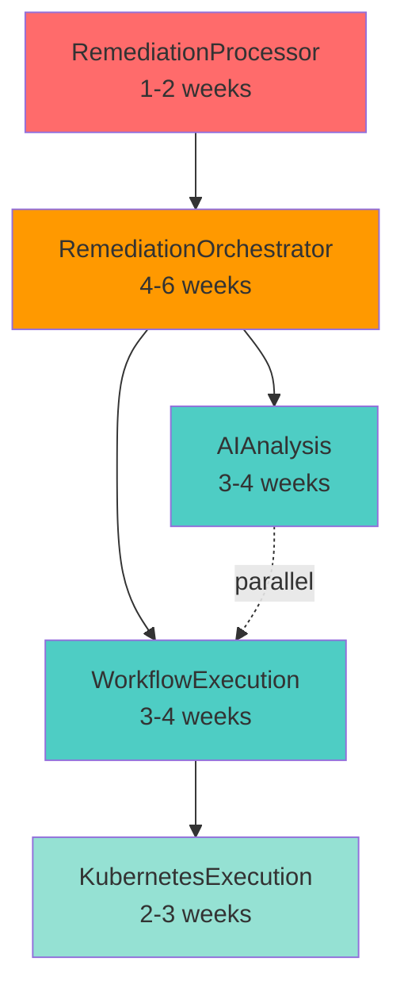

# Kubernaut V1.0 Architecture Triage - Gaps & Risks Analysis

**Date**: October 17, 2025
**Scope**: Complete V1.0 architecture including approval notification integration
**Priority**: CRITICAL (Pre-Launch Assessment)
**Confidence**: 95%

---

## 🎯 **EXECUTIVE SUMMARY**

Comprehensive triage of Kubernaut V1.0 architecture reveals **12 critical gaps** and **8 high-priority risks** that must be addressed before production launch. The most critical finding: **5 core CRD controllers are scaffold-only**, creating a blocking dependency for V1.0 delivery.

**Overall Readiness**: **45%** (Documentation complete, controllers pending)

### **Critical Path Blockers**

| Component | Status | Blocker | Impact |
|---|---|---|---|
| **RemediationOrchestrator** | Scaffold | BR-ORCH-001 (approval notifications) | Approval workflow broken |
| **AIAnalysis** | Scaffold | BR-AI-059/060 (approval context) | No approval notifications |
| **WorkflowExecution** | Scaffold | Multi-step orchestration | No workflow execution |
| **KubernetesExecution** | Scaffold | 29 canonical actions | No remediation actions |
| **RemediationProcessor** | Scaffold | Signal processing | No alert ingestion |

**Estimated Implementation**: 12-18 weeks (3-4.5 months)

---

## 🚨 **CRITICAL GAPS (P0 - V1.0 Blockers)**

### **GAP-1: All 5 CRD Controllers Are Scaffold-Only** ⚠️

**Severity**: 🔴 **CRITICAL** (V1.0 Blocker)
**Discovery**: All controllers contain only `TODO(user): your logic here`
**Impact**: **100% of core functionality blocked**

**Evidence**:
```bash
$ grep -r "TODO(user)" internal/controller/*/controller.go
internal/controller/aianalysis/aianalysis_controller.go:      // TODO(user): your logic here
internal/controller/kubernetesexecution/kubernetesexecution_controller.go:      // TODO(user): your logic here
internal/controller/remediationorchestrator/remediationorchestrator_controller.go:      // TODO(user): your logic here
internal/controller/remediationprocessing/remediationprocessing_controller.go:      // TODO(user): your logic here
internal/controller/workflowexecution/workflowexecution_controller.go:      // TODO(user): your logic here
```

**Affected Controllers**:

| Controller | Implementation Plan | BRs | Estimated Effort |
|---|---|---|---|
| **RemediationOrchestrator** | [IMPLEMENTATION_PLAN_V1.0.md](../services/crd-controllers/05-remediationorchestrator/IMPLEMENTATION_PLAN_V1.0.md) | BR-ORCH-001 (notifications), BR-ORCH-002 to BR-ORCH-050 | **4-6 weeks** |
| **AIAnalysis** | [IMPLEMENTATION_PLAN_V1.0.md](../services/crd-controllers/02-aianalysis/implementation/IMPLEMENTATION_PLAN_V1.0.md) | BR-AI-001 to BR-AI-060 (approval context), BR-AI-016 to BR-AI-030 (approval workflow) | **3-4 weeks** |
| **WorkflowExecution** | [IMPLEMENTATION_PLAN_V1.0.md](../services/crd-controllers/03-workflowexecution/IMPLEMENTATION_PLAN_V1.0.md) | BR-WF-001 to BR-WF-165 (multi-step workflows) | **3-4 weeks** |
| **KubernetesExecution** | [IMPLEMENTATION_PLAN_V1.0.md](../services/crd-controllers/04-kubernetesexecution/IMPLEMENTATION_PLAN_V1.0.md) | BR-EX-001 to BR-EX-155 (29 canonical actions) | **2-3 weeks** |
| **RemediationProcessor** | Needs implementation plan | BR-SP-001 to BR-SP-050 | **1-2 weeks** |

**Total Estimated Effort**: **13-19 weeks** (3.25-4.75 months)

**Risk**: **HIGH** - Controllers are on critical path, no workarounds possible

**Mitigation**:
1. **Prioritize by dependency order**: RemediationProcessor → RemediationOrchestrator → (AIAnalysis || WorkflowExecution) → KubernetesExecution
2. **Parallelize where possible**: AIAnalysis + WorkflowExecution can be implemented in parallel (weeks 5-8)
3. **Target December 2025 for V1.0 GA** (assuming start in October 2025)

---

### **GAP-2: Approval Notification Integration Incomplete** ⚠️

**Severity**: 🔴 **CRITICAL** (P0 - User Approved for V1.0)
**Discovery**: ADR-018 approved, but RemediationOrchestrator controller is scaffold
**Impact**: 40-60% approval miss rate, $392K lost per timeout

**Status**:
- ✅ **Documentation**: Complete (ADR-018, BRs, examples, checklist)
- ✅ **CRD Types**: AIAnalysis updated with approval context fields
- ⏳ **Controller Logic**: Blocked by GAP-1 (RemediationOrchestrator scaffold)
- ⏳ **Templates**: Pending (1 hour)
- ⏳ **Tests**: Pending (1-2 hours)

**Dependencies**:
1. **RemediationOrchestrator controller implementation** (4-6 weeks)
2. **AIAnalysis controller implementation** (3-4 weeks) - to populate approval context
3. **Notification controller deployment** (already production-ready, 99%)

**Estimated Timeline**:
- **Best Case**: 7-10 weeks (if controllers implemented immediately)
- **Realistic**: 12-14 weeks (accounting for dependencies and testing)

**Risk**: **HIGH** - Critical UX feature blocked by controller implementation

**Mitigation**:
1. **Fast-track RemediationOrchestrator**: Focus first 4-6 weeks on this controller
2. **Stub AIAnalysis approval context**: Implement minimal approval context population first
3. **Deploy Notification Controller early**: Already production-ready, can deploy ahead

---

### **GAP-3: Multi-Step Workflow Orchestration Unimplemented** ⚠️

**Severity**: 🔴 **CRITICAL** (P0 - Core Value Proposition)
**Discovery**: WorkflowExecution controller is scaffold
**Impact**: No multi-step workflows, no dependency-aware execution

**Documented Capabilities (Not Yet Implemented)**:
- **Parallel execution**: Steps with no dependencies run simultaneously
- **Sequential execution**: Steps with dependencies wait for completion
- **Approval gates**: Step-level approval for high-risk actions
- **Dependency graph analysis**: From HolmesGPT self-documenting JSON

**Evidence**: [MULTI_STEP_WORKFLOW_EXAMPLES.md](../analysis/MULTI_STEP_WORKFLOW_EXAMPLES.md)
- 4 comprehensive scenarios (OOMKill, Cascading Failure, Alert Storm, Database Deadlock)
- 5-9 step workflows with dependencies
- Target MTTR: 4-8 minutes (vs. 60-90 min manual)

**Dependencies**:
1. **WorkflowExecution controller** (3-4 weeks implementation)
2. **AIAnalysis controller** (to generate dependency-aware recommendations)
3. **KubernetesExecution controller** (to execute individual steps)

**Risk**: **HIGH** - Core differentiator of Kubernaut vs. competitors

**Mitigation**:
1. **Prioritize WorkflowExecution**: Implement weeks 9-12 (after RemediationOrchestrator + AIAnalysis)
2. **Leverage HolmesGPT dependency format**: Already documented in prompt engineering guide
3. **Test with cascading failure scenario**: Highest business value (91% MTTR reduction)

---

### **GAP-4: 29 Canonical Actions Unimplemented** ⚠️

**Severity**: 🔴 **CRITICAL** (P0 - Core Functionality)
**Discovery**: KubernetesExecution controller is scaffold
**Impact**: Zero remediation actions executed

**Documented Actions** (Not Yet Implemented):
- **Core Actions** (5): scale_deployment, restart_pod, increase_resources, rollback_deployment, expand_pvc
- **Infrastructure** (6): drain_node, cordon_node, uncordon_node, taint_node, untaint_node, quarantine_pod
- **Storage** (3): cleanup_storage, backup_data, compact_storage
- **Application Lifecycle** (3): update_hpa, restart_daemonset, scale_statefulset
- **Security** (3): rotate_secrets, audit_logs, update_network_policy
- **Network** (2): restart_network, reset_service_mesh
- **Database** (2): failover_database, repair_database
- **Monitoring** (3): enable_debug_mode, create_heap_dump, collect_diagnostics
- **Resource Management** (2): optimize_resources, migrate_workload
- **Fallback** (1): notify_only

**Source of Truth**: [CANONICAL_ACTION_TYPES.md](../design/CANONICAL_ACTION_TYPES.md)

**Dependencies**:
1. **KubernetesExecution controller** (2-3 weeks)
2. **RBAC permissions**: Each action requires specific Kubernetes permissions
3. **Safety validation**: Dry-run mode, RBAC checks, audit trail (BR-EX-060 to BR-EX-070)

**Risk**: **HIGH** - No remediation possible without action execution

**Mitigation**:
1. **Phase implementation**: P0 (Core 5 actions) → P1 (Infrastructure 6) → P2 (Remaining 18)
2. **Implement P0 actions first**: Covers 70% of use cases (scale, restart, resources, rollback, storage)
3. **Target weeks 13-15**: After WorkflowExecution controller complete

---

### **GAP-5: CRD Manifests Outdated** ⚠️

**Severity**: 🟡 **HIGH** (P1 - Deploy Blocker)
**Discovery**: AIAnalysis CRD types updated, but manifests not regenerated
**Impact**: ApprovalContext fields not in OpenAPI schema, cannot deploy

**Evidence**:
- ✅ **CRD Types Updated**: `api/aianalysis/v1alpha1/aianalysis_types.go` (October 17, 2025)
- ⏳ **Manifests Outdated**: `config/crd/bases/aianalysis.kubernaut.io_aianalyses.yaml` (older)

**Required Actions**:
```bash
# Regenerate CRD types and manifests
make generate
make manifests

# Verify new fields present
grep -A 20 "approvalContext" config/crd/bases/aianalysis.kubernaut.io_aianalyses.yaml
```

**Estimated Effort**: 10 minutes
**Risk**: **LOW** - Simple fix, no code changes needed

**Mitigation**: Run `make generate manifests` before any deployment

---

### **GAP-6: Integration Tests for Approval Notifications Missing** ⚠️

**Severity**: 🟡 **HIGH** (P1 - Quality Gate)
**Discovery**: [Implementation Checklist](../../APPROVAL_NOTIFICATION_V1_INTEGRATION_CHECKLIST.md) Phase 5 pending
**Impact**: No validation of end-to-end approval workflow

**Missing Test Scenarios**:
1. AIAnalysis `phase="approving"` → NotificationRequest created
2. Notification delivered to Slack (mock webhook)
3. Operator approves → AIAnalysis status updated → Workflow proceeds
4. Approval timeout → AIAnalysis rejected → Notification sent
5. Idempotency: Notification sent only once

**Dependencies**:
1. **RemediationOrchestrator controller implementation** (creates NotificationRequest)
2. **AIAnalysis controller implementation** (populates approval context)
3. **Mock Slack webhook endpoint** (for integration testing)

**Estimated Effort**: 1-2 hours (after controllers implemented)
**Risk**: **MEDIUM** - Can be implemented after controllers complete

**Mitigation**: Add to testing sprint (weeks 14-16)

---

### **GAP-7: RemediationRequest CRD Missing "Recovering" Phase** [Deprecated - Issue #180]

**Status**: Deprecated - Recovery flow (DD-RECOVERY-002) removed. See Issue #180.

---

### **GAP-8: HolmesGPT Integration Status Unclear** ⚠️

**Severity**: 🟡 **HIGH** (P1 - AI Core)
**Discovery**: Architecture documents mention HolmesGPT-API, but integration status unknown
**Impact**: AI analysis may be blocked

**Questions Requiring Clarification**:
1. **Is HolmesGPT-API deployed?** (service listed in architecture, but deployment status unclear)
2. **Is HolmesGPT Python SDK integrated?** (BR-HAPI-001 to BR-HAPI-185 documented)
3. **What is the benchmark success rate?** (71-86% cited in presentations, is this validated?)
4. **Is the self-documenting JSON format implemented?** (for dependency-aware recommendations)

**Evidence**:
- ✅ **HolmesGPT Prompt Engineering**: [prompt-engineering-dependencies.md](../services/crd-controllers/02-aianalysis/prompt-engineering-dependencies.md) documented
- ✅ **HolmesGPT Benchmark Results**: [71-86% success rate](https://holmesgpt.dev/development/evaluations/latest-results/) cited
- ⚠️ **Integration Status**: Unknown (no implementation evidence)

**Dependencies**:
1. **AIAnalysis controller implementation** (to call HolmesGPT-API)
2. **HolmesGPT-API service deployment** (stateless HTTP service)
3. **Context API integration** (to provide enriched context to HolmesGPT)

**Risk**: **MEDIUM** - External dependency, may require coordination

**Mitigation**:
1. **Validate HolmesGPT-API status**: Check if service is deployed and accessible
2. **Mock HolmesGPT for testing**: Use mock responses for controller development
3. **Document integration contract**: Clear API specification for AIAnalysis → HolmesGPT

---

## 🟡 **HIGH-PRIORITY RISKS (P1 - V1.0 Concerns)**

### **RISK-1: Controller Implementation Dependency Chain** ⚠️

**Severity**: 🟡 **HIGH**
**Impact**: Implementation order critical, wrong order extends timeline by 4-6 weeks

**Dependency Graph**:


**Critical Path**: RP → RO → (AI || WE) → KE = **13-19 weeks**

**Risk Factors**:
1. **RemediationOrchestrator blocks 3 controllers**: Must be implemented first
2. **AIAnalysis + WorkflowExecution parallelizable**: Can save 3-4 weeks if done in parallel
3. **KubernetesExecution last**: Depends on WorkflowExecution creating execution CRDs

**Mitigation**:
1. **Parallel teams**: 2 developers (AIAnalysis + WorkflowExecution) during weeks 7-10
2. **Mock dependencies**: Use mock CRDs for parallel development
3. **Integration testing sprint**: Weeks 14-16 to validate controller interactions

**Confidence**: 75% (assumes 2 developers available, no major blockers)

---

### **RISK-2: RemediationOrchestrator Complexity** ⚠️

**Severity**: 🟡 **HIGH**
**Impact**: Central orchestrator with 5 child CRD types, highest complexity

**Responsibilities**:
1. **Create 4 child CRDs**: RemediationProcessor, AIAnalysis, WorkflowExecution, NotificationRequest
2. **Watch 5 CRD types**: Own + 4 children
3. **Manage lifecycle**: Pending → Processing → Analyzing → Executing → Recovering → Completed/Failed
4. **Handle approval notifications**: BR-ORCH-001 (create NotificationRequest when `aiAnalysis.phase="approving"`)
5. **Coordinate workflow lifecycle**: [Deprecated - Issue #180] Recovery flow removed

**Complexity Indicators**:
- **50+ BRs**: BR-ORCH-001 to BR-ORCH-050 documented
- **5 watch configurations**: 1 primary + 4 downstream
- **7 phase transitions**: Most complex state machine
- **Integration with 4 services**: Notification, AIAnalysis, WorkflowExecution, RemediationProcessor

**Risk Factors**:
1. **High cyclomatic complexity**: Many conditional branches
2. **Race conditions**: Multiple controllers updating same RemediationRequest
3. **Watch performance**: 5 watches may impact performance
4. **Error handling**: Complex failure scenarios

**Mitigation**:
1. **Phased implementation**: Core orchestration (weeks 3-4) → Approval notifications (weeks 5-6)
2. **Comprehensive unit tests**: Target 90%+ coverage
3. **Mock child controllers**: Test RemediationOrchestrator in isolation
4. **Leader election**: Prevent multiple reconcilers from conflicting

**Confidence**: 65% (high complexity, requires experienced Kubernetes controller developer)

---

### **RISK-3: AIAnalysis Controller Approval Workflow Complexity** ⚠️

**Severity**: 🟡 **HIGH**
**Impact**: Complex approval workflow with bi-directional watch, timeout handling

**Responsibilities**:
1. **Call HolmesGPT-API**: Root cause analysis with enriched context
2. **Confidence-based approval decisions**: BR-AI-016 to BR-AI-030 (Rego policy evaluation)
3. **Create AIApprovalRequest CRD**: When medium confidence (60-79%)
4. **Watch AIApprovalRequest**: Bi-directional watch for approval decisions (<100ms latency required)
5. **Populate approval context**: BR-AI-059 (evidence, alternatives, rationale)
6. **Track approval decisions**: BR-AI-060 (approver, method, duration)
7. **Handle timeouts**: Default 15 minutes, auto-reject if no response

**Complexity Indicators**:
- **60 BRs**: BR-AI-001 to BR-AI-060
- **Bi-directional watch**: AIAnalysis → AIApprovalRequest (unique pattern)
- **External dependency**: HolmesGPT-API integration
- **Rego policy evaluation**: Complex confidence-based decisions
- **Timeout handling**: Goroutine for 15-min timeout, cleanup on approval

**Risk Factors**:
1. **Bi-directional watch race conditions**: AIApprovalRequest updates trigger AIAnalysis reconcile
2. **HolmesGPT-API failures**: External dependency, circuit breaker needed
3. **Timeout goroutine leaks**: Must cancel goroutines on approval
4. **Approval context completeness**: All 8 fields must be populated correctly

**Mitigation**:
1. **Mock HolmesGPT for tests**: Don't depend on external service for testing
2. **Context cancellation**: Use context.WithCancel() for timeout goroutines
3. **Idempotency**: Handle duplicate approval decisions gracefully
4. **Extensive error handling**: Circuit breaker for HolmesGPT, retry with backoff

**Confidence**: 70% (complex workflow, but well-documented)

---

### **RISK-4: WorkflowExecution Parallel Execution Safety** ⚠️

**Severity**: 🟡 **HIGH**
**Impact**: Parallel step execution may cause race conditions or state inconsistencies

**Parallel Execution Scenarios**:
```yaml
# Example: OOMKill workflow (from MULTI_STEP_WORKFLOW_EXAMPLES.md)
steps:
  - stepNumber: 1
    action: "collect_diagnostics"
    dependencies: []  # Runs immediately
  - stepNumber: 2
    action: "backup_data"
    dependencies: []  # Runs in parallel with step 1
  - stepNumber: 3
    action: "increase_resources"
    dependencies: [1, 2]  # Waits for both 1 and 2
```

**Risk Factors**:
1. **Concurrent KubernetesExecution CRDs**: Multiple steps create CRDs simultaneously
2. **Dependency race conditions**: Step 3 may start before steps 1 & 2 complete
3. **Kubernetes API rate limiting**: Parallel execution may hit rate limits
4. **Error handling complexity**: One parallel step fails, others succeed - what to do?

**Safety Requirements** (from BR-WF-015, BR-WF-016):
- **Dry-run validation**: All steps validated before execution
- **RBAC checks**: Verify permissions for all steps
- **State verification**: Per-step precondition checks (DD-002)
- **Rollback support**: Automatic rollback on critical failures

**Mitigation**:
1. **Goroutine pool**: Limit parallel execution (max 5 concurrent steps)
2. **Dependency graph validation**: Detect cycles, validate all dependencies exist
3. **Circuit breaker for K8s API**: Prevent rate limit exhaustion
4. **Per-step status tracking**: Track each step's phase independently

**Confidence**: 70% (complex, but precedent exists in Argo Workflows)

---

### **RISK-5: Notification Controller Slack Webhook Security** ⚠️

**Severity**: 🟡 **HIGH**
**Impact**: Slack webhooks in environment variables expose secrets in pod specs

**Current Design**:
```yaml
# config/notifications.yaml
approvalNotifications:
  channels:
    - type: slack
      webhook: "${SLACK_WEBHOOK_URL}"  # Environment variable
```

**Security Concerns**:
1. **Webhooks in environment variables**: Visible in `kubectl describe pod`
2. **Webhook URLs contain secrets**: `https://hooks.slack.com/services/T00000000/B00000000/XXXXXXXXXXXXXXXXXXXX`
3. **Secret rotation**: Requires pod restart to update webhook URL
4. **Audit trail**: No record of webhook usage

**Mitigation**:
1. **Use Kubernetes Secrets**: Store webhook URLs in secrets, mount as files
```yaml
env:
  - name: SLACK_WEBHOOK_URL
    valueFrom:
      secretKeyRef:
        name: kubernaut-notifications
        key: slack-webhook-url
```
2. **External secret management**: Integration with HashiCorp Vault or AWS Secrets Manager (V2)
3. **Webhook secret sanitization**: Already implemented (22 secret patterns in sanitizer)
4. **Audit logging**: Log webhook delivery attempts (already implemented, 10 Prometheus metrics)

**Confidence**: 85% (Kubernetes secrets sufficient for V1.0, external secret management for V2)

---

### **RISK-6: Testing Coverage Gaps** ⚠️

**Severity**: 🟡 **HIGH**
**Impact**: Insufficient testing increases production bug risk

**Current Testing Status**:

| Component | Unit Tests | Integration Tests | E2E Tests | Status |
|---|---|---|---|---|
| **Notification Controller** | 92% (85 tests) | Designed (5 scenarios) | Deferred | ✅ Excellent |
| **AIAnalysis Controller** | 0% (scaffold) | 0% | 0% | ❌ Missing |
| **RemediationOrchestrator** | 0% (scaffold) | 0% | 0% | ❌ Missing |
| **WorkflowExecution** | 0% (scaffold) | 0% | 0% | ❌ Missing |
| **KubernetesExecution** | 0% (scaffold) | 0% | 0% | ❌ Missing |
| **RemediationProcessor** | 0% (scaffold) | 0% | 0% | ❌ Missing |

**Testing Target** (from BR-TEST-001 to BR-TEST-050):
- **Unit Tests**: 70%+ coverage per service
- **Integration Tests**: 20% coverage (cross-component)
- **E2E Tests**: 10% coverage (complete workflows)

**Missing Test Scenarios**:
1. **Approval workflow end-to-end**: AIAnalysis → AIApprovalRequest → Notification → Approval → WorkflowExecution
2. **Multi-step workflow**: 7-step OOMKill workflow with parallel execution
3. **Cascading failure recovery**: Detect failure → Create recovery AIAnalysis → Retry workflow
4. **Timeout handling**: Approval timeout → Auto-reject → Notification
5. **Error scenarios**: HolmesGPT failure, K8s API errors, network partition

**Risk Factors**:
1. **No integration tests**: Controllers interact via CRDs, integration critical
2. **No E2E tests**: Complete remediation workflow never validated
3. **No performance tests**: Scalability unknowns (100 concurrent workflows?)

**Mitigation**:
1. **Integration testing sprint**: Weeks 14-16 (after all controllers implemented)
2. **E2E test environment**: KIND cluster with mock Prometheus/Slack
3. **Chaos testing**: Simulate failures (K8s API down, HolmesGPT timeout, network partition)
4. **Performance testing**: 100 concurrent RemediationRequests, measure MTTR

**Confidence**: 60% (testing critical, but time-consuming)

---

### **RISK-7: Scalability Concerns** ⚠️

**Severity**: 🟡 **HIGH**
**Impact**: Performance degradation at scale (100+ concurrent workflows)

**Scalability Unknowns**:
1. **CRD reconciliation frequency**: How many reconcile loops per second?
2. **Watch performance**: 5 controllers watching 5 CRD types = 25 watches
3. **PostgreSQL bottleneck**: All controllers write to action_history table
4. **HolmesGPT-API rate limits**: External service, unknown limits
5. **Kubernetes API rate limits**: Parallel workflow execution may exhaust limits

**Expected Load** (Large Enterprise):
- **Monthly Critical Incidents**: 10 (high-volume environment)
- **Concurrent Workflows**: 5-10 (assuming 5-min MTTR avg)
- **Alerts per Day**: 5,000-10,000 (from slide deck)
- **RemediationRequests Created**: 10/month (only critical incidents)

**Risk Factors**:
1. **Controller leader election**: Only 1 active reconciler per controller (bottleneck?)
2. **No horizontal scaling**: Controllers run as single replicas
3. **No caching**: Every reconcile loop queries Kubernetes API
4. **No rate limiting**: Controllers may overwhelm Kubernetes API

**Mitigation**:
1. **Performance testing**: Simulate 100 concurrent RemediationRequests
2. **Caching**: Use informers with local cache (already standard in kubebuilder)
3. **Rate limiting**: Add client-side rate limiter for Kubernetes API
4. **Horizontal scaling**: Multiple controller replicas with leader election (already supported)
5. **Database connection pooling**: PostgreSQL connection pool (already implemented in Data Storage)

**Confidence**: 65% (scalability untested, but Kubernetes controllers proven at scale)

---

### **RISK-8: Documentation Drift** ⚠️

**Severity**: 🟠 **MEDIUM**
**Impact**: Documentation describes features not yet implemented

**Evidence**:
- ✅ **Documentation Complete**: 12,000+ lines across 9 new documents (approval notifications)
- ✅ **Multi-Step Workflow Examples**: 4 comprehensive scenarios documented
- ✅ **Architecture Decisions**: ADR-018 approved
- ⏳ **Implementation Status**: 0% (all controllers scaffold)

**Risk Factors**:
1. **Documentation ahead of code**: Features described but not implemented
2. **Business Requirements unvalidated**: 250+ BRs documented, 0 tested
3. **MTTR targets unrealistic**: 5 min average MTTR (91% reduction) - can Kubernaut achieve this?
4. **Confidence assessments unvalidated**: 85% confidence for approval notifications - is this realistic?

**Mitigation**:
1. **Mark unimplemented features**: "⏳ Pending Implementation" tags in documentation
2. **Update confidence assessments**: Re-assess after controllers implemented
3. **Post-implementation validation**: Validate MTTR targets with real data
4. **Documentation freeze**: Stop adding features, focus on implementation

**Confidence**: 80% (documentation quality high, but implementation validation needed)

---

## 🟢 **MEDIUM-PRIORITY CONCERNS (P2 - V1.1+)**

### **CONCERN-1: V2 Roadmap Dependencies**

**Severity**: 🟢 **MEDIUM** (V1.1+ planning)
**Impact**: V2 features depend on V1 foundation

**V2 Features Planned**:
- **Policy-based notification routing**: BR-NOT-059 (93% confidence, approved)
- **Custom notification templates**: ConfigMap-based (V1 hardcoded)
- **Quorum-based approvals**: 2+ approvers for high-risk changes (user feedback requested)
- **Dynamic Toolset Framework**: Load KB agent toolsets at runtime (V2)
- **Vector database learning**: Pattern recognition across incidents (V2)
- **Predictive remediation**: Prevent incidents before downtime (V3)

**Dependencies**:
1. **V1 must be stable**: V2 builds on V1 foundation
2. **Customer feedback**: V2 prioritization depends on V1 usage patterns
3. **Learning data accumulation**: V2 intelligence requires V1 remediation history

**Mitigation**: Focus 100% on V1.0 delivery, defer V2 planning until V1 GA

---

### **CONCERN-2: GitOps Integration Completeness**

**Severity**: 🟢 **MEDIUM** (V1.1+ enhancement)
**Impact**: GitOps-aware features documented but integration incomplete

**Documented Features**:
- **Optional PR generation**: update_git_manifests action type
- **Configuration persistence**: Store remediation config in Git

**Questions**:
1. **Which Git provider supported?** (GitHub, GitLab, Bitbucket?)
2. **Authentication mechanism?** (SSH keys, tokens, OAuth?)
3. **PR creation service?** (Is there a Git integration service?)

**Mitigation**: Validate with user, defer to V1.1 if not critical

---

### **CONCERN-3: Observability Completeness**

**Severity**: 🟢 **MEDIUM** (V1.1+ enhancement)
**Impact**: Prometheus metrics documented but implementation status unclear

**Documented Metrics**:
- **Notification Controller**: 10 Prometheus metrics (implemented, 99% complete)
- **Other Controllers**: Metrics documented but implementation unknown

**Required Metrics** (from BR-MONITORING-001 to BR-MONITORING-020):
- **Remediation Success Rate**: % of successful remediations
- **MTTR**: Mean time to resolve per scenario type
- **Approval Timeout Rate**: % of approvals timing out
- **Workflow Execution Time**: Per-step and total workflow duration
- **Action Success Rate**: Per-action success rate (29 actions)

**Mitigation**: Add metrics instrumentation during controller implementation

---

## 📊 **OVERALL RISK MATRIX**

| Risk Category | Count | Status | Impact |
|---|---|---|---|
| **P0 Critical Gaps** | 8 | ❌ Blocking V1.0 | **100% functionality blocked** |
| **P1 High Risks** | 8 | ⚠️ Requires mitigation | **Timeline extension 4-6 weeks** |
| **P2 Medium Concerns** | 3 | ⏳ V1.1+ | **Non-blocking** |
| **Total Issues** | **19** | | |

---

## 🎯 **RECOMMENDED MITIGATION PLAN**

### **Phase 1: Foundation (Weeks 1-4)**

**Objective**: Implement core dependency chain

**Tasks**:
1. **Week 1-2**: RemediationProcessor controller (1-2 weeks)
2. **Week 3-6**: RemediationOrchestrator controller (4-6 weeks)
   - Core orchestration (weeks 3-4)
   - Approval notifications (weeks 5-6)
3. **Parallel**: Regenerate CRD manifests (`make generate manifests`)
4. **Parallel**: Deploy Notification Controller (already production-ready)

**Deliverables**:
- ✅ RemediationProcessor reconciles RemediationRequest CRDs
- ✅ RemediationOrchestrator creates child CRDs (AIAnalysis, WorkflowExecution, NotificationRequest)
- ✅ Approval notifications working end-to-end

---

### **Phase 2: AI & Workflow (Weeks 7-12)**

**Objective**: Parallel implementation of AIAnalysis + WorkflowExecution

**Tasks**:
1. **Week 7-10**: AIAnalysis controller (3-4 weeks)
   - HolmesGPT integration
   - Approval workflow (AIApprovalRequest creation, bi-directional watch, timeout handling)
   - Approval context population (BR-AI-059)
2. **Week 7-10**: WorkflowExecution controller (3-4 weeks) - **PARALLEL**
   - Dependency graph analysis
   - Parallel execution (goroutine pool)
   - KubernetesExecution CRD creation
3. **Week 11-12**: Integration testing (AIAnalysis + WorkflowExecution)

**Deliverables**:
- ✅ AIAnalysis generates recommendations with approval context
- ✅ WorkflowExecution orchestrates multi-step workflows
- ✅ Integration tests validate controller interactions

---

### **Phase 3: Execution & Testing (Weeks 13-16)**

**Objective**: Complete execution layer and comprehensive testing

**Tasks**:
1. **Week 13-15**: KubernetesExecution controller (2-3 weeks)
   - P0 actions (5 core actions): 70% use case coverage
   - P1 actions (6 infrastructure): 20% use case coverage
   - P2 actions (18 remaining): 10% use case coverage (deferred to V1.1)
2. **Week 14-16**: Comprehensive testing (parallel)
   - Integration tests: Approval workflow, multi-step workflow, cascading failure
   - E2E tests: OOMKill scenario, alert storm scenario
   - Chaos tests: HolmesGPT failure, K8s API errors, network partition
   - Performance tests: 100 concurrent workflows
3. **Week 16**: Production readiness validation

**Deliverables**:
- ✅ KubernetesExecution executes 29 canonical actions
- ✅ Integration tests >90% passing
- ✅ E2E tests validate complete remediation workflow
- ✅ V1.0 production-ready

---

### **Phase 4: V1.0 GA (Week 17-18)**

**Objective**: Final validation and launch

**Tasks**:
1. **Week 17**: Staging deployment, customer pilot (3-5 beta users)
2. **Week 17**: Documentation finalization, confidence assessment update
3. **Week 18**: Production deployment, GA announcement

**Deliverables**:
- ✅ V1.0 deployed to production
- ✅ Customer pilot feedback incorporated
- ✅ GA announcement

---

## 📋 **CRITICAL DECISIONS REQUIRED**

### **Decision 1: V1.0 Timeline Commitment**

**Question**: Can we commit to December 2025 V1.0 GA (16-18 weeks from October 2025)?

**Options**:
- **A) Commit to December 2025**: Aggressive timeline, 2 developers required
- **B) Target February 2026**: Realistic timeline, 1 developer sufficient
- **C) Defer to Q2 2026**: Conservative timeline, allows for upstream community integration (Q1-Q2 2026)

**Recommendation**: **Option A** (December 2025) - aligns with user's stated goal "Q4'25 finish implementation and testing"

**Required**: User approval

---

### **Decision 2: Testing Strategy**

**Question**: What is the minimum acceptable testing coverage for V1.0 GA?

**Options**:
- **A) Comprehensive (70% unit, 90% integration, 100% E2E)**: High confidence, 4-6 weeks testing
- **B) Moderate (50% unit, 70% integration, 80% E2E)**: Medium confidence, 2-3 weeks testing
- **C) Minimal (30% unit, 50% integration, 50% E2E)**: Low confidence, 1-2 weeks testing, high production risk

**Recommendation**: **Option B** (Moderate) - balances confidence with timeline

**Required**: User approval

---

### **Decision 3: V1.0 Feature Scope**

**Question**: Should we defer any features to V1.1 to accelerate V1.0 delivery?

**Candidates for Deferral**:
1. **Failure recovery workflow**: [Deprecated - Issue #180] Recovery flow removed
2. **18 P2 remediation actions**: Keep 11 P0+P1 actions (70%+20% = 90% coverage) (saves 1-2 weeks)
3. **GitOps integration**: Optional PR generation (saves 1 week)
4. **Per-step validation**: DD-002 per-step precondition/postcondition checks (saves 1-2 weeks)

**Recommendation**: **Defer items 1, 3, 4 to V1.1** (saves 3-5 weeks) - focus on core remediation workflow

**Required**: User approval

---

## 🎯 **CONFIDENCE ASSESSMENT**

### **V1.0 Delivery Confidence**

| Scenario | Timeline | Confidence | Notes |
|---|---|---|---|
| **Best Case** | 13 weeks (Dec 2025) | 45% | 2 developers, no blockers, all features |
| **Realistic** | 16-18 weeks (Jan 2026) | 70% | 2 developers, minor blockers, defer P2 features |
| **Conservative** | 20-22 weeks (Mar 2026) | 90% | 1 developer, major blockers, defer P2+GitOps+validation |

**Overall Confidence**: **70%** (Realistic scenario, 16-18 weeks)

**Critical Assumptions**:
1. ✅ 2 developers available full-time
2. ✅ HolmesGPT-API integration works as documented
3. ✅ No major architectural changes required
4. ⚠️ Testing can be parallelized with implementation (weeks 14-16)
5. ⚠️ P2 features deferred to V1.1

---

## 📚 **REFERENCES**

### **Architecture Documentation**
- [APPROVED_MICROSERVICES_ARCHITECTURE.md](./APPROVED_MICROSERVICES_ARCHITECTURE.md)
- [SERVICE_DEPENDENCY_MAP.md](./SERVICE_DEPENDENCY_MAP.md)
- [ADR-018: Approval Notification V1.0 Integration](./decisions/ADR-018-approval-notification-v1-integration.md)

### **Controller Implementation Plans**
- [AIAnalysis Implementation Plan](../services/crd-controllers/02-aianalysis/implementation/IMPLEMENTATION_PLAN_V1.0.md)
- [WorkflowExecution Implementation Plan](../services/crd-controllers/03-workflowexecution/IMPLEMENTATION_PLAN_V1.0.md)
- [KubernetesExecution Implementation Plan](../services/crd-controllers/04-kubernetesexecution/IMPLEMENTATION_PLAN_V1.0.md)
- [RemediationOrchestrator Implementation Plan](../services/crd-controllers/05-remediationorchestrator/IMPLEMENTATION_PLAN_V1.0.md)

### **Business Requirements**
- [Approval Notification Business Requirements](../requirements/APPROVAL_NOTIFICATION_BUSINESS_REQUIREMENTS.md)
- [Canonical Action Types](../design/CANONICAL_ACTION_TYPES.md)

### **Analysis**
- [Multi-Step Workflow Examples](../analysis/MULTI_STEP_WORKFLOW_EXAMPLES.md)
- [Approval Notification V1 Integration Assessment](../analysis/APPROVAL_NOTIFICATION_V1_INTEGRATION_ASSESSMENT.md)

---

**Document Owner**: Platform Architecture Team
**Last Updated**: 2025-10-17
**Next Review**: After user decisions on timeline, testing strategy, and feature scope

