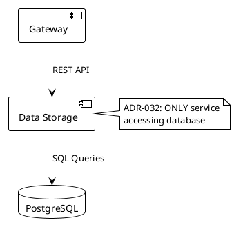

# Diagram Tools Comparison for GitHub Documentation

**Purpose**: Evaluate alternative diagram tools beyond Mermaid for Kubernaut architecture documentation.

**Current Issue**: Mermaid diagrams in `KUBERNAUT_CRD_ARCHITECTURE.md` are complex and hard to read.

**Requirements**:
- GitHub-compatible rendering
- Clear, simple visualization
- Easy maintenance
- Professional appearance
- Version control friendly (text-based preferred)

---

## Recommended Tools (GitHub-Compatible)

### 1. **Excalidraw** ⭐ **TOP RECOMMENDATION**

**Type**: Hand-drawn style diagrams

**GitHub Integration**: 
- Export as SVG/PNG and commit to repo
- GitHub renders SVG natively
- OR: Use Excalidraw plugin for VSCode

**Pros**:
- ✅ **Extremely simple and clean** - hand-drawn aesthetic is easy to understand
- ✅ GitHub renders SVG perfectly
- ✅ Free and open-source
- ✅ Web-based (https://excalidraw.com) - no installation
- ✅ Export as `.excalidraw` JSON (version control friendly)
- ✅ Collaborative editing
- ✅ Libraries for common shapes (AWS, K8s, etc.)

**Cons**:
- ⚠️ Not rendered inline in markdown (need separate image file)
- ⚠️ Manual updates required (not auto-generated from code)

**Example Workflow**:
```bash
# 1. Create diagram at https://excalidraw.com
# 2. Export as SVG: File → Export Image → SVG
# 3. Save to docs/architecture/diagrams/system-overview.svg
# 4. Reference in markdown:
```

```markdown

```

**Best For**: System overviews, architecture diagrams, flow charts

**Live Demo**: https://excalidraw.com/#json=5701451552210944,5yCXhJFj6jZhqzNr3fF4SA

---

### 2. **PlantUML with GitHub Actions**

**Type**: Text-based UML diagrams

**GitHub Integration**:
- Store `.puml` text files in repo
- Use GitHub Actions to auto-generate PNGs
- Commit generated images automatically

**Pros**:
- ✅ **Text-based** - perfect for version control
- ✅ Simple syntax for sequence diagrams, class diagrams, component diagrams
- ✅ Auto-generated from code changes (via GitHub Actions)
- ✅ Wide adoption in enterprise
- ✅ Supports many diagram types

**Cons**:
- ⚠️ Requires GitHub Actions setup
- ⚠️ Not rendered inline (need separate image file)
- ⚠️ Learning curve for syntax

**Example**:


**GitHub Actions Setup**:
```yaml
# .github/workflows/generate-diagrams.yml
name: Generate PlantUML Diagrams
on:
  push:
    paths:
      - 'docs/**/*.puml'

jobs:
  generate:
    runs-on: ubuntu-latest
    steps:
      - uses: actions/checkout@v3
      - uses: cloudbees/plantuml-github-action@master
        with:
          args: -v -tsvg docs/**/*.puml
      - uses: stefanzweifel/git-auto-commit-action@v4
        with:
          commit_message: "docs: Auto-generate PlantUML diagrams"
```

**Best For**: Sequence diagrams, component diagrams, deployment diagrams

---

### 3. **Diagrams.net (draw.io) with SVG Export**

**Type**: Visual diagram editor

**GitHub Integration**:
- Web-based or VSCode extension
- Export as SVG
- VSCode extension: `hediet.vscode-drawio`

**Pros**:
- ✅ **WYSIWYG editor** - very intuitive
- ✅ Extensive shape libraries (AWS, Azure, GCP, Kubernetes)
- ✅ Professional appearance
- ✅ Free and open-source
- ✅ GitHub renders SVG natively
- ✅ VSCode extension for inline editing

**Cons**:
- ⚠️ XML-based `.drawio` files (less readable in diffs)
- ⚠️ Not rendered inline (need separate image file)

**Example Workflow**:
```bash
# 1. Install VSCode extension: hediet.vscode-drawio
# 2. Create diagram: docs/architecture/diagrams/data-flow.drawio
# 3. Export as SVG automatically
# 4. Reference in markdown
```

**Best For**: Complex system diagrams, infrastructure diagrams

---

### 4. **Structurizr DSL** 🏗️ **BEST FOR C4 MODELS**

**Type**: Text-based architecture diagrams (C4 model)

**GitHub Integration**:
- Store `.dsl` text files in repo
- Use Structurizr CLI to generate diagrams
- GitHub Actions for auto-generation

**Pros**:
- ✅ **C4 Model** - industry standard for architecture diagrams
- ✅ Text-based - perfect for version control
- ✅ Multiple abstraction levels (Context, Container, Component, Code)
- ✅ Auto-layout
- ✅ Export to PlantUML, Mermaid, or images

**Cons**:
- ⚠️ Requires CLI tool installation
- ⚠️ Learning curve for C4 model
- ⚠️ Overkill for simple diagrams

**Example**:
```dsl
workspace "Kubernaut" "AI-powered Kubernetes remediation platform" {
    model {
        user = person "Operator" "Kubernetes cluster operator"
        
        kubernaut = softwareSystem "Kubernaut" "AI-powered remediation platform" {
            gateway = container "Gateway Service" "Signal ingestion" "Go"
            dataStorage = container "Data Storage Service" "PostgreSQL API Gateway" "Go"
            contextAPI = container "Context API" "Historical intelligence" "Go"
            database = container "PostgreSQL" "Persistent storage" "PostgreSQL"
            
            gateway -> dataStorage "Creates RemediationRequest"
            contextAPI -> dataStorage "Queries incidents via HTTP" "REST API"
            dataStorage -> database "SQL queries" "pgx"
        }
        
        prometheus = softwareSystem "Prometheus" "Monitoring system" {
            tags "External"
        }
        
        user -> kubernaut "Monitors remediation"
        prometheus -> gateway "Sends alerts"
    }
    
    views {
        systemContext kubernaut "SystemContext" {
            include *
            autoLayout
        }
        
        container kubernaut "Containers" {
            include *
            autoLayout
        }
    }
}
```

**Best For**: Multi-level architecture documentation (system context, containers, components)

---

### 5. **ASCII Art (Monodraw for macOS)** 📐

**Type**: Text-based ASCII diagrams

**GitHub Integration**:
- Pure text - renders natively in markdown code blocks
- No external tools needed for viewing

**Pros**:
- ✅ **Renders inline in GitHub** - no image files needed
- ✅ Text-based - perfect for version control
- ✅ Lightweight and fast
- ✅ Retro/minimalist aesthetic
- ✅ Monodraw app (macOS) makes creation easy

**Cons**:
- ⚠️ Limited visual appeal
- ⚠️ Hard to create manually (without Monodraw)
- ⚠️ Monodraw is macOS-only ($)

**Example**:
```
┌─────────────┐      ┌──────────────────┐      ┌────────────┐
│   Gateway   │─────▶│  Data Storage    │─────▶│ PostgreSQL │
│   Service   │ HTTP │     Service      │ SQL  │            │
└─────────────┘      └──────────────────┘      └────────────┘
                              ▲
                              │ HTTP
                              │
                     ┌────────────────┐
                     │  Context API   │
                     │    Service     │
                     └────────────────┘
                     
                     ADR-032: ONLY Data Storage
                     connects to PostgreSQL
```

**Best For**: Simple flow diagrams, quick sketches

---

## Comparison Matrix

| Tool | GitHub Inline | Text-Based | Easy to Create | Professional | Learning Curve |
|------|---------------|------------|----------------|--------------|----------------|
| **Excalidraw** | ⚠️ (SVG) | ✅ (JSON) | ✅ | ✅ | Low |
| **PlantUML** | ⚠️ (PNG/SVG) | ✅ | ⚠️ | ✅ | Medium |
| **Diagrams.net** | ⚠️ (SVG) | ⚠️ (XML) | ✅ | ✅ | Low |
| **Structurizr** | ⚠️ (Images) | ✅ | ⚠️ | ✅ | High |
| **ASCII Art** | ✅ | ✅ | ⚠️ | ⚠️ | Low |
| **Mermaid** | ✅ | ✅ | ⚠️ | ⚠️ | Medium |

---

## Recommendations by Use Case

### For Kubernaut Architecture Documentation

#### **High-Level System Overview** (e.g., KUBERNAUT_CRD_ARCHITECTURE.md)
**Recommendation**: **Excalidraw** + **PlantUML**
- Use Excalidraw for system overview (clean, simple)
- Use PlantUML for sequence diagrams (precise timing)

**Example Directory Structure**:
```
docs/architecture/
├── KUBERNAUT_CRD_ARCHITECTURE.md
├── diagrams/
│   ├── system-overview.excalidraw       # Source file
│   ├── system-overview.svg              # Generated image
│   ├── crd-lifecycle.puml               # PlantUML source
│   ├── crd-lifecycle.svg                # Generated image
│   ├── data-access-pattern.excalidraw
│   └── data-access-pattern.svg
```

#### **Data Access Layer (ADR-032)**
**Recommendation**: **Excalidraw** (simplicity is key)
- Clear boxes and arrows
- Hand-drawn style makes DB isolation obvious
- Color coding: Data Storage (green), other services (blue), PostgreSQL (red)

#### **Sequence Diagrams**
**Recommendation**: **PlantUML** (best tool for sequences)
- Clear timing and actor interactions
- Auto-layout
- Text-based for easy updates

#### **CRD Relationships**
**Recommendation**: **ASCII Art** or **Mermaid** (keep it simple)
- Flat hierarchy is easy to show with boxes and arrows
- ASCII art renders inline in GitHub

---

## Implementation Plan

### Phase 1: Replace Complex Diagrams (Immediate)
1. **System Overview** (lines 584-653 in KUBERNAUT_CRD_ARCHITECTURE.md)
   - Replace with Excalidraw SVG
   - Focus on clarity: 11 services, clear groupings, simple arrows

2. **CRD Relationship** (lines 665-714)
   - Keep Mermaid but simplify
   - OR: Use ASCII art for inline rendering

3. **Sequence Diagram** (lines 719-771)
   - Replace with PlantUML
   - GitHub Actions auto-generate SVG

### Phase 2: Document ADR-032 Data Access (Priority)
1. Create `docs/architecture/diagrams/data-access-layer-adr-032.excalidraw`
2. Show:
   - Data Storage Service (center, green)
   - PostgreSQL (red, locked)
   - Context API, Notification Service, Effectiveness Monitor (blue, using HTTP to Data Storage)
   - Gateway (blue, creates CRDs only)
3. Export as SVG
4. Reference in ADR-032 and README.md

### Phase 3: Standardize Across All Docs
1. Update all architecture docs to use Excalidraw for system diagrams
2. Update all sequence diagrams to use PlantUML
3. Add GitHub Actions for auto-generation

---

## Quick Start: Excalidraw for Kubernaut

### Step 1: Create Diagram
1. Open https://excalidraw.com
2. Use library: "Software Architecture" (built-in)
3. Create simple boxes for services
4. Add arrows with labels
5. Use colors:
   - Green: Data Storage Service
   - Blue: Other services
   - Red: PostgreSQL (with lock icon)

### Step 2: Export
1. File → Export Image → SVG
2. Save to `docs/architecture/diagrams/`

### Step 3: Reference in Markdown
```markdown
## Data Access Architecture (ADR-032)


**Key Principle**: ONLY Data Storage Service connects directly to PostgreSQL.
```

### Step 4: Commit Both Files
```bash
git add docs/architecture/diagrams/data-access-layer-adr-032.excalidraw
git add docs/architecture/diagrams/data-access-layer-adr-032.svg
git commit -m "docs: Add Data Access Layer diagram (ADR-032)"
```

---

## GitHub Actions Template (Optional)

For PlantUML auto-generation:

```yaml
# .github/workflows/generate-plantuml.yml
name: Generate PlantUML Diagrams

on:
  push:
    paths:
      - 'docs/**/*.puml'
  pull_request:
    paths:
      - 'docs/**/*.puml'

jobs:
  generate:
    runs-on: ubuntu-latest
    steps:
      - name: Checkout repository
        uses: actions/checkout@v3
        
      - name: Generate PlantUML diagrams
        uses: cloudbees/plantuml-github-action@master
        with:
          args: -v -tsvg -o . docs/**/*.puml
          
      - name: Commit generated diagrams
        if: github.event_name == 'push'
        uses: stefanzweifel/git-auto-commit-action@v4
        with:
          commit_message: "docs: Auto-generate PlantUML diagrams [skip ci]"
          file_pattern: docs/**/*.svg
```

---

## Conclusion

**For Kubernaut**: 
- **Primary Tool**: Excalidraw (system overviews, architecture diagrams)
- **Secondary Tool**: PlantUML (sequence diagrams)
- **Fallback**: Simplified Mermaid (inline rendering for simple diagrams)

**Next Steps**:
1. Create Data Access Layer diagram in Excalidraw (ADR-032)
2. Simplify System Overview in KUBERNAUT_CRD_ARCHITECTURE.md
3. Convert sequence diagrams to PlantUML
4. Update README.md with new diagrams

**Confidence**: 95% - These tools are battle-tested in enterprise environments and GitHub-compatible.

