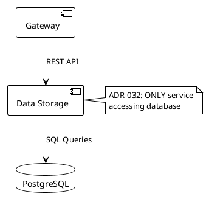

# Diagram Tools Comparison for GitHub Documentation

**Purpose**: Evaluate alternative diagram tools beyond Mermaid for Kubernaut architecture documentation.

**Current Issue**: Mermaid diagrams in `KUBERNAUT_CRD_ARCHITECTURE.md` are complex and hard to read.

**Requirements**:
- GitHub-compatible rendering
- Clear, simple visualization
- Easy maintenance
- Professional appearance
- Version control friendly (text-based preferred)

---

## Recommended Tools (GitHub-Compatible)

### 1. **Diagrams.net (draw.io)** ⭐ **TOP RECOMMENDATION FOR KUBERNAUT**

**Type**: Professional WYSIWYG diagram editor

**GitHub Integration**:
- VSCode extension: `hediet.vscode-drawio` (inline editing)
- Web-based: https://app.diagrams.io
- Export as SVG (GitHub renders natively)
- `.drawio` XML source files (version control friendly)

**Pros**:
- ✅ **Professional, enterprise-grade appearance** - Perfect for technical documentation
- ✅ **Extensive icon libraries** - AWS, Azure, GCP, Kubernetes, networking, etc.
- ✅ **VSCode integration** - Edit diagrams directly in your IDE
- ✅ **Auto-export to SVG** - No manual export step needed
- ✅ **Precise alignment and styling** - Professional polish with snap-to-grid
- ✅ **Free and open-source**
- ✅ **Industry standard** - Recognized by enterprise architecture teams
- ✅ **Multiple export formats** - SVG, PNG, PDF

**Cons**:
- ⚠️ XML-based `.drawio` files (less readable in diffs, but manageable)
- ⚠️ Not rendered inline in markdown (need separate image file)
- ⚠️ Slightly steeper learning curve than Excalidraw

**Example Workflow (VSCode)**:
```bash
# 1. Install VSCode extension
code --install-extension hediet.vscode-drawio

# 2. Create diagram
# File → New → data-access-layer.drawio

# 3. Edit in VSCode (WYSIWYG)

# 4. Auto-exports to SVG (same filename)
# Result: data-access-layer.drawio + data-access-layer.drawio.svg

# 5. Reference in markdown
```

```markdown

```

**Example Workflow (Web)**:
```bash
# 1. Open https://app.diagrams.io
# 2. Create diagram with Kubernetes icon library
# 3. File → Export as → SVG
# 4. Save to docs/architecture/diagrams/
# 5. Commit both .drawio and .svg files
```

**Best For**:
- Enterprise architecture diagrams
- System overviews with professional polish
- Infrastructure diagrams
- Service dependency maps
- **Kubernaut's documentation** (enterprise audience)

**Why For Kubernaut**:
- ✅ Targets enterprise Kubernetes operations → Professional appearance critical
- ✅ Kubernetes icon library → Instant credibility
- ✅ Clean, precise lines → Technical accuracy conveyed visually
- ✅ Enterprise familiarity → Architecture teams recognize this style

---

### 2. **PlantUML with GitHub Actions**

**Type**: Text-based UML diagrams

**GitHub Integration**:
- Store `.puml` text files in repo
- Use GitHub Actions to auto-generate PNGs
- Commit generated images automatically

**Pros**:
- ✅ **Text-based** - perfect for version control
- ✅ Simple syntax for sequence diagrams, class diagrams, component diagrams
- ✅ Auto-generated from code changes (via GitHub Actions)
- ✅ Wide adoption in enterprise
- ✅ Supports many diagram types

**Cons**:
- ⚠️ Requires GitHub Actions setup
- ⚠️ Not rendered inline (need separate image file)
- ⚠️ Learning curve for syntax

**Example**:


**GitHub Actions Setup**:
```yaml
# .github/workflows/generate-diagrams.yml
name: Generate PlantUML Diagrams
on:
  push:
    paths:
      - 'docs/**/*.puml'

jobs:
  generate:
    runs-on: ubuntu-latest
    steps:
      - uses: actions/checkout@v3
      - uses: cloudbees/plantuml-github-action@master
        with:
          args: -v -tsvg docs/**/*.puml
      - uses: stefanzweifel/git-auto-commit-action@v4
        with:
          commit_message: "docs: Auto-generate PlantUML diagrams"
```

**Best For**: Sequence diagrams, component diagrams, deployment diagrams

---

### 3. **Excalidraw**

**Type**: Hand-drawn style diagrams

**GitHub Integration**:
- Export as SVG/PNG and commit to repo
- GitHub renders SVG natively
- OR: Use Excalidraw plugin for VSCode

**Pros**:
- ✅ **Extremely simple and approachable** - hand-drawn aesthetic
- ✅ **Quick sketching** - Great for brainstorming and concept diagrams
- ✅ GitHub renders SVG perfectly
- ✅ Free and open-source
- ✅ Web-based (https://excalidraw.com) - no installation
- ✅ Export as `.excalidraw` JSON (version control friendly)
- ✅ Collaborative editing

**Cons**:
- ⚠️ **Informal appearance** - Hand-drawn style less suitable for enterprise documentation
- ⚠️ **Casual aesthetic** - May not convey professional polish needed for architecture docs
- ⚠️ Not rendered inline in markdown (need separate image file)
- ⚠️ Manual updates required (not auto-generated from code)

**Example Workflow**:
```bash
# 1. Create diagram at https://excalidraw.com
# 2. Export as SVG: File → Export Image → SVG
# 3. Save to docs/architecture/diagrams/concept-sketch.svg
# 4. Reference in markdown
```

**Best For**:
- Quick concept sketches
- Internal team brainstorming
- Blog posts or informal documentation
- When you deliberately want an approachable, casual feel

**NOT Recommended For**:
- ❌ Enterprise architecture documentation (Kubernaut's primary use case)
- ❌ Professional presentations
- ❌ Formal technical specifications

---

### 4. **Structurizr DSL** 🏗️ **BEST FOR C4 MODELS**

**Type**: Text-based architecture diagrams (C4 model)

**GitHub Integration**:
- Store `.dsl` text files in repo
- Use Structurizr CLI to generate diagrams
- GitHub Actions for auto-generation

**Pros**:
- ✅ **C4 Model** - industry standard for architecture diagrams
- ✅ Text-based - perfect for version control
- ✅ Multiple abstraction levels (Context, Container, Component, Code)
- ✅ Auto-layout
- ✅ Export to PlantUML, Mermaid, or images

**Cons**:
- ⚠️ Requires CLI tool installation
- ⚠️ Learning curve for C4 model
- ⚠️ Overkill for simple diagrams

**Example**:
```dsl
workspace "Kubernaut" "AI-powered Kubernetes remediation platform" {
    model {
        user = person "Operator" "Kubernetes cluster operator"

        kubernaut = softwareSystem "Kubernaut" "AI-powered remediation platform" {
            gateway = container "Gateway Service" "Signal ingestion" "Go"
            dataStorage = container "Data Storage Service" "PostgreSQL API Gateway" "Go"
            contextAPI = container "Context API" "Historical intelligence" "Go"
            database = container "PostgreSQL" "Persistent storage" "PostgreSQL"

            gateway -> dataStorage "Creates RemediationRequest"
            contextAPI -> dataStorage "Queries incidents via HTTP" "REST API"
            dataStorage -> database "SQL queries" "pgx"
        }

        prometheus = softwareSystem "Prometheus" "Monitoring system" {
            tags "External"
        }

        user -> kubernaut "Monitors remediation"
        prometheus -> gateway "Sends alerts"
    }

    views {
        systemContext kubernaut "SystemContext" {
            include *
            autoLayout
        }

        container kubernaut "Containers" {
            include *
            autoLayout
        }
    }
}
```

**Best For**: Multi-level architecture documentation (system context, containers, components)

---

### 5. **ASCII Art (Monodraw for macOS)** 📐

**Type**: Text-based ASCII diagrams

**GitHub Integration**:
- Pure text - renders natively in markdown code blocks
- No external tools needed for viewing

**Pros**:
- ✅ **Renders inline in GitHub** - no image files needed
- ✅ Text-based - perfect for version control
- ✅ Lightweight and fast
- ✅ Retro/minimalist aesthetic
- ✅ Monodraw app (macOS) makes creation easy

**Cons**:
- ⚠️ Limited visual appeal
- ⚠️ Hard to create manually (without Monodraw)
- ⚠️ Monodraw is macOS-only ($)

**Example**:
```
┌─────────────┐      ┌──────────────────┐      ┌────────────┐
│   Gateway   │─────▶│  Data Storage    │─────▶│ PostgreSQL │
│   Service   │ HTTP │     Service      │ SQL  │            │
└─────────────┘      └──────────────────┘      └────────────┘
                              ▲
                              │ HTTP
                              │
                     ┌────────────────┐
                     │  Context API   │
                     │    Service     │
                     └────────────────┘

                     ADR-032: ONLY Data Storage
                     connects to PostgreSQL
```

**Best For**: Simple flow diagrams, quick sketches

---

## Comparison Matrix

| Tool | GitHub Inline | Text-Based | Easy to Create | Professional | Learning Curve | **Kubernaut Fit** |
|------|---------------|------------|----------------|--------------|----------------|------------------|
| **Diagrams.net** | ⚠️ (SVG) | ⚠️ (XML) | ✅ | ✅✅ | Low | ⭐⭐⭐⭐⭐ Architecture |
| **Mermaid** | ✅ | ✅ | ✅ | ✅ | Medium | ⭐⭐⭐⭐⭐ Sequences |
| **PlantUML** | ⚠️ (PNG/SVG) | ✅ | ⚠️ | ✅ | Medium | ⭐⭐⭐ (Workflow overhead) |
| **Excalidraw** | ⚠️ (SVG) | ✅ (JSON) | ✅ | ⚠️ | Low | ⭐⭐ (Too casual) |
| **Structurizr** | ⚠️ (Images) | ✅ | ⚠️ | ✅ | High | ⭐⭐⭐ (C4 only) |
| **ASCII Art** | ✅ | ✅ | ⚠️ | ⚠️ | Low | ⭐⭐ (Simple only) |

---

## Recommendations by Use Case

### For Kubernaut Architecture Documentation

#### **High-Level System Overview** (e.g., KUBERNAUT_CRD_ARCHITECTURE.md)
**Recommendation**: **Diagrams.net** ⭐
- Professional, enterprise-grade appearance
- Kubernetes icon library
- VSCode integration for easy editing

**Example Directory Structure**:
```
docs/architecture/
├── KUBERNAUT_CRD_ARCHITECTURE.md
├── diagrams/
│   ├── system-overview.drawio           # Source file (editable in VSCode)
│   ├── system-overview.drawio.svg       # Auto-exported (commit both)
│   ├── data-access-pattern.drawio
│   └── data-access-pattern.drawio.svg
```

#### **Data Access Layer (ADR-032)**
**Recommendation**: **Diagrams.net** ⭐
- Professional, enterprise-grade appearance
- Clear boxes and arrows with Kubernetes icons
- Color coding: Data Storage (green), other services (blue), PostgreSQL (red)
- VSCode extension for easy editing

#### **Sequence Diagrams**
**Recommendation**: **Mermaid** ⭐ (native GitHub rendering)
- ✅ **Zero workflow overhead** - No GitHub Actions needed
- ✅ **Inline rendering** - See directly in PR reviews
- ✅ **Good enough quality** - Handles sequences well
- ✅ **Text-based** - Easy version control and diffs

**Why Not PlantUML**: Requires GitHub Actions workflow to render, adds unnecessary complexity when Mermaid already works well.

#### **CRD Relationships**
**Recommendation**: **Mermaid** (already in use, works well)
- Flat hierarchy easy to show with boxes and arrows
- Native GitHub rendering
- Text-based for easy updates

---

## Implementation Plan

### Phase 1: Replace Complex Architecture Diagrams (Immediate)
1. **System Overview** (KUBERNAUT_CRD_ARCHITECTURE.md)
   - Create professional version in Diagrams.net
   - Use Kubernetes icon library
   - Focus on clarity: 11 services, clear groupings, precise arrows
   - File: `docs/architecture/diagrams/system-overview.drawio`

2. **CRD Relationship** (KUBERNAUT_CRD_ARCHITECTURE.md)
   - Keep existing Mermaid diagram (it's working well)
   - Simplify if needed, but native rendering is valuable

3. **Sequence Diagrams** (KUBERNAUT_CRD_ARCHITECTURE.md)
   - Keep existing Mermaid diagrams (native GitHub rendering)
   - No PlantUML needed (workflow overhead not justified)

### Phase 2: Document ADR-032 Data Access (Priority)
1. Create `docs/architecture/diagrams/data-access-layer-adr-032.drawio`
2. Show (with professional styling):
   - Data Storage Service (center, green, ⭐)
   - PostgreSQL (red, 🔒 locked)
   - Context API, Notification Service, Effectiveness Monitor (blue, REST API arrows)
   - Gateway (blue, creates CRDs only, no DB connection)
3. Auto-exports to `.drawio.svg` (VSCode extension)
4. Reference in ADR-032 and README.md

### Phase 3: Standardize Across All Docs
1. Use **Diagrams.net** for all architecture diagrams (professional polish)
2. Keep **Mermaid** for all sequence diagrams (native GitHub rendering)
3. No GitHub Actions needed (Diagrams.net exports SVG, Mermaid renders natively)

---

## Quick Start: Diagrams.net for Kubernaut

### Step 1: Install VSCode Extension (Recommended)
```bash
code --install-extension hediet.vscode-drawio
```

### Step 2: Create Diagram
1. In VSCode: File → New File → `data-access-layer-adr-032.drawio`
2. Click to open in diagram editor
3. Use Kubernetes icon library:
   - Search: "kubernetes" in shape search
   - Drag: Pod, Service, Database icons
4. Create boxes for services:
   - Green box: Data Storage Service (⭐)
   - Blue boxes: Context API, CRD Controllers
   - Red box: PostgreSQL (🔒)
5. Add arrows with labels:
   - Thick green: SQL queries
   - Normal blue: REST API calls

### Step 3: Auto-Export
- VSCode extension automatically exports to `.drawio.svg`
- Result: Both `.drawio` (editable) and `.drawio.svg` (rendered) files

### Step 4: Reference in Markdown
```markdown
## Data Access Architecture (ADR-032)


**Key Principle**: ONLY Data Storage Service connects directly to PostgreSQL.
```

### Step 5: Commit Both Files
```bash
git add docs/architecture/diagrams/data-access-layer-adr-032.drawio
git add docs/architecture/diagrams/data-access-layer-adr-032.drawio.svg
git commit -m "docs: Add Data Access Layer diagram (ADR-032)"
```

### Professional Styling Tips
1. **Color Scheme**:
   - Green (#4CAF50): Data Storage Service
   - Blue (#2196F3): Application services
   - Red (#F44336): PostgreSQL (isolated)
   - Gray (#9E9E9E): External systems

2. **Icons**:
   - Use Kubernetes icon library for services
   - Use database icon for PostgreSQL
   - Use lock icon for restricted access

3. **Layout**:
   - Top-to-bottom or left-to-right flow
   - Clear spacing between layers
   - Align elements using snap-to-grid

---

## GitHub Actions Template (Optional)

For PlantUML auto-generation:

```yaml
# .github/workflows/generate-plantuml.yml
name: Generate PlantUML Diagrams

on:
  push:
    paths:
      - 'docs/**/*.puml'
  pull_request:
    paths:
      - 'docs/**/*.puml'

jobs:
  generate:
    runs-on: ubuntu-latest
    steps:
      - name: Checkout repository
        uses: actions/checkout@v3

      - name: Generate PlantUML diagrams
        uses: cloudbees/plantuml-github-action@master
        with:
          args: -v -tsvg -o . docs/**/*.puml

      - name: Commit generated diagrams
        if: github.event_name == 'push'
        uses: stefanzweifel/git-auto-commit-action@v4
        with:
          commit_message: "docs: Auto-generate PlantUML diagrams [skip ci]"
          file_pattern: docs/**/*.svg
```

---

## Conclusion

**For Kubernaut** (User-Approved):
- **Primary Tool**: **Diagrams.net** ⭐ (architecture diagrams, system overviews)
  - Professional, enterprise-grade appearance
  - Kubernetes icon library
  - VSCode integration for easy editing

- **Secondary Tool**: **Mermaid** (sequence diagrams, flow charts)
  - Native GitHub rendering (zero workflow overhead)
  - Good enough quality for sequences
  - Text-based for easy version control

**Why NOT**:
- ❌ **Excalidraw**: Too casual/informal for enterprise architecture docs
- ❌ **PlantUML**: Workflow overhead not justified when Mermaid works well

**Next Steps**:
1. Install Diagrams.net VSCode extension: `code --install-extension hediet.vscode-drawio`
2. Create Data Access Layer diagram (ADR-032) in Diagrams.net
3. Keep existing Mermaid sequence diagrams
4. Update complex system diagrams to Diagrams.net for professional polish

**Confidence**: 95% - Battle-tested tools with optimal trade-offs for Kubernaut's enterprise audience.

