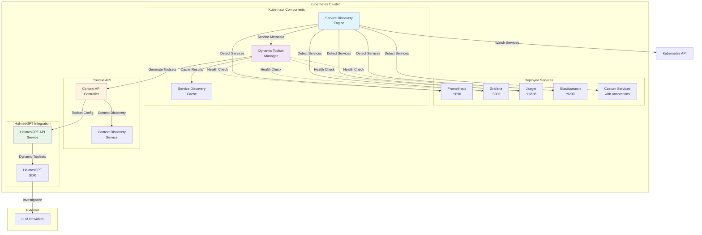
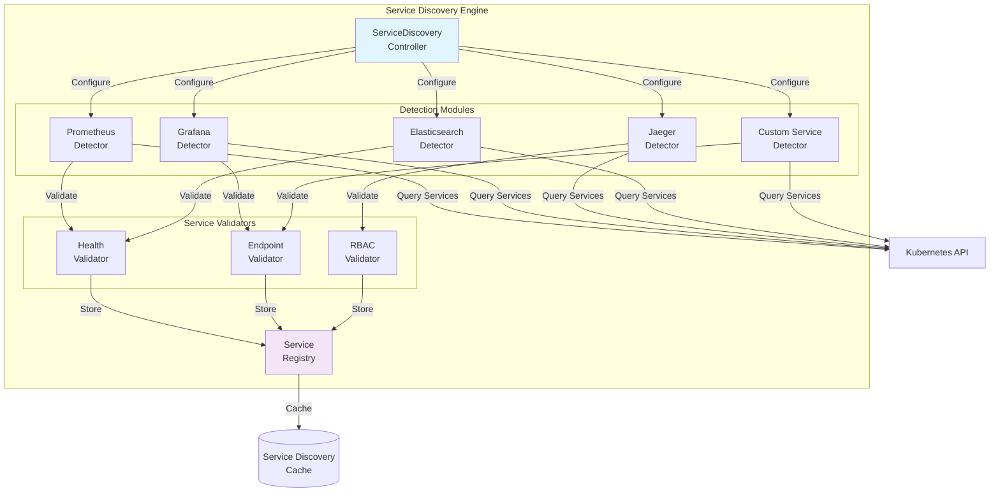
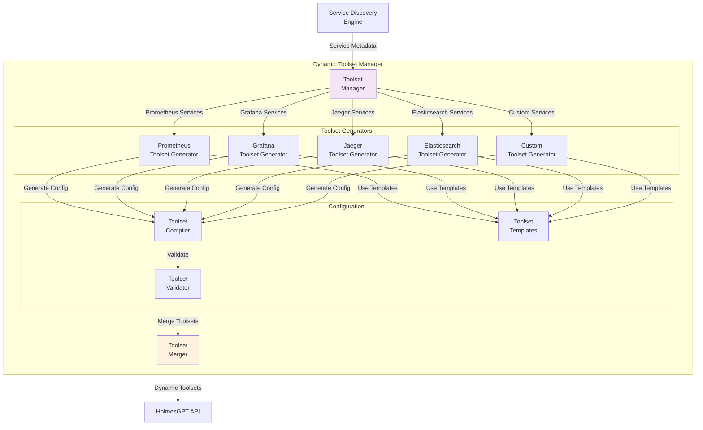
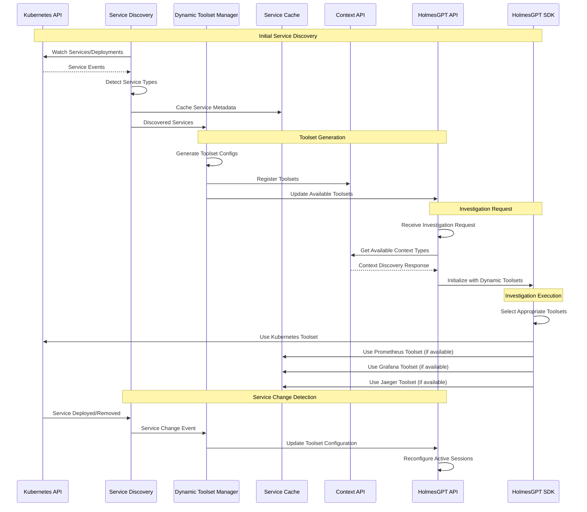
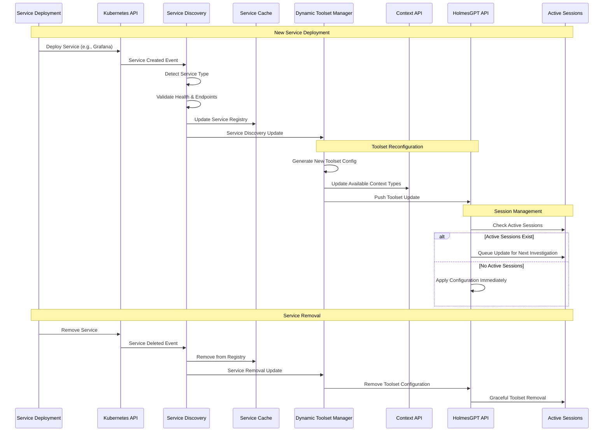

# Dynamic Toolset Configuration Architecture

**Document Version**: 2.0
**Date**: January 2025
**Status**: Architecture Design Specification - **APPROVED**
**Module**: Dynamic Toolset Configuration (`pkg/ai/holmesgpt/`, `pkg/platform/k8s/`, `pkg/api/context/`)
**Update**: File-based ConfigMap polling with reconciliation

---

## 1. Overview

The Dynamic Toolset Configuration architecture enables automatic discovery and configuration of HolmesGPT toolsets based on services deployed in the Kubernetes cluster. This eliminates manual toolset configuration and ensures HolmesGPT investigations leverage all available observability and monitoring tools.

### Architecture Update (v2.0)

**Key Changes**:
1. ✅ **File-Based ConfigMap Polling**: HolmesGPT-API uses file system monitoring instead of Kubernetes API watch
2. ✅ **ConfigMap Ownership & Reconciliation**: Dynamic Toolset Service watches and reconciles ConfigMap to protect against drift/deletion
3. ✅ **Manual Overrides Preserved**: Admin edits in `overrides` section are preserved during reconciliation

**Rationale**:
- **HolmesGPT-API (Consumer)**: File-based polling is simpler, more efficient, requires no RBAC permissions
- **Dynamic Toolset Service (Owner)**: Watch-based reconciliation protects ConfigMap integrity and detects drift
- **Total Update Latency**: 60-120s (acceptable for infrequent toolset changes)

**Architecture Pattern**:
```
Dynamic Toolset Service (Owner)
    ↓ Discovers services
    ↓ Writes ConfigMap
    ↓ Watches for drift/deletion
    ↓ Reconciles to desired state
ConfigMap (kubernaut-toolset-config)
    ↓ Kubernetes kubelet syncs (~60s)
Mounted File (/etc/kubernaut/toolsets/)
    ↓ File polling (~60s)
HolmesGPT-API (Consumer)
```

## 2. High-Level Architecture



## 3. Component Architecture

### 3.1 Service Discovery Engine



### 3.2 Dynamic Toolset Manager



### 3.3 HolmesGPT Integration Flow



## 4. Service Detection Patterns

### 4.1 Well-Known Service Detection

```mermaid
graph TB
    subgraph "Prometheus Detection"
        P1[Label Selector:<br/>app.kubernetes.io/name=prometheus]
        P2[Label Selector:<br/>app=prometheus]
        P3[Service Name:<br/>prometheus*]
        P4[Port Detection:<br/>9090]
        P5[Health Check:<br/>/api/v1/status/buildinfo]
    end

    subgraph "Grafana Detection"
        G1[Label Selector:<br/>app.kubernetes.io/name=grafana]
        G2[Service Name:<br/>grafana*]
        G3[Port Detection:<br/>3000]
        G4[Health Check:<br/>/api/health]
    end

    subgraph "Jaeger Detection"
        J1[Label Selector:<br/>app.kubernetes.io/name=jaeger]
        J2[Service Name:<br/>jaeger-query*]
        J3[Port Detection:<br/>16686]
        J4[Health Check:<br/>/api/services]
    end

    subgraph "Custom Service Detection"
        C1[Annotation:<br/>kubernaut.io/toolset=custom]
        C2[Annotation:<br/>kubernaut.io/endpoints]
        C3[Annotation:<br/>kubernaut.io/capabilities]
        C4[Custom Health Check]
    end

    SD[Service Discovery<br/>Engine]

    P1 --> SD
    P2 --> SD
    P3 --> SD
    P4 --> SD
    P5 --> SD

    G1 --> SD
    G2 --> SD
    G3 --> SD
    G4 --> SD

    J1 --> SD
    J2 --> SD
    J3 --> SD
    J4 --> SD

    C1 --> SD
    C2 --> SD
    C3 --> SD
    C4 --> SD
```



### 4.2 Toolset Template System

```mermaid
graph TB
    subgraph "Toolset Template Engine"
        subgraph "Base Templates"
            KT[kubernetes.yaml<br/>Base K8s Toolset]
            PT[prometheus.yaml<br/>Metrics Toolset]
            GT[grafana.yaml<br/>Dashboard Toolset]
            JT[jaeger.yaml<br/>Tracing Toolset]
            ET[elasticsearch.yaml<br/>Search Toolset]
        end

        subgraph "Template Variables"
            SN[${SERVICE_NAME}]
            NS[${NAMESPACE}]
            EP[${ENDPOINTS}]
            CAP[${CAPABILITIES}]
            HC[${HEALTH_CHECK}]
        end

        subgraph "Generated Toolsets"
            GK[Kubernetes Toolset<br/>(Always Available)]
            GP[Prometheus Toolset<br/>(If Detected)]
            GG[Grafana Toolset<br/>(If Detected)]
            GJ[Jaeger Toolset<br/>(If Detected)]
            GE[Elasticsearch Toolset<br/>(If Detected)]
        end
    end

    SD[Service Discovery<br/>Results]
    DTM[Dynamic Toolset<br/>Manager]

    %% Input Flow
    SD -->|Service Metadata| DTM

    %% Template Selection
    DTM -->|Always| KT
    DTM -->|If Prometheus| PT
    DTM -->|If Grafana| GT
    DTM -->|If Jaeger| JT
    DTM -->|If Elasticsearch| ET

    %% Variable Substitution
    KT -->|Substitute| SN
    PT -->|Substitute| NS
    GT -->|Substitute| EP
    JT -->|Substitute| CAP
    ET -->|Substitute| HC

    %% Generation
    SN -->|Generate| GK
    NS -->|Generate| GP
    EP -->|Generate| GG
    CAP -->|Generate| GJ
    HC -->|Generate| GE

    style DTM fill:#f3e5f5
    style GK fill:#e8f5e8
    style GP fill:#fff3e0
    style GG fill:#f3e5f5
    style GJ fill:#e1f5fe
    style GE fill:#fff8e1
```

## 5. Data Flow Architecture

### 5.1 Service Discovery Data Flow

```mermaid
graph LR
    subgraph "Discovery Phase"
        K8S[Kubernetes<br/>API Events]
        SD[Service<br/>Discovery]
        FILTER[Service<br/>Filtering]
        VALIDATE[Service<br/>Validation]
    end

    subgraph "Processing Phase"
        CACHE[(Discovery<br/>Cache)]
        DTM[Dynamic Toolset<br/>Manager]
        TEMPLATE[Template<br/>Engine]
        MERGE[Toolset<br/>Merger]
    end

    subgraph "Integration Phase"
        CAPI[Context<br/>API]
        HAPI[HolmesGPT<br/>API]
        CONFIG[Toolset<br/>Configuration]
    end

    subgraph "Investigation Phase"
        HGPT[HolmesGPT<br/>SDK]
        TOOLS[Dynamic<br/>Toolsets]
        RESULT[Investigation<br/>Results]
    end

    %% Discovery Flow
    K8S -->|Service Events| SD
    SD -->|Filter by Type| FILTER
    FILTER -->|Health Check| VALIDATE
    VALIDATE -->|Store| CACHE

    %% Processing Flow
    CACHE -->|Service Data| DTM
    DTM -->|Generate| TEMPLATE
    TEMPLATE -->|Combine| MERGE

    %% Integration Flow
    MERGE -->|Register| CAPI
    MERGE -->|Configure| HAPI
    HAPI -->|Update| CONFIG

    %% Investigation Flow
    CONFIG -->|Initialize| HGPT
    HGPT -->|Execute| TOOLS
    TOOLS -->|Produce| RESULT

    style SD fill:#e1f5fe
    style DTM fill:#f3e5f5
    style HAPI fill:#e8f5e8
    style HGPT fill:#fff3e0
```



### 5.2 Configuration Update Flow



## 6. Implementation Components

### 6.1 Service Discovery Engine (`pkg/platform/k8s/service_discovery.go`)

```go
type ServiceDiscovery struct {
    client          *UnifiedClient
    cache          *ServiceCache
    detectors      map[string]ServiceDetector
    validators     []ServiceValidator
    eventChannel   chan ServiceEvent
    logger         *logrus.Logger
}

type DetectedService struct {
    Name         string                 `json:"name"`
    Namespace    string                 `json:"namespace"`
    ServiceType  string                 `json:"service_type"`
    Endpoints    []ServiceEndpoint      `json:"endpoints"`
    Labels       map[string]string      `json:"labels"`
    Annotations  map[string]string      `json:"annotations"`
    Available    bool                   `json:"available"`
    HealthStatus ServiceHealthStatus    `json:"health_status"`
    LastChecked  time.Time             `json:"last_checked"`
}

// V1 Label-Based Service Discovery Implementation
func (sd *ServiceDiscovery) DiscoverMonitoringServices(ctx context.Context) ([]DetectedService, error) {
    var discovered []DetectedService

    // Discover Prometheus using standard labels
    prometheusServices, err := sd.discoverPrometheus(ctx)
    if err != nil {
        sd.logger.WithError(err).Warn("Failed to discover Prometheus services")
    } else {
        discovered = append(discovered, prometheusServices...)
    }

    // Discover Grafana using standard labels
    grafanaServices, err := sd.discoverGrafana(ctx)
    if err != nil {
        sd.logger.WithError(err).Warn("Failed to discover Grafana services")
    } else {
        discovered = append(discovered, grafanaServices...)
    }

    sd.logger.WithField("services", len(discovered)).Info("Service discovery completed")
    return discovered, nil
}

// discoverPrometheus discovers Prometheus instances via Service labels
func (sd *ServiceDiscovery) discoverPrometheus(ctx context.Context) ([]DetectedService, error) {
    var services []DetectedService

    // Standard label selectors for Prometheus
    labelSelectors := []string{
        "app.kubernetes.io/name=prometheus",      // Helm/Kustomize standard
        "app=prometheus",                         // Legacy label
        "app.kubernetes.io/component=prometheus", // Component-based
    }

    for _, selector := range labelSelectors {
        svcList, err := sd.client.CoreV1().Services("").List(ctx, metav1.ListOptions{
            LabelSelector: selector,
        })
        if err != nil {
            continue
        }

        for _, svc := range svcList.Items {
            // Extract service endpoint (typically port 9090)
            endpoint := sd.buildServiceEndpoint(&svc, 9090)

            // Optional: Get deployment for version info
            version := sd.getPrometheusVersion(ctx, svc.Namespace, svc.Name)

            // Validate Prometheus endpoint
            healthy := sd.validatePrometheusHealth(ctx, endpoint)

            detected := DetectedService{
                Name:        svc.Name,
                Namespace:   svc.Namespace,
                ServiceType: "prometheus",
                Endpoints: []ServiceEndpoint{
                    {
                        URL:  endpoint,
                        Type: "query",
                        Port: 9090,
                    },
                },
                Labels:       svc.Labels,
                Annotations:  svc.Annotations,
                Available:    healthy,
                HealthStatus: sd.getHealthStatus(healthy),
                LastChecked:  time.Now(),
            }

            if version != "" {
                detected.Annotations["version"] = version
            }

            services = append(services, detected)
            sd.logger.WithFields(logrus.Fields{
                "name":      svc.Name,
                "namespace": svc.Namespace,
                "endpoint":  endpoint,
                "healthy":   healthy,
            }).Info("Discovered Prometheus service")
        }
    }

    return services, nil
}

// discoverGrafana discovers Grafana instances via Service labels
func (sd *ServiceDiscovery) discoverGrafana(ctx context.Context) ([]DetectedService, error) {
    var services []DetectedService

    // Standard label selectors for Grafana
    labelSelectors := []string{
        "app.kubernetes.io/name=grafana",      // Helm/Kustomize standard
        "app=grafana",                         // Legacy label
    }

    for _, selector := range labelSelectors {
        svcList, err := sd.client.CoreV1().Services("").List(ctx, metav1.ListOptions{
            LabelSelector: selector,
        })
        if err != nil {
            continue
        }

        for _, svc := range svcList.Items {
            // Extract service endpoint (typically port 3000)
            endpoint := sd.buildServiceEndpoint(&svc, 3000)

            // Validate Grafana endpoint
            healthy := sd.validateGrafanaHealth(ctx, endpoint)

            detected := DetectedService{
                Name:        svc.Name,
                Namespace:   svc.Namespace,
                ServiceType: "grafana",
                Endpoints: []ServiceEndpoint{
                    {
                        URL:  endpoint,
                        Type: "dashboard",
                        Port: 3000,
                    },
                },
                Labels:       svc.Labels,
                Annotations:  svc.Annotations,
                Available:    healthy,
                HealthStatus: sd.getHealthStatus(healthy),
                LastChecked:  time.Now(),
            }

            services = append(services, detected)
            sd.logger.WithFields(logrus.Fields{
                "name":      svc.Name,
                "namespace": svc.Namespace,
                "endpoint":  endpoint,
                "healthy":   healthy,
            }).Info("Discovered Grafana service")
        }
    }

    return services, nil
}

// buildServiceEndpoint constructs service endpoint URL
func (sd *ServiceDiscovery) buildServiceEndpoint(svc *corev1.Service, defaultPort int) string {
    // Use cluster-internal DNS name
    return fmt.Sprintf("http://%s.%s.svc.cluster.local:%d",
        svc.Name, svc.Namespace, defaultPort)
}

// getPrometheusVersion extracts Prometheus version from Deployment (optional metadata)
func (sd *ServiceDiscovery) getPrometheusVersion(ctx context.Context, namespace, serviceName string) string {
    // Try to find deployment with same name
    deployment, err := sd.client.AppsV1().Deployments(namespace).Get(
        ctx, serviceName, metav1.GetOptions{},
    )
    if err != nil {
        return ""
    }

    // Extract version from container image
    if len(deployment.Spec.Template.Spec.Containers) > 0 {
        image := deployment.Spec.Template.Spec.Containers[0].Image
        // Parse version from image tag (e.g., "prom/prometheus:v2.45.0")
        parts := strings.Split(image, ":")
        if len(parts) == 2 {
            return parts[1]
        }
    }

    return ""
}

// validatePrometheusHealth checks Prometheus /api/v1/status/buildinfo
func (sd *ServiceDiscovery) validatePrometheusHealth(ctx context.Context, endpoint string) bool {
    healthURL := fmt.Sprintf("%s/api/v1/status/buildinfo", endpoint)

    client := &http.Client{Timeout: 2 * time.Second}
    resp, err := client.Get(healthURL)
    if err != nil {
        return false
    }
    defer resp.Body.Close()

    return resp.StatusCode == http.StatusOK
}

// validateGrafanaHealth checks Grafana /api/health
func (sd *ServiceDiscovery) validateGrafanaHealth(ctx context.Context, endpoint string) bool {
    healthURL := fmt.Sprintf("%s/api/health", endpoint)

    client := &http.Client{Timeout: 2 * time.Second}
    resp, err := client.Get(healthURL)
    if err != nil {
        return false
    }
    defer resp.Body.Close()

    return resp.StatusCode == http.StatusOK
}
```

**V1 Service Discovery Strategy**:
- ✅ **Label-based discovery** using standard Kubernetes Service labels
- ✅ **Multiple label patterns** (Helm standard + legacy)
- ✅ **Cluster-internal DNS** for service endpoints
- ✅ **Health validation** via HTTP endpoints
- ✅ **Optional version metadata** from Deployments (read-only)
- ✅ **No Prometheus Operator dependency** (works with any Prometheus deployment)

**Standard Labels Recognized**:
| Service | Primary Label | Alternative Labels |
|---------|--------------|-------------------|
| **Prometheus** | `app.kubernetes.io/name=prometheus` | `app=prometheus`, `app.kubernetes.io/component=prometheus` |
| **Grafana** | `app.kubernetes.io/name=grafana` | `app=grafana` |

**V2 Enhancements** (Future):
- ServiceMonitor-based discovery for Prometheus Operator environments
- Custom service annotations for toolset configuration hints
- Multi-cluster service federation

```

### 6.2 Dynamic Toolset Manager with ConfigMap Reconciliation (`pkg/ai/holmesgpt/dynamic_toolset_manager.go`)

```go
import (
    "context"
    "time"

    corev1 "k8s.io/api/core/v1"
    metav1 "k8s.io/apimachinery/pkg/apis/meta/v1"
    "k8s.io/apimachinery/pkg/watch"
    "k8s.io/client-go/kubernetes"
    "sigs.k8s.io/yaml"
)

type DynamicToolsetManager struct {
    // Kubernetes client for ConfigMap management
    client           kubernetes.Interface
    namespace        string
    configMapName    string

    // Service discovery
    serviceDiscovery *ServiceDiscovery
    templateEngine   *ToolsetTemplateEngine
    configCache      *ToolsetConfigCache
    generators       map[string]ToolsetGenerator

    // Desired state (from service discovery)
    desiredToolsets  []ToolsetConfig
    lastReconcile    time.Time

    logger           *logrus.Logger
}

type ToolsetConfig struct {
    Name          string                 `json:"name"`
    ServiceType   string                 `json:"service_type"`
    Description   string                 `json:"description"`
    Version       string                 `json:"version"`
    Endpoints     map[string]string      `json:"endpoints"`
    Capabilities  []string              `json:"capabilities"`
    Tools         []HolmesGPTTool       `json:"tools"`
    HealthCheck   HealthCheckConfig     `json:"health_check"`
    Priority      int                   `json:"priority"`
    Enabled       bool                  `json:"enabled"`
}

type ToolsetsConfig struct {
    Discovered []ToolsetConfig        `yaml:"discovered"`
    Overrides  map[string]interface{} `yaml:"overrides"`
}

// StartReconciliation starts the ConfigMap reconciliation controller
func (m *DynamicToolsetManager) StartReconciliation(ctx context.Context) error {
    m.logger.Info("Starting ConfigMap reconciliation controller")

    // Initial reconciliation
    if err := m.reconcileConfigMap(ctx); err != nil {
        return fmt.Errorf("initial reconciliation failed: %w", err)
    }

    // Start watching ConfigMap for drift detection
    go m.watchConfigMap(ctx)

    // Periodic reconciliation as safety net (every 5 minutes)
    go m.periodicReconciliation(ctx, 5*time.Minute)

    return nil
}

// watchConfigMap watches for ConfigMap changes and reconciles on drift/deletion
func (m *DynamicToolsetManager) watchConfigMap(ctx context.Context) {
    for {
        watcher, err := m.client.CoreV1().ConfigMaps(m.namespace).Watch(ctx, metav1.ListOptions{
            FieldSelector: fmt.Sprintf("metadata.name=%s", m.configMapName),
            Watch:         true,
        })
        if err != nil {
            m.logger.WithError(err).Error("Failed to start ConfigMap watch, retrying...")
            time.Sleep(5 * time.Second)
            continue
        }

        m.logger.Info("Started ConfigMap watch for drift detection")

        for event := range watcher.ResultChan() {
            switch event.Type {
            case watch.Added, watch.Modified:
                cm := event.Object.(*corev1.ConfigMap)
                m.logger.WithFields(logrus.Fields{
                    "event":    event.Type,
                    "revision": cm.ResourceVersion,
                }).Debug("ConfigMap event detected")

                // Verify ConfigMap matches desired state, reconcile if drift detected
                if err := m.verifyAndReconcile(ctx, cm); err != nil {
                    m.logger.WithError(err).Error("Failed to verify ConfigMap")
                }

            case watch.Deleted:
                m.logger.Warn("ConfigMap deleted, recreating immediately...")
                if err := m.reconcileConfigMap(ctx); err != nil {
                    m.logger.WithError(err).Error("Failed to recreate ConfigMap")
                }

            case watch.Error:
                m.logger.Error("Watch error, restarting watch...")
                watcher.Stop()
            }
        }

        m.logger.Warn("ConfigMap watch stopped, restarting...")
        time.Sleep(5 * time.Second)
    }
}

// verifyAndReconcile verifies ConfigMap content and reconciles if drift detected
func (m *DynamicToolsetManager) verifyAndReconcile(ctx context.Context, cm *corev1.ConfigMap) error {
    currentContent, exists := cm.Data["toolsets.yaml"]
    if !exists {
        m.logger.Warn("ConfigMap missing toolsets.yaml, reconciling...")
        return m.reconcileConfigMap(ctx)
    }

    var currentConfig ToolsetsConfig
    if err := yaml.Unmarshal([]byte(currentContent), &currentConfig); err != nil {
        m.logger.WithError(err).Warn("ConfigMap has invalid YAML, reconciling...")
        return m.reconcileConfigMap(ctx)
    }

    // Check if discovered toolsets match desired state
    if !m.toolsetsMatch(currentConfig.Discovered, m.desiredToolsets) {
        m.logger.Warn("ConfigMap drift detected in discovered section, reconciling...")
        return m.reconcileConfigMap(ctx)
    }

    m.logger.Debug("ConfigMap verified, no drift detected")
    return nil
}

// reconcileConfigMap reconciles ConfigMap to desired state (preserves manual overrides)
func (m *DynamicToolsetManager) reconcileConfigMap(ctx context.Context) error {
    m.logger.Info("Reconciling ConfigMap to desired state")

    // Get current ConfigMap to preserve manual overrides
    existingCM, err := m.client.CoreV1().ConfigMaps(m.namespace).Get(
        ctx, m.configMapName, metav1.GetOptions{},
    )

    var overrides map[string]interface{}
    if err == nil {
        if content, exists := existingCM.Data["toolsets.yaml"]; exists {
            var config ToolsetsConfig
            if err := yaml.Unmarshal([]byte(content), &config); err == nil {
                overrides = config.Overrides
                m.logger.Info("Preserving existing manual overrides")
            }
        }
    }

    // Build desired ConfigMap content
    desiredConfig := ToolsetsConfig{
        Discovered: m.desiredToolsets,
        Overrides:  overrides, // Preserve admin edits
    }

    contentYAML, err := yaml.Marshal(desiredConfig)
    if err != nil {
        return fmt.Errorf("failed to marshal toolsets config: %w", err)
    }

    desiredCM := &corev1.ConfigMap{
        ObjectMeta: metav1.ObjectMeta{
            Name:      m.configMapName,
            Namespace: m.namespace,
            Annotations: map[string]string{
                "kubernaut.io/managed-by":  "dynamic-toolset-service",
                "kubernaut.io/last-update": time.Now().Format(time.RFC3339),
                "kubernaut.io/reconciled":  "true",
            },
        },
        Data: map[string]string{
            "toolsets.yaml": string(contentYAML),
        },
    }

    // Create or update ConfigMap
    if err == nil {
        desiredCM.ResourceVersion = existingCM.ResourceVersion
        _, err = m.client.CoreV1().ConfigMaps(m.namespace).Update(ctx, desiredCM, metav1.UpdateOptions{})
        if err != nil {
            return fmt.Errorf("failed to update ConfigMap: %w", err)
        }
        m.logger.Info("ConfigMap reconciled (updated)")
    } else {
        _, err = m.client.CoreV1().ConfigMaps(m.namespace).Create(ctx, desiredCM, metav1.CreateOptions{})
        if err != nil {
            return fmt.Errorf("failed to create ConfigMap: %w", err)
        }
        m.logger.Info("ConfigMap reconciled (created)")
    }

    m.lastReconcile = time.Now()
    return nil
}

// periodicReconciliation performs periodic reconciliation as safety net
func (m *DynamicToolsetManager) periodicReconciliation(ctx context.Context, interval time.Duration) {
    ticker := time.NewTicker(interval)
    defer ticker.Stop()

    for {
        select {
        case <-ctx.Done():
            return
        case <-ticker.C:
            m.logger.Debug("Periodic reconciliation check")
            if err := m.reconcileConfigMap(ctx); err != nil {
                m.logger.WithError(err).Error("Periodic reconciliation failed")
            }
        }
    }
}

// UpdateDesiredState updates desired toolset state (called after service discovery)
func (m *DynamicToolsetManager) UpdateDesiredState(ctx context.Context, toolsets []ToolsetConfig) error {
    m.logger.WithField("toolsets", len(toolsets)).Info("Updating desired toolset state")
    m.desiredToolsets = toolsets
    return m.reconcileConfigMap(ctx)
}

// toolsetsMatch checks if current toolsets match desired state
func (m *DynamicToolsetManager) toolsetsMatch(current, desired []ToolsetConfig) bool {
    if len(current) != len(desired) {
        return false
    }

    currentMap := make(map[string]ToolsetConfig)
    for _, t := range current {
        currentMap[t.Name] = t
    }

    for _, desired := range desired {
        current, exists := currentMap[desired.Name]
        if !exists || current.Endpoint != desired.Endpoint ||
           current.Enabled != desired.Enabled || current.Priority != desired.Priority {
            return false
        }
    }

    return true
}
```

### 6.3 HolmesGPT-API File-Based ConfigMap Polling (`docker/holmesgpt-api/src/services/toolset_config_service.py`)

```python
import os
import yaml
import hashlib
import threading
import time
from pathlib import Path
from typing import List, Dict
import logging

logger = logging.getLogger(__name__)

class ToolsetConfigService:
    """Polls mounted ConfigMap file for toolset configuration changes"""

    DEFAULT_POLL_INTERVAL = 60  # seconds (APPROVED)
    MIN_POLL_INTERVAL = 30
    MAX_POLL_INTERVAL = 300

    def __init__(self,
                 config_file_path: str = "/etc/kubernaut/toolsets/toolsets.yaml",
                 poll_interval: int = None):

        self.config_file_path = Path(config_file_path)
        self.poll_interval = self._load_poll_interval(poll_interval)

        self.current_toolsets = []
        self.file_checksum = None
        self.last_modified = None
        self.active_sessions = {}
        self.pending_reload = False
        self.reload_lock = threading.Lock()

        # Initial load
        self._load_initial_config()

        # Start polling thread
        self.polling_thread = threading.Thread(target=self._poll_loop, daemon=True)
        self.polling_thread.start()

        logger.info(
            f"Started file-based ConfigMap polling: "
            f"path={self.config_file_path}, interval={self.poll_interval}s"
        )

    def _poll_loop(self):
        """Background thread that polls mounted ConfigMap file periodically"""
        while True:
            try:
                self._check_file_changes()
            except Exception as e:
                logger.error(f"Error polling ConfigMap file: {e}", exc_info=True)

            time.sleep(self.poll_interval)

    def _check_file_changes(self):
        """Check if mounted ConfigMap file has changed"""
        if not self.config_file_path.exists():
            logger.warning(f"ConfigMap file not found: {self.config_file_path}")
            return

        # Check file modification time
        stat = self.config_file_path.stat()
        current_mtime = stat.st_mtime

        if self.last_modified is not None and current_mtime == self.last_modified:
            return  # File unchanged

        logger.info(f"ConfigMap file change detected (mtime: {current_mtime})")

        # Read and verify content
        with open(self.config_file_path, 'r') as f:
            content = f.read()

        # Calculate checksum (kubelet uses atomic updates via symlinks)
        new_checksum = hashlib.sha256(content.encode()).hexdigest()

        if new_checksum != self.file_checksum:
            logger.info(f"ConfigMap content changed (checksum: {new_checksum[:8]}...)")
            new_toolsets = self._parse_toolset_config(content)
            self._reload_toolsets(new_toolsets)
            self.file_checksum = new_checksum
            self.last_modified = current_mtime
        else:
            # mtime changed but content same (atomic update)
            self.last_modified = current_mtime

    def _parse_toolset_config(self, yaml_content: str) -> List[Dict]:
        """Parse toolsets.yaml from mounted ConfigMap file"""
        try:
            config = yaml.safe_load(yaml_content)
            discovered = config.get('discovered', [])
            overrides = config.get('overrides', {})

            # Apply overrides
            toolsets = []
            for toolset in discovered:
                name = toolset['name']
                if name in overrides:
                    toolset.update(overrides[name])

                if toolset.get('enabled', True):
                    toolsets.append(toolset)

            logger.info(f"Parsed {len(toolsets)} enabled toolsets: {[t['name'] for t in toolsets]}")
            return toolsets
        except Exception as e:
            logger.error(f"Error parsing toolsets.yaml: {e}", exc_info=True)
            return self.current_toolsets

    def _reload_toolsets(self, new_toolsets: List[Dict]):
        """Reload HolmesGPT toolsets with graceful handling"""
        with self.reload_lock:
            if self._has_active_sessions():
                logger.info("Active sessions detected, queueing reload")
                self.pending_reload = True
                self.pending_toolsets = new_toolsets
            else:
                logger.info(f"Reloading toolsets: {[t['name'] for t in new_toolsets]}")
                self._apply_toolset_config(new_toolsets)
                self.current_toolsets = new_toolsets
                self.pending_reload = False

    def _apply_toolset_config(self, toolsets: List[Dict]):
        """Apply toolset configuration to HolmesGPT client"""
        from holmes import Client

        toolset_names = [t['name'] for t in toolsets]

        global holmes_client
        holmes_client = Client(
            api_key=os.getenv('LLM_API_KEY'),
            toolsets=toolset_names
        )

        logger.info(f"HolmesGPT client reinitialized with toolsets: {toolset_names}")

    def register_session(self, session_id: str):
        """Register an active investigation session"""
        self.active_sessions[session_id] = time.time()

    def unregister_session(self, session_id: str):
        """Unregister a completed investigation session"""
        if session_id in self.active_sessions:
            del self.active_sessions[session_id]

            if self.pending_reload and not self._has_active_sessions():
                logger.info("Last session completed, applying pending reload")
                self._reload_toolsets(self.pending_toolsets)
```

## 7. Configuration Examples

### 7.1 ConfigMap & Deployment Configuration

```yaml
# ConfigMap: kubernaut-toolset-config (managed by Dynamic Toolset Service)
apiVersion: v1
kind: ConfigMap
metadata:
  name: kubernaut-toolset-config
  namespace: kubernaut-system
  annotations:
    kubernaut.io/managed-by: "dynamic-toolset-service"
    kubernaut.io/last-update: "2025-01-15T10:30:00Z"
    kubernaut.io/reconciled: "true"
    kubernaut.io/warning: |
      CAUTION: The 'discovered' section is managed by dynamic-toolset-service.
      Manual changes will be reconciled back to discovered state.
      Use 'overrides' section for manual configuration.
data:
  toolsets.yaml: |
    # MANAGED SECTION - Automatically updated by Dynamic Toolset Service
    # DO NOT manually edit this section - changes will be reconciled
    discovered:
      - name: kubernetes
  enabled: true
        priority: 100
        capabilities: ["logs", "events", "describe"]

      - name: prometheus
    enabled: true
        priority: 90
        endpoint: "http://prometheus.monitoring.svc.cluster.local:9090"
        capabilities: ["metrics", "promql", "alerts"]

      - name: grafana
    enabled: true
        priority: 80
        endpoint: "http://grafana.monitoring.svc.cluster.local:3000"
        capabilities: ["dashboards", "panels", "visualizations"]

    # MANUAL OVERRIDES SECTION - Admin-editable (preserved during reconciliation)
    overrides:
      # Example: Disable Prometheus toolset manually
      # prometheus:
      #   enabled: false

      # Example: Override Grafana endpoint
      # grafana:
      #   endpoint: "http://custom-grafana.monitoring.svc:3000"
---
# HolmesGPT-API Deployment (mounts ConfigMap as file)
apiVersion: apps/v1
kind: Deployment
metadata:
  name: holmesgpt-api
  namespace: kubernaut-system
spec:
  replicas: 2
  selector:
    matchLabels:
      app: holmesgpt-api
  template:
    metadata:
      labels:
        app: holmesgpt-api
    spec:
      containers:
      - name: holmesgpt-api
        image: holmesgpt-api:v1.0.0
        env:
        # File-based polling configuration
        - name: TOOLSET_POLL_INTERVAL
          value: "60"  # seconds (APPROVED DEFAULT)
        - name: TOOLSET_CONFIG_PATH
          value: "/etc/kubernaut/toolsets/toolsets.yaml"
        - name: LLM_API_KEY
          valueFrom:
            secretKeyRef:
              name: llm-credentials
              key: api-key

        # Mount ConfigMap as volume
        volumeMounts:
        - name: toolset-config
          mountPath: /etc/kubernaut/toolsets
          readOnly: true

        resources:
          requests:
            memory: "256Mi"
            cpu: "250m"
          limits:
            memory: "512Mi"
            cpu: "500m"

      volumes:
      - name: toolset-config
        configMap:
          name: kubernaut-toolset-config
          defaultMode: 0644
```

### 7.2 Reconciliation Scenarios

#### Scenario 1: Admin Accidentally Deletes ConfigMap

```bash
# 1. Admin deletes ConfigMap
kubectl delete configmap kubernaut-toolset-config -n kubernaut-system

# 2. Dynamic Toolset Service watch detects deletion immediately
# Log: "ConfigMap deleted, recreating immediately..."

# 3. ConfigMap recreated within seconds
# Log: "ConfigMap reconciled (created)"

# 4. Kubernetes kubelet syncs to HolmesGPT-API volume (~60s)
# 5. HolmesGPT-API detects file change, reloads toolsets (~60s)

# Total recovery time: ~60-120s
```

#### Scenario 2: Admin Manually Edits Discovered Section

```bash
# 1. Admin edits ConfigMap
kubectl edit configmap kubernaut-toolset-config -n kubernaut-system
# Changes prometheus endpoint in discovered section

# 2. Dynamic Toolset Service watch detects modification
# Log: "ConfigMap drift detected in discovered section, reconciling..."

# 3. ConfigMap reconciled back to desired state
# Log: "Preserving existing manual overrides"
# Log: "ConfigMap reconciled (updated)"

# Result: Discovered section restored, overrides preserved
```

#### Scenario 3: Service Discovery Finds New Service

```bash
# 1. Admin deploys Grafana
kubectl apply -f grafana-deployment.yaml -n monitoring

# 2. Dynamic Toolset Service discovers Grafana (~5min discovery interval)
# Log: "Discovered service: grafana"

# 3. UpdateDesiredState() called, immediate reconciliation triggered
# Log: "Updating desired toolset state"
# Log: "ConfigMap reconciled (updated)"

# 4. HolmesGPT-API detects file change, reloads toolsets (~60-120s)
# Log: "Reloading toolsets: ['kubernetes', 'prometheus', 'grafana']"
```

## 8. Operational Characteristics

### 8.1 Performance Targets

| **Operation** | **Target** | **Measurement** |
|---------------|------------|-----------------|
| **Service Discovery** | < 5s | Initial cluster scan completion |
| **Toolset Update** | < 30s | Configuration propagation to HolmesGPT |
| **Health Check** | < 2s | Per-service endpoint validation |
| **Cache Hit Rate** | > 90% | Repeated toolset configuration queries |
| **Concurrent Operations** | 10+ | Simultaneous service discovery operations |

### 8.2 Reliability Features

| **Feature** | **Implementation** | **Benefit** |
|-------------|-------------------|-------------|
| **Service Caching** | Redis/In-memory with TTL | Reduced discovery latency |
| **Health Monitoring** | Periodic endpoint checks | Service availability validation |
| **Graceful Degradation** | Baseline toolsets maintained | Investigation continuity |
| **Configuration Versioning** | Toolset version tracking | Rollback capability |
| **Circuit Breaker** | Failed service detection bypass | System stability |

### 8.3 Monitoring & Observability

```yaml
# Metrics exposed for monitoring
metrics:
  - kubernaut_service_discovery_total{service_type, status}
  - kubernaut_toolset_configurations_active{service_type}
  - kubernaut_service_health_check_duration_seconds{service, endpoint}
  - kubernaut_toolset_update_propagation_seconds{target}
  - kubernaut_service_discovery_cache_hit_ratio
```

## 9. Security Considerations

### 9.1 RBAC Requirements

#### Dynamic Toolset Service (Owner - Requires RBAC)

```yaml
# V1 RBAC: Minimal permissions using standard Kubernetes resources
apiVersion: rbac.authorization.k8s.io/v1
kind: ClusterRole
metadata:
  name: kubernaut-dynamic-toolset-manager-v1
rules:
# Core service discovery (label-based)
- apiGroups: [""]
  resources: ["services", "endpoints"]
  verbs: ["get", "list", "watch"]

# Service metadata (optional: version info, health checks)
- apiGroups: ["apps"]
  resources: ["deployments", "statefulsets"]
  verbs: ["get", "list"]  # Read-only, no watch needed
---
apiVersion: rbac.authorization.k8s.io/v1
kind: Role
metadata:
  name: kubernaut-configmap-manager
  namespace: kubernaut-system
rules:
# ConfigMap ownership and reconciliation
- apiGroups: [""]
  resources: ["configmaps"]
  resourceNames: ["kubernaut-toolset-config"]
  verbs: ["get", "create", "update", "delete", "watch"]
```

**V1 Simplifications**:
- ✅ **No Prometheus Operator dependency** (removed `monitoring.coreos.com/servicemonitors`)
- ✅ **Label-based discovery** using standard Kubernetes Services
- ✅ **Read-only deployment access** for metadata (version, health) - no watch
- ✅ **Broader compatibility** with any Kubernetes cluster

**V2 Enhancements** (Future):
- ServiceMonitor support for Prometheus Operator environments (optional feature flag)
- Custom resource discovery patterns
- Advanced service annotation-based configuration

#### HolmesGPT-API (Consumer - No RBAC Needed)

**File-Based Polling**: HolmesGPT-API requires **NO Kubernetes RBAC permissions**

✅ Only needs:
- Read access to mounted ConfigMap volume (provided by pod security context)
- Standard file system permissions

**Contrast with API-Based Approach** (not used):
```yaml
# NOT NEEDED - File-based polling doesn't use Kubernetes API
# This is shown for reference only
#
# apiVersion: rbac.authorization.k8s.io/v1
# kind: Role
# metadata:
#   name: holmesgpt-api-configmap-reader
#   namespace: kubernaut-system
# rules:
# - apiGroups: [""]
#   resources: ["configmaps"]
#   resourceNames: ["kubernaut-toolset-config"]
#   verbs: ["get", "watch"]  # NOT NEEDED with file-based approach
```

**Security Benefits of File-Based Approach**:
- ✅ No cluster-wide permissions needed for HolmesGPT-API
- ✅ Reduced attack surface (no API access from HolmesGPT-API)
- ✅ Simpler security audit
- ✅ ConfigMap ownership enforced by Dynamic Toolset Service

### 9.2 ConfigMap Ownership & Protection

**Ownership Model**:
- **Owner**: Dynamic Toolset Service (watches and reconciles)
- **Consumer**: HolmesGPT-API (file-based polling)
- **Protection**: Drift detection and automatic reconciliation

**Reconciliation Benefits**:
- ✅ Accidental deletion → Immediate recreation
- ✅ Manual edits to discovered section → Reconciled back
- ✅ Manual overrides → Preserved during reconciliation
- ✅ Drift detection → Logged and corrected

### 9.3 Service Access Control

- **Network Policies**: Restrict service discovery traffic
- **Service Authentication**: Validate service identity before configuration
- **Endpoint Validation**: Sanitize discovered service endpoints
- **ConfigMap Annotations**: Mark managed sections with warnings

---

**Architecture Review**:
- Technical Architect: _________________ Date: _______
- Security Architect: _________________ Date: _______
- Platform Engineer: _________________ Date: _______
