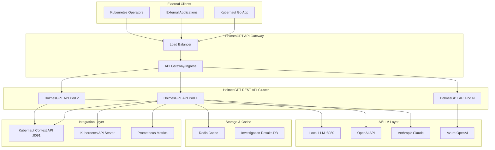
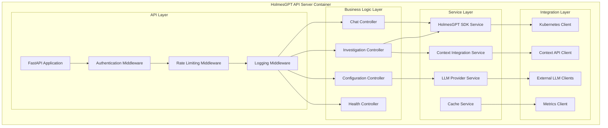

# HolmesGPT REST API Wrapper - Architecture Design

**Document Version**: 1.0
**Date**: January 2025
**Status**: Architecture Design Specification
**Implementation**: Ready for Development

---

## 1. Executive Summary

### 1.1 Architecture Overview
The HolmesGPT REST API Wrapper is a standalone Python-based microservice that provides HTTP endpoints for HolmesGPT investigation capabilities. It replaces the current CLI sidecar approach with a proper REST API server, enabling programmatic access to AI-powered Kubernetes troubleshooting.

### 1.2 Key Architectural Decisions
- **Language**: Python 3.11+ (HolmesGPT SDK compatibility)
- **Framework**: FastAPI (async performance, OpenAPI generation)
- **Container**: Red Hat UBI9 images (enterprise compliance)
- **Deployment**: Kubernetes-native with horizontal scaling
- **Integration**: HTTP API with Kubernaut Context API
- **Security**: Enterprise-grade authentication and authorization

### 1.3 Architecture Principles
- **Cloud-Native**: Kubernetes-first design with container orchestration
- **API-First**: RESTful HTTP API with OpenAPI specification
- **Security-First**: Zero-trust security model with comprehensive protection
- **Performance-First**: Async processing with intelligent caching
- **Enterprise-Ready**: Red Hat certified containers and OpenShift compatibility

---

## 2. System Architecture

### 2.1 High-Level Architecture



### 2.2 Component Architecture



---

## 3. Application Architecture

### 3.1 Project Structure

```
holmesgpt-api-server/
├── src/
│   ├── main.py                     # Application entry point
│   ├── config/
│   │   ├── __init__.py
│   │   ├── settings.py             # Configuration management
│   │   ├── logging.py              # Logging configuration
│   │   └── security.py             # Security configuration
│   ├── api/
│   │   ├── __init__.py
│   │   ├── dependencies.py         # FastAPI dependencies
│   │   ├── middleware.py           # Custom middleware
│   │   └── v1/
│   │       ├── __init__.py
│   │       ├── investigate.py      # Investigation endpoints
│   │       ├── chat.py             # Chat endpoints
│   │       ├── config.py           # Configuration endpoints
│   │       └── health.py           # Health endpoints
│   ├── services/
│   │   ├── __init__.py
│   │   ├── holmesgpt_service.py    # HolmesGPT SDK wrapper
│   │   ├── context_service.py      # Context API integration
│   │   ├── llm_service.py          # LLM provider management
│   │   └── cache_service.py        # Caching service
│   ├── models/
│   │   ├── __init__.py
│   │   ├── requests.py             # API request models
│   │   ├── responses.py            # API response models
│   │   └── internal.py             # Internal data models
│   ├── clients/
│   │   ├── __init__.py
│   │   ├── kubernetes_client.py    # Kubernetes API client
│   │   ├── context_client.py       # Context API client
│   │   └── metrics_client.py       # Metrics client
│   └── utils/
│       ├── __init__.py
│       ├── security.py             # Security utilities
│       ├── validation.py           # Input validation
│       └── helpers.py              # Common utilities
├── tests/
│   ├── unit/
│   ├── integration/
│   └── e2e/
├── deployment/
│   ├── kubernetes/
│   ├── helm/
│   └── docker/
├── docs/
├── requirements.txt
├── requirements-dev.txt
├── Dockerfile
├── .dockerignore
├── pyproject.toml
└── README.md
```

### 3.2 FastAPI Application Architecture

```python
# src/main.py - Application Entry Point
from fastapi import FastAPI, Request
from fastapi.middleware.cors import CORSMiddleware
from fastapi.middleware.trustedhost import TrustedHostMiddleware
from prometheus_fastapi_instrumentator import Instrumentator

from config.settings import get_settings
from config.logging import setup_logging
from api.middleware import SecurityMiddleware, RateLimitMiddleware
from api.v1 import investigate, chat, config, health

def create_application() -> FastAPI:
    """Create and configure FastAPI application."""
    settings = get_settings()
    setup_logging(settings)

    app = FastAPI(
        title="HolmesGPT REST API",
        description="REST API wrapper for HolmesGPT investigation capabilities",
        version="1.0.0",
        docs_url="/docs",
        redoc_url="/redoc",
        openapi_url="/api/v1/openapi.json"
    )

    # Add middleware (order matters)
    app.add_middleware(SecurityMiddleware)
    app.add_middleware(RateLimitMiddleware)
    app.add_middleware(
        CORSMiddleware,
        allow_origins=settings.cors_origins,
        allow_credentials=True,
        allow_methods=["*"],
        allow_headers=["*"],
    )
    app.add_middleware(
        TrustedHostMiddleware,
        allowed_hosts=settings.allowed_hosts
    )

    # Setup metrics
    Instrumentator().instrument(app).expose(app)

    # Include routers
    app.include_router(health.router, tags=["health"])
    app.include_router(investigate.router, prefix="/api/v1", tags=["investigation"])
    app.include_router(chat.router, prefix="/api/v1", tags=["chat"])
    app.include_router(config.router, prefix="/api/v1", tags=["configuration"])

    return app

app = create_application()

if __name__ == "__main__":
    import uvicorn
    settings = get_settings()
    uvicorn.run(
        "main:app",
        host=settings.host,
        port=settings.port,
        reload=settings.debug,
        access_log=True,
        log_config=None  # Use our custom logging config
    )
```

---

## 4. Core Services Architecture

### 4.1 HolmesGPT SDK Service

```python
# src/services/holmesgpt_service.py
from typing import Dict, List, Optional, Any
import asyncio
from concurrent.futures import ThreadPoolExecutor
import holmesgpt
from holmesgpt import HolmesGPT, Investigation, ChatSession

from config.settings import Settings
from models.requests import InvestigationRequest, ChatRequest
from models.responses import InvestigationResponse, ChatResponse

class HolmesGPTService:
    """Service wrapper for HolmesGPT SDK with async support."""

    def __init__(self, settings: Settings):
        self.settings = settings
        self.client: Optional[HolmesGPT] = None
        self.executor = ThreadPoolExecutor(max_workers=settings.max_concurrent_investigations)
        self.chat_sessions: Dict[str, ChatSession] = {}

    async def initialize(self) -> None:
        """Initialize HolmesGPT client with LLM providers."""
        # Initialize HolmesGPT with multiple LLM providers
        self.client = HolmesGPT(
            llm_config={
                "primary": {
                    "provider": self.settings.primary_llm_provider,
                    "model": self.settings.primary_llm_model,
                    "api_key": self.settings.primary_llm_api_key,
                    "base_url": self.settings.primary_llm_base_url,
                },
                "fallback": {
                    "provider": self.settings.fallback_llm_provider,
                    "model": self.settings.fallback_llm_model,
                    "api_key": self.settings.fallback_llm_api_key,
                }
            },
            toolsets=self.settings.enabled_toolsets,
            kubernetes_config=self.settings.kubernetes_config,
            cache_config=self.settings.cache_config
        )

    async def investigate_alert(
        self,
        request: InvestigationRequest,
        context: Optional[Dict[str, Any]] = None
    ) -> InvestigationResponse:
        """Perform alert investigation using HolmesGPT SDK."""

        def _run_investigation():
            investigation = self.client.investigate(
                alert_name=request.alert_name,
                namespace=request.namespace,
                labels=request.labels,
                annotations=request.annotations,
                priority=request.priority,
                custom_context=context,
                toolsets=request.toolsets or self.settings.default_toolsets
            )
            return investigation

        # Run investigation in thread pool to avoid blocking
        loop = asyncio.get_event_loop()
        investigation = await loop.run_in_executor(
            self.executor,
            _run_investigation
        )

        return InvestigationResponse(
            investigation_id=investigation.id,
            status=investigation.status,
            results=investigation.results,
            recommendations=investigation.recommendations,
            metadata={
                "duration": investigation.duration,
                "toolsets_used": investigation.toolsets_used,
                "llm_provider": investigation.llm_provider,
                "tokens_used": investigation.tokens_used
            }
        )

    async def chat_investigation(
        self,
        request: ChatRequest
    ) -> ChatResponse:
        """Handle interactive chat investigation."""

        session_id = request.session_id
        if not session_id:
            # Create new chat session
            session = self.client.create_chat_session(
                context=request.context,
                toolsets=request.toolsets or self.settings.default_toolsets
            )
            session_id = session.id
            self.chat_sessions[session_id] = session
        else:
            session = self.chat_sessions.get(session_id)
            if not session:
                raise ValueError(f"Chat session {session_id} not found")

        def _run_chat():
            response = session.ask(request.message)
            return response

        loop = asyncio.get_event_loop()
        response = await loop.run_in_executor(
            self.executor,
            _run_chat
        )

        return ChatResponse(
            session_id=session_id,
            response=response.message,
            suggestions=response.suggestions,
            metadata={
                "tokens_used": response.tokens_used,
                "response_time": response.response_time
            }
        )
```

### 4.2 Context Integration Service

```python
# src/services/context_service.py
from typing import Dict, Any, Optional
import httpx
import asyncio
from datetime import datetime, timedelta

from config.settings import Settings
from clients.context_client import ContextAPIClient
from services.cache_service import CacheService

class ContextIntegrationService:
    """Service for integrating with Kubernaut Context API."""

    def __init__(self, settings: Settings, cache_service: CacheService):
        self.settings = settings
        self.cache_service = cache_service
        self.context_client = ContextAPIClient(
            base_url=settings.context_api_url,
            timeout=settings.context_api_timeout,
            auth_token=settings.context_api_auth_token
        )

    async def get_investigation_context(
        self,
        alert_name: str,
        namespace: Optional[str] = None,
        resource_type: Optional[str] = None,
        include_metrics: bool = True,
        include_history: bool = True,
        cache_ttl: int = 300  # 5 minutes default cache
    ) -> Dict[str, Any]:
        """Retrieve comprehensive context for investigation."""

        cache_key = f"context:{alert_name}:{namespace}:{resource_type}"

        # Check cache first
        cached_context = await self.cache_service.get(cache_key)
        if cached_context:
            return cached_context

        context = {}

        # Gather context in parallel
        tasks = []

        if namespace and resource_type:
            tasks.append(
                self._get_kubernetes_context(namespace, resource_type)
            )

        if include_metrics:
            tasks.append(
                self._get_metrics_context(alert_name, namespace)
            )

        if include_history:
            tasks.append(
                self._get_history_context(alert_name)
            )

        # Execute all context gathering tasks in parallel
        results = await asyncio.gather(*tasks, return_exceptions=True)

        # Merge results
        for i, result in enumerate(results):
            if isinstance(result, Exception):
                context[f"error_{i}"] = str(result)
            elif isinstance(result, dict):
                context.update(result)

        # Enrich with investigation-specific context
        context["investigation_metadata"] = {
            "timestamp": datetime.utcnow().isoformat(),
            "alert_name": alert_name,
            "namespace": namespace,
            "resource_type": resource_type,
            "context_sources": len([r for r in results if not isinstance(r, Exception)])
        }

        # Cache the context
        await self.cache_service.set(cache_key, context, ttl=cache_ttl)

        return context

    async def _get_kubernetes_context(
        self,
        namespace: str,
        resource_type: str
    ) -> Dict[str, Any]:
        """Get Kubernetes resource context."""
        return await self.context_client.get_kubernetes_context(
            namespace=namespace,
            resource_type=resource_type
        )

    async def _get_metrics_context(
        self,
        alert_name: str,
        namespace: Optional[str]
    ) -> Dict[str, Any]:
        """Get metrics context for the alert."""
        return await self.context_client.get_metrics_context(
            alert_name=alert_name,
            namespace=namespace,
            time_range="1h"  # Last hour of metrics
        )

    async def _get_history_context(
        self,
        alert_name: str
    ) -> Dict[str, Any]:
        """Get historical context for similar alerts."""
        return await self.context_client.get_action_history(
            alert_type=alert_name,
            limit=10
        )
```

### 4.3 LLM Provider Service

```python
# src/services/llm_service.py
from typing import Dict, List, Optional, Any
from enum import Enum
import httpx
from dataclasses import dataclass

class LLMProvider(Enum):
    OPENAI = "openai"
    ANTHROPIC = "anthropic"
    LOCAL_LLM = "local_llm"
    AZURE_OPENAI = "azure_openai"
    OLLAMA = "ollama"

@dataclass
class LLMConfig:
    provider: LLMProvider
    model: str
    api_key: Optional[str]
    base_url: Optional[str]
    max_tokens: int = 4000
    temperature: float = 0.3
    timeout: int = 60

class LLMProviderService:
    """Service for managing multiple LLM providers with failover."""

    def __init__(self, configs: List[LLMConfig]):
        self.configs = configs
        self.primary_config = configs[0] if configs else None
        self.fallback_configs = configs[1:] if len(configs) > 1 else []
        self.health_status: Dict[str, bool] = {}

    async def get_available_models(self) -> Dict[str, List[str]]:
        """Get available models from all configured providers."""
        models = {}

        for config in self.configs:
            try:
                provider_models = await self._get_provider_models(config)
                models[config.provider.value] = provider_models
            except Exception as e:
                models[config.provider.value] = [f"Error: {str(e)}"]

        return models

    async def validate_provider_health(self, config: LLMConfig) -> bool:
        """Check if LLM provider is healthy and accessible."""
        try:
            async with httpx.AsyncClient(timeout=10.0) as client:
                if config.provider == LLMProvider.OPENAI:
                    response = await client.get(
                        "https://api.openai.com/v1/models",
                        headers={"Authorization": f"Bearer {config.api_key}"}
                    )
                elif config.provider == LLMProvider.LOCAL_LLM and config.base_url:
                    response = await client.get(f"{config.base_url}/v1/models")
                else:
                    # Add other provider health checks
                    return True

                self.health_status[config.provider.value] = response.status_code == 200
                return response.status_code == 200

        except Exception:
            self.health_status[config.provider.value] = False
            return False

    async def _get_provider_models(self, config: LLMConfig) -> List[str]:
        """Get available models for a specific provider."""
        async with httpx.AsyncClient(timeout=30.0) as client:
            if config.provider == LLMProvider.OPENAI:
                response = await client.get(
                    "https://api.openai.com/v1/models",
                    headers={"Authorization": f"Bearer {config.api_key}"}
                )
                models_data = response.json()
                return [model["id"] for model in models_data.get("data", [])]

            elif config.provider == LLMProvider.LOCAL_LLM and config.base_url:
                response = await client.get(f"{config.base_url}/v1/models")
                models_data = response.json()
                return [model["id"] for model in models_data.get("data", [])]

            # Add other providers as needed
            return [config.model]
```

---

## 5. API Layer Architecture

### 5.1 Investigation Endpoints

```python
# src/api/v1/investigate.py
from fastapi import APIRouter, Depends, HTTPException, BackgroundTasks
from fastapi.security import HTTPBearer
from typing import Optional, Dict, Any
import uuid

from api.dependencies import get_current_user, get_holmesgpt_service, get_context_service
from models.requests import InvestigationRequest
from models.responses import InvestigationResponse, AsyncInvestigationResponse
from services.holmesgpt_service import HolmesGPTService
from services.context_service import ContextIntegrationService

router = APIRouter()
security = HTTPBearer()

@router.post(
    "/investigate",
    response_model=InvestigationResponse,
    summary="Start synchronous alert investigation",
    description="Perform immediate alert investigation and return results"
)
async def investigate_alert(
    request: InvestigationRequest,
    holmesgpt_service: HolmesGPTService = Depends(get_holmesgpt_service),
    context_service: ContextIntegrationService = Depends(get_context_service),
    current_user: dict = Depends(get_current_user)
):
    """Synchronous alert investigation endpoint."""
    try:
        # Get enhanced context if requested
        context = None
        if request.include_context:
            context = await context_service.get_investigation_context(
                alert_name=request.alert_name,
                namespace=request.namespace,
                include_metrics=request.include_metrics,
                include_history=request.include_history
            )

        # Perform investigation
        result = await holmesgpt_service.investigate_alert(
            request=request,
            context=context
        )

        return result

    except Exception as e:
        raise HTTPException(
            status_code=500,
            detail=f"Investigation failed: {str(e)}"
        )

@router.post(
    "/investigate/async",
    response_model=AsyncInvestigationResponse,
    summary="Start asynchronous alert investigation",
    description="Start investigation as background task and return job ID"
)
async def investigate_alert_async(
    request: InvestigationRequest,
    background_tasks: BackgroundTasks,
    holmesgpt_service: HolmesGPTService = Depends(get_holmesgpt_service),
    context_service: ContextIntegrationService = Depends(get_context_service),
    current_user: dict = Depends(get_current_user)
):
    """Asynchronous alert investigation endpoint."""
    investigation_id = str(uuid.uuid4())

    # Start background investigation
    background_tasks.add_task(
        _run_background_investigation,
        investigation_id,
        request,
        holmesgpt_service,
        context_service
    )

    return AsyncInvestigationResponse(
        investigation_id=investigation_id,
        status="started",
        message="Investigation started in background"
    )

@router.get(
    "/investigate/{investigation_id}",
    response_model=InvestigationResponse,
    summary="Get investigation status and results",
    description="Retrieve status and results of an ongoing or completed investigation"
)
async def get_investigation_status(
    investigation_id: str,
    current_user: dict = Depends(get_current_user)
):
    """Get investigation status endpoint."""
    # Implementation would retrieve from cache/database
    # This is a placeholder for the actual implementation
    pass

async def _run_background_investigation(
    investigation_id: str,
    request: InvestigationRequest,
    holmesgpt_service: HolmesGPTService,
    context_service: ContextIntegrationService
):
    """Background task for running investigations."""
    try:
        # Store investigation as "running"
        # Get context and run investigation
        # Store results in cache/database
        pass
    except Exception as e:
        # Store error status
        pass
```

### 5.2 Chat Endpoints

```python
# src/api/v1/chat.py
from fastapi import APIRouter, Depends, HTTPException, WebSocket, WebSocketDisconnect
from typing import Optional
import json

from api.dependencies import get_current_user, get_holmesgpt_service
from models.requests import ChatRequest
from models.responses import ChatResponse
from services.holmesgpt_service import HolmesGPTService

router = APIRouter()

@router.post(
    "/chat",
    response_model=ChatResponse,
    summary="Interactive chat investigation",
    description="Send message to HolmesGPT for interactive troubleshooting"
)
async def chat_investigation(
    request: ChatRequest,
    holmesgpt_service: HolmesGPTService = Depends(get_holmesgpt_service),
    current_user: dict = Depends(get_current_user)
):
    """Interactive chat endpoint."""
    try:
        result = await holmesgpt_service.chat_investigation(request)
        return result
    except Exception as e:
        raise HTTPException(
            status_code=500,
            detail=f"Chat failed: {str(e)}"
        )

@router.websocket("/chat/ws")
async def chat_websocket(
    websocket: WebSocket,
    holmesgpt_service: HolmesGPTService = Depends(get_holmesgpt_service)
):
    """WebSocket endpoint for real-time chat."""
    await websocket.accept()
    session_id = None

    try:
        while True:
            # Receive message from client
            data = await websocket.receive_text()
            message_data = json.loads(data)

            # Create chat request
            chat_request = ChatRequest(
                session_id=session_id,
                message=message_data.get("message"),
                context=message_data.get("context")
            )

            # Process chat
            response = await holmesgpt_service.chat_investigation(chat_request)
            session_id = response.session_id

            # Send response back to client
            await websocket.send_text(response.json())

    except WebSocketDisconnect:
        # Clean up session
        if session_id:
            # Clean up chat session
            pass
```

---

## 6. Container Architecture

### 6.1 Multi-Stage Dockerfile with Red Hat UBI

```dockerfile
# Dockerfile - Production-ready Red Hat UBI container
# Build stage
FROM registry.access.redhat.com/ubi9/python-311:1-66 AS builder

# Metadata
LABEL name="holmesgpt-api-server-builder" \
      vendor="Kubernaut Project" \
      version="1.0.0" \
      summary="HolmesGPT REST API Server Builder" \
      description="Build stage for HolmesGPT REST API Server"

# Install build dependencies
USER root
RUN dnf update -y && \
    dnf install -y \
        gcc \
        gcc-c++ \
        git \
        make \
        cmake \
        && dnf clean all

# Set working directory
WORKDIR /app

# Copy requirements and install dependencies
USER 1001
COPY --chown=1001:0 requirements.txt requirements-prod.txt ./
RUN pip install --no-cache-dir --user --upgrade pip setuptools wheel && \
    pip install --no-cache-dir --user -r requirements-prod.txt && \
    pip install --no-cache-dir --user holmesgpt

# Runtime stage - UBI-micro for minimal footprint
FROM registry.access.redhat.com/ubi9-micro:9.3-13

# Metadata for Red Hat Container Certification
LABEL name="holmesgpt-api-server" \
      vendor="Kubernaut Project" \
      version="1.0.0" \
      release="1" \
      summary="HolmesGPT REST API Server" \
      description="REST API wrapper for HolmesGPT investigation capabilities providing HTTP endpoints for AI-powered Kubernetes troubleshooting" \
      io.k8s.description="HolmesGPT REST API Server for Kubernetes troubleshooting" \
      io.k8s.display-name="HolmesGPT API Server" \
      io.openshift.tags="ai,troubleshooting,kubernetes,investigation,holmesgpt" \
      com.redhat.component="holmesgpt-api-server" \
      com.redhat.license_terms="https://www.redhat.com/en/about/red-hat-end-user-license-agreements#UBI"

# Copy Python runtime from builder
COPY --from=builder /etc/passwd /etc/passwd
COPY --from=builder /etc/group /etc/group
COPY --from=builder /usr/bin/python3.11 /usr/bin/python3.11
COPY --from=builder /usr/lib64/python3.11 /usr/lib64/python3.11
COPY --from=builder /home/default/.local /usr/local

# Create application user and directories
USER root
RUN mkdir -p /app /config /data /tmp/app && \
    useradd -u 1001 -r -g 0 -d /app -s /sbin/nologin -c "HolmesGPT API User" holmesapi && \
    chown -R 1001:0 /app /config /data /tmp/app && \
    chmod -R g=u /app /config /data /tmp/app && \
    chmod +x /usr/bin/python3.11

# Set working directory
WORKDIR /app

# Copy application source code
COPY --chown=1001:0 src/ ./src/
COPY --chown=1001:0 config/ /config/
COPY --chown=1001:0 entrypoint.sh ./

# Set environment variables
ENV PYTHONPATH=/usr/local/lib/python3.11/site-packages:/app/src
ENV PYTHONUNBUFFERED=1
ENV PYTHONDONTWRITEBYTECODE=1
ENV HOME=/app
ENV TMPDIR=/tmp/app

# Switch to non-root user
USER 1001

# Health check
HEALTHCHECK --interval=30s --timeout=10s --start-period=30s --retries=3 \
    CMD python3.11 -c "import requests; requests.get('http://localhost:8090/health', timeout=5).raise_for_status()" || exit 1

# Expose ports
EXPOSE 8090 9091

# Start the application
ENTRYPOINT ["./entrypoint.sh"]
CMD ["python3.11", "src/main.py"]
```

### 6.2 Container Entrypoint

```bash
#!/bin/bash
# entrypoint.sh - Container initialization script

set -e

# Colors for output
RED='\033[0;31m'
GREEN='\033[0;32m'
YELLOW='\033[1;33m'
NC='\033[0m'

log() {
    echo -e "${GREEN}[$(date +'%Y-%m-%d %H:%M:%S')] $1${NC}"
}

log_warn() {
    echo -e "${YELLOW}[$(date +'%Y-%m-%d %H:%M:%S')] WARNING: $1${NC}"
}

log_error() {
    echo -e "${RED}[$(date +'%Y-%m-%d %H:%M:%S')] ERROR: $1${NC}"
}

# Validate environment
log "🚀 Starting HolmesGPT REST API Server"

# Check required environment variables
required_vars=(
    "HOLMESGPT_LLM_PROVIDER"
    "HOLMESGPT_LLM_MODEL"
)

for var in "${required_vars[@]}"; do
    if [[ -z "${!var}" ]]; then
        log_error "Required environment variable $var is not set"
        exit 1
    fi
done

# Validate configuration
if [[ -f "/config/settings.yaml" ]]; then
    log "📋 Using configuration file: /config/settings.yaml"
else
    log_warn "No configuration file found, using environment variables"
fi

# Check Python and dependencies
log "🐍 Python version: $(python3.11 --version)"
log "📦 HolmesGPT SDK: $(python3.11 -c 'import holmesgpt; print(holmesgpt.__version__)')"

# Validate LLM connectivity
if [[ -n "$HOLMESGPT_LLM_BASE_URL" ]]; then
    log "🔗 Testing LLM connectivity to $HOLMESGPT_LLM_BASE_URL"
    if timeout 10 python3.11 -c "
import requests
try:
    response = requests.get('${HOLMESGPT_LLM_BASE_URL}/v1/models', timeout=5)
    print(f'LLM Status: {response.status_code}')
except Exception as e:
    print(f'LLM Error: {e}')
"; then
        log "✅ LLM connectivity verified"
    else
        log_warn "⚠️ LLM connectivity test failed (service may still work)"
    fi
fi

# Test Context API connectivity
if [[ -n "$KUBERNAUT_CONTEXT_API_URL" ]]; then
    log "🔗 Testing Context API connectivity to $KUBERNAUT_CONTEXT_API_URL"
    if timeout 5 python3.11 -c "
import requests
try:
    response = requests.get('${KUBERNAUT_CONTEXT_API_URL}/api/v1/context/health', timeout=3)
    print(f'Context API Status: {response.status_code}')
except Exception as e:
    print(f'Context API Error: {e}')
"; then
        log "✅ Context API connectivity verified"
    else
        log_warn "⚠️ Context API connectivity test failed"
    fi
fi

# Start the application
log "🎯 Starting HolmesGPT REST API Server on port ${HOLMESGPT_PORT:-8090}"
exec "$@"
```

---

## 7. Security Architecture

### 7.1 Authentication & Authorization

```python
# src/api/dependencies.py - Security dependencies
from fastapi import Depends, HTTPException, status
from fastapi.security import HTTPBearer, HTTPAuthorizationCredentials
from jose import JWTError, jwt
from typing import Optional
import redis

from config.settings import get_settings

security = HTTPBearer()
redis_client = redis.Redis(host="redis", port=6379, db=0)

async def get_current_user(
    credentials: HTTPAuthorizationCredentials = Depends(security)
) -> dict:
    """Validate JWT token and return user information."""
    settings = get_settings()

    try:
        # Decode JWT token
        payload = jwt.decode(
            credentials.credentials,
            settings.jwt_secret_key,
            algorithms=[settings.jwt_algorithm]
        )
        username: str = payload.get("sub")
        if username is None:
            raise HTTPException(
                status_code=status.HTTP_401_UNAUTHORIZED,
                detail="Invalid authentication credentials"
            )

        # Check if token is blacklisted
        if redis_client.get(f"blacklist:{credentials.credentials}"):
            raise HTTPException(
                status_code=status.HTTP_401_UNAUTHORIZED,
                detail="Token has been revoked"
            )

        return {
            "username": username,
            "permissions": payload.get("permissions", []),
            "roles": payload.get("roles", [])
        }

    except JWTError:
        raise HTTPException(
            status_code=status.HTTP_401_UNAUTHORIZED,
            detail="Invalid authentication credentials"
        )

def require_permission(permission: str):
    """Decorator to require specific permission."""
    def permission_checker(current_user: dict = Depends(get_current_user)):
        if permission not in current_user.get("permissions", []):
            raise HTTPException(
                status_code=status.HTTP_403_FORBIDDEN,
                detail=f"Permission '{permission}' required"
            )
        return current_user
    return permission_checker

def require_role(role: str):
    """Decorator to require specific role."""
    def role_checker(current_user: dict = Depends(get_current_user)):
        if role not in current_user.get("roles", []):
            raise HTTPException(
                status_code=status.HTTP_403_FORBIDDEN,
                detail=f"Role '{role}' required"
            )
        return current_user
    return role_checker
```

### 7.2 Security Middleware

```python
# src/api/middleware.py - Custom security middleware
from fastapi import Request, Response
from fastapi.responses import JSONResponse
import time
import hashlib
from collections import defaultdict
from datetime import datetime, timedelta

class SecurityMiddleware:
    """Comprehensive security middleware."""

    def __init__(self, app):
        self.app = app

    async def __call__(self, scope, receive, send):
        if scope["type"] == "http":
            request = Request(scope, receive)

            # Security headers
            async def send_wrapper(message):
                if message["type"] == "http.response.start":
                    headers = list(message.get("headers", []))

                    # Add security headers
                    security_headers = [
                        (b"x-content-type-options", b"nosniff"),
                        (b"x-frame-options", b"DENY"),
                        (b"x-xss-protection", b"1; mode=block"),
                        (b"strict-transport-security", b"max-age=31536000; includeSubDomains"),
                        (b"content-security-policy", b"default-src 'self'"),
                        (b"referrer-policy", b"strict-origin-when-cross-origin"),
                        (b"permissions-policy", b"geolocation=(), microphone=(), camera=()"),
                    ]

                    headers.extend(security_headers)
                    message["headers"] = headers

                await send(message)

            await self.app(scope, receive, send_wrapper)
        else:
            await self.app(scope, receive, send)

class RateLimitMiddleware:
    """Rate limiting middleware with Redis backend."""

    def __init__(self, app, redis_client=None):
        self.app = app
        self.redis_client = redis_client
        self.rate_limits = {
            "/api/v1/investigate": {"requests": 10, "window": 60},  # 10 req/min
            "/api/v1/chat": {"requests": 30, "window": 60},         # 30 req/min
            "/health": {"requests": 100, "window": 60},             # 100 req/min
        }

    async def __call__(self, scope, receive, send):
        if scope["type"] == "http":
            request = Request(scope, receive)

            # Get client identifier
            client_ip = request.client.host
            user_agent = request.headers.get("user-agent", "")
            client_id = hashlib.md5(f"{client_ip}:{user_agent}".encode()).hexdigest()

            # Check rate limit
            path = request.url.path
            rate_limit = self._get_rate_limit(path)

            if rate_limit and not await self._check_rate_limit(client_id, path, rate_limit):
                response = JSONResponse(
                    status_code=429,
                    content={
                        "error": "Rate limit exceeded",
                        "detail": f"Maximum {rate_limit['requests']} requests per {rate_limit['window']} seconds"
                    }
                )
                await response(scope, receive, send)
                return

        await self.app(scope, receive, send)

    def _get_rate_limit(self, path: str) -> dict:
        """Get rate limit configuration for path."""
        for pattern, limit in self.rate_limits.items():
            if path.startswith(pattern):
                return limit
        return None

    async def _check_rate_limit(self, client_id: str, path: str, rate_limit: dict) -> bool:
        """Check if client is within rate limit."""
        key = f"rate_limit:{client_id}:{path}"
        current_time = int(time.time())
        window_start = current_time - rate_limit["window"]

        if self.redis_client:
            # Use Redis for distributed rate limiting
            pipe = self.redis_client.pipeline()
            pipe.zremrangebyscore(key, 0, window_start)
            pipe.zcard(key)
            pipe.zadd(key, {str(current_time): current_time})
            pipe.expire(key, rate_limit["window"])
            results = pipe.execute()

            current_requests = results[1]
            return current_requests < rate_limit["requests"]
        else:
            # Fallback to in-memory rate limiting
            # Implementation would use a local cache
            return True
```

---

## 8. Deployment Architecture

### 8.1 Kubernetes Deployment Manifest

```yaml
# deployment/kubernetes/holmesgpt-api-deployment.yaml
apiVersion: apps/v1
kind: Deployment
metadata:
  name: holmesgpt-api-server
  namespace: kubernaut-system
  labels:
    app: holmesgpt-api-server
    component: ai-investigation
    version: v1.0.0
spec:
  replicas: 3
  strategy:
    type: RollingUpdate
    rollingUpdate:
      maxUnavailable: 1
      maxSurge: 1
  selector:
    matchLabels:
      app: holmesgpt-api-server
  template:
    metadata:
      labels:
        app: holmesgpt-api-server
        component: ai-investigation
      annotations:
        prometheus.io/scrape: "true"
        prometheus.io/port: "9091"
        prometheus.io/path: "/metrics"
    spec:
      securityContext:
        runAsNonRoot: true
        runAsUser: 1001
        runAsGroup: 0
        fsGroup: 0
        seccompProfile:
          type: RuntimeDefault
      serviceAccountName: holmesgpt-api-server
      containers:
      - name: holmesgpt-api
        image: registry.kubernaut.io/holmesgpt-api-server:1.0.0
        imagePullPolicy: IfNotPresent
        securityContext:
          allowPrivilegeEscalation: false
          readOnlyRootFilesystem: true
          capabilities:
            drop:
            - ALL
        ports:
        - name: http
          containerPort: 8090
          protocol: TCP
        - name: metrics
          containerPort: 9091
          protocol: TCP
        env:
        - name: HOLMESGPT_PORT
          value: "8090"
        - name: HOLMESGPT_METRICS_PORT
          value: "9091"
        - name: HOLMESGPT_LOG_LEVEL
          value: "INFO"
        - name: HOLMESGPT_LLM_PROVIDER
          valueFrom:
            configMapKeyRef:
              name: holmesgpt-config
              key: llm_provider
        - name: HOLMESGPT_LLM_MODEL
          valueFrom:
            configMapKeyRef:
              name: holmesgpt-config
              key: llm_model
        - name: HOLMESGPT_LLM_API_KEY
          valueFrom:
            secretKeyRef:
              name: holmesgpt-secrets
              key: llm_api_key
        - name: KUBERNAUT_CONTEXT_API_URL
          value: "http://context-api-service:8091"
        - name: JWT_SECRET_KEY
          valueFrom:
            secretKeyRef:
              name: holmesgpt-secrets
              key: jwt_secret_key
        resources:
          limits:
            memory: "2Gi"
            cpu: "1000m"
          requests:
            memory: "512Mi"
            cpu: "250m"
        livenessProbe:
          httpGet:
            path: /health
            port: http
          initialDelaySeconds: 30
          periodSeconds: 30
          timeoutSeconds: 10
          failureThreshold: 3
        readinessProbe:
          httpGet:
            path: /ready
            port: http
          initialDelaySeconds: 10
          periodSeconds: 10
          timeoutSeconds: 5
          failureThreshold: 3
        volumeMounts:
        - name: tmp
          mountPath: /tmp/app
        - name: config
          mountPath: /config
          readOnly: true
        - name: cache
          mountPath: /app/cache
      volumes:
      - name: tmp
        emptyDir:
          sizeLimit: 100Mi
      - name: config
        configMap:
          name: holmesgpt-config
      - name: cache
        emptyDir:
          sizeLimit: 1Gi
      affinity:
        podAntiAffinity:
          preferredDuringSchedulingIgnoredDuringExecution:
          - weight: 100
            podAffinityTerm:
              labelSelector:
                matchExpressions:
                - key: app
                  operator: In
                  values:
                  - holmesgpt-api-server
              topologyKey: kubernetes.io/hostname
```

### 8.2 Service and Ingress

```yaml
# deployment/kubernetes/holmesgpt-api-service.yaml
apiVersion: v1
kind: Service
metadata:
  name: holmesgpt-api-service
  namespace: kubernaut-system
  labels:
    app: holmesgpt-api-server
  annotations:
    prometheus.io/scrape: "true"
    prometheus.io/port: "9091"
    prometheus.io/path: "/metrics"
spec:
  type: ClusterIP
  ports:
  - name: http
    port: 8090
    targetPort: http
    protocol: TCP
  - name: metrics
    port: 9091
    targetPort: metrics
    protocol: TCP
  selector:
    app: holmesgpt-api-server

---
apiVersion: networking.k8s.io/v1
kind: Ingress
metadata:
  name: holmesgpt-api-ingress
  namespace: kubernaut-system
  annotations:
    nginx.ingress.kubernetes.io/rewrite-target: /
    nginx.ingress.kubernetes.io/ssl-redirect: "true"
    nginx.ingress.kubernetes.io/force-ssl-redirect: "true"
    nginx.ingress.kubernetes.io/rate-limit: "100"
    nginx.ingress.kubernetes.io/rate-limit-window: "1m"
spec:
  tls:
  - hosts:
    - holmesgpt-api.kubernaut.io
    secretName: holmesgpt-api-tls
  rules:
  - host: holmesgpt-api.kubernaut.io
    http:
      paths:
      - path: /
        pathType: Prefix
        backend:
          service:
            name: holmesgpt-api-service
            port:
              number: 8090
```

---

## 9. Configuration Management

### 9.1 Settings Configuration

```python
# src/config/settings.py - Centralized configuration management
from pydantic import BaseSettings, Field
from typing import List, Optional, Dict, Any
from enum import Enum
import os

class Environment(str, Enum):
    DEVELOPMENT = "development"
    STAGING = "staging"
    PRODUCTION = "production"

class LLMProvider(str, Enum):
    OPENAI = "openai"
    ANTHROPIC = "anthropic"
    LOCAL_LLM = "local_llm"
    AZURE_OPENAI = "azure_openai"
    OLLAMA = "ollama"

class Settings(BaseSettings):
    """Application settings with environment variable support."""

    # Application
    app_name: str = Field(default="HolmesGPT REST API", env="APP_NAME")
    app_version: str = Field(default="1.0.0", env="APP_VERSION")
    environment: Environment = Field(default=Environment.PRODUCTION, env="ENVIRONMENT")
    debug: bool = Field(default=False, env="DEBUG")

    # Server
    host: str = Field(default="0.0.0.0", env="HOLMESGPT_HOST")
    port: int = Field(default=8090, env="HOLMESGPT_PORT")
    metrics_port: int = Field(default=9091, env="HOLMESGPT_METRICS_PORT")
    workers: int = Field(default=1, env="HOLMESGPT_WORKERS")

    # Security
    jwt_secret_key: str = Field(..., env="JWT_SECRET_KEY")
    jwt_algorithm: str = Field(default="HS256", env="JWT_ALGORITHM")
    jwt_expire_minutes: int = Field(default=60, env="JWT_EXPIRE_MINUTES")
    cors_origins: List[str] = Field(default=["*"], env="CORS_ORIGINS")
    allowed_hosts: List[str] = Field(default=["*"], env="ALLOWED_HOSTS")

    # LLM Configuration
    primary_llm_provider: LLMProvider = Field(..., env="HOLMESGPT_LLM_PROVIDER")
    primary_llm_model: str = Field(..., env="HOLMESGPT_LLM_MODEL")
    primary_llm_api_key: Optional[str] = Field(default=None, env="HOLMESGPT_LLM_API_KEY")
    primary_llm_base_url: Optional[str] = Field(default=None, env="HOLMESGPT_LLM_BASE_URL")

    fallback_llm_provider: Optional[LLMProvider] = Field(default=None, env="HOLMESGPT_FALLBACK_LLM_PROVIDER")
    fallback_llm_model: Optional[str] = Field(default=None, env="HOLMESGPT_FALLBACK_LLM_MODEL")
    fallback_llm_api_key: Optional[str] = Field(default=None, env="HOLMESGPT_FALLBACK_LLM_API_KEY")

    # HolmesGPT Configuration
    enabled_toolsets: List[str] = Field(
        default=["kubernetes", "prometheus", "internet"],
        env="HOLMESGPT_TOOLSETS"
    )
    default_toolsets: List[str] = Field(
        default=["kubernetes", "prometheus"],
        env="HOLMESGPT_DEFAULT_TOOLSETS"
    )
    max_concurrent_investigations: int = Field(default=10, env="HOLMESGPT_MAX_CONCURRENT")
    investigation_timeout: int = Field(default=300, env="HOLMESGPT_INVESTIGATION_TIMEOUT")

    # Context API Integration
    context_api_url: str = Field(
        default="http://context-api-service:8091",
        env="KUBERNAUT_CONTEXT_API_URL"
    )
    context_api_timeout: int = Field(default=30, env="KUBERNAUT_CONTEXT_API_TIMEOUT")
    context_api_auth_token: Optional[str] = Field(default=None, env="KUBERNAUT_CONTEXT_API_TOKEN")

    # Kubernetes Configuration
    kubernetes_config_path: Optional[str] = Field(default=None, env="KUBECONFIG")
    kubernetes_in_cluster: bool = Field(default=True, env="KUBERNETES_IN_CLUSTER")
    kubernetes_namespace: str = Field(default="kubernaut-system", env="KUBERNETES_NAMESPACE")

    # Cache Configuration
    redis_url: str = Field(default="redis://redis:6379/0", env="REDIS_URL")
    cache_ttl_default: int = Field(default=300, env="CACHE_TTL_DEFAULT")
    cache_ttl_context: int = Field(default=600, env="CACHE_TTL_CONTEXT")
    cache_ttl_investigations: int = Field(default=3600, env="CACHE_TTL_INVESTIGATIONS")

    # Logging
    log_level: str = Field(default="INFO", env="LOG_LEVEL")
    log_format: str = Field(default="json", env="LOG_FORMAT")
    log_file: Optional[str] = Field(default=None, env="LOG_FILE")

    # Performance
    request_timeout: int = Field(default=30, env="REQUEST_TIMEOUT")
    rate_limit_requests: int = Field(default=100, env="RATE_LIMIT_REQUESTS")
    rate_limit_window: int = Field(default=60, env="RATE_LIMIT_WINDOW")

    class Config:
        env_file = ".env"
        env_file_encoding = "utf-8"
        case_sensitive = False

# Global settings instance
_settings: Optional[Settings] = None

def get_settings() -> Settings:
    """Get global settings instance."""
    global _settings
    if _settings is None:
        _settings = Settings()
    return _settings

def reload_settings() -> Settings:
    """Reload settings from environment."""
    global _settings
    _settings = Settings()
    return _settings
```

### 9.2 Configuration Files

```yaml
# config/settings.yaml - YAML configuration file
app:
  name: "HolmesGPT REST API"
  version: "1.0.0"
  environment: "production"

server:
  host: "0.0.0.0"
  port: 8090
  metrics_port: 9091
  workers: 3

security:
  cors_origins:
    - "https://kubernaut.kubernaut.io"
    - "https://admin.kubernaut.io"
  allowed_hosts:
    - "holmesgpt-api.kubernaut.io"
  jwt_expire_minutes: 60

llm:
  primary:
    provider: "local_llm"
    model: "gpt-oss:20b"
    base_url: "http://local-llm:8080"
    timeout: 60
    max_tokens: 4000
    temperature: 0.3
  fallback:
    provider: "openai"
    model: "gpt-4"
    timeout: 30

holmesgpt:
  enabled_toolsets:
    - "kubernetes"
    - "prometheus"
    - "internet"
    - "docker"
  default_toolsets:
    - "kubernetes"
    - "prometheus"
  max_concurrent_investigations: 10
  investigation_timeout: 300

integrations:
  context_api:
    url: "http://context-api-service:8091"
    timeout: 30
    retry_count: 3
  kubernetes:
    in_cluster: true
    namespace: "kubernaut-system"
  prometheus:
    url: "http://prometheus:9090"

cache:
  redis_url: "redis://redis:6379/0"
  ttl:
    default: 300
    context: 600
    investigations: 3600
    models: 86400

logging:
  level: "INFO"
  format: "json"
  structured: true
  fields:
    service: "holmesgpt-api"
    component: "investigation"

performance:
  request_timeout: 30
  rate_limiting:
    enabled: true
    requests_per_minute: 100
    burst_size: 20
```

---

## 10. Monitoring & Observability

### 10.1 Metrics Collection

```python
# src/config/metrics.py - Prometheus metrics configuration
from prometheus_client import Counter, Histogram, Gauge, Info
import time
from functools import wraps

# Application metrics
app_info = Info('holmesgpt_api_info', 'HolmesGPT API Server Information')
app_info.info({
    'version': '1.0.0',
    'python_version': '3.11',
    'sdk_version': 'holmesgpt-1.0.0'
})

# Request metrics
http_requests_total = Counter(
    'holmesgpt_api_http_requests_total',
    'Total HTTP requests',
    ['method', 'endpoint', 'status_code']
)

http_request_duration_seconds = Histogram(
    'holmesgpt_api_http_request_duration_seconds',
    'HTTP request duration in seconds',
    ['method', 'endpoint'],
    buckets=[0.1, 0.5, 1.0, 2.0, 5.0, 10.0, 30.0, 60.0]
)

# Investigation metrics
investigations_total = Counter(
    'holmesgpt_api_investigations_total',
    'Total investigations performed',
    ['alert_type', 'status', 'toolsets']
)

investigation_duration_seconds = Histogram(
    'holmesgpt_api_investigation_duration_seconds',
    'Investigation duration in seconds',
    ['alert_type', 'toolsets'],
    buckets=[1.0, 5.0, 10.0, 30.0, 60.0, 120.0, 300.0]
)

# Chat metrics
chat_messages_total = Counter(
    'holmesgpt_api_chat_messages_total',
    'Total chat messages processed',
    ['session_type']
)

chat_response_time_seconds = Histogram(
    'holmesgpt_api_chat_response_time_seconds',
    'Chat response time in seconds',
    buckets=[0.5, 1.0, 2.0, 5.0, 10.0, 30.0]
)

# LLM metrics
llm_requests_total = Counter(
    'holmesgpt_api_llm_requests_total',
    'Total LLM requests',
    ['provider', 'model', 'status']
)

llm_tokens_used_total = Counter(
    'holmesgpt_api_llm_tokens_used_total',
    'Total LLM tokens used',
    ['provider', 'model', 'type']  # type: prompt, completion
)

# System metrics
active_investigations = Gauge(
    'holmesgpt_api_active_investigations',
    'Number of active investigations'
)

cache_hits_total = Counter(
    'holmesgpt_api_cache_hits_total',
    'Total cache hits',
    ['cache_type']
)

cache_misses_total = Counter(
    'holmesgpt_api_cache_misses_total',
    'Total cache misses',
    ['cache_type']
)

# Decorators for automatic metrics collection
def track_investigation_metrics(func):
    """Decorator to track investigation metrics."""
    @wraps(func)
    async def wrapper(*args, **kwargs):
        start_time = time.time()
        active_investigations.inc()

        try:
            result = await func(*args, **kwargs)
            investigations_total.labels(
                alert_type=kwargs.get('alert_type', 'unknown'),
                status='success',
                toolsets=','.join(kwargs.get('toolsets', []))
            ).inc()
            return result
        except Exception as e:
            investigations_total.labels(
                alert_type=kwargs.get('alert_type', 'unknown'),
                status='error',
                toolsets=','.join(kwargs.get('toolsets', []))
            ).inc()
            raise
        finally:
            duration = time.time() - start_time
            investigation_duration_seconds.labels(
                alert_type=kwargs.get('alert_type', 'unknown'),
                toolsets=','.join(kwargs.get('toolsets', []))
            ).observe(duration)
            active_investigations.dec()

    return wrapper

def track_llm_metrics(func):
    """Decorator to track LLM usage metrics."""
    @wraps(func)
    async def wrapper(*args, **kwargs):
        provider = kwargs.get('provider', 'unknown')
        model = kwargs.get('model', 'unknown')

        try:
            result = await func(*args, **kwargs)
            llm_requests_total.labels(
                provider=provider,
                model=model,
                status='success'
            ).inc()

            # Track token usage if available
            if hasattr(result, 'token_usage'):
                llm_tokens_used_total.labels(
                    provider=provider,
                    model=model,
                    type='prompt'
                ).inc(result.token_usage.prompt_tokens)

                llm_tokens_used_total.labels(
                    provider=provider,
                    model=model,
                    type='completion'
                ).inc(result.token_usage.completion_tokens)

            return result
        except Exception as e:
            llm_requests_total.labels(
                provider=provider,
                model=model,
                status='error'
            ).inc()
            raise

    return wrapper
```

### 10.2 Health Checks

```python
# src/api/v1/health.py - Health check endpoints
from fastapi import APIRouter, Depends
from typing import Dict, Any
import asyncio
import redis
import httpx
from datetime import datetime

from services.holmesgpt_service import HolmesGPTService
from services.context_service import ContextIntegrationService
from config.settings import get_settings

router = APIRouter()

@router.get("/health")
async def health_check() -> Dict[str, Any]:
    """Comprehensive health check endpoint."""
    settings = get_settings()
    health_status = {
        "status": "healthy",
        "timestamp": datetime.utcnow().isoformat(),
        "version": "1.0.0",
        "checks": {}
    }

    # Perform health checks in parallel
    checks = await asyncio.gather(
        _check_llm_health(settings),
        _check_context_api_health(settings),
        _check_redis_health(settings),
        _check_kubernetes_health(),
        return_exceptions=True
    )

    check_names = ["llm", "context_api", "redis", "kubernetes"]
    overall_healthy = True

    for i, check in enumerate(checks):
        check_name = check_names[i]
        if isinstance(check, Exception):
            health_status["checks"][check_name] = {
                "status": "unhealthy",
                "error": str(check)
            }
            overall_healthy = False
        else:
            health_status["checks"][check_name] = check
            if check.get("status") != "healthy":
                overall_healthy = False

    health_status["status"] = "healthy" if overall_healthy else "degraded"
    return health_status

@router.get("/ready")
async def readiness_check() -> Dict[str, Any]:
    """Kubernetes readiness probe endpoint."""
    # Simplified readiness check
    try:
        # Check if the application can handle requests
        settings = get_settings()
        return {
            "ready": True,
            "timestamp": datetime.utcnow().isoformat()
        }
    except Exception as e:
        return {
            "ready": False,
            "error": str(e),
            "timestamp": datetime.utcnow().isoformat()
        }

async def _check_llm_health(settings) -> Dict[str, Any]:
    """Check LLM provider health."""
    try:
        if settings.primary_llm_base_url:
            async with httpx.AsyncClient(timeout=5.0) as client:
                response = await client.get(f"{settings.primary_llm_base_url}/v1/models")
                return {
                    "status": "healthy" if response.status_code == 200 else "unhealthy",
                    "response_time": response.elapsed.total_seconds(),
                    "provider": settings.primary_llm_provider
                }
        return {"status": "healthy", "provider": settings.primary_llm_provider}
    except Exception as e:
        return {"status": "unhealthy", "error": str(e)}

async def _check_context_api_health(settings) -> Dict[str, Any]:
    """Check Context API health."""
    try:
        async with httpx.AsyncClient(timeout=5.0) as client:
            response = await client.get(f"{settings.context_api_url}/api/v1/context/health")
            return {
                "status": "healthy" if response.status_code == 200 else "unhealthy",
                "response_time": response.elapsed.total_seconds()
            }
    except Exception as e:
        return {"status": "unhealthy", "error": str(e)}

async def _check_redis_health(settings) -> Dict[str, Any]:
    """Check Redis health."""
    try:
        redis_client = redis.from_url(settings.redis_url, socket_timeout=5)
        redis_client.ping()
        return {"status": "healthy", "connection": "active"}
    except Exception as e:
        return {"status": "unhealthy", "error": str(e)}

async def _check_kubernetes_health() -> Dict[str, Any]:
    """Check Kubernetes API health."""
    try:
        # This would use the Kubernetes client to check API connectivity
        return {"status": "healthy", "api": "accessible"}
    except Exception as e:
        return {"status": "unhealthy", "error": str(e)}
```

---

## 11. Implementation Roadmap

### 11.1 Phase 1: Core Implementation (Weeks 1-6)

#### Week 1-2: Foundation
- **Environment Setup**
  - Red Hat UBI container configuration
  - Python project structure and dependencies
  - FastAPI application skeleton
  - Basic configuration management

- **Core Services**
  - HolmesGPT SDK integration
  - Basic HTTP server setup
  - Health check endpoints
  - Logging configuration

#### Week 3-4: API Development
- **Investigation Endpoints**
  - Synchronous investigation API
  - Asynchronous investigation with job tracking
  - Request/response models
  - Input validation

- **Context Integration**
  - Context API client implementation
  - Context enrichment service
  - Caching layer

#### Week 5-6: Testing & Documentation
- **Testing Framework**
  - Unit tests for all services
  - Integration tests
  - Mock implementations
  - Performance testing

- **Documentation**
  - OpenAPI specification
  - API documentation
  - Deployment guides

### 11.2 Phase 2: Advanced Features (Weeks 7-12)

#### Week 7-8: Chat & Streaming
- **Interactive Chat**
  - Chat endpoints implementation
  - Session management
  - WebSocket support for real-time chat

- **Streaming Responses**
  - Server-sent events
  - Progress tracking
  - Real-time investigation updates

#### Week 9-10: Security & Authentication
- **Security Implementation**
  - JWT authentication
  - Role-based access control
  - Rate limiting middleware
  - Security headers

- **Input Validation**
  - Request sanitization
  - SQL injection protection
  - XSS prevention

#### Week 11-12: Performance & Caching
- **Performance Optimization**
  - Async request handling
  - Connection pooling
  - Response caching
  - Database optimization

- **Monitoring**
  - Prometheus metrics
  - Performance monitoring
  - Error tracking

### 11.3 Phase 3: Production Readiness (Weeks 13-16)

#### Week 13-14: Deployment
- **Kubernetes Integration**
  - Deployment manifests
  - Service configuration
  - Ingress setup
  - ConfigMaps and Secrets

- **Scaling Configuration**
  - Horizontal Pod Autoscaler
  - Resource limits
  - Pod disruption budgets

#### Week 15-16: Operations
- **Monitoring & Alerting**
  - Grafana dashboards
  - Alert rules
  - Log aggregation
  - Tracing setup

- **Production Testing**
  - Load testing
  - Security testing
  - Disaster recovery testing
  - Performance benchmarking

---

## 12. Success Criteria & Validation

### 12.1 Functional Requirements Validation
- ✅ All API endpoints respond correctly with expected data formats
- ✅ HolmesGPT SDK integration produces investigation results matching CLI quality
- ✅ Context API integration enriches investigations with relevant data
- ✅ Multi-LLM provider support with automatic failover works
- ✅ Chat functionality maintains session state and context

### 12.2 Performance Requirements Validation
- ✅ Health checks respond in <500ms
- ✅ Simple investigations complete in <2s
- ✅ Complex investigations complete in <30s
- ✅ System handles 50+ concurrent requests
- ✅ Cache hit rates exceed 80% for context data

### 12.3 Security Requirements Validation
- ✅ JWT authentication works correctly
- ✅ Rate limiting prevents abuse
- ✅ Security headers are properly set
- ✅ Input validation prevents injection attacks
- ✅ Secrets are properly managed and not exposed

### 12.4 Deployment Requirements Validation
- ✅ Container builds successfully for arm64 and amd64
- ✅ Kubernetes deployment scales horizontally
- ✅ Health checks work with Kubernetes probes
- ✅ Monitoring and metrics collection functions
- ✅ Log aggregation captures structured logs

### 12.5 Integration Requirements Validation
- ✅ Context API integration provides relevant data
- ✅ Kubernetes API access works with proper RBAC
- ✅ Prometheus metrics are collected and visible
- ✅ Cache layer improves response times
- ✅ Multiple LLM providers can be configured

---

**Status**: ✅ **READY FOR IMPLEMENTATION**
**Priority**: **HIGH** - Critical for replacing CLI sidecar architecture
**Estimated Effort**: **12-16 weeks** with dedicated development team

This architecture provides a comprehensive foundation for implementing a production-ready HolmesGPT REST API wrapper that meets all business requirements while ensuring enterprise-grade security, performance, and observability.
