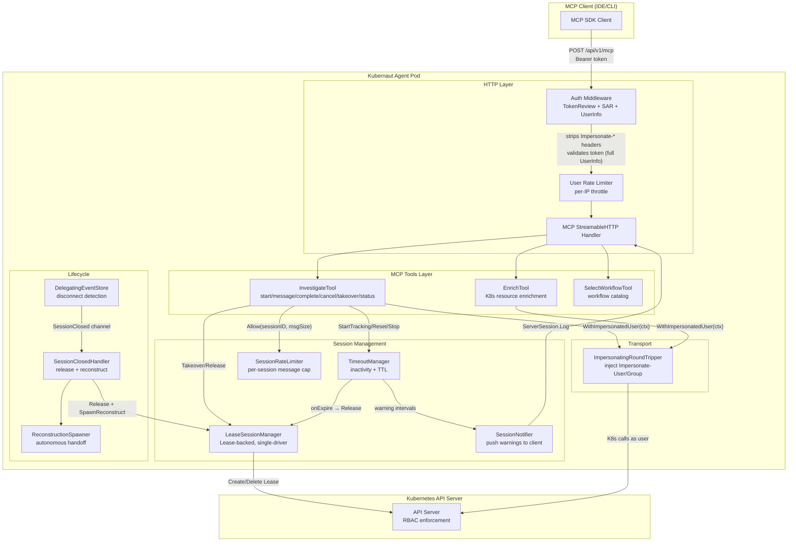
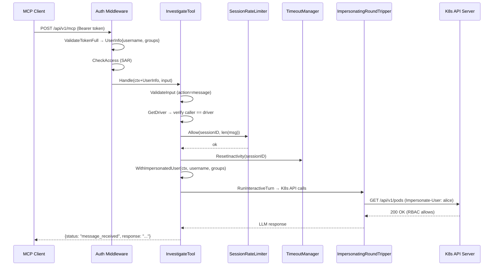
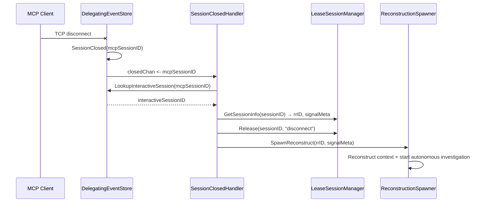

# Interactive Mode Architecture

## Component Diagram

## Request Flow (action=message)

## Disconnect + Reconstruction Flow

## RBAC Model

| Resource | Scope | Verbs | Purpose |
|----------|-------|-------|---------|
| `coordination.k8s.io/leases` | Namespace (Role) | get, create, update, delete | Session ownership tracking |
| `users`, `groups`, `serviceaccounts` | Cluster (ClusterRole) | impersonate | Execute K8s calls as the user |

The Lease RBAC is namespace-scoped (least privilege). Impersonation must be
cluster-wide because users may investigate resources across namespaces.
