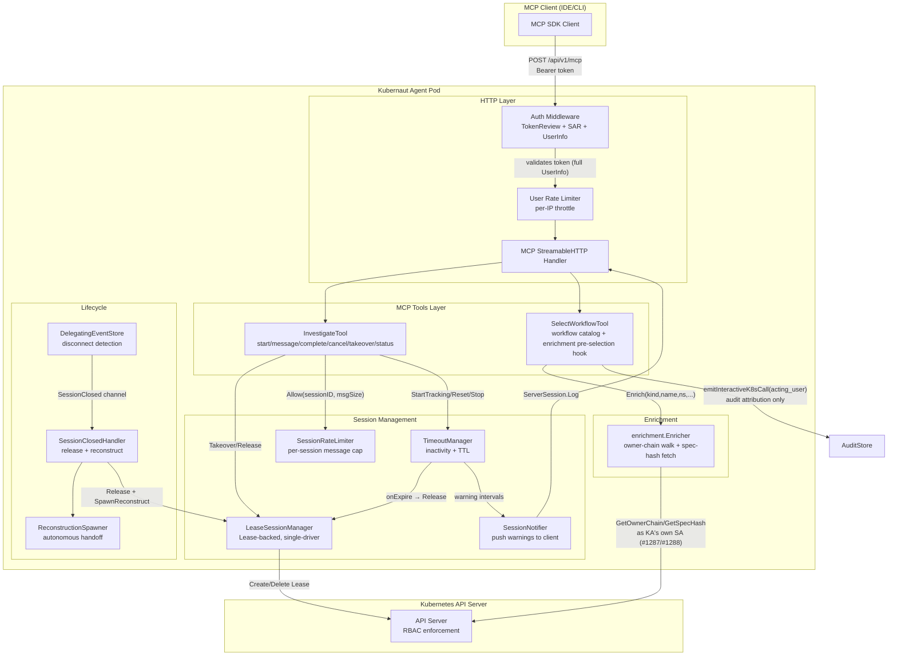
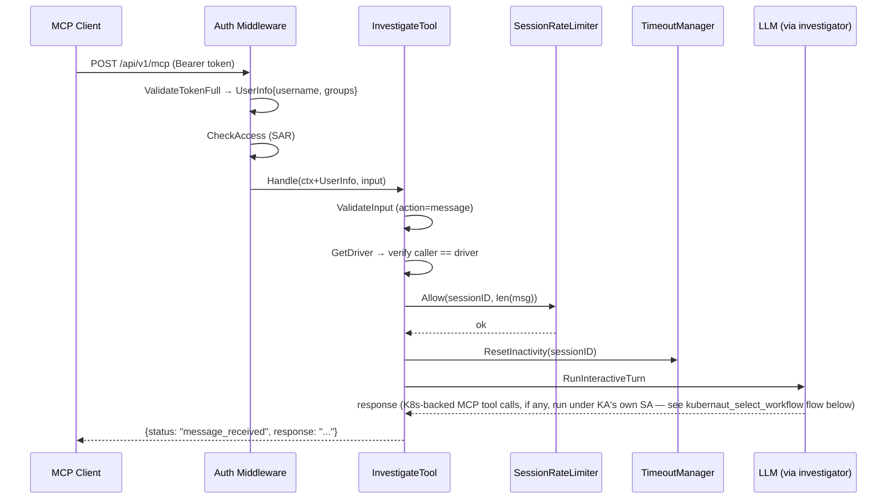
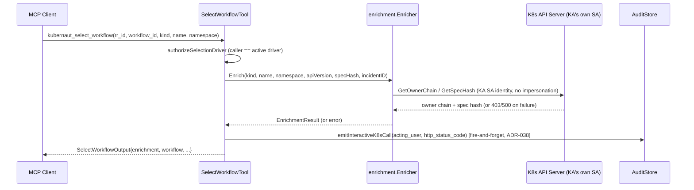
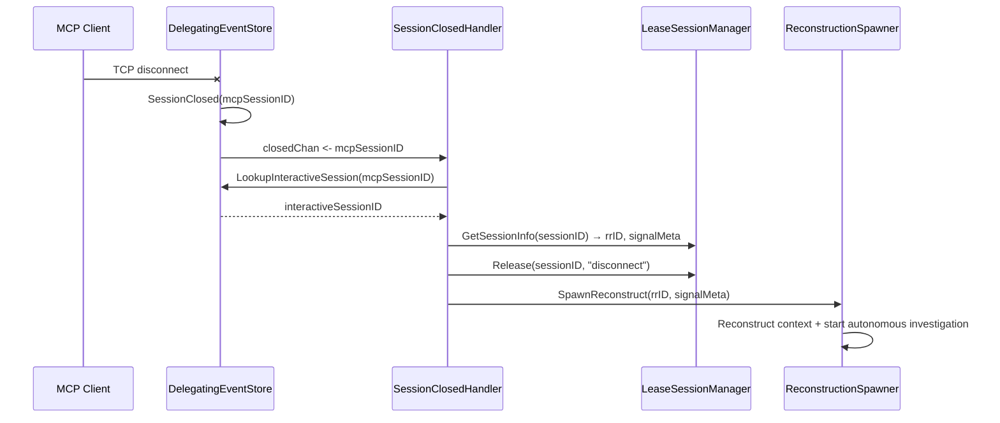

# Interactive Mode Architecture

## Component Diagram

```mermaid
graph TB
    subgraph "MCP Client (IDE/CLI)"
        C[MCP SDK Client]
    end

    subgraph "Kubernaut Agent Pod"
        subgraph "HTTP Layer"
            MW[Auth Middleware<br/>TokenReview + SAR + UserInfo]
            RL[User Rate Limiter<br/>per-IP throttle]
            MH[MCP StreamableHTTP Handler]
        end

        subgraph "MCP Tools Layer"
            IT[InvestigateTool<br/>start/message/complete/cancel/takeover/status]
            SWT[SelectWorkflowTool<br/>workflow catalog + enrichment pre-selection hook]
        end

        subgraph "Enrichment"
            ENR[enrichment.Enricher<br/>owner-chain walk + spec-hash fetch]
        end

        subgraph "Session Management"
            LSM[LeaseSessionManager<br/>Lease-backed, single-driver]
            TM[TimeoutManager<br/>inactivity + TTL]
            SN[SessionNotifier<br/>push warnings to client]
            SRL[SessionRateLimiter<br/>per-session message cap]
        end

        subgraph "Lifecycle"
            DES[DelegatingEventStore<br/>disconnect detection]
            SCH[SessionClosedHandler<br/>release + reconstruct]
            RS[ReconstructionSpawner<br/>autonomous handoff]
        end
    end

    subgraph "Kubernetes API Server"
        K8S[API Server<br/>RBAC enforcement]
    end

    C -->|"POST /api/v1/mcp<br/>Bearer token"| MW
    MW -->|"validates token (full UserInfo)"| RL
    RL --> MH
    MH --> IT
    MH --> SWT

    IT -->|"Takeover/Release"| LSM
    IT -->|"StartTracking/Reset/Stop"| TM
    IT -->|"Allow(sessionID, msgSize)"| SRL

    SWT -->|"Enrich(kind,name,ns,...)"| ENR
    SWT -->|"emitInteractiveK8sCall(acting_user)<br/>audit attribution only"| AUD[AuditStore]

    TM -->|"onExpire → Release"| LSM
    TM -->|"warning intervals"| SN
    SN -->|"ServerSession.Log"| MH

    DES -->|"SessionClosed channel"| SCH
    SCH -->|"Release + SpawnReconstruct"| LSM
    SCH --> RS

    LSM -->|"Create/Delete Lease"| K8S
    ENR -->|"GetOwnerChain/GetSpecHash<br/>as KA's own SA (#1287/#1288)"| K8S
```

> **Trusted intermediary model (#1287/#1288):** KA never impersonates the
> acting user at the K8s API level — every K8s call (Lease management,
> enrichment lookups) executes under KA's own ServiceAccount. `acting_user`
> travels through the MCP tool input/session context and is recorded on the
> `aiagent.interactive.k8s_call` audit event purely for SOC2 CC8.1
> attribution, not for RBAC enforcement. The `ImpersonatingRoundTripper` /
> `Impersonate-User` header design shown in earlier revisions of this
> document was removed as dead code (never wired into `cmd/kubernautagent`)
> once #1287/#1288 landed.

## Request Flow (action=message)

```mermaid
sequenceDiagram
    participant Client as MCP Client
    participant MW as Auth Middleware
    participant IT as InvestigateTool
    participant SRL as SessionRateLimiter
    participant TM as TimeoutManager
    participant LLM as LLM (via investigator)

    Client->>MW: POST /api/v1/mcp (Bearer token)
    MW->>MW: ValidateTokenFull → UserInfo{username, groups}
    MW->>MW: CheckAccess (SAR)
    MW->>IT: Handle(ctx+UserInfo, input)

    IT->>IT: ValidateInput (action=message)
    IT->>IT: GetDriver → verify caller == driver
    IT->>SRL: Allow(sessionID, len(msg))
    SRL-->>IT: ok

    IT->>TM: ResetInactivity(sessionID)
    IT->>LLM: RunInteractiveTurn
    LLM-->>IT: response (K8s-backed MCP tool calls, if any, run under KA's own SA — see kubernaut_select_workflow flow below)

    IT-->>Client: {status: "message_received", response: "..."}
```

## Enrichment K8s Call Flow (kubernaut_select_workflow, BR-INTERACTIVE-003 #3)

```mermaid
sequenceDiagram
    participant Client as MCP Client
    participant SWT as SelectWorkflowTool
    participant ENR as enrichment.Enricher
    participant K8S as K8s API Server (KA's own SA)
    participant AUD as AuditStore

    Client->>SWT: kubernaut_select_workflow(rr_id, workflow_id, kind, name, namespace)
    SWT->>SWT: authorizeSelectionDriver (caller == active driver)
    SWT->>ENR: Enrich(kind, name, namespace, apiVersion, specHash, incidentID)
    ENR->>K8S: GetOwnerChain / GetSpecHash (KA SA identity, no impersonation)
    K8S-->>ENR: owner chain + spec hash (or 403/500 on failure)
    ENR-->>SWT: EnrichmentResult (or error)
    SWT->>AUD: emitInteractiveK8sCall(acting_user, http_status_code) [fire-and-forget, ADR-038]
    SWT-->>Client: SelectWorkflowOutput{enrichment, workflow, ...}
```

## Disconnect + Reconstruction Flow

```mermaid
sequenceDiagram
    participant Client as MCP Client
    participant DES as DelegatingEventStore
    participant SCH as SessionClosedHandler
    participant LSM as LeaseSessionManager
    participant RS as ReconstructionSpawner

    Client-xDES: TCP disconnect
    DES->>DES: SessionClosed(mcpSessionID)
    DES->>SCH: closedChan <- mcpSessionID

    SCH->>DES: LookupInteractiveSession(mcpSessionID)
    DES-->>SCH: interactiveSessionID

    SCH->>LSM: GetSessionInfo(sessionID) → rrID, signalMeta
    SCH->>LSM: Release(sessionID, "disconnect")
    SCH->>RS: SpawnReconstruct(rrID, signalMeta)
    RS->>RS: Reconstruct context + start autonomous investigation
```

## RBAC Model

| Resource | Scope | Verbs | Purpose |
|----------|-------|-------|---------|
| `coordination.k8s.io/leases` | Namespace (Role) | get, create, update, delete | Session ownership tracking |
| Investigation targets (pods, deployments, owners, etc.) | Cluster (ClusterRole) | get, list | Enrichment owner-chain walk + spec-hash fetch, executed under KA's own SA |

The Lease RBAC is namespace-scoped (least privilege). Enrichment RBAC is
cluster-scoped because users may investigate resources across namespaces.

**No impersonation RBAC required.** #1287 (trusted intermediary model) and
#1288 (removal of the impersonate SSAR startup gate and runtime
`WithImpersonatedUser`/`ImpersonatingRoundTripper` mechanism) mean KA's SA
never needs the `impersonate` verb on `users`/`groups`/`serviceaccounts`. The
acting user's identity is carried for audit attribution only
(`aiagent.interactive.k8s_call`'s `acting_user`/`session_id` fields), never
used to scope the K8s API call's authorization.
