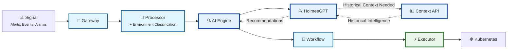
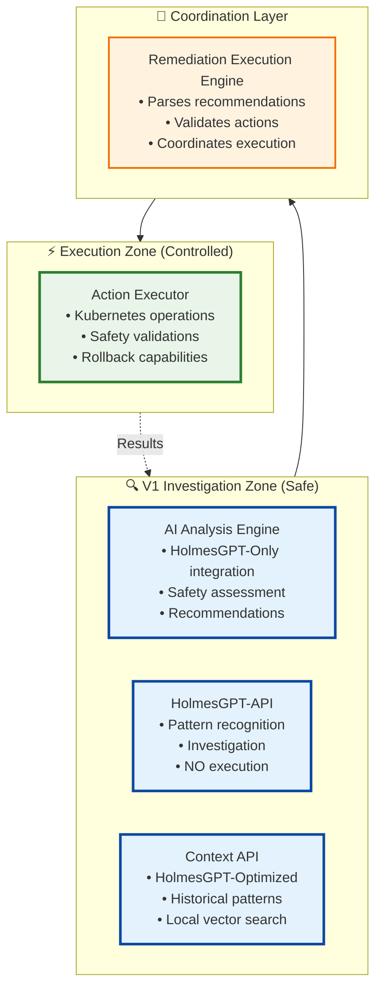
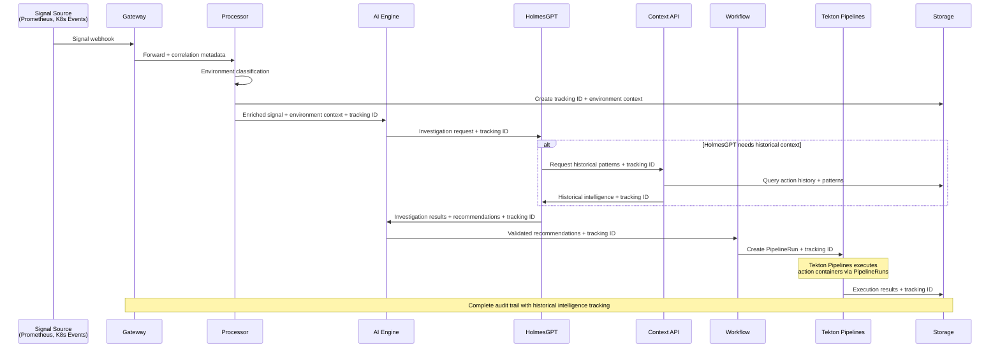
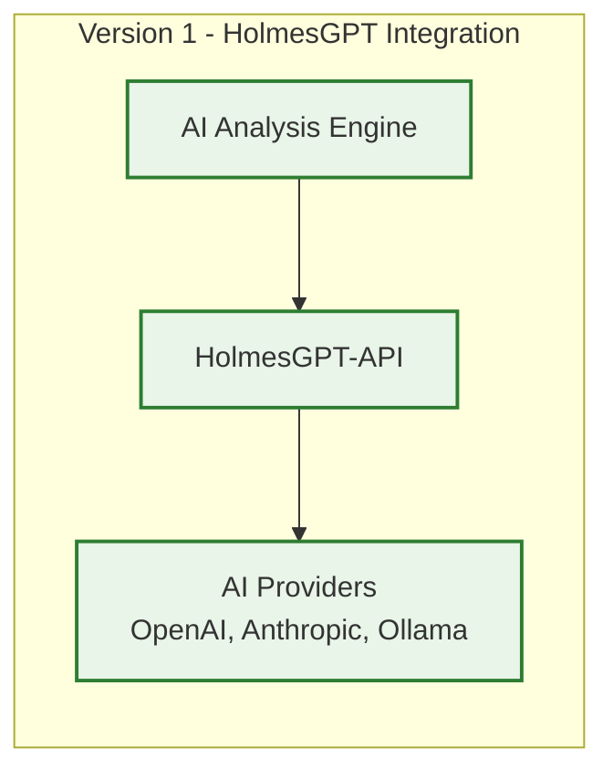
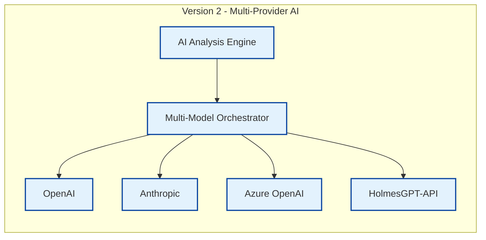

# Kubernaut Architecture Overview

**Document Version**: 3.3
**Date**: December 1, 2025
**Status**: V1.0 Implementation Focus (8 Services - 2 deferred per DD-016, DD-017)

## 📋 Version History

| Version | Date | Changes | Author |
|---------|------|---------|--------|
| 3.3 | Dec 1, 2025 | **DD-016 & DD-017 Integration**: Updated V1.0 service count from 11 to 8. Dynamic Toolset deferred to V2.0 (DD-016). Effectiveness Monitor deferred to V1.1 (DD-017). Updated service categories and V2 enhancement list. | AI Assistant |
| 3.2 | Nov 15, 2025 | Corrected service naming: "Workflow Engine" → "Remediation Execution Engine" (per ADR-035) | AI Assistant |
| 3.1 | Oct 31, 2025 | Updated End-to-End Traceability diagram: Executor → Tekton Pipelines (per ADR-023, ADR-025) | AI Assistant |
| 3.0 | Jan 2025 | V1 Implementation Focus (10 Services) | - |

---

## 🎯 **Executive Summary**

Kubernaut is an intelligent Kubernetes remediation platform built on **V1.0 microservices architecture (8 services)** that separates **AI investigation** from **infrastructure execution** for maximum safety and reliability. Two services deferred: Dynamic Toolset→V2.0 (DD-016), Effectiveness Monitor→V1.1 (DD-017).

### **V1 Implementation Strategy**
- **🚀 Timeline**: 3-4 weeks to production with 95% confidence
- **🎯 Focus**: HolmesGPT-API integration with core safety mechanisms
- **📊 Risk Level**: LOW - Single AI provider integration

**Complete V1 Strategy**: See [Implementation Roadmap](KUBERNAUT_IMPLEMENTATION_ROADMAP.md) for detailed timeline, risk assessment, and implementation phases.

### **Key Principles**
- **🔍 Investigation vs ⚡ Execution Separation**: HolmesGPT investigates, Kubernaut executes
- **📋 Single Responsibility**: Each service has one clear business purpose
- **🔄 Alert Tracking**: End-to-end traceability from alert to resolution
- **🛡️ Safety First**: Comprehensive validation before any infrastructure changes

---

## 🏗️ **High-Level System Architecture**

### **Core System Flow**

```mermaid
flowchart LR
    SIGNAL[📊 Signal<br/><small>Alerts, Events, Alarms</small>] --> GATEWAY[🔗 Gateway]
    GATEWAY --> PROCESSOR[🧠 Processor<br/><small>+ Environment Classification</small>]
    PROCESSOR --> AI[🔍 AI Engine]
    AI --> HGP[🔍 HolmesGPT]
    HGP -.->|Historical Context Needed| CTX[📊 Context API]
    CTX -.->|Historical Intelligence| HGP
    HGP -.->|Recommendations| AI
    AI --> WORKFLOW[🎯 Workflow]
    WORKFLOW --> EXECUTOR[⚡ Executor]
    EXECUTOR --> K8S[☸️ Kubernetes]

    classDef core fill:#e1f5fe,stroke:#01579b,stroke-width:2px
    classDef investigation fill:#e3f2fd,stroke:#0d47a1,stroke-width:3px
    classDef execution fill:#e8f5e8,stroke:#2e7d32,stroke-width:3px

    class GATEWAY,PROCESSOR,WORKFLOW core
    class AI,HGP,CTX investigation
    class EXECUTOR execution
```

### **V1.0 Service Categories (8 Services)**

#### **🎯 Core Processing (3 services)**
- **Gateway Service** (8080): Multi-signal webhook reception (alerts, events, alarms)
- **Remediation Processor** (8081): Signal lifecycle management, enrichment & environment classification
- **Remediation Execution Engine** (8083): Orchestration & coordination

#### **🔍 Investigation Services (3 services)**
- **AI Analysis Engine** (8082): **HolmesGPT-Only** integration (NO direct LLM providers)
- **HolmesGPT-API** (8090): Investigation & analysis service (NO execution)
- **Context API** (8091): **HolmesGPT-Optimized** historical intelligence & patterns

#### **⚡ Execution Services (1 service)**
- **Action Executor** (8084): Kubernetes operations & infrastructure changes ONLY

#### **📊 Support Services (3 services)**
- **Data Storage** (8085): PostgreSQL + Local Vector DB operations
- **Monitoring** (8094): System observability & health checks
- **Notification Controller** (CRD): Multi-channel delivery with CRD persistence 🆕

### **V2 Future Services (5 Additional - Post V1)**
### **V1.1 Services (1 Service)**
- **Effectiveness Monitor** (8080): Performance assessment & continuous improvement (DD-017: Deferred to V1.1)

### **V2.0 Services (5+ Services)**
- **Multi-Model Orchestration** (8092): Ensemble AI decision making
- **Intelligence** (8086): Advanced pattern discovery & analytics
- **Dynamic Toolset** (8087): HolmesGPT toolset configuration (DD-016: Deferred to V2.0)
- **Security & Access Control** (8093): RBAC, authentication & secrets
- **Enhanced Health Monitoring** (8096): LLM health & enterprise monitoring

---

## 🔍 **Investigation vs Execution Separation**

### **Clear Responsibility Boundaries**

```mermaid
flowchart TB
    subgraph INVESTIGATION ["🔍 V1 Investigation Zone (Safe)"]
        AI_ENGINE[AI Analysis Engine<br/>• HolmesGPT-Only integration<br/>• Safety assessment<br/>• Recommendations]
        HOLMES[HolmesGPT-API<br/>• Pattern recognition<br/>• Investigation<br/>• NO execution]
        CONTEXT[Context API<br/>• HolmesGPT-Optimized<br/>• Historical patterns<br/>• Local vector search]
    end

    subgraph EXECUTION ["⚡ Execution Zone (Controlled)"]
        EXECUTOR[Action Executor<br/>• Kubernetes operations<br/>• Safety validations<br/>• Rollback capabilities]
    end

    subgraph COORDINATION ["🎯 Coordination Layer"]
        WORKFLOW[Remediation Execution Engine<br/>• Parses recommendations<br/>• Validates actions<br/>• Coordinates execution]
    end

    INVESTIGATION --> COORDINATION
    COORDINATION --> EXECUTION
    EXECUTION -.->|Results| INVESTIGATION

    classDef investigation fill:#e3f2fd,stroke:#0d47a1,stroke-width:3px
    classDef execution fill:#e8f5e8,stroke:#2e7d32,stroke-width:3px
    classDef coordination fill:#fff3e0,stroke:#ef6c00,stroke-width:2px

    class AI_ENGINE,HOLMES,CONTEXT investigation
    class EXECUTOR execution
    class WORKFLOW coordination
```

### **Safety Guarantees**
- ✅ **Investigation services CANNOT execute infrastructure changes**
- ✅ **Only Action Executor can modify Kubernetes resources**
- ✅ **All actions validated before execution**
- ✅ **Complete audit trail for compliance**

---

## 📊 **Signal Tracking Flow**

### **End-to-End Traceability**

```mermaid
sequenceDiagram
    participant SRC as Signal Source<br/>(Prometheus, K8s Events)
    participant G as Gateway
    participant AP as Processor
    participant AI as AI Engine
    participant HGP as HolmesGPT
    participant CTX as Context API
    participant W as Workflow
    participant TEK as Tekton Pipelines
    participant S as Storage

    SRC->>G: Signal webhook
    G->>AP: Forward + correlation metadata
    AP->>AP: Environment classification
    AP->>S: Create tracking ID + environment context
    AP->>AI: Enriched signal + environment context + tracking ID
    AI->>HGP: Investigation request + tracking ID

    alt HolmesGPT needs historical context
        HGP->>CTX: Request historical patterns + tracking ID
        CTX->>S: Query action history + patterns
        CTX->>HGP: Historical intelligence + tracking ID
    end

    HGP->>AI: Investigation results + recommendations + tracking ID
    AI->>W: Validated recommendations + tracking ID
    W->>TEK: Create PipelineRun + tracking ID
    Note over TEK: Tekton Pipelines executes<br/>action containers via PipelineRuns
    TEK->>S: Execution results + tracking ID

    Note over G,S: Complete audit trail with historical intelligence tracking
```

### **Tracking Benefits**
- **🔍 Complete Visibility**: Track signal from reception to resolution
- **📋 Audit Compliance**: Full correlation for debugging and governance
- **⚡ Performance Monitoring**: Measure end-to-end processing times
- **🎯 Business Intelligence**: Learn from signal patterns and outcomes

---

## 🚀 **Implementation Strategy**

### **Version 1 (Current Focus)**
**Timeline**: 3-4 weeks
**Risk**: LOW - Single integration point

```mermaid
flowchart LR
    subgraph V1 ["Version 1 - HolmesGPT Integration"]
        AI[AI Analysis Engine] --> HOLMES[HolmesGPT-API]
        HOLMES --> PROVIDERS[AI Providers<br/>OpenAI, Anthropic, Ollama]
    end

    classDef v1 fill:#e8f5e8,stroke:#2e7d32,stroke-width:2px
    class AI,HOLMES,PROVIDERS v1
```

**V1 Focus:**
- ✅ HolmesGPT-API integration only
- ✅ Proven execution infrastructure
- ✅ Alert tracking implementation
- ✅ Core safety mechanisms

### **Version 2 (Future Enhancement)**
**Timeline**: 6-8 weeks (after V1)
**Risk**: MEDIUM - Multi-provider complexity

```mermaid
flowchart LR
    subgraph V2 ["Version 2 - Multi-Provider AI"]
        AI[AI Analysis Engine] --> MULTI[Multi-Model Orchestrator]
        MULTI --> P1[OpenAI]
        MULTI --> P2[Anthropic]
        MULTI --> P3[Azure OpenAI]
        MULTI --> HOLMES[HolmesGPT-API]
    end

    classDef v2 fill:#e3f2fd,stroke:#0d47a1,stroke-width:2px
    class AI,MULTI,P1,P2,P3,HOLMES v2
```

**V2 Enhancements:**
- 🔄 Multi-provider AI orchestration
- 📊 Advanced analytics and ML
- 🗄️ External vector databases
- 💰 Cost optimization algorithms

---

## 📋 **Key Performance Targets**

### **Response Time Requirements**
| Component | Target | Business Impact |
|-----------|--------|-----------------|
| **Gateway Service** | <50ms forwarding | 99.9% availability |
| **Signal Processing** | <5s end-to-end | User experience |
| **AI Analysis** | <10s investigation | Decision quality |
| **Action Execution** | <30s completion | MTTR improvement |

### **Scalability Targets**
| Metric | Target | Justification |
|--------|--------|---------------|
| **Concurrent Signals** | 1,000/minute | Peak load handling |
| **System Availability** | 99.9% uptime | Business continuity |
| **Signal Tracking** | 100% coverage | Audit compliance |
| **Execution Success** | >95% rate | Operational reliability |

---

## 🔗 **Related Documentation**

### **Detailed Architecture**
- **[Service Catalog](KUBERNAUT_SERVICE_CATALOG.md)** - Individual service specifications
- **[Integration Patterns](KUBERNAUT_INTEGRATION_PATTERNS.md)** - Data flows and interactions
- **[Implementation Roadmap](KUBERNAUT_IMPLEMENTATION_ROADMAP.md)** - V1/V2 strategy and timelines

### **Business Context**
- **[Business Requirements Overview](../requirements/00_REQUIREMENTS_OVERVIEW.md)** - 1,452 requirements across 11 modules
- **[AI Context Orchestration](AI_CONTEXT_ORCHESTRATION_ARCHITECTURE.md)** - Dynamic context management
- **[HolmesGPT Integration](HOLMESGPT_REST_API_ARCHITECTURE.md)** - Investigation service details

### **Implementation Guides**
- **[APDC Development Methodology](../development/methodology/APDC_FRAMEWORK.md)** - Development process
- **[Testing Framework](../TESTING_FRAMEWORK.md)** - Quality assurance approach
- **[Quick Reference Card](../development/getting-started/QUICK_REFERENCE_CARD.md)** - Developer guidelines

---

## 🎯 **Success Metrics**

### **Business Value Indicators**
- **⚡ 40-60% faster MTTR** through intelligent investigation
- **🛡️ 99.9% system availability** with fault isolation
- **📋 100% audit compliance** with end-to-end tracking
- **💰 20-25% operational cost reduction** through automation

### **Technical Excellence**
- **🔍 85% AI analysis accuracy** for decision quality
- **⚡ >95% action execution success** for reliability
- **📊 <5s signal processing time** for user experience
- **🔄 <10% workflow failure rate** for operational stability

---

*This overview provides a human-readable introduction to Kubernaut's architecture. For detailed specifications, see the related documentation links above.*
