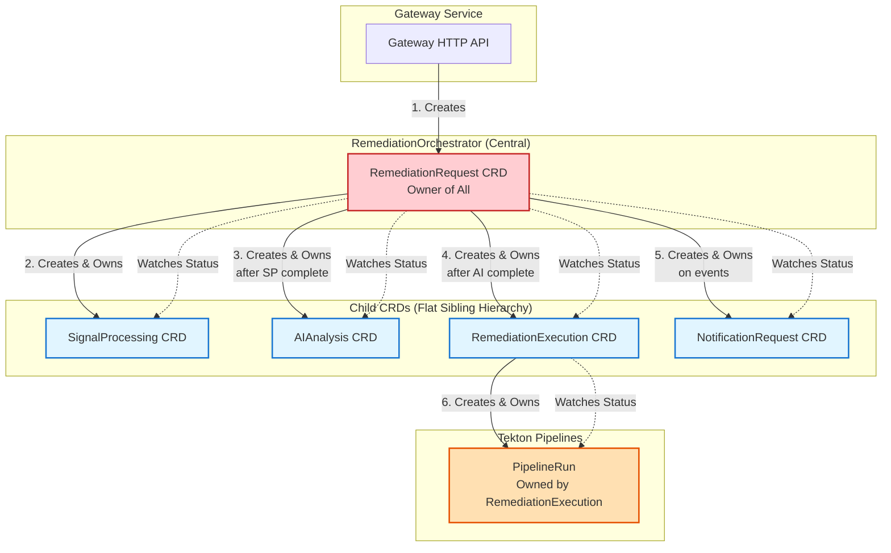
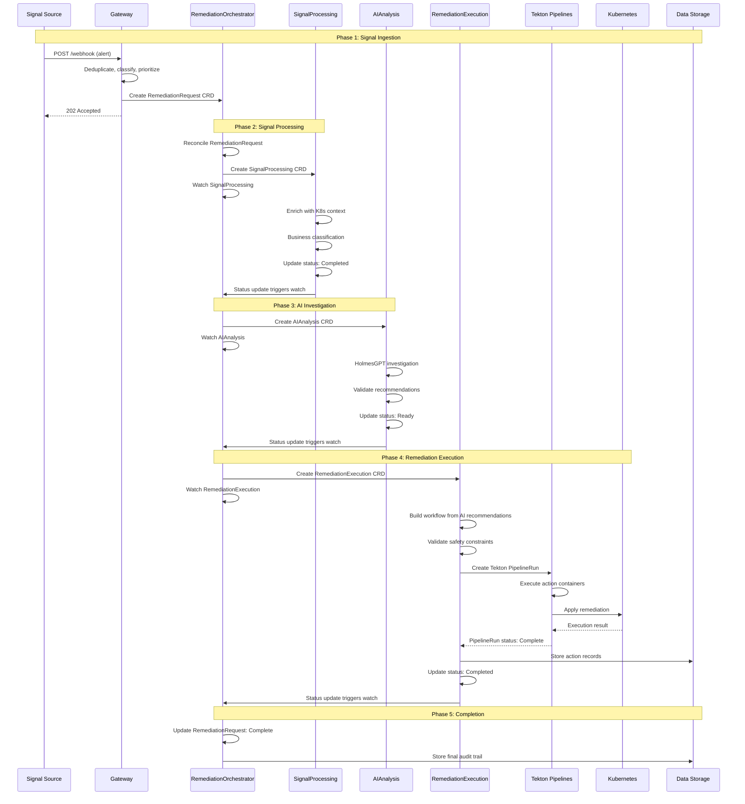

# Kubernaut CRD Architecture

**Version**: 1.3.0
**Date**: February 2026
**Status**: ✅ Authoritative Reference
**V1.0 Services**: 10 (5 CRD + 5 stateless; Dynamic Toolset→V2.0; EM Level 1 in V1.0, Level 2→V1.1 per DD-017 v2.0)
**Supersedes**: [MULTI_CRD_RECONCILIATION_ARCHITECTURE.md](MULTI_CRD_RECONCILIATION_ARCHITECTURE.md) (DEPRECATED)

---

## Document Purpose

This document is the **authoritative reference** for Kubernaut's Custom Resource Definition (CRD) architecture. It defines:

- **Service catalog** (10 V1.0 services: 5 CRD controllers + 5 stateless services; Dynamic Toolset→V2.0; EM Level 1 in V1.0, Level 2→V1.1 per DD-017 v2.0)
- **CRD specifications** for all 4 CRDs
- **Reconciliation patterns** and controller responsibilities
- **Integration flows** between services
- **Execution architecture** using Tekton Pipelines

**Sources**: This document is based on authoritative service specifications, implementation plans, and architectural decision records (ADRs) located in `docs/services/` and `docs/architecture/decisions/`.

---

## Table of Contents

1. [Executive Summary](#executive-summary)
2. [Service Catalog](#service-catalog)
3. [CRD Specifications](#crd-specifications)
4. [Architecture Diagrams](#architecture-diagrams)
5. [Reconciliation Patterns](#reconciliation-patterns)
6. [Integration Flows](#integration-flows)
7. [Code Examples](#code-examples)
8. [Operational Guide](#operational-guide)

---

## Executive Summary

### System Overview

Kubernaut is an AI-powered Kubernetes remediation platform that uses a **microservices + CRD architecture** to enable autonomous incident analysis and automated remediation actions.

**Key Characteristics**:
- **10 V1.0 Services**: 5 CRD controllers + 5 stateless services (Dynamic Toolset→V2.0; EM Level 1 in V1.0, Level 2→V1.1 per DD-017 v2.0)
- **Multi-Signal Processing**: Prometheus alerts, Kubernetes events, CloudWatch, webhooks
- **AI-Powered Analysis**: HolmesGPT integration for root cause analysis
- **Tekton-Based Execution**: Industry-standard CI/CD for remediation workflows
- **29+ Remediation Actions**: Scaling, restarts, rollbacks, node operations, GitOps PRs
- **Open Source**: Apache 2.0 license

---

### 10 V1.0 Services + Tekton Pipelines

Kubernaut's V1.0 architecture consists of:

**CRD Controllers** (5):
1. **RemediationOrchestrator** - Central lifecycle orchestration
2. **SignalProcessing** - Signal enrichment and business classification
3. **AIAnalysis** - HolmesGPT-powered investigation
4. **RemediationExecution** - Remediation Playbook orchestration with Tekton
5. **Notification** - Multi-channel notifications

**Stateless Services** (5):
1. **Gateway** - HTTP ingestion and security
2. **Context API** - Historical intelligence provider
3. **Data Storage** - PostgreSQL + Vector DB persistence
4. **HolmesGPT-API** - AI investigation wrapper
5. **Effectiveness Monitor (Level 1)** - Automated assessment (V1.0, DD-017 v2.0)
~~**Dynamic Toolset**~~ - ⏸️ Deferred to V2.0 (DD-016)
~~**Effectiveness Monitor (Level 2)**~~ - ⏸️ Deferred to V1.1 (DD-017 v2.0 — requires 8+ weeks Level 1 data)

**Execution Engine**:
- **Tekton Pipelines** - DAG orchestration and parallel execution (Tekton Pipelines or upstream Tekton)

**Source**: [APPROVED_MICROSERVICES_ARCHITECTURE.md](APPROVED_MICROSERVICES_ARCHITECTURE.md)

---

### Key Architectural Principles

1. **Central Orchestration**: RemediationOrchestrator creates and watches all child CRDs
2. **Watch-Based Coordination**: Event-driven, not polling (Kubernetes watches)
3. **Sequential CRD Creation**: SignalProcessing → AIAnalysis → RemediationExecution → Tekton PipelineRuns
4. **Owner References**: Automatic cascade deletion via Kubernetes ownership
5. **24-Hour Retention**: CRDs persist for review window, then auto-cleanup
6. **Tekton Integration**: Industry-standard execution engine (not custom jobs)
7. **Data Storage Separation**: Action history in PostgreSQL (90+ days), not CRDs (24 hours)

**Source**: [APPROVED_MICROSERVICES_ARCHITECTURE.md](APPROVED_MICROSERVICES_ARCHITECTURE.md), [ADR-024](decisions/ADR-024-eliminate-actionexecution-layer.md)

---

## Service Catalog

### CRD Controllers

#### 1. RemediationOrchestrator

**Purpose**: End-to-end remediation lifecycle management

**CRD**: `RemediationRequest` (remediationorchestrator.kubernaut.io/v1alpha1)

**Responsibilities**:
- Create RemediationRequest CRD from Gateway input
- Sequential CRD creation (SignalProcessing → AIAnalysis → RemediationExecution)
- Watch-based status aggregation from all child CRDs
- Timeout detection and escalation
- Notification triggering (via NotificationRequest CRD)
- 24-hour retention with finalizer pattern

**Port**: 9090 (metrics), 8080 (health)

**Business Requirements**: BR-AR-001 to BR-AR-067

**Source**: [docs/services/crd-controllers/05-remediationorchestrator/overview.md](../services/crd-controllers/05-remediationorchestrator/overview.md)

---

#### 2. SignalProcessing

**Purpose**: Signal enrichment, business-aware environment classification, and recovery context integration

**CRD**: `SignalProcessing` (signalprocessing.kubernaut.io/v1alpha1)

**Responsibilities**:
- Enrich signals with Kubernetes context (pods, deployments, nodes)
- Perform business-aware environment classification (confidence, priority, SLA)
- Fetch recovery context from Context API (for workflow failures)
- Validate signal completeness
- Update status for RemediationOrchestrator to create AIAnalysis CRD

**Port**: 9090 (metrics), 8080 (health)

**Business Requirements**: BR-SP-001 to BR-SP-062

**Source**: [docs/services/crd-controllers/01-signalprocessing/overview.md](../services/crd-controllers/01-signalprocessing/overview.md)

---

#### 3. AIAnalysis

**Purpose**: HolmesGPT-powered alert investigation and remediation recommendation generation

**CRD**: `AIAnalysis` (aianalysis.kubernaut.io/v1alpha1)

**Responsibilities**:
- Trigger HolmesGPT investigation with enriched contexts
- Perform contextual AI analysis of Kubernetes state
- Identify root cause candidates with supporting evidence
- Generate ranked remediation recommendations
- Create AIApprovalRequest CRD for medium confidence (60-79%)
- Validate AI responses and detect hallucinations

**Port**: 9090 (metrics), 8080 (health)

**Business Requirements**: BR-AI-001 to BR-AI-050

**Source**: [docs/services/crd-controllers/02-aianalysis/overview.md](../services/crd-controllers/02-aianalysis/overview.md)

---

#### 4. RemediationExecution

**Purpose**: Orchestrate multi-step remediation workflows with Tekton Pipelines

**CRD**: `RemediationExecution` (workflowexecution.kubernaut.io/v1alpha1)

**Responsibilities**:
- Plan workflow execution based on AI recommendations
- Validate safety requirements and prerequisites (Rego policies via ConfigMaps)
- **Create Tekton PipelineRuns directly** (no intermediate ActionExecution layer)
- Monitor PipelineRun execution progress
- **Write action records to Data Storage Service** (for pattern monitoring)
- Handle failures with rollback and recovery

**Port**: 9090 (metrics), 8080 (health)

**Business Requirements**: BR-WF-001 to BR-WF-053, BR-ORCHESTRATION-001 to BR-ORCHESTRATION-010

**Source**: [docs/services/crd-controllers/03-workflowexecution/overview.md](../services/crd-controllers/03-workflowexecution/overview.md), [TEKTON_EXECUTION_ARCHITECTURE.md](TEKTON_EXECUTION_ARCHITECTURE.md)

---

#### 5. Notification

**Purpose**: Multi-channel notification delivery

**CRD**: `NotificationRequest` (notification.kubernaut.io/v1alpha1)

**Responsibilities**:
- Deliver multi-channel notifications (Email, Slack, Teams, SMS, webhooks)
- Escalation notifications with comprehensive context
- Sensitive data protection and sanitization
- Channel-specific formatting adapters
- External service action links (GitHub, Grafana, Prometheus, K8s Dashboard)

**Port**: 9090 (metrics), 8080 (health)

**Business Requirements**: BR-NOT-001 to BR-NOT-037

**Source**: [docs/services/crd-controllers/06-notification/overview.md](../services/crd-controllers/06-notification/overview.md)

---

### Stateless Services

#### 1. Gateway Service

**Purpose**: HTTP gateway and security (single entry point)

**Type**: Stateless HTTP API

**Responsibilities**:
- Webhook processing for Prometheus/Grafana alerts
- Authentication and authorization (TokenReviewer)
- Alert deduplication (Redis-based fingerprinting)
- Alert storm detection and escalation
- Environment classification
- Priority assignment (Rego policy)
- Create RemediationRequest CRD

**Port**: 8080 (API/health), 9090 (metrics)

**Business Requirements**: BR-WH-001 to BR-WH-015, BR-GATEWAY-001 to BR-GATEWAY-092

**Source**: [docs/services/stateless/gateway-service/overview.md](../services/stateless/gateway-service/overview.md)

---

#### 2. Context API Service

**Purpose**: Historical intelligence provider

**Type**: Stateless HTTP API (read-only)

**Responsibilities**:
- Provide recovery context for workflow failure analysis
- Historical remediation data queries
- Success rate calculations
- Semantic search through past incidents (vector embeddings)
- Environment-specific patterns and best practices

**Port**: 8080 (API/health), 9090 (metrics)

**Business Requirements**: BR-CTX-001 to BR-CTX-180

**Source**: [docs/services/stateless/context-api/overview.md](../services/stateless/context-api/overview.md)

---

#### 3. Data Storage Service

**Purpose**: Data persistence and vector database management

**Type**: Stateless HTTP API

**Responsibilities**:
- PostgreSQL database operations
- Vector database management (pgvector for semantic search)
- Action history storage and retrieval (90+ day retention)
- Multi-level caching with intelligent eviction
- Embedding generation and quality validation
- CRD audit persistence (before 24-hour CRD deletion)

**Port**: 8080 (API/health), 9090 (metrics)

**Business Requirements**: BR-STOR-001 to BR-STOR-135, BR-VDB-001 to BR-VDB-030

**Source**: [APPROVED_MICROSERVICES_ARCHITECTURE.md](APPROVED_MICROSERVICES_ARCHITECTURE.md)

---

#### 4. HolmesGPT-API Service

**Purpose**: AI investigation wrapper

**Type**: Stateless HTTP API (Python)

**Responsibilities**:
- REST API wrapper for HolmesGPT Python SDK
- Multi-provider LLM integration (OpenAI, Anthropic, local models)
- Dynamic toolset configuration (kubernetes, prometheus, grafana)
- Investigation execution with self-documenting JSON format
- Kubernetes read-only cluster access

**Port**: 8080 (API/health), 9090 (metrics)

**Business Requirements**: BR-HAPI-001 to BR-HAPI-185

**Source**: [docs/services/stateless/holmesgpt-api/overview.md](../services/stateless/holmesgpt-api/overview.md)

---

#### 5. Dynamic Toolset Service

**Purpose**: HolmesGPT toolset configuration management

**Type**: Stateless Controller (Discovery Loop)

**Responsibilities**:
- Automatic Kubernetes service discovery (Prometheus, Grafana, Jaeger, Elasticsearch, custom)
- HolmesGPT toolset generation and ConfigMap updates
- ConfigMap reconciliation and drift protection
- Service health validation
- Discovery loop execution (configurable interval)

**Port**: 8080 (health/ready), 9090 (metrics)

**V1.0 Note**: REST API endpoints disabled per DD-TOOLSET-001. Use `kubectl` for ConfigMap introspection.

**V1.1 Planned**: ToolsetConfig CRD for configuration management (BR-TOOLSET-044)

**Business Requirements**: BR-TOOLSET-001 to BR-TOOLSET-020

**Source**: [docs/services/stateless/dynamic-toolset/](../services/stateless/dynamic-toolset/)

---

#### #### 6. Effectiveness Monitor Service (Level 1 in V1.0)

> **DD-017 v2.0** (February 2026): Level 1 (automated assessment) reinstated to V1.0. Level 2 (AI-powered analysis) deferred to V1.1 — requires 8+ weeks of Level 1 data.
>
> See: `docs/architecture/decisions/DD-017-effectiveness-monitor-v1.1-deferral.md`

**Purpose**: Automated effectiveness assessment (Level 1)

**Type**: Stateless HTTP API

**Responsibilities — Level 1 (V1.0)**:
- Dual spec hash capture (pre/post remediation state)
- Health checks (pod running, OOM errors, latency metrics)
- Metric comparison (pre/post execution)
- Effectiveness scoring
- Side-effect detection (oscillation detection)

**Responsibilities — Level 2 (V1.1, deferred)**:
- HolmesGPT PostExec AI analysis
- Pattern learning across remediation history
- Batch processing for high-value cases
- Long-term effectiveness trend tracking
- Advanced pattern recognition

**Port**: 8080 (API/health), 9090 (metrics)

**Business Requirements**: BR-INS-001, BR-INS-002, BR-INS-005: V1.0 (Level 1). BR-INS-003, BR-INS-004, BR-INS-006 to BR-INS-010: V1.1 (Level 2)

**Source**: [APPROVED_MICROSERVICES_ARCHITECTURE.md](APPROVED_MICROSERVICES_ARCHITECTURE.md)

---

## CRD Specifications

### RemediationRequest (Central Orchestrator)

**API Group**: `remediationorchestrator.kubernaut.io/v1alpha1`

**Purpose**: Central orchestration CRD that coordinates end-to-end remediation workflow

**Ownership**:
- Created by: Gateway Service
- Owns: SignalProcessing, AIAnalysis, RemediationExecution, NotificationRequest

**Lifecycle**:
1. Gateway creates RemediationRequest from incoming signal
2. RemediationOrchestrator watches and creates SignalProcessing CRD
3. RemediationOrchestrator watches SignalProcessing status → creates AIAnalysis CRD
4. RemediationOrchestrator watches AIAnalysis status → creates RemediationExecution CRD
5. RemediationOrchestrator watches RemediationExecution status → updates RemediationRequest status
6. RemediationOrchestrator creates NotificationRequest CRDs for events (failures, timeouts, completions, approval requests)
7. 24-hour retention → Finalizer removed → Cascade deletion

**Key Fields**:
```yaml
spec:
  alertFingerprint: string          # Deduplication key
  signalName: string               # Semantic signal/alert name (Issue #166)
  severity: string                   # critical, warning, info
  environment: string                # prod, staging, dev
  priority: string                   # P0, P1, P2, P3
  namespace: string
  resource:                          # Target resource
    kind: string
    name: string
    namespace: string
  firingTime: timestamp
  deduplication:
    isDuplicate: boolean
    occurrenceCount: integer

status:
  phase: string                      # Pending, Processing, Analyzing, Executing, Completed, Failed
  message: string
  reason: string
  startedAt: timestamp
  completedAt: timestamp
  signalProcessingRef: string        # Child CRD reference
  aiAnalysisRef: string             # Child CRD reference
  workflowExecutionRef: string      # Child CRD reference
  notificationRequestRefs: []string  # Child CRD references
```

**Source**: [docs/services/crd-controllers/05-remediationorchestrator/overview.md](../services/crd-controllers/05-remediationorchestrator/overview.md)

---

### SignalProcessing (Signal Enrichment & Business Classification)

**API Group**: `signalprocessing.kubernaut.io/v1alpha1`

**Purpose**: Signal enrichment and business-aware environment classification

**Ownership**:
- Created by: RemediationOrchestrator
- Owned by: RemediationRequest

**Lifecycle**:
1. RemediationOrchestrator creates SignalProcessing CRD
2. SignalProcessing controller enriches with Kubernetes context (Context Service)
3. SignalProcessing controller fetches recovery context (Context API, if recovery attempt)
4. SignalProcessing controller performs business-aware environment classification
5. SignalProcessing controller updates status to "Completed"
6. RemediationOrchestrator watches status → creates AIAnalysis CRD

**Key Fields**:
```yaml
spec:
  alertData:                         # From RemediationRequest
    signalName: string               # Semantic signal/alert name (Issue #166)
    namespace: string
    resource: object
  isRecoveryAttempt: boolean         # Fetch recovery context?
  failedRemediationRef: string          # Previous workflow (if recovery)

status:
  phase: string                      # Pending, Enriching, Classifying, Completed, Failed
  enrichmentResults:
    kubernetesContext: object        # ~8KB enriched K8s data
    environment: string              # Classified environment
    recoveryContext: object          # Historical failure context (if recovery)
  completedAt: timestamp
```

**Source**: [docs/services/crd-controllers/01-signalprocessing/overview.md](../services/crd-controllers/01-signalprocessing/overview.md)

---

### AIAnalysis (AI Investigation)

**API Group**: `aianalysis.kubernaut.io/v1alpha1`

**Purpose**: HolmesGPT-powered investigation and remediation recommendation

**Ownership**:
- Created by: RemediationOrchestrator
- Owned by: RemediationRequest
- Creates: AIApprovalRequest (if manual approval required)

**Lifecycle**:
1. RemediationOrchestrator creates AIAnalysis CRD (with enrichment data from SignalProcessing)
2. AIAnalysis controller reads enrichment data from spec
3. AIAnalysis controller triggers HolmesGPT investigation
4. AIAnalysis controller validates recommendations
5. AIAnalysis controller evaluates approval policy (Rego)
6. If manual approval required: AIAnalysis controller creates AIApprovalRequest CRD
7. AIAnalysis controller updates status to "Ready" (after approval, if needed)
8. RemediationOrchestrator watches status → creates RemediationExecution CRD

**Key Fields**:
```yaml
spec:
  enrichmentData:                    # From SignalProcessing
    kubernetesContext: object
    environment: string
    recoveryContext: object          # If recovery attempt

status:
  phase: string                      # Pending, Investigating, Analyzing, Approving, Ready, Failed, Rejected
  rootCause: string
  confidence: float                  # 0.0-1.0
  recommendedAction: string
  requiresApproval: boolean
  investigationID: string            # HolmesGPT ID
  tokensUsed: integer
  approvalRequestName: string        # AIApprovalRequest CRD reference
  approvalContext:                   # Rich context for notifications
    reason: string
    confidenceScore: float
    investigationSummary: string
    evidenceCollected: []string
    recommendedActions: []object
    alternativesConsidered: []object
  approvalStatus: string             # Approved, Rejected, Pending
  approvedBy: string
  approvalTime: timestamp
```

**Source**: [docs/services/crd-controllers/02-aianalysis/overview.md](../services/crd-controllers/02-aianalysis/overview.md), [ADR-018](decisions/ADR-018-approval-notification-v1-integration.md)

---

### RemediationExecution (Remediation Playbook Orchestration)

**API Group**: `workflowexecution.kubernaut.io/v1alpha1`

**Purpose**: Multi-step workflow orchestration with Tekton Pipelines

**Ownership**:
- Created by: RemediationOrchestrator
- Owned by: RemediationRequest
- Creates: Tekton PipelineRuns (via Tekton API)

**Lifecycle**:
1. RemediationOrchestrator creates RemediationExecution CRD (with AI recommendations)
2. RemediationExecution controller parses AI recommendations
3. RemediationExecution controller builds dependency graph
4. RemediationExecution controller validates safety constraints (Rego policies)
5. RemediationExecution controller creates Tekton PipelineRun
6. RemediationExecution controller monitors PipelineRun status (via Tekton watch)
7. RemediationExecution controller writes action records to Data Storage Service
8. RemediationExecution controller updates status to "Completed" or "Failed"
9. RemediationOrchestrator watches status → updates RemediationRequest

**Key Fields**:
```yaml
spec:
  workflowType: string               # multi-step-remediation
  reason: string
  steps:                             # From AI recommendations
    - name: string
      actionType: string             # kubernetes/scale_deployment, git/create-pr, etc.
      image: string                  # Cosign-signed image with digest
      inputs: object
      runAfter: []string             # Tekton dependencies
      usesWorkspace: boolean

status:
  phase: string                      # Pending, Executing, Completed, Failed
  pipelineRunRef: string             # Tekton PipelineRun reference
  stepStatuses:
    - name: string
      status: string                 # Pending, Running, Succeeded, Failed
      startTime: timestamp
      completionTime: timestamp
  completedAt: timestamp
```

**Source**: [docs/services/crd-controllers/03-workflowexecution/overview.md](../services/crd-controllers/03-workflowexecution/overview.md), [TEKTON_EXECUTION_ARCHITECTURE.md](TEKTON_EXECUTION_ARCHITECTURE.md), [ADR-024](decisions/ADR-024-eliminate-actionexecution-layer.md)

---

### NotificationRequest (Multi-Channel Notifications)

**API Group**: `notification.kubernaut.io/v1alpha1`

**Purpose**: Multi-channel notification delivery

**Ownership**:
- Created by: RemediationOrchestrator
- Owned by: RemediationRequest

**Lifecycle**:
1. RemediationOrchestrator creates NotificationRequest CRD (for events: failures, timeouts, completions, approval requests)
2. Notification controller reads notification spec
3. Notification controller sanitizes sensitive data
4. Notification controller applies channel-specific formatting
5. Notification controller delivers to configured channels (Email, Slack, Teams, SMS, webhooks)
6. Notification controller updates status to "Sent" or "Failed"

**Key Fields**:
```yaml
spec:
  notificationType: string           # escalation, approval_required, completion, failure
  priority: string                   # P0, P1, P2, P3
  channels:                          # Target channels
    - type: string                   # email, slack, teams, sms, webhook
      config: object
  content:
    title: string
    message: string
    context: object                  # Remediation context
    approvalContext: object          # If approval_required
    actionLinks: []object            # External service links

status:
  phase: string                      # Pending, Sending, Sent, Failed
  deliveryResults:
    - channel: string
      status: string                 # Sent, Failed
      sentAt: timestamp
      error: string
```

**Source**: [docs/services/crd-controllers/06-notification/overview.md](../services/crd-controllers/06-notification/overview.md)

---

## Architecture Diagrams

### System Overview - Layered Architecture

<p align="center">
  
</p>

**📝 To Edit**:
- **Source File**: `docs/architecture/diagrams/kubernaut-layered-architecture.excalidraw`
- **Edit in VSCode**: Install [Excalidraw extension](https://marketplace.visualstudio.com/items?itemName=pomdtr.excalidraw-editor)
- **Edit in Web**: Upload to [excalidraw.com](https://excalidraw.com)
- **After editing**: Export as SVG and save to `kubernaut-layered-architecture.svg`


**Architecture**:
- **Independent Services**: Gateway (top - signal ingestion) and Effectiveness (bottom - continuous learning)
- **Orchestrated Layer**: Remediation Orchestrator (blue bar) coordinates 4 CRD services (SP → AI → WF → NOT)
- **Data Layer**: Data Storage Service (green bar) - sole PostgreSQL connection per ADR-032

---

### CRD Relationship and Creation Flow



**Key Patterns**:
1. **Centralized Creation**: RemediationOrchestrator creates all child CRDs
2. **Sequential Flow**: CRD creation based on previous CRD completion status
3. **Flat Hierarchy**: All service CRDs are siblings (not nested ownership)
4. **Owner References**: All child CRDs owned by RemediationRequest (cascade deletion)
5. **Watch-Based**: Controller watches for status changes, not polling

---

### Signal to Remediation Complete Flow



---

## Service Feature Breakdown

This section provides detailed feature descriptions for all 11 Kubernaut services, aligned with their Business Requirements (BR-*).

---

### CRD Controllers

#### 1. RemediationOrchestrator - Central Lifecycle Management

**Key Features**:

1. **Central Lifecycle Orchestration** (BR-AR-001 to BR-AR-020)
   - End-to-end remediation workflow coordination
   - Single source of truth for remediation state
   - Unified status aggregation across all child CRDs

2. **Sequential CRD Creation** (BR-AR-021 to BR-AR-030)
   - Creates SignalProcessing CRD (signal enrichment)
   - Creates AIAnalysis CRD (after processing completes)
   - Creates RemediationExecution CRD (after AI analysis completes)
   - Creates NotificationRequest CRDs (on events)

3. **Watch-Based Status Aggregation** (BR-AR-031 to BR-AR-040)
   - Monitors all child CRD status changes (sub-second latency)
   - Event-driven reconciliation (not polling)
   - Automatic retry with exponential backoff

4. **Timeout Detection & Escalation** (BR-AR-041 to BR-AR-050)
   - Configurable timeouts per phase (15-30 minutes)
   - Automatic escalation on timeout
   - Graceful failure handling

5. **Notification Triggering** (BR-AR-051 to BR-AR-060)
   - Creates NotificationRequest CRDs for failures, timeouts, completions
   - Approval request notifications (medium confidence 60-79%)
   - Rich context propagation to notification service

6. **24-Hour Retention & Cleanup** (BR-AR-061 to BR-AR-067)
   - Finalizer pattern for graceful cleanup
   - Cascade deletion of all child CRDs (owner references)
   - Audit trail persistence to Data Storage before deletion

**Port**: 9090 (metrics), 8080 (health)

**Source**: [docs/services/crd-controllers/05-remediationorchestrator/overview.md](../services/crd-controllers/05-remediationorchestrator/overview.md)

---

#### 2. SignalProcessing - Signal Processing & Business Classification

**Key Features**:

1. **K8s Context Enrichment** (BR-SP-001 to BR-SP-020)
   - Enriches signals with comprehensive Kubernetes context (~8KB)
   - Queries pods, deployments, nodes, resource quotas
   - Captures current cluster state for AI analysis

2. **Recovery Context Integration** (BR-SP-021 to BR-SP-030)
   - Fetches historical failure context from Context API (for recovery attempts)
   - Provides previous remediation attempts and outcomes
   - Enables AI to learn from past failures (DD-001: Alternative 2)

3. **Business-Aware Environment Classification** (BR-SP-031 to BR-SP-040) - **Rich Metadata**
   - **Purpose**: Sophisticated classification with business context for AI analysis decisions
   - **Method**: Enhanced analysis using enriched K8s context (after enrichment phase completes)
   - **Output**: Structured `EnvironmentClassification` object with:
     - `environment`: Tier classification (`"production"`, `"staging"`, `"development"`)
     - `confidence`: Float64 score (0.0-1.0) indicating classification certainty
     - `businessPriority`: Business priority mapping (`"P0"`, `"P1"`, `"P2"`, `"P3"`)
     - `slaRequirement`: Service-level agreement time (`"5m"`, `"15m"`, `"30m"`)
   - **Use Case**: Provides AI analysis with business context for risk-aware recommendations
   - **Difference from Gateway**: Gateway does quick string lookup; this service adds confidence, priority, and SLA metadata

4. **Alert Validation** (BR-SP-041 to BR-SP-050)
   - Validates signal completeness and readiness for AI analysis
   - Ensures required fields are present
   - Detects malformed or incomplete alerts

5. **Status Updates** (BR-SP-051 to BR-SP-062)
   - Updates status to "Completed" when enrichment finishes
   - Triggers RemediationOrchestrator to create AIAnalysis CRD
   - Provides enriched data for downstream processing

**Port**: 9090 (metrics), 8080 (health)

**Source**: [docs/services/crd-controllers/01-signalprocessing/overview.md](../services/crd-controllers/01-signalprocessing/overview.md)

---

#### 3. AIAnalysis - AI-Powered Investigation

**Key Features**:

1. **HolmesGPT Investigation** (BR-AI-001 to BR-AI-015)
   - Triggers HolmesGPT investigation with enriched contexts
   - Performs contextual AI analysis of Kubernetes state
   - Leverages historical patterns from Context API

2. **Root Cause Analysis** (BR-AI-011 to BR-AI-015)
   - Identifies root cause candidates with supporting evidence
   - Generates confidence scores for each hypothesis (0.0-1.0)
   - Correlates alerts across time windows and resource boundaries

3. **Remediation Recommendations** (BR-AI-006 to BR-AI-010)
   - Generates ranked remediation recommendations
   - Multi-factor ranking (effectiveness probability, risk, complexity)
   - Provides recommendation explanations with supporting evidence

4. **Confidence Scoring** (BR-AI-003, BR-AI-022)
   - Generates confidence scores for analysis results (0.0-1.0)
   - ≥80%: Auto-approve and create RemediationExecution CRD
   - 60-79%: Require manual approval via AIApprovalRequest CRD
   - <60%: Block and escalate to human operator

5. **Approval Remediation** (BR-AI-059 to BR-AI-060)
   - Creates AIApprovalRequest CRD for medium confidence (60-79%)
   - Populates rich approval context for notifications (ADR-018)
   - Tracks operator approval decisions and timing

6. **Hallucination Detection** (BR-AI-021 to BR-AI-024)
   - Validates AI responses for completeness and accuracy
   - Detects and handles AI hallucinations or invalid responses
   - Ensures recommendation safety and feasibility

**Port**: 9090 (metrics), 8080 (health)

**Source**: [docs/services/crd-controllers/02-aianalysis/overview.md](../services/crd-controllers/02-aianalysis/overview.md)

---

#### 4. RemediationExecution - Remediation Playbook Orchestration

**Key Features**:

1. **Tekton PipelineRun Creation** (BR-WF-001 to BR-WF-010)
   - Creates Tekton PipelineRuns directly (no intermediate ActionExecution layer - ADR-024)
   - Builds dependency graph from AI recommendations
   - Parallel or sequential execution based on dependencies

2. **Safety Validation** (BR-WF-015 to BR-WF-020)
   - Validates safety requirements and prerequisites (Rego policies via ConfigMaps)
   - Enforces safety constraints before execution
   - Complexity approval: workflows with >10 steps require manual approval

3. **Dry-Run Capabilities** (BR-WF-021 to BR-WF-030)
   - Supports dry-run mode for testing workflows
   - Validates actions without executing them
   - Provides confidence in workflow safety

4. **Rollback & Recovery** (BR-WF-050 to BR-WF-053)
   - Automatic or manual rollback with state preservation
   - Handles failures with recovery strategies
   - Step-level precondition/postcondition validation (DD-002)

5. **Real-Time Monitoring** (BR-WF-030 to BR-WF-040)
   - Monitors Tekton PipelineRun execution progress
   - Tracks step statuses (Pending, Running, Succeeded, Failed)
   - Real-time execution health monitoring

6. **Action Record Persistence** (BR-WF-041 to BR-WF-049)
   - Writes action records to Data Storage Service
   - Enables pattern monitoring and effectiveness tracking
   - 90+ day retention for historical analysis

**Port**: 9090 (metrics), 8080 (health)

**Source**: [docs/services/crd-controllers/03-workflowexecution/overview.md](../services/crd-controllers/03-workflowexecution/overview.md)

---

#### 5. Notification - Multi-Channel Notifications

**Key Features**:

1. **Multi-Channel Delivery** (BR-NOT-001 to BR-NOT-005)
   - Email notifications with rich formatting
   - Slack integration for team collaboration
   - Webhook integrations for custom channels

2. **Escalation Remediations** (BR-NOT-026 to BR-NOT-037)
   - Comprehensive alert context in escalation notifications
   - AI-generated root cause analysis (BR-NOT-028)
   - Recommended remediations sorted by multi-factor ranking (BR-NOT-030)
   - Actionable next steps (last 5 escalation events + historical summary)
   - Approval notification

3. **Sensitive Data Sanitization** (BR-NOT-034)
   - **CRITICAL SECURITY**: Sanitizes sensitive data before sending notifications
   - Protects secrets, API keys, passwords from exposure
   - Compliant with security best practices

4. **External Service Action Links** (BR-NOT-037)
   - Direct action links to external services (GitHub, Grafana, Prometheus, K8s Dashboard)
   - Authentication and authorization delegated to target services (ADR-014)
   - Simplified UX: users can request permissions if needed

5. **Audit Log Persistence** (BR-NOT-041 to BR-NOT-050)
   - Writes notification audit trails to Data Storage Service
   - Tracks delivery status per channel
   - 90+ day retention for compliance and analysis

**Port**: 9090 (metrics), 8080 (health)

**Source**: [docs/services/crd-controllers/06-notification/overview.md](../services/crd-controllers/06-notification/overview.md)

---

### Stateless Services

#### 6. Gateway Service - HTTP Gateway & Security

**Key Features**:

1. **Signal Ingestion** (BR-GATEWAY-001 to BR-GATEWAY-023)
   - Multi-source webhook processing (Prometheus AlertManager + Kubernetes Events)
   - Adapter-specific endpoints (`/api/v1/signals/prometheus`, `/api/v1/signals/kubernetes-event`)
   - ~70% less code than detection-based architecture (Design B)

2. **Deduplication** (BR-GATEWAY-031 to BR-GATEWAY-040)
   - Redis-based fingerprinting to prevent duplicate RemediationRequest CRDs
   - Reduces downstream load by 40-60%
   - Tracks occurrence count and RemediationRequest references

3. **Storm Detection** (BR-GATEWAY-041 to BR-GATEWAY-050)
   - Hybrid (rate + pattern) detection to aggregate related incidents
   - Aggregates 100 pods crashing → 1 remediation workflow
   - Prevents system overload from alert storms

4. **Priority Assignment** (BR-GATEWAY-061 to BR-GATEWAY-070)
   - Rego policy-based priority assignment (P0, P1, P2, P3)
   - Severity/environment fallback for policy failures
   - Ensures critical production issues get immediate attention

5. **Environment Classification** (BR-GATEWAY-051 to BR-GATEWAY-053) - **Quick Lookup**
   - **Purpose**: Fast environment identification for initial routing and priority assignment (2-3ms with cache)
   - **Method**: Simple 4-tier lookup: namespace labels → ConfigMap override → alert labels → "unknown"
   - **Output**: Simple string value (`"prod"`, `"staging"`, `"dev"`, `"canary"`, etc.)
   - **Use Case**: Immediate routing decisions before CRD creation
   - **Note**: This is a lightweight lookup; SignalProcessing performs richer business classification later

6. **CRD Creation** (BR-GATEWAY-023, BR-GATEWAY-071 to BR-GATEWAY-072)
   - Creates RemediationRequest CRD for RemediationOrchestrator
   - CRD-driven workflow (no direct GitOps integration)
   - CRD creation triggers notification flow

**Port**: 8080 (API/health), 9090 (metrics)

**Source**: [docs/services/stateless/gateway-service/overview.md](../services/stateless/gateway-service/overview.md)

---

#### 7. Context API - Historical Intelligence Provider

**Key Features**:

1. **Historical Intelligence Provider** (BR-CTX-001 to BR-CTX-020)
   - Read-only HTTP API for historical remediation data
   - Provides recovery context for workflow failure analysis
   - Environment-specific patterns and best practices

2. **Recovery Context Queries** (BR-CTX-021 to BR-CTX-040)
   - Fetches previous remediation attempts for failed workflows
   - Provides historical failure context for AI analysis (DD-001: Alternative 2)
   - Enables continuous learning from past failures

3. **Success Rate Calculations** (BR-CTX-041 to BR-CTX-060)
   - Calculates success rates for remediation actions
   - Historical success rate analysis per action type
   - Time-windowed success rate trends

4. **Semantic Search** (BR-CTX-061 to BR-CTX-080)
   - Vector embeddings for semantic search through past incidents
   - pgvector-powered similarity search (<100ms)
   - Context-aware pattern matching

5. **Environment-Specific Patterns** (BR-CTX-081 to BR-CTX-100)
   - Discovers patterns specific to environment tiers (prod, staging, dev)
   - Business criticality-aware recommendations
   - Risk-adjusted remediation strategies

**Port**: 8080 (API/health), 9090 (metrics)

**Source**: [docs/services/stateless/context-api/overview.md](../services/stateless/context-api/overview.md)

---

#### 8. Data Storage Service - Data Persistence & Vector DB

**Key Features**:

1. **PostgreSQL Operations** (BR-STOR-001 to BR-STOR-050)
   - REST API Gateway for PostgreSQL access (ADR-032: sole DB access point)
   - Connection pooling (10-50 connections)
   - ACID transaction support

2. **Vector Database** (BR-VDB-001 to BR-VDB-030)
   - pgvector for semantic search (<100ms)
   - Vector similarity search for historical patterns
   - Embedding indexing and optimization

3. **Action History Storage** (BR-STOR-051 to BR-STOR-080)
   - 90+ day retention for action records
   - Remediation Playbooks execution history and outcomes
   - Pattern monitoring and effectiveness tracking

4. **Multi-Level Caching** (BR-STOR-081 to BR-STOR-100)
   - In-memory cache + Redis + PostgreSQL
   - Intelligent cache eviction strategies
   - Cache hit rate optimization

5. **Embedding Generation** (BR-VDB-011 to BR-VDB-020)
   - Generates embeddings for semantic search
   - Embedding quality validation
   - Batch embedding processing

6. **CRD Audit Persistence** (BR-STOR-101 to BR-STOR-135)
   - Persists CRD audit trails before 24-hour deletion
   - Comprehensive remediation audit history
   - Compliance and forensic analysis support

**Port**: 8080 (API/health), 9090 (metrics)

**Source**: [APPROVED_MICROSERVICES_ARCHITECTURE.md](APPROVED_MICROSERVICES_ARCHITECTURE.md)

---

#### 9. HolmesGPT-API - AI Investigation Wrapper

**Key Features**:

1. **REST API Wrapper** (BR-HAPI-001 to BR-HAPI-030)
   - Python-based REST API wrapper for HolmesGPT SDK
   - Standardized HTTP interface for Go services
   - Async investigation execution

2. **Multi-Provider LLM Integration** (BR-HAPI-031 to BR-HAPI-060)
   - OpenAI, Anthropic, local models support
   - Provider-specific configuration and authentication
   - LLM fallback chains for resilience

3. **Dynamic Toolset Configuration** (BR-HAPI-061 to BR-HAPI-090)
   - Kubernetes, Prometheus, Grafana toolsets
   - Dynamic toolset loading from Dynamic Toolset service
   - Hot-reload capabilities for toolset updates

4. **Investigation Execution** (BR-HAPI-091 to BR-HAPI-120)
   - HolmesGPT investigation orchestration
   - Root cause analysis and remediation recommendations
   - Evidence collection and correlation

5. **Self-Documenting JSON Format** (BR-HAPI-121 to BR-HAPI-150)
   - Ultra-compact JSON format for AI prompts (DD-HOLMESGPT-009)
   - 60-75% token reduction vs verbose formats
   - $1,100/year cost savings, 150ms latency improvement

6. **Kubernetes Read-Only Access** (BR-HAPI-151 to BR-HAPI-185)
   - Read-only cluster access for safe investigation
   - No write permissions to production clusters
   - Audit trail for all K8s API calls

**Port**: 8080 (API/health), 9090 (metrics)

**Source**: [docs/services/stateless/holmesgpt-api/overview.md](../services/stateless/holmesgpt-api/overview.md)

---

#### 10. Dynamic Toolset - Toolset Configuration Management

**Key Features**:

1. **Toolset Discovery** (BR-TOOLSET-001 to BR-TOOLSET-005)
   - Automatic discovery of available toolsets
   - Toolset metadata and capability discovery
   - Toolset dependency resolution

2. **Toolset Registration & Lifecycle** (BR-TOOLSET-006 to BR-TOOLSET-010)
   - Dynamic toolset registration
   - Toolset versioning and lifecycle management
   - Deprecation and migration support

3. **ConfigMap-Based Configuration** (BR-TOOLSET-011 to BR-TOOLSET-015)
   - Kubernetes ConfigMaps for toolset configuration
   - Declarative toolset definitions
   - GitOps-friendly configuration management

4. **Hot-Reload Capabilities** (BR-TOOLSET-016 to BR-TOOLSET-018)
   - Live toolset updates without service restart
   - ConfigMap watch for automatic reload
   - Zero-downtime toolset changes

5. **Toolset Validation** (BR-TOOLSET-019 to BR-TOOLSET-020)
   - Validates toolset configurations
   - Health checking for toolset availability
   - Error handling for misconfigured toolsets

**Port**: 8080 (API/health), 9090 (metrics)

**Source**: [APPROVED_MICROSERVICES_ARCHITECTURE.md](APPROVED_MICROSERVICES_ARCHITECTURE.md)

---

#### ~~11. Effectiveness Monitor~~ - ⏸️ **Deferred to V1.1** (DD-017)

> **⚠️ DEFERRED TO V1.1**: Requires 8+ weeks of remediation data for meaningful assessments

**Key Features** (V1.1):

1. **Effectiveness Assessment** (BR-INS-001)
   - Real-time effectiveness assessment of remediation actions
   - Multi-dimensional analysis (success/failure rate, environmental impact)
   - Confidence levels based on data quality (20-95%)

2. **Side Effect Detection** (BR-INS-005)
   - Detects adverse side effects from actions (e.g., CPU spike after memory fix)
   - Anomaly detection (metric changes > thresholds)
   - 10-minute detection window for early warning

3. **Trend Analysis** (BR-INS-003)
   - Long-term effectiveness trend tracking (90-day rolling window)
   - Identifies improving/declining/stable patterns
   - Historical pattern recognition across remediation history

4. **Metrics Correlation** (BR-INS-002)
   - Correlates actions with environmental improvements (memory, CPU, network)
   - Pre/post execution metric comparisons
   - Health checks (pod running, OOM errors, latency metrics)

5. **Continuous Learning** (BR-INS-010)
   - Selective AI-powered analysis for high-value cases (~18K/year, 0.5% of workflows)
   - Root cause validation ("problem solved" vs "problem masked")
   - Oscillation detection ("fix A caused problem B")

6. **Feedback Loop Integration** (BR-INS-006 to BR-INS-009)
   - Lesson extraction for Context API (for future recommendations)
   - Pattern learning for context-aware effectiveness
   - Enables continuous improvement through feedback loops

**Port**: 8080 (API/health), 9090 (metrics)

**Source**: [docs/services/stateless/effectiveness-monitor/overview.md](../services/stateless/effectiveness-monitor/overview.md)

---

## Reconciliation Patterns

### Watch-Based Coordination

**Pattern**: All CRD controllers use Kubernetes watches for event-driven reconciliation.

**Implementation** (controller-runtime):
```go
func (r *RemediationOrchestratorReconciler) SetupWithManager(mgr ctrl.Manager) error {
    return ctrl.NewControllerManagedBy(mgr).
        For(&remediationv1.RemediationRequest{}).
        Owns(&processingv1.SignalProcessing{}).
        Owns(&aianalysisv1.AIAnalysis{}).
        Owns(&workflowv1.RemediationExecution{}).
        Owns(&notificationv1.NotificationRequest{}).
        Complete(r)
}
```

**Benefits**:
- Sub-second latency for status updates
- No polling overhead
- Built-in retry and reconciliation loops
- Kubernetes-native event handling

**Source**: [05-remediationorchestrator/overview.md](../services/crd-controllers/05-remediationorchestrator/overview.md)

---

### CRD Creation Responsibility (Central Orchestrator)

**Pattern**: RemediationOrchestrator owns ALL child CRD creation.

**What RemediationOrchestrator Creates**:
1. SignalProcessing CRD (signal enrichment)
2. AIAnalysis CRD (after SignalProcessing completes)
3. RemediationExecution CRD (after AIAnalysis completes)
4. NotificationRequest CRDs (on events: failures, timeouts, completions, approval requests)

**What Child Controllers Do NOT Do**:
- ❌ SignalProcessing does NOT create AIAnalysis
- ❌ AIAnalysis does NOT create RemediationExecution
- ❌ RemediationExecution does NOT create NotificationRequest
- ✅ All child controllers update their OWN status only

**Rationale**:
- Single source of truth for CRD lifecycle
- Clear ownership boundaries
- Simplified debugging and audit trail
- Prevents circular dependencies

**Source**: [05-remediationorchestrator/overview.md](../services/crd-controllers/05-remediationorchestrator/overview.md)

---

### Status Aggregation

**Pattern**: RemediationOrchestrator watches all child CRD statuses and aggregates overall remediation state.

**Implementation**:
```go
func (r *RemediationOrchestratorReconciler) Reconcile(ctx context.Context, req ctrl.Request) (ctrl.Result, error) {
    remediation := &remediationv1.RemediationRequest{}
    if err := r.Get(ctx, req.NamespacedName, remediation); err != nil {
        return ctrl.Result{}, client.IgnoreNotFound(err)
    }

    // Watch SignalProcessing status
    if remediation.Status.SignalProcessingRef != "" {
        processing := &processingv1.SignalProcessing{}
        if err := r.Get(ctx, types.NamespacedName{Name: remediation.Status.SignalProcessingRef, Namespace: remediation.Namespace}, processing); err == nil {
            if processing.Status.Phase == "Completed" {
                // Create AIAnalysis CRD
                return r.createAIAnalysis(ctx, remediation, processing)
            }
        }
    }

    // Similar logic for AIAnalysis → RemediationExecution
    // ...

    return ctrl.Result{}, nil
}
```

**Source**: [05-remediationorchestrator/overview.md](../services/crd-controllers/05-remediationorchestrator/overview.md)

---

### Error Handling Philosophy

**Pattern**: Errors are categorized and handled with specific recovery strategies.

**Error Categories**:

1. **Not Found Errors** (CRD deleted externally)
   - Strategy: Ignore and proceed
   - Implementation: `client.IgnoreNotFound(err)`

2. **API Errors** (Kubernetes API temporary failures)
   - Strategy: Exponential backoff retry
   - Implementation: controller-runtime automatic retry

3. **User Errors** (Invalid CRD spec)
   - Strategy: Update status with error, do not retry
   - Implementation: Set status.phase = "Failed", status.reason = error

4. **Watch Loss** (Network interruption)
   - Strategy: controller-runtime automatic reconnection
   - Implementation: No manual handling required

5. **Conflicts** (Optimistic locking failures)
   - Strategy: Retry with fresh object
   - Implementation: `updateStatusWithRetry` pattern

6. **Child Failures** (SignalProcessing, AIAnalysis, RemediationExecution failed)
   - Strategy: Update parent status, create NotificationRequest
   - Implementation: Watch child status, escalate on failure

**Source**: [05-remediationorchestrator/implementation/WORKFLOWEXECUTION_PATTERN_ENHANCEMENTS.md](../services/crd-controllers/05-remediationorchestrator/implementation/WORKFLOWEXECUTION_PATTERN_ENHANCEMENTS.md)

---

## Integration Flows

### 1. Signal Ingestion → Remediation

**Flow**: External signal → Gateway → RemediationRequest CRD → RemediationOrchestrator

**Steps**:
1. Prometheus AlertManager sends webhook to Gateway (`POST /api/v1/signals/prometheus`)
2. Gateway deduplicates (Redis fingerprint check)
3. Gateway classifies environment (namespace labels)
4. Gateway assigns priority (Rego policy)
5. Gateway creates RemediationRequest CRD
6. RemediationOrchestrator watches RemediationRequest
7. RemediationOrchestrator creates SignalProcessing CRD

**Latency**: 30-50ms (Gateway), <1s (RemediationOrchestrator watch trigger)

**Source**: [stateless/gateway-service/overview.md](../services/stateless/gateway-service/overview.md)

---

### 2. AI Investigation (AIAnalysis → HolmesGPT-API → Dynamic Toolset)

**Flow**: AIAnalysis controller → HolmesGPT-API → HolmesGPT SDK → LLM

**Steps**:
1. AIAnalysis controller reads enrichment data from spec
2. AIAnalysis controller calls HolmesGPT-API (`POST /api/v1/investigate`)
3. HolmesGPT-API loads toolset configuration (Dynamic Toolset service)
4. HolmesGPT-API executes investigation (HolmesGPT SDK + LLM)
5. HolmesGPT-API returns investigation results
6. AIAnalysis controller validates recommendations
7. AIAnalysis controller updates status with recommendations

**Latency**: 5-30s (LLM-dependent)

**Source**: [02-aianalysis/overview.md](../services/crd-controllers/02-aianalysis/overview.md), [stateless/holmesgpt-api/overview.md](../services/stateless/holmesgpt-api/overview.md)

---

### 3. Remediation Execution (RemediationExecution → Tekton Pipelines)

**Flow**: RemediationExecution controller → Tekton PipelineRun → Action containers

**Steps**:
1. RemediationExecution controller parses AI recommendations
2. RemediationExecution controller builds dependency graph
3. RemediationExecution controller validates safety constraints (Rego policies via ConfigMaps)
4. RemediationExecution controller creates Tekton PipelineRun
5. Tekton executes action containers (parallel or sequential, based on dependencies)
6. RemediationExecution controller watches PipelineRun status
7. RemediationExecution controller writes action records to Data Storage Service
8. RemediationExecution controller updates status to "Completed" or "Failed"

**Latency**: Varies (action-dependent, typically 15-120 seconds)

**Source**: [03-workflowexecution/overview.md](../services/crd-controllers/03-workflowexecution/overview.md), [TEKTON_EXECUTION_ARCHITECTURE.md](TEKTON_EXECUTION_ARCHITECTURE.md)

---

### 4. Notification Delivery (RemediationOrchestrator → NotificationRequest)

**Flow**: RemediationOrchestrator creates NotificationRequest → Notification controller delivers

**Events that Trigger Notifications**:
- RemediationRequest timeout
- RemediationRequest failure
- RemediationRequest completion
- AIApprovalRequest created (approval required)

**Steps**:
1. RemediationOrchestrator detects event (timeout, failure, completion, approval request)
2. RemediationOrchestrator creates NotificationRequest CRD
3. Notification controller reads NotificationRequest spec
4. Notification controller sanitizes sensitive data
5. Notification controller applies channel-specific formatting
6. Notification controller delivers to configured channels (Email, Slack, Teams, SMS)
7. Notification controller updates status to "Sent" or "Failed"

**Latency**: 1-5 seconds

**Source**: [ADR-017](decisions/ADR-017-notification-crd-creator.md), [ADR-018](decisions/ADR-018-approval-notification-v1-integration.md)

---

### 5. Approval Remediation (AIAnalysis → AIApprovalRequest → NotificationRequest)

**Flow**: AIAnalysis creates AIApprovalRequest → RemediationOrchestrator creates NotificationRequest → Operator approves → AIAnalysis proceeds

**Steps**:
1. AIAnalysis controller evaluates approval policy (Rego)
2. If manual approval required (medium confidence 60-79%): AIAnalysis controller creates AIApprovalRequest CRD
3. AIAnalysis controller updates status with approvalContext (rich context for notifications)
4. RemediationOrchestrator watches AIAnalysis status → detects approval request
5. RemediationOrchestrator creates NotificationRequest CRD (type: approval_required, includes approvalContext)
6. Notification controller delivers approval request to operators
7. Operator approves or rejects (via kubectl, dashboard, or notification button)
8. AIApprovalRequest CRD updated with decision
9. AIAnalysis controller watches AIApprovalRequest → updates status to "Ready" or "Rejected"
10. RemediationOrchestrator watches AIAnalysis status → creates RemediationExecution CRD (if approved) or NotificationRequest CRD (if rejected)

**Latency**: Human-dependent (minutes to hours)

**Source**: [ADR-018](decisions/ADR-018-approval-notification-v1-integration.md), [02-aianalysis/overview.md](../services/crd-controllers/02-aianalysis/overview.md)

---

## Code Examples

### Controller Setup Pattern

**Example**: RemediationOrchestrator controller setup with multi-CRD watches

```go
package controller

import (
    remediationv1 "github.com/jordigilh/kubernaut/api/remediationorchestrator/v1alpha1"
    processingv1 "github.com/jordigilh/kubernaut/api/signalprocessing/v1alpha1"
    aianalysisv1 "github.com/jordigilh/kubernaut/api/aianalysis/v1alpha1"
    workflowv1 "github.com/jordigilh/kubernaut/api/workflowexecution/v1alpha1"
    notificationv1 "github.com/jordigilh/kubernaut/api/notification/v1alpha1"
    ctrl "sigs.k8s.io/controller-runtime"
    "sigs.k8s.io/controller-runtime/pkg/client"
)

// RemediationOrchestratorReconciler reconciles RemediationRequest objects
type RemediationOrchestratorReconciler struct {
    client.Client
    Scheme *runtime.Scheme
}

// SetupWithManager sets up the controller with the Manager
func (r *RemediationOrchestratorReconciler) SetupWithManager(mgr ctrl.Manager) error {
    return ctrl.NewControllerManagedBy(mgr).
        For(&remediationv1.RemediationRequest{}).
        Owns(&processingv1.SignalProcessing{}).
        Owns(&aianalysisv1.AIAnalysis{}).
        Owns(&workflowv1.RemediationExecution{}).
        Owns(&notificationv1.NotificationRequest{}).
        Complete(r)
}
```

**Key Pattern**: `For()` primary CRD, `Owns()` all child CRDs (automatic watch setup)

---

### CRD Creation Example

**Example**: RemediationOrchestrator creates SignalProcessing CRD

```go
package controller

import (
    "context"
    "fmt"

    remediationv1 "github.com/jordigilh/kubernaut/api/remediationorchestrator/v1alpha1"
    processingv1 "github.com/jordigilh/kubernaut/api/signalprocessing/v1alpha1"
    metav1 "k8s.io/apimachinery/pkg/apis/meta/v1"
    ctrl "sigs.k8s.io/controller-runtime"
)

func (r *RemediationOrchestratorReconciler) createSignalProcessing(
    ctx context.Context,
    remediation *remediationv1.RemediationRequest,
) error {
    log := ctrl.LoggerFrom(ctx)

    processing := &processingv1.SignalProcessing{
        ObjectMeta: metav1.ObjectMeta{
            Name:      fmt.Sprintf("%s-processing", remediation.Name),
            Namespace: remediation.Namespace,
            Labels: map[string]string{
                "remediationRequest": remediation.Name,
            },
            OwnerReferences: []metav1.OwnerReference{
                *metav1.NewControllerRef(remediation, remediationv1.GroupVersion.WithKind("RemediationRequest")),
            },
        },
        Spec: processingv1.SignalProcessingSpec{
            AlertData: processingv1.AlertData{
                SignalName: remediation.Spec.SignalName,
                Namespace: remediation.Spec.Namespace,
                Resource:  remediation.Spec.Resource,
            },
            IsRecoveryAttempt: remediation.Spec.IsRecoveryAttempt,
            FailedRemediationRef: remediation.Spec.FailedRemediationRef,
        },
    }

    if err := r.Create(ctx, processing); err != nil {
        log.Error(err, "Failed to create SignalProcessing CRD")
        return err
    }

    log.Info("Created SignalProcessing CRD", "name", processing.Name)

    // Update RemediationRequest status with reference
    remediation.Status.SignalProcessingRef = processing.Name
    remediation.Status.Phase = "Processing"
    if err := r.Status().Update(ctx, remediation); err != nil {
        return err
    }

    return nil
}
```

**Key Pattern**: Owner reference for automatic cascade deletion, status update with child CRD reference

---

### Watch Configuration

**Example**: RemediationOrchestrator watches child CRD status changes

```go
package controller

import (
    "context"

    remediationv1 "github.com/jordigilh/kubernaut/api/remediationorchestrator/v1alpha1"
    processingv1 "github.com/jordigilh/kubernaut/api/signalprocessing/v1alpha1"
    "k8s.io/apimachinery/pkg/types"
    ctrl "sigs.k8s.io/controller-runtime"
    "sigs.k8s.io/controller-runtime/pkg/client"
)

func (r *RemediationOrchestratorReconciler) Reconcile(
    ctx context.Context,
    req ctrl.Request,
) (ctrl.Result, error) {
    log := ctrl.LoggerFrom(ctx)

    remediation := &remediationv1.RemediationRequest{}
    if err := r.Get(ctx, req.NamespacedName, remediation); err != nil {
        return ctrl.Result{}, client.IgnoreNotFound(err)
    }

    // Watch SignalProcessing status
    if remediation.Status.SignalProcessingRef != "" {
        processing := &processingv1.SignalProcessing{}
        processingKey := types.NamespacedName{
            Name:      remediation.Status.SignalProcessingRef,
            Namespace: remediation.Namespace,
        }

        if err := r.Get(ctx, processingKey, processing); err != nil {
            if client.IgnoreNotFound(err) != nil {
                log.Error(err, "Failed to get SignalProcessing")
                return ctrl.Result{}, err
            }
            // SignalProcessing not found (deleted) - handle gracefully
            return ctrl.Result{}, nil
        }

        if processing.Status.Phase == "Completed" {
            // Create AIAnalysis CRD
            return r.createAIAnalysis(ctx, remediation, processing)
        }

        // Still processing - requeue
        return ctrl.Result{RequeueAfter: 5 * time.Second}, nil
    }

    // No SignalProcessing yet - create it
    if remediation.Status.Phase == "Pending" {
        return r.createSignalProcessing(ctx, remediation)
    }

    return ctrl.Result{}, nil
}
```

**Key Pattern**: Fetch child CRD by reference, check status, trigger next action

---

### Status Update with Retry

**Example**: Update status with optimistic locking conflict resolution

```go
package controller

import (
    "context"
    "time"

    remediationv1 "github.com/jordigilh/kubernaut/api/remediationorchestrator/v1alpha1"
    "k8s.io/apimachinery/pkg/api/errors"
    "k8s.io/apimachinery/pkg/types"
    ctrl "sigs.k8s.io/controller-runtime"
    "sigs.k8s.io/controller-runtime/pkg/client"
)

func (r *RemediationOrchestratorReconciler) updateStatusWithRetry(
    ctx context.Context,
    namespacedName types.NamespacedName,
    updateFunc func(*remediationv1.RemediationRequest) error,
) error {
    log := ctrl.LoggerFrom(ctx)

    maxRetries := 3
    for attempt := 0; attempt < maxRetries; attempt++ {
        // Fetch fresh object
        remediation := &remediationv1.RemediationRequest{}
        if err := r.Get(ctx, namespacedName, remediation); err != nil {
            return err
        }

        // Apply update function
        if err := updateFunc(remediation); err != nil {
            return err
        }

        // Attempt status update
        if err := r.Status().Update(ctx, remediation); err != nil {
            if errors.IsConflict(err) && attempt < maxRetries-1 {
                log.Info("Conflict updating status, retrying", "attempt", attempt+1)
                time.Sleep(100 * time.Millisecond * time.Duration(attempt+1))
                continue
            }
            return err
        }

        // Success
        return nil
    }

    return fmt.Errorf("failed to update status after %d retries", maxRetries)
}
```

**Key Pattern**: Fetch fresh object, apply update, retry on conflict

---

## Operational Guide

### RBAC Configuration

Each CRD controller requires:

1. **ServiceAccount** (e.g., `remediation-orchestrator-sa`)
2. **ClusterRole** with permissions for:
   - Own CRD (all verbs)
   - Child CRDs (`create`, `get`, `list`, `watch`, `patch`, `update`, `delete`)
   - Status subresource (`update`)
3. **ClusterRoleBinding** to link ServiceAccount to ClusterRole

**Example**: RemediationOrchestrator RBAC

```yaml
apiVersion: v1
kind: ServiceAccount
metadata:
  name: remediation-orchestrator-sa
  namespace: kubernaut-system
---
apiVersion: rbac.authorization.k8s.io/v1
kind: ClusterRole
metadata:
  name: remediation-orchestrator-role
rules:
# Own CRD
- apiGroups: ["remediationorchestrator.kubernaut.io"]
  resources: ["remediationrequests"]
  verbs: ["get", "list", "watch", "create", "update", "patch", "delete"]
- apiGroups: ["remediationorchestrator.kubernaut.io"]
  resources: ["remediationrequests/status"]
  verbs: ["get", "update", "patch"]

# Child CRDs
- apiGroups: ["signalprocessing.kubernaut.io"]
  resources: ["signalprocessings"]
  verbs: ["get", "list", "watch", "create", "update", "patch", "delete"]
- apiGroups: ["signalprocessing.kubernaut.io"]
  resources: ["signalprocessings/status"]
  verbs: ["get", "update", "patch"]

- apiGroups: ["aianalysis.kubernaut.io"]
  resources: ["aianalyses"]
  verbs: ["get", "list", "watch", "create", "update", "patch", "delete"]
- apiGroups: ["aianalysis.kubernaut.io"]
  resources: ["aianalyses/status"]
  verbs: ["get", "update", "patch"]

- apiGroups: ["workflowexecution.kubernaut.io"]
  resources: ["workflowexecutions"]
  verbs: ["get", "list", "watch", "create", "update", "patch", "delete"]
- apiGroups: ["workflowexecution.kubernaut.io"]
  resources: ["workflowexecutions/status"]
  verbs: ["get", "update", "patch"]

- apiGroups: ["notification.kubernaut.io"]
  resources: ["notificationrequests"]
  verbs: ["get", "list", "watch", "create", "update", "patch", "delete"]
- apiGroups: ["notification.kubernaut.io"]
  resources: ["notificationrequests/status"]
  verbs: ["get", "update", "patch"]

# Tekton Pipelines (for RemediationExecution controller)
- apiGroups: ["tekton.dev"]
  resources: ["pipelineruns", "taskruns"]
  verbs: ["get", "list", "watch", "create", "update", "patch", "delete"]
---
apiVersion: rbac.authorization.k8s.io/v1
kind: ClusterRoleBinding
metadata:
  name: remediation-orchestrator-binding
subjects:
- kind: ServiceAccount
  name: remediation-orchestrator-sa
  namespace: kubernaut-system
roleRef:
  kind: ClusterRole
  name: remediation-orchestrator-role
  apiGroup: rbac.authorization.k8s.io
```

**Source**: [README.md](../../README.md)

---

### ServiceAccount Patterns (Dynamic Creation for Tekton)

**Pattern**: RemediationExecution controller dynamically creates ServiceAccounts for each Tekton PipelineRun.

**Benefits**:
- ✅ **99.9% attack surface reduction** vs pre-creating all SAs
- ✅ **Isolation**: Each PipelineRun has dedicated SA with specific permissions
- ✅ **Automatic Cleanup**: OwnerReferences delete SA when PipelineRun completes

**Implementation** (RemediationExecution controller):

```go
func (r *RemediationExecutionReconciler) createServiceAccountForPipeline(
    ctx context.Context,
    workflow *workflowv1.RemediationExecution,
    pipelineRun *tektonv1.PipelineRun,
) error {
    sa := &corev1.ServiceAccount{
        ObjectMeta: metav1.ObjectMeta{
            Name:      fmt.Sprintf("%s-sa", pipelineRun.Name),
            Namespace: workflow.Namespace,
            OwnerReferences: []metav1.OwnerReference{
                *metav1.NewControllerRef(pipelineRun, tektonv1.SchemeGroupVersion.WithKind("PipelineRun")),
            },
        },
    }

    if err := r.Create(ctx, sa); err != nil {
        return err
    }

    // Create Role with specific permissions
    role := &rbacv1.Role{
        ObjectMeta: metav1.ObjectMeta{
            Name:      fmt.Sprintf("%s-role", pipelineRun.Name),
            Namespace: workflow.Namespace,
            OwnerReferences: []metav1.OwnerReference{
                *metav1.NewControllerRef(pipelineRun, tektonv1.SchemeGroupVersion.WithKind("PipelineRun")),
            },
        },
        Rules: []rbacv1.PolicyRule{
            // Action-specific permissions loaded from action contract
            {
                APIGroups: []string{"apps"},
                Resources: []string{"deployments"},
                Verbs:     []string{"get", "list", "patch"},
            },
        },
    }

    if err := r.Create(ctx, role); err != nil {
        return err
    }

    // Create RoleBinding
    roleBinding := &rbacv1.RoleBinding{
        ObjectMeta: metav1.ObjectMeta{
            Name:      fmt.Sprintf("%s-binding", pipelineRun.Name),
            Namespace: workflow.Namespace,
            OwnerReferences: []metav1.OwnerReference{
                *metav1.NewControllerRef(pipelineRun, tektonv1.SchemeGroupVersion.WithKind("PipelineRun")),
            },
        },
        Subjects: []rbacv1.Subject{
            {
                Kind:      "ServiceAccount",
                Name:      sa.Name,
                Namespace: workflow.Namespace,
            },
        },
        RoleRef: rbacv1.RoleRef{
            APIGroup: "rbac.authorization.k8s.io",
            Kind:     "Role",
            Name:     role.Name,
        },
    }

    return r.Create(ctx, roleBinding)
}
```

**Source**: [ADR-025](decisions/ADR-025-kubernetesexecutor-service-elimination.md), [TEKTON_SA_PATTERN_ANALYSIS.md](analysis/TEKTON_SA_PATTERN_ANALYSIS.md)

---

### Performance Considerations

**CRD Watch Latency**:
- **Target**: <1 second for status update propagation
- **Typical**: 200-500ms in production
- **Optimization**: controller-runtime uses efficient informers with local cache

**Database Query Optimization**:
- **Data Storage Service**: Connection pooling (10-50 connections)
- **Context API**: Multi-tier caching (in-memory + Redis + PostgreSQL)
- **Vector Search**: pgvector indexes for <100ms semantic search

**Tekton PipelineRun Scalability**:
- **Parallel Execution**: Max 5 concurrent TaskRuns per PipelineRun (configurable)
- **Complexity Approval**: Playbooks with >10 total steps require manual approval

**Source**: [ADR-020](decisions/ADR-020-workflow-parallel-execution-limits.md)

---

### Monitoring Patterns

**Prometheus Metrics** (all controllers expose on port 9090):

```yaml
# CRD Reconciliation Metrics
controller_runtime_reconcile_total{controller="remediationorchestrator"}
controller_runtime_reconcile_errors_total{controller="remediationorchestrator"}
controller_runtime_reconcile_time_seconds{controller="remediationorchestrator"}

# CRD Status Metrics
kubernaut_remediationrequest_phase_total{phase="Pending|Processing|Analyzing|Executing|Completed|Failed"}
kubernaut_remediationrequest_duration_seconds{phase="Processing|Analyzing|Executing"}

# Remediation Execution Metrics
kubernaut_workflow_steps_total{workflow_type="multi-step-remediation"}
kubernaut_workflow_success_rate{workflow_type="multi-step-remediation"}
```

**Source**: [APPROVED_MICROSERVICES_ARCHITECTURE.md](APPROVED_MICROSERVICES_ARCHITECTURE.md)

---

## Related Documentation

### Core Architecture

- [APPROVED_MICROSERVICES_ARCHITECTURE.md](APPROVED_MICROSERVICES_ARCHITECTURE.md) - Complete service catalog
- [TEKTON_EXECUTION_ARCHITECTURE.md](TEKTON_EXECUTION_ARCHITECTURE.md) - Execution engine details
- [SERVICE_DEPENDENCY_MAP.md](SERVICE_DEPENDENCY_MAP.md) - Service connectivity matrix

### Architectural Decisions

- [ADR-001: CRD Microservices Architecture](decisions/ADR-001-crd-microservices-architecture.md)
- [ADR-017: Notification CRD Creator](decisions/ADR-017-notification-crd-creator.md)
- [ADR-018: Approval Notification V1 Integration](decisions/ADR-018-approval-notification-v1-integration.md)
- [ADR-023: Tekton from V1](decisions/ADR-023-tekton-from-v1.md)
- [ADR-024: Eliminate ActionExecution Layer](decisions/ADR-024-eliminate-actionexecution-layer.md)
- [ADR-025: KubernetesExecutor Service Elimination](decisions/ADR-025-kubernetesexecutor-service-elimination.md)

### Service Specifications

- [CRD Controllers](../services/crd-controllers/)
  - [01-signalprocessing/overview.md](../services/crd-controllers/01-signalprocessing/overview.md)
  - [02-aianalysis/overview.md](../services/crd-controllers/02-aianalysis/overview.md)
  - [03-workflowexecution/overview.md](../services/crd-controllers/03-workflowexecution/overview.md)
  - [05-remediationorchestrator/overview.md](../services/crd-controllers/05-remediationorchestrator/overview.md)
  - [06-notification/overview.md](../services/crd-controllers/06-notification/overview.md)

- [Stateless Services](../services/stateless/)
  - [gateway-service/overview.md](../services/stateless/gateway-service/overview.md)
  - [context-api/overview.md](../services/stateless/context-api/overview.md)
  - [holmesgpt-api/overview.md](../services/stateless/holmesgpt-api/overview.md)

---

## Changelog

### Version 1.3.0 (2026-02)

**DD-017 v2.0 Integration**: Effectiveness Monitor Level 1 reinstated to V1.0.

**Changes**:
- Effectiveness Monitor Level 1 (automated assessment) in V1.0
- Effectiveness Monitor Level 2 (AI-powered analysis) remains V1.1 (requires 8+ weeks Level 1 data)
- Updated service count: 8→10 V1.0 services (5 CRD + 5 stateless)
- BR-INS-001, BR-INS-002, BR-INS-005: V1.0 (Level 1); BR-INS-003, BR-INS-004, BR-INS-006 to BR-INS-010: V1.1 (Level 2)
- Split EM responsibilities: Level 1 vs Level 2 in service descriptions

**Impact**: DD-017 v2.0 partial reinstatement; architecture consistency across documentation.

### Version 1.2.0 (2025-12-01)

**DD-016 & DD-017 Integration**: Updated V1.0 service count from 11 to 8.

**Changes**:
- Dynamic Toolset deferred to V2.0 (DD-016)
- Effectiveness Monitor deferred to V1.1 (DD-017)
- Updated service count: 11→8 V1.0 services (4 CRD + 4 HTTP)
- Added deferral notices to service descriptions
- Updated "11 Services + Tekton"→"8 V1.0 Services + Tekton"
- Corrected service catalog references throughout document

**Impact**: Service count and catalog consistency across all architecture documentation.

### Version 1.1.0 (2025-11-15)

**Service Naming Corrections**: Corrected service naming throughout document per ADR-035.

**Changes**:
- Replaced "RemediationProcessing" → "SignalProcessing" (CRD controller #2)
- Replaced "WorkflowExecution" → "RemediationExecution" (CRD controller #4)
- Updated all CRD specifications, code examples, and diagrams
- Aligned terminology with authoritative ADR-035
- Created NAMING_CONVENTION_REMEDIATION_EXECUTION.md reference document

**Impact**: Documentation consistency, no code changes required.
### Version 1.0.0 (2025-10-20)

**Initial Release**: Authoritative CRD architecture document based on service specifications, implementation plans, and ADRs.

**Key Content**:
- 11 services (5 CRD controllers + 6 stateless services) → **Updated to 8 V1.0 services in v1.2.0 (DD-016, DD-017)**
- 4 CRD specifications with detailed schemas
- Central orchestration pattern (RemediationOrchestrator)
- Tekton Pipelines integration
- Watch-based coordination patterns
- Code examples and operational guide

**Sources**:
- Service specifications: `docs/services/crd-controllers/*/overview.md`
- Implementation plans: `docs/services/crd-controllers/*/implementation/IMPLEMENTATION_PLAN_*.md`
- Architecture documents: `docs/architecture/APPROVED_MICROSERVICES_ARCHITECTURE.md`, `docs/architecture/TEKTON_EXECUTION_ARCHITECTURE.md`
- Architectural decisions: `docs/architecture/decisions/ADR-*.md`

---

**Document Status**: ✅ Authoritative Reference
**Maintainer**: Kubernaut Architecture Team
**Last Updated**: February 2026
**Version**: 1.3.0


