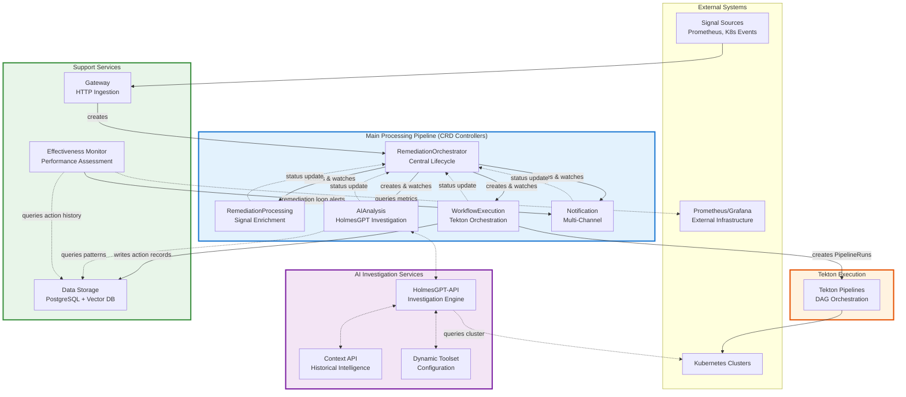
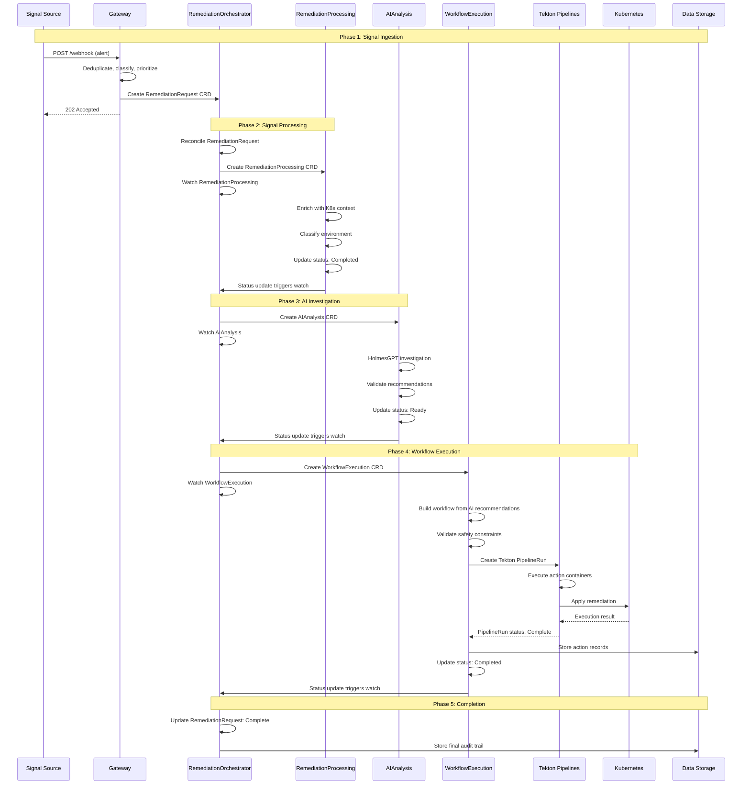

# Kubernaut CRD Architecture

**Version**: 1.0.0
**Date**: October 20, 2025
**Status**: ✅ Authoritative Reference
**Supersedes**: [MULTI_CRD_RECONCILIATION_ARCHITECTURE.md](MULTI_CRD_RECONCILIATION_ARCHITECTURE.md) (DEPRECATED)

---

## Document Purpose

This document is the **authoritative reference** for Kubernaut's Custom Resource Definition (CRD) architecture. It defines:

- **Service catalog** (11 services: 5 CRD controllers + 6 stateless services)
- **CRD specifications** for all 5 CRDs
- **Reconciliation patterns** and controller responsibilities
- **Integration flows** between services
- **Execution architecture** using Tekton Pipelines

**Sources**: This document is based on authoritative service specifications, implementation plans, and architectural decision records (ADRs) located in `docs/services/` and `docs/architecture/decisions/`.

---

## Table of Contents

1. [Executive Summary](#executive-summary)
2. [Service Catalog](#service-catalog)
3. [CRD Specifications](#crd-specifications)
4. [Architecture Diagrams](#architecture-diagrams)
5. [Reconciliation Patterns](#reconciliation-patterns)
6. [Integration Flows](#integration-flows)
7. [Code Examples](#code-examples)
8. [Operational Guide](#operational-guide)

---

## Executive Summary

### System Overview

Kubernaut is an AI-powered Kubernetes remediation platform that uses a **microservices + CRD architecture** to enable autonomous incident analysis and automated remediation actions.

**Key Characteristics**:
- **11 Services**: 5 CRD controllers + 6 stateless services
- **Multi-Signal Processing**: Prometheus alerts, Kubernetes events, CloudWatch, webhooks
- **AI-Powered Analysis**: HolmesGPT integration for root cause analysis
- **Tekton-Based Execution**: Industry-standard CI/CD for remediation workflows
- **29+ Remediation Actions**: Scaling, restarts, rollbacks, node operations, GitOps PRs
- **Open Source**: Apache 2.0 license

---

### 11 Services + Tekton Pipelines

Kubernaut's architecture consists of:

**CRD Controllers** (5):
1. **RemediationOrchestrator** - Central lifecycle orchestration
2. **RemediationProcessing** - Signal enrichment and classification
3. **AIAnalysis** - HolmesGPT-powered investigation
4. **WorkflowExecution** - Workflow orchestration with Tekton
5. **Notification** - Multi-channel notifications

**Stateless Services** (6):
1. **Gateway** - HTTP ingestion and security
2. **Context API** - Historical intelligence provider
3. **Data Storage** - PostgreSQL + Vector DB persistence
4. **HolmesGPT-API** - AI investigation wrapper
5. **Dynamic Toolset** - HolmesGPT toolset configuration
6. **Effectiveness Monitor** - Performance assessment

**Execution Engine**:
- **Tekton Pipelines** - DAG orchestration and parallel execution (Tekton Pipelines or upstream Tekton)

**Source**: [APPROVED_MICROSERVICES_ARCHITECTURE.md](APPROVED_MICROSERVICES_ARCHITECTURE.md)

---

### Key Architectural Principles

1. **Central Orchestration**: RemediationOrchestrator creates and watches all child CRDs
2. **Watch-Based Coordination**: Event-driven, not polling (Kubernetes watches)
3. **Sequential CRD Creation**: RemediationProcessing → AIAnalysis → WorkflowExecution → Tekton PipelineRuns
4. **Owner References**: Automatic cascade deletion via Kubernetes ownership
5. **24-Hour Retention**: CRDs persist for review window, then auto-cleanup
6. **Tekton Integration**: Industry-standard execution engine (not custom jobs)
7. **Data Storage Separation**: Action history in PostgreSQL (90+ days), not CRDs (24 hours)

**Source**: [APPROVED_MICROSERVICES_ARCHITECTURE.md](APPROVED_MICROSERVICES_ARCHITECTURE.md), [ADR-024](decisions/ADR-024-eliminate-actionexecution-layer.md)

---

## Service Catalog

### CRD Controllers

#### 1. RemediationOrchestrator

**Purpose**: End-to-end remediation lifecycle management

**CRD**: `RemediationRequest` (remediationorchestrator.kubernaut.io/v1alpha1)

**Responsibilities**:
- Create RemediationRequest CRD from Gateway input
- Sequential CRD creation (RemediationProcessing → AIAnalysis → WorkflowExecution)
- Watch-based status aggregation from all child CRDs
- Timeout detection and escalation
- Notification triggering (via NotificationRequest CRD)
- 24-hour retention with finalizer pattern

**Port**: 9090 (metrics), 8080 (health)

**Business Requirements**: BR-AR-001 to BR-AR-067

**Source**: [docs/services/crd-controllers/05-remediationorchestrator/overview.md](../services/crd-controllers/05-remediationorchestrator/overview.md)

---

#### 2. RemediationProcessing

**Purpose**: Signal enrichment, environment classification, and recovery context integration

**CRD**: `RemediationProcessing` (remediationprocessing.kubernaut.io/v1alpha1)

**Responsibilities**:
- Enrich signals with Kubernetes context (pods, deployments, nodes)
- Classify environment tier (production, staging, development)
- Fetch recovery context from Context API (for workflow failures)
- Validate signal completeness
- Update status for RemediationOrchestrator to create AIAnalysis CRD

**Port**: 9090 (metrics), 8080 (health)

**Business Requirements**: BR-AP-001 to BR-AP-062

**Source**: [docs/services/crd-controllers/01-remediationprocessor/overview.md](../services/crd-controllers/01-remediationprocessor/overview.md)

---

#### 3. AIAnalysis

**Purpose**: HolmesGPT-powered alert investigation and remediation recommendation generation

**CRD**: `AIAnalysis` (aianalysis.kubernaut.io/v1alpha1)

**Responsibilities**:
- Trigger HolmesGPT investigation with enriched contexts
- Perform contextual AI analysis of Kubernetes state
- Identify root cause candidates with supporting evidence
- Generate ranked remediation recommendations
- Create AIApprovalRequest CRD for medium confidence (60-79%)
- Validate AI responses and detect hallucinations

**Port**: 9090 (metrics), 8080 (health)

**Business Requirements**: BR-AI-001 to BR-AI-050

**Source**: [docs/services/crd-controllers/02-aianalysis/overview.md](../services/crd-controllers/02-aianalysis/overview.md)

---

#### 4. WorkflowExecution

**Purpose**: Orchestrate multi-step remediation workflows with Tekton Pipelines

**CRD**: `WorkflowExecution` (workflowexecution.kubernaut.io/v1alpha1)

**Responsibilities**:
- Plan workflow execution based on AI recommendations
- Validate safety requirements and prerequisites (Rego policies via ConfigMaps)
- **Create Tekton PipelineRuns directly** (no intermediate ActionExecution layer)
- Monitor PipelineRun execution progress
- **Write action records to Data Storage Service** (for pattern monitoring)
- Handle failures with rollback and recovery

**Port**: 9090 (metrics), 8080 (health)

**Business Requirements**: BR-WF-001 to BR-WF-053, BR-ORCHESTRATION-001 to BR-ORCHESTRATION-010

**Source**: [docs/services/crd-controllers/03-workflowexecution/overview.md](../services/crd-controllers/03-workflowexecution/overview.md), [TEKTON_EXECUTION_ARCHITECTURE.md](TEKTON_EXECUTION_ARCHITECTURE.md)

---

#### 5. Notification

**Purpose**: Multi-channel notification delivery

**CRD**: `NotificationRequest` (notification.kubernaut.io/v1alpha1)

**Responsibilities**:
- Deliver multi-channel notifications (Email, Slack, Teams, SMS, webhooks)
- Escalation notifications with comprehensive context
- Sensitive data protection and sanitization
- Channel-specific formatting adapters
- External service action links (GitHub, Grafana, Prometheus, K8s Dashboard)

**Port**: 9090 (metrics), 8080 (health)

**Business Requirements**: BR-NOT-001 to BR-NOT-037

**Source**: [docs/services/crd-controllers/06-notification/overview.md](../services/crd-controllers/06-notification/overview.md)

---

### Stateless Services

#### 1. Gateway Service

**Purpose**: HTTP gateway and security (single entry point)

**Type**: Stateless HTTP API

**Responsibilities**:
- Webhook processing for Prometheus/Grafana alerts
- Authentication and authorization (TokenReviewer)
- Alert deduplication (Redis-based fingerprinting)
- Alert storm detection and escalation
- Environment classification
- Priority assignment (Rego policy)
- Create RemediationRequest CRD

**Port**: 8080 (API/health), 9090 (metrics)

**Business Requirements**: BR-WH-001 to BR-WH-015, BR-GATEWAY-001 to BR-GATEWAY-092

**Source**: [docs/services/stateless/gateway-service/overview.md](../services/stateless/gateway-service/overview.md)

---

#### 2. Context API Service

**Purpose**: Historical intelligence provider

**Type**: Stateless HTTP API (read-only)

**Responsibilities**:
- Provide recovery context for workflow failure analysis
- Historical remediation data queries
- Success rate calculations
- Semantic search through past incidents (vector embeddings)
- Environment-specific patterns and best practices

**Port**: 8080 (API/health), 9090 (metrics)

**Business Requirements**: BR-CTX-001 to BR-CTX-180

**Source**: [docs/services/stateless/context-api/overview.md](../services/stateless/context-api/overview.md)

---

#### 3. Data Storage Service

**Purpose**: Data persistence and vector database management

**Type**: Stateless HTTP API

**Responsibilities**:
- PostgreSQL database operations
- Vector database management (pgvector for semantic search)
- Action history storage and retrieval (90+ day retention)
- Multi-level caching with intelligent eviction
- Embedding generation and quality validation
- CRD audit persistence (before 24-hour CRD deletion)

**Port**: 8080 (API/health), 9090 (metrics)

**Business Requirements**: BR-STOR-001 to BR-STOR-135, BR-VDB-001 to BR-VDB-030

**Source**: [APPROVED_MICROSERVICES_ARCHITECTURE.md](APPROVED_MICROSERVICES_ARCHITECTURE.md)

---

#### 4. HolmesGPT-API Service

**Purpose**: AI investigation wrapper

**Type**: Stateless HTTP API (Python)

**Responsibilities**:
- REST API wrapper for HolmesGPT Python SDK
- Multi-provider LLM integration (OpenAI, Anthropic, local models)
- Dynamic toolset configuration (kubernetes, prometheus, grafana)
- Investigation execution with self-documenting JSON format
- Kubernetes read-only cluster access

**Port**: 8080 (API/health), 9090 (metrics)

**Business Requirements**: BR-HAPI-001 to BR-HAPI-185

**Source**: [docs/services/stateless/holmesgpt-api/overview.md](../services/stateless/holmesgpt-api/overview.md)

---

#### 5. Dynamic Toolset Service

**Purpose**: HolmesGPT toolset configuration management

**Type**: Stateless HTTP API

**Responsibilities**:
- Dynamic toolset discovery and configuration
- Toolset registration and lifecycle management
- ConfigMap-based toolset configuration
- Hot-reload capabilities for toolset updates
- Toolset validation and health checking

**Port**: 8080 (API/health), 9090 (metrics)

**Business Requirements**: BR-TOOLSET-001 to BR-TOOLSET-020

**Source**: [APPROVED_MICROSERVICES_ARCHITECTURE.md](APPROVED_MICROSERVICES_ARCHITECTURE.md)

---

#### 6. Effectiveness Monitor Service

**Purpose**: Performance assessment and oscillation detection

**Type**: Stateless HTTP API

**Responsibilities**:
- Real-time effectiveness assessment
- Long-term effectiveness trend tracking
- Advanced pattern recognition across remediation history
- Oscillation detection (prevents remediation loops)
- Side effect detection and monitoring

**Port**: 8080 (API/health), 9090 (metrics)

**Business Requirements**: BR-INS-001 to BR-INS-010

**Source**: [APPROVED_MICROSERVICES_ARCHITECTURE.md](APPROVED_MICROSERVICES_ARCHITECTURE.md)

---

## CRD Specifications

### RemediationRequest (Central Orchestrator)

**API Group**: `remediationorchestrator.kubernaut.io/v1alpha1`

**Purpose**: Central orchestration CRD that coordinates end-to-end remediation workflow

**Ownership**: 
- Created by: Gateway Service
- Owns: RemediationProcessing, AIAnalysis, WorkflowExecution, NotificationRequest

**Lifecycle**:
1. Gateway creates RemediationRequest from incoming signal
2. RemediationOrchestrator watches and creates RemediationProcessing CRD
3. RemediationOrchestrator watches RemediationProcessing status → creates AIAnalysis CRD
4. RemediationOrchestrator watches AIAnalysis status → creates WorkflowExecution CRD
5. RemediationOrchestrator watches WorkflowExecution status → updates RemediationRequest status
6. RemediationOrchestrator creates NotificationRequest CRDs for events (failures, timeouts, completions, approval requests)
7. 24-hour retention → Finalizer removed → Cascade deletion

**Key Fields**:
```yaml
spec:
  alertFingerprint: string          # Deduplication key
  alertName: string
  severity: string                   # critical, warning, info
  environment: string                # prod, staging, dev
  priority: string                   # P0, P1, P2, P3
  namespace: string
  resource:                          # Target resource
    kind: string
    name: string
    namespace: string
  firingTime: timestamp
  deduplication:
    isDuplicate: boolean
    occurrenceCount: integer

status:
  phase: string                      # Pending, Processing, Analyzing, Executing, Completed, Failed
  message: string
  reason: string
  startedAt: timestamp
  completedAt: timestamp
  remediationProcessingRef: string   # Child CRD reference
  aiAnalysisRef: string             # Child CRD reference
  workflowExecutionRef: string      # Child CRD reference
  notificationRequestRefs: []string  # Child CRD references
```

**Source**: [docs/services/crd-controllers/05-remediationorchestrator/overview.md](../services/crd-controllers/05-remediationorchestrator/overview.md)

---

### RemediationProcessing (Signal Processing)

**API Group**: `remediationprocessing.kubernaut.io/v1alpha1`

**Purpose**: Signal enrichment and environment classification

**Ownership**:
- Created by: RemediationOrchestrator
- Owned by: RemediationRequest

**Lifecycle**:
1. RemediationOrchestrator creates RemediationProcessing CRD
2. RemediationProcessing controller enriches with Kubernetes context (Context Service)
3. RemediationProcessing controller fetches recovery context (Context API, if recovery attempt)
4. RemediationProcessing controller classifies environment
5. RemediationProcessing controller updates status to "Completed"
6. RemediationOrchestrator watches status → creates AIAnalysis CRD

**Key Fields**:
```yaml
spec:
  alertData:                         # From RemediationRequest
    alertName: string
    namespace: string
    resource: object
  isRecoveryAttempt: boolean         # Fetch recovery context?
  failedWorkflowRef: string          # Previous workflow (if recovery)

status:
  phase: string                      # Pending, Enriching, Classifying, Completed, Failed
  enrichmentResults:
    kubernetesContext: object        # ~8KB enriched K8s data
    environment: string              # Classified environment
    recoveryContext: object          # Historical failure context (if recovery)
  completedAt: timestamp
```

**Source**: [docs/services/crd-controllers/01-remediationprocessor/overview.md](../services/crd-controllers/01-remediationprocessor/overview.md)

---

### AIAnalysis (AI Investigation)

**API Group**: `aianalysis.kubernaut.io/v1alpha1`

**Purpose**: HolmesGPT-powered investigation and remediation recommendation

**Ownership**:
- Created by: RemediationOrchestrator
- Owned by: RemediationRequest
- Creates: AIApprovalRequest (if manual approval required)

**Lifecycle**:
1. RemediationOrchestrator creates AIAnalysis CRD (with enrichment data from RemediationProcessing)
2. AIAnalysis controller reads enrichment data from spec
3. AIAnalysis controller triggers HolmesGPT investigation
4. AIAnalysis controller validates recommendations
5. AIAnalysis controller evaluates approval policy (Rego)
6. If manual approval required: AIAnalysis controller creates AIApprovalRequest CRD
7. AIAnalysis controller updates status to "Ready" (after approval, if needed)
8. RemediationOrchestrator watches status → creates WorkflowExecution CRD

**Key Fields**:
```yaml
spec:
  enrichmentData:                    # From RemediationProcessing
    kubernetesContext: object
    environment: string
    recoveryContext: object          # If recovery attempt

status:
  phase: string                      # Pending, Investigating, Analyzing, Approving, Ready, Failed, Rejected
  rootCause: string
  confidence: float                  # 0.0-1.0
  recommendedAction: string
  requiresApproval: boolean
  investigationID: string            # HolmesGPT ID
  tokensUsed: integer
  approvalRequestName: string        # AIApprovalRequest CRD reference
  approvalContext:                   # Rich context for notifications
    reason: string
    confidenceScore: float
    investigationSummary: string
    evidenceCollected: []string
    recommendedActions: []object
    alternativesConsidered: []object
  approvalStatus: string             # Approved, Rejected, Pending
  approvedBy: string
  approvalTime: timestamp
```

**Source**: [docs/services/crd-controllers/02-aianalysis/overview.md](../services/crd-controllers/02-aianalysis/overview.md), [ADR-018](decisions/ADR-018-approval-notification-v1-integration.md)

---

### WorkflowExecution (Workflow Orchestration)

**API Group**: `workflowexecution.kubernaut.io/v1alpha1`

**Purpose**: Multi-step workflow orchestration with Tekton Pipelines

**Ownership**:
- Created by: RemediationOrchestrator
- Owned by: RemediationRequest
- Creates: Tekton PipelineRuns (via Tekton API)

**Lifecycle**:
1. RemediationOrchestrator creates WorkflowExecution CRD (with AI recommendations)
2. WorkflowExecution controller parses AI recommendations
3. WorkflowExecution controller builds dependency graph
4. WorkflowExecution controller validates safety constraints (Rego policies)
5. WorkflowExecution controller creates Tekton PipelineRun
6. WorkflowExecution controller monitors PipelineRun status (via Tekton watch)
7. WorkflowExecution controller writes action records to Data Storage Service
8. WorkflowExecution controller updates status to "Completed" or "Failed"
9. RemediationOrchestrator watches status → updates RemediationRequest

**Key Fields**:
```yaml
spec:
  workflowType: string               # multi-step-remediation
  reason: string
  steps:                             # From AI recommendations
    - name: string
      actionType: string             # kubernetes/scale_deployment, git/create-pr, etc.
      image: string                  # Cosign-signed image with digest
      inputs: object
      runAfter: []string             # Tekton dependencies
      usesWorkspace: boolean

status:
  phase: string                      # Pending, Executing, Completed, Failed
  pipelineRunRef: string             # Tekton PipelineRun reference
  stepStatuses:
    - name: string
      status: string                 # Pending, Running, Succeeded, Failed
      startTime: timestamp
      completionTime: timestamp
  completedAt: timestamp
```

**Source**: [docs/services/crd-controllers/03-workflowexecution/overview.md](../services/crd-controllers/03-workflowexecution/overview.md), [TEKTON_EXECUTION_ARCHITECTURE.md](TEKTON_EXECUTION_ARCHITECTURE.md), [ADR-024](decisions/ADR-024-eliminate-actionexecution-layer.md)

---

### NotificationRequest (Multi-Channel Notifications)

**API Group**: `notification.kubernaut.io/v1alpha1`

**Purpose**: Multi-channel notification delivery

**Ownership**:
- Created by: RemediationOrchestrator
- Owned by: RemediationRequest

**Lifecycle**:
1. RemediationOrchestrator creates NotificationRequest CRD (for events: failures, timeouts, completions, approval requests)
2. Notification controller reads notification spec
3. Notification controller sanitizes sensitive data
4. Notification controller applies channel-specific formatting
5. Notification controller delivers to configured channels (Email, Slack, Teams, SMS, webhooks)
6. Notification controller updates status to "Sent" or "Failed"

**Key Fields**:
```yaml
spec:
  notificationType: string           # escalation, approval_required, completion, failure
  priority: string                   # P0, P1, P2, P3
  channels:                          # Target channels
    - type: string                   # email, slack, teams, sms, webhook
      config: object
  content:
    title: string
    message: string
    context: object                  # Remediation context
    approvalContext: object          # If approval_required
    actionLinks: []object            # External service links

status:
  phase: string                      # Pending, Sending, Sent, Failed
  deliveryResults:
    - channel: string
      status: string                 # Sent, Failed
      sentAt: timestamp
      error: string
```

**Source**: [docs/services/crd-controllers/06-notification/overview.md](../services/crd-controllers/06-notification/overview.md)

---

## Architecture Diagrams

### System Overview with All 11 Services + Tekton



**Architecture Characteristics**:
- **Central Orchestration**: RemediationOrchestrator creates and watches all CRDs
- **Sequential CRD Creation**: RP → AI → WF (based on status completion)
- **Event-Driven**: Watch-based coordination (not polling)
- **Tekton Integration**: WorkflowExecution creates Tekton PipelineRuns directly
- **Data Separation**: Action history in Data Storage (90+ days), not CRDs (24 hours)

---

### CRD Relationship and Creation Flow

```mermaid
graph TB
    subgraph "Gateway Service"
        GW[Gateway HTTP API]
    end

    subgraph "RemediationOrchestrator (Central)"
        ORCH[RemediationRequest CRD<br/>Owner of All]
    end

    subgraph "Child CRDs (Flat Sibling Hierarchy)"
        RP[RemediationProcessing CRD]
        AI[AIAnalysis CRD]
        WF[WorkflowExecution CRD]
        NOT[NotificationRequest CRD]
    end

    subgraph "Tekton Pipelines"
        PR[PipelineRun<br/>Owned by WorkflowExecution]
    end

    GW -->|1. Creates| ORCH
    ORCH -->|2. Creates & Owns| RP
    ORCH -->|3. Creates & Owns<br/>(after RP complete)| AI
    ORCH -->|4. Creates & Owns<br/>(after AI complete)| WF
    ORCH -->|5. Creates & Owns<br/>(on events)| NOT
    WF -->|6. Creates & Owns| PR

    ORCH -.->|Watches Status| RP
    ORCH -.->|Watches Status| AI
    ORCH -.->|Watches Status| WF
    ORCH -.->|Watches Status| NOT
    WF -.->|Watches Status| PR

    style ORCH fill:#ffcdd2,stroke:#c62828,stroke-width:2px
    style RP fill:#e1f5ff,stroke:#1976d2,stroke-width:2px
    style AI fill:#e1f5ff,stroke:#1976d2,stroke-width:2px
    style WF fill:#e1f5ff,stroke:#1976d2,stroke-width:2px
    style NOT fill:#e1f5ff,stroke:#1976d2,stroke-width:2px
    style PR fill:#ffe0b2,stroke:#e65100,stroke-width:2px
```

**Key Patterns**:
1. **Centralized Creation**: RemediationOrchestrator creates all child CRDs
2. **Sequential Flow**: CRD creation based on previous CRD completion status
3. **Flat Hierarchy**: All service CRDs are siblings (not nested ownership)
4. **Owner References**: All child CRDs owned by RemediationRequest (cascade deletion)
5. **Watch-Based**: Controller watches for status changes, not polling

---

### Signal to Remediation Complete Flow



---

## Reconciliation Patterns

### Watch-Based Coordination

**Pattern**: All CRD controllers use Kubernetes watches for event-driven reconciliation.

**Implementation** (controller-runtime):
```go
func (r *RemediationOrchestratorReconciler) SetupWithManager(mgr ctrl.Manager) error {
    return ctrl.NewControllerManagedBy(mgr).
        For(&remediationv1.RemediationRequest{}).
        Owns(&processingv1.RemediationProcessing{}).
        Owns(&aianalysisv1.AIAnalysis{}).
        Owns(&workflowv1.WorkflowExecution{}).
        Owns(&notificationv1.NotificationRequest{}).
        Complete(r)
}
```

**Benefits**:
- Sub-second latency for status updates
- No polling overhead
- Built-in retry and reconciliation loops
- Kubernetes-native event handling

**Source**: [05-remediationorchestrator/overview.md](../services/crd-controllers/05-remediationorchestrator/overview.md)

---

### CRD Creation Responsibility (Central Orchestrator)

**Pattern**: RemediationOrchestrator owns ALL child CRD creation.

**What RemediationOrchestrator Creates**:
1. RemediationProcessing CRD (signal enrichment)
2. AIAnalysis CRD (after RemediationProcessing completes)
3. WorkflowExecution CRD (after AIAnalysis completes)
4. NotificationRequest CRDs (on events: failures, timeouts, completions, approval requests)

**What Child Controllers Do NOT Do**:
- ❌ RemediationProcessing does NOT create AIAnalysis
- ❌ AIAnalysis does NOT create WorkflowExecution
- ❌ WorkflowExecution does NOT create NotificationRequest
- ✅ All child controllers update their OWN status only

**Rationale**:
- Single source of truth for CRD lifecycle
- Clear ownership boundaries
- Simplified debugging and audit trail
- Prevents circular dependencies

**Source**: [05-remediationorchestrator/overview.md](../services/crd-controllers/05-remediationorchestrator/overview.md)

---

### Status Aggregation

**Pattern**: RemediationOrchestrator watches all child CRD statuses and aggregates overall remediation state.

**Implementation**:
```go
func (r *RemediationOrchestratorReconciler) Reconcile(ctx context.Context, req ctrl.Request) (ctrl.Result, error) {
    remediation := &remediationv1.RemediationRequest{}
    if err := r.Get(ctx, req.NamespacedName, remediation); err != nil {
        return ctrl.Result{}, client.IgnoreNotFound(err)
    }

    // Watch RemediationProcessing status
    if remediation.Status.RemediationProcessingRef != "" {
        processing := &processingv1.RemediationProcessing{}
        if err := r.Get(ctx, types.NamespacedName{Name: remediation.Status.RemediationProcessingRef, Namespace: remediation.Namespace}, processing); err == nil {
            if processing.Status.Phase == "Completed" {
                // Create AIAnalysis CRD
                return r.createAIAnalysis(ctx, remediation, processing)
            }
        }
    }

    // Similar logic for AIAnalysis → WorkflowExecution
    // ...

    return ctrl.Result{}, nil
}
```

**Source**: [05-remediationorchestrator/overview.md](../services/crd-controllers/05-remediationorchestrator/overview.md)

---

### Error Handling Philosophy

**Pattern**: Errors are categorized and handled with specific recovery strategies.

**Error Categories**:

1. **Not Found Errors** (CRD deleted externally)
   - Strategy: Ignore and proceed
   - Implementation: `client.IgnoreNotFound(err)`

2. **API Errors** (Kubernetes API temporary failures)
   - Strategy: Exponential backoff retry
   - Implementation: controller-runtime automatic retry

3. **User Errors** (Invalid CRD spec)
   - Strategy: Update status with error, do not retry
   - Implementation: Set status.phase = "Failed", status.reason = error

4. **Watch Loss** (Network interruption)
   - Strategy: controller-runtime automatic reconnection
   - Implementation: No manual handling required

5. **Conflicts** (Optimistic locking failures)
   - Strategy: Retry with fresh object
   - Implementation: `updateStatusWithRetry` pattern

6. **Child Failures** (RemediationProcessing, AIAnalysis, WorkflowExecution failed)
   - Strategy: Update parent status, create NotificationRequest
   - Implementation: Watch child status, escalate on failure

**Source**: [05-remediationorchestrator/implementation/WORKFLOWEXECUTION_PATTERN_ENHANCEMENTS.md](../services/crd-controllers/05-remediationorchestrator/implementation/WORKFLOWEXECUTION_PATTERN_ENHANCEMENTS.md)

---

## Integration Flows

### 1. Signal Ingestion → Remediation

**Flow**: External signal → Gateway → RemediationRequest CRD → RemediationOrchestrator

**Steps**:
1. Prometheus AlertManager sends webhook to Gateway (`POST /api/v1/signals/prometheus`)
2. Gateway deduplicates (Redis fingerprint check)
3. Gateway classifies environment (namespace labels)
4. Gateway assigns priority (Rego policy)
5. Gateway creates RemediationRequest CRD
6. RemediationOrchestrator watches RemediationRequest
7. RemediationOrchestrator creates RemediationProcessing CRD

**Latency**: 30-50ms (Gateway), <1s (RemediationOrchestrator watch trigger)

**Source**: [stateless/gateway-service/overview.md](../services/stateless/gateway-service/overview.md)

---

### 2. AI Investigation (AIAnalysis → HolmesGPT-API → Dynamic Toolset)

**Flow**: AIAnalysis controller → HolmesGPT-API → HolmesGPT SDK → LLM

**Steps**:
1. AIAnalysis controller reads enrichment data from spec
2. AIAnalysis controller calls HolmesGPT-API (`POST /api/v1/investigate`)
3. HolmesGPT-API loads toolset configuration (Dynamic Toolset service)
4. HolmesGPT-API executes investigation (HolmesGPT SDK + LLM)
5. HolmesGPT-API returns investigation results
6. AIAnalysis controller validates recommendations
7. AIAnalysis controller updates status with recommendations

**Latency**: 5-30s (LLM-dependent)

**Source**: [02-aianalysis/overview.md](../services/crd-controllers/02-aianalysis/overview.md), [stateless/holmesgpt-api/overview.md](../services/stateless/holmesgpt-api/overview.md)

---

### 3. Workflow Execution (WorkflowExecution → Tekton Pipelines)

**Flow**: WorkflowExecution controller → Tekton PipelineRun → Action containers

**Steps**:
1. WorkflowExecution controller parses AI recommendations
2. WorkflowExecution controller builds dependency graph
3. WorkflowExecution controller validates safety constraints (Rego policies via ConfigMaps)
4. WorkflowExecution controller creates Tekton PipelineRun
5. Tekton executes action containers (parallel or sequential, based on dependencies)
6. WorkflowExecution controller watches PipelineRun status
7. WorkflowExecution controller writes action records to Data Storage Service
8. WorkflowExecution controller updates status to "Completed" or "Failed"

**Latency**: Varies (action-dependent, typically 15-120 seconds)

**Source**: [03-workflowexecution/overview.md](../services/crd-controllers/03-workflowexecution/overview.md), [TEKTON_EXECUTION_ARCHITECTURE.md](TEKTON_EXECUTION_ARCHITECTURE.md)

---

### 4. Notification Delivery (RemediationOrchestrator → NotificationRequest)

**Flow**: RemediationOrchestrator creates NotificationRequest → Notification controller delivers

**Events that Trigger Notifications**:
- RemediationRequest timeout
- RemediationRequest failure
- RemediationRequest completion
- AIApprovalRequest created (approval required)

**Steps**:
1. RemediationOrchestrator detects event (timeout, failure, completion, approval request)
2. RemediationOrchestrator creates NotificationRequest CRD
3. Notification controller reads NotificationRequest spec
4. Notification controller sanitizes sensitive data
5. Notification controller applies channel-specific formatting
6. Notification controller delivers to configured channels (Email, Slack, Teams, SMS)
7. Notification controller updates status to "Sent" or "Failed"

**Latency**: 1-5 seconds

**Source**: [ADR-017](decisions/ADR-017-notification-crd-creator.md), [ADR-018](decisions/ADR-018-approval-notification-v1-integration.md)

---

### 5. Approval Workflow (AIAnalysis → AIApprovalRequest → NotificationRequest)

**Flow**: AIAnalysis creates AIApprovalRequest → RemediationOrchestrator creates NotificationRequest → Operator approves → AIAnalysis proceeds

**Steps**:
1. AIAnalysis controller evaluates approval policy (Rego)
2. If manual approval required (medium confidence 60-79%): AIAnalysis controller creates AIApprovalRequest CRD
3. AIAnalysis controller updates status with approvalContext (rich context for notifications)
4. RemediationOrchestrator watches AIAnalysis status → detects approval request
5. RemediationOrchestrator creates NotificationRequest CRD (type: approval_required, includes approvalContext)
6. Notification controller delivers approval request to operators
7. Operator approves or rejects (via kubectl, dashboard, or notification button)
8. AIApprovalRequest CRD updated with decision
9. AIAnalysis controller watches AIApprovalRequest → updates status to "Ready" or "Rejected"
10. RemediationOrchestrator watches AIAnalysis status → creates WorkflowExecution CRD (if approved) or NotificationRequest CRD (if rejected)

**Latency**: Human-dependent (minutes to hours)

**Source**: [ADR-018](decisions/ADR-018-approval-notification-v1-integration.md), [02-aianalysis/overview.md](../services/crd-controllers/02-aianalysis/overview.md)

---

## Code Examples

### Controller Setup Pattern

**Example**: RemediationOrchestrator controller setup with multi-CRD watches

```go
package controller

import (
    remediationv1 "github.com/jordigilh/kubernaut/api/remediationorchestrator/v1alpha1"
    processingv1 "github.com/jordigilh/kubernaut/api/remediationprocessing/v1alpha1"
    aianalysisv1 "github.com/jordigilh/kubernaut/api/aianalysis/v1alpha1"
    workflowv1 "github.com/jordigilh/kubernaut/api/workflowexecution/v1alpha1"
    notificationv1 "github.com/jordigilh/kubernaut/api/notification/v1alpha1"
    ctrl "sigs.k8s.io/controller-runtime"
    "sigs.k8s.io/controller-runtime/pkg/client"
)

// RemediationOrchestratorReconciler reconciles RemediationRequest objects
type RemediationOrchestratorReconciler struct {
    client.Client
    Scheme *runtime.Scheme
}

// SetupWithManager sets up the controller with the Manager
func (r *RemediationOrchestratorReconciler) SetupWithManager(mgr ctrl.Manager) error {
    return ctrl.NewControllerManagedBy(mgr).
        For(&remediationv1.RemediationRequest{}).
        Owns(&processingv1.RemediationProcessing{}).
        Owns(&aianalysisv1.AIAnalysis{}).
        Owns(&workflowv1.WorkflowExecution{}).
        Owns(&notificationv1.NotificationRequest{}).
        Complete(r)
}
```

**Key Pattern**: `For()` primary CRD, `Owns()` all child CRDs (automatic watch setup)

---

### CRD Creation Example

**Example**: RemediationOrchestrator creates RemediationProcessing CRD

```go
package controller

import (
    "context"
    "fmt"

    remediationv1 "github.com/jordigilh/kubernaut/api/remediationorchestrator/v1alpha1"
    processingv1 "github.com/jordigilh/kubernaut/api/remediationprocessing/v1alpha1"
    metav1 "k8s.io/apimachinery/pkg/apis/meta/v1"
    ctrl "sigs.k8s.io/controller-runtime"
)

func (r *RemediationOrchestratorReconciler) createRemediationProcessing(
    ctx context.Context,
    remediation *remediationv1.RemediationRequest,
) error {
    log := ctrl.LoggerFrom(ctx)

    processing := &processingv1.RemediationProcessing{
        ObjectMeta: metav1.ObjectMeta{
            Name:      fmt.Sprintf("%s-processing", remediation.Name),
            Namespace: remediation.Namespace,
            Labels: map[string]string{
                "remediationRequest": remediation.Name,
            },
            OwnerReferences: []metav1.OwnerReference{
                *metav1.NewControllerRef(remediation, remediationv1.GroupVersion.WithKind("RemediationRequest")),
            },
        },
        Spec: processingv1.RemediationProcessingSpec{
            AlertData: processingv1.AlertData{
                AlertName: remediation.Spec.AlertName,
                Namespace: remediation.Spec.Namespace,
                Resource:  remediation.Spec.Resource,
            },
            IsRecoveryAttempt: remediation.Spec.IsRecoveryAttempt,
            FailedWorkflowRef: remediation.Spec.FailedWorkflowRef,
        },
    }

    if err := r.Create(ctx, processing); err != nil {
        log.Error(err, "Failed to create RemediationProcessing CRD")
        return err
    }

    log.Info("Created RemediationProcessing CRD", "name", processing.Name)

    // Update RemediationRequest status with reference
    remediation.Status.RemediationProcessingRef = processing.Name
    remediation.Status.Phase = "Processing"
    if err := r.Status().Update(ctx, remediation); err != nil {
        return err
    }

    return nil
}
```

**Key Pattern**: Owner reference for automatic cascade deletion, status update with child CRD reference

---

### Watch Configuration

**Example**: RemediationOrchestrator watches child CRD status changes

```go
package controller

import (
    "context"

    remediationv1 "github.com/jordigilh/kubernaut/api/remediationorchestrator/v1alpha1"
    processingv1 "github.com/jordigilh/kubernaut/api/remediationprocessing/v1alpha1"
    "k8s.io/apimachinery/pkg/types"
    ctrl "sigs.k8s.io/controller-runtime"
    "sigs.k8s.io/controller-runtime/pkg/client"
)

func (r *RemediationOrchestratorReconciler) Reconcile(
    ctx context.Context,
    req ctrl.Request,
) (ctrl.Result, error) {
    log := ctrl.LoggerFrom(ctx)

    remediation := &remediationv1.RemediationRequest{}
    if err := r.Get(ctx, req.NamespacedName, remediation); err != nil {
        return ctrl.Result{}, client.IgnoreNotFound(err)
    }

    // Watch RemediationProcessing status
    if remediation.Status.RemediationProcessingRef != "" {
        processing := &processingv1.RemediationProcessing{}
        processingKey := types.NamespacedName{
            Name:      remediation.Status.RemediationProcessingRef,
            Namespace: remediation.Namespace,
        }

        if err := r.Get(ctx, processingKey, processing); err != nil {
            if client.IgnoreNotFound(err) != nil {
                log.Error(err, "Failed to get RemediationProcessing")
                return ctrl.Result{}, err
            }
            // RemediationProcessing not found (deleted) - handle gracefully
            return ctrl.Result{}, nil
        }

        if processing.Status.Phase == "Completed" {
            // Create AIAnalysis CRD
            return r.createAIAnalysis(ctx, remediation, processing)
        }

        // Still processing - requeue
        return ctrl.Result{RequeueAfter: 5 * time.Second}, nil
    }

    // No RemediationProcessing yet - create it
    if remediation.Status.Phase == "Pending" {
        return r.createRemediationProcessing(ctx, remediation)
    }

    return ctrl.Result{}, nil
}
```

**Key Pattern**: Fetch child CRD by reference, check status, trigger next action

---

### Status Update with Retry

**Example**: Update status with optimistic locking conflict resolution

```go
package controller

import (
    "context"
    "time"

    remediationv1 "github.com/jordigilh/kubernaut/api/remediationorchestrator/v1alpha1"
    "k8s.io/apimachinery/pkg/api/errors"
    "k8s.io/apimachinery/pkg/types"
    ctrl "sigs.k8s.io/controller-runtime"
    "sigs.k8s.io/controller-runtime/pkg/client"
)

func (r *RemediationOrchestratorReconciler) updateStatusWithRetry(
    ctx context.Context,
    namespacedName types.NamespacedName,
    updateFunc func(*remediationv1.RemediationRequest) error,
) error {
    log := ctrl.LoggerFrom(ctx)

    maxRetries := 3
    for attempt := 0; attempt < maxRetries; attempt++ {
        // Fetch fresh object
        remediation := &remediationv1.RemediationRequest{}
        if err := r.Get(ctx, namespacedName, remediation); err != nil {
            return err
        }

        // Apply update function
        if err := updateFunc(remediation); err != nil {
            return err
        }

        // Attempt status update
        if err := r.Status().Update(ctx, remediation); err != nil {
            if errors.IsConflict(err) && attempt < maxRetries-1 {
                log.Info("Conflict updating status, retrying", "attempt", attempt+1)
                time.Sleep(100 * time.Millisecond * time.Duration(attempt+1))
                continue
            }
            return err
        }

        // Success
        return nil
    }

    return fmt.Errorf("failed to update status after %d retries", maxRetries)
}
```

**Key Pattern**: Fetch fresh object, apply update, retry on conflict

---

## Operational Guide

### RBAC Configuration

Each CRD controller requires:

1. **ServiceAccount** (e.g., `remediation-orchestrator-sa`)
2. **ClusterRole** with permissions for:
   - Own CRD (all verbs)
   - Child CRDs (`create`, `get`, `list`, `watch`, `patch`, `update`, `delete`)
   - Status subresource (`update`)
3. **ClusterRoleBinding** to link ServiceAccount to ClusterRole

**Example**: RemediationOrchestrator RBAC

```yaml
apiVersion: v1
kind: ServiceAccount
metadata:
  name: remediation-orchestrator-sa
  namespace: kubernaut-system
---
apiVersion: rbac.authorization.k8s.io/v1
kind: ClusterRole
metadata:
  name: remediation-orchestrator-role
rules:
# Own CRD
- apiGroups: ["remediationorchestrator.kubernaut.io"]
  resources: ["remediationrequests"]
  verbs: ["get", "list", "watch", "create", "update", "patch", "delete"]
- apiGroups: ["remediationorchestrator.kubernaut.io"]
  resources: ["remediationrequests/status"]
  verbs: ["get", "update", "patch"]

# Child CRDs
- apiGroups: ["remediationprocessing.kubernaut.io"]
  resources: ["remediationprocessings"]
  verbs: ["get", "list", "watch", "create", "update", "patch", "delete"]
- apiGroups: ["remediationprocessing.kubernaut.io"]
  resources: ["remediationprocessings/status"]
  verbs: ["get", "update", "patch"]

- apiGroups: ["aianalysis.kubernaut.io"]
  resources: ["aianalyses"]
  verbs: ["get", "list", "watch", "create", "update", "patch", "delete"]
- apiGroups: ["aianalysis.kubernaut.io"]
  resources: ["aianalyses/status"]
  verbs: ["get", "update", "patch"]

- apiGroups: ["workflowexecution.kubernaut.io"]
  resources: ["workflowexecutions"]
  verbs: ["get", "list", "watch", "create", "update", "patch", "delete"]
- apiGroups: ["workflowexecution.kubernaut.io"]
  resources: ["workflowexecutions/status"]
  verbs: ["get", "update", "patch"]

- apiGroups: ["notification.kubernaut.io"]
  resources: ["notificationrequests"]
  verbs: ["get", "list", "watch", "create", "update", "patch", "delete"]
- apiGroups: ["notification.kubernaut.io"]
  resources: ["notificationrequests/status"]
  verbs: ["get", "update", "patch"]

# Tekton Pipelines (for WorkflowExecution controller)
- apiGroups: ["tekton.dev"]
  resources: ["pipelineruns", "taskruns"]
  verbs: ["get", "list", "watch", "create", "update", "patch", "delete"]
---
apiVersion: rbac.authorization.k8s.io/v1
kind: ClusterRoleBinding
metadata:
  name: remediation-orchestrator-binding
subjects:
- kind: ServiceAccount
  name: remediation-orchestrator-sa
  namespace: kubernaut-system
roleRef:
  kind: ClusterRole
  name: remediation-orchestrator-role
  apiGroup: rbac.authorization.k8s.io
```

**Source**: [README.md](../../README.md)

---

### ServiceAccount Patterns (Dynamic Creation for Tekton)

**Pattern**: WorkflowExecution controller dynamically creates ServiceAccounts for each Tekton PipelineRun.

**Benefits**:
- ✅ **99.9% attack surface reduction** vs pre-creating all SAs
- ✅ **Isolation**: Each PipelineRun has dedicated SA with specific permissions
- ✅ **Automatic Cleanup**: OwnerReferences delete SA when PipelineRun completes

**Implementation** (WorkflowExecution controller):

```go
func (r *WorkflowExecutionReconciler) createServiceAccountForPipeline(
    ctx context.Context,
    workflow *workflowv1.WorkflowExecution,
    pipelineRun *tektonv1.PipelineRun,
) error {
    sa := &corev1.ServiceAccount{
        ObjectMeta: metav1.ObjectMeta{
            Name:      fmt.Sprintf("%s-sa", pipelineRun.Name),
            Namespace: workflow.Namespace,
            OwnerReferences: []metav1.OwnerReference{
                *metav1.NewControllerRef(pipelineRun, tektonv1.SchemeGroupVersion.WithKind("PipelineRun")),
            },
        },
    }

    if err := r.Create(ctx, sa); err != nil {
        return err
    }

    // Create Role with specific permissions
    role := &rbacv1.Role{
        ObjectMeta: metav1.ObjectMeta{
            Name:      fmt.Sprintf("%s-role", pipelineRun.Name),
            Namespace: workflow.Namespace,
            OwnerReferences: []metav1.OwnerReference{
                *metav1.NewControllerRef(pipelineRun, tektonv1.SchemeGroupVersion.WithKind("PipelineRun")),
            },
        },
        Rules: []rbacv1.PolicyRule{
            // Action-specific permissions loaded from action contract
            {
                APIGroups: []string{"apps"},
                Resources: []string{"deployments"},
                Verbs:     []string{"get", "list", "patch"},
            },
        },
    }

    if err := r.Create(ctx, role); err != nil {
        return err
    }

    // Create RoleBinding
    roleBinding := &rbacv1.RoleBinding{
        ObjectMeta: metav1.ObjectMeta{
            Name:      fmt.Sprintf("%s-binding", pipelineRun.Name),
            Namespace: workflow.Namespace,
            OwnerReferences: []metav1.OwnerReference{
                *metav1.NewControllerRef(pipelineRun, tektonv1.SchemeGroupVersion.WithKind("PipelineRun")),
            },
        },
        Subjects: []rbacv1.Subject{
            {
                Kind:      "ServiceAccount",
                Name:      sa.Name,
                Namespace: workflow.Namespace,
            },
        },
        RoleRef: rbacv1.RoleRef{
            APIGroup: "rbac.authorization.k8s.io",
            Kind:     "Role",
            Name:     role.Name,
        },
    }

    return r.Create(ctx, roleBinding)
}
```

**Source**: [ADR-025](decisions/ADR-025-kubernetesexecutor-service-elimination.md), [TEKTON_SA_PATTERN_ANALYSIS.md](decisions/TEKTON_SA_PATTERN_ANALYSIS.md)

---

### Performance Considerations

**CRD Watch Latency**:
- **Target**: <1 second for status update propagation
- **Typical**: 200-500ms in production
- **Optimization**: controller-runtime uses efficient informers with local cache

**Database Query Optimization**:
- **Data Storage Service**: Connection pooling (10-50 connections)
- **Context API**: Multi-tier caching (in-memory + Redis + PostgreSQL)
- **Vector Search**: pgvector indexes for <100ms semantic search

**Tekton PipelineRun Scalability**:
- **Parallel Execution**: Max 5 concurrent TaskRuns per PipelineRun (configurable)
- **Complexity Approval**: Workflows with >10 total steps require manual approval

**Source**: [ADR-020](decisions/ADR-020-workflow-parallel-execution-limits.md)

---

### Monitoring Patterns

**Prometheus Metrics** (all controllers expose on port 9090):

```yaml
# CRD Reconciliation Metrics
controller_runtime_reconcile_total{controller="remediationorchestrator"}
controller_runtime_reconcile_errors_total{controller="remediationorchestrator"}
controller_runtime_reconcile_time_seconds{controller="remediationorchestrator"}

# CRD Status Metrics
kubernaut_remediationrequest_phase_total{phase="Pending|Processing|Analyzing|Executing|Completed|Failed"}
kubernaut_remediationrequest_duration_seconds{phase="Processing|Analyzing|Executing"}

# Workflow Execution Metrics
kubernaut_workflow_steps_total{workflow_type="multi-step-remediation"}
kubernaut_workflow_success_rate{workflow_type="multi-step-remediation"}
```

**Source**: [APPROVED_MICROSERVICES_ARCHITECTURE.md](APPROVED_MICROSERVICES_ARCHITECTURE.md)

---

## Related Documentation

### Core Architecture

- [APPROVED_MICROSERVICES_ARCHITECTURE.md](APPROVED_MICROSERVICES_ARCHITECTURE.md) - Complete service catalog
- [TEKTON_EXECUTION_ARCHITECTURE.md](TEKTON_EXECUTION_ARCHITECTURE.md) - Execution engine details
- [SERVICE_DEPENDENCY_MAP.md](SERVICE_DEPENDENCY_MAP.md) - Service connectivity matrix

### Architectural Decisions

- [ADR-001: CRD Microservices Architecture](decisions/ADR-001-crd-microservices-architecture.md)
- [ADR-017: Notification CRD Creator](decisions/ADR-017-notification-crd-creator.md)
- [ADR-018: Approval Notification V1 Integration](decisions/ADR-018-approval-notification-v1-integration.md)
- [ADR-023: Tekton from V1](decisions/ADR-023-tekton-from-v1.md)
- [ADR-024: Eliminate ActionExecution Layer](decisions/ADR-024-eliminate-actionexecution-layer.md)
- [ADR-025: KubernetesExecutor Service Elimination](decisions/ADR-025-kubernetesexecutor-service-elimination.md)

### Service Specifications

- [CRD Controllers](../services/crd-controllers/)
  - [01-remediationprocessor/overview.md](../services/crd-controllers/01-remediationprocessor/overview.md)
  - [02-aianalysis/overview.md](../services/crd-controllers/02-aianalysis/overview.md)
  - [03-workflowexecution/overview.md](../services/crd-controllers/03-workflowexecution/overview.md)
  - [05-remediationorchestrator/overview.md](../services/crd-controllers/05-remediationorchestrator/overview.md)
  - [06-notification/overview.md](../services/crd-controllers/06-notification/overview.md)

- [Stateless Services](../services/stateless/)
  - [gateway-service/overview.md](../services/stateless/gateway-service/overview.md)
  - [context-api/overview.md](../services/stateless/context-api/overview.md)
  - [holmesgpt-api/overview.md](../services/stateless/holmesgpt-api/overview.md)

---

## Changelog

### Version 1.0.0 (2025-10-20)

**Initial Release**: Authoritative CRD architecture document based on service specifications, implementation plans, and ADRs.

**Key Content**:
- 11 services (5 CRD controllers + 6 stateless services)
- 5 CRD specifications with detailed schemas
- Central orchestration pattern (RemediationOrchestrator)
- Tekton Pipelines integration
- Watch-based coordination patterns
- Code examples and operational guide

**Sources**:
- Service specifications: `docs/services/crd-controllers/*/overview.md`
- Implementation plans: `docs/services/crd-controllers/*/implementation/IMPLEMENTATION_PLAN_*.md`
- Architecture documents: `docs/architecture/APPROVED_MICROSERVICES_ARCHITECTURE.md`, `docs/architecture/TEKTON_EXECUTION_ARCHITECTURE.md`
- Architectural decisions: `docs/architecture/decisions/ADR-*.md`

---

**Document Status**: ✅ Authoritative Reference
**Maintainer**: Kubernaut Architecture Team
**Last Updated**: October 20, 2025
**Version**: 1.0.0


