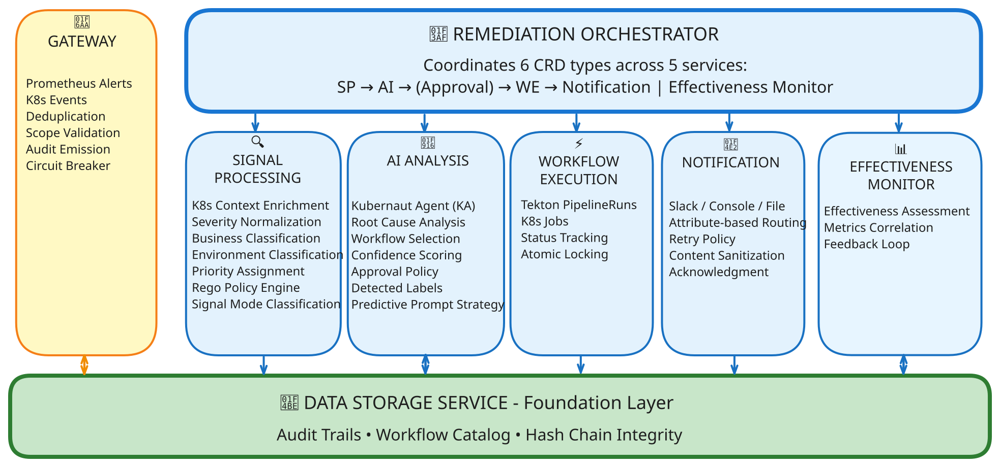
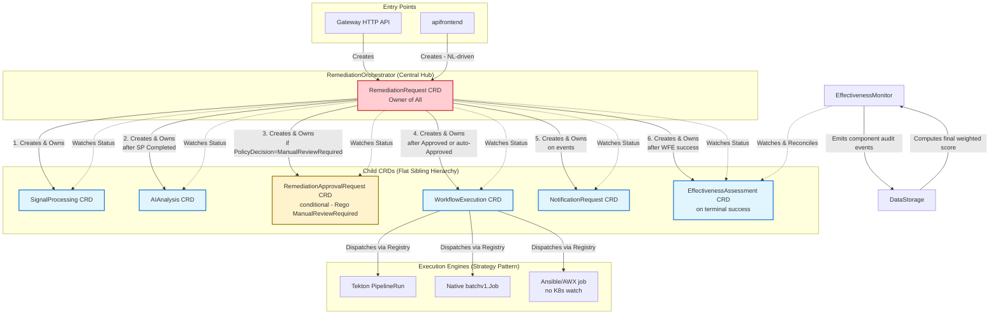
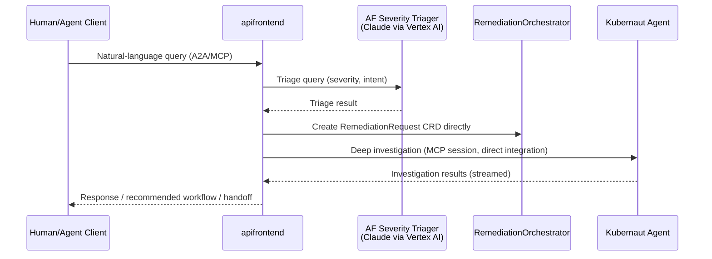

# Kubernaut CRD Architecture

**Version**: 2.0.0
**Date**: August 2026
**Status**: ✅ Authoritative Reference
**Scope**: 6 CRD controllers + 6 stateless/hybrid services + 1 optional UI component (see [Complete Service Inventory](#complete-service-inventory))
**Supersedes**: [MULTI_CRD_RECONCILIATION_ARCHITECTURE.md](MULTI_CRD_RECONCILIATION_ARCHITECTURE.md) (DEPRECATED)

---

## Document Purpose

This document is the **authoritative reference** for Kubernaut's Custom Resource Definition (CRD) architecture. It defines:

- **Service catalog**: 6 CRD controllers + 6 stateless/hybrid services, verified against `cmd/*/main.go` entrypoints and `SetupWithManager` wiring as of August 2026
- **CRD specifications** for the CRDs central to the remediation lifecycle (`RemediationRequest`, `SignalProcessing`, `AIAnalysis`, `WorkflowExecution`, `RemediationApprovalRequest`, `NotificationRequest`, `EffectivenessAssessment`)
- **Reconciliation patterns** and controller responsibilities, verified against `internal/controller/*` source
- **Integration flows** between services, including the AI approval gate and the multi-engine execution layer
- **Execution architecture**: a Strategy-pattern dispatch across Tekton, native Kubernetes Jobs, and Ansible/AWX — **not** a Tekton-only design

**Sources**: This document is based on direct verification of Go source (`api/*/v1alpha1/*_types.go`, `internal/controller/*`, `pkg/*`, `cmd/*/main.go`) plus authoritative service specifications and architectural decision records (ADRs/DDs) in `docs/services/` and `docs/architecture/decisions/`. Where a claim could not be directly verified against source in this pass, it is marked `⚠️ UNVERIFIED` rather than stated as fact.

> **📋 Rewrite note (v2.0.0, Issue #1806)**: This version is a full architectural-accuracy rewrite, not a mechanical terminology pass. The v1.3.0 document described a "HolmesGPT-API" wrapper service, a "Context API" service, and a 5-CRD/5-stateless V1.0 scope that predates or misrepresents the current system. Every section below has been re-verified against source. See the [Changelog](#changelog) for a full diff summary.

---

## Table of Contents

1. [Executive Summary](#executive-summary)
2. [Service Catalog](#service-catalog)
3. [CRD Specifications](#crd-specifications)
4. [Architecture Diagrams](#architecture-diagrams)
5. [Reconciliation Patterns](#reconciliation-patterns)
6. [Integration Flows](#integration-flows)
7. [Code Examples](#code-examples)
8. [Operational Guide](#operational-guide)
9. [Deprecated & Removed Components](#deprecated--removed-components)
10. [Changelog](#changelog)

---

## Executive Summary

### System Overview

Kubernaut is an AI-powered Kubernetes remediation platform built on a **microservices + CRD architecture** for autonomous incident analysis and automated remediation. A `RemediationRequest` CRD, created by the Gateway service (or by apifrontend for natural-language-driven investigations), is coordinated end-to-end by the RemediationOrchestrator controller through enrichment, AI investigation, an AI/Rego-gated approval step, multi-engine execution, and post-remediation effectiveness scoring — with a unified audit trail persisted to DataStorage for every step (SOC2 CC8.1 / ADR-034).

**Key characteristics**:
- **6 CRD controllers + 6 stateless/hybrid services** (plus an optional standalone web console) — see [Complete Service Inventory](#complete-service-inventory)
- **Multi-signal ingestion**: Prometheus/Alertmanager alerts, Kubernetes events (Gateway); natural-language queries (apifrontend)
- **AI-powered analysis**: Kubernaut Agent (KA), a **native Go** RCA and workflow-selection engine — not a Python/HolmesGPT-SDK wrapper
- **AI/Rego approval gating**: AIAnalysis evaluates a Rego policy on every investigation result; medium-confidence or policy-flagged recommendations require operator approval via a `RemediationApprovalRequest` CRD before execution
- **Three execution engines**: Tekton `PipelineRun`, native `batchv1.Job`, and Ansible/AWX — dispatched via a Strategy-pattern registry on `spec.executionEngine`, not a Tekton-only pipeline
- **Deterministic post-remediation scoring**: EffectivenessMonitor runs 4 zero-LLM checks (health, alert, metrics, spec-hash); DataStorage computes the final weighted score on demand
- **Open Source**: Apache 2.0 license

---

### Complete Service Inventory

| # | Service | Type | Entrypoint | CRD(s) Owned/Reconciled | Notes |
|---|---------|------|------------|-------------------------|-------|
| 1 | **Gateway** | Stateless HTTP (no `ctrl.Manager`) | `cmd/gateway/main.go` | Creates `RemediationRequest` via plain client | Single entry point for Prometheus/Alertmanager + K8s Events |
| 2 | **SignalProcessing** | CRD controller | `cmd/signalprocessing/main.go` | `SignalProcessing` | Signal enrichment + environment/priority/severity classification |
| 3 | **AIAnalysis** | CRD controller | `cmd/aianalysis/main.go` | `AIAnalysis` | Calls Kubernaut Agent async (submit/poll session via `pkg/agentclient`); Rego approval gating (`pkg/aianalysis/rego`) |
| 4 | **WorkflowExecution** | CRD controller | `cmd/workflowexecution/main.go` | `WorkflowExecution` | 3 execution engines via Strategy pattern (`pkg/workflowexecution/executor/`): Tekton, native Job, Ansible/AWX |
| 5 | **RemediationOrchestrator** | CRD controller (hub) | `cmd/remediationorchestrator/main.go` | `RemediationRequest` (owns SignalProcessing, AIAnalysis, WorkflowExecution, RemediationApprovalRequest, NotificationRequest, EffectivenessAssessment); also runs a second, independent `RemediationApprovalRequest` reconciler in the same binary | Central lifecycle hub — see [reconcile_loop.go](../../internal/controller/remediationorchestrator/reconcile_loop.go) |
| 6 | **Notification** | CRD controller | `cmd/notification/main.go` | `NotificationRequest` | Migrated from stateless HTTP to CRD (Oct 2025) |
| 7 | **EffectivenessMonitor** | CRD controller, no business API port | `cmd/effectivenessmonitor/main.go` | Watches `EffectivenessAssessment` (created by RO) | 4 deterministic scorers (health/alert/metrics/hash), zero AI/LLM dependency; DataStorage computes the final weighted score |
| 8 | **DataStorage** | Stateless HTTP | `cmd/datastorage/main.go` | — | Unified audit sink (ADR-034); computes EffectivenessMonitor's final weighted score on demand |
| 9 | **Kubernaut Agent (KA)** | Stateless HTTP/MCP | `cmd/kubernautagent/main.go` | — | Native Go AI investigation engine (see [DD-KA-019](decisions/DD-KA-019-go-rewrite-design/DD-KA-019-go-rewrite-design.md)); async session API |
| 10 | **apifrontend (AF)** | Stateless HTTP + embedded mini CRD controller for its own CRD | `cmd/apifrontend/main.go` | `InvestigationSession` (own CRD) | External-facing A2A/MCP gateway; own LLM "Severity Triager"; creates `RemediationRequest`s from NL queries; separate direct MCP + REST integration to KA |
| 11 | **authwebhook** | K8s admission webhook + CRD controller | `cmd/authwebhook/main.go` | `RemediationWorkflow` (catalog CRD), plus `ActionType` admission handling | No dedicated `docs/services/` directory exists for this service — a real documentation gap, flagged but not fixed here |
| 12 | **fleetmetadatacache (FMC)** | Stateless HTTP (no `ctrl.Manager`) | `cmd/fleetmetadatacache/main.go` | — | Multi-cluster "fleet" feature; polls remote clusters via MCP Gateway, writes Valkey, serves scope-check HTTP API |
| — | **kubernaut-console** | Optional standalone web UI (A2A chat) | n/a (external image) | — | Chart-deployable via `charts/kubernaut/templates/console/console.yaml`; no source in this repository |

**Evolution since v1.3.0**: The prior document counted "10 V1.0 services" (5 CRD + 5 stateless). Since then: **Context API was fully removed** (absorbed into DataStorage), **Dynamic Toolset code was deleted** (deferred to V2.0, docs kept only as historical record), **HolmesGPT-API was replaced end-to-end by the native-Go Kubernaut Agent**, **Notification migrated from stateless HTTP to a CRD controller**, and **three services not present in v1.3.0 were added**: `apifrontend`, `authwebhook`, and `fleetmetadatacache`. A `KubernetesExecutor` service was designed pre-v1.3.0 but never implemented and was formally eliminated by [ADR-025](decisions/ADR-025-kubernetesexecutor-service-elimination.md) — it does not appear in the count above. See [Deprecated & Removed Components](#deprecated--removed-components) for the full list.

---

### Key Architectural Principles

1. **Central Orchestration**: RemediationOrchestrator creates and watches all child CRDs of a `RemediationRequest` — verified `Owns()` list: `SignalProcessing`, `AIAnalysis`, `WorkflowExecution`, `RemediationApprovalRequest`, `NotificationRequest`, `EffectivenessAssessment` ([reconcile_loop.go:428-433](../../internal/controller/remediationorchestrator/reconcile_loop.go))
2. **Watch-Based Coordination**: Event-driven reconciliation via Kubernetes watches, not polling
3. **RO-Centralized Routing (DD-RO-002)**: RemediationOrchestrator makes all routing/skip/block decisions (resource locks, cooldowns, exponential backoff, consecutive-failure cooldowns) *before* creating a `WorkflowExecution`; WorkflowExecution itself is a "pure executor" with no routing logic
4. **AI/Rego Approval Gate**: AIAnalysis's Rego policy evaluation (`PolicyDecision`: `Approved` / `ManualReviewRequired` / `Denied` / `DegradedMode`) determines whether RemediationOrchestrator creates a `WorkflowExecution` directly or first creates a `RemediationApprovalRequest` and waits for an operator decision ([ADR-040](decisions/ADR-040-remediation-approval-request-architecture.md))
5. **Owner References**: All child CRDs are owned by `RemediationRequest` (flat sibling hierarchy) for automatic cascade deletion
6. **Multi-Engine Execution**: WorkflowExecution dispatches to one of three execution backends via a `Registry`/`Executor` Strategy pattern based on `spec.workflowRef.executionEngine` — Tekton `PipelineRun`, native `batchv1.Job` ([BR-WE-014](../../pkg/workflowexecution/executor/job.go)), or Ansible/AWX ([DD-WE-007](decisions/DD-WE-007-ansible-playbook-rbac-rules.md), no Kubernetes watch required for the AWX case)
7. **Unified Audit Trail**: DataStorage is the single audit sink for every service above (ADR-034); a `correlation_id` (the `RemediationRequest` name) allows full lifecycle reconstruction (BR-AUDIT-005, SOC2 CC8.1)
8. **Spec Immutability (ADR-001)**: `RemediationRequest`, `SignalProcessing`, `AIAnalysis`, and `RemediationApprovalRequest` specs are immutable after creation (enforced via CEL `self == oldSelf` validation) — each CRD is an immutable audit record of the state at creation time

**Source**: [reconcile_loop.go](../../internal/controller/remediationorchestrator/reconcile_loop.go), [DD-RO-002](decisions/DD-RO-002-centralized-routing-responsibility.md), [ADR-040](decisions/ADR-040-remediation-approval-request-architecture.md), [ADR-034](decisions/ADR-034-unified-audit-table-design.md)

---

## Service Catalog

### CRD Controllers

#### 1. SignalProcessing

**Purpose**: Signal enrichment and business-aware environment/priority/severity classification

**CRD**: `SignalProcessing` (`kubernaut.ai/v1alpha1`)

**Responsibilities**:
- Enrich signals with Kubernetes context (pods, deployments, nodes)
- Classify environment and business priority (`EnvironmentClassification`, `PriorityAssignment`)
- Normalize severity via a Rego policy ([DD-SEVERITY-001](decisions/DD-SEVERITY-001-severity-determination-refactoring.md)) into `critical` / `high` / `warning` / `info` / `unknown`
- Derive optional cluster business classification for fleet-scoped signals (`ClusterClassification`, [BR-FLEET-003](../requirements/BR-FLEET-003-cluster-scoped-workflow-targeting.md))
- Update status (`Phase: Completed`) so RemediationOrchestrator can create the `AIAnalysis` CRD

**Phases**: `Pending` → `Enriching` → `Classifying` → `Categorizing` → `Completed` / `Failed`

**Port**: 9090 (metrics), 8081 (health) — no separate API port (pure CRD reconciler)

**Business Requirements**: BR-SP-001 to BR-SP-062 (as of v1.3.0 numbering; not re-verified line-by-line in this pass)

**Source**: [docs/services/crd-controllers/01-signalprocessing/overview.md](../services/crd-controllers/01-signalprocessing/overview.md)

---

#### 2. AIAnalysis

**Purpose**: AI-powered root cause analysis and remediation-workflow selection, via Kubernaut Agent

**CRD**: `AIAnalysis` (`kubernaut.ai/v1alpha1`)

**Responsibilities**:
- Submit an investigation to Kubernaut Agent **asynchronously** — `SubmitInvestigation()` returns a `session_id`; the controller then polls via `PollSession()` until a terminal state, then calls `GetSessionResult()` (`pkg/agentclient`, [BR-AA-HAPI-064](../requirements/)) — KA has **no** synchronous "analyze and return" endpoint
- Evaluate the investigation result against a Rego policy (`pkg/aianalysis/rego/evaluator.go`, [BR-AI-011](../requirements/), [BR-AI-014](../requirements/) graceful degradation) to produce a `PolicyDecision`: `Approved`, `ManualReviewRequired`, `Denied`, or `DegradedMode`
- Detect and reject hallucinated or invalid AI responses

**Phases**: `Pending` → `Investigating` → `Analyzing` → `Completed` / `Failed` (no `Ready` phase — corrected from v1.3.0)

**Port**: 9090 (metrics), 8081 (health) — no separate API port

**Auth**: Middleware-based TokenReview+SAR complete ([DD-AUTH-014](decisions/DD-AUTH-014-middleware-based-sar-authentication.md) Phase 5) — AIAnalysis is the confirmed production caller of Kubernaut Agent's client-auth RBAC (`kubernaut-agent-client`), not Gateway

**Business Requirements**: BR-AI-001 to BR-AI-060 (as of v1.3.0 numbering; not re-verified line-by-line)

**Source**: [docs/services/crd-controllers/02-aianalysis/overview.md](../services/crd-controllers/02-aianalysis/overview.md), [pkg/agentclient/client.go](../../pkg/agentclient/client.go), [pkg/aianalysis/rego/evaluator.go](../../pkg/aianalysis/rego/evaluator.go)

---

#### 3. WorkflowExecution

**Purpose**: Execute the selected remediation workflow via one of three execution engines

**CRD**: `WorkflowExecution` (`kubernaut.ai/v1alpha1`)

**Responsibilities**:
- Dispatch to the correct `Executor` implementation via a `Registry` keyed on `spec.workflowRef.executionEngine` (Strategy pattern, [pkg/workflowexecution/executor/executor.go](../../pkg/workflowexecution/executor/executor.go)):
  - **`tekton`** — creates and watches a Tekton `PipelineRun`
  - **`job`** — creates and watches a native `batchv1.Job` ([BR-WE-014](../../pkg/workflowexecution/executor/job.go))
  - **`ansible`** — dispatches to Ansible Automation Platform (AWX); **no Kubernetes watch is needed** for this engine ([DD-WE-007](decisions/DD-WE-007-ansible-playbook-rbac-rules.md))
- Act as a **pure executor**: since DD-RO-002, WorkflowExecution contains no routing/skip logic — RemediationOrchestrator makes all resource-lock, cooldown, and backoff decisions *before* creating the CRD
- Write action records to DataStorage for audit and effectiveness tracking

**Phases**: `Pending` → `Running` → `Completed` / `Failed` (the `Skipped` phase was **removed** in the V1.0 "pure executor" refactor — all skip/block information now lives on `RemediationRequest.Status`, not `WorkflowExecution.Status`)

**Port**: 9090 (metrics), 8081 (health) — no separate API port

**Business Requirements**: BR-WF-001 to BR-WF-053, BR-WE-014 (Job engine); Ansible engine authority is [DD-WE-007](decisions/DD-WE-007-ansible-playbook-rbac-rules.md)

**Source**: [docs/services/crd-controllers/03-workflowexecution/overview.md](../services/crd-controllers/03-workflowexecution/overview.md), [pkg/workflowexecution/executor/](../../pkg/workflowexecution/executor/)

---

#### 4. RemediationOrchestrator

**Purpose**: End-to-end remediation lifecycle management — the central hub

**CRD**: `RemediationRequest` (`kubernaut.ai/v1alpha1`)

**Responsibilities**:
- Create `RemediationRequest`-scoped child CRDs in sequence: `SignalProcessing` → `AIAnalysis` → (`RemediationApprovalRequest` if the Rego policy requires manual review) → `WorkflowExecution` → `EffectivenessAssessment` (on terminal success)
- **Own the `RemediationApprovalRequest` CRD it creates itself** via `pkg/remediationorchestrator/creator/approval.go` (`ApprovalCreator`) — RemediationOrchestrator, not AIAnalysis, is the creator; AIAnalysis only produces the `PolicyDecision` that triggers creation
- Run **two independent controllers in the same binary**: the primary `RemediationRequest` reconciler (`Reconciler`), and a separate `RemediationApprovalRequest` reconciler (`RARReconciler`) that only manages audit-condition bookkeeping on the RAR itself ([remediation_approval_request.go](../../internal/controller/remediationorchestrator/remediation_approval_request.go))
- Watch-based status aggregation across all six owned CRD kinds; centralized routing decisions (DD-RO-002): resource-lock, cooldown, exponential backoff (DD-WE-004), consecutive-failure blocking (BR-ORCH-042)
- Create `NotificationRequest` CRDs for approvals, escalations, timeouts, completions, and failures
- Create `EffectivenessAssessment` on terminal success and track its outcome to finalize `RemediationRequest.Status.Outcome`

**Phases** (`RemediationRequest.Status.OverallPhase`): `Pending` → `Processing` → `Analyzing` → `AwaitingApproval` (conditional) → `Executing` → `Verifying` → `Completed` / `Failed` / `TimedOut` / `Skipped` / `Cancelled`, with a non-terminal `Blocked` phase for resource-busy/cooldown/backoff/duplicate/unmanaged-resource conditions (corrected from v1.3.0, which omitted `AwaitingApproval`, `Blocked`, `TimedOut`, `Skipped`, and `Cancelled`)

**Port**: 9090 (metrics), 8081 (health)

**Business Requirements**: BR-ORCH-001 to BR-ORCH-045 (as of v1.3.0 numbering, e.g. BR-ORCH-042 consecutive-failure cooldown; not re-verified line-by-line)

**Source**: [docs/services/crd-controllers/05-remediationorchestrator/overview.md](../services/crd-controllers/05-remediationorchestrator/overview.md), [internal/controller/remediationorchestrator/reconcile_loop.go](../../internal/controller/remediationorchestrator/reconcile_loop.go)

---

#### 5. Notification

**Purpose**: Multi-channel notification delivery

**CRD**: `NotificationRequest` (`kubernaut.ai/v1alpha1`)

**Responsibilities**:
- Deliver notifications across 9 channel types: `email`, `slack`, `teams`, `pagerduty`, `sms`, `webhook`, `console`, `file`, `log` (expanded from v1.3.0's 5-channel list — `pagerduty`, `console`, `file`, and `log` were added)
- Sanitize sensitive data before delivery
- Retry partial failures (`Retrying` is a distinct non-terminal phase) and report `PartiallySent` when some but not all channels succeed
- Deliver 6 notification types: `Escalation`, `Simple`, `StatusUpdate`, `Approval`, `ManualReview`, `Completion`

**Phases**: `Pending` → `Sending` → `Retrying` (conditional) → `Sent` / `PartiallySent` / `Failed`

**Port**: 9090 (metrics), 8081 (health)

**Business Requirements**: BR-NOT-001 to BR-NOT-050 (as of v1.3.0 numbering; not re-verified line-by-line)

**Source**: [docs/services/crd-controllers/06-notification/overview.md](../services/crd-controllers/06-notification/overview.md) — ⚠️ note: this overview document's own header still says "Stateless HTTP API Service" / "NEEDS IMPLEMENTATION"; that header is itself stale relative to `cmd/notification/main.go` and the CRD types in `api/notification/v1alpha1/`, which confirm a CRD controller is implemented and running. Flagged, not fixed, here (out of scope).

---

#### 6. EffectivenessMonitor

**Purpose**: Deterministic, zero-LLM post-remediation effectiveness assessment

**CRD**: Watches `EffectivenessAssessment` (`kubernaut.ai/v1alpha1`), created by RemediationOrchestrator on terminal success — EffectivenessMonitor does **not** create this CRD itself

**Responsibilities**:
- 4 deterministic scorers, **zero AI/LLM dependency** (corrected from v1.3.0, which described a HolmesGPT-powered "Level 2" analysis path for this service):
  - **Health**: pod-running / OOM / latency checks
  - **Alert**: Prometheus/Alertmanager alert-resolution scoring (BR-EM-002)
  - **Metrics**: pre/post remediation metric comparison
  - **Hash**: spec-hash drift detection to catch configuration drift during assessment (BR-EM-004)
- Emits per-component audit events to DataStorage; **DataStorage — not EffectivenessMonitor — computes the final weighted score on demand** (a key correction from v1.3.0, which had this service performing its own scoring)
- Optional deferred hash computation for async changes (GitOps sync, operator reconciliation) via `WaitingForPropagation` phase (BR-EM-010, [DD-EM-004](decisions/))

**Phases**: `Pending` → `Stabilizing` → `Assessing` (→ `WaitingForPropagation` if a hash-compute delay is configured) → `Completed` / `Failed`

**Port**: 9090 (metrics), 8081 (health) — **no API port at all** (not 8080/combined as a generic stateless-service template might suggest)

**Business Requirements**: **BR-EM-\*** — corrected from v1.3.0, which used the (now-superseded) `BR-INS-*` prefix for this service. Verified examples: BR-EM-001 (pod filtering/health stats), BR-EM-002 (alert resolution scoring), BR-EM-004 (spec-hash drift), BR-EM-009 (derived timing computation), BR-EM-010 (async hash deferral), BR-EM-012 (alert decay detection)

**Source**: [docs/services/crd-controllers/07-effectivenessmonitor/overview.md](../services/crd-controllers/07-effectivenessmonitor/overview.md) — this service's docs moved from `docs/services/stateless/effectiveness-monitor/` to `docs/services/crd-controllers/07-effectivenessmonitor/` because it is a CRD controller, not a stateless service; the old `stateless/effectiveness-monitor/` directory has been deleted.

---

### Stateless & Hybrid Services

#### 7. Gateway

**Purpose**: Single entry point for external signals

**Type**: Stateless HTTP (no `ctrl.Manager` — uses a plain Kubernetes client to create CRDs)

**Responsibilities**:
- Webhook ingestion for Prometheus/Alertmanager alerts and Kubernetes Events
- Deduplication tracking (`DeduplicationStatus`: `FirstSeenAt`/`LastSeenAt`/`OccurrenceCount` — a simpler shape than v1.3.0's `isDuplicate` boolean claim)
- Creates `RemediationRequest` CRDs

**Port**: 8080 (API, `listenAddr` in `config/gateway.yaml`), 9090 (metrics)

**Auth**: Middleware-based TokenReview+SAR complete ([DD-AUTH-014](decisions/DD-AUTH-014-middleware-based-sar-authentication.md) Phase 4)

**Business Requirements**: BR-GATEWAY-001 to BR-GATEWAY-183 (as of v1.3.0 numbering; environment/priority classification has since been delegated to SignalProcessing per [DD-CATEGORIZATION-001](decisions/DD-CATEGORIZATION-001-gateway-signal-processing-split-assessment.md) — Gateway no longer performs its own environment classification as v1.3.0 described)

**Source**: [docs/services/stateless/gateway-service/overview.md](../services/stateless/gateway-service/overview.md)

---

#### 8. DataStorage

**Purpose**: Unified audit sink and data persistence

**Type**: Stateless HTTP REST API

**Responsibilities**:
- Sole PostgreSQL access point (ADR-032); pgvector-backed semantic search
- **Unified audit table** (ADR-034): every business-critical event from every service in the [Complete Service Inventory](#complete-service-inventory) lands here, keyed by `correlation_id` (the `RemediationRequest` name) for full lifecycle reconstruction (BR-AUDIT-005, SOC2 CC8.1)
- **Computes EffectivenessMonitor's final weighted effectiveness score on demand** from the per-component audit events EffectivenessMonitor emits — EffectivenessMonitor itself does not compute this score
- Absorbed the historical-intelligence role of the now-removed Context API ([DD-CONTEXT-006](decisions/DD-CONTEXT-006-CONTEXT-API-DEPRECATION.md))
- Serves the workflow catalog used by Kubernaut Agent's workflow-discovery protocol

**Port**: 8080 (API/health), 9090 (metrics)

**Auth**: Middleware-based TokenReview+SAR complete ([DD-AUTH-014](decisions/DD-AUTH-014-middleware-based-sar-authentication.md) Phase 2 — the original POC service for this pattern)

**Business Requirements**: BR-STORAGE-\* (e.g. BR-STORAGE-031-\* schema/endpoint work, BR-STORAGE-1505 per-IP rate limiting)

**Source**: [docs/services/stateless/data-storage/overview.md](../services/stateless/data-storage/overview.md), [ADR-034](decisions/ADR-034-unified-audit-table-design.md)

---

#### 9. Kubernaut Agent (KA)

**Purpose**: Native-Go AI root-cause-analysis and remediation-workflow-selection engine

**Type**: Stateless HTTP/MCP service

**Responsibilities**:
- Root cause analysis using live cluster state (Kubernetes/Prometheus/Alertmanager tools)
- Determine the actual remediation target, which may differ from the signal's original resource ([DD-KA-006](decisions/DD-KA-006-remediation-target-in-rca.md))
- Discover and select a remediation workflow from the operator-declared workflow catalog via a 3-step protocol: `list_available_actions` → `list_workflows` → `get_workflow` ([DD-KA-017](decisions/DD-KA-017-three-step-workflow-discovery-integration.md))
- Validate the LLM's proposed workflow/parameters in Go and re-prompt on failure — **not** LLM tool-calling ([DD-KA-001](decisions/DD-KA-001-workflow-response-validation-architecture.md))
- Multi-provider LLM support (VertexAI, Anthropic, Gemini, OpenAI, Azure OpenAI, Ollama, vLLM, LlamaStack, Mistral, HuggingFace TGI, DeepSeek)

**Is a native Go rewrite** ([DD-KA-019](decisions/DD-KA-019-go-rewrite-design/DD-KA-019-go-rewrite-design.md)) of an earlier Python/HolmesGPT-SDK-based design — **not** a wrapper around the HolmesGPT SDK, contra the v1.3.0 "HolmesGPT-API" description

**API pattern**: async, session-based — **no synchronous "analyze and return" endpoint exists**:
```
POST /api/v1/incident/analyze              -> 202 Accepted, { "session_id": "<uuid>" }
GET  /api/v1/incident/session/{id}                -> session status
GET  /api/v1/incident/session/{id}/result          -> final result (once complete)
GET  /api/v1/incident/session/{id}/snapshot        -> in-progress snapshot
GET  /api/v1/incident/session/{id}/stream          -> streaming updates
POST /api/v1/incident/session/{id}/cancel          -> cancel an in-flight investigation
```

**Callers**: The AIAnalysis controller is the sole caller of this async REST session API (autonomous, alert-driven investigations). **apifrontend** has a *separate*, direct integration with KA — both a pooled/dedicated **MCP** client for interactive human-in-the-loop investigation streaming, and a plain **REST** client for non-MCP calls (`cmd/apifrontend/backend_deps.go`) — a different API surface (KA's MCP server / interactive mode) than the one AIAnalysis uses. Both statements ("AIAnalysis is the sole caller of the async incident-analyze session flow" and "apifrontend calls KA directly") are simultaneously true; they refer to different KA API surfaces.

**Port**: 8080 (API), 8081 (health/OpenAPI/admin), 9090 (metrics) — a documented 3-port deviation from the stateless-services 2-port standard, with no on-file design decision justifying it

**Auth**: Middleware-based TokenReview+SAR complete ([DD-AUTH-014](decisions/DD-AUTH-014-middleware-based-sar-authentication.md) Phase 3)

**Business Requirements**: BR-KA-\* (e.g. BR-KA-191 workflow parameter validation, BR-KA-212 RCA target resource, BR-KA-200 outcome semantics)

**Source**: [docs/services/stateless/kubernaut-agent/overview.md](../services/stateless/kubernaut-agent/overview.md)

---

#### 10. apifrontend (AF)

**Purpose**: External-facing A2A/MCP gateway for natural-language-driven incident investigation

**Type**: Stateless HTTP + an embedded mini CRD controller for its own `InvestigationSession` CRD (`cmd/apifrontend/session_infra.go`)

**Responsibilities**:
- External A2A (agent-to-agent) and MCP-bridge protocol surface for human/agent clients
- Own LLM-powered "Severity Triager" (Claude via Vertex AI) with session management via Google ADK
- Creates `RemediationRequest` CRDs directly from natural-language queries — a second CRD-creation entry point alongside Gateway
- Separate, direct integration with Kubernaut Agent for deep investigation (MCP session pool + plain REST client — see [Kubernaut Agent](#9-kubernaut-agent-ka) above) — **"AF owns triage, KA owns investigation"** is the documented separation of concerns ([docs/services/apifrontend/design/ARCHITECTURE.md](../services/apifrontend/design/ARCHITECTURE.md))
- Own auth stack (`pkg/apifrontend/auth/`) plus JWT/OIDC validation for external clients, independent of the DD-AUTH-014 middleware pattern used by the CRD-facing services

**Port**: ⚠️ UNVERIFIED exact port numbers in this pass — not independently confirmed against `cmd/apifrontend/main.go` flags/config in this rewrite; consult [docs/services/apifrontend/](../services/apifrontend/) directly

**Business Requirements**: BR-AF-\* (e.g. BR-AF-STREAM-001 priority event delivery)

**Source**: [docs/services/apifrontend/design/ARCHITECTURE.md](../services/apifrontend/design/ARCHITECTURE.md) — this service has an extensive dedicated documentation tree (`docs/services/apifrontend/`) with its own ADRs, test plans, runbooks, and security docs; this document does not attempt to duplicate that detail.

---

#### 11. authwebhook

**Purpose**: Kubernetes admission webhook plus the `RemediationWorkflow` catalog CRD controller

**Type**: K8s admission webhook (validating/mutating) + CRD controller, in one binary

**Responsibilities**:
- Admission handling for `RemediationWorkflow` and `ActionType` CRDs ([ADR-058](decisions/), [ADR-059](decisions/)) — validates semver, catalog constraints, and operator-supplied workflow overrides at `kubectl apply` time
- Runs a `RemediationWorkflow` **finalizer reconciler** (`authwebhook.RemediationWorkflowReconciler`) — a genuine CRD controller, distinct from the per-run `WorkflowExecution` CRD reconciled by the WorkflowExecution service
- The `RemediationWorkflow` CRD is the versioned **workflow-catalog definition** (semver-validated, `kubectl apply`-registered); this is architecturally distinct from `WorkflowExecution`, which represents one in-flight execution of a selected catalog workflow

**Port**: 9443 (admission webhook TLS) — uses standard Kubernetes admission-webhook TLS/certificate trust, a different auth model than the DD-AUTH-014 middleware pattern used by the API-exposing services above

**Documentation gap**: No dedicated `docs/services/` directory exists for this service, despite it being a real, actively-developed component with its own CRD reconciler. This is flagged here as a known gap; filling it is out of scope for this document.

**Source**: [cmd/authwebhook/main.go](../../cmd/authwebhook/main.go) — verified directly against source in the absence of a service-level doc

---

#### 12. fleetmetadatacache (FMC)

**Purpose**: Multi-cluster "fleet" metadata caching for cross-cluster scope checks

**Type**: Stateless HTTP (no `ctrl.Manager`)

**Responsibilities**:
- Polls remote/member clusters via the MCP Gateway
- Writes discovered fleet metadata to Valkey (Redis-compatible)
- Serves a scope-check HTTP API used by other services to determine whether a resource is in-scope for a given cluster

**Port**: ⚠️ UNVERIFIED exact port numbers in this pass

**Business Requirements**: BR-FLEET-\* (e.g. BR-FLEET-003 cluster-scoped workflow targeting, BR-FLEET-054 remote cluster identifier propagation)

**Source**: [cmd/fleetmetadatacache/main.go](../../cmd/fleetmetadatacache/main.go) — no dedicated `docs/services/` directory was found for this service in this pass either

---

#### kubernaut-console (optional)

**Purpose**: Standalone web UI providing an A2A chat experience against apifrontend

**Type**: Externally-built container image, deployed via the Helm chart (`charts/kubernaut/templates/console/console.yaml`)

**Notes**: This component has no source code in this repository. It is opt-in (not part of the core 12-service topology above) and is included here only for completeness of the service inventory.

---

## CRD Specifications

> **A note on the "Key Fields" blocks below**: these are **illustrative, abbreviated summaries** of the most architecturally significant fields on each CRD, verified against the current Go types in `api/*/v1alpha1/*_types.go` as of this rewrite. They are **not** exhaustive schema dumps — several of these structs carry 30-80+ fields covering timeout configuration, skip/block tracking, printer-column display fields, and audit metadata that are omitted here for readability. Consult the linked Go source for the authoritative, complete schema.

### RemediationRequest (Central Orchestrator)

**API Group**: `kubernaut.ai/v1alpha1` (corrected from v1.3.0's `remediationorchestrator.kubernaut.io/v1alpha1` — verified via `api/remediation/v1alpha1/groupversion_info.go`: `GroupVersion = schema.GroupVersion{Group: "kubernaut.ai", Version: "v1alpha1"}`. **All Kubernaut CRDs share this single API group** — the Go package path (`api/remediation/`, `api/signalprocessing/`, etc.) does not imply a per-service API group, contra v1.3.0's per-CRD group naming)

**Purpose**: Central, immutable-spec orchestration CRD coordinating the end-to-end remediation workflow

**Ownership**:
- Created by: Gateway (webhook-driven signals) **or** apifrontend (natural-language-driven investigations)
- Owns: `SignalProcessing`, `AIAnalysis`, `WorkflowExecution`, `RemediationApprovalRequest`, `NotificationRequest`, `EffectivenessAssessment`

**Lifecycle** (corrected from v1.3.0's linear 7-step flow, which omitted the approval gate, the blocking/backoff states, and effectiveness assessment):
1. Gateway or apifrontend creates `RemediationRequest` from an incoming signal or NL query
2. RemediationOrchestrator creates `SignalProcessing`; on completion, creates `AIAnalysis`
3. AIAnalysis investigates via Kubernaut Agent (async submit/poll) and evaluates a Rego policy
4. If `PolicyDecision = Approved`: RemediationOrchestrator creates `WorkflowExecution` directly
   If `PolicyDecision = ManualReviewRequired`: RemediationOrchestrator creates `RemediationApprovalRequest` (phase → `AwaitingApproval`) and waits for an operator decision before creating `WorkflowExecution`
   If `PolicyDecision = Denied`: remediation does not proceed to execution
5. WorkflowExecution executes via the selected engine (Tekton / Job / Ansible); RemediationOrchestrator may also transition to a non-terminal `Blocked` phase for resource-lock/cooldown/backoff conditions before execution proceeds or retries
6. On successful execution, RemediationOrchestrator creates `EffectivenessAssessment` (phase → `Verifying`) and finalizes `Status.Outcome` once EffectivenessMonitor's assessment reaches a terminal state or the verification deadline expires
7. RemediationOrchestrator creates `NotificationRequest` CRDs throughout for approvals, escalations, timeouts, completions, and failures
8. 24-hour retention window, then finalizer removal → cascade deletion of all owned CRDs

**Key Fields** (abbreviated — see note above):
```yaml
spec:
  signalFingerprint: string     # SHA256, immutable, dedup key
  signalName: string            # e.g. "HighMemoryUsage"
  severity: string               # raw/external value; SignalProcessing normalizes via Rego
  signalType: string              # "alert" (adapter-specific values deprecated)
  targetType: string               # kubernetes | aws | azure | gcp | datadog
  targetResource:                  # ResourceIdentifier
    kind: string
    name: string
    namespace: string
    apiVersion: string             # disambiguates multi-group Kinds (Issue #1040)
  clusterID: string                 # multi-cluster federation (ADR-065); empty = local hub
  firingTime: timestamp
  receivedTime: timestamp
  # NOTE: environment/priority are NOT here — SignalProcessing owns and computes
  # them; RO reads SignalProcessingStatus.EnvironmentClassification/PriorityAssignment.

status:
  overallPhase: string    # Pending|Processing|Analyzing|AwaitingApproval|Executing|
                            # Verifying|Blocked|Completed|Failed|TimedOut|Skipped|Cancelled
  outcome: string           # Remediated|NoActionRequired|ManualReviewRequired|
                              # VerificationTimedOut|Inconclusive|DryRun
  signalProcessingRef: object   # corev1.ObjectReference
  aiAnalysisRef: object
  workflowExecutionRef: object
  effectivenessAssessmentRef: object
  notificationRequestRefs: []object
  blockReason: string        # ConsecutiveFailures|DuplicateInProgress|ResourceBusy|
                               # RecentlyRemediated|ExponentialBackoff|UnmanagedResource|IneffectiveChain
  consecutiveFailureCount: int32
  preRemediationSpecHash: string   # captured by RO before WFE creation, for EM's hash-drift check
```

**Source**: [api/remediation/v1alpha1/remediationrequest_types.go](../../api/remediation/v1alpha1/remediationrequest_types.go), [docs/services/crd-controllers/05-remediationorchestrator/overview.md](../services/crd-controllers/05-remediationorchestrator/overview.md)

---

### SignalProcessing (Signal Enrichment & Business Classification)

**API Group**: `kubernaut.ai/v1alpha1` (single shared group across all Kubernaut CRDs — see the `RemediationRequest` note above)

**Ownership**: Created by RemediationOrchestrator; owned by `RemediationRequest`

**Key Fields**:
```yaml
spec:
  remediationRequestRef: object   # ObjectReference to parent RR
  signal:                         # SignalData — copied from RR for self-containment
    fingerprint: string
    name: string
    severity: string
    type: string
    source: string
    clusterID: string
  enrichmentConfig: object        # V2.0 placeholder — controller currently uses global config, not this

status:
  phase: string                    # Pending|Enriching|Classifying|Categorizing|Completed|Failed
  kubernetesContext: object
  environmentClassification:       # EnvironmentClassification
    environment: string
  priorityAssignment:               # PriorityAssignment
    priority: string
  severity: string                 # normalized: critical|high|warning|info|unknown (Rego, DD-SEVERITY-001)
  policyHash: string                # SHA256 of the Rego policy used, for audit
  clusterClassification: string     # optional, fleet mode only (BR-FLEET-003)
```

**Source**: [api/signalprocessing/v1alpha1/signalprocessing_types.go](../../api/signalprocessing/v1alpha1/signalprocessing_types.go), [docs/services/crd-controllers/01-signalprocessing/overview.md](../services/crd-controllers/01-signalprocessing/overview.md)

---

### AIAnalysis (AI Investigation & Workflow Selection)

**API Group**: `kubernaut.ai/v1alpha1`

**Ownership**: Created by RemediationOrchestrator; owned by `RemediationRequest`; a `PolicyDecision` of `ManualReviewRequired` triggers RemediationOrchestrator (not AIAnalysis) to create `RemediationApprovalRequest`

**Key Fields**:
```yaml
spec:
  remediationRequestRef: object      # corev1.ObjectReference, for audit lineage
  remediationId: string
  analysisRequest:                   # AnalysisRequest (DD-CONTRACT-002)
    signalContext: object            # SignalContextInput, from SignalProcessing
    analysisTypes: []string          # Investigation|RootCause|WorkflowSelection
  timeoutConfig:                     # optional; defaults: Investigating 60s, Analyzing 5s
    investigatingTimeout: duration
    analyzingTimeout: duration
  clusterID: string                  # BR-FLEET-054, propagated from RR

status:
  phase: string    # Pending|Investigating|Analyzing|Completed|Failed  (no "Ready" phase)
  reason: string   # AnalysisCompleted|WorkflowResolutionFailed|WorkflowNotNeeded|
                     # NoWorkflowSelected|RegoEvaluationError|TransientError|APIError|
                     # InteractiveCancelled|ParentCancelled
  # PolicyDecision (from Rego evaluation, pkg/aianalysis/rego):
  #   Approved | ManualReviewRequired | Denied | DegradedMode
```

**Source**: [api/aianalysis/v1alpha1/aianalysis_types.go](../../api/aianalysis/v1alpha1/aianalysis_types.go), [pkg/aianalysis/rego/evaluator.go](../../pkg/aianalysis/rego/evaluator.go), [docs/services/crd-controllers/02-aianalysis/overview.md](../services/crd-controllers/02-aianalysis/overview.md)

---

### WorkflowExecution (Multi-Engine Remediation Execution)

**API Group**: `kubernaut.ai/v1alpha1`

**Ownership**: Created by RemediationOrchestrator (after approval, if required); owned by `RemediationRequest`; creates the underlying execution resource (Tekton `PipelineRun`, `batchv1.Job`, or an AWX job) per the dispatched engine

**Key Fields**:
```yaml
spec:
  remediationRequestRef: object
  workflowRef:                       # WorkflowRef — copied verbatim from
                                      # AIAnalysis.Status.SelectedWorkflow by RO
    workflowId: string
    version: string
    executionEngine: string          # "tekton" | "job" | "ansible"
    executionBundle: string          # OCI bundle reference (Tekton) or equivalent
    executionBundleDigest: string
  targetResource: string             # "namespace/kind/name" format — resource-lock key (DD-WE-001)
  clusterID: string

status:
  phase: string    # Pending|Running|Completed|Failed   (Skipped phase REMOVED, DD-RO-002)
  # Skip/block details are NOT here — they live on RemediationRequest.Status (DD-RO-002)
```

**Source**: [api/workflowexecution/v1alpha1/workflowexecution_types.go](../../api/workflowexecution/v1alpha1/workflowexecution_types.go), [pkg/workflowexecution/executor/](../../pkg/workflowexecution/executor/), [docs/services/crd-controllers/03-workflowexecution/overview.md](../services/crd-controllers/03-workflowexecution/overview.md)

---

### RemediationApprovalRequest (Manual Approval Gate) — *new since v1.3.0*

**API Group**: `kubernaut.ai/v1alpha1` (same Go package, `api/remediation/v1alpha1/`, as `RemediationRequest` — and the same API group as every other CRD in this document)

**Purpose**: Gate `WorkflowExecution` creation on an explicit operator decision when AIAnalysis's Rego policy flags `ManualReviewRequired`. Modeled on the Kubernetes `CertificateSigningRequest` pattern: fully immutable spec, decision recorded on status. **This CRD did not exist in v1.3.0** — the prior document's `AIApprovalRequest` name and behavior described a design that was superseded by this ADR-040 architecture.

**Ownership**:
- Created by: **RemediationOrchestrator** (via `pkg/remediationorchestrator/creator/approval.go`'s `ApprovalCreator`) — not AIAnalysis, though AIAnalysis's Rego evaluation is what triggers the creation decision
- Owned by: `RemediationRequest`
- Reconciled by: a dedicated `RARReconciler` running in the RemediationOrchestrator binary (audit-condition bookkeeping only — the operator decision itself is written by an external actor, e.g. `kubectl`, a dashboard, or apifrontend acting as a trusted intermediary)

**Key Fields**:
```yaml
spec:                                  # fully immutable after creation (ADR-040)
  remediationRequestRef: object
  aiAnalysisRef: object
  clusterID: string
  confidence: float                    # 0.0-1.0, from AI analysis
  confidenceLevel: string              # low | medium | high
  reason: string
  recommendedWorkflow:                 # RecommendedWorkflowSummary
    workflowId: string
    version: string
    executionBundle: string
    rationale: string
  investigationSummary: string
  evidenceCollected: []string
  recommendedActions: []object
  alternativesConsidered: []object
  whyApprovalRequired: string
  policyEvaluation:                    # ApprovalPolicyEvaluation, if Rego triggered this
    policyName: string
    matchedRules: []string
    decision: string
  requiredBy: timestamp                # approval deadline (default 15m, ADR-040)

status:
  decision: string          # ""(pending) | Approved | Rejected | Expired
  decidedBy: string          # username, or "system" for timeout
  decidedVia: string          # trusted-intermediary identity (e.g. apifrontend SA), if delegated
  decidedAt: timestamp
  decisionMessage: string
  workflowOverride:            # WorkflowOverride — operator can override the AI-recommended
    workflowName: string       # workflow/parameters at approval time (#594)
    parameters: object
    rationale: string
```

**Source**: [api/remediation/v1alpha1/remediationapprovalrequest_types.go](../../api/remediation/v1alpha1/remediationapprovalrequest_types.go), [internal/controller/remediationorchestrator/remediation_approval_request.go](../../internal/controller/remediationorchestrator/remediation_approval_request.go), [pkg/remediationorchestrator/creator/approval.go](../../pkg/remediationorchestrator/creator/approval.go), [ADR-040](decisions/ADR-040-remediation-approval-request-architecture.md)

---

### NotificationRequest (Multi-Channel Notifications)

**API Group**: `kubernaut.ai/v1alpha1`

**Ownership**: Created by RemediationOrchestrator; owned by `RemediationRequest`

**Key Fields**:
```yaml
spec:
  notificationType: string   # Escalation|Simple|StatusUpdate|Approval|ManualReview|Completion
  priority: string             # Critical|High|Medium|Low
  channels: []object            # each: { type: email|slack|teams|pagerduty|sms|webhook|console|file|log, config: object }
  content:
    title: string
    message: string
    context: object

status:
  phase: string    # Pending|Sending|Retrying|Sent|PartiallySent|Failed
  deliveryResults: []object
```

**Source**: [api/notification/v1alpha1/notificationrequest_types.go](../../api/notification/v1alpha1/notificationrequest_types.go), [docs/services/crd-controllers/06-notification/overview.md](../services/crd-controllers/06-notification/overview.md)

---

### EffectivenessAssessment (Post-Remediation Scoring) — *new since v1.3.0*

**API Group**: `kubernaut.ai/v1alpha1`

**Purpose**: Trigger and track EffectivenessMonitor's deterministic post-remediation checks. **This CRD did not exist in v1.3.0**, which instead described an "Effectiveness Monitor Service" doing its own AI-powered scoring directly — both the CRD-based architecture and the "no AI/LLM" scoring model are corrections.

**Ownership**:
- Created by: RemediationOrchestrator, on successful `WorkflowExecution` completion
- Owned by: `RemediationRequest`
- Reconciled by: EffectivenessMonitor (which does **not** create this CRD — only watches and reconciles it)

**Key Fields**:
```yaml
spec:                          # immutable after creation (ADR-001)
  correlationID: string        # = parent RemediationRequest name (DD-AUDIT-CORRELATION-002)
  # + target resource / config for the 4 scorers (health/alert/metrics/hash)

status:
  phase: string    # Pending|Stabilizing|Assessing|WaitingForPropagation|Completed|Failed
  reason: string   # Full|Partial|NoExecution|MetricsTimedOut|Expired|SpecDrift|
                     # AlertDecayTimeout|Unrecoverable
  # per-component results are emitted as audit events to DataStorage, not stored in full here;
  # DataStorage computes the final weighted score on demand from those audit events
```

**Source**: [api/effectivenessassessment/v1alpha1/effectivenessassessment_types.go](../../api/effectivenessassessment/v1alpha1/effectivenessassessment_types.go), [ADR-EM-001](decisions/ADR-EM-001-effectiveness-monitor-service-integration.md), [docs/services/crd-controllers/07-effectivenessmonitor/overview.md](../services/crd-controllers/07-effectivenessmonitor/overview.md)

---

### Other CRDs (owned by non-hub services, out of this document's primary scope)

| CRD | Owner Service | Purpose |
|---|---|---|
| `InvestigationSession` | apifrontend | Tracks apifrontend's own interactive/NL-driven investigation sessions — distinct from KA's internal session concept |
| `RemediationWorkflow` | authwebhook | Versioned workflow-catalog definition (semver-validated); distinct from the per-run `WorkflowExecution` CRD above |
| `ActionType` | authwebhook (admission), consumed elsewhere | Catalog of individual action types referenced by workflow definitions |

---

## Architecture Diagrams

### System Overview - Layered Architecture

<p align="center">
  
</p>

> **⚠️ Diagram staleness note**: The SVG above (and its `.excalidraw` source) predates this rewrite and still depicts the v1.3.0 topology (4 orchestrated CRD services, no approval gate, no EffectivenessAssessment, single execution engine). Regenerating the diagram asset is out of scope for this text-only rewrite; treat the Mermaid diagrams below as the current source of truth until the SVG is redrawn.

**Architecture** (as of this rewrite):
- **Independent entry points**: Gateway (webhook signals) and apifrontend (NL queries) both create `RemediationRequest` CRDs
- **Orchestrated layer**: RemediationOrchestrator coordinates 6 owned CRD kinds (SignalProcessing, AIAnalysis, RemediationApprovalRequest, WorkflowExecution, NotificationRequest, EffectivenessAssessment)
- **Execution layer**: WorkflowExecution dispatches to one of 3 engines (Tekton / Job / Ansible) via a Strategy-pattern registry
- **Data layer**: DataStorage — sole PostgreSQL connection (ADR-032), unified audit sink (ADR-034), and effectiveness-score compute engine

---

### CRD Relationship and Creation Flow


```mermaid
graph TB
    subgraph "Entry Points"
        GW[Gateway HTTP API]
        AF[apifrontend]
    end

    subgraph "RemediationOrchestrator (Central Hub)"
        ORCH[RemediationRequest CRD<br/>Owner of All]
    end

    subgraph "Child CRDs (Flat Sibling Hierarchy)"
        SP[SignalProcessing CRD]
        AI[AIAnalysis CRD]
        RAR[RemediationApprovalRequest CRD<br/>conditional - Rego ManualReviewRequired]
        WF[WorkflowExecution CRD]
        NOT[NotificationRequest CRD]
        EA[EffectivenessAssessment CRD<br/>on terminal success]
    end

    subgraph "Execution Engines (Strategy Pattern)"
        TEK[Tekton PipelineRun]
        JOB[Native batchv1.Job]
        AWX[Ansible/AWX job<br/>no K8s watch]
    end

    GW -->|Creates| ORCH
    AF -->|Creates - NL-driven| ORCH
    ORCH -->|1. Creates & Owns| SP
    ORCH -->|2. Creates & Owns<br/>after SP Completed| AI
    ORCH -->|3. Creates & Owns<br/>if PolicyDecision=ManualReviewRequired| RAR
    ORCH -->|4. Creates & Owns<br/>after Approved or auto-Approved| WF
    ORCH -->|5. Creates & Owns<br/>on events| NOT
    ORCH -->|6. Creates & Owns<br/>after WFE success| EA
    WF -->|Dispatches via Registry| TEK
    WF -->|Dispatches via Registry| JOB
    WF -->|Dispatches via Registry| AWX

    ORCH -.->|Watches Status| SP
    ORCH -.->|Watches Status| AI
    ORCH -.->|Watches Status| RAR
    ORCH -.->|Watches Status| WF
    ORCH -.->|Watches Status| NOT
    ORCH -.->|Watches Status| EA
    EM[EffectivenessMonitor] -.->|Watches & Reconciles| EA
    EM -->|Emits component audit events| DS[DataStorage]
    DS -->|Computes final weighted score| EM

    style ORCH fill:#ffcdd2,stroke:#c62828,stroke-width:2px
    style SP fill:#e1f5ff,stroke:#1976d2,stroke-width:2px
    style AI fill:#e1f5ff,stroke:#1976d2,stroke-width:2px
    style RAR fill:#fff3cd,stroke:#997404,stroke-width:2px
    style WF fill:#e1f5ff,stroke:#1976d2,stroke-width:2px
    style NOT fill:#e1f5ff,stroke:#1976d2,stroke-width:2px
    style EA fill:#e1f5ff,stroke:#1976d2,stroke-width:2px
```

**Key patterns** (verified against [reconcile_loop.go:426-438](../../internal/controller/remediationorchestrator/reconcile_loop.go)):
1. **Centralized creation**: RemediationOrchestrator creates every child CRD, including `RemediationApprovalRequest` (not AIAnalysis, contra a common misreading of the approval flow)
2. **Conditional approval gate**: `RemediationApprovalRequest` is only created when AIAnalysis's Rego policy evaluation yields `ManualReviewRequired`
3. **Flat hierarchy**: all 6 child CRD kinds are siblings owned directly by `RemediationRequest`
4. **Multi-engine dispatch**: `WorkflowExecution` is a single CRD kind, but its controller dispatches to 3 different backend implementations at runtime
5. **Watch-based**: `Owns()` registers all 6 kinds; `GenerationChangedPredicate` was deliberately **not** applied so that child *status* changes (not just spec changes) trigger reconciliation

---

### Signal to Remediation Complete Flow

```mermaid
sequenceDiagram
    participant SRC as Signal Source
    participant GW as Gateway
    participant ORCH as RemediationOrchestrator
    participant SP as SignalProcessing
    participant AI as AIAnalysis
    participant KA as Kubernaut Agent
    participant RAR as RemediationApprovalRequest
    participant OP as Operator
    participant WF as WorkflowExecution
    participant EXE as Execution Engine<br/>(Tekton/Job/Ansible)
    participant EM as EffectivenessMonitor
    participant DS as DataStorage

    Note over SRC,DS: Phase 1: Signal Ingestion
    SRC->>GW: POST /api/v1/signals/... (alert/event)
    GW->>GW: Deduplicate (occurrence tracking)
    GW->>ORCH: Create RemediationRequest CRD
    GW-->>SRC: 202 Accepted

    Note over ORCH,SP: Phase 2: Signal Processing
    ORCH->>SP: Create SignalProcessing CRD
    SP->>SP: Enrich with K8s context
    SP->>SP: Classify environment/priority; normalize severity (Rego)
    SP->>SP: Phase: Completed
    SP->>ORCH: Status update triggers watch

    Note over ORCH,KA: Phase 3: AI Investigation
    ORCH->>AI: Create AIAnalysis CRD
    AI->>KA: SubmitInvestigation() -> session_id (202 Accepted)
    loop Poll until terminal
        AI->>KA: PollSession(session_id)
    end
    AI->>KA: GetSessionResult(session_id)
    AI->>AI: Evaluate Rego policy -> PolicyDecision
    AI->>AI: Phase: Completed
    AI->>ORCH: Status update triggers watch

    alt PolicyDecision = ManualReviewRequired
        Note over ORCH,OP: Phase 4a: Approval Gate
        ORCH->>RAR: Create RemediationApprovalRequest CRD
        ORCH->>ORCH: RR.Status.OverallPhase = AwaitingApproval
        OP->>RAR: Approve / Reject (kubectl, dashboard, or AF as trusted intermediary)
        RAR->>ORCH: Status update triggers watch
    else PolicyDecision = Approved
        Note over ORCH: Phase 4b: Auto-Approved
    end

    Note over ORCH,DS: Phase 5: Remediation Execution
    ORCH->>WF: Create WorkflowExecution CRD (workflowRef.executionEngine = tekton|job|ansible)
    WF->>EXE: Create execution resource (PipelineRun | Job | AWX job)
    EXE->>EXE: Execute remediation actions
    EXE-->>WF: Execution result
    WF->>DS: Write action audit records
    WF->>WF: Phase: Completed
    WF->>ORCH: Status update triggers watch

    Note over ORCH,DS: Phase 6: Effectiveness Assessment
    ORCH->>EM: Create EffectivenessAssessment CRD
    ORCH->>ORCH: RR.Status.OverallPhase = Verifying
    EM->>EM: 4 deterministic checks (health/alert/metrics/hash)
    EM->>DS: Emit per-component audit events
    DS->>DS: Compute final weighted effectiveness score
    EM->>ORCH: Status update triggers watch

    Note over ORCH,DS: Phase 7: Completion
    ORCH->>ORCH: RR.Status.OverallPhase = Completed; Outcome = Remediated
    ORCH->>DS: Full lifecycle already persisted incrementally (ADR-034)
```

---

### apifrontend Interactive Investigation Flow (separate entry point)


```mermaid
sequenceDiagram
    participant USER as Human/Agent Client
    participant AF as apifrontend
    participant TRI as AF Severity Triager<br/>(Claude via Vertex AI)
    participant ORCH as RemediationOrchestrator
    participant KA as Kubernaut Agent

    USER->>AF: Natural-language query (A2A/MCP)
    AF->>TRI: Triage query (severity, intent)
    TRI-->>AF: Triage result
    AF->>ORCH: Create RemediationRequest CRD directly
    AF->>KA: Deep investigation (MCP session, direct integration)
    KA-->>AF: Investigation results (streamed)
    AF-->>USER: Response / recommended workflow / handoff
```

**Note**: This is a *separate* code path from the Gateway-driven autonomous flow above. apifrontend both creates `RemediationRequest`s directly and calls Kubernaut Agent directly — it does not go through the AIAnalysis controller for its own interactive investigations. Once a `RemediationRequest` exists (from either entry point), it is coordinated identically by RemediationOrchestrator.

> **Note**: An older "Service Feature Breakdown" section previously duplicated this information using stale content (HolmesGPT-API as a standalone Python service, Context API, Dynamic Toolset as active dependencies, `RemediationExecution`/`AIApprovalRequest` CRD names, and a uniform "8080 (API/health)" port claim for every service). It was removed in the Issue #1806 rewrite — the [CRD Controllers](#crd-controllers) and [Stateless & Hybrid Services](#stateless--hybrid-services) sections above are the single, current source of truth for per-service features, CRD names, and ports.

---

## Reconciliation Patterns

### Watch-Based Coordination

**Pattern**: All CRD controllers use Kubernetes watches for event-driven reconciliation.

**Verified implementation** (`internal/controller/remediationorchestrator/reconcile_loop.go:410-439`):
```go
func (r *Reconciler) SetupWithManager(mgr ctrl.Manager) error {
    if err := registerFingerprintIndex(mgr); err != nil {
        return err
    }
    if err := registerWFETargetResourceIndex(mgr); err != nil {
        return err
    }
    if err := registerChildCRDIndexes(mgr); err != nil {
        return err
    }

    return ctrl.NewControllerManagedBy(mgr).
        For(&remediationv1.RemediationRequest{}).
        Owns(&signalprocessingv1.SignalProcessing{}).
        Owns(&aianalysisv1.AIAnalysis{}).
        Owns(&workflowexecutionv1.WorkflowExecution{}).
        Owns(&remediationv1.RemediationApprovalRequest{}).
        Owns(&notificationv1.NotificationRequest{}).
        Owns(&eav1.EffectivenessAssessment{}).
        // GenerationChangedPredicate deliberately NOT applied here — an earlier
        // optimization attempt broke integration tests by filtering out child
        // CRD *status* updates, which this controller depends on.
        Complete(r)
}
```

**Benefits**: sub-second status-update latency, no polling overhead, controller-runtime's built-in retry/backoff.

**Source**: [reconcile_loop.go](../../internal/controller/remediationorchestrator/reconcile_loop.go)

---

### CRD Creation Responsibility (Central Orchestrator)

**Pattern**: RemediationOrchestrator owns essentially all child CRD creation for the `RemediationRequest` lifecycle — including the two CRDs added since v1.3.0.

**What RemediationOrchestrator creates**:
1. `SignalProcessing` (signal enrichment)
2. `AIAnalysis` (after SignalProcessing completes)
3. `RemediationApprovalRequest` — **only** when AIAnalysis's Rego evaluation returns `PolicyDecision = ManualReviewRequired` (via `pkg/remediationorchestrator/creator/approval.go`)
4. `WorkflowExecution` (after AIAnalysis completes with auto-approval, or after `RemediationApprovalRequest.Status.Decision = Approved`) — via `pkg/remediationorchestrator/weCreator` (the same `WFECreationCallbacks` is shared by both the `Analyzing` and `AwaitingApproval` phase handlers)
5. `NotificationRequest` (on events: approvals, escalations, timeouts, completions, failures)
6. `EffectivenessAssessment` (after `WorkflowExecution` succeeds)

**What child controllers do NOT do**:
- ❌ SignalProcessing does not create AIAnalysis
- ❌ AIAnalysis does not create `RemediationApprovalRequest` — it only produces the `PolicyDecision` that RemediationOrchestrator's `AnalyzingHandler` acts on
- ❌ WorkflowExecution does not make skip/routing decisions (DD-RO-002) — it is a pure executor
- ❌ EffectivenessMonitor does not create `EffectivenessAssessment` — it only watches and reconciles the one RemediationOrchestrator creates
- ✅ All child controllers update only their own CRD's status

**Rationale**: single source of truth for CRD lifecycle, clear ownership boundaries, and — since DD-RO-002 — centralized routing logic that keeps `WorkflowExecution` simple and auditable.

**Source**: [internal/controller/remediationorchestrator/reconciler.go](../../internal/controller/remediationorchestrator/reconciler.go) (see the `approvalCreator`/`weCreator` wiring around lines 290-334), [DD-RO-002](decisions/DD-RO-002-centralized-routing-responsibility.md)

---

### Multi-Engine Execution Dispatch (Strategy Pattern)

**Pattern**: `WorkflowExecution`'s controller does not hardcode a single execution backend. It resolves an `Executor` from a `Registry` keyed by `spec.workflowRef.executionEngine`.

**Verified implementation** (`pkg/workflowexecution/executor/executor.go`):
```go
// Executor defines the interface for workflow execution backends.
// Tekton, Job, and Ansible executors implement this interface.
type Executor interface {
    Create(ctx context.Context, wfe *workflowexecutionv1alpha1.WorkflowExecution,
        namespace string, opts CreateOptions) (*CreateResult, error)
    GetStatus(ctx context.Context, wfe *workflowexecutionv1alpha1.WorkflowExecution,
        namespace string) (*ExecutionResult, error)
    Cleanup(ctx context.Context, wfe *workflowexecutionv1alpha1.WorkflowExecution,
        namespace string) error
    Engine() string // "tekton" | "job" | "ansible"
}

type Registry struct{ executors map[string]Executor }

func (r *Registry) Get(engine string) (Executor, error) {
    exec, ok := r.executors[engine]
    if !ok {
        return nil, fmt.Errorf("unsupported execution engine: %q (registered: %v)", engine, r.Engines())
    }
    return exec, nil
}
```

Only the `tekton` and `job` engines require a Kubernetes watch on their execution resource (`PipelineRun`, `Job`); the `ansible` engine dispatches to an external AWX server and polls job status via the AWX API — no in-cluster watch is needed ([DD-WE-007](decisions/DD-WE-007-ansible-playbook-rbac-rules.md)).

**Source**: [pkg/workflowexecution/executor/executor.go](../../pkg/workflowexecution/executor/executor.go), [pkg/workflowexecution/executor/job.go](../../pkg/workflowexecution/executor/job.go), [pkg/workflowexecution/executor/ansible.go](../../pkg/workflowexecution/executor/ansible.go), [pkg/workflowexecution/executor/tekton.go](../../pkg/workflowexecution/executor/tekton.go)

---

### Status Aggregation

**Pattern**: RemediationOrchestrator watches all 6 owned CRD kinds and aggregates overall remediation state into `RemediationRequest.Status.OverallPhase`.

**Source**: [internal/controller/remediationorchestrator/reconcile_loop.go](../../internal/controller/remediationorchestrator/reconcile_loop.go) — the phase-handler dispatch (`analyzing_handler.go`, `awaiting_approval_handler.go`, `executing_handler.go`, `verifying_handler.go`, `blocked_handler.go`, etc.) implements one handler per `OverallPhase` value, registered against a `phaseRegistry`, rather than a single monolithic `switch` (a structural change from the v1.3.0 illustration, which showed one large `Reconcile` function).

---

### Error Handling Philosophy

**Pattern**: errors are categorized and handled with specific recovery strategies — this pattern from v1.3.0 remains architecturally accurate:

1. **Not Found** (CRD deleted externally) → `client.IgnoreNotFound(err)`, proceed
2. **API errors** (transient K8s API failures) → controller-runtime automatic exponential-backoff retry
3. **User errors** (invalid CRD spec) → status updated to a `Failed`-family phase with a `FailureReason`; not retried
4. **Watch loss** (network interruption) → automatic reconnection, no manual handling
5. **Conflicts** (optimistic-locking failures) → retry with a freshly-fetched object (`AtomicStatusUpdate` pattern)
6. **Child failures** (SignalProcessing/AIAnalysis/WorkflowExecution/EffectivenessAssessment failed) → update `RemediationRequest.Status`, create `NotificationRequest`

**Source**: [internal/controller/remediationorchestrator/](../../internal/controller/remediationorchestrator/)

---

## Integration Flows

### 1. Signal Ingestion → Remediation

**Flow**: External signal → Gateway → `RemediationRequest` → RemediationOrchestrator

**Steps**: Prometheus/Alertmanager or K8s Event webhook → Gateway deduplicates (occurrence tracking) → Gateway creates `RemediationRequest` → RemediationOrchestrator creates `SignalProcessing`.

**Note**: environment/priority classification is performed by SignalProcessing, not Gateway (contra v1.3.0's description of Gateway performing "Environment Classification" and "Priority Assignment" — that logic was delegated to SignalProcessing per [DD-CATEGORIZATION-001](decisions/DD-CATEGORIZATION-001-gateway-signal-processing-split-assessment.md)).

**Source**: [docs/services/stateless/gateway-service/overview.md](../services/stateless/gateway-service/overview.md)

---

### 2. AI Investigation & Approval Gating (AIAnalysis → Kubernaut Agent → Rego → RemediationOrchestrator)

**Flow**: AIAnalysis controller → Kubernaut Agent (async) → Rego policy evaluation → RemediationOrchestrator approval decision

**Steps**:
1. AIAnalysis controller calls `SubmitInvestigation()` (`pkg/agentclient`) — 202 Accepted with a `session_id`
2. AIAnalysis polls `PollSession()` until a terminal state (`completed`/`failed`)
3. AIAnalysis calls `GetSessionResult()` for the final investigation payload
4. AIAnalysis evaluates the result against a Rego policy (`pkg/aianalysis/rego`) → `PolicyDecision`
5. RemediationOrchestrator's `AnalyzingHandler` watches `AIAnalysis.Status` and either creates `WorkflowExecution` directly (`Approved`) or creates `RemediationApprovalRequest` (`ManualReviewRequired`)

**Corrected from v1.3.0**: this flow was previously described as a single synchronous `POST /api/v1/investigate` call to a "HolmesGPT-API" service with no policy-gating step. The real flow is async (submit/poll/result) and always includes a Rego evaluation step, regardless of whether it results in an approval gate.

**Source**: [pkg/agentclient/client.go](../../pkg/agentclient/client.go), [pkg/aianalysis/rego/evaluator.go](../../pkg/aianalysis/rego/evaluator.go), [docs/services/crd-controllers/02-aianalysis/overview.md](../services/crd-controllers/02-aianalysis/overview.md), [docs/services/stateless/kubernaut-agent/overview.md](../services/stateless/kubernaut-agent/overview.md)

---

### 3. Manual Approval (RemediationApprovalRequest)

**Flow**: RemediationOrchestrator creates `RemediationApprovalRequest` → operator decides → RemediationOrchestrator creates `WorkflowExecution`

**Steps**:
1. RemediationOrchestrator's `ApprovalCreator` creates `RemediationApprovalRequest`, populating investigation summary, recommended workflow, evidence, and a `requiredBy` deadline (default 15 minutes, [ADR-040](decisions/ADR-040-remediation-approval-request-architecture.md))
2. `RemediationRequest.Status.OverallPhase` → `AwaitingApproval`
3. RemediationOrchestrator creates a `NotificationRequest` (type `Approval`) so operators are alerted
4. An operator (via `kubectl`, a dashboard, or apifrontend acting as a trusted intermediary — `Status.DecidedVia`) sets `Status.Decision` to `Approved` or `Rejected`, optionally supplying a `WorkflowOverride`
5. If unanswered by `requiredBy`, `Status.Decision` becomes `Expired`
6. RemediationOrchestrator's `AwaitingApprovalHandler` watches the RAR and, on `Approved`, creates `WorkflowExecution` (honoring any `WorkflowOverride`); on `Rejected`/`Expired`, the `RemediationRequest` moves to a failure/manual-review outcome

**Source**: [ADR-040](decisions/ADR-040-remediation-approval-request-architecture.md), [internal/controller/remediationorchestrator/awaiting_approval_handler.go](../../internal/controller/remediationorchestrator/awaiting_approval_handler.go)

---

### 4. Remediation Execution (WorkflowExecution → 3 Engines)

**Flow**: `WorkflowExecution` controller → `Registry.Get(engine)` → `Executor.Create()` → execution resource

**Steps**: parse `workflowRef.executionEngine` → dispatch to the matching `Executor` → create the execution resource in the target namespace → poll/watch status → map to WFE phase → write audit records to DataStorage → phase → `Completed`/`Failed`.

**Corrected from v1.3.0**: this flow was previously described as always creating a Tekton `PipelineRun` with no alternative path. The current architecture supports 3 engines, selected per-workflow by the catalog entry, not hardcoded per-service.

**Source**: [pkg/workflowexecution/executor/](../../pkg/workflowexecution/executor/), [BR-WE-014](../../pkg/workflowexecution/executor/job.go), [DD-WE-007](decisions/DD-WE-007-ansible-playbook-rbac-rules.md)

---

### 5. Effectiveness Assessment (RemediationOrchestrator → EffectivenessMonitor → DataStorage)

**Flow**: RemediationOrchestrator creates `EffectivenessAssessment` → EffectivenessMonitor runs 4 checks → DataStorage computes the score

**Steps**: on `WorkflowExecution` success, RemediationOrchestrator captures `PreRemediationSpecHash` and creates `EffectivenessAssessment` → phase `Pending` → `Stabilizing` (waits out a stabilization window) → `Assessing` (health/alert/metrics/hash checks run; hash check may defer to `WaitingForPropagation` if configured) → each component check emits an audit event to DataStorage → DataStorage computes the final weighted score on demand → phase `Completed`/`Failed` → RemediationOrchestrator finalizes `RemediationRequest.Status.Outcome`.

**Corrected from v1.3.0**: this entire flow, and the CRD it is based on, did not exist in v1.3.0 (which described a monolithic, partially-AI-powered "Effectiveness Monitor Service" with no CRD and no DataStorage scoring split).

**Source**: [api/effectivenessassessment/v1alpha1/effectivenessassessment_types.go](../../api/effectivenessassessment/v1alpha1/effectivenessassessment_types.go), [docs/services/crd-controllers/07-effectivenessmonitor/overview.md](../services/crd-controllers/07-effectivenessmonitor/overview.md)

---

### 6. Notification Delivery

**Flow**: RemediationOrchestrator creates `NotificationRequest` → Notification controller delivers

**Events that trigger notifications**: approval required, escalation, timeout, completion, failure.

**Source**: [docs/services/crd-controllers/06-notification/overview.md](../services/crd-controllers/06-notification/overview.md)

---

### 7. apifrontend Interactive Investigation (separate entry point) — *new since v1.3.0*

**Flow**: NL query → apifrontend Severity Triager → `RemediationRequest` creation + direct Kubernaut Agent call

See the [apifrontend Interactive Investigation Flow](#apifrontend-interactive-investigation-flow-separate-entry-point) diagram above. This flow did not exist in any form in v1.3.0.

**Source**: [docs/services/apifrontend/design/ARCHITECTURE.md](../services/apifrontend/design/ARCHITECTURE.md)

---

## Code Examples

> These snippets are simplified illustrations of verified patterns, not verbatim source. Field names and control flow match the source referenced; error handling, logging, and metrics instrumentation are omitted for readability.

### Controller Setup Pattern (verified `Owns()` list)

```go
package controller

import (
    remediationv1 "github.com/jordigilh/kubernaut/api/remediation/v1alpha1"
    signalprocessingv1 "github.com/jordigilh/kubernaut/api/signalprocessing/v1alpha1"
    aianalysisv1 "github.com/jordigilh/kubernaut/api/aianalysis/v1alpha1"
    workflowexecutionv1 "github.com/jordigilh/kubernaut/api/workflowexecution/v1alpha1"
    notificationv1 "github.com/jordigilh/kubernaut/api/notification/v1alpha1"
    eav1 "github.com/jordigilh/kubernaut/api/effectivenessassessment/v1alpha1"
    ctrl "sigs.k8s.io/controller-runtime"
)

func (r *Reconciler) SetupWithManager(mgr ctrl.Manager) error {
    return ctrl.NewControllerManagedBy(mgr).
        For(&remediationv1.RemediationRequest{}).
        Owns(&signalprocessingv1.SignalProcessing{}).
        Owns(&aianalysisv1.AIAnalysis{}).
        Owns(&workflowexecutionv1.WorkflowExecution{}).
        Owns(&remediationv1.RemediationApprovalRequest{}).
        Owns(&notificationv1.NotificationRequest{}).
        Owns(&eav1.EffectivenessAssessment{}).
        Complete(r)
}
```

**Key pattern**: `For()` the primary CRD, `Owns()` all 6 child CRD kinds (automatic watch setup, one entry per kind, no wildcard).

---

### Approval-Gated Workflow Creation (illustrative, based on verified wiring)

```go
// AnalyzingHandler reacts to AIAnalysis.Status. Simplified from the real
// callback wiring in internal/controller/remediationorchestrator/reconciler.go.
func (h *AnalyzingHandler) onAIAnalysisCompleted(ctx context.Context, rr *remediationv1.RemediationRequest, ai *aianalysisv1.AIAnalysis) error {
    switch ai.Status.PolicyDecision {
    case aianalysisv1.PolicyDecisionApproved:
        _, err := h.createWFE(ctx, rr, ai) // shared with AwaitingApprovalHandler
        return err
    case aianalysisv1.PolicyDecisionManualReviewRequired:
        _, err := h.createApproval(ctx, rr, ai) // pkg/remediationorchestrator/creator/approval.go
        return err // RR.Status.OverallPhase -> AwaitingApproval; WFE created later on Approved
    default: // Denied, DegradedMode
        return h.transitionToOutcome(ctx, rr, ai)
    }
}
```

**Key pattern**: the approval decision is a branch inside RemediationOrchestrator's own phase handler, not a separate call into AIAnalysis or a webhook.

---

### Multi-Engine Executor Dispatch (illustrative, based on verified `Registry`/`Executor`)

```go
func (r *WorkflowExecutionReconciler) reconcilePending(ctx context.Context, wfe *workflowexecutionv1alpha1.WorkflowExecution) (ctrl.Result, error) {
    exec, err := r.executorRegistry.Get(wfe.Spec.WorkflowRef.ExecutionEngine) // "tekton" | "job" | "ansible"
    if err != nil {
        return ctrl.Result{}, err // unsupported engine -> Failed
    }
    result, err := exec.Create(ctx, wfe, r.executionNamespace, executor.CreateOptions{
        Dependencies: r.resolveDependencies(ctx, wfe),
    })
    if err != nil {
        return ctrl.Result{}, err
    }
    wfe.Status.Phase = "Running"
    // ... persist result.ResourceName, requeue to poll GetStatus() ...
    return ctrl.Result{RequeueAfter: pollInterval}, r.Status().Update(ctx, wfe)
}
```

---

## Operational Guide

### RBAC Configuration

Each CRD controller requires a ServiceAccount + ClusterRole covering its own CRD and, for RemediationOrchestrator, all 6 owned CRD kinds plus Tekton resources.

**Manager RBAC** — the real, generated `config/rbac/role.yaml` (`ClusterRole/manager-role`) grants the manager process (which hosts the RemediationOrchestrator and other controllers) access to all 6 owned/watched CRD kinds under the single shared `kubernaut.ai` API group, verified directly against the file (abbreviated, K8s/Tekton-native resources omitted):

```yaml
apiVersion: rbac.authorization.k8s.io/v1
kind: ClusterRole
metadata:
  name: manager-role
rules:
- apiGroups: ["kubernaut.ai"]
  resources: ["aianalyses", "effectivenessassessments", "notificationrequests", "signalprocessings", "workflowexecutions"]
  verbs: ["create", "delete", "get", "list", "patch", "update", "watch"]
- apiGroups: ["kubernaut.ai"]
  resources: ["aianalyses/status", "effectivenessassessments/status", "investigationsessions/status", "notificationrequests/status", "signalprocessings/status", "workflowexecutions/status"]
  verbs: ["get", "patch", "update"]
- apiGroups: ["remediation.kubernaut.ai"]
  resources: ["remediationrequests"]
  verbs: ["get", "list", "watch"]
- apiGroups: ["tekton.dev"]
  resources: ["pipelineruns"]
  verbs: ["create", "delete", "get", "list", "watch"]
- apiGroups: ["tekton.dev"]
  resources: ["taskruns"]
  verbs: ["get", "list", "watch"]
```

**STALE/inconsistent (flagged, not fixed here)**: `config/rbac/role.yaml` itself grants `remediationrequests` under a *different* apiGroup (`remediation.kubernaut.ai`) than every other CRD kind (`kubernaut.ai`), even though the generated CRD manifest `config/crd/bases/kubernaut.ai_remediationrequests.yaml` registers `group: kubernaut.ai` — i.e. `RemediationRequest`'s own RBAC rule appears to reference the wrong (non-existent) API group. This looks like a stale `+kubebuilder:rbac` marker comment in the RemediationOrchestrator controller source, not a real second API group; it likely still works because a broader `get/list/watch` grant is redundant with other rules, but it's a real inconsistency in the generated manifest worth fixing separately. All CRD types are registered under the single `kubernaut.ai` group per every `groupversion_info.go` (verified for `remediation`, `signalprocessing`, `aianalysis`, `workflowexecution`, `notification`, `effectivenessassessment`) and every `config/crd/bases/kubernaut.ai_*.yaml` filename/`spec.group` field.

Per-CRD admin/editor/viewer role templates also exist under `config/rbac/` (e.g. `remediation_remediationrequest_admin_role.yaml`) for cluster-admin delegation use cases — consult `config/rbac/` directly for the authoritative, generated rule set rather than this illustrative excerpt.

---

### Ports (current fleet-wide pattern)

Real pattern: **metrics = 9090 (universal)**, **health = 8081 (near-universal, separate from API)**, **API port varies** (plain HTTP / TLS / absent entirely for pure CRD reconcilers). This corrects v1.3.0's blanket "8080 API/health combined" claim, which does not hold for most services.

| Service | Metrics | Health | API |
|---|---|---|---|
| Gateway | 9090 | (bundled with API listener) | 8080 (plain) |
| SignalProcessing | 9090 | 8081 | — (pure CRD reconciler) |
| AIAnalysis | 9090 | 8081 | — |
| WorkflowExecution | 9090 | 8081 | — |
| RemediationOrchestrator | 9090 | 8081 | — |
| Notification | 9090 | 8081 | — |
| EffectivenessMonitor | 9090 | 8081 | — (no API port at all) |
| DataStorage | 9090 | 8080 (bundled) | 8080 |
| Kubernaut Agent | 9090 | 8081 | 8080 |
| apifrontend | ⚠️ UNVERIFIED | ⚠️ UNVERIFIED | ⚠️ UNVERIFIED |
| authwebhook | ⚠️ UNVERIFIED | ⚠️ UNVERIFIED | 9443 (admission webhook TLS) |
| fleetmetadatacache | ⚠️ UNVERIFIED | ⚠️ UNVERIFIED | ⚠️ UNVERIFIED |

**Note**: `docs/architecture/STATELESS_SERVICES_PORT_STANDARD.md` currently documents a "2-port standard with KA as the sole exception" framing. That framing is itself stale/backwards given the table above (most CRD controllers have *no* API port at all, and the 2-vs-3-port split does not track cleanly with "stateless vs. CRD"). That document is being corrected separately and is out of scope here — do not treat its framing as authoritative.

---

### Authentication (DD-AUTH-014)

Middleware-based TokenReview+SAR authentication (interface-driven, **not** an `ose-oauth-proxy` sidecar — that pattern is superseded/dead per [DD-AUTH-011](decisions/DD-AUTH-011/DD-AUTH-011-granular-rbac-sar-verb-mapping.md)/[DD-AUTH-012](decisions/DD-AUTH-012/DD-AUTH-012-ose-oauth-proxy-sar-rest-api-endpoints.md)) is **complete** for:

| Service | DD-AUTH-014 Phase |
|---|---|
| DataStorage | Phase 2 (original POC) |
| Kubernaut Agent | Phase 3 |
| Gateway | Phase 4 |
| AIAnalysis controller | Phase 5 |

Pure CRD reconcilers with no exposed API port (SignalProcessing, WorkflowExecution, RemediationOrchestrator, Notification, EffectivenessMonitor) rely on standard Kubernetes RBAC only — there is no HTTP surface to authenticate. apifrontend has its own, separate auth stack (`pkg/apifrontend/auth/`) plus JWT/OIDC for external clients. authwebhook uses standard Kubernetes admission-webhook TLS/certificate trust — a different model from both DD-AUTH-014 and apifrontend's stack.

**Source**: [DD-AUTH-014](decisions/DD-AUTH-014-middleware-based-sar-authentication.md)

---

### Monitoring Patterns

All controllers/services expose Prometheus metrics on port 9090:

```yaml
controller_runtime_reconcile_total{controller="remediationorchestrator"}
controller_runtime_reconcile_errors_total{controller="remediationorchestrator"}
controller_runtime_reconcile_time_seconds{controller="remediationorchestrator"}

kubernaut_remediationrequest_phase_total{phase="Pending|Processing|Analyzing|AwaitingApproval|Executing|Verifying|Blocked|Completed|Failed|TimedOut|Skipped|Cancelled"}
```

**Source**: `internal/controller/remediationorchestrator/*_test.go` metrics assertions (e.g. `ReconcileDurationSeconds`, observed with `rr.Namespace` and `string(rr.Status.OverallPhase)` labels in `reconcile_loop.go`)

---

## Deprecated & Removed Components

This section preserves a historical record of services/components this document previously described as current, and what happened to them. Per rule, no BR-*/DD-*/ADR-* IDs below have been renamed or renumbered — only the surrounding prose has been corrected.

| Component | v1.3.0 Description | Current Status |
|---|---|---|
| **Context API** | Stateless HTTP API, historical intelligence provider (BR-CTX-001 to BR-CTX-180) | **Fully removed.** No code, no docs directory. DataStorage absorbed its role. See [DD-CONTEXT-006](decisions/DD-CONTEXT-006-CONTEXT-API-DEPRECATION.md). |
| **Dynamic Toolset** | Stateless controller, HolmesGPT toolset configuration discovery loop | **Code deleted.** Deferred to V2.0 ([DD-016](decisions/DD-016-dynamic-toolset-v2-deferral.md)); docs kept only as a historical record at `docs/services/stateless/dynamic-toolset/DEPRECATED_V1_0.md`. |
| **HolmesGPT-API / HAPI** | Stateless HTTP API (Python), REST wrapper for the HolmesGPT Python SDK | **Fully replaced** by Kubernaut Agent (KA), a native-Go rewrite. See [DD-KA-019](decisions/DD-KA-019-go-rewrite-design/DD-KA-019-go-rewrite-design.md). |
| **KubernetesExecutor** | *(not described as current in v1.3.0, but its elimination ADR predates v1.3.0 and is re-confirmed here)* | Was fully designed (~10,000 lines of documentation) but **never implemented**; formally eliminated by [ADR-025](decisions/ADR-025-kubernetesexecutor-service-elimination.md) in favor of WorkflowExecution's direct-execution model. `docs/services/crd-controllers/04-kubernetesexecutor/predefined-actions.md` is a stale leftover file still describing the removed service — flagged here as out of scope to fix. |
| **"Multi-Model Orchestration Service"** | *(not present in v1.3.0 either)* | **Never implemented — zero code ever.** A V2.0-backlog concept only (`docs/requirements/15_ENHANCED_AI_MULTI_MODEL_ORCHESTRATION.md`). If mentioned elsewhere, it must be labeled "V2.0 backlog concept, not implemented," never listed alongside active services. |
| **AIApprovalRequest** (v1.3.0 name) | CRD created by AIAnalysis for medium-confidence (60-79%) approval gating | Superseded by the current `RemediationApprovalRequest` architecture ([ADR-040](decisions/ADR-040-remediation-approval-request-architecture.md)), created by **RemediationOrchestrator**, gated by a Rego `PolicyDecision` rather than a fixed confidence band. |
| **"Effectiveness Monitor Level 1/Level 2" split** (v1.3.0 framing, [DD-017](decisions/DD-017-effectiveness-monitor-v1.1-deferral.md)) | Level 1 = automated, Level 2 = HolmesGPT-powered, deferred to V1.1 | The current architecture has **no AI/LLM path at all** for EffectivenessMonitor — all 4 scorers (health/alert/metrics/hash) are deterministic, and score computation is DataStorage's responsibility, not EffectivenessMonitor's. Whether this fully supersedes DD-017's Level 2 plan or DD-017 remains a distinct, still-deferred V1.1 concept was not resolved in this pass — flagged for follow-up. |

---

## Related Documentation

### Core Architecture

- [APPROVED_MICROSERVICES_ARCHITECTURE.md](APPROVED_MICROSERVICES_ARCHITECTURE.md) — service catalog (not re-verified in this pass; may itself need a similar rewrite)
- [TEKTON_EXECUTION_ARCHITECTURE.md](TEKTON_EXECUTION_ARCHITECTURE.md) — Tekton engine details (describes 1 of the current 3 execution engines; not re-verified in this pass)
- [SERVICE_DEPENDENCY_MAP.md](SERVICE_DEPENDENCY_MAP.md) — service connectivity matrix (not re-verified in this pass)

### Architectural Decisions Referenced in This Document

- [ADR-001: CRD Microservices Architecture](decisions/ADR-001-crd-microservices-architecture.md)
- [ADR-025: KubernetesExecutor Service Elimination](decisions/ADR-025-kubernetesexecutor-service-elimination.md)
- [ADR-034: Unified Audit Table Design](decisions/ADR-034-unified-audit-table-design.md)
- [ADR-040: RemediationApprovalRequest Architecture](decisions/ADR-040-remediation-approval-request-architecture.md)
- [DD-RO-002: Centralized Routing Responsibility](decisions/DD-RO-002-centralized-routing-responsibility.md)
- [DD-KA-019: Go Rewrite Design](decisions/DD-KA-019-go-rewrite-design/DD-KA-019-go-rewrite-design.md)
- [DD-AUTH-014: Middleware-Based SAR Authentication](decisions/DD-AUTH-014-middleware-based-sar-authentication.md)
- [DD-CONTEXT-006: Context API Deprecation](decisions/DD-CONTEXT-006-CONTEXT-API-DEPRECATION.md)
- [DD-016: Dynamic Toolset V2.0 Deferral](decisions/DD-016-dynamic-toolset-v2-deferral.md)
- [DD-017: Effectiveness Monitor V1.1 Deferral](decisions/DD-017-effectiveness-monitor-v1.1-deferral.md)
- [DD-WE-007: Ansible Playbook RBAC Rules](decisions/DD-WE-007-ansible-playbook-rbac-rules.md)

### Service Specifications

- [CRD Controllers](../services/crd-controllers/)
  - [01-signalprocessing/overview.md](../services/crd-controllers/01-signalprocessing/overview.md)
  - [02-aianalysis/overview.md](../services/crd-controllers/02-aianalysis/overview.md)
  - [03-workflowexecution/overview.md](../services/crd-controllers/03-workflowexecution/overview.md)
  - [05-remediationorchestrator/overview.md](../services/crd-controllers/05-remediationorchestrator/overview.md)
  - [06-notification/overview.md](../services/crd-controllers/06-notification/overview.md)
  - [07-effectivenessmonitor/overview.md](../services/crd-controllers/07-effectivenessmonitor/overview.md) — moved here from `stateless/effectiveness-monitor/` (now deleted)
- [Stateless Services](../services/stateless/)
  - [gateway-service/overview.md](../services/stateless/gateway-service/overview.md)
  - [data-storage/overview.md](../services/stateless/data-storage/overview.md)
  - [kubernaut-agent/overview.md](../services/stateless/kubernaut-agent/overview.md)
- [apifrontend/](../services/apifrontend/) — extensive dedicated documentation tree (design, ADRs, security, test plans, runbooks)

---

## Changelog

### Version 2.0.0 (2026-08, Issue #1806)

**Full architectural-accuracy rewrite** — not a mechanical terminology pass. Every section re-verified against Go source (`api/*/v1alpha1`, `internal/controller/*`, `pkg/*`, `cmd/*/main.go`) as of August 2026.

**Major corrections**:
- **Dead services removed from the active catalog**: Context API (fully removed, DD-CONTEXT-006), Dynamic Toolset (code deleted, V2.0-deferred, DD-016), HolmesGPT-API/HAPI (fully replaced by Kubernaut Agent, DD-KA-019), KubernetesExecutor (never implemented, eliminated by ADR-025)
- **New services documented**: apifrontend, authwebhook, fleetmetadatacache — none of these existed in v1.3.0's service count
- **New CRDs documented**: `RemediationApprovalRequest` (ADR-040, supersedes the v1.3.0 `AIApprovalRequest` design) and `EffectivenessAssessment` (neither existed in v1.3.0)
- **WorkflowExecution engine correction**: replaced the v1.3.0 Tekton-only execution model with the verified 3-engine Strategy-pattern dispatch (Tekton `PipelineRun`, native `batchv1.Job` per BR-WE-014, Ansible/AWX per DD-WE-007)
- **CRD ownership chain corrected**: RemediationOrchestrator's verified `Owns()` list is `SignalProcessing`, `AIAnalysis`, `WorkflowExecution`, `RemediationApprovalRequest`, `NotificationRequest`, `EffectivenessAssessment` — 6 kinds, not the 4 described in v1.3.0. Also corrected: `RemediationApprovalRequest` is created by RemediationOrchestrator, not by AIAnalysis
- **EffectivenessMonitor corrected**: zero AI/LLM dependency (v1.3.0 described a partially-AI-powered "Level 2" path); DataStorage — not EffectivenessMonitor — computes the final weighted score; BR prefix corrected from `BR-INS-*` to `BR-EM-*`; docs path corrected from `docs/services/stateless/effectiveness-monitor/` to `docs/services/crd-controllers/07-effectivenessmonitor/`
- **Kubernaut Agent (KA)**: all "HolmesGPT"/"HAPI" mentions replaced; KA is native Go, not a Python/HolmesGPT-SDK wrapper; API pattern is async submit/poll/result, never a synchronous "analyze" call
- **RemediationRequest phase set corrected**: added `AwaitingApproval`, `Blocked`, `TimedOut`, `Skipped`, `Cancelled` (v1.3.0 listed only 7 of the 12 real phase values)
- **Port claims corrected**: replaced the blanket "8080 API/health combined" pattern with the verified per-service reality (metrics=9090 universal, health=8081 near-universal and separate from API, API port varies or is absent entirely for pure CRD reconcilers)
- **Gateway classification correction**: Gateway no longer performs environment/priority classification itself (delegated to SignalProcessing, DD-CATEGORIZATION-001) — v1.3.0 described Gateway doing a "quick lookup" classification that has since been removed from Gateway entirely
- **API Group correction**: all Kubernaut CRDs share a single API group, `kubernaut.ai/v1alpha1` — verified against every `api/*/v1alpha1/groupversion_info.go` and every `config/crd/bases/kubernaut.ai_*.yaml` manifest. v1.3.0 used a distinct per-CRD group naming (e.g. `signalprocessing.kubernaut.io/v1alpha1`, `remediationorchestrator.kubernaut.io/v1alpha1`) that does not match reality; a real, separate inconsistency was also found and flagged (not fixed) in the generated `config/rbac/role.yaml`, where the `RemediationRequest` RBAC rule alone cites `remediation.kubernaut.ai` instead of `kubernaut.ai`

**Sections left as historical record (not corrected further, rationale given)**:
- `docs/architecture/APPROVED_MICROSERVICES_ARCHITECTURE.md`, `TEKTON_EXECUTION_ARCHITECTURE.md`, `SERVICE_DEPENDENCY_MAP.md` — linked but not independently re-verified in this pass; likely need their own accuracy review
- `docs/services/crd-controllers/06-notification/overview.md` and `docs/services/crd-controllers/04-kubernetesexecutor/predefined-actions.md` — flagged as containing stale headers/content, but out of scope for this document's rewrite (they are separate files)
- `docs/architecture/STATELESS_SERVICES_PORT_STANDARD.md` — flagged as stale/backwards (its "2-port standard, KA is the exception" framing does not hold), out of scope to fix here
- authwebhook and fleetmetadatacache have no dedicated `docs/services/` documentation directory at all — a real gap, flagged but not filled here
- The exact relationship between the current zero-AI EffectivenessMonitor and DD-017's historical "Level 2" AI-powered deferral plan was not fully resolved — flagged for follow-up

### Version 1.3.0 (2026-02) and earlier

See prior revisions of this document (git history) for the pre-rewrite changelog, covering the DD-017 v2.0 Effectiveness Monitor Level 1 reinstatement, the DD-016/DD-017 V1.0 service-count reduction (11→8), and the ADR-035 service-naming corrections (RemediationProcessing→SignalProcessing, WorkflowExecution→RemediationExecution — note that the *current* architecture uses `WorkflowExecution` as the CRD name again, per `api/workflowexecution/v1alpha1/`; the v1.1.0 rename to "RemediationExecution" was itself superseded).

---

**Document Status**: ✅ Authoritative Reference
**Maintainer**: Kubernaut Architecture Team
**Last Updated**: August 2026
**Version**: 2.0.0
