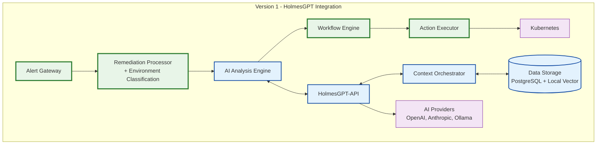
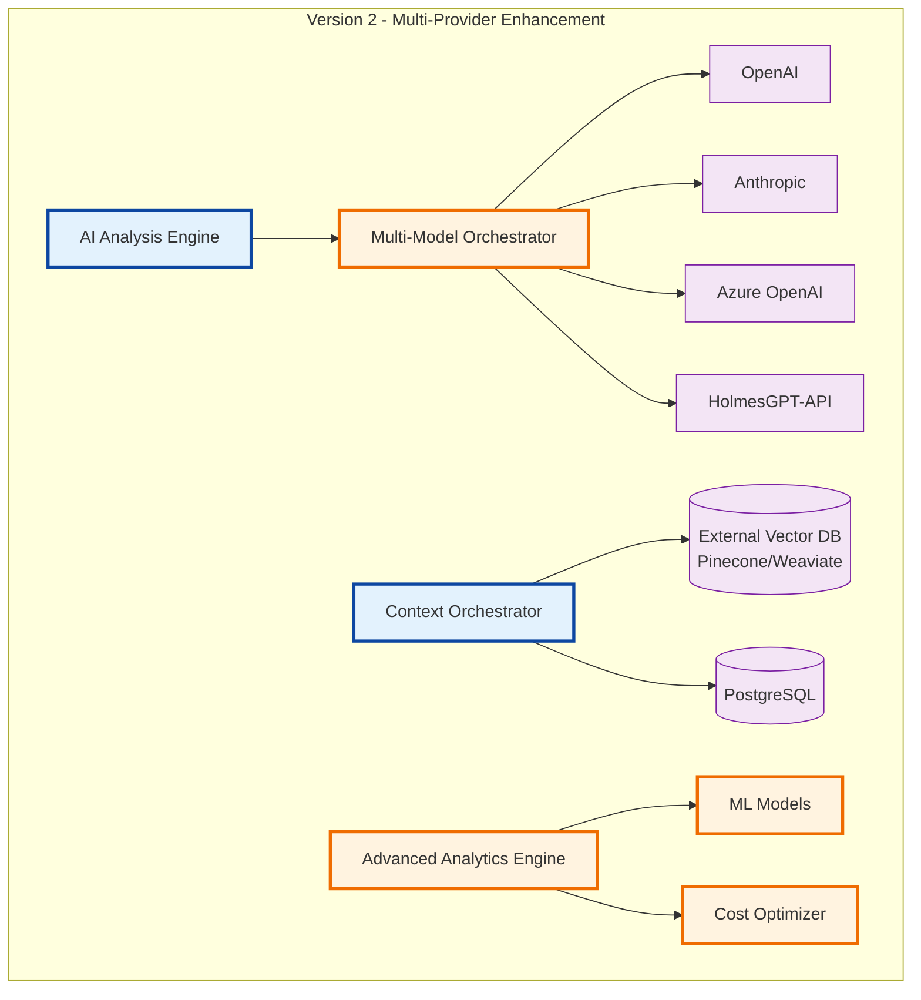
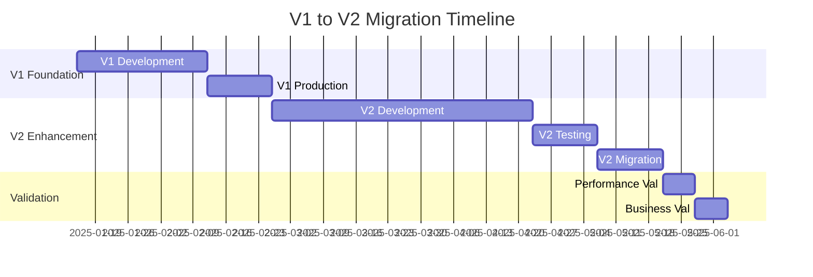

# Kubernaut Implementation Roadmap

**Document Version**: 2.0
**Date**: January 2025
**Status**: V1/V2 Development Strategy and Timeline
**Parent**: [Architecture Overview](KUBERNAUT_ARCHITECTURE_OVERVIEW.md)

---

## 🎯 **Implementation Strategy Overview**

This roadmap defines the phased implementation approach for Kubernaut, focusing on **V1 simplicity** for rapid deployment and **V2 sophistication** for advanced capabilities.

### **Strategic Principles**
- **🚀 V1 First**: Deliver core value quickly with proven technologies
- **🔄 Iterative Enhancement**: Build V2 capabilities on V1 foundation
- **⚡ Risk Mitigation**: Validate each phase before proceeding
- **📊 Measurable Progress**: Clear success criteria for each milestone

---

## 🚀 **Version 1 (V1) - Core Foundation**

### **V1 Objectives**
**Timeline**: 3-4 weeks development
**Risk Level**: LOW - Single integration point
**Confidence**: 95% success probability

#### **Primary Goals**
- ✅ **HolmesGPT-API Integration**: Single AI provider for investigation
- ✅ **Alert Tracking Implementation**: End-to-end traceability
- ✅ **Core Safety Mechanisms**: Investigation vs execution separation
- ✅ **Production Readiness**: 99.9% availability with monitoring

### **V1 Service Implementation Matrix**

| Service | V1 Implementation | Key Features | Success Criteria |
|---------|------------------|--------------|------------------|
| **Alert Gateway** | ✅ Full Implementation | HTTP webhooks, tracking initiation | <50ms forwarding, 99.9% uptime |
| **Remediation Processor** | ✅ Full Implementation | Lifecycle management, enrichment, environment classification | <5s processing, tracking ID creation, >99% production accuracy |
| **AI Analysis Engine** | 🔄 HolmesGPT-Only | Investigation via HolmesGPT-API | <10s analysis, 85% accuracy |
| **Workflow Engine** | ✅ Full Implementation | Orchestration, resilience | >90% success rate, <10% failures |
| **Action Executor** | ✅ Full Implementation | 25+ Kubernetes actions | >95% execution success |
| **HolmesGPT-API** | ✅ Full Implementation | Investigation service | Investigation-only, no execution |
| **Context Orchestrator** | 🔄 HolmesGPT-Optimized | Single-tier context management | <500ms retrieval, 85% relevance |
| **Data Storage** | ✅ PostgreSQL + Local Vector | Alert tracking, local embeddings | 99.9% availability, <100ms search |
| **Monitoring** | ✅ Full Implementation | System observability | 99.95% uptime, real-time metrics |
| **Notification** | ✅ Full Implementation | Multi-channel delivery | 95% delivery success |

### **V1 Architecture Diagram**


### **V1 Implementation Timeline**

#### **Week 1: Core Infrastructure**
```yaml
Days 1-2: Alert Gateway + Remediation Processor
  - HTTP webhook handling
  - Alert tracking ID generation
  - Basic lifecycle management

Days 3-4: Environment Classification + Data Storage
  - Integrate namespace classification into Remediation Processor
  - PostgreSQL integration
  - Alert tracking correlation

Days 5-7: Monitoring + Notification
  - System observability setup
  - Multi-channel notifications
  - Health check endpoints
```

#### **Week 2: AI Integration**
```yaml
Days 8-10: HolmesGPT-API Integration
  - Investigation service setup
  - API endpoint implementation
  - Safety validation (no execution)

Days 11-12: AI Analysis Engine
  - HolmesGPT coordination
  - Recommendation processing
  - Alert correlation

Days 13-14: Context Orchestrator
  - Dynamic context management
  - HolmesGPT optimization
  - Performance tuning
```

#### **Week 3: Workflow & Execution**
```yaml
Days 15-17: Workflow Engine
  - Orchestration logic
  - Resilience mechanisms
  - Learning framework

Days 18-19: Action Executor
  - Kubernetes operations
  - Safety validations
  - Rollback capabilities

Days 20-21: Integration Testing
  - End-to-end validation
  - Performance testing
  - Security validation
```

#### **Week 4: Production Readiness**
```yaml
Days 22-24: Production Deployment
  - Kubernetes manifests
  - Monitoring dashboards
  - Operational procedures

Days 25-26: Performance Optimization
  - Load testing
  - Performance tuning
  - Scalability validation

Days 27-28: Documentation & Training
  - Operational runbooks
  - User documentation
  - Team training
```

### **V1 Success Metrics**
```yaml
Performance Targets:
  - Alert processing: <5s end-to-end
  - System availability: 99.9% uptime
  - AI analysis accuracy: >85%
  - Action execution success: >95%

Business Value:
  - MTTR improvement: 40-60% faster
  - Alert tracking coverage: 100%
  - Investigation quality: 25% improvement
  - Operational cost reduction: 20%

Technical Excellence:
  - Code coverage: >90%
  - Security compliance: 100%
  - Documentation completeness: 95%
  - Monitoring coverage: 100%
```

---

## 🔄 **Version 2 (V2) - Advanced Capabilities**

### **V2 Objectives**
**Timeline**: 6-8 weeks development (after V1)
**Risk Level**: MEDIUM - Multi-provider complexity
**Confidence**: 85% success probability

#### **Primary Goals**
- 🔄 **Multi-Provider AI Orchestration**: Ensemble decision making
- 📊 **Advanced Analytics**: ML-driven performance optimization
- 🗄️ **External Vector Databases**: Enterprise-scale pattern matching
- 💰 **Cost Optimization**: Intelligent resource management

### **V2 Enhancement Matrix**

| Enhancement Category | V2 Capabilities | Business Impact | Success Metrics |
|---------------------|-----------------|-----------------|-----------------|
| **Multi-Provider AI** | OpenAI, Anthropic, Azure OpenAI orchestration | 30% cost reduction, 20% accuracy improvement | Cost per decision, accuracy rates |
| **Advanced ML Analytics** | Predictive optimization, performance modeling | 40% ROI improvement | Prediction accuracy >85% |
| **External Vector DBs** | Pinecone, Weaviate integration | 10M+ vector support | <100ms search for 10M+ vectors |
| **Intelligent Routing** | Context-aware provider selection | 25% performance improvement | Provider selection accuracy |
| **Cost Management** | Real-time cost tracking and optimization | 35% operational cost reduction | Cost optimization metrics |

### **V2 Architecture Diagram**


### **V2 Implementation Phases**

#### **Phase 2A: Multi-Provider Foundation (Weeks 5-6)**
```yaml
Week 5: Multi-Model Orchestrator
  - Provider abstraction layer
  - Routing algorithms
  - Fallback mechanisms

Week 6: Provider Integration
  - OpenAI integration
  - Anthropic integration
  - Azure OpenAI integration
```

#### **Phase 2B: Advanced Analytics (Weeks 7-8)**
```yaml
Week 7: ML Analytics Engine
  - Performance prediction models
  - Cost optimization algorithms
  - Pattern recognition enhancement

Week 8: Advanced Optimization
  - Real-time cost tracking
  - Predictive scaling
  - ROI analytics
```

#### **Phase 2C: External Vector Integration (Weeks 9-10)**
```yaml
Week 9: Vector Database Integration
  - Pinecone integration
  - Weaviate integration
  - Migration tools

Week 10: Enterprise Scaling
  - 10M+ vector support
  - Advanced embedding models
  - Performance optimization
```

#### **Phase 2D: Production Enhancement (Weeks 11-12)**
```yaml
Week 11: Advanced Features
  - Ensemble decision making
  - Intelligent cost management
  - Advanced monitoring

Week 12: Production Deployment
  - V2 rollout strategy
  - Performance validation
  - User training
```

### **V2 Success Metrics**
```yaml
Advanced Performance:
  - Multi-provider failover: <2s
  - ML prediction accuracy: >85%
  - Vector search performance: <100ms for 10M+ vectors
  - Cost optimization: 30% reduction

Business Value Enhancement:
  - ROI improvement: 40%
  - Decision accuracy: 20% improvement
  - Operational efficiency: 60-80% improvement
  - Enterprise scalability: 10M+ patterns

Technical Excellence:
  - Provider diversity: 4+ AI providers
  - ML model accuracy: >90%
  - Vector database performance: enterprise-scale
  - Cost visibility: real-time tracking
```

---

## 🔄 **Migration Strategy: V1 to V2**

### **Migration Principles**
- **🔄 Zero Downtime**: Gradual rollout with fallback capabilities
- **📊 A/B Testing**: Compare V1 vs V2 performance
- **⚡ Risk Mitigation**: Rollback to V1 if issues detected
- **📈 Continuous Monitoring**: Real-time performance tracking

### **Migration Timeline**


### **Migration Phases**

#### **Phase M1: Preparation (Week 1)**
```yaml
Infrastructure Preparation:
  - V2 environment setup
  - External service provisioning
  - Migration tooling development

Risk Assessment:
  - Performance baseline establishment
  - Rollback procedure validation
  - Monitoring enhancement
```

#### **Phase M2: Gradual Rollout (Weeks 2-3)**
```yaml
Week 2: Canary Deployment
  - 10% traffic to V2 services
  - Performance comparison
  - Error rate monitoring

Week 3: Progressive Rollout
  - 50% traffic to V2 services
  - Feature validation
  - User feedback collection
```

#### **Phase M3: Full Migration (Week 4)**
```yaml
Full V2 Deployment:
  - 100% traffic to V2 services
  - V1 services in standby mode
  - Complete feature validation

V1 Decommission:
  - V1 service shutdown
  - Resource cleanup
  - Documentation updates
```

---

## ⚠️ **Risk Assessment and Mitigation**

### **V1 Implementation Risks**

| Risk Category | Probability | Impact | Mitigation Strategy |
|---------------|-------------|--------|-------------------|
| **HolmesGPT Integration** | LOW | MEDIUM | Comprehensive API testing, fallback mechanisms |
| **Performance Targets** | MEDIUM | HIGH | Load testing, performance optimization |
| **Alert Tracking Complexity** | LOW | MEDIUM | Incremental implementation, thorough testing |
| **Production Readiness** | LOW | HIGH | Extensive monitoring, operational procedures |

### **V2 Enhancement Risks**

| Risk Category | Probability | Impact | Mitigation Strategy |
|---------------|-------------|--------|-------------------|
| **Multi-Provider Complexity** | MEDIUM | HIGH | Phased rollout, provider abstraction |
| **ML Model Accuracy** | MEDIUM | MEDIUM | Extensive training data, validation |
| **External Vector DB** | MEDIUM | MEDIUM | Multiple provider options, migration tools |
| **Cost Optimization** | LOW | MEDIUM | Real-time monitoring, budget controls |

### **Migration Risks**

| Risk Category | Probability | Impact | Mitigation Strategy |
|---------------|-------------|--------|-------------------|
| **Service Disruption** | LOW | HIGH | Zero-downtime deployment, rollback procedures |
| **Performance Regression** | MEDIUM | MEDIUM | A/B testing, performance monitoring |
| **Data Migration** | LOW | HIGH | Incremental migration, data validation |
| **User Adoption** | MEDIUM | LOW | Training programs, documentation |

---

## 📊 **Success Validation Framework**

### **V1 Validation Criteria**
```yaml
Technical Validation:
  - All services deployed and healthy
  - Performance targets met
  - Security compliance verified
  - Monitoring coverage complete

Business Validation:
  - Alert processing improvement measured
  - MTTR reduction validated
  - User satisfaction >85%
  - Cost reduction achieved

Operational Validation:
  - 99.9% availability maintained
  - Incident response procedures tested
  - Team training completed
  - Documentation validated
```

### **V2 Validation Criteria**
```yaml
Enhanced Technical Validation:
  - Multi-provider orchestration functional
  - ML models performing within targets
  - External vector databases operational
  - Cost optimization active

Advanced Business Validation:
  - ROI improvement >40%
  - Decision accuracy improvement >20%
  - Enterprise scalability demonstrated
  - Advanced features adopted

Operational Excellence:
  - Zero-downtime migration completed
  - Advanced monitoring operational
  - Team expertise enhanced
  - Customer satisfaction >90%
```

---

## 🔗 **Related Documentation**

### **Architecture Documentation**
- **[Architecture Overview](KUBERNAUT_ARCHITECTURE_OVERVIEW.md)** - High-level system design
- **[Service Catalog](KUBERNAUT_SERVICE_CATALOG.md)** - Detailed service specifications
- **[Integration Patterns](KUBERNAUT_INTEGRATION_PATTERNS.md)** - Service interaction flows

### **Implementation Guides**
- **[APDC Development Methodology](../development/methodology/APDC_FRAMEWORK.md)** - Development process
- **[Testing Framework](../TESTING_FRAMEWORK.md)** - Quality assurance approach
- **[Deployment Guide](../deployment/)** - Production deployment procedures

### **Business Context**
- **[Business Requirements Overview](../requirements/00_REQUIREMENTS_OVERVIEW.md)** - Complete requirements
- **[Project Status](../status/)** - Current implementation status
- **[Planning Documents](../planning/)** - Strategic planning resources

---

## 🎯 **Executive Summary**

### **V1 Delivery Promise**
- **⚡ 3-4 weeks to production** with core HolmesGPT integration
- **🛡️ 95% confidence** in successful delivery
- **📊 40-60% MTTR improvement** through intelligent investigation
- **💰 20% operational cost reduction** through automation

### **V2 Enhancement Vision**
- **🚀 6-8 weeks additional development** for advanced capabilities
- **📈 40% ROI improvement** through ML-driven optimization
- **🌐 Enterprise-scale capabilities** with 10M+ vector support
- **🎯 60-80% operational efficiency** improvement

### **Strategic Value**
- **🔄 Iterative delivery** reduces risk and accelerates value realization
- **📊 Measurable outcomes** at each phase with clear success criteria
- **⚡ Production-ready foundation** enables rapid enhancement cycles
- **🎯 Business-driven development** ensures maximum value delivery

---

*This implementation roadmap provides a clear path from V1 foundation to V2 advanced capabilities, with detailed timelines, risk mitigation, and success validation frameworks.*
