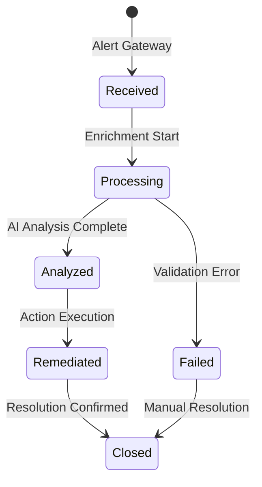
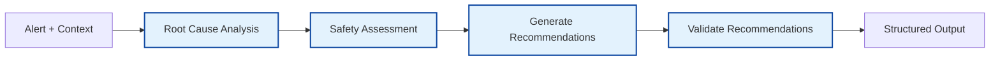

# Kubernaut Service Catalog

**Document Version**: 3.0
**Date**: January 2025
**Status**: V1 Implementation Focus (10 Services)
**Parent**: [Architecture Overview](KUBERNAUT_ARCHITECTURE_OVERVIEW.md)

---

## 📋 **V1 Service Catalog Overview**

This document provides detailed specifications for the **10 V1 core services** in the Kubernaut architecture, organized by functional category with clear responsibilities and integration points.

### **V1 Implementation Strategy**
**Complete V1 Strategy**: See [Implementation Roadmap](KUBERNAUT_IMPLEMENTATION_ROADMAP.md) for detailed V1 timeline, HolmesGPT-API integration approach, and implementation confidence assessment.

---

## 🎯 **Core Processing Services**

### **1. Alert Gateway Service**

#### **Single Responsibility**
HTTP alert reception, tracking initiation, and circuit breaker monitoring

#### **Business Requirements**
- **Primary**: BR-WH-001 to BR-WH-026
- **Enhanced**: BR-GATEWAY-METRICS-001 to BR-GATEWAY-METRICS-005

#### **Key Capabilities**
```yaml
Performance:
  - Webhook processing: <50ms forwarding time
  - Throughput: 10,000 requests/minute
  - Availability: 99.9% uptime target

Security:
  - Request validation and sanitization
  - Rate limiting and DDoS protection
  - TLS termination and certificate management

Monitoring:
  - Circuit breaker metrics and analytics
  - Failure pattern recognition
  - Predictive analytics for proactive monitoring
```

#### **Integration Points**
- **Receives From**: Prometheus, Grafana, external monitoring systems
- **Sends To**: Remediation Processor (primary), Data Storage (metrics)
- **Dependencies**: None (entry point service)

#### **API Endpoints**
```yaml
POST /webhook/prometheus:
  description: Primary Prometheus webhook endpoint
  response_time: <50ms

POST /webhook/grafana:
  description: Grafana alert webhook endpoint
  response_time: <50ms

GET /health:
  description: Service health check
  response_time: <10ms
```

---

### **2. Remediation Processor Service**

#### **Single Responsibility**
Alert lifecycle management, enrichment, environment classification, and AI coordination

#### **Business Requirements**
- **Primary**: BR-SP-001 to BR-SP-025
- **Enhanced**: BR-AI-COORD-V1-001 to BR-AI-COORD-V1-003
- **Environment**: BR-ENV-001 to BR-ENV-050 (integrated component)

#### **Key Capabilities**
```yaml
Lifecycle Management:
  - Unique tracking ID generation: <100ms
  - State transitions: received → processing → analyzed → remediated → closed
  - End-to-end audit trail support

Enrichment:
  - Context enrichment from multiple sources
  - Alert filtering and normalization: 90% accuracy
  - Correlation metadata generation
  - Environment classification: >99% production accuracy

Environment Classification (Integrated Component):
  - Kubernetes-native metadata classification
  - Multi-source validation (labels, annotations, ConfigMap, patterns)
  - Business priority mapping and SLA-aware processing
  - <10ms classification time (in-process)

AI Coordination:
  - Single-provider AI coordination (v1)
  - Processing result management with analytics
  - Adaptive configuration and learning optimization
```

#### **Integration Points**
- **Receives From**: Alert Gateway
- **Sends To**: AI Analysis Engine (enriched alerts + environment context), Data Storage, Monitoring Service
- **Dependencies**: Data Storage (required), Kubernetes API (environment classification), Context Orchestrator (optional)

#### **State Management**


---

### **3. Resilient Remediation Execution Engine Service**

#### **Single Responsibility**
Workflow orchestration, coordination, and feedback-driven learning

#### **Business Requirements**
- **Primary**: BR-WF-001 to BR-WF-165
- **Enhanced**: BR-WF-HOLMESGPT-001 to BR-WF-HOLMESGPT-005
- **Learning**: BR-WF-LEARN-V1-001 to BR-WF-LEARN-V1-003

#### **Key Capabilities**
```yaml
Orchestration:
  - Multi-step workflow creation and execution
  - Dependency management with alert-driven prioritization
  - >90% execution success rate

Resilience:
  - <10% termination rate through intelligent recovery
  - Partial success execution with graceful degradation
  - Alternative execution paths for failure scenarios

Learning:
  - ≥80% confidence threshold for adaptive strategies
  - Pattern recognition accuracy ≥75%
  - ≥15% performance gains through continuous optimization
```

#### **Integration Points**
- **Receives From**: AI Analysis Engine (recommendations)
- **Sends To**: Action Executor (validated actions), Data Storage (results)
- **Dependencies**: Action Executor (required), HolmesGPT-API (investigation)

#### **Workflow Patterns**
```yaml
Simple Workflow:
  steps: [validate, execute, verify]
  success_rate: >95%

Complex Workflow:
  steps: [analyze, plan, validate, execute, monitor, verify]
  success_rate: >90%
  recovery_paths: 3-5 alternatives

Critical Workflow:
  steps: [investigate, assess_risk, get_approval, execute, monitor]
  success_rate: >99%
  rollback_capability: required
```

---

## 🔍 **Investigation Services**

### **4. AI Analysis Engine Service** ✅ **V1 CORE**

#### **Single Responsibility**
AI-powered investigation and recommendation generation via **HolmesGPT-API only** (NO EXECUTION)

#### **V1 Implementation Scope**
- **🎯 V1 Focus**: HolmesGPT-API integration only (no direct LLM providers)
- **🔄 V2 Enhancement**: Multi-provider orchestration with OpenAI, Anthropic, Azure OpenAI
- **📊 V1 Risk**: LOW - Single integration point
- **✅ V1 Confidence**: 95% success probability

#### **Business Requirements**
- **Primary**: BR-AI-001 to BR-AI-033
- **Enhanced**: BR-AI-TRACK-001, BR-AI-PERF-V1-001 to BR-AI-PERF-V1-003

#### **V1 Key Capabilities**
```yaml
V1 Investigation (HolmesGPT-Only):
  - Root cause analysis via HolmesGPT-API
  - Safety assessment and recommendation generation
  - NO infrastructure execution capabilities
  - NO direct LLM provider integration (V2 feature)

V1 Performance:
  - Analysis completion: <10s (v1 target)
  - Quality scoring: 85% investigation quality (V1 baseline)
  - HolmesGPT coordination: <2s response time

V1 Integration:
  - Single AI provider: HolmesGPT-API only
  - Alert tracking correlation for all operations
  - Graceful degradation when HolmesGPT unavailable
```

#### **Integration Points**
- **Receives From**: Remediation Processor (enriched alerts + environment context), Context Orchestrator
- **Sends To**: Remediation Execution Engine (recommendations), Data Storage (results)
- **Dependencies**: HolmesGPT-API (primary), Context Orchestrator (context)

#### **Analysis Pipeline**


---

### **5. Context API Service** ✅ **V1 CORE**

#### **Single Responsibility**
**HolmesGPT-Optimized** historical intelligence and pattern analysis service (single-tier context management)

#### **V1 Implementation Scope**
- **🎯 V1 Focus**: HolmesGPT-optimized context management with local PostgreSQL vector search
- **🔄 V2 Enhancement**: External vector databases (Pinecone, Weaviate) for enterprise scale
- **📊 V1 Risk**: LOW - Single database integration
- **✅ V1 Confidence**: 90% success probability

#### **Business Requirements**
- **Primary**: BR-CONTEXT-001 to BR-CONTEXT-050
- **Enhanced**: BR-HOLMES-001 to BR-HOLMES-030 (toolset integration)
- **API**: BR-API-001 to BR-API-015 (RESTful endpoints)
- **Optimization**: BR-CONTEXT-OPT-V1-001 to BR-CONTEXT-OPT-V1-003

#### **V1 Key Capabilities**
```yaml
V1 Historical Intelligence (Local Vector):
  - Action history retrieval: <100ms for cached patterns
  - PostgreSQL vector similarity search: >85% accuracy (V1 baseline)
  - Effectiveness analysis: Historical success rate correlation
  - NO external vector database integration (V2 feature)

V1 Context Orchestration (HolmesGPT-Optimized):
  - Single-tier context management for HolmesGPT
  - Local caching: 80%+ cache hit rate for repeated patterns
  - Context quality scoring: 85% relevance scores (V1 target)
  - Context retrieval: <500ms (V1 target)
  - NO multi-provider optimization (V2 feature)

V1 API Endpoints:
  - /api/v1/context/action-history/{alertType}: Historical action patterns
  - /api/v1/context/patterns/{signature}: Local vector similarity search
  - /api/v1/context/kubernetes/{namespace}/{resource}: Cluster context
  - /health: Service health and readiness checks

V1 Context Types:
  - Historical Context: Action history, effectiveness, local pattern recognition
  - Kubernetes Context: Pod, Node, Event data (basic metrics)
  - NO advanced metrics context (V2 feature)
```

#### **Integration Points**
- **Receives From**: HolmesGPT-API (context requests), AI Analysis Engine (investigation context)
- **Sends To**: HolmesGPT-API (historical intelligence), AI Analysis Engine (enriched context)
- **Dependencies**: Data Storage (required for action history), Vector Database (pattern matching), Kubernetes API (context sources)

#### **Service Specifications**
- **Port**: 8091 (HTTP API)
- **Metrics Port**: 9092 (Prometheus metrics)
- **Response Time**: <100ms cached, <500ms fresh data
- **Availability**: 99.9% uptime requirement
- **Scalability**: Horizontal scaling for investigation load

---

### **6. HolmesGPT-API Service**

#### **Single Responsibility**
AI investigation service with strategy analysis (INVESTIGATION ONLY, NO EXECUTION)

#### **Business Requirements**
- **Primary**: BR-HAPI-INVESTIGATION-001 to BR-HAPI-POSTEXEC-005
- **Enhanced**: BR-HAPI-STRATEGY-V1-001 to BR-HAPI-STRATEGY-V1-003

#### **Key Capabilities**
```yaml
Investigation Only:
  - Root cause analysis and pattern recognition
  - Recovery strategy analysis and safety assessment
  - Post-execution analysis for continuous learning

API Endpoints:
  - /api/v1/investigate: Primary investigation endpoint
  - /api/v1/recovery/analyze: Recovery strategy analysis
  - /api/v1/safety/analyze: Action safety assessment
  - /api/v1/patterns/historical: Historical pattern analysis

Performance:
  - >80% historical success rate for recommended strategies
  - Statistical significance validation (p-value ≤ 0.05)
  - 40% quality improvement through investigation enhancement
```

#### **Integration Points**
- **Receives From**: AI Analysis Engine, Context Orchestrator
- **Sends To**: AI Analysis Engine (investigation results)
- **Dependencies**: AI Providers (OpenAI, Anthropic, Ollama), Kubernetes API (read-only)

#### **Toolset Framework**
```yaml
Built-in Toolsets:
  - Kubernetes: Read-only cluster data access
  - Prometheus: Metrics and alerting data
  - Grafana: Dashboard and visualization data

Custom Toolsets:
  - Dynamic toolset configuration
  - Service discovery integration
  - Custom data source connectors
```

---

## ⚡ **Execution Services**

### **7. Action Executor Service**

#### **Single Responsibility**
Infrastructure changes and Kubernetes operations execution

#### **Business Requirements**
- **Primary**: BR-EX-001 to BR-EX-155
- **Enhanced**: BR-WF-EXECUTOR-001 to BR-WF-EXECUTOR-005

#### **Key Capabilities**
```yaml
Execution:
  - 25+ Kubernetes remediation actions
  - Multi-cluster operations support
  - >95% action execution success rate

Safety:
  - Comprehensive safety validation mechanisms
  - RBAC enforcement and permission checks
  - Rollback capabilities for all destructive actions

Integration:
  - KubernetesActionExecutor: Pod, deployment, scaling operations
  - MonitoringActionExecutor: Metrics and alerting actions
  - CustomActionExecutor: Extensible action framework
```

#### **Integration Points**
- **Receives From**: Remediation Execution Engine (validated actions)
- **Sends To**: Kubernetes Clusters, Data Storage (results), Monitoring Service
- **Dependencies**: Kubernetes API (required), RBAC (required)

#### **Action Categories**
```yaml
Pod Operations:
  - restart_pod, quarantine_pod, migrate_workload
  - Success rate: >98%

Scaling Operations:
  - scale_deployment, increase_resources, update_hpa
  - Success rate: >95%

Node Operations:
  - drain_node, cordon_node, restart_daemonset
  - Success rate: >90% (higher complexity)

Storage Operations:
  - expand_pvc, cleanup_storage, backup_data
  - Success rate: >93%
```

---

## 🔧 **Infrastructure Services**

### **8. Data Storage Service**

#### **Single Responsibility**
Alert tracking correlation, data persistence, and vector operations

#### **Business Requirements**
- **Primary**: BR-STOR-001 to BR-STOR-135
- **Enhanced**: BR-HIST-002, BR-VECTOR-V1-001 to BR-VECTOR-V1-003

#### **Key Capabilities**
```yaml
Alert Tracking:
  - End-to-end traceability with tracking ID correlation
  - Complete audit trail for compliance and debugging
  - Alert lifecycle state transitions and timestamps

Data Persistence:
  - PostgreSQL integration: 99.9% availability
  - ACID compliance for critical data
  - Backup and recovery procedures

Vector Operations (v1):
  - Local embedding generation: multi-technique approach
  - Similarity search: >90% relevance, <100ms response
  - Memory and PostgreSQL integration: <1s failover
```

#### **Integration Points**
- **Receives From**: All services (data persistence)
- **Sends To**: Intelligence Engine (patterns), Context Orchestrator (history)
- **Dependencies**: PostgreSQL (required), Redis (caching, optional)

#### **Data Models**
```yaml
Alert Tracking:
  - alert_id, tracking_id, lifecycle_state
  - timestamps, correlation_metadata
  - audit_trail, state_transitions

Action History:
  - action_type, parameters, execution_results
  - effectiveness_scores, learning_data
  - correlation_with_alerts

Vector Data (v1):
  - 384-dimensional embeddings
  - Normalized magnitude vectors
  - Similarity search indexes
```

---

### **9. Monitoring Service**

#### **Single Responsibility**
System observability and performance monitoring

#### **Business Requirements**
- **Primary**: BR-MET-001 to BR-MET-050
- **Enhanced**: BR-PERF-001 to BR-PERF-035

#### **Key Capabilities**
```yaml
Metrics Collection:
  - System performance metrics
  - Service health indicators
  - Business KPI tracking

Performance Monitoring:
  - Real-time performance analysis
  - Trend detection and alerting
  - Capacity planning data

Observability:
  - 99.95% monitoring infrastructure uptime
  - 100,000 metrics per second ingestion
  - <1% performance monitoring overhead
```

#### **Integration Points**
- **Receives From**: All services (metrics), Action Executor (execution metrics)
- **Sends To**: Notification Service (alerts), Data Storage (historical data)
- **Dependencies**: Prometheus (metrics), Grafana (dashboards, optional)

---

### **10. Notification Controller** 🆕

**Service Type**: CRD Controller (migrated from stateless HTTP API, 2025-10-12)
**Documentation**: [06-notification/](../services/crd-controllers/06-notification/)

#### **Single Responsibility**
Multi-channel notification delivery with CRD-based persistence, automatic retry, and zero data loss guarantee

#### **Business Requirements**
- **Primary**: BR-NOT-001 to BR-NOT-058
- **NEW**: BR-NOT-050 to BR-NOT-058 (CRD-specific: data loss prevention, audit trail, automatic retry)
- **Enhanced**: BR-NOT-016 (delivery tracking), BR-NOT-051 (complete audit trail)

#### **Key Capabilities**
```yaml
CRD-Based Persistence:
  - NotificationRequest CRD for durable state
  - Zero data loss guarantee (etcd persistence)
  - At-least-once delivery semantics

Multi-Channel Delivery:
  - Slack, Teams, Email integration
  - SMS and webhook notifications
  - 95% delivery success rate

Automatic Retry:
  - Exponential backoff retry logic
  - Per-channel graceful degradation
  - Automatic reconciliation loop

Complete Audit Trail:
  - All delivery attempts tracked in CRD status
  - Long-term audit storage via Data Storage service
  - Real-time delivery status observability

Escalation Management:
  - Configurable escalation policies
  - Priority-based routing (Critical notifications first)
  - Delivery confirmation tracking

Alert Correlation:
  - Enhanced delivery tracking with alert correlation
  - Notification effectiveness measurement
  - User response analytics
```

#### **Integration Points**
- **Receives From**: RemediationOrchestrator (creates NotificationRequest CRDs), Remediation Execution Engine (action results)
- **Sends To**: External notification systems (Slack, Teams, Email), Data Storage (audit trail)
- **Dependencies**: NotificationRequest CRD (required), External notification APIs (required), Data Storage (optional, for long-term audit)
- **Architecture Change**: Migrated from stateless HTTP API to CRD controller for data loss prevention and complete audit trail

---

## 📊 **Service Interaction Matrix**

### **Service Dependencies**
| Service | Required Dependencies | Optional Dependencies | External Dependencies |
|---------|----------------------|----------------------|----------------------|
| **Alert Gateway** | None | Data Storage | Prometheus, Grafana |
| **Remediation Processor** | Data Storage | Context Orchestrator | None |
| **Environment Classifier** | Kubernetes API, Data Storage | None | None |
| **AI Analysis Engine** | HolmesGPT-API | Context Orchestrator | None |
| **Remediation Execution Engine** | Action Executor | HolmesGPT-API | None |
| **Action Executor** | Kubernetes API | RBAC Service | Kubernetes Clusters |
| **HolmesGPT-API** | AI Providers | Kubernetes API | OpenAI, Anthropic, Ollama |
| **Context Orchestrator** | Data Storage | Kubernetes API | None |
| **Data Storage** | PostgreSQL | Redis | None |
| **Monitoring** | Prometheus | Grafana | None |
| **Notification** | External APIs, Data Storage | NotificationRequest CRD | Slack, Teams, Email |

### **Performance Requirements Summary**
| Service | Response Time | Throughput | Availability |
|---------|---------------|------------|--------------|
| **Alert Gateway** | <50ms | 10,000/min | 99.9% |
| **Remediation Processor** | <5s | 1,000/min | 99.5% |
| **AI Analysis Engine** | <10s | 100/min | 99.0% |
| **Remediation Execution Engine** | <30s | 500/min | 99.5% |
| **Action Executor** | <60s | 200/min | 99.0% |
| **HolmesGPT-API** | <15s | 50/min | 95.0% |
| **Context Orchestrator** | <500ms | 2,000/min | 99.0% |
| **Data Storage** | <100ms | 10,000/min | 99.9% |
| **Monitoring** | <1s | 100,000/min | 99.95% |
| **Notification** | <5s | 1,000/min | 95.0% |

---

## 🔄 **V2 Future Services (Post V1 Implementation)**

The following 5 services will be added in V2 to provide advanced capabilities:

### **V2 Enhancement Services**
1. **🧠 Multi-Model Orchestration Service** (8092) - Ensemble AI decision making with OpenAI, Anthropic, Azure OpenAI
2. **🔍 Intelligence Service** (8086) - Advanced pattern discovery & ML analytics
3. **📈 Effectiveness Monitor Service** (8080) - Performance assessment & optimization
4. **🔐 Security & Access Control Service** (8093) - RBAC, authentication & secrets management
5. **💚 Enhanced Health Monitoring Service** (8096) - LLM health & enterprise monitoring

### **V2 Implementation Timeline**
- **Phase 2A**: Multi-Provider Foundation (Weeks 5-6)
- **Phase 2B**: Advanced Analytics (Weeks 7-8)
- **Phase 2C**: External Vector Integration (Weeks 9-10)
- **Phase 2D**: Production Enhancement (Weeks 11-12)

### **V2 Success Metrics**
- **Multi-provider failover**: <2s
- **ML prediction accuracy**: >85%
- **Vector search performance**: <100ms for 10M+ vectors
- **Cost optimization**: 30% reduction

---

## 🔗 **Related Documentation**

- **[Architecture Overview](KUBERNAUT_ARCHITECTURE_OVERVIEW.md)** - High-level system design
- **[Integration Patterns](KUBERNAUT_INTEGRATION_PATTERNS.md)** - Service interaction flows
- **[Implementation Roadmap](KUBERNAUT_IMPLEMENTATION_ROADMAP.md)** - V1/V2 development strategy
- **[Business Requirements](../requirements/00_REQUIREMENTS_OVERVIEW.md)** - Complete requirements specification

---

## 📋 **BUSINESS REQUIREMENTS MAPPING**

### **Centralized BR Reference**
For detailed business requirement mappings referenced throughout the architecture documents:

| Service Category | Business Requirements | Documentation |
|------------------|----------------------|---------------|
| **Gateway & Processing** | BR-WH-001 to BR-WH-026, BR-SP-001 to BR-SP-050 | Alert reception and processing |
| **AI & Intelligence** | BR-AI-001 to BR-AI-050, BR-CONTEXT-001 to BR-CONTEXT-180 | AI analysis and context orchestration |
| **Workflow & Execution** | BR-WF-001 to BR-WF-165, BR-EX-001 to BR-EX-155 | Workflow orchestration and K8s operations |
| **Data & Storage** | BR-STOR-001 to BR-STOR-135, BR-VDB-001 to BR-VDB-030 | Data persistence and vector operations |
| **Monitoring & Notifications** | BR-MET-001 to BR-OSC-020, BR-NOT-001 to BR-NOT-058 | Observability and CRD-based notifications |
| **HolmesGPT Integration** | BR-HAPI-001 to BR-HAPI-185, BR-HOLMES-001 to BR-HOLMES-030 | AI investigation wrapper and toolsets |

**Note**: Complete business requirements documentation is available in [`../requirements/`](../requirements/) directory.

---

*This service catalog provides detailed specifications for all Kubernaut services. Each service has a single, well-defined responsibility with clear integration points and performance targets.*
