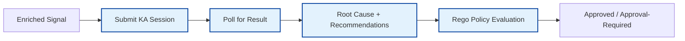
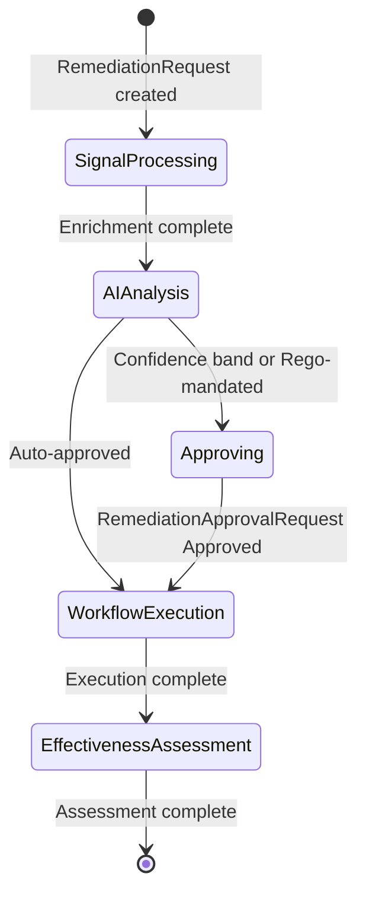

# Kubernaut Service Catalog

**Document Version**: 4.0
**Date**: August 2026

## Changelog

### Version 4.0 (2026-08, Issue #1806)

**Full architectural-accuracy rewrite**: Corrected the "8 V1.0 services, 2 deferred" framing to the real **12 active production services**. Replaced all HolmesGPT-API/HAPI and Context API entries with the current Kubernaut Agent (KA) integration (native Go, async submit/poll). Removed the standalone "Action Executor" entry — its responsibilities were absorbed by WorkflowExecution's execution engines (Tekton/Job/Ansible-AWX) and no standalone executor was ever built (ADR-025). Added dedicated entries for Remediation Orchestrator, Kubernaut Agent, Effectiveness Monitor (now V1.0 Level 1 active, not V1.1-deferred), apifrontend, Auth Webhook, and Fleet Metadata Cache. Reclassified "Monitoring Service" as external infrastructure (Prometheus/Grafana), not a Kubernaut microservice. Fixed the Effectiveness Monitor documentation link to `07-effectivenessmonitor/`. Preserved all existing `BR-*` identifiers unchanged per ID-preservation policy; legacy `BR-HAPI-*`/`BR-HOLMES-*` IDs are retained for historical traceability only and flagged as such below.

**Status**: **CURRENT PRODUCTION ARCHITECTURE** (12 active services)

### Version 3.2 (2025-12-01) — STALE, superseded by 4.0

DD-016 & DD-017 Integration: Updated V1.0 service count from 10 to 8 (Dynamic Toolset deferred to V2.0, Effectiveness Monitor deferred to V1.1). This framing is no longer accurate: Effectiveness Monitor Level 1 shipped in V1.0 (DD-017 v2.0, Feb 2026), and the HolmesGPT-API/Context API architecture this version described was replaced by Kubernaut Agent before reaching GA.

### Version 3.1 (2025-11-15)

**Service Naming Corrections**: Updated "Workflow Engine" → "Remediation Execution Engine" per ADR-035. Superseded by this document's current name, **Workflow Execution** (`cmd/workflowexecution`), which also reflects the 3-engine (Tekton/Job/Ansible-AWX) design rather than Tekton-only.

**Parent**: [Architecture Overview](KUBERNAUT_ARCHITECTURE_OVERVIEW.md)

---

## 📋 **Service Catalog Overview**

This document provides detailed specifications for the **12 active services** in the current Kubernaut production architecture, organized by functional category. For the authoritative full decomposition (ports, dependency diagrams, dead-component history), see [Approved Microservices Architecture](APPROVED_MICROSERVICES_ARCHITECTURE.md).

| Category | Services |
|----------|----------|
| **Core Remediation Pipeline** (5) | Gateway, Signal Processing, AI Analysis, Workflow Execution, Remediation Orchestrator |
| **AI Engine** (1) | Kubernaut Agent (KA) |
| **Support Services** (3) | Data Storage, Notification, Effectiveness Monitor |
| **External-Facing & Platform Services** (3) | apifrontend (AF), Auth Webhook, Fleet Metadata Cache (FMC) |

**Not Kubernaut services** (do not confuse with the above): Prometheus, Grafana, and Jaeger are external infrastructure the platform queries/integrates with — not services in this catalog.

---

## 🎯 **Core Remediation Pipeline**

### **1. Gateway Service**

#### **Single Responsibility**
HTTP signal reception (AlertManager webhooks, Kubernetes Events), deduplication by fingerprint, owner-chain resolution, and `RemediationRequest` CRD creation

#### **Service Type**
Stateless HTTP — runs **no `ctrl.Manager`**; creates CRDs via a plain Kubernetes client (`cmd/gateway`)

#### **Business Requirements**
- **Primary**: BR-WH-001 to BR-WH-026 (legacy prefix; current work also tracked under BR-GATEWAY-* — see [`docs/requirements/`](../requirements/))
- **Enhanced**: BR-GATEWAY-METRICS-001 to BR-GATEWAY-METRICS-005

#### **Key Capabilities**
```yaml
Performance:
  - Webhook processing: <50ms forwarding time
  - Availability: 99.9% uptime target

Security:
  - Request validation and sanitization
  - Rate limiting
  - TLS termination

Processing:
  - Fingerprint-based deduplication
  - Owner-chain resolution
  - RemediationRequest CRD creation
```

#### **Integration Points**
- **Receives From**: Prometheus/AlertManager, Kubernetes Events, external monitoring systems
- **Sends To**: Remediation Orchestrator (via `RemediationRequest` CRD creation), Data Storage (audit events)
- **Dependencies**: None (entry point service)

#### **Ports** (per [Stateless Services Port Standard](STATELESS_SERVICES_PORT_STANDARD.md))
API `8080`, health `8081`, metrics `9090`

---

### **2. Signal Processing Service**

#### **Single Responsibility**
Signal enrichment, environment/severity/priority classification, and owner-chain traversal

#### **Service Type**
CRD controller (`cmd/signalprocessing`) — health `8081`, metrics `9090`, no business API port

#### **Business Requirements**
- **Primary**: BR-SP-001 to BR-SP-112 (see e.g. [BR-SP-106](../requirements/BR-SP-106-proactive-signal-mode-classification.md), [BR-SP-112](../requirements/BR-SP-112-cluster-scoped-label-exposure.md))
- **Environment**: BR-ENV-001 to BR-ENV-050 (integrated component — no standalone "Environment Classification Service" was ever built)

#### **Key Capabilities**
```yaml
Enrichment:
  - Kubernetes context enrichment from multiple sources
  - Owner-chain traversal
  - Custom label detection

Environment Classification (Integrated Component):
  - Kubernetes-native metadata classification
  - Multi-source validation (labels, annotations, ConfigMap, patterns)
  - Business priority mapping and SLA-aware processing
```

#### **Integration Points**
- **Receives From**: Remediation Orchestrator (creates `SignalProcessing` CRD)
- **Sends To**: Remediation Orchestrator (status update), Data Storage (audit events)
- **Dependencies**: Kubernetes API (required), Data Storage (audit)

---

### **3. AI Analysis Service**

#### **Single Responsibility**
Root-cause analysis and workflow selection via **asynchronous** Kubernaut Agent investigation, gated by Rego policy for approval routing

#### **Service Type**
CRD controller (`cmd/aianalysis`) — API `8080`, health `8081`, metrics `9090`

#### **V1.0 Implementation Scope**
- **🎯 Focus**: Kubernaut Agent (KA) integration via **async submit/poll** (`pkg/agentclient`) — never a single synchronous call
- **🔐 Approval Gating**: Rego policy evaluation (`pkg/aianalysis/rego/evaluator.go`) determines whether a `RemediationApprovalRequest` is required before WorkflowExecution proceeds
- **🔄 Historical naming note**: [BR-AA-KA-064](../requirements/BR-AA-KA-064-session-based-pull-design.md) — the `HAPI` token in this BR ID is a legacy naming artifact; the requirement itself describes the current session-based **pull** (poll) design against Kubernaut Agent

#### **Business Requirements**
- **Primary**: BR-AI-001 to BR-AI-088 (see e.g. [BR-AI-085](../requirements/BR-AI-085-rego-policy-input-schema.md) Rego policy input schema, [BR-AI-088](../requirements/BR-AI-088-configurable-confidence-thresholds.md) configurable confidence thresholds)
- **Historical**: BR-HAPI-* IDs referenced in older documents described a standalone HolmesGPT-API integration that never reached GA — **STALE**, superseded by the Kubernaut Agent integration described here

#### **Key Capabilities**
```yaml
Investigation (via Kubernaut Agent):
  - Root cause analysis via async submit/poll session
  - NO infrastructure execution capabilities
  - NO direct, synchronous LLM provider integration (KA owns provider abstraction)

Approval Gating:
  - Rego-policy-driven approval routing
  - Confidence-band-based escalation to human approval
  - Creates conditions consumed by Remediation Orchestrator for RemediationApprovalRequest
```

#### **Integration Points**
- **Receives From**: Remediation Orchestrator (creates `AIAnalysis` CRD with Signal Processing's enrichment output)
- **Sends To**: Remediation Orchestrator (status update, approval signal), Kubernaut Agent (async investigation), Data Storage (audit events)
- **Dependencies**: Kubernaut Agent (primary, async), Data Storage (audit)

#### **Analysis Pipeline**

```mermaid
flowchart LR
    INPUT[Enriched Signal] --> SUBMIT[Submit KA Session]
    SUBMIT --> POLL[Poll for Result]
    POLL --> ANALYZE[Root Cause + Recommendations]
    ANALYZE --> REGO[Rego Policy Evaluation]
    REGO --> OUTPUT[Approved / Approval-Required]

    classDef process fill:#e3f2fd,stroke:#0d47a1,stroke-width:2px
    class SUBMIT,POLL,ANALYZE,REGO process
```

---

### **4. Workflow Execution Service**

#### **Single Responsibility**
Dispatches remediation workflows to exactly one of 3 execution engines per workflow, by Strategy pattern

#### **Service Type**
CRD controller (`cmd/workflowexecution`) — health `8081`, metrics `9090`, no business API port

#### **Business Requirements**
- **Primary**: BR-WF-001 to BR-WF-165 (legacy prefix), BR-WE-001 to BR-WE-019 (current work — see e.g. [BR-WE-014](../requirements/BR-WE-014-kubernetes-job-execution-backend.md) Kubernetes Job backend, [BR-WE-015](../requirements/BR-WE-015-ansible-execution-engine.md) Ansible execution engine)

#### **Key Capabilities**
```yaml
Execution Engines (Strategy Pattern, pkg/workflowexecution/executor/):
  - Tekton PipelineRun (tekton.go)
  - Native batchv1.Job (job.go)
  - Ansible/AWX Job via Ansible Automation Platform (ansible.go, awx_client.go)
  - Exactly ONE engine selected per spec.executionEngine — NOT Tekton-only

Safety:
  - Per-execution RBAC scoping
  - Defense-in-depth parameter validation (BR-WE-001)
  - Job resource governance and transient-failure tolerance (BR-WE-019)
```

#### **Integration Points**
- **Receives From**: Remediation Orchestrator (creates `WorkflowExecution` CRD after approval, if required)
- **Sends To**: Remediation Orchestrator (status update), Kubernetes/Ansible AWX (execution), Data Storage (audit events)
- **Dependencies**: Kubernetes API (Tekton/Job engines, required), Ansible Automation Platform (Ansible engine only)

#### **Execution Dispatch**
```yaml
Tekton Engine:
  trigger: spec.executionEngine == "tekton"
  creates: tekton.dev/v1 PipelineRun

Job Engine:
  trigger: spec.executionEngine == "job"
  creates: batch/v1 Job

Ansible Engine:
  trigger: spec.executionEngine == "ansible"
  creates: AWX Job via Ansible Automation Platform API (no direct K8s watch)
```

> **Note**: There is no standalone "Action Executor" or "Kubernetes Executor" service. That design was fully specified (~10,000 lines of documentation) but never implemented; Tekton Pipelines and this service's other engines provide superior coverage of the same requirements ([ADR-025](decisions/ADR-025-kubernetesexecutor-service-elimination.md)).

---

### **5. Remediation Orchestrator Service**

#### **Single Responsibility**
End-to-end remediation lifecycle coordination — the reconciliation hub that owns and watches all child CRDs of a `RemediationRequest`

#### **Service Type**
CRD controller, reconciliation hub (`cmd/remediationorchestrator`) — health `8081`, metrics `9090`, no business API port

#### **Business Requirements**
- **Primary**: BR-ORCH-001 to BR-ORCH-045 (see e.g. [BR-ORCH-001](../requirements/BR-ORCH-001-approval-notification-creation.md) approval notification creation, [BR-ORCH-042](../requirements/BR-ORCH-042-consecutive-failure-blocking.md) consecutive-failure blocking)

#### **Key Capabilities**
```yaml
Lifecycle Coordination:
  - .For(&RemediationRequest{}); owns/watches 6 child CRD kinds:
      SignalProcessing, AIAnalysis, WorkflowExecution,
      RemediationApprovalRequest, NotificationRequest, EffectivenessAssessment
  - Phase-based state machine driving the pipeline forward

Approval Gate Coordination (ADR-040):
  - Creates RemediationApprovalRequest when AIAnalysis signals approval-required
  - Watches for Approved condition via field index to unblock WorkflowExecution

Resilience:
  - Global and per-phase timeout management (BR-ORCH-027, BR-ORCH-028)
  - Consecutive-failure blocking (BR-ORCH-042)
  - Notification handling, status tracking, cascade cleanup (BR-ORCH-029 to BR-ORCH-031)
```

#### **Integration Points**
- **Receives From**: Gateway, apifrontend (both create `RemediationRequest` CRDs, independently)
- **Sends To**: Signal Processing, AI Analysis, Workflow Execution, Notification, Effectiveness Monitor (creates and watches each child CRD)
- **Dependencies**: Kubernetes API (required)

#### **State Coordination**

```mermaid
stateDiagram-v2
    [*] --> SignalProcessing: RemediationRequest created
    SignalProcessing --> AIAnalysis: Enrichment complete
    AIAnalysis --> Approving: Confidence band or Rego-mandated
    AIAnalysis --> WorkflowExecution: Auto-approved
    Approving --> WorkflowExecution: RemediationApprovalRequest Approved
    WorkflowExecution --> EffectivenessAssessment: Execution complete
    EffectivenessAssessment --> [*]: Assessment complete
```

---

## 🧠 **AI Engine**

### **6. Kubernaut Agent (KA) Service**

#### **Single Responsibility**
AI-powered investigation and root-cause analysis — **native Go** service, invoked **asynchronously** (INVESTIGATION ONLY, NO EXECUTION)

#### **Service Type**
Stateless HTTPS (`cmd/kubernautagent`) — HTTPS `8443`, health `8081`, metrics `9090`

#### **⚠️ Historical Context**
This service replaced a standalone Python "HolmesGPT-API" (HAPI) design that never reached GA ([DD-KA-019](decisions/DD-KA-019-go-rewrite-design/DD-KA-019-go-rewrite-design.md)). Kubernaut Agent is **not** a Python/HolmesGPT SDK wrapper.

#### **Business Requirements**
- **Historical**: BR-HAPI-001 to BR-HAPI-185, BR-HOLMES-001 to BR-HOLMES-030 — legacy IDs, retained for traceability only; they do **not** describe a live standalone Python service
- **Current**: BR-KA-* catalog (see e.g. [BR-KA-191](../requirements/BR-KA-191-workflow-parameter-validation.md) workflow parameter validation, [BR-KA-263](../requirements/BR-KA-263-conversation-continuity.md) conversation continuity, [BR-KA-OBSERVABILITY-001](../requirements/BR-KA-OBSERVABILITY-001-agent-prometheus-metrics.md) Prometheus metrics)

#### **Key Capabilities**
```yaml
Investigation (Async Session API):
  - Submit investigation session, then poll for status/result
  - NEVER a single synchronous request/response call
  - Root cause analysis and recommendation generation

Toolsets (Static/Built-in — NOT dynamically discovered):
  - Kubernetes: read-only cluster data access
  - Prometheus: metrics and alerting data
  - Alertmanager: alert state
  - No separate "Dynamic Toolset" service exists (DD-016) — toolset discovery
    was deferred and never built; today's toolsets are static and built-in

Multi-Provider LLM Support:
  - Multiple LLM providers supported natively in Go
```

#### **Integration Points**
- **Receives From**: AI Analysis (async submit/poll, `pkg/agentclient`), apifrontend (independent, separate REST client — [DD-AF-004](decisions/DD-AF-004-investigation-tool-split.md): "AF owns triage, KA owns investigation")
- **Sends To**: AI Analysis (investigation result), Kubernetes API (toolset queries), LLM providers
- **Dependencies**: LLM Providers (required), Kubernetes API (read-only)

---

## 🔧 **Support Services**

### **7. Data Storage Service**

#### **Single Responsibility**
Data persistence, vector search, and the **unified audit sink** for every other service in the platform

#### **Service Type**
Stateless HTTP (`cmd/datastorage`) — API `8080`, health `8081`, metrics `9090`

#### **Business Requirements**
- **Primary**: BR-STOR-001 to BR-STOR-135, BR-VDB-001 to BR-VDB-030
- **Audit**: [ADR-034](decisions/ADR-034-unified-audit-table-design.md) (unified audit table design)

#### **Key Capabilities**
```yaml
Unified Audit Sink (ADR-034):
  - Every other active service (Gateway, Signal Processing, AI Analysis,
    Workflow Execution, Remediation Orchestrator, Notification, Effectiveness Monitor)
    writes audit events here
  - Complete remediation lifecycle reconstruction by correlation_id (SOC2 CC8.1)

Data Persistence:
  - PostgreSQL integration
  - ACID compliance for critical data

Effectiveness Scoring:
  - Computes the final weighted effectiveness score on demand
    from Effectiveness Monitor's component audit events

Vector Operations:
  - Embedding generation and similarity search
```

#### **Integration Points**
- **Receives From**: All other services (audit events, data persistence)
- **Sends To**: Effectiveness Monitor (on-demand weighted score computation)
- **Dependencies**: PostgreSQL (required)

> **Note**: The originally-planned standalone "Context API" was deprecated and never completed (semantic search was stub-only). Its intended role — historical context and query access — is fully absorbed by Data Storage ([DD-CONTEXT-006](decisions/DD-CONTEXT-006-CONTEXT-API-DEPRECATION.md)). There is no active Context API service or documentation directory.

---

### **8. Notification Service**

**Service Type**: CRD Controller (`cmd/notification`) — migrated from stateless HTTP API, 2025-10-12 (the old stateless design is dead)
**Documentation**: [06-notification/](../services/crd-controllers/06-notification/)

#### **Single Responsibility**
Multi-channel notification delivery with CRD-based persistence, automatic retry, and zero data loss guarantee

#### **Business Requirements**
- **Primary**: BR-NOT-001 to BR-NOT-083+ (see e.g. [BR-NOT-083](../requirements/BR-NOT-083-markdown-to-slack-mrkdwn-conversion.md))

#### **Key Capabilities**
```yaml
CRD-Based Persistence:
  - NotificationRequest CRD for durable state
  - Zero data loss guarantee (etcd persistence)

Multi-Channel Delivery:
  - Slack, console (current channels — see service docs for the full current list)

Automatic Retry:
  - Exponential backoff retry logic
  - Automatic reconciliation loop

Complete Audit Trail:
  - All delivery attempts tracked in CRD status and Data Storage
```

#### **Integration Points**
- **Receives From**: Remediation Orchestrator (creates `NotificationRequest` CRDs)
- **Sends To**: External notification systems (Slack, etc.), Data Storage (audit trail)
- **Dependencies**: `NotificationRequest` CRD (required), Data Storage (audit)

---

### **9. Effectiveness Monitor Service**

**Service Type**: CRD Controller (`cmd/effectivenessmonitor`) — health `8081`, metrics `9090`, **no business API port**
**Documentation**: [07-effectivenessmonitor/](../services/crd-controllers/07-effectivenessmonitor/) (moved from the old `docs/services/stateless/effectiveness-monitor/` path — cite the new path)
**Status**: ✅ **Active (V1.0, Level 1 only)** — this is a correction from earlier document versions that described this service as "deferred to V1.1"

#### **Single Responsibility**
Automated, deterministic post-remediation effectiveness assessment — health checks, alert resolution, metric deltas, and spec-drift (hash) comparison

#### **Business Requirements**
- **V1.0 (Level 1, Active)**: BR-INS-001, BR-INS-002, BR-INS-005 — automated assessment (dual spec hash, health checks, metrics, alert resolution, side-effect detection)
- **V1.1 (Level 2, NOT implemented)**: BR-INS-003, BR-INS-004, BR-INS-006 to BR-INS-010 — AI-powered pattern analysis, planned to call Kubernaut Agent (not "HolmesGPT PostExec" as described in earlier document revisions). See [DD-017 v2.6](decisions/DD-017-effectiveness-monitor-v1.1-deferral.md).

#### **Key Capabilities**
```yaml
Level 1 Automated Assessment (V1.0, Active):
  - 4 deterministic scorers: health, alert, metrics, hash
  - Zero AI/LLM dependency
  - Health/alert/metrics component scores emitted as audit events;
    Data Storage computes the final weighted score on demand
    (health*0.40 + alert*0.35 + metrics*0.25, per ADR-034 audit design)

Level 2 AI-Powered Analysis (V1.1, PLANNED — NOT BUILT):
  - Would call Kubernaut Agent for pattern learning and trend analysis
  - Requires 8+ weeks of Level 1 data before it can be built meaningfully
  - Do not describe this capability as current
```

#### **Integration Points**
- **Receives From**: Remediation Orchestrator (creates `EffectivenessAssessment` CRD)
- **Sends To**: Data Storage (4 component scores as audit events), queries Prometheus (external) for metrics
- **Dependencies**: Data Storage (required), Prometheus (required for metrics scorer)

---

## 🚪 **External-Facing & Platform Services**

### **10. apifrontend (AF) Service**

**Service Type**: Stateless HTTP + embedded mini CRD controller for its own `InvestigationSession` CRD (`cmd/apifrontend`)
**Documentation**: [`docs/services/apifrontend/`](../services/apifrontend/)

#### **Single Responsibility**
External-facing, natural-language (A2A/MCP) entry point — a second, independent path into the system that does not go through Gateway

#### **Business Requirements**
See the extensive apifrontend-scoped BR/ADR/test-plan set under [`docs/services/apifrontend/`](../services/apifrontend/) (dozens of ADRs, e.g. [ADR-006](../services/apifrontend/adr/ADR-006-ka-communication.md) KA communication, [ADR-014](../services/apifrontend/adr/ADR-014-hybrid-ka-communication.md) hybrid KA communication)

#### **Key Capabilities**
```yaml
Natural-Language Gateway:
  - A2A / MCP protocol support
  - Own triage LLM agent (Claude via Vertex AI, Google ADK sessions)
  - Creates RemediationRequest CRDs directly (independent of Gateway)

Deep Investigation:
  - Calls Kubernaut Agent independently via its own REST client
  - "AF owns triage, KA owns investigation" (DD-AF-004)
```

#### **Integration Points**
- **Receives From**: External A2A/MCP clients (natural-language queries)
- **Sends To**: Remediation Orchestrator (creates `RemediationRequest` directly), Kubernaut Agent (separate REST client)
- **Dependencies**: Kubernaut Agent, LLM providers (own triage agent), Kubernetes API (`InvestigationSession` CRD)

#### **Ports**
3 ports (API/HTTPS, health, metrics); exact numbers Helm-configurable

---

### **11. Auth Webhook Service**

**Service Type**: Kubernetes admission webhook + CRD controller (`cmd/authwebhook`)
**Documentation**: [`docs/services/shared/authentication-webhook/`](../services/shared/authentication-webhook/)

#### **Single Responsibility**
Admission-time validation for workflow-catalog-related CRDs, and reconciliation of the `RemediationWorkflow` catalog CRD

#### **Business Requirements**
Cross-cutting; see e.g. [BR-WE-013](../requirements/BR-WE-013-audit-tracked-block-clearing.md) (audit-tracked execution block clearing, authenticated via this webhook)

#### **Key Capabilities**
```yaml
Admission Control:
  - Validates admission for workflow-catalog CRDs
  - Authenticates WorkflowExecution block clearances (BR-WE-013)

Workflow Catalog Reconciliation:
  - Reconciles the RemediationWorkflow catalog CRD
  - Registers workflows with Data Storage
```

#### **Integration Points**
- **Receives From**: Kubernetes API server (admission review requests)
- **Sends To**: Data Storage (workflow registration)
- **Dependencies**: Kubernetes API (required)

#### **Ports**
Admission webhook `9443`, plus controller-runtime health/metrics ports

---

### **12. Fleet Metadata Cache (FMC) Service**

**Service Type**: Stateless HTTP, no `ctrl.Manager` (`cmd/fleetmetadatacache`)
**Documentation**: See [ADR-068](decisions/ADR-068-fleet-federation-architecture.md) and DD-FLEET-001 to DD-FLEET-005

#### **Single Responsibility**
Multi-cluster "fleet" metadata caching to support cross-cluster workflow targeting

#### **Business Requirements**
- [BR-FLEET-003](../requirements/BR-FLEET-003-cluster-scoped-workflow-targeting.md) (cluster-scoped workflow targeting) and related DD-FLEET-* decisions

#### **Key Capabilities**
```yaml
Fleet Metadata:
  - Caches per-cluster metadata for multi-cluster deployments
  - Supports cluster-scoped workflow targeting (BR-FLEET-003)
```

#### **Integration Points**
- **Receives From**: apifrontend, AI Analysis (cluster-targeting queries)
- **Sends To**: N/A (cache/read service)
- **Dependencies**: Kubernetes API (multiple clusters)

#### **Ports**
3 ports (API, health, metrics); exact numbers Helm-configurable

---

## ⛔ **Confirmed Dead / Eliminated (Do Not Re-Introduce as Active)**

| Item | What Happened | Authority |
|------|----------------|-----------|
| **HolmesGPT API (HAPI)**, standalone Python service | Never reached GA. Fully replaced by Kubernaut Agent (KA), a native Go rewrite. | [DD-KA-019](decisions/DD-KA-019-go-rewrite-design/DD-KA-019-go-rewrite-design.md) |
| **Context API** | Fully removed — no code, no active docs directory. Data Storage absorbed its role. | [DD-CONTEXT-006](decisions/DD-CONTEXT-006-CONTEXT-API-DEPRECATION.md) |
| **Dynamic Toolset** (standalone service discovery service) | Code deleted. Historical record only. Kubernaut Agent's toolsets are static/built-in. | [DD-016](decisions/DD-016-dynamic-toolset-v2-deferral.md) |
| **Kubernetes Executor** / **Action Executor** (standalone service) | Fully designed (~10,000 lines of docs), never implemented. Replaced by Workflow Execution's execution engines. | [ADR-025](decisions/ADR-025-kubernetesexecutor-service-elimination.md) |
| **"Monitoring Service"** as a standalone Kubernaut microservice | Was never a distinct `cmd/` service — Prometheus/Grafana are external infrastructure this platform integrates with, not Kubernaut components | — |

---

## 📊 **Service Interaction Matrix**

### **Service Dependencies**
| Service | Required Dependencies | Optional Dependencies | External Dependencies |
|---------|----------------------|----------------------|----------------------|
| **Gateway** | None | Data Storage (audit) | Prometheus/AlertManager (signal sources) |
| **Signal Processing** | Kubernetes API, Data Storage | None | None |
| **AI Analysis** | Kubernaut Agent (async), Data Storage | None | None |
| **Workflow Execution** | Kubernetes API (Tekton/Job) | Ansible Automation Platform (Ansible engine) | None |
| **Remediation Orchestrator** | Kubernetes API | None | None |
| **Kubernaut Agent** | LLM Providers | None | Kubernetes API (read-only, toolsets) |
| **Data Storage** | PostgreSQL | None | None |
| **Notification** | `NotificationRequest` CRD | Data Storage (audit) | Slack (and other configured channels) |
| **Effectiveness Monitor** | Data Storage, Prometheus | None | None |
| **apifrontend** | Kubernaut Agent, Kubernetes API | None | LLM providers (Vertex AI) |
| **Auth Webhook** | Kubernetes API | Data Storage | None |
| **Fleet Metadata Cache** | Kubernetes API (multi-cluster) | None | None |

### **Ports Summary**
| Service | API Port | Health | Metrics |
|---------|----------|--------|---------|
| **Gateway** | 8080 | 8081 | 9090 |
| **Signal Processing** | — (no API port) | 8081 | 9090 |
| **AI Analysis** | 8080 | 8081 | 9090 |
| **Workflow Execution** | — (no API port) | 8081 | 9090 |
| **Remediation Orchestrator** | — (no API port) | 8081 | 9090 |
| **Kubernaut Agent** | 8443 (HTTPS) | 8081 | 9090 |
| **Data Storage** | 8080 | 8081 | 9090 |
| **Notification** | — (no API port) | 8081 | 9090 |
| **Effectiveness Monitor** | — (no API port) | 8081 | 9090 |
| **apifrontend** | 3 ports total (Helm-configurable) | | |
| **Auth Webhook** | 9443 (admission) | controller-runtime defaults | |
| **Fleet Metadata Cache** | 3 ports total (Helm-configurable) | | |

There is **no** generic "one port number for every service" — see [Stateless Services Port Standard](STATELESS_SERVICES_PORT_STANDARD.md) for the authoritative per-service breakdown.

---

## 🔄 **V1.1 Planned / V2.0 Backlog (Not Currently Active)**

### **V1.1 — Planned, Not Yet Implemented**
- **📈 Effectiveness Monitor Level 2** — AI-powered post-execution analysis via Kubernaut Agent, pattern learning, batch processing (BR-INS-003, BR-INS-004, BR-INS-006 to BR-INS-010). Requires 8+ weeks of Level 1 data ([DD-017 v2.6](decisions/DD-017-effectiveness-monitor-v1.1-deferral.md)).

### **V2.0 — Backlog Concepts (Zero Code, No `cmd/` Entrypoint)**
- **🧠 Multi-Model Orchestration** — ensemble AI decision-making across multiple LLMs. Never implemented; pure backlog concept (`docs/requirements/15_ENHANCED_AI_MULTI_MODEL_ORCHESTRATION.md`). Not a peer of the 12 active services above.
- **🔍 Intelligence Service** — advanced pattern discovery & analytics. Not started.
- **🧩 Dynamic Toolset Service** — historical only; see Confirmed Dead table above ([DD-016](decisions/DD-016-dynamic-toolset-v2-deferral.md))
- **🔐 Security & Access Control Service** — dedicated RBAC/secrets service. Not started; auth today is handled per-service (e.g., Auth Webhook's admission control).
- **💚 Enhanced Health Monitoring Service** — LLM health & enterprise monitoring. Not started.

No timeline commitments are made for any V1.1/V2.0 item above.

---

## 🔗 **Related Documentation**

- **[Architecture Overview](KUBERNAUT_ARCHITECTURE_OVERVIEW.md)** - High-level system design
- **[Approved Microservices Architecture](APPROVED_MICROSERVICES_ARCHITECTURE.md)** - Full service decomposition, current-architecture diagrams, and dead-component history
- **[Microservices Communication Architecture](MICROSERVICES_COMMUNICATION_ARCHITECTURE.md)** - Service interaction flows
- **[Business Requirements Overview](../requirements/00_REQUIREMENTS_OVERVIEW.md)** - Complete requirements specification

---

## 📋 **BUSINESS REQUIREMENTS MAPPING**

### **Centralized BR Reference**
For detailed business requirement mappings referenced throughout the architecture documents:

| Service Category | Business Requirements | Notes |
|------------------|----------------------|---------------|
| **Gateway & Signal Processing** | BR-WH-001 to BR-WH-026, BR-GATEWAY-*, BR-SP-001 to BR-SP-112 | Signal reception and processing |
| **AI Analysis** | BR-AI-001 to BR-AI-088 | Root-cause analysis, Rego approval gating |
| **Kubernaut Agent** | BR-KA-* (current); BR-HAPI-001 to BR-HAPI-185, BR-HOLMES-001 to BR-HOLMES-030 (historical, **STALE** for describing current architecture) | AI investigation engine |
| **Workflow Execution** | BR-WF-001 to BR-WF-165 (legacy prefix), BR-WE-001 to BR-WE-019 (current) | Multi-engine execution |
| **Remediation Orchestrator** | BR-ORCH-001 to BR-ORCH-045 | Lifecycle coordination, approval gate |
| **Data & Storage** | BR-STOR-001 to BR-STOR-135, BR-VDB-001 to BR-VDB-030 | Persistence, unified audit sink |
| **Notification** | BR-NOT-001 to BR-NOT-083+ | CRD-based notifications |
| **Effectiveness Monitor** | BR-INS-001, BR-INS-002, BR-INS-005 (V1.0 active); BR-INS-003, BR-INS-004, BR-INS-006 to BR-INS-010 (V1.1 planned) | Level 1 active, Level 2 not built |
| **apifrontend, Auth Webhook, Fleet Metadata Cache** | See each service's own docs tree (`docs/services/apifrontend/`, `docs/services/shared/authentication-webhook/`) | Not consolidated into the legacy BR ranges above |

**Note**: Complete business requirements documentation is available in [`../requirements/`](../requirements/) directory.

---

*This service catalog provides detailed specifications for all 12 active Kubernaut services. Each service has a single, well-defined responsibility with clear integration points.*
