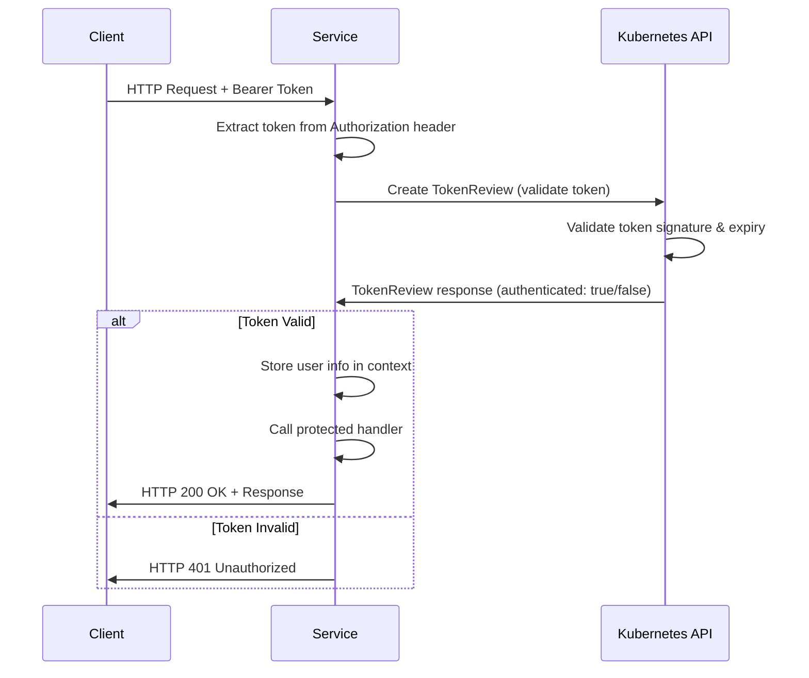

# Kubernetes TokenReviewer Authentication - Common Documentation

**Version**: 1.0
**Last Updated**: October 6, 2025
**Status**: ✅ Authoritative Reference
**Scope**: All Kubernaut Services (CRD Controllers & Stateless HTTP Services)

---

## 📋 Table of Contents

1. [Overview](#overview)
2. [Architecture](#architecture)
3. [Implementation](#implementation)
4. [Configuration](#configuration)
5. [Service Integration](#service-integration)
6. [Security Considerations](#security-considerations)
7. [Testing](#testing)
8. [Troubleshooting](#troubleshooting)

---

## Overview

### Purpose

**TokenReviewer Authentication** is the standard authentication mechanism for all Kubernaut services, both CRD controllers (metrics endpoints) and stateless HTTP services (REST APIs).

### Key Benefits

1. ✅ **Kubernetes-Native**: Uses built-in Kubernetes authentication infrastructure
2. ✅ **ServiceAccount Integration**: No external identity providers needed
3. ✅ **RBAC Compatible**: Works seamlessly with Kubernetes RBAC
4. ✅ **Zero Configuration**: No API keys, secrets, or external setup required
5. ✅ **Audit Trail**: Kubernetes audit logs capture all authentication attempts
6. ✅ **Uniform Pattern**: Same pattern across all services

---

## Architecture

### How TokenReviewer Works

```
┌──────────────────┐
│   HTTP Client    │
│  (Prometheus,    │
│   AlertManager,  │
│   Internal Svc)  │
└────────┬─────────┘
         │ 1. HTTP Request
         │    Authorization: Bearer <token>
         ▼
┌────────────────────────────────────────────┐
│         Kubernaut Service                  │
│                                            │
│  ┌──────────────────────────────────────┐ │
│  │   Authentication Middleware          │ │
│  │                                      │ │
│  │  1. Extract Bearer token             │ │
│  │  2. Create TokenReview request       │ │
│  │  3. Send to Kubernetes API           │ │──┐
│  │  4. Validate response                │ │  │ 2. TokenReview API Call
│  │  5. Store user info in context       │ │◄─┘
│  └──────────────────────────────────────┘ │
│                                            │
│  ┌──────────────────────────────────────┐ │
│  │   Protected Handler                  │ │
│  │   (REST API or Metrics)              │ │
│  └──────────────────────────────────────┘ │
└────────────────────────────────────────────┘
                  ▲
                  │ 3. Authentication Result
                  │    ✅ Authenticated
                  │    ❌ Unauthorized
                  │
         ┌────────┴────────┐
         │  Kubernetes API  │
         │  TokenReviewer   │
         └─────────────────┘
```

### Flow Diagram



---

## Implementation

### Go Middleware (HTTP Services)

**File**: `pkg/{service}/auth/tokenreviewer.go`

**Complete Implementation with All Imports**:

```go
// pkg/{service}/auth/tokenreviewer.go
package auth

import (
    "context"
    "fmt"
    "net/http"
    "strings"

    authv1 "k8s.io/api/authentication/v1"
    metav1 "k8s.io/apimachinery/pkg/apis/meta/v1"
    "k8s.io/client-go/kubernetes"
    "k8s.io/client-go/rest"
)

// TokenReviewerAuthenticator handles Kubernetes TokenReviewer-based authentication
type TokenReviewerAuthenticator struct {
    clientset kubernetes.Interface
}

// NewTokenReviewerAuthenticator creates a new authenticator using in-cluster config
func NewTokenReviewerAuthenticator() (*TokenReviewerAuthenticator, error) {
    // Use in-cluster config (service running inside Kubernetes)
    config, err := rest.InClusterConfig()
    if err != nil {
        return nil, fmt.Errorf("failed to get in-cluster config: %w", err)
    }

    clientset, err := kubernetes.NewForConfig(config)
    if err != nil {
        return nil, fmt.Errorf("failed to create kubernetes clientset: %w", err)
    }

    return &TokenReviewerAuthenticator{
        clientset: clientset,
    }, nil
}

// Middleware creates HTTP middleware for TokenReviewer authentication
func (a *TokenReviewerAuthenticator) Middleware(next http.Handler) http.Handler {
    return http.HandlerFunc(func(w http.ResponseWriter, r *http.Request) {
        // Extract Bearer token from Authorization header
        authHeader := r.Header.Get("Authorization")
        if authHeader == "" {
            http.Error(w, `{"error":"Missing Authorization header"}`, http.StatusUnauthorized)
            return
        }

        if !strings.HasPrefix(authHeader, "Bearer ") {
            http.Error(w, `{"error":"Invalid Authorization format, expected: Bearer <token>"}`, http.StatusUnauthorized)
            return
        }

        token := strings.TrimPrefix(authHeader, "Bearer ")

        // Create TokenReview request
        tokenReview := &authv1.TokenReview{
            Spec: authv1.TokenReviewSpec{
                Token: token,
            },
        }

        // Call Kubernetes TokenReviewer API
        result, err := a.clientset.AuthenticationV1().TokenReviews().Create(
            r.Context(),
            tokenReview,
            metav1.CreateOptions{},
        )
        if err != nil {
            http.Error(w, fmt.Sprintf(`{"error":"Token validation failed: %v"}`, err), http.StatusUnauthorized)
            return
        }

        // Check authentication result
        if !result.Status.Authenticated {
            http.Error(w, `{"error":"Token not authenticated"}`, http.StatusUnauthorized)
            return
        }

        // Store authenticated user info in request context for downstream handlers
        ctx := context.WithValue(r.Context(), "kubernetes.user", result.Status.User)
        ctx = context.WithValue(ctx, "kubernetes.authenticated", true)

        // Call next handler with authenticated context
        next.ServeHTTP(w, r.WithContext(ctx))
    })
}

// GetUserInfo extracts authenticated user info from request context
func GetUserInfo(ctx context.Context) (*authv1.UserInfo, error) {
    user, ok := ctx.Value("kubernetes.user").(*authv1.UserInfo)
    if !ok {
        return nil, fmt.Errorf("user info not found in context")
    }
    return user, nil
}
```

---

### HTTP Server Integration

**File**: `cmd/{service}/main.go`

**Example Integration**:

```go
// cmd/gateway/main.go
package main

import (
    "log"
    "net/http"

    "github.com/gorilla/mux"
    "github.com/jordigilh/kubernaut/pkg/gateway/auth"
    "github.com/jordigilh/kubernaut/pkg/gateway/handlers"
)

func main() {
    // Initialize TokenReviewer authenticator
    authenticator, err := auth.NewTokenReviewerAuthenticator()
    if err != nil {
        log.Fatalf("Failed to create authenticator: %v", err)
    }

    // Create router
    router := mux.NewRouter()

    // Health endpoints (NO authentication)
    router.HandleFunc("/healthz", handlers.HealthHandler).Methods("GET")
    router.HandleFunc("/ready", handlers.ReadyHandler).Methods("GET")

    // Protected API endpoints (WITH TokenReviewer authentication)
    apiRouter := router.PathPrefix("/api/v1").Subrouter()
    apiRouter.Use(authenticator.Middleware) // Apply TokenReviewer middleware
    apiRouter.HandleFunc("/signals", handlers.SignalHandler).Methods("POST")

    // Metrics endpoint (WITH TokenReviewer authentication)
    metricsRouter := mux.NewRouter()
    metricsRouter.Handle("/metrics", authenticator.Middleware(handlers.MetricsHandler()))

    // Start servers
    go func() {
        log.Println("Starting API server on :8080")
        if err := http.ListenAndServe(":8080", router); err != nil {
            log.Fatalf("API server failed: %v", err)
        }
    }()

    log.Println("Starting metrics server on :9090")
    if err := http.ListenAndServe(":9090", metricsRouter); err != nil {
        log.Fatalf("Metrics server failed: %v", err)
    }
}
```

---

### Controller-Runtime Integration (CRD Controllers)

**File**: `cmd/{controller}/main.go`

**Example for Metrics Endpoint**:

```go
// cmd/remediation-orchestrator/main.go
package main

import (
    "flag"
    "os"

    "k8s.io/apimachinery/pkg/runtime"
    ctrl "sigs.k8s.io/controller-runtime"
    "sigs.k8s.io/controller-runtime/pkg/log/zap"
    "sigs.k8s.io/controller-runtime/pkg/metrics/server"
    "sigs.k8s.io/controller-runtime/pkg/healthz"
    metricsserver "sigs.k8s.io/controller-runtime/pkg/metrics/server"

    remediationv1 "github.com/jordigilh/kubernaut/pkg/apis/remediation/v1"
    "github.com/jordigilh/kubernaut/pkg/remediationorchestrator"
    "github.com/jordigilh/kubernaut/pkg/shared/auth"
)

var (
    scheme   = runtime.NewScheme()
    setupLog = ctrl.Log.WithName("setup")
)

func init() {
    _ = remediationv1.AddToScheme(scheme)
}

func main() {
    var metricsAddr string
    var probeAddr string
    var enableLeaderElection bool

    flag.StringVar(&metricsAddr, "metrics-bind-address", ":9090", "The address the metric endpoint binds to.")
    flag.StringVar(&probeAddr, "health-probe-bind-address", ":8080", "The address the probe endpoint binds to.")
    flag.BoolVar(&enableLeaderElection, "leader-elect", false, "Enable leader election for controller manager.")

    // Zap logger options with controller-runtime integration (Split Strategy)
    opts := zap.Options{
        Development: true, // Set to false for production
    }
    opts.BindFlags(flag.CommandLine) // Adds --zap-log-level, --zap-encoder, etc.

    flag.Parse()

    ctrl.SetLogger(zap.New(zap.UseFlagOptions(&opts)))

    // Create TokenReviewer filter for metrics endpoint
    tokenReviewerFilter, err := auth.NewTokenReviewerAuthenticator()
    if err != nil {
        setupLog.Error(err, "unable to create TokenReviewer authenticator")
        os.Exit(1)
    }

    mgr, err := ctrl.NewManager(ctrl.GetConfigOrDie(), ctrl.Options{
        Scheme: scheme,
        Metrics: metricsserver.Options{
            BindAddress:   metricsAddr,  // Port 9090 for metrics
            FilterProvider: tokenReviewerFilter, // TokenReviewer authentication
        },
        HealthProbeBindAddress: probeAddr,  // Port 8080 for health checks
        LeaderElection:         enableLeaderElection,
        LeaderElectionID:       "remediation-orchestrator.kubernaut.io",
    })
    if err != nil {
        setupLog.Error(err, "unable to start manager")
        os.Exit(1)
    }

    if err = (&remediationorchestrator.RemediationRequestReconciler{
        Client: mgr.GetClient(),
        Scheme: mgr.GetScheme(),
        Log:    ctrl.Log.WithName("controllers").WithName("RemediationRequest"),
    }).SetupWithManager(mgr); err != nil {
        setupLog.Error(err, "unable to create controller", "controller", "RemediationRequest")
        os.Exit(1)
    }

    if err := mgr.AddHealthzCheck("healthz", healthz.Ping); err != nil {
        setupLog.Error(err, "unable to set up health check")
        os.Exit(1)
    }

    if err := mgr.AddReadyzCheck("readyz", healthz.Ping); err != nil {
        setupLog.Error(err, "unable to set up ready check")
        os.Exit(1)
    }

    setupLog.Info("starting manager")
    if err := mgr.Start(ctrl.SetupSignalHandler()); err != nil {
        setupLog.Error(err, "problem running manager")
        os.Exit(1)
    }
}
```

---

## Configuration

### Client Configuration (Prometheus, AlertManager, etc.)

#### Prometheus ServiceMonitor (CRD Controllers)

```yaml
apiVersion: monitoring.coreos.com/v1
kind: ServiceMonitor
metadata:
  name: remediation-orchestrator-metrics
  namespace: kubernaut-system
  labels:
    app: remediation-orchestrator
spec:
  selector:
    matchLabels:
      app: remediation-orchestrator
  endpoints:
  - port: metrics
    path: /metrics
    interval: 30s
    # TokenReviewer authentication using ServiceAccount token
    bearerTokenFile: /var/run/secrets/kubernetes.io/serviceaccount/token
```

#### AlertManager Webhook Configuration

```yaml
# alertmanager.yaml
receivers:
  - name: kubernaut-gateway
    webhook_configs:
      - url: http://gateway-service.kubernaut-system:8080/api/v1/signals
        send_resolved: true
        http_config:
          # TokenReviewer authentication using ServiceAccount token
          bearer_token_file: /var/run/secrets/kubernetes.io/serviceaccount/token
          headers:
            X-Signal-Source: prometheus
```

#### Manual curl Testing

```bash
# Get ServiceAccount token
TOKEN=$(kubectl -n kubernaut-system get secret \
  $(kubectl -n kubernaut-system get sa gateway -o jsonpath='{.secrets[0].name}') \
  -o jsonpath='{.data.token}' | base64 -d)

# Call API with TokenReviewer auth
curl -H "Authorization: Bearer $TOKEN" \
  http://gateway-service.kubernaut-system:8080/api/v1/signals \
  -d @signal.json
```

---

### RBAC Configuration

#### ServiceAccount Creation

**All services require a ServiceAccount**:

```yaml
apiVersion: v1
kind: ServiceAccount
metadata:
  name: {service-name}
  namespace: kubernaut-system
```

**Examples**:
- `gateway` (Gateway Service)
- `notification-service` (Notification Service)
- `holmesgpt-api` (HolmesGPT API)
- `remediation-orchestrator-sa` (Remediation Orchestrator)
- `ai-analysis-sa` (AI Analysis)

#### ServiceAccount for Prometheus (Metrics Access)

```yaml
# ServiceAccount for Prometheus to scrape metrics
apiVersion: v1
kind: ServiceAccount
metadata:
  name: prometheus
  namespace: monitoring
---
# ClusterRole for metrics access
apiVersion: rbac.authorization.k8s.io/v1
kind: ClusterRole
metadata:
  name: prometheus-metrics-reader
rules:
# TokenReviewer will validate this ServiceAccount's token
- apiGroups: [""]
  resources: ["services", "endpoints", "pods"]
  verbs: ["get", "list", "watch"]
- apiGroups: [""]
  resources: ["nodes/metrics"]
  verbs: ["get"]
- nonResourceURLs: ["/metrics"]
  verbs: ["get"]
---
apiVersion: rbac.authorization.k8s.io/v1
kind: ClusterRoleBinding
metadata:
  name: prometheus-metrics-reader
roleRef:
  apiGroup: rbac.authorization.k8s.io
  kind: ClusterRole
  name: prometheus-metrics-reader
subjects:
- kind: ServiceAccount
  name: prometheus
  namespace: monitoring
```

---

## Service Integration

### Services Using TokenReviewer Auth

#### CRD Controllers (Metrics Endpoints - Port 9090)
1. ✅ Remediation Orchestrator (`remediation-orchestrator-sa`)
2. ✅ Remediation Processor (`remediation-processor-sa`)
3. ✅ AI Analysis (`ai-analysis-sa`)
4. ✅ Workflow Execution (`workflow-execution-sa`)
5. ✅ Kubernetes Executor (`kubernetes-executor-sa`)

#### Stateless HTTP Services (REST APIs - Port 8080, Metrics - Port 9090)
6. ✅ Gateway Service (`gateway`)
7. ✅ Notification Service (`notification-service`)
8. ✅ HolmesGPT API (`holmesgpt-api`)

#### Future Services (Pending Specification)
9. ⏸️ Context API
10. ⏸️ Data Storage
11. ⏸️ Infrastructure Monitoring

---

### Port Strategy

| Service Type | Port 8080 | Port 9090 | Auth |
|--------------|-----------|-----------|------|
| **CRD Controllers** | Health checks (no auth) | Metrics (TokenReviewer) | Metrics only |
| **HTTP Services** | REST API (TokenReviewer) | Metrics (TokenReviewer) | Both endpoints |

---

## Security Considerations

### 1. Token Validation

**What TokenReviewer Validates**:
- ✅ Token signature (cryptographically signed by Kubernetes)
- ✅ Token expiry (checks `exp` claim)
- ✅ ServiceAccount existence (validates account still exists)
- ✅ Token revocation (checks if token has been invalidated)

**What TokenReviewer Does NOT Validate**:
- ❌ Authorization (RBAC) - Must be implemented separately if needed
- ❌ Rate limiting - Must be implemented in service
- ❌ Request payload - Must be validated by service

---

### 2. ServiceAccount Token Lifecycle

**Token Types**:
1. **Mounted Token** (Default): `/var/run/secrets/kubernetes.io/serviceaccount/token`
   - Automatically mounted in every pod
   - Rotated periodically by Kubernetes
   - Preferred for in-cluster communication

2. **Manual Token** (Long-lived): Created via `kubectl create token`
   - Used for external clients
   - Has explicit expiry
   - Should be rotated regularly

---

### 3. Network Security

**Best Practices**:
- ✅ Use NetworkPolicies to restrict traffic
- ✅ Run services with `automountServiceAccountToken: true` (default)
- ✅ Use HTTPS in production (terminate TLS at ingress)
- ✅ Implement rate limiting per ServiceAccount
- ✅ Monitor authentication failures

---

### 4. RBAC Authorization (Optional)

**If RBAC authorization is needed** (beyond authentication):

```go
// Optional: Check if user has specific permissions
func (a *TokenReviewerAuthenticator) CanPerformAction(ctx context.Context, action string) (bool, error) {
    user, err := GetUserInfo(ctx)
    if err != nil {
        return false, err
    }

    // Create SubjectAccessReview to check permissions
    sar := &authv1.SubjectAccessReview{
        Spec: authv1.SubjectAccessReviewSpec{
            User: user.Username,
            ResourceAttributes: &authv1.ResourceAttributes{
                Verb:      "create",
                Group:     "remediation.kubernaut.io",
                Resource:  "remediationrequests",
                Namespace: "default",
            },
        },
    }

    result, err := a.clientset.AuthorizationV1().SubjectAccessReviews().Create(
        ctx, sar, metav1.CreateOptions{},
    )
    if err != nil {
        return false, err
    }

    return result.Status.Allowed, nil
}
```

---

## Testing

### Unit Testing

**Mock TokenReviewer for testing**:

```go
// pkg/{service}/auth/tokenreviewer_test.go
package auth_test

import (
    "context"
    "net/http"
    "net/http/httptest"
    "testing"

    authv1 "k8s.io/api/authentication/v1"
    metav1 "k8s.io/apimachinery/pkg/apis/meta/v1"
    "k8s.io/client-go/kubernetes/fake"

    "github.com/jordigilh/kubernaut/pkg/gateway/auth"
)

func TestTokenReviewerAuthentication(t *testing.T) {
    // Create fake Kubernetes clientset
    fakeClient := fake.NewSimpleClientset()

    // Create authenticator with fake client
    authenticator := &auth.TokenReviewerAuthenticator{
        Clientset: fakeClient,
    }

    // Test valid token
    t.Run("valid token", func(t *testing.T) {
        req := httptest.NewRequest("GET", "/api/v1/test", nil)
        req.Header.Set("Authorization", "Bearer valid-token")

        // Mock TokenReview response
        fakeClient.Fake.PrependReactor("create", "tokenreviews", func(action testing.Action) (bool, runtime.Object, error) {
            return true, &authv1.TokenReview{
                Status: authv1.TokenReviewStatus{
                    Authenticated: true,
                    User: authv1.UserInfo{
                        Username: "system:serviceaccount:kubernaut-system:gateway",
                    },
                },
            }, nil
        })

        rr := httptest.NewRecorder()
        handler := authenticator.Middleware(http.HandlerFunc(func(w http.ResponseWriter, r *http.Request) {
            w.WriteHeader(http.StatusOK)
        }))

        handler.ServeHTTP(rr, req)

        if status := rr.Code; status != http.StatusOK {
            t.Errorf("handler returned wrong status code: got %v want %v", status, http.StatusOK)
        }
    })

    // Test invalid token
    t.Run("invalid token", func(t *testing.T) {
        req := httptest.NewRequest("GET", "/api/v1/test", nil)
        req.Header.Set("Authorization", "Bearer invalid-token")

        // Mock TokenReview response
        fakeClient.Fake.PrependReactor("create", "tokenreviews", func(action testing.Action) (bool, runtime.Object, error) {
            return true, &authv1.TokenReview{
                Status: authv1.TokenReviewStatus{
                    Authenticated: false,
                },
            }, nil
        })

        rr := httptest.NewRecorder()
        handler := authenticator.Middleware(http.HandlerFunc(func(w http.ResponseWriter, r *http.Request) {
            w.WriteHeader(http.StatusOK)
        }))

        handler.ServeHTTP(rr, req)

        if status := rr.Code; status != http.StatusUnauthorized {
            t.Errorf("handler returned wrong status code: got %v want %v", status, http.StatusUnauthorized)
        }
    })
}
```

---

### Integration Testing

**Test with real Kubernetes cluster (KIND)**:

```bash
# Create test ServiceAccount
kubectl create serviceaccount test-client -n kubernaut-system

# Get ServiceAccount token
TOKEN=$(kubectl -n kubernaut-system create token test-client)

# Test API call
curl -H "Authorization: Bearer $TOKEN" \
  http://localhost:8080/api/v1/test \
  -v
```

---

## Troubleshooting

### Common Issues

#### 1. "Missing Authorization header"

**Cause**: Client not sending `Authorization` header

**Fix**: Ensure client includes header:
```
Authorization: Bearer <token>
```

---

#### 2. "Token validation failed"

**Cause**: Kubernetes API unreachable or service lacks permissions

**Fix**: Check service has TokenReview permissions:
```yaml
# Service needs this RBAC for TokenReviewer
- apiGroups: ["authentication.k8s.io"]
  resources: ["tokenreviews"]
  verbs: ["create"]
```

---

#### 3. "Token not authenticated"

**Cause**: Invalid, expired, or revoked token

**Fix**: Generate new token:
```bash
# For ServiceAccount
kubectl -n kubernaut-system create token gateway

# For user
kubectl create token my-user --duration=1h
```

---

#### 4. "user info not found in context"

**Cause**: Handler called without authentication middleware

**Fix**: Ensure middleware is applied:
```go
apiRouter.Use(authenticator.Middleware) // Must be called
```

---

### Debug Logging

**Enable debug logging in service**:

```go
func (a *TokenReviewerAuthenticator) Middleware(next http.Handler) http.Handler {
    return http.HandlerFunc(func(w http.ResponseWriter, r *http.Request) {
        // Debug logging
        log.Printf("Authentication request: %s %s from %s",
            r.Method, r.URL.Path, r.RemoteAddr)

        authHeader := r.Header.Get("Authorization")
        if authHeader == "" {
            log.Printf("Authentication failed: missing Authorization header")
            http.Error(w, `{"error":"Missing Authorization header"}`, http.StatusUnauthorized)
            return
        }

        // ... rest of middleware ...

        log.Printf("Authentication successful: user=%s", result.Status.User.Username)
        next.ServeHTTP(w, r.WithContext(ctx))
    })
}
```

---

## References

### Kubernetes Documentation
- [Authentication in Kubernetes](https://kubernetes.io/docs/reference/access-authn-authz/authentication/)
- [TokenReview API](https://kubernetes.io/docs/reference/kubernetes-api/authentication-resources/token-review-v1/)
- [ServiceAccount Tokens](https://kubernetes.io/docs/tasks/configure-pod-container/configure-service-account/)

### Kubernaut Documentation
- [CRD Controller Overview](../services/crd-controllers/)
- [Gateway Service Security](../services/stateless/gateway-service/security-configuration.md)
- [Notification Service Security](../services/stateless/06-notification-service.md)
- [Port Strategy](../services/CROSS_SERVICE_TRIAGE_OCTOBER_2025.md)

---

**Document Status**: ✅ Authoritative Reference
**Last Updated**: October 6, 2025
**Maintainer**: Kubernaut Architecture Team
**Version**: 1.0
