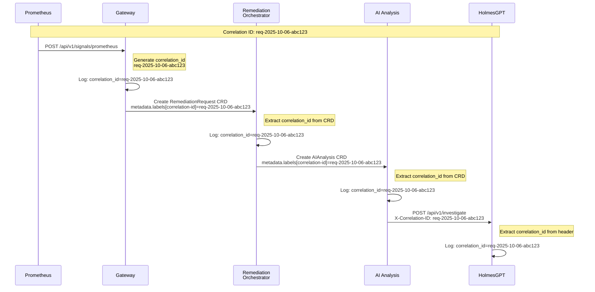

# Log Correlation ID Standard - Kubernaut V1

**Version**: 1.0
**Last Updated**: October 6, 2025
**Status**: ✅ Authoritative Standard
**Scope**: All 11 Kubernaut Services

---

## 📋 Table of Contents

1. [Overview](#overview)
2. [Correlation ID Format](#correlation-id-format)
3. [HTTP Header Propagation](#http-header-propagation)
4. [CRD-Based Propagation](#crd-based-propagation)
5. [Logging Standards](#logging-standards)
6. [Implementation Patterns](#implementation-patterns)
7. [Service-Specific Patterns](#service-specific-patterns)
8. [Troubleshooting and Debugging](#troubleshooting-and-debugging)

---

## Overview

### Purpose

**Log Correlation IDs** enable distributed tracing across Kubernaut's microservices architecture, allowing:
- ✅ End-to-end request tracking (alert ingestion → remediation execution)
- ✅ Cross-service log aggregation
- ✅ Performance analysis and bottleneck identification
- ✅ Debugging of multi-service workflows

---

### Architecture



---

## Correlation ID Format

### Standard Format

```
{prefix}-{date}-{random}
```

**Components**:
- `prefix`: Service-specific prefix (see table below)
- `date`: UTC date in `YYYY-MM-DD` format
- `random`: 6-character alphanumeric (lowercase)

**Example**: `req-2025-10-06-abc123`

---

### Service Prefixes

| Service | Prefix | Example | Notes |
|---------|--------|---------|-------|
| **Gateway Service** | `req` | `req-2025-10-06-abc123` | "Request" - Entry point |
| **Remediation Orchestrator** | `rem` | `rem-2025-10-06-def456` | "Remediation" - Only if generating new ID |
| **Remediation Processor** | `rp` | `rp-2025-10-06-ghi789` | Only if generating new ID |
| **AI Analysis** | `ai` | `ai-2025-10-06-jkl012` | Only if generating new ID |
| **Workflow Execution** | `wf` | `wf-2025-10-06-mno345` | Only if generating new ID |
| **Kubernetes Executor** | `ke` | `ke-2025-10-06-pqr678` | Only if generating new ID |
| **Notification Service** | `ntf` | `ntf-2025-10-06-stu901` | Only if generating new ID |
| **HolmesGPT API** | `hg` | `hg-2025-10-06-vwx234` | Only if generating new ID |
| **Context API** | `ctx` | `ctx-2025-10-06-yza567` | Only if generating new ID |
| **Data Storage** | `ds` | `ds-2025-10-06-bcd890` | Only if generating new ID |

**Important**: Services should **propagate existing correlation IDs** from upstream. Only generate new IDs when processing requests without an existing correlation ID.

---

### Go Implementation

```go
// pkg/correlation/correlation.go
package correlation

import (
    "crypto/rand"
    "encoding/hex"
    "fmt"
    "time"
)

// GenerateID creates a new correlation ID with the given service prefix
func GenerateID(servicePrefix string) string {
    // Generate 3 random bytes (6 hex characters)
    randomBytes := make([]byte, 3)
    if _, err := rand.Read(randomBytes); err != nil {
        // Fallback to timestamp-based if random fails
        randomBytes = []byte(fmt.Sprintf("%06d", time.Now().Unix()%1000000))
    }
    randomStr := hex.EncodeToString(randomBytes)

    // Format: {prefix}-{date}-{random}
    date := time.Now().UTC().Format("2006-01-02")
    return fmt.Sprintf("%s-%s-%s", servicePrefix, date, randomStr)
}

// Example usage:
// correlationID := correlation.GenerateID("req")
// Output: "req-2025-10-06-abc123"
```

---

## HTTP Header Propagation

### Standard HTTP Header

**Header Name**: `X-Correlation-ID`

**Direction**: Downstream (client → server)

---

### HTTP Service Pattern (Gateway, Notification, HolmesGPT, Context, Data Storage)

#### Incoming Request Handling

```go
// pkg/middleware/correlation.go
package middleware

import (
    "context"
    "net/http"

    "github.com/jordigilh/kubernaut/pkg/correlation"
)

// CorrelationIDMiddleware extracts or generates correlation ID
func CorrelationIDMiddleware(servicePrefix string) func(http.Handler) http.Handler {
    return func(next http.Handler) http.Handler {
        return http.HandlerFunc(func(w http.ResponseWriter, r *http.Request) {
            correlationID := r.Header.Get("X-Correlation-ID")

            // Generate new ID if not provided
            if correlationID == "" {
                correlationID = correlation.GenerateID(servicePrefix)
            }

            // Add to request context
            ctx := context.WithValue(r.Context(), correlation.ContextKey, correlationID)

            // Add to response header for client visibility
            w.Header().Set("X-Correlation-ID", correlationID)

            // Continue with updated context
            next.ServeHTTP(w, r.WithContext(ctx))
        })
    }
}

// Example usage in main.go:
// router.Use(middleware.CorrelationIDMiddleware("req")) // Gateway
```

---

#### Outgoing HTTP Request

```go
// pkg/httpclient/client.go
package httpclient

import (
    "context"
    "net/http"

    "github.com/jordigilh/kubernaut/pkg/correlation"
)

// AddCorrelationID adds correlation ID to outgoing request
func AddCorrelationID(ctx context.Context, req *http.Request) {
    if correlationID, ok := ctx.Value(correlation.ContextKey).(string); ok {
        req.Header.Set("X-Correlation-ID", correlationID)
    }
}

// Example usage:
// req, _ := http.NewRequestWithContext(ctx, "POST", url, body)
// httpclient.AddCorrelationID(ctx, req)
// resp, err := client.Do(req)
```

---

### Context Key Definition

```go
// pkg/correlation/context.go
package correlation

type contextKey string

// ContextKey is the context key for correlation ID
const ContextKey contextKey = "correlation-id"

// FromContext extracts correlation ID from context
func FromContext(ctx context.Context) string {
    if correlationID, ok := ctx.Value(ContextKey).(string); ok {
        return correlationID
    }
    return ""
}

// WithContext adds correlation ID to context
func WithContext(ctx context.Context, correlationID string) context.Context {
    return context.WithValue(ctx, ContextKey, correlationID)
}
```

---

## CRD-Based Propagation

### CRD Label Standard

**Label Key**: `kubernaut.io/correlation-id`

**Direction**: Parent CRD → Child CRD

---

### Pattern: Gateway → Remediation Orchestrator

#### Gateway Service (CRD Creation)

```go
// pkg/gateway/crd_creator.go
package gateway

import (
    "context"

    metav1 "k8s.io/apimachinery/pkg/apis/meta/v1"

    remediationv1 "github.com/jordigilh/kubernaut/pkg/apis/remediation/v1"
    "github.com/jordigilh/kubernaut/pkg/correlation"
)

func (s *GatewayService) createRemediationRequestCRD(
    ctx context.Context,
    signal *NormalizedSignal,
) error {
    correlationID := correlation.FromContext(ctx)

    crd := &remediationv1.RemediationRequest{
        ObjectMeta: metav1.ObjectMeta{
            Name:      fmt.Sprintf("remediation-%s", generateShortID()),
            Namespace: signal.Namespace,
            Labels: map[string]string{
                "kubernaut.io/correlation-id": correlationID,
                "kubernaut.io/signal-type":    signal.SignalType,
                "kubernaut.io/priority":       signal.Priority,
            },
        },
        Spec: remediationv1.RemediationRequestSpec{
            // ... spec fields
        },
    }

    _, err := s.k8sClient.RemediationV1().RemediationRequests(signal.Namespace).
        Create(ctx, crd, metav1.CreateOptions{})

    return err
}
```

---

### Pattern: Remediation Orchestrator → Child Controllers

#### Remediation Orchestrator (Child CRD Creation)

```go
// pkg/remediationorchestrator/reconciler.go
package remediationorchestrator

import (
    "context"

    metav1 "k8s.io/apimachinery/pkg/apis/meta/v1"
    ctrl "sigs.k8s.io/controller-runtime"

    remediationv1 "github.com/jordigilh/kubernaut/pkg/apis/remediation/v1"
    aianalysisv1 "github.com/jordigilh/kubernaut/pkg/apis/aianalysis/v1"
    "github.com/jordigilh/kubernaut/pkg/correlation"
)

func (r *RemediationRequestReconciler) Reconcile(
    ctx context.Context,
    req ctrl.Request,
) (ctrl.Result, error) {
    log := r.Log.WithValues("remediationrequest", req.NamespacedName)

    // Fetch RemediationRequest
    remediationReq := &remediationv1.RemediationRequest{}
    if err := r.Get(ctx, req.NamespacedName, remediationReq); err != nil {
        return ctrl.Result{}, err
    }

    // Extract correlation ID from parent CRD
    correlationID := remediationReq.Labels["kubernaut.io/correlation-id"]
    if correlationID == "" {
        // Generate new ID if missing (shouldn't happen)
        correlationID = correlation.GenerateID("rem")
        log.Info("Missing correlation ID, generated new one", "correlation_id", correlationID)
    }

    // Add to context for downstream logging
    ctx = correlation.WithContext(ctx, correlationID)
    log = log.WithValues("correlation_id", correlationID)

    // Create AIAnalysis CRD with propagated correlation ID
    aiAnalysis := &aianalysisv1.AIAnalysis{
        ObjectMeta: metav1.ObjectMeta{
            Name:      fmt.Sprintf("ai-%s", remediationReq.Name),
            Namespace: remediationReq.Namespace,
            Labels: map[string]string{
                "kubernaut.io/correlation-id": correlationID, // Propagate
                "kubernaut.io/parent-name":    remediationReq.Name,
            },
            OwnerReferences: []metav1.OwnerReference{
                *metav1.NewControllerRef(remediationReq, remediationv1.GroupVersion.WithKind("RemediationRequest")),
            },
        },
        Spec: aianalysisv1.AIAnalysisSpec{
            RemediationRequestRef: remediationReq.Name,
            // ... spec fields
        },
    }

    if err := r.Create(ctx, aiAnalysis); err != nil {
        log.Error(err, "Failed to create AIAnalysis CRD")
        return ctrl.Result{}, err
    }

    log.Info("Created AIAnalysis CRD", "ai_analysis_name", aiAnalysis.Name)
    return ctrl.Result{}, nil
}
```

---

### Pattern: Child Controller → HTTP Service Call

#### AI Analysis Controller → HolmesGPT API

```go
// pkg/aianalysis/reconciler.go
package aianalysis

import (
    "bytes"
    "context"
    "encoding/json"
    "net/http"

    ctrl "sigs.k8s.io/controller-runtime"

    aianalysisv1 "github.com/jordigilh/kubernaut/pkg/apis/aianalysis/v1"
    "github.com/jordigilh/kubernaut/pkg/correlation"
    "github.com/jordigilh/kubernaut/pkg/httpclient"
)

func (r *AIAnalysisReconciler) Reconcile(
    ctx context.Context,
    req ctrl.Request,
) (ctrl.Result, error) {
    log := r.Log.WithValues("aianalysis", req.NamespacedName)

    // Fetch AIAnalysis CRD
    aiAnalysis := &aianalysisv1.AIAnalysis{}
    if err := r.Get(ctx, req.NamespacedName, aiAnalysis); err != nil {
        return ctrl.Result{}, err
    }

    // Extract correlation ID from CRD
    correlationID := aiAnalysis.Labels["kubernaut.io/correlation-id"]
    if correlationID == "" {
        correlationID = correlation.GenerateID("ai")
        log.Info("Missing correlation ID, generated new one", "correlation_id", correlationID)
    }

    // Add to context
    ctx = correlation.WithContext(ctx, correlationID)
    log = log.WithValues("correlation_id", correlationID)

    // Call HolmesGPT API with correlation ID in header
    investigationReq := map[string]interface{}{
        "signal_type": aiAnalysis.Spec.SignalType,
        "context":     aiAnalysis.Spec.Context,
    }

    body, _ := json.Marshal(investigationReq)
    httpReq, _ := http.NewRequestWithContext(
        ctx,
        "POST",
        "http://holmesgpt-api:8080/api/v1/investigate",
        bytes.NewBuffer(body),
    )
    httpReq.Header.Set("Content-Type", "application/json")

    // Add correlation ID to outgoing request
    httpclient.AddCorrelationID(ctx, httpReq)

    resp, err := r.httpClient.Do(httpReq)
    if err != nil {
        log.Error(err, "HolmesGPT API call failed")
        return ctrl.Result{}, err
    }
    defer resp.Body.Close()

    log.Info("HolmesGPT investigation completed", "status_code", resp.StatusCode)
    return ctrl.Result{}, nil
}
```

---

## Logging Standards

### Structured Logging Format

**All services use structured logging** (logr or zap) with correlation ID as a structured field.

---

### Standard Log Format

```json
{
  "timestamp": "2025-10-06T14:30:45.123Z",
  "level": "info",
  "service": "gateway-service",
  "correlation_id": "req-2025-10-06-abc123",
  "msg": "Signal ingested successfully",
  "signal_type": "prometheus",
  "namespace": "production",
  "fingerprint": "sha256:def456..."
}
```

---

### Go Logging Pattern (controller-runtime)

```go
// CRD Controller logging
package aianalysis

import (
    "context"

    "github.com/go-logr/logr"
    ctrl "sigs.k8s.io/controller-runtime"

    "github.com/jordigilh/kubernaut/pkg/correlation"
)

func (r *AIAnalysisReconciler) Reconcile(
    ctx context.Context,
    req ctrl.Request,
) (ctrl.Result, error) {
    // Base logger from controller-runtime
    log := r.Log.WithValues("aianalysis", req.NamespacedName)

    // ... extract correlation ID from CRD ...
    correlationID := aiAnalysis.Labels["kubernaut.io/correlation-id"]

    // Add correlation ID to logger
    log = log.WithValues("correlation_id", correlationID)

    // All subsequent log calls include correlation_id
    log.Info("Starting AI investigation",
        "signal_type", aiAnalysis.Spec.SignalType,
        "priority", aiAnalysis.Spec.Priority,
    )

    // ... processing ...

    log.Info("AI investigation completed",
        "confidence", 0.85,
        "recommendation", "scale-up",
    )

    return ctrl.Result{}, nil
}
```

---

### Go Logging Pattern (HTTP Service)

```go
// HTTP Service logging
package gateway

import (
    "context"
    "net/http"

    "go.uber.org/zap"

    "github.com/jordigilh/kubernaut/pkg/correlation"
)

func (s *GatewayService) handleSignalIngestion(w http.ResponseWriter, r *http.Request) {
    // Extract correlation ID from context (set by middleware)
    correlationID := correlation.FromContext(r.Context())

    // Create logger with correlation ID
    log := s.logger.With(
        zap.String("correlation_id", correlationID),
        zap.String("path", r.URL.Path),
        zap.String("method", r.Method),
    )

    log.Info("Signal ingestion request received")

    // ... process signal ...

    log.Info("Signal ingested successfully",
        zap.String("signal_type", signal.SignalType),
        zap.String("namespace", signal.Namespace),
        zap.String("fingerprint", signal.Fingerprint),
    )
}
```

---

### Log Query Examples

#### Loki Query (All logs for correlation ID)

```logql
{namespace="kubernaut-system"} |= "req-2025-10-06-abc123"
```

#### Loki Query (Trace request across services)

```logql
{namespace="kubernaut-system"}
  |= "req-2025-10-06-abc123"
  | json
  | line_format "{{.timestamp}} [{{.service}}] {{.msg}}"
```

#### Elasticsearch Query

```json
{
  "query": {
    "match": {
      "correlation_id": "req-2025-10-06-abc123"
    }
  },
  "sort": [
    { "timestamp": "asc" }
  ]
}
```

---

## Implementation Patterns

### Pattern 1: Entry Point (Gateway Service)

**When**: Request arrives without correlation ID

```go
// Middleware generates new correlation ID
func (s *GatewayService) setupRouter() *chi.Mux {
    router := chi.NewRouter()

    // Correlation ID middleware (generates if missing)
    router.Use(middleware.CorrelationIDMiddleware("req"))

    // All handlers have correlation ID in context
    router.Post("/api/v1/signals/prometheus", s.handlePrometheusSignal)

    return router
}
```

---

### Pattern 2: CRD Controller

**When**: Reconciling CRD with correlation ID in labels

```go
func (r *Reconciler) Reconcile(ctx context.Context, req ctrl.Request) (ctrl.Result, error) {
    // 1. Fetch CRD
    crd := &MyCustomResource{}
    if err := r.Get(ctx, req.NamespacedName, crd); err != nil {
        return ctrl.Result{}, err
    }

    // 2. Extract correlation ID from labels
    correlationID := crd.Labels["kubernaut.io/correlation-id"]
    if correlationID == "" {
        correlationID = correlation.GenerateID("svc")
    }

    // 3. Add to context
    ctx = correlation.WithContext(ctx, correlationID)

    // 4. Add to logger
    log := r.Log.WithValues(
        "crd_name", req.NamespacedName,
        "correlation_id", correlationID,
    )

    // 5. Use in HTTP calls
    httpReq, _ := http.NewRequestWithContext(ctx, "POST", url, body)
    httpclient.AddCorrelationID(ctx, httpReq)

    // 6. Propagate to child CRDs
    childCRD := &ChildResource{
        ObjectMeta: metav1.ObjectMeta{
            Labels: map[string]string{
                "kubernaut.io/correlation-id": correlationID,
            },
        },
    }

    return ctrl.Result{}, nil
}
```

---

### Pattern 3: HTTP Service Client

**When**: Making HTTP request to another service

```go
func (c *Client) CallDownstreamService(ctx context.Context, data interface{}) error {
    // Create HTTP request with context
    body, _ := json.Marshal(data)
    req, err := http.NewRequestWithContext(
        ctx,
        "POST",
        c.baseURL+"/api/v1/endpoint",
        bytes.NewBuffer(body),
    )
    if err != nil {
        return err
    }

    // Add correlation ID header (extracted from context)
    httpclient.AddCorrelationID(ctx, req)

    // Execute request
    resp, err := c.httpClient.Do(req)
    if err != nil {
        return err
    }
    defer resp.Body.Close()

    return nil
}
```

---

## Service-Specific Patterns

### Gateway Service

**Responsibility**: Generate correlation ID for new requests

```go
// Gateway generates new correlation ID
correlationID := correlation.GenerateID("req")
ctx = correlation.WithContext(ctx, correlationID)

// Add to RemediationRequest CRD
crd.Labels["kubernaut.io/correlation-id"] = correlationID
```

---

### Remediation Orchestrator

**Responsibility**: Propagate correlation ID to child CRDs

```go
// Extract from RemediationRequest
correlationID := remediationReq.Labels["kubernaut.io/correlation-id"]

// Propagate to AIAnalysis, WorkflowExecution, etc.
aiAnalysis.Labels["kubernaut.io/correlation-id"] = correlationID
workflowExecution.Labels["kubernaut.io/correlation-id"] = correlationID
```

**⚠️ IMPORTANT - WorkflowExecution Exception**:
- WorkflowExecution audit events do NOT use labels for correlation ID
- Instead, they use `Spec.RemediationRequestRef.Name` (parent RR name)
- **Rationale**: Labels not set by RemediationOrchestrator (see DD-AUDIT-CORRELATION-001)
- **Implementation**: Spec field is authoritative source for WFE audit correlation

---

### AI Analysis

**Responsibility**: Propagate correlation ID to HolmesGPT API

```go
// Extract from AIAnalysis CRD
correlationID := aiAnalysis.Labels["kubernaut.io/correlation-id"]
ctx = correlation.WithContext(ctx, correlationID)

// Add to HolmesGPT HTTP request
httpReq, _ := http.NewRequestWithContext(ctx, "POST", holmesGPTURL, body)
httpclient.AddCorrelationID(ctx, httpReq)
```

---

### Notification Service

**Responsibility**: Include correlation ID in notifications

```go
// Extract from HTTP request header
correlationID := r.Header.Get("X-Correlation-ID")

// Include in notification payload
notification := EscalationRequest{
    CorrelationID: correlationID,
    AlertName:     req.AlertName,
    // ... other fields
}

// Include in Slack message
slackMessage := fmt.Sprintf(
    "🚨 *Alert Escalation*\n" +
    "Correlation ID: `%s`\n" +
    "Alert: %s\n",
    correlationID,
    req.AlertName,
)
```

---

### Data Storage Service

**Responsibility**: Store correlation ID with audit records

```go
// Extract from HTTP request header
correlationID := r.Header.Get("X-Correlation-ID")

// Store in PostgreSQL
auditRecord := AuditRecord{
    CorrelationID: correlationID,
    Timestamp:     time.Now(),
    ServiceName:   req.ServiceName,
    Action:        req.Action,
    // ... other fields
}

db.Create(&auditRecord)
```

---

## Troubleshooting and Debugging

### Trace Request Flow

**Goal**: Find all logs for a single alert from ingestion to execution

#### Step 1: Extract Correlation ID from Gateway logs

```bash
# Find correlation ID for specific alert
kubectl logs -n kubernaut-system deployment/gateway-service | \
  grep "alertname=HighMemoryUsage" | \
  jq -r '.correlation_id'

# Output: req-2025-10-06-abc123
```

---

#### Step 2: Query all services for correlation ID

```bash
# Using Loki
curl -G -s "http://loki:3100/loki/api/v1/query_range" \
  --data-urlencode 'query={namespace="kubernaut-system"} |= "req-2025-10-06-abc123"' \
  --data-urlencode 'start=2025-10-06T00:00:00Z' \
  --data-urlencode 'end=2025-10-06T23:59:59Z' | \
  jq -r '.data.result[].values[][1]'
```

---

#### Step 3: Reconstruct timeline

```bash
# Using kubectl logs with correlation ID filter
for service in gateway-service remediation-orchestrator remediation-processor \
               ai-analysis workflow-execution kubernetes-executor; do
  echo "=== $service ==="
  kubectl logs -n kubernaut-system deployment/$service | \
    grep "req-2025-10-06-abc123" | \
    jq -r '[.timestamp, .service, .msg] | @tsv'
done
```

**Output**:
```
=== gateway-service ===
2025-10-06T14:30:45.123Z    gateway-service         Signal ingested successfully
2025-10-06T14:30:45.234Z    gateway-service         RemediationRequest CRD created

=== remediation-orchestrator ===
2025-10-06T14:30:46.123Z    remediation-orchestrator    Reconciling RemediationRequest
2025-10-06T14:30:46.456Z    remediation-orchestrator    Created AIAnalysis CRD

=== ai-analysis ===
2025-10-06T14:30:47.123Z    ai-analysis             Starting AI investigation
2025-10-06T14:30:52.789Z    ai-analysis             HolmesGPT investigation completed
```

---

### Debug Missing Correlation IDs

**Issue**: Logs missing correlation ID field

**Causes**:
1. Middleware not applied
2. CRD label missing
3. HTTP header not propagated

**Fix**:
```bash
# Check Gateway middleware is applied
kubectl logs -n kubernaut-system deployment/gateway-service | \
  grep "CorrelationIDMiddleware"

# Check CRD has label
kubectl get remediationrequest -n production remediation-abc123 -o yaml | \
  grep "correlation-id"

# Check HTTP header in request
kubectl logs -n kubernaut-system deployment/ai-analysis | \
  grep "X-Correlation-ID"
```

---

### Performance Analysis

**Goal**: Identify slowest service in request chain

```bash
# Extract timestamps for each service
kubectl logs -n kubernaut-system -l app=gateway-service | \
  grep "req-2025-10-06-abc123" | \
  jq -r '[.timestamp, .service, .msg] | @tsv' | \
  sort

# Calculate time between services
# Gateway → Orchestrator: 1.0s
# Orchestrator → AI: 0.667s
# AI → HolmesGPT: 5.666s (SLOW!)
# HolmesGPT → Response: 0.5s
```

---

### Grafana Dashboard Query

**Panel**: Request Duration by Service (using correlation ID)

```promql
sum by (service) (
  rate(http_request_duration_seconds_sum{
    correlation_id="req-2025-10-06-abc123"
  }[5m])
) / sum by (service) (
  rate(http_request_duration_seconds_count{
    correlation_id="req-2025-10-06-abc123"
  }[5m])
)
```

---

## Summary

### Correlation ID Flow

```
Alert → Gateway (generate: req-2025-10-06-abc123)
  ↓ CRD label: kubernaut.io/correlation-id
RemediationRequest CRD
  ↓ Extract & propagate
Remediation Orchestrator
  ↓ CRD labels (propagate to 3 child CRDs)
  ├── SignalProcessing CRD
  │     ↓ HTTP header: X-Correlation-ID
  │   Context API (GET /api/v1/context)
  │
  ├── AIAnalysis CRD
  │     ↓ HTTP header: X-Correlation-ID
  │   HolmesGPT API (POST /api/v1/investigate)
  │
  └── WorkflowExecution CRD
        ↓ CRD label (propagate)
      KubernetesExecution CRD
```

---

### Implementation Checklist

**For Each Service**:
- ✅ Generate correlation ID (entry points only)
- ✅ Extract correlation ID from upstream (CRD label or HTTP header)
- ✅ Add correlation ID to context
- ✅ Add correlation ID to logger
- ✅ Propagate correlation ID downstream (CRD labels or HTTP headers)
- ✅ Include correlation ID in all structured logs

---

### Key Takeaways

1. ✅ **Standard Format**: `{prefix}-{date}-{random}` (e.g., `req-2025-10-06-abc123`)
2. ✅ **HTTP Propagation**: `X-Correlation-ID` header
3. ✅ **CRD Propagation**: `kubernaut.io/correlation-id` label
4. ✅ **Structured Logging**: Always include `correlation_id` field
5. ✅ **Generate Once**: Only entry points generate new IDs, all others propagate
6. ✅ **Context Pattern**: Use `context.Context` for propagation within services
7. ✅ **End-to-End Tracing**: Full request flow from alert to remediation

---

## References

### Related Documentation
- [Service Dependency Map](./SERVICE_DEPENDENCY_MAP.md)
- [Kubernetes TokenReviewer Authentication](./KUBERNETES_TOKENREVIEWER_AUTH.md)
- [Prometheus AlertRules](./PROMETHEUS_ALERTRULES.md)

### External Resources
- [OpenTelemetry Trace Context](https://www.w3.org/TR/trace-context/)
- [Distributed Tracing Best Practices](https://opentelemetry.io/docs/concepts/signals/traces/)

---

**Document Status**: ✅ Complete
**Last Updated**: October 6, 2025
**Maintainer**: Kubernaut Architecture Team
**Version**: 1.0
