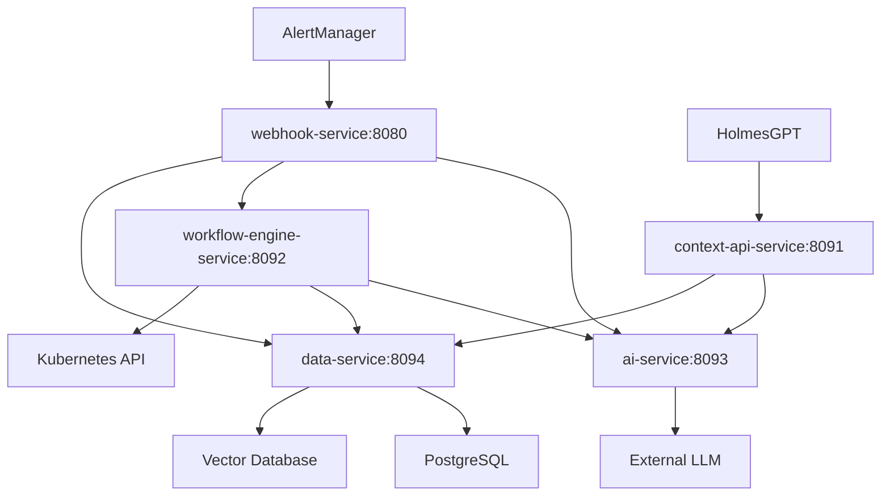

# Kubernaut - Approved 10-Service Communication Architecture

**Document Version**: 2.0
**Date**: September 28, 2025
**Status**: **APPROVED** - Aligned with Official Architecture Specification
**Module**: 10-Service Microservices Communication Layer

---

## 1. Overview

This document defines the communication patterns and protocols between Kubernaut's **approved 10-service microservices architecture**, establishing clear service boundaries, data flow, and integration patterns for the distributed architecture following Single Responsibility Principle compliance.

**Reference**: `docs/architecture/APPROVED_MICROSERVICES_ARCHITECTURE.md`

## 2. Service Architecture

### 2.1 Approved 10-Service Architecture

**Service Specifications**: For detailed service descriptions, business requirements, and API specifications, see [Service Catalog](KUBERNAUT_SERVICE_CATALOG.md). This section focuses on communication-specific details: ports, dependencies, and external connections.

```yaml
Services:
  gateway-service:
    # Purpose: See Service Catalog for detailed specifications
    Port: 8080 (HTTP), 9080 (metrics), 8180 (health)
    Image: quay.io/jordigilh/gateway-service:v1.0.0
    Dependencies: [alert-service]
    External: [Prometheus, Grafana]

  alert-service:
    # Purpose: See Service Catalog for detailed specifications
    Port: 8081 (HTTP), 9081 (metrics), 8181 (health)
    Image: quay.io/jordigilh/alert-service:v1.0.0
    Dependencies: [ai-service]
    External: [None - internal only]

  ai-service:
    # Purpose: See Service Catalog for detailed specifications
    Port: 8082 (HTTP), 9082 (metrics), 8182 (health)
    Image: quay.io/jordigilh/ai-service:v1.0.0
    Dependencies: [workflow-service]
    External: [OpenAI, Anthropic, Azure, AWS, Ollama]

  workflow-service:
    # Purpose: See Service Catalog for detailed specifications
    Port: 8083 (HTTP), 9083 (metrics), 8183 (health)
    Image: quay.io/jordigilh/workflow-service:v1.0.0
    Dependencies: [executor-service]
    External: [None - internal only]

  executor-service:
    Purpose: Kubernetes Operations Only
    Port: 8084 (HTTP), 9084 (metrics), 8184 (health)
    Image: quay.io/jordigilh/executor-service:v1.0.0
    Dependencies: [storage-service]
    External: [Kubernetes Clusters]

  storage-service:
    Purpose: Data Persistence Only
    Port: 8085 (HTTP), 9085 (metrics), 8185 (health)
    Image: quay.io/jordigilh/storage-service:v1.0.0
    Dependencies: [intelligence-service]
    External: [PostgreSQL, Vector DBs]

  intelligence-service:
    Purpose: Pattern Discovery Only
    Port: 8086 (HTTP), 9086 (metrics), 8186 (health)
    Image: quay.io/jordigilh/intelligence-service:v1.0.0
    Dependencies: [monitor-service]
    External: [None - internal only]

  monitor-service:
    Purpose: Effectiveness Assessment Only
    Port: 8080 (HTTP), 9090 (metrics)
    Image: quay.io/jordigilh/monitor-service:v1.0.0
    Dependencies: [context-service]
    External: [None - internal only]

  context-service:
    Purpose: Context Orchestration Only
    Port: 8091 (HTTP), 9091 (metrics), 8191 (health)
    Image: quay.io/jordigilh/context-service:v1.0.0
    Dependencies: [notification-service]
    External: [HolmesGPT, External AI]

  notification-service:
    Purpose: Multi-Channel Notifications Only
    Port: 8089 (HTTP), 9089 (metrics), 8189 (health)
    Image: quay.io/jordigilh/notification-service:v1.0.0
    Dependencies: [None - terminal service]
    External: [Slack, Teams, Email, PagerDuty]
```

### 2.2 Service Boundaries



---

## 3. Communication Patterns

### 3.1 Webhook Service Communication

#### 3.1.1 Alert Processing Flow

**Current Implementation**: Direct in-process calls
**Target Architecture**: HTTP-based service communication

```yaml
Alert Processing Flow:
  1. AlertManager → webhook-service:8080/alerts (HTTP POST)
  2. webhook-service → ai-service:8093/analyze-alert (HTTP POST)
  3. webhook-service → workflow-engine-service:8092/execute-action (HTTP POST)
  4. webhook-service → data-service:8094/store-action (HTTP POST)
```

#### 3.1.2 Communication Interfaces

**AI Service Integration**:
```http
POST /api/v1/analyze-alert
Content-Type: application/json

{
  "alert": {
    "name": "HighMemoryUsage",
    "severity": "critical",
    "namespace": "default",
    "resource": "webapp-deployment",
    "labels": {...},
    "annotations": {...}
  },
  "context": {
    "request_id": "uuid",
    "timestamp": "2025-09-26T23:00:00Z"
  }
}

Response:
{
  "action": "restart_pod",
  "confidence": 0.85,
  "reasoning": {
    "summary": "Critical memory alert detected...",
    "primary_reason": "Memory usage exceeded threshold",
    "historical_context": "Previous restarts successful",
    "oscillation_risk": "Low risk based on history"
  },
  "parameters": {
    "namespace": "default",
    "resource": "webapp-deployment",
    "strategy": "rolling_restart"
  }
}
```

**Workflow Engine Integration**:
```http
POST /api/v1/execute-action
Content-Type: application/json

{
  "action": {
    "type": "restart_pod",
    "parameters": {
      "namespace": "default",
      "resource": "webapp-deployment",
      "strategy": "rolling_restart"
    },
    "confidence": 0.85
  },
  "alert": {
    "name": "HighMemoryUsage",
    "severity": "critical",
    "namespace": "default"
  },
  "context": {
    "request_id": "uuid",
    "action_id": "action-uuid"
  }
}

Response:
{
  "success": true,
  "workflow_id": "workflow-uuid",
  "execution_id": "exec-uuid",
  "status": "executing",
  "estimated_duration": "30s"
}
```

### 3.2 Context API Service Communication

#### 3.2.1 HolmesGPT Integration

**Current Implementation**: HTTP REST API (already implemented)
**Target Architecture**: Enhanced with service mesh integration

```yaml
HolmesGPT Integration Flow:
  1. HolmesGPT → context-api-service:8091/api/v1/context/* (HTTP GET)
  2. context-api-service → ai-service:8093/enhance-context (HTTP POST)
  3. context-api-service → data-service:8094/query-patterns (HTTP GET)
```

#### 3.2.2 Context Enhancement

**AI Service Integration**:
```http
POST /api/v1/enhance-context
Content-Type: application/json

{
  "context_type": "kubernetes",
  "investigation_id": "inv-uuid",
  "raw_context": {
    "namespace": "default",
    "resource_type": "deployment",
    "resource_name": "webapp"
  },
  "enhancement_options": {
    "include_patterns": true,
    "include_history": true,
    "max_depth": 3
  }
}

Response:
{
  "enhanced_context": {
    "kubernetes": {...},
    "patterns": [...],
    "history": [...],
    "recommendations": [...]
  },
  "confidence": 0.92,
  "processing_time_ms": 150
}
```

### 3.3 Service Discovery and Health

#### 3.3.1 Service Registration

```yaml
Service Discovery Pattern:
  - Kubernetes native service discovery
  - DNS-based service resolution
  - Health check endpoints for load balancing
  - Circuit breaker patterns for resilience
```

#### 3.3.2 Health Check Endpoints

**Standard Health Check Interface**:
```http
GET /health
Response:
{
  "status": "healthy|degraded|unhealthy",
  "service": "webhook-service",
  "version": "1.0.0",
  "components": {
    "database": "healthy",
    "kubernetes": "healthy",
    "ai-service": "degraded",
    "external-llm": "unavailable"
  },
  "uptime": "2h30m15s",
  "last_check": "2025-09-26T23:00:00Z"
}
```

---

## 4. Communication Protocols

### 4.1 HTTP/REST Communication

#### 4.1.1 Standard Headers

```http
# Request Headers
Content-Type: application/json
Accept: application/json
X-Request-ID: uuid
X-Service-Name: webhook-service
X-Service-Version: 1.0.0
Authorization: Bearer <service-token>

# Response Headers
Content-Type: application/json
X-Response-Time: 150ms
X-Service-Name: ai-service
X-Request-ID: uuid
```

#### 4.1.2 Error Handling

```json
{
  "error": {
    "code": "SERVICE_UNAVAILABLE",
    "message": "AI service is temporarily unavailable",
    "details": {
      "service": "ai-service",
      "endpoint": "/api/v1/analyze-alert",
      "retry_after": "30s"
    },
    "request_id": "uuid",
    "timestamp": "2025-09-26T23:00:00Z"
  }
}
```

### 4.2 Resilience Patterns

#### 4.2.1 Circuit Breaker Configuration

```yaml
Circuit Breaker Settings:
  failure_threshold: 5
  recovery_timeout: 30s
  half_open_max_calls: 3
  timeout: 10s

Retry Policy:
  max_attempts: 3
  backoff_strategy: exponential
  initial_delay: 1s
  max_delay: 10s
```

#### 4.2.2 Fallback Mechanisms

```yaml
Fallback Strategies:
  ai-service-unavailable:
    - Use rule-based analysis
    - Return cached recommendations
    - Degrade to notification-only

  workflow-engine-unavailable:
    - Queue actions for later execution
    - Use direct Kubernetes API calls
    - Log for manual intervention

  data-service-unavailable:
    - Continue without persistence
    - Use in-memory caching
    - Alert operations team
```

---

## 5. Security and Authentication

### 5.1 Service-to-Service Authentication

#### 5.1.1 JWT Token-Based Authentication

```yaml
Authentication Flow:
  1. Service obtains JWT token from auth service
  2. Token includes service identity and permissions
  3. Target service validates token signature
  4. Authorization based on service permissions
```

#### 5.1.2 Service Permissions Matrix

```yaml
Permissions:
  webhook-service:
    - ai-service: [analyze-alert, health-check]
    - workflow-engine-service: [execute-action, health-check]
    - data-service: [store-action, query-history, health-check]

  context-api-service:
    - ai-service: [enhance-context, health-check]
    - data-service: [query-patterns, query-history, health-check]

  workflow-engine-service:
    - ai-service: [optimize-workflow, health-check]
    - data-service: [store-execution, query-patterns, health-check]
```

### 5.2 Network Security

#### 5.2.1 Service Mesh Integration

```yaml
Service Mesh Features:
  - mTLS for all service-to-service communication
  - Traffic encryption and authentication
  - Network policies for service isolation
  - Distributed tracing and observability
```

---

## 6. Observability and Monitoring

### 6.1 Distributed Tracing

#### 6.1.1 Trace Propagation

```http
# Trace Headers
X-Trace-ID: trace-uuid
X-Span-ID: span-uuid
X-Parent-Span-ID: parent-span-uuid
X-Trace-Flags: 01
```

#### 6.1.2 Span Annotations

```yaml
Span Annotations:
  - service.name: webhook-service
  - service.version: 1.0.0
  - operation.name: process-alert
  - alert.name: HighMemoryUsage
  - alert.severity: critical
  - downstream.service: ai-service
  - downstream.operation: analyze-alert
```

### 6.2 Metrics Collection

#### 6.2.1 Service Metrics

```prometheus
# Request Metrics
http_requests_total{service="webhook-service", endpoint="/alerts", status="200"}
http_request_duration_seconds{service="webhook-service", endpoint="/alerts"}

# Business Metrics
alerts_processed_total{service="webhook-service", severity="critical"}
actions_executed_total{service="workflow-engine-service", action="restart_pod"}

# Service Health Metrics
service_health_status{service="webhook-service", component="database"}
service_dependency_status{service="webhook-service", dependency="ai-service"}
```

---

## 7. Migration Strategy

### 7.1 Phased Migration Approach

#### 7.1.1 Phase 1: Webhook Service (✅ Complete)

```yaml
Status: Complete
Changes:
  - Extracted webhook processing to independent service
  - Implemented TDD methodology
  - Created Docker image with upstream community UBI9
  - Deployed Kubernetes manifests
  - Maintained backward compatibility
```

#### 7.1.2 Phase 2: Context API Service (In Progress)

```yaml
Status: Planning
Changes:
  - Extract context API to independent service
  - Implement HTTP-based context enhancement
  - Add service-to-service authentication
  - Deploy with service mesh integration
```

#### 7.1.3 Phase 3: AI Service

```yaml
Status: Planned
Changes:
  - Extract AI/LLM processing to independent service
  - Implement async processing for long-running operations
  - Add model management and versioning
  - Implement advanced caching strategies
```

### 7.2 Backward Compatibility

#### 7.2.1 API Versioning

```yaml
Versioning Strategy:
  - Semantic versioning for service APIs
  - Backward compatibility for 2 major versions
  - Deprecation notices with 6-month timeline
  - Feature flags for gradual rollout
```

---

## 8. Implementation Guidelines

### 8.1 Service Development Standards

#### 8.1.1 HTTP Client Configuration

```go
// Standard HTTP client configuration for service communication
func NewServiceClient(baseURL string, timeout time.Duration) *http.Client {
    return &http.Client{
        Timeout: timeout,
        Transport: &http.Transport{
            MaxIdleConns:        100,
            MaxIdleConnsPerHost: 10,
            IdleConnTimeout:     90 * time.Second,
            DisableKeepAlives:   false,
        },
    }
}
```

#### 8.1.2 Error Handling Patterns

```go
// Standard error handling for service communication
type ServiceError struct {
    Code       string    `json:"code"`
    Message    string    `json:"message"`
    Service    string    `json:"service"`
    Endpoint   string    `json:"endpoint"`
    RequestID  string    `json:"request_id"`
    Timestamp  time.Time `json:"timestamp"`
    Retryable  bool      `json:"retryable"`
}

func (e *ServiceError) Error() string {
    return fmt.Sprintf("%s: %s (service: %s, endpoint: %s)", e.Code, e.Message, e.Service, e.Endpoint)
}
```

### 8.2 Testing Strategies

#### 8.2.1 Contract Testing

```yaml
Contract Testing Approach:
  - Define API contracts using OpenAPI specifications
  - Generate client SDKs from contracts
  - Validate service implementations against contracts
  - Use consumer-driven contract testing (Pact)
```

#### 8.2.2 Integration Testing

```yaml
Integration Testing Strategy:
  - Test service communication in Kind clusters
  - Use real HTTP calls between services
  - Validate end-to-end workflows
  - Test failure scenarios and fallbacks
```

---

## 9. Future Enhancements

### 9.1 Advanced Communication Patterns

#### 9.1.1 Event-Driven Architecture

```yaml
Future Enhancements:
  - Message queues for async communication
  - Event sourcing for audit trails
  - CQRS for read/write separation
  - Saga pattern for distributed transactions
```

#### 9.1.2 GraphQL Federation

```yaml
GraphQL Integration:
  - Federated GraphQL gateway
  - Service-specific GraphQL schemas
  - Real-time subscriptions
  - Unified API for frontend clients
```

---

## 10. Conclusion

This microservices communication architecture provides:

1. **Clear Service Boundaries**: Well-defined responsibilities and interfaces
2. **Resilient Communication**: Circuit breakers, retries, and fallbacks
3. **Observability**: Comprehensive tracing, metrics, and logging
4. **Security**: Service-to-service authentication and encryption
5. **Scalability**: Independent scaling and deployment capabilities

The architecture supports the transition from monolithic to microservices while maintaining system reliability and performance.
