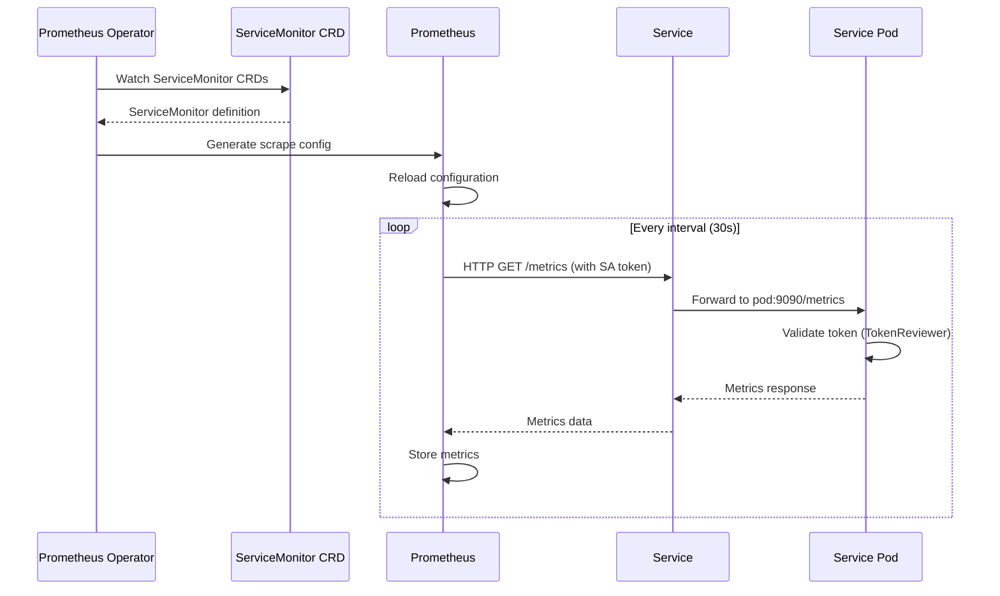

# Prometheus ServiceMonitor Pattern - Kubernaut Services

**Version**: 1.0
**Last Updated**: October 6, 2025
**Status**: ✅ Authoritative Reference
**Scope**: All Kubernaut Services (CRD Controllers & Stateless HTTP Services)

---

## 📋 Table of Contents

1. [Overview](#overview)
2. [ServiceMonitor Architecture](#servicemonitor-architecture)
3. [Authentication](#authentication)
4. [ServiceMonitor Definitions](#servicemonitor-definitions)
5. [Service Definitions](#service-definitions)
6. [Prometheus Configuration](#prometheus-configuration)
7. [Deployment Guide](#deployment-guide)
8. [Troubleshooting](#troubleshooting)
9. [Testing](#testing)

---

## Overview

### Purpose

**ServiceMonitor** is the Prometheus Operator's Custom Resource Definition (CRD) for declaratively configuring which services Prometheus should scrape for metrics.

### Key Benefits

1. ✅ **GitOps-Friendly**: Declarative YAML configuration
2. ✅ **Automatic Discovery**: Prometheus Operator auto-configures scraping
3. ✅ **Label-Based Selection**: Flexible service targeting
4. ✅ **Built-in Auth**: TokenReviewer authentication support
5. ✅ **No Manual Config**: No Prometheus config reloads needed
6. ✅ **Multi-Namespace**: Works across namespaces

---

## ServiceMonitor Architecture

### How ServiceMonitor Works

```
┌─────────────────────────────────────────────┐
│         Prometheus Operator                 │
│                                             │
│  1. Watches ServiceMonitor CRDs             │
│  2. Generates Prometheus scrape configs     │
│  3. Reloads Prometheus configuration        │
└─────────────┬───────────────────────────────┘
              │ Watches
              ▼
┌─────────────────────────────────────────────┐
│         ServiceMonitor CRD                  │
│                                             │
│  - Selector: matchLabels                    │
│  - Endpoints: port, interval, auth          │
└─────────────┬───────────────────────────────┘
              │ Selects
              ▼
┌─────────────────────────────────────────────┐
│         Kubernetes Service                  │
│                                             │
│  - Port: 9090 (metrics)                     │
│  - Labels: app=service-name                 │
└─────────────┬───────────────────────────────┘
              │ Routes to
              ▼
┌─────────────────────────────────────────────┐
│         Service Pod                         │
│                                             │
│  - Port 9090: /metrics endpoint             │
│  - Auth: TokenReviewer middleware           │
└─────────────────────────────────────────────┘
```

---

### Flow Diagram



---

## Authentication

### TokenReviewer Integration

**All Kubernaut services use TokenReviewer authentication** for metrics endpoints.

**Key Configuration**:
```yaml
spec:
  endpoints:
  - port: metrics
    interval: 30s
    # TokenReviewer authentication using ServiceAccount token
    bearerTokenFile: /var/run/secrets/kubernetes.io/serviceaccount/token
```

**See**: [Kubernetes TokenReviewer Authentication](./KUBERNETES_TOKENREVIEWER_AUTH.md) for complete implementation

---

### Prometheus ServiceAccount

**Prometheus requires a ServiceAccount** with permissions to scrape metrics:

```yaml
apiVersion: v1
kind: ServiceAccount
metadata:
  name: prometheus
  namespace: monitoring
---
apiVersion: rbac.authorization.k8s.io/v1
kind: ClusterRole
metadata:
  name: prometheus
rules:
# Service discovery
- apiGroups: [""]
  resources: ["services", "endpoints", "pods"]
  verbs: ["get", "list", "watch"]
# Node metrics
- apiGroups: [""]
  resources: ["nodes/metrics"]
  verbs: ["get"]
# Non-resource URLs (metrics endpoints)
- nonResourceURLs: ["/metrics"]
  verbs: ["get"]
---
apiVersion: rbac.authorization.k8s.io/v1
kind: ClusterRoleBinding
metadata:
  name: prometheus
roleRef:
  apiGroup: rbac.authorization.k8s.io
  kind: ClusterRole
  name: prometheus
subjects:
- kind: ServiceAccount
  name: prometheus
  namespace: monitoring
```

---

## ServiceMonitor Definitions

### CRD Controllers (5 Services)

All CRD controllers expose metrics on **port 9090** only.

---

#### 1. Remediation Orchestrator

```yaml
apiVersion: monitoring.coreos.com/v1
kind: ServiceMonitor
metadata:
  name: remediation-orchestrator-metrics
  namespace: kubernaut-system
  labels:
    app: remediation-orchestrator
    component: controller
spec:
  selector:
    matchLabels:
      app: remediation-orchestrator
  endpoints:
  - port: metrics
    path: /metrics
    interval: 30s
    scrapeTimeout: 10s
    # TokenReviewer authentication
    bearerTokenFile: /var/run/secrets/kubernetes.io/serviceaccount/token
    # Relabeling
    relabelings:
    - sourceLabels: [__meta_kubernetes_pod_name]
      targetLabel: pod
    - sourceLabels: [__meta_kubernetes_pod_node_name]
      targetLabel: node
  namespaceSelector:
    matchNames:
    - kubernaut-system
```

---

#### 2. Remediation Processor

```yaml
apiVersion: monitoring.coreos.com/v1
kind: ServiceMonitor
metadata:
  name: remediation-processor-metrics
  namespace: kubernaut-system
  labels:
    app: remediation-processor
    component: controller
spec:
  selector:
    matchLabels:
      app: remediation-processor
  endpoints:
  - port: metrics
    path: /metrics
    interval: 30s
    scrapeTimeout: 10s
    bearerTokenFile: /var/run/secrets/kubernetes.io/serviceaccount/token
    relabelings:
    - sourceLabels: [__meta_kubernetes_pod_name]
      targetLabel: pod
    - sourceLabels: [__meta_kubernetes_pod_node_name]
      targetLabel: node
  namespaceSelector:
    matchNames:
    - kubernaut-system
```

---

#### 3. AI Analysis

```yaml
apiVersion: monitoring.coreos.com/v1
kind: ServiceMonitor
metadata:
  name: ai-analysis-metrics
  namespace: kubernaut-system
  labels:
    app: ai-analysis
    component: controller
spec:
  selector:
    matchLabels:
      app: ai-analysis
  endpoints:
  - port: metrics
    path: /metrics
    interval: 30s
    scrapeTimeout: 10s
    bearerTokenFile: /var/run/secrets/kubernetes.io/serviceaccount/token
    relabelings:
    - sourceLabels: [__meta_kubernetes_pod_name]
      targetLabel: pod
    - sourceLabels: [__meta_kubernetes_pod_node_name]
      targetLabel: node
  namespaceSelector:
    matchNames:
    - kubernaut-system
```

---

#### 4. Workflow Execution

```yaml
apiVersion: monitoring.coreos.com/v1
kind: ServiceMonitor
metadata:
  name: workflow-execution-metrics
  namespace: kubernaut-system
  labels:
    app: workflow-execution
    component: controller
spec:
  selector:
    matchLabels:
      app: workflow-execution
  endpoints:
  - port: metrics
    path: /metrics
    interval: 30s
    scrapeTimeout: 10s
    bearerTokenFile: /var/run/secrets/kubernetes.io/serviceaccount/token
    relabelings:
    - sourceLabels: [__meta_kubernetes_pod_name]
      targetLabel: pod
    - sourceLabels: [__meta_kubernetes_pod_node_name]
      targetLabel: node
  namespaceSelector:
    matchNames:
    - kubernaut-system
```

---

#### 5. Kubernetes Executor (DEPRECATED - ADR-025)

```yaml
apiVersion: monitoring.coreos.com/v1
kind: ServiceMonitor
metadata:
  name: kubernetes-executor-metrics
  namespace: kubernaut-system
  labels:
    app: kubernetes-executor
    component: controller
spec:
  selector:
    matchLabels:
      app: kubernetes-executor
  endpoints:
  - port: metrics
    path: /metrics
    interval: 30s
    scrapeTimeout: 10s
    bearerTokenFile: /var/run/secrets/kubernetes.io/serviceaccount/token
    relabelings:
    - sourceLabels: [__meta_kubernetes_pod_name]
      targetLabel: pod
    - sourceLabels: [__meta_kubernetes_pod_node_name]
      targetLabel: node
  namespaceSelector:
    matchNames:
    - kubernaut-system
```

---

### Stateless HTTP Services (3 Services)

Stateless services expose metrics on **port 9090** and API on **port 8080**.

---

#### 6. Gateway Service

```yaml
apiVersion: monitoring.coreos.com/v1
kind: ServiceMonitor
metadata:
  name: gateway-service-metrics
  namespace: kubernaut-system
  labels:
    app: gateway-service
    component: http-service
spec:
  selector:
    matchLabels:
      app: gateway-service
  endpoints:
  - port: metrics
    path: /metrics
    interval: 30s
    scrapeTimeout: 10s
    bearerTokenFile: /var/run/secrets/kubernetes.io/serviceaccount/token
    relabelings:
    - sourceLabels: [__meta_kubernetes_pod_name]
      targetLabel: pod
    - sourceLabels: [__meta_kubernetes_pod_node_name]
      targetLabel: node
    # Additional labels for HTTP services
    - sourceLabels: [__address__]
      targetLabel: __param_target
    - sourceLabels: [__param_target]
      targetLabel: instance
  namespaceSelector:
    matchNames:
    - kubernaut-system
```

---

#### 7. Notification Service

```yaml
apiVersion: monitoring.coreos.com/v1
kind: ServiceMonitor
metadata:
  name: notification-service-metrics
  namespace: kubernaut-system
  labels:
    app: notification-service
    component: http-service
spec:
  selector:
    matchLabels:
      app: notification-service
  endpoints:
  - port: metrics
    path: /metrics
    interval: 30s
    scrapeTimeout: 10s
    bearerTokenFile: /var/run/secrets/kubernetes.io/serviceaccount/token
    relabelings:
    - sourceLabels: [__meta_kubernetes_pod_name]
      targetLabel: pod
    - sourceLabels: [__meta_kubernetes_pod_node_name]
      targetLabel: node
    - sourceLabels: [__address__]
      targetLabel: __param_target
    - sourceLabels: [__param_target]
      targetLabel: instance
  namespaceSelector:
    matchNames:
    - kubernaut-system
```

---

#### 8. HolmesGPT API

```yaml
apiVersion: monitoring.coreos.com/v1
kind: ServiceMonitor
metadata:
  name: holmesgpt-api-metrics
  namespace: kubernaut-system
  labels:
    app: holmesgpt-api
    component: http-service
spec:
  selector:
    matchLabels:
      app: holmesgpt-api
  endpoints:
  - port: metrics
    path: /metrics
    interval: 30s
    scrapeTimeout: 10s
    bearerTokenFile: /var/run/secrets/kubernetes.io/serviceaccount/token
    relabelings:
    - sourceLabels: [__meta_kubernetes_pod_name]
      targetLabel: pod
    - sourceLabels: [__meta_kubernetes_pod_node_name]
      targetLabel: node
    - sourceLabels: [__address__]
      targetLabel: __param_target
    - sourceLabels: [__param_target]
      targetLabel: instance
  namespaceSelector:
    matchNames:
    - kubernaut-system
```

---

## Service Definitions

### Kubernetes Service Resources

Each service needs a Kubernetes Service resource to expose metrics endpoints.

---

### CRD Controller Service Pattern

```yaml
apiVersion: v1
kind: Service
metadata:
  name: {service-name}
  namespace: kubernaut-system
  labels:
    app: {service-name}
    component: controller
spec:
  selector:
    app: {service-name}
  ports:
  - name: metrics
    port: 9090
    targetPort: 9090
    protocol: TCP
  type: ClusterIP
```

---

### HTTP Service Pattern

```yaml
apiVersion: v1
kind: Service
metadata:
  name: {service-name}
  namespace: kubernaut-system
  labels:
    app: {service-name}
    component: http-service
spec:
  selector:
    app: {service-name}
  ports:
  - name: http
    port: 8080
    targetPort: 8080
    protocol: TCP
  - name: metrics
    port: 9090
    targetPort: 9090
    protocol: TCP
  type: ClusterIP
```

---

### Complete Service Examples

#### Remediation Orchestrator Service

```yaml
apiVersion: v1
kind: Service
metadata:
  name: remediation-orchestrator
  namespace: kubernaut-system
  labels:
    app: remediation-orchestrator
    component: controller
spec:
  selector:
    app: remediation-orchestrator
  ports:
  - name: metrics
    port: 9090
    targetPort: 9090
    protocol: TCP
  type: ClusterIP
```

---

#### Gateway Service

```yaml
apiVersion: v1
kind: Service
metadata:
  name: gateway-service
  namespace: kubernaut-system
  labels:
    app: gateway-service
    component: http-service
spec:
  selector:
    app: gateway-service
  ports:
  - name: http
    port: 8080
    targetPort: 8080
    protocol: TCP
  - name: metrics
    port: 9090
    targetPort: 9090
    protocol: TCP
  type: ClusterIP
```

---

## Prometheus Configuration

### Prometheus Operator Setup

**Prerequisites**:
1. Prometheus Operator installed
2. Prometheus CRD created
3. ServiceAccount with RBAC permissions

---

### Prometheus CRD

```yaml
apiVersion: monitoring.coreos.com/v1
kind: Prometheus
metadata:
  name: kubernaut
  namespace: monitoring
spec:
  replicas: 2
  version: v2.45.0
  serviceAccountName: prometheus

  # ServiceMonitor selection
  serviceMonitorSelector:
    matchLabels:
      component: controller
  serviceMonitorNamespaceSelector:
    matchNames:
    - kubernaut-system

  # Additional ServiceMonitors for HTTP services
  additionalServiceMonitorSelectors:
  - matchLabels:
      component: http-service

  # Storage
  retention: 30d
  storage:
    volumeClaimTemplate:
      spec:
        accessModes: ["ReadWriteOnce"]
        resources:
          requests:
            storage: 50Gi

  # Resources
  resources:
    requests:
      memory: 2Gi
      cpu: 1
    limits:
      memory: 4Gi
      cpu: 2

  # Security
  securityContext:
    fsGroup: 2000
    runAsNonRoot: true
    runAsUser: 1000
```

---

### ServiceMonitor Namespace Discovery

**Option 1: Single Namespace** (Recommended for V1):
```yaml
spec:
  namespaceSelector:
    matchNames:
    - kubernaut-system
```

**Option 2: All Namespaces**:
```yaml
spec:
  namespaceSelector:
    any: true
```

**Option 3: Label-Based**:
```yaml
spec:
  namespaceSelector:
    matchLabels:
      monitoring: enabled
```

---

## Deployment Guide

### Step 1: Install Prometheus Operator

```bash
# Using Helm
helm repo add prometheus-community https://prometheus-community.github.io/helm-charts
helm repo update

helm install prometheus-operator prometheus-community/kube-prometheus-stack \
  --namespace monitoring \
  --create-namespace \
  --set prometheus.prometheusSpec.serviceMonitorSelectorNilUsesHelmValues=false
```

---

### Step 2: Create Prometheus ServiceAccount

```bash
kubectl apply -f - <<EOF
apiVersion: v1
kind: ServiceAccount
metadata:
  name: prometheus
  namespace: monitoring
---
apiVersion: rbac.authorization.k8s.io/v1
kind: ClusterRole
metadata:
  name: prometheus
rules:
- apiGroups: [""]
  resources: ["services", "endpoints", "pods"]
  verbs: ["get", "list", "watch"]
- apiGroups: [""]
  resources: ["nodes/metrics"]
  verbs: ["get"]
- nonResourceURLs: ["/metrics"]
  verbs: ["get"]
---
apiVersion: rbac.authorization.k8s.io/v1
kind: ClusterRoleBinding
metadata:
  name: prometheus
roleRef:
  apiGroup: rbac.authorization.k8s.io
  kind: ClusterRole
  name: prometheus
subjects:
- kind: ServiceAccount
  name: prometheus
  namespace: monitoring
EOF
```

---

### Step 3: Deploy Kubernaut Services

```bash
# Deploy all services with metrics endpoints
kubectl apply -f deploy/remediation-orchestrator-deployment.yaml
kubectl apply -f deploy/remediation-processor-deployment.yaml
kubectl apply -f deploy/ai-analysis-deployment.yaml
kubectl apply -f deploy/workflow-execution-deployment.yaml
kubectl apply -f deploy/kubernetes-executor-deployment.yaml  # DEPRECATED - ADR-025
kubectl apply -f deploy/gateway-service-deployment.yaml
kubectl apply -f deploy/notification-service-deployment.yaml
kubectl apply -f deploy/holmesgpt-api-deployment.yaml
```

---

### Step 4: Create Kubernetes Services

```bash
# Create Service resources for metrics
kubectl apply -f deploy/remediation-orchestrator-service.yaml
kubectl apply -f deploy/remediation-processor-service.yaml
# ... etc for all services
```

---

### Step 5: Deploy ServiceMonitors

```bash
# Deploy all ServiceMonitor CRDs
kubectl apply -f deploy/servicemonitors/remediation-orchestrator-servicemonitor.yaml
kubectl apply -f deploy/servicemonitors/remediation-processor-servicemonitor.yaml
kubectl apply -f deploy/servicemonitors/ai-analysis-servicemonitor.yaml
kubectl apply -f deploy/servicemonitors/workflow-execution-servicemonitor.yaml
kubectl apply -f deploy/servicemonitors/kubernetes-executor-servicemonitor.yaml  # DEPRECATED - ADR-025
kubectl apply -f deploy/servicemonitors/gateway-service-servicemonitor.yaml
kubectl apply -f deploy/servicemonitors/notification-service-servicemonitor.yaml
kubectl apply -f deploy/servicemonitors/holmesgpt-api-servicemonitor.yaml
```

---

### Step 6: Verify Configuration

```bash
# Check ServiceMonitors are created
kubectl get servicemonitors -n kubernaut-system

# Check Prometheus targets
kubectl port-forward -n monitoring svc/prometheus-operated 9090:9090

# Open browser: http://localhost:9090/targets
# Look for kubernaut-system/* targets
```

---

## Troubleshooting

### Common Issues

#### 1. ServiceMonitor Not Discovered

**Symptoms**: ServiceMonitor exists but Prometheus not scraping

**Causes**:
- Label mismatch between ServiceMonitor and Prometheus selector
- Namespace not selected
- Service not found

**Fix**:
```bash
# Check Prometheus ServiceMonitor selector
kubectl get prometheus -n monitoring kubernaut -o yaml | grep -A 5 serviceMonitorSelector

# Check ServiceMonitor labels
kubectl get servicemonitor -n kubernaut-system --show-labels

# Check Service exists
kubectl get svc -n kubernaut-system
```

---

#### 2. Authentication Failures

**Symptoms**: 401 Unauthorized errors in Prometheus targets

**Cause**: TokenReviewer authentication failing

**Fix**:
```bash
# Check Prometheus ServiceAccount token
kubectl -n monitoring get secret \
  $(kubectl -n monitoring get sa prometheus -o jsonpath='{.secrets[0].name}') \
  -o jsonpath='{.data.token}' | base64 -d

# Check service has TokenReviewer middleware
kubectl logs -n kubernaut-system deployment/remediation-orchestrator | grep "Authentication"

# Test manually
TOKEN=$(kubectl -n monitoring create token prometheus)
curl -H "Authorization: Bearer $TOKEN" \
  http://remediation-orchestrator.kubernaut-system:9090/metrics
```

---

#### 3. Metrics Endpoint Not Responding

**Symptoms**: Connection refused or timeout

**Cause**: Service not exposing port 9090

**Fix**:
```bash
# Check pod is listening on port 9090
kubectl exec -n kubernaut-system deployment/remediation-orchestrator -- \
  netstat -tlnp | grep 9090

# Check Service port configuration
kubectl get svc -n kubernaut-system remediation-orchestrator -o yaml | grep -A 5 ports

# Test from within cluster
kubectl run -n kubernaut-system test-pod --image=curlimages/curl -it --rm -- \
  curl http://remediation-orchestrator:9090/metrics
```

---

#### 4. Relabeling Issues

**Symptoms**: Missing labels in Prometheus metrics

**Cause**: Relabeling configuration incorrect

**Fix**: Check relabeling in ServiceMonitor
```yaml
spec:
  endpoints:
  - port: metrics
    relabelings:
    # Correct syntax
    - sourceLabels: [__meta_kubernetes_pod_name]
      targetLabel: pod
```

---

### Debug Commands

```bash
# View Prometheus configuration
kubectl exec -n monitoring prometheus-kubernaut-0 -- cat /etc/prometheus/config_out/prometheus.env.yaml

# Check Prometheus logs
kubectl logs -n monitoring prometheus-kubernaut-0 -f

# Check ServiceMonitor status
kubectl describe servicemonitor -n kubernaut-system remediation-orchestrator-metrics

# List all targets
kubectl port-forward -n monitoring svc/prometheus-operated 9090:9090
# Browser: http://localhost:9090/api/v1/targets
```

---

## Testing

### Manual Testing

#### Test Metrics Endpoint Directly

```bash
# Get ServiceAccount token
TOKEN=$(kubectl -n monitoring create token prometheus --duration=1h)

# Test CRD Controller metrics
curl -H "Authorization: Bearer $TOKEN" \
  http://remediation-orchestrator.kubernaut-system:9090/metrics

# Test HTTP Service metrics
curl -H "Authorization: Bearer $TOKEN" \
  http://gateway-service.kubernaut-system:9090/metrics
```

---

#### Test ServiceMonitor Discovery

```bash
# Port-forward Prometheus
kubectl port-forward -n monitoring svc/prometheus-operated 9090:9090

# Query targets API
curl http://localhost:9090/api/v1/targets | jq '.data.activeTargets[] | select(.labels.namespace=="kubernaut-system")'
```

---

### Integration Testing

#### End-to-End Test Script

```bash
#!/bin/bash
# test-servicemonitor-integration.sh

NAMESPACE="kubernaut-system"
MONITORING_NS="monitoring"

echo "Testing ServiceMonitor Integration..."

# 1. Check all ServiceMonitors exist
echo "Checking ServiceMonitors..."
# Note: kubernetes-executor DEPRECATED - ADR-025
for service in remediation-orchestrator remediation-processor ai-analysis \
                workflow-execution kubernetes-executor gateway-service \
                notification-service holmesgpt-api; do
  kubectl get servicemonitor -n $NAMESPACE ${service}-metrics &>/dev/null
  if [ $? -eq 0 ]; then
    echo "✅ ServiceMonitor: ${service}-metrics"
  else
    echo "❌ ServiceMonitor: ${service}-metrics (NOT FOUND)"
  fi
done

# 2. Check all Services exist
echo ""
echo "Checking Services..."
# Note: kubernetes-executor DEPRECATED - ADR-025
for service in remediation-orchestrator remediation-processor ai-analysis \
                workflow-execution kubernetes-executor gateway-service \
                notification-service holmesgpt-api; do
  kubectl get svc -n $NAMESPACE $service &>/dev/null
  if [ $? -eq 0 ]; then
    echo "✅ Service: $service"
  else
    echo "❌ Service: $service (NOT FOUND)"
  fi
done

# 3. Check Prometheus targets
echo ""
echo "Checking Prometheus targets..."
kubectl port-forward -n $MONITORING_NS svc/prometheus-operated 9090:9090 &>/dev/null &
PF_PID=$!
sleep 2

ACTIVE_TARGETS=$(curl -s http://localhost:9090/api/v1/targets | \
  jq -r '.data.activeTargets[] | select(.labels.namespace=="'$NAMESPACE'") | .labels.job' | \
  sort -u | wc -l)

kill $PF_PID

echo "Active targets in $NAMESPACE: $ACTIVE_TARGETS"
if [ "$ACTIVE_TARGETS" -ge 8 ]; then
  echo "✅ All 8 services are being scraped"
else
  echo "⚠️  Only $ACTIVE_TARGETS/8 services are being scraped"
fi

echo ""
echo "Integration test complete!"
```

---

### Prometheus Query Examples

```promql
# Check if all services are up
up{namespace="kubernaut-system"}

# Count active services
count(up{namespace="kubernaut-system"} == 1)

# Check scrape duration
scrape_duration_seconds{namespace="kubernaut-system"}

# Check authentication failures
up{namespace="kubernaut-system"} == 0
```

---

## Summary

### ServiceMonitor Coverage

| # | Service | ServiceMonitor | Service | Port | Auth |
|---|---------|----------------|---------|------|------|
| 1 | Remediation Orchestrator | ✅ | ✅ | 9090 | TokenReviewer |
| 2 | Remediation Processor | ✅ | ✅ | 9090 | TokenReviewer |
| 3 | AI Analysis | ✅ | ✅ | 9090 | TokenReviewer |
| 4 | Workflow Execution | ✅ | ✅ | 9090 | TokenReviewer |
| 5 | ~~Kubernetes Executor~~ (DEPRECATED - ADR-025) | ✅ | ✅ | 9090 | TokenReviewer |
| 6 | Gateway Service | ✅ | ✅ | 9090 | TokenReviewer |
| 7 | Notification Service | ✅ | ✅ | 9090 | TokenReviewer |
| 8 | HolmesGPT API | ✅ | ✅ | 9090 | TokenReviewer |

---

### Key Takeaways

1. ✅ **All 8 services** have ServiceMonitor definitions
2. ✅ **Consistent pattern** across CRD controllers and HTTP services
3. ✅ **TokenReviewer auth** integrated for all endpoints
4. ✅ **GitOps-ready** - Declarative YAML configuration
5. ✅ **Prometheus Operator** handles automatic discovery
6. ✅ **Production-ready** - Relabeling, timeouts, authentication

---

## References

### Prometheus Documentation
- [ServiceMonitor Specification](https://prometheus-operator.dev/docs/operator/api/#monitoring.coreos.com/v1.ServiceMonitor)
- [Prometheus Operator](https://prometheus-operator.dev/)
- [Relabeling Configuration](https://prometheus.io/docs/prometheus/latest/configuration/configuration/#relabel_config)

### Kubernaut Documentation
- [Kubernetes TokenReviewer Authentication](./KUBERNETES_TOKENREVIEWER_AUTH.md)
- [Service Port Strategy](../services/CROSS_SERVICE_TRIAGE_OCTOBER_2025.md)
- [CRD Controller Overview](../services/crd-controllers/)
- [Stateless Services Overview](../services/stateless/)

---

**Document Status**: ✅ Complete
**Last Updated**: October 6, 2025
**Maintainer**: Kubernaut Architecture Team
**Version**: 1.0
