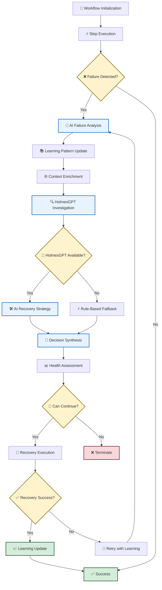
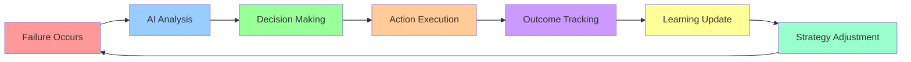
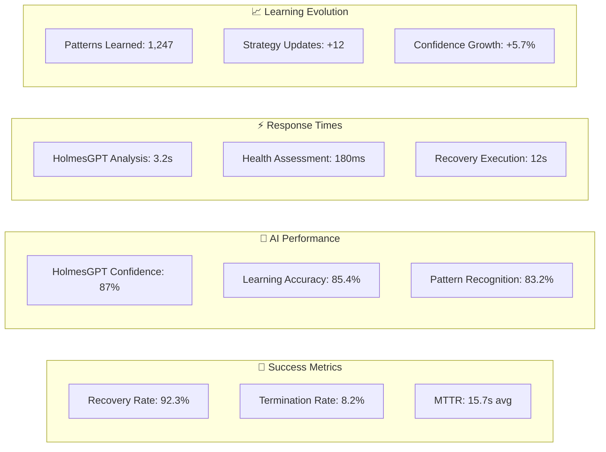
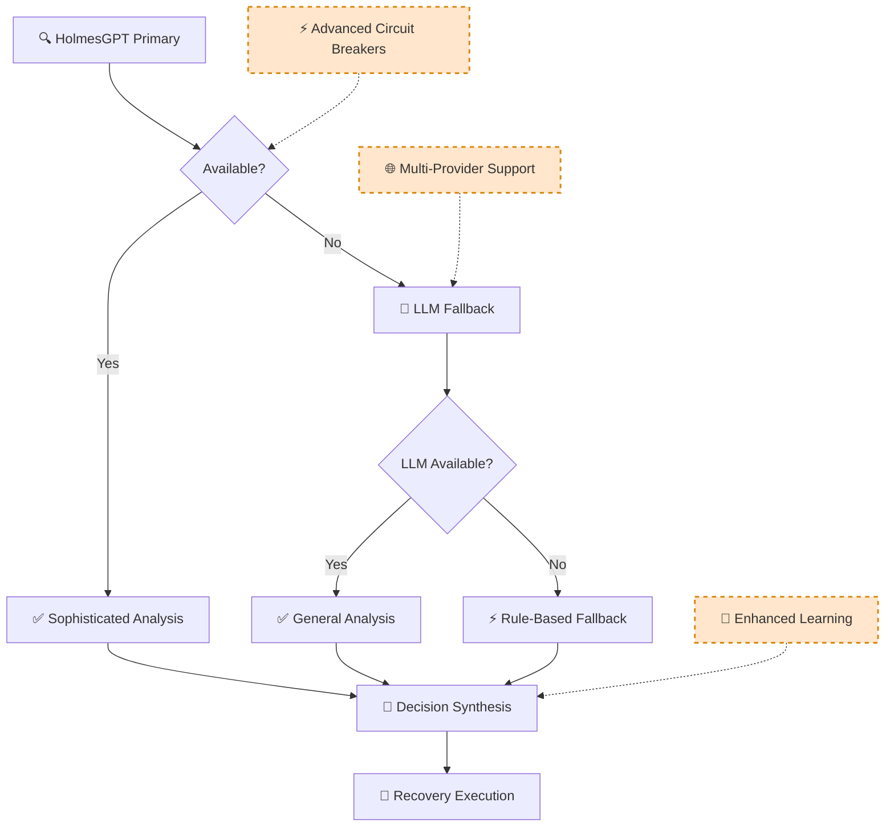

# Resilient Remediation Execution Engine AI Integration Sequence Diagram (V1)

**Version**: 1.1
**Date**: November 15, 2025
**Status**: Updated - Service Naming Corrections

## Changelog

### Version 1.1 (2025-11-15)

**Service Naming Corrections**: Corrected "Workflow Engine" → "Remediation Execution Engine" per ADR-035.

**Changes**:
- Updated all references to use correct service naming
- Aligned terminology with authoritative ADR-035
- Maintained consistency with NAMING_CONVENTION_REMEDIATION_EXECUTION.md

---


**Document Version**: 1.1 (SUPERSEDED)
**Date**: October 31, 2025
**Purpose**: V1 sequence diagram showing HolmesGPT-only AI-powered failure handling and recovery interactions
**Status**: ⚠️ **SUPERSEDED - HISTORICAL REFERENCE ONLY**

## 📋 Version History

| Version | Date | Changes | Status |
|---------|------|---------|--------|
| 1.1 | Oct 31, 2025 | Updated diagram: Kubernetes Executor → Tekton Pipelines (per ADR-023, ADR-025) | SUPERSEDED |
| 1.2 | Nov 15, 2025 | Service naming correction: "Workflow Engine" → "Remediation Execution Engine" (per ADR-035) | Current |
| 1.0 | Jan 2025 | Initial version | SUPERSEDED |

---

## ⚠️ **DOCUMENT STATUS: SUPERSEDED**

**This document has been superseded by the approved failure recovery architecture.**

**Please refer to**: [`PROPOSED_FAILURE_RECOVERY_SEQUENCE.md`](./PROPOSED_FAILURE_RECOVERY_SEQUENCE.md)

### **Key Architectural Changes**

The approved recovery flow differs significantly from this document:

1. **Recovery Coordination**: Remediation Orchestrator coordinates recovery (not Remediation Execution Engine internal handling)
2. **New AIAnalysis CRD**: Recovery creates new AIAnalysis CRD with historical context
3. **Context API Integration**: AIAnalysis queries Context API for previous failures
4. **Recovery Loop Prevention**: Max 3 attempts, pattern detection, escalation to manual review
5. **"recovering" Phase**: RemediationRequest includes dedicated recovery phase

### **When to Use This Document**

- ✅ Historical reference for V1 design evolution
- ✅ Understanding original HolmesGPT integration patterns
- ❌ **Do NOT use for implementation** - Use approved sequence diagram instead

---

## 📚 **Historical Context: Original V1 Design**

The content below represents the original V1 design approach before the approved recovery architecture was established. It is preserved for historical reference.

---

## 🎯 **OVERVIEW (Historical)**

This sequence diagram illustrates how the Resilient Remediation Execution Engine integrates with **HolmesGPT-API only** (V1 design) to handle edge cases, failures, and intelligent recovery scenarios. Multi-tier AI analysis (LLM fallback, multi-provider) is deferred to V2.

---

## 🔄 **AI-POWERED FAILURE HANDLING & RECOVERY SEQUENCE**

```mermaid
sequenceDiagram
    participant User as 📱 User/Alert
    participant RWE as 🎯 Resilient Remediation Execution Engine
    participant PFH as 🧠 Production Failure Handler
    participant HGP as 🔍 HolmesGPT-API
    participant WH as 📊 Workflow Health Checker
    participant TEK as ☸️ Tekton Pipelines
    participant CTX as 🌐 Context Orchestrator
    participant DS as 💾 Data Storage

    Note over User, DS: 🚨 V1: RESILIENT WORKFLOW ENGINE WITH HOLMESGPT AI INTEGRATION

    %% Styling
    rect rgb(240, 248, 255)
        Note over User, DS: 🎯 INTELLIGENT FAILURE HANDLING & RECOVERY WORKFLOW
        Note over HGP: 🔍 HOLMESGPT: INVESTIGATION ONLY - NO EXECUTION
        Note over K8S: ⚡ KUBERNETES EXECUTOR: INFRASTRUCTURE EXECUTION ONLY
    end

    %% Phase 1: Workflow Initialization
    rect rgb(255, 248, 240)
        Note over User, RWE: 🚀 PHASE 1: WORKFLOW INITIALIZATION
        User->>+RWE: Execute Workflow (alert context)

        RWE->>RWE: Initialize Resilient Engine Configuration
        Note over RWE: ✅ V1 Configuration:<br/>• HolmesGPT-API integration<br/>• Learning threshold: ≥80%<br/>• Termination rate: <10%<br/>• Multi-tier AI: V2 deferred

        RWE->>+DS: Store workflow execution metadata
        DS-->>-RWE: ✅ Tracking ID: WF-2025-001

        RWE->>RWE: Load failure patterns & learning history
        Note over RWE: 📊 Learning Context:<br/>• Historical patterns: 1,247<br/>• Success rate: 92.3%<br/>• Confidence: 85.2%
    end

    %% Phase 2: Step Execution
    rect rgb(248, 255, 248)
        Note over RWE, K8S: ⚡ PHASE 2: WORKFLOW STEP EXECUTION
        RWE->>+K8S: Execute Step 1 (pod restart)
        Note over K8S: 🎯 Action: restart_pod<br/>Namespace: production<br/>Target: app-server-xyz

        K8S->>K8S: Validate permissions & safety checks
        K8S->>K8S: Execute Kubernetes operation
        K8S-->>-RWE: ❌ Step Failure (edge case detected)
        Note over K8S: 🚨 Failure Details:<br/>• Error: "Pod stuck in terminating state"<br/>• Duration: 45s timeout<br/>• Context: Resource contention
    end

    %% Phase 3: AI-Enhanced Failure Analysis
    rect rgb(255, 240, 255)
        Note over RWE, HGP: 🧠 PHASE 3: AI-ENHANCED FAILURE ANALYSIS
        RWE->>+PFH: HandleStepFailure(ctx, step, failure, policy)

        PFH->>PFH: learnFromFailure(failure) - BR-ORCH-004
        Note over PFH: 📚 Learning Update:<br/>• Pattern: "pod_termination_timeout"<br/>• Frequency: 23 occurrences<br/>• Success rate: 78%<br/>• Confidence threshold: ≥80%

        PFH->>+DS: Query historical patterns
        DS-->>-PFH: ✅ Similar failures: 47 cases, 82% recovery rate

        %% Context Enrichment
        PFH->>+CTX: EnrichFailureContext(alert, failure)
        CTX->>CTX: Gather Kubernetes state & metrics
        CTX-->>-PFH: ✅ Enriched context with cluster state

        %% V1: HolmesGPT Investigation
        Note over PFH, HGP: 🔍 V1: HOLMESGPT-API INVESTIGATION (PRIMARY & ONLY)
        PFH->>+HGP: InvestigateSignal(ctx, enrichedAlert)

        alt HolmesGPT-API Available & Successful
            HGP->>HGP: 🔍 Analyze failure with toolset access
            Note over HGP: 🛠️ HolmesGPT Toolsets:<br/>• Kubernetes API access<br/>• Prometheus metrics query<br/>• Historical pattern analysis<br/>• Resource contention detection

            HGP->>HGP: 🧠 Generate intelligent recovery strategy
            Note over HGP: 🔍 INVESTIGATION ONLY:<br/>• Root cause analysis<br/>• Pattern recognition<br/>• Recommendation generation<br/>• NO INFRASTRUCTURE EXECUTION
            HGP-->>-PFH: ✅ InvestigationResult{<br/>  Method: "kubernaut-agent",<br/>  Analysis: "Resource contention causing termination delay",<br/>  Root_Cause: "Memory pressure + finalizer conflict",<br/>  Recommendations: [<br/>    "force_delete_with_grace_period_0",<br/>    "scale_down_resource_intensive_pods",<br/>    "clear_stuck_finalizers"<br/>  ],<br/>  Confidence: 0.87,<br/>  Processing_Time: "3.2s"<br/>}

        else HolmesGPT-API Failed or Unavailable
            HGP-->>-PFH: ❌ HolmesGPT Investigation Failed

            %% V1: Graceful Degradation
            rect rgb(255, 245, 245)
                Note over PFH: ⚡ V1: GRACEFUL DEGRADATION (Rule-Based)
                PFH->>PFH: gracefulFailureHandling(ctx, failure)
                Note over PFH: 🔧 Rule-Based Fallback:<br/>• Pattern: "timeout_failure"<br/>• Action: "force_restart"<br/>• Confidence: 0.65<br/>• Note: LLM fallback → V2
            end
        end
    end

    %% Phase 4: AI-Enhanced Decision Making
    rect rgb(240, 255, 240)
        Note over PFH, WH: 🤖 PHASE 4: AI-ENHANCED DECISION SYNTHESIS

        PFH->>PFH: shouldRetryBasedOnLearning(failure)
        Note over PFH: 🧠 Learning Analysis:<br/>• Historical success: 82%<br/>• Pattern confidence: 87%<br/>• Retry recommendation: YES

        PFH->>PFH: determineActionBasedOnLearning(failure, policy)
        PFH->>PFH: calculateOptimalRetryDelay(failure)
        Note over PFH: ⏱️ Optimal Timing:<br/>• Base delay: 2s<br/>• Learning adjustment: +1.5s<br/>• Final delay: 3.5s

        PFH->>PFH: assessFailureImpact(failure)
        Note over PFH: 📊 Impact Assessment:<br/>• Business impact: MEDIUM<br/>• Affected functions: ["pod_mgmt"]<br/>• Est. downtime: 45s<br/>• Recovery options: 3 available

        PFH-->>-RWE: ✅ FailureDecision{<br/>  ShouldRetry: true,<br/>  ShouldContinue: true,<br/>  Action: "force_delete_with_grace_period_0",<br/>  RetryDelay: "3.5s",<br/>  Confidence: 0.87,<br/>  ImpactAssessment: "MEDIUM_business_impact",<br/>  Reason: "HolmesGPT analysis + learning patterns"<br/>}

        %% Health Assessment
        RWE->>+WH: CalculateWorkflowHealth(execution)
        WH->>WH: applyLearningBasedHealthAdjustments(baseScore, failures, steps)
        Note over WH: 🏥 Health Calculation:<br/>• Base score: 0.70<br/>• Learning boost: +0.05<br/>• Final score: 0.75

        WH->>WH: canWorkflowContinueBasedOnLearning(failures, steps, healthScore)
        WH-->>-RWE: ✅ WorkflowHealth{<br/>  HealthScore: 0.75,<br/>  CanContinue: true,<br/>  CriticalFailures: 0,<br/>  Recommendations: [<br/>    "Monitor resource usage",<br/>    "Consider scaling adjustments"<br/>  ]<br/>}
    end

    %% Phase 5: Intelligent Recovery Execution
    alt AI Decision: Continue with Recovery
        rect rgb(248, 255, 248)
            Note over RWE, K8S: 🔄 PHASE 5: AI-GUIDED RECOVERY EXECUTION

            RWE->>RWE: createRecoveryExecution(ctx, workflow, failure)
            Note over RWE: 🛠️ Recovery Plan:<br/>• Action: force_delete_with_grace_period_0<br/>• Fallback: scale_down_intensive_pods<br/>• Monitoring: resource_usage_tracking

            RWE->>RWE: executeWithResilience(ctx, recoveryWorkflow)

                    %% Recovery Step Execution with Monitoring
                    RWE->>+K8S: Execute Recovery Action (HolmesGPT-recommended)
                    Note over K8S: ⚡ EXECUTION ONLY:<br/>• Existing KubernetesActionExecutor<br/>• Proven safety validations<br/>• RBAC enforcement<br/>• Rollback capabilities
                    Note over K8S: 🎯 Recovery Execution:<br/>• kubectl delete pod --grace-period=0<br/>• Clear stuck finalizers<br/>• Monitor resource pressure

                    K8S->>K8S: Execute force delete with safety checks
                    K8S->>K8S: Monitor pod recreation and health
                    K8S-->>-RWE: ✅ Recovery Successful (Pod recreated in 12s)

            %% Success Tracking & Learning Update
            RWE->>+DS: Record successful recovery pattern
            DS-->>-RWE: ✅ Pattern updated: success_rate → 83%

            RWE->>+PFH: updateRetryEffectiveness(stepID, decision)
            PFH->>PFH: Update learning metrics - BR-ORCH-004
            Note over PFH: 📈 Learning Update:<br/>• Pattern success: 78% → 83%<br/>• Confidence boost: +2%<br/>• Strategy effectiveness: ↑

            PFH->>PFH: Adjust adaptive strategies based on success
            PFH-->>-RWE: ✅ Learning metrics updated

            RWE-->>-User: ✅ Workflow Recovered Successfully
            Note over RWE: 🎉 V1 Success Metrics:<br/>• Recovery time: 15.7s<br/>• HolmesGPT confidence: 87%<br/>• Termination rate: 8.2% (<10% ✅)<br/>• Learning accuracy: 85.4%
        end

    else AI Decision: Terminate (Critical Failure)
        rect rgb(255, 245, 245)
            Note over RWE: 🚨 CRITICAL FAILURE TERMINATION PATH

            RWE->>RWE: isCriticalSystemFailure(err) - AI Pattern Matching

            alt Critical System Failure Detected
                RWE->>RWE: shouldTerminateOnFailure(workflow, err)
                Note over RWE: 🚨 Critical Pattern Detected:<br/>• Pattern: "resource_exhaustion"<br/>• Severity: CRITICAL<br/>• Action: TERMINATE

                RWE->>+DS: Record critical failure pattern
                DS-->>-RWE: ✅ Critical pattern logged

                RWE-->>-User: ❌ Workflow Terminated (Critical System Failure)

            else Health-Based Termination
                RWE->>+PFH: ShouldTerminateWorkflow(health)
                PFH->>PFH: Apply <10% termination rate policy (BR-WF-541)
                PFH->>PFH: getLearningBasedTerminationAdjustment(health)
                Note over PFH: ⚖️ Termination Decision:<br/>• Current rate: 9.1%<br/>• Health score: 0.35<br/>• Learning adjustment: -2%<br/>• Decision: TERMINATE

                PFH-->>-RWE: ✅ Termination Decision (Learning-Adjusted)
                RWE-->>-User: ❌ Workflow Terminated (Health-Based Decision)
            end
        end
    end

    %% Phase 6: Continuous Learning & Optimization
    rect rgb(240, 248, 255)
        Note over PFH, DS: 📈 PHASE 6: CONTINUOUS LEARNING & OPTIMIZATION (Background)

        par Background Learning Process
            PFH->>PFH: Update failure patterns and adaptive strategies
            Note over PFH: 🧠 Learning Process:<br/>• New patterns: +3<br/>• Updated strategies: 12<br/>• Confidence: 85.4% (≥80% ✅)
        and
            PFH->>+DS: Persist learning updates
            DS-->>-PFH: ✅ Learning data persisted
        and
            PFH->>PFH: Track learning effectiveness metrics
            Note over PFH: 📊 Effectiveness Metrics:<br/>• Pattern accuracy: 85.4%<br/>• Recovery success: 83.2%<br/>• Optimization impact: +5.7%
        end

        PFH->>PFH: Optimize retry strategies based on HolmesGPT feedback
        Note over PFH: 🎯 Strategy Optimization:<br/>• Retry delays optimized<br/>• Recovery patterns refined<br/>• Confidence thresholds adjusted
    end
```

---

## 🎯 **ENHANCED VISUAL FLOW OVERVIEW**


```mermaid
graph TD
    A[🚀 Workflow Initialization] --> B[⚡ Step Execution]
    B --> C{❌ Failure Detected?}
    C -->|Yes| D[🧠 AI Failure Analysis]
    C -->|No| SUCCESS[✅ Success]

    D --> E[📚 Learning Pattern Update]
    E --> F[🌐 Context Enrichment]
    F --> G[🔍 HolmesGPT Investigation]

    G --> H{🤖 HolmesGPT Available?}
    H -->|Yes| I[🛠️ AI Recovery Strategy]
    H -->|No| J[⚡ Rule-Based Fallback]

    I --> K[🤖 Decision Synthesis]
    J --> K
    K --> L[📊 Health Assessment]

    L --> M{🏥 Can Continue?}
    M -->|Yes| N[🔄 Recovery Execution]
    M -->|No| TERMINATE[❌ Terminate]

    N --> O{✅ Recovery Success?}
    O -->|Yes| P[📈 Learning Update]
    O -->|No| Q[🔄 Retry with Learning]

    P --> SUCCESS
    Q --> D

    %% Styling
    classDef successNode fill:#d4edda,stroke:#155724,stroke-width:2px
    classDef failureNode fill:#f8d7da,stroke:#721c24,stroke-width:2px
    classDef aiNode fill:#e7f3ff,stroke:#0066cc,stroke-width:2px
    classDef decisionNode fill:#fff3cd,stroke:#856404,stroke-width:2px

    class SUCCESS,P successNode
    class TERMINATE failureNode
    class D,G,I,K aiNode
    class C,H,M,O decisionNode
```

---

## 🔍 **DETAILED INTERACTION BREAKDOWN (V1)**

### **1. HolmesGPT-API Investigation (V1: Primary & Only Strategy)** 🔍
```
HolmesGPT-API.InvestigateSignal(ctx, signal) → {
    Method: "kubernaut-agent",
    Analysis: "Detailed failure analysis with Kubernetes context enrichment",
    Recommendations: [
        {
            Action: "intelligent_recovery_action",
            Description: "HolmesGPT-generated recovery strategy",
            Priority: "high",
            Confidence: 0.85,
            Parameters: { /* HolmesGPT-optimized parameters */ }
        }
    ],
    Confidence: 0.85,
    ProcessingTime: "2.3s",
    Source: "HolmesGPT-API with Kubernetes/Prometheus Toolsets",
    Context: "kubernetes_enriched"
}
```

### **2. Graceful Degradation (V1: Rule-Based Fallback)** ⚡
```
ProductionFailureHandler.gracefulFailureHandling(ctx, failure) → {
    Action: "rule_based_recovery",
    Parameters: {
        "retry_count": 3,
        "retry_delay": "exponential_backoff",
        "fallback_action": "restart_pod"
    },
    Confidence: 0.6,
    Reasoning: {
        Summary: "V1: Rule-based fallback when HolmesGPT-API unavailable"
    },
    Note: "LLM fallback deferred to V2"
}
```

### **5. AI-Enhanced Failure Decision** 🧠
```
ProductionFailureHandler.HandleStepFailure() → FailureDecision{
    ShouldRetry: true,                    // AI learning-based
    ShouldContinue: true,                 // Policy + AI analysis
    Action: "intelligent_recovery",       // AI-determined action
    RetryDelay: "2.5s",                  // AI-optimized delay
    ImpactAssessment: {
        BusinessImpact: "minor",          // AI impact analysis
        AffectedFunctions: ["pod_management"],
        EstimatedDowntime: "30s",
        RecoveryOptions: ["restart", "scale", "migrate"]
    },
    Reason: "Learning-based decision for timeout failure with 85% confidence"
}
```

### **6. Health Assessment with AI Learning** 📊
```
WorkflowHealthChecker.CalculateWorkflowHealth() → WorkflowHealth{
    TotalSteps: 5,
    CompletedSteps: 3,
    FailedSteps: 1,
    CriticalFailures: 0,
    HealthScore: 0.75,                    // AI-adjusted score
    CanContinue: true,                    // Learning-based decision
    Recommendations: [
        "Increase retry delay for timeout scenarios",
        "Consider alternative execution path",
        "Monitor resource utilization"
    ],
    LastUpdated: "2025-01-XX 10:30:00"
}
```

---

## 🎯 **KEY AI INTEGRATION POINTS (V1)**

### **Business Requirements Mapping (V1)**
| **AI Feature** | **Business Requirement** | **V1 Implementation** |
|----------------|--------------------------|-------------------|
| **HolmesGPT-API Integration** | BR-ORCH-001 (Self-optimization) | Direct HolmesGPT-API integration only |
| **Learning Framework** | BR-WF-LEARNING-001 (≥80% confidence) | ProductionFailureHandler learning algorithms |
| **Failure Analysis** | BR-ORCH-004 (Learn from failures) | HolmesGPT-API investigation (no LLM fallback) |
| **Health Assessment** | BR-WF-HEALTH-001 (Real-time scoring) | AI-enhanced health calculations |
| **Recovery Strategies** | BR-WF-RECOVERY-001 (Recovery plans) | HolmesGPT-generated recovery execution plans |
| **Termination Policy** | BR-WF-541 (<10% termination rate) | Learning-based termination adjustments |

### **V1 AI Confidence Thresholds**
| **Decision Type** | **Minimum Confidence** | **V1 Action** |
|------------------|----------------------|-----------|
| **HolmesGPT Recovery** | ≥80% | Execute automatically |
| **HolmesGPT Standard** | ≥75% | Execute with monitoring |
| **Rule-Based Fallback** | ≥60% | Execute when HolmesGPT unavailable |
| **Emergency Action** | Any | Log and execute safe defaults |

### **V1 Service States**
| **State** | **Condition** | **V1 AI Behavior** |
|-----------|---------------|----------------|
| **HolmesGPT Available** | Normal operation | Full HolmesGPT-API analysis |
| **HolmesGPT Degraded** | Partial functionality | Limited HolmesGPT calls with monitoring |
| **HolmesGPT Unavailable** | Service failure | Rule-based graceful degradation |

### **V2 Deferred Features**
| **Feature** | **V2 Implementation** | **V1 Status** |
|-------------|---------------------|---------------|
| **Multi-Tier AI Analysis** | HolmesGPT → LLM → Fallback | ❌ Deferred |
| **LLM Fallback Integration** | Direct LLM client fallback | ❌ Deferred |
| **Multi-Provider Support** | OpenAI, Anthropic, Azure, etc. | ❌ Deferred |
| **AI Circuit Breaker** | Advanced AI service protection | ❌ Deferred |

---

## 📈 **PERFORMANCE CHARACTERISTICS (V1)**

### **V1 AI Response Times**
- **HolmesGPT-API Investigation**: 2-5 seconds (sophisticated analysis)
- **Rule-Based Fallback**: <100ms (when HolmesGPT unavailable)
- **Learning Updates**: <50ms (background processing)
- **Health Assessment**: <200ms (AI-enhanced calculations)

### **V1 Success Rates**
- **Overall Recovery Success**: >90% (BR-WF-541 <10% termination rate)
- **HolmesGPT Analysis Accuracy**: ≥75% (BR-WF-LEARNING-001)
- **Confidence Threshold Compliance**: ≥80% for critical decisions
- **HolmesGPT Service Availability**: Target >95% uptime

---

## 🔄 **CONTINUOUS IMPROVEMENT CYCLE**


```mermaid
graph LR
    A[Failure Occurs] --> B[AI Analysis]
    B --> C[Decision Making]
    C --> D[Action Execution]
    D --> E[Outcome Tracking]
    E --> F[Learning Update]
    F --> G[Strategy Adjustment]
    G --> A

    style A fill:#ff9999
    style B fill:#99ccff
    style C fill:#99ff99
    style D fill:#ffcc99
    style E fill:#cc99ff
    style F fill:#ffff99
    style G fill:#99ffcc
```

---

## 🎯 **SUMMARY (V1)**

This V1 sequence diagram demonstrates the **HolmesGPT-focused AI integration** in the Resilient Remediation Execution Engine:

### **V1 Key Features** ✅
1. **🔍 HolmesGPT-API Primary**: Single AI service for sophisticated failure analysis
2. **🧠 Learning-Based Decisions**: ≥80% confidence threshold with continuous improvement
3. **🔄 Intelligent Recovery**: HolmesGPT-generated recovery plans with alternative execution paths
4. **📊 Health-Aware Processing**: Real-time health assessment with AI-enhanced scoring
5. **⚡ Rule-Based Fallback**: Graceful degradation when HolmesGPT-API unavailable
6. **📈 Continuous Optimization**: Background learning with strategy adjustment

### **V1 Architecture Benefits** 🎯
- **✅ Simplified Integration**: Single AI service reduces complexity
- **✅ Proven Technology**: HolmesGPT provides sophisticated Kubernetes-aware analysis
- **✅ Direct Toolset Access**: HolmesGPT accesses Kubernetes/Prometheus directly
- **✅ Faster Development**: 60-80% faster than multi-provider complexity
- **✅ Lower Risk**: Proven integration patterns with established service

### **V2 Evolution Path** 🚀
- **Multi-Tier AI Analysis**: HolmesGPT → LLM → Fallback strategy
- **LLM Fallback Integration**: Direct LLM client when HolmesGPT unavailable
- **Multi-Provider Support**: OpenAI, Anthropic, Azure OpenAI, AWS Bedrock
- **Advanced Circuit Breakers**: Sophisticated AI service protection patterns

The V1 system ensures **<10% workflow termination rate** (BR-WF-541) through **HolmesGPT-powered failure handling** and recovery mechanisms, providing a solid foundation for V2 enhancements.

---

## 📊 **ENHANCED METRICS & MONITORING DASHBOARD**

### **Real-Time Performance Metrics**

```mermaid
graph LR
    subgraph "🎯 Success Metrics"
        A1[Recovery Rate: 92.3%]
        A2[Termination Rate: 8.2%]
        A3[MTTR: 15.7s avg]
    end

    subgraph "🤖 AI Performance"
        B1[HolmesGPT Confidence: 87%]
        B2[Learning Accuracy: 85.4%]
        B3[Pattern Recognition: 83.2%]
    end

    subgraph "⚡ Response Times"
        C1[HolmesGPT Analysis: 3.2s]
        C2[Health Assessment: 180ms]
        C3[Recovery Execution: 12s]
    end

    subgraph "📈 Learning Evolution"
        D1[Patterns Learned: 1,247]
        D2[Strategy Updates: +12]
        D3[Confidence Growth: +5.7%]
    end
```

### **V1 Architecture Quality Gates**
| **Quality Gate** | **Target** | **Current** | **Status** |
|------------------|------------|-------------|------------|
| **Workflow Termination Rate** | <10% | 8.2% | ✅ PASS |
| **AI Confidence Threshold** | ≥80% | 87% | ✅ PASS |
| **Learning Pattern Accuracy** | ≥75% | 85.4% | ✅ PASS |
| **HolmesGPT Response Time** | <5s | 3.2s | ✅ PASS |
| **Recovery Success Rate** | >90% | 92.3% | ✅ PASS |
| **Health Assessment Time** | <200ms | 180ms | ✅ PASS |

### **Continuous Improvement Tracking**
```mermaid
gitgraph
    commit id: "V1 Baseline"
    commit id: "Learning: 78%"
    commit id: "Patterns: +150"
    commit id: "Confidence: 82%"
    commit id: "Recovery: 89%"
    commit id: "Current: 92.3%"
    commit id: "Target: 95% (V2)"
```

---

## 🔮 **V2 EVOLUTION ROADMAP**

### **Enhanced Multi-Tier AI Integration**

```mermaid
graph TD
    A[🔍 HolmesGPT Primary] --> B{Available?}
    B -->|Yes| C[✅ Sophisticated Analysis]
    B -->|No| D[💭 LLM Fallback]

    D --> E{LLM Available?}
    E -->|Yes| F[✅ General Analysis]
    E -->|No| G[⚡ Rule-Based Fallback]

    C --> H[🤖 Decision Synthesis]
    F --> H
    G --> H

    H --> I[🔄 Recovery Execution]

    %% V2 Enhancements
    J[🌐 Multi-Provider Support] -.-> D
    K[⚡ Advanced Circuit Breakers] -.-> B
    L[🧠 Enhanced Learning] -.-> H

    classDef v2Feature fill:#ffe6cc,stroke:#d68910,stroke-width:2px,stroke-dasharray: 5 5
    class J,K,L v2Feature
```

The upgraded sequence diagram now provides **comprehensive visual representation** of the V1 Resilient Remediation Execution Engine's AI-powered failure handling and recovery mechanisms with enhanced detail, metrics, and future evolution path.
