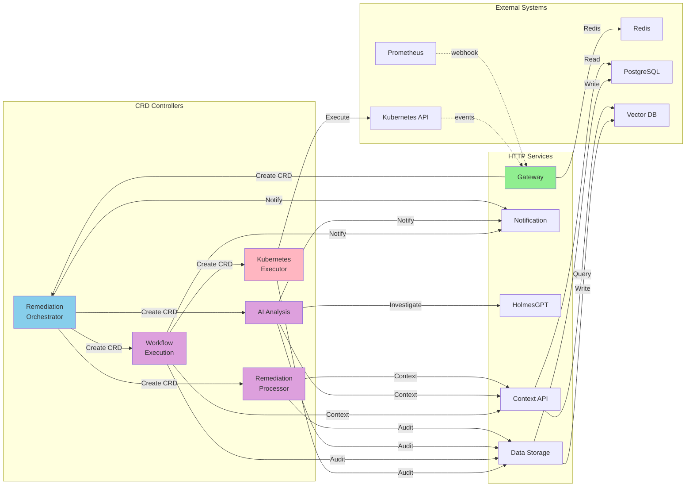
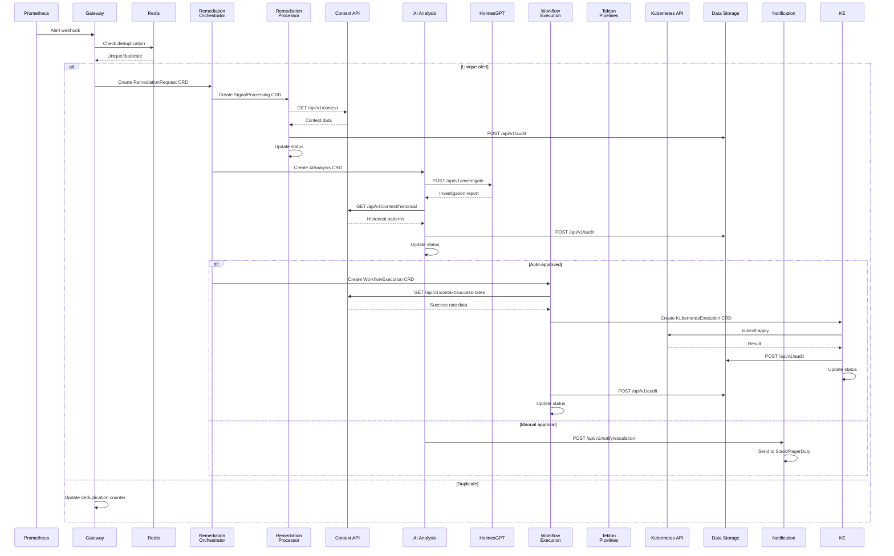
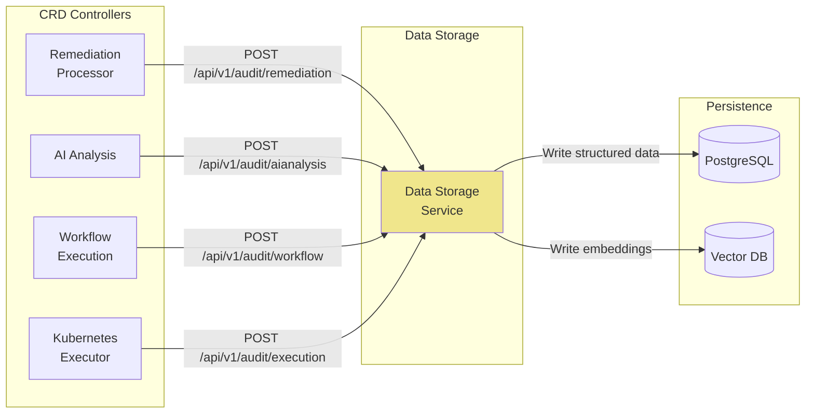
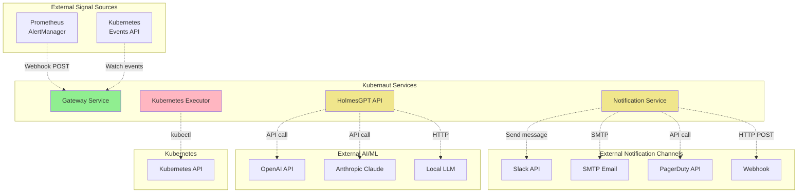
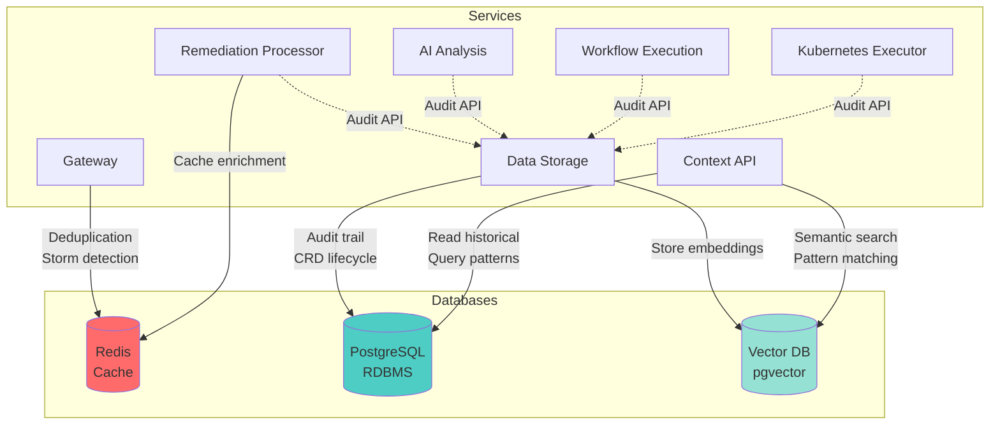

# Kubernaut Service Dependency Map

**Version**: 1.2
**Last Updated**: November 13, 2025
**Status**: ✅ Authoritative Reference
**Scope**: 10 Kubernaut V1 Services

## 📋 Version History

| Version | Date | Changes | Author |
|---------|------|---------|--------|
| 1.2 | Nov 13, 2025 | **Context API Deprecation**: Added deprecation notice. Context API deprecated in favor of Data Storage Service (DD-CONTEXT-006). Updated service count from 11 to 10. All Context API functionality now provided by Data Storage Service. | AI Assistant |
| 1.1 | Oct 31, 2025 | Updated service dependency diagram: Kubernetes Executor → Tekton Pipelines (per ADR-023, ADR-025) | AI Assistant |
| 1.0 | Oct 6, 2025 | Initial version | - |

---

## 📋 Table of Contents

1. [Overview](#overview)
2. [High-Level Architecture](#high-level-architecture)
3. [Service Dependency Graph](#service-dependency-graph)
4. [Deployment Order](#deployment-order)
5. [Service Categories](#service-categories)
6. [Data Flow](#data-flow)
7. [External Dependencies](#external-dependencies)
8. [Database Dependencies](#database-dependencies)
9. [Service Communication Matrix](#service-communication-matrix)
10. [Failure Impact Analysis](#failure-impact-analysis)

---

## Overview

### Purpose

This document provides a comprehensive visualization of all service dependencies in the Kubernaut V1 architecture, including:
- Service interaction patterns
- Data flow between services
- Deployment order requirements
- External system integrations
- Database dependencies

---

## High-Level Architecture

### Complete System Overview

```mermaid
graph TB
    subgraph "External Sources"
        Prometheus[Prometheus AlertManager]
        K8sEvents[Kubernetes Events API]
    end

    subgraph "Entry Point"
        Gateway[Gateway Service<br/>Port 8080/9090]
    end

    subgraph "Orchestration Layer"
        RO[Remediation Orchestrator<br/>Port 9090]
    end

    subgraph "Processing Layer"
        RP[Remediation Processor<br/>Port 9090]
        AI[AI Analysis<br/>Port 9090]
        WE[Workflow Execution<br/>Port 9090]
    end

    subgraph "Execution Layer"
        KE[~~Kubernetes Executor~~ (DEPRECATED - ADR-025)<br/>Port 9090]
    end

    subgraph "Support Services"
        Notification[Notification Controller<br/>CRD: NotificationRequest 🆕]
        HolmesGPT[HolmesGPT API<br/>Port 8080/9090]
        Context[Context API<br/>Port 8080/9090]
        DataStorage[Data Storage<br/>Port 8080/9090]
    end

    subgraph "Data Stores"
        Redis[(Redis<br/>Deduplication)]
        PostgreSQL[(PostgreSQL<br/>Audit Trail)]
        VectorDB[(Vector DB<br/>Embeddings)]
    end

    subgraph "External Notifications"
        Slack[Slack]
        Email[Email/SMTP]
        PagerDuty[PagerDuty]
    end

    %% External to Gateway
    Prometheus -->|HTTP POST /api/v1/signals/prometheus| Gateway
    K8sEvents -->|HTTP POST /api/v1/signals/kubernetes| Gateway

    %% Gateway to Redis and Orchestrator
    Gateway -->|Deduplication| Redis
    Gateway -->|Create RemediationRequest CRD| RO

    %% Orchestrator to Processing Layer
    RO -->|Create SignalProcessing CRD| RP
    RO -->|Create AIAnalysis CRD| AI
    RO -->|Create WorkflowExecution CRD| WE

    %% Processing Layer Dependencies
    RP -->|HTTP GET /api/v1/context| Context
    AI -->|HTTP POST /api/v1/investigate| HolmesGPT
    AI -->|HTTP GET /api/v1/context/historical| Context
    WE -->|HTTP GET /api/v1/context/success-rates| Context

    %% Execution Layer (DEPRECATED - ADR-025: KE replaced by Tekton TaskRun)
    WE -->|Create KubernetesExecution CRD| KE
    KE -->|kubectl apply/patch| K8sAPI[Kubernetes API]

    %% Notifications (CRD-based, 2025-10-12)
    RO -->|Create NotificationRequest CRD| Notification
    AI -->|Create NotificationRequest CRD| Notification
    WE -->|Create NotificationRequest CRD| Notification
    Notification -->|Send notifications| Slack
    Notification -->|Send notifications| Email
    Notification -->|Send notifications| PagerDuty

    %% Data Storage
    RP -->|HTTP POST /api/v1/audit| DataStorage
    AI -->|HTTP POST /api/v1/audit| DataStorage
    WE -->|HTTP POST /api/v1/audit| DataStorage
    KE -->|HTTP POST /api/v1/audit| DataStorage
    DataStorage -->|Store| PostgreSQL
    DataStorage -->|Store embeddings| VectorDB

    %% Context API dependencies
    Context -->|Read| PostgreSQL
    Context -->|Query embeddings| VectorDB

    style Gateway fill:#90EE90
    style RO fill:#87CEEB
    style RP fill:#DDA0DD
    style AI fill:#DDA0DD
    style WE fill:#DDA0DD
    style KE fill:#FFB6C1
    style Notification fill:#F0E68C
    style HolmesGPT fill:#F0E68C
    style Context fill:#F0E68C
    style DataStorage fill:#F0E68C
```

---

## Service Dependency Graph

### Detailed Service Interactions



---

## Deployment Order

### Required Deployment Sequence

```mermaid
graph TD
    Start([Start Deployment])

    Start --> Phase1[Phase 1: Infrastructure]
    Phase1 --> Redis[Redis]
    Phase1 --> PostgreSQL[PostgreSQL]
    Phase1 --> VectorDB[Vector DB]

    Redis --> Phase2[Phase 2: Support Services]
    PostgreSQL --> Phase2
    VectorDB --> Phase2

    Phase2 --> DataStorage[Data Storage Service]
    Phase2 --> ContextAPI[Context API Service]
    Phase2 --> HolmesGPT[HolmesGPT API]
    Phase2 --> Notification[Notification Service]

    DataStorage --> Phase3[Phase 3: CRD Definitions]
    ContextAPI --> Phase3
    HolmesGPT --> Phase3
    Notification --> Phase3

    Phase3 --> CRDs[Create all CRDs:<br/>- RemediationRequest<br/>- RemediationProcessing<br/>- AIAnalysis<br/>- WorkflowExecution<br/>- ~~KubernetesExecution~~ (DEPRECATED - ADR-025)]

    CRDs --> Phase4[Phase 4: Controllers]

    Phase4 --> RemediationOrchestrator[Remediation Orchestrator]

    RemediationOrchestrator --> Phase5[Phase 5: Child Controllers]

    Phase5 --> RemediationProcessor[Remediation Processor]
    Phase5 --> AIAnalysis[AI Analysis]
    Phase5 --> WorkflowExecution[Workflow Execution]

    RemediationProcessor --> Phase6[Phase 6: Executor]
    AIAnalysis --> Phase6
    WorkflowExecution --> Phase6

    Phase6 --> KubernetesExecutor[Kubernetes Executor]

    KubernetesExecutor --> Phase7[Phase 7: Entry Point]

    Phase7 --> Gateway[Gateway Service]

    Gateway --> Complete([Deployment Complete])

    style Phase1 fill:#FFE4B5
    style Phase2 fill:#E0FFE0
    style Phase3 fill:#E0E0FF
    style Phase4 fill:#FFE0E0
    style Phase5 fill:#FFE0FF
    style Phase6 fill:#E0FFFF
    style Phase7 fill:#90EE90
```

---

### Deployment Order Table

| Phase | Order | Service | Type | Dependencies | Required Before |
|-------|-------|---------|------|--------------|-----------------|
| **1** | 1 | Redis | Infrastructure | None | Gateway, Remediation Processor |
| **1** | 2 | PostgreSQL | Infrastructure | None | Data Storage, Context API |
| **1** | 3 | Vector DB | Infrastructure | None | Data Storage, Context API |
| **2** | 4 | Data Storage | HTTP | PostgreSQL, Vector DB | All CRD controllers |
| **2** | 5 | Context API | HTTP | PostgreSQL, Vector DB | Remediation Processor, AI Analysis |
| **2** | 6 | HolmesGPT API | HTTP | None (self-contained) | AI Analysis |
| **2** | 7 | Notification Controller | CRD Controller | NotificationRequest CRD | All CRD controllers |
| **3** | 8 | CRD Definitions | K8s CRDs | None | All controllers |
| **4** | 9 | Remediation Orchestrator | CRD Controller | CRDs | Child controllers |
| **5** | 10 | Remediation Processor | CRD Controller | Context API, Data Storage | None (parallel) |
| **5** | 11 | AI Analysis | CRD Controller | HolmesGPT, Context API, Data Storage | None (parallel) |
| **5** | 12 | Workflow Execution | CRD Controller | Context API, Data Storage | ~~Kubernetes Executor~~ (DEPRECATED - ADR-025) |
| **6** | 13 | ~~Kubernetes Executor~~ (DEPRECATED - ADR-025) | CRD Controller | Kubernetes API, Data Storage | None |
| **7** | 14 | Gateway | HTTP | Redis, Remediation Orchestrator | None (entry point) |

---

## Service Categories

### By Type

#### Entry Point Services (1)
- **Gateway Service** - Signal ingestion and triage

#### Orchestration Services (1)
- **Remediation Orchestrator** - Central coordination

#### Processing Services (3)
- **Remediation Processor** - Signal enrichment
- **AI Analysis** - Root cause analysis
- **Workflow Execution** - Multi-step orchestration

#### Execution Services (1)
- ~~**Kubernetes Executor**~~ (DEPRECATED - ADR-025) - Action execution

#### Support Services (4)
- **Notification Controller** - CRD-based multi-channel delivery with zero data loss (CRD, migrated 2025-10-12)
- **HolmesGPT API** - AI investigation
- **Context API** - Historical intelligence
- **Data Storage** - Persistence layer

---

### By Runtime Type

#### CRD Controllers (5)
**Port**: 9090 (metrics only)
**Deployment**: StatefulSet with leader election

1. Remediation Orchestrator
2. Remediation Processor
3. AI Analysis
4. Workflow Execution
5. ~~Kubernetes Executor~~ (DEPRECATED - ADR-025)

---

#### Stateless HTTP Services (6)
**Ports**: 8080 (API), 9090 (metrics)
**Deployment**: Deployment with multiple replicas

6. Gateway Service
7. Notification Service
8. HolmesGPT API
9. Context API (pending spec)
10. Data Storage (pending spec)
11. Infrastructure Monitoring (pending spec - V2)

---

## Data Flow

### Signal Processing Flow



---

### Audit Trail Flow



---

## External Dependencies

### External Systems Integration



---

### External Dependency Matrix

| Kubernaut Service | External System | Protocol | Purpose | Required? |
|-------------------|----------------|----------|---------|-----------|
| **Gateway** | Prometheus AlertManager | HTTP (webhook) | Alert ingestion | Yes (if using Prometheus) |
| **Gateway** | Kubernetes Events API | K8s API (watch) | Event ingestion | Yes (if using K8s events) |
| **Notification** | Slack API | HTTPS | Escalation notifications | Optional |
| **Notification** | SMTP Server | SMTP | Email notifications | Optional |
| **Notification** | PagerDuty API | HTTPS | Incident creation | Optional |
| **Notification** | Webhook endpoint | HTTP/HTTPS | Custom notifications | Optional |
| **HolmesGPT API** | OpenAI API | HTTPS | LLM inference | Optional (one required) |
| **HolmesGPT API** | Anthropic Claude | HTTPS | LLM inference | Optional (one required) |
| **HolmesGPT API** | Local LLM | HTTP | LLM inference | Optional (one required) |
| ~~**Kubernetes Executor**~~ (DEPRECATED - ADR-025) | Kubernetes API | K8s API | Action execution | Yes |
| **All CRD Controllers** | Kubernetes API | K8s API | CRD operations | Yes |

---

## Database Dependencies

### Database Usage Matrix



---

### Database Dependency Details

#### Redis
**Used By**: Gateway Service, Remediation Processor
**Purpose**:
- Alert deduplication (fingerprint storage)
- Storm detection (rate limiting)
- Enrichment cache

**Data Types**:
- Keys: `alert:fingerprint:{sha256}`
- TTL: 24 hours default
- Values: JSON metadata

---

#### PostgreSQL
**Used By**: Data Storage (writes), Context API (reads)
**Purpose**:
- Audit trail persistence
- CRD lifecycle tracking
- Historical remediation data

**Tables**:
- `remediation_requests`
- `remediation_processing`
- `ai_analysis`
- `workflow_executions`
- `kubernetes_executions`

---

#### Vector DB (pgvector)
**Used By**: Data Storage (writes), Context API (reads)
**Purpose**:
- AI embeddings storage
- Semantic search
- Pattern matching

**Collections**:
- Alert patterns
- Remediation outcomes
- Organizational knowledge

---

## Service Communication Matrix

### HTTP API Calls

| From Service | To Service | Endpoint | Method | Purpose |
|-------------|-----------|----------|--------|---------|
| Remediation Processor | Context API | `/api/v1/context` | GET | Environment enrichment |
| AI Analysis | HolmesGPT API | `/api/v1/investigate` | POST | Root cause investigation |
| AI Analysis | Context API | `/api/v1/context/historical` | GET | Historical patterns |
| Workflow Execution | Context API | `/api/v1/context/success-rates` | GET | Success rate data |
| Remediation Processor | Data Storage | `/api/v1/audit/remediation` | POST | Audit trail |
| AI Analysis | Data Storage | `/api/v1/audit/aianalysis` | POST | Audit trail |
| Workflow Execution | Data Storage | `/api/v1/audit/workflow` | POST | Audit trail |
| Kubernetes Executor | Data Storage | `/api/v1/audit/execution` | POST | Audit trail |
| Remediation Orchestrator | Notification | Create NotificationRequest CRD | K8s API | Escalation (CRD-based) |
| AI Analysis | Notification | Create NotificationRequest CRD | K8s API | Escalation (CRD-based) |
| Workflow Execution | Notification | Create NotificationRequest CRD | K8s API | Escalation (CRD-based) |

---

### CRD Watch Patterns

| Controller | Watches CRD | Creates CRD | Updates CRD |
|-----------|-------------|-------------|-------------|
| **Remediation Orchestrator** | RemediationRequest | RemediationProcessing, AIAnalysis, WorkflowExecution | RemediationRequest.status |
| **Remediation Processor** | RemediationProcessing | None | RemediationProcessing.status |
| **AI Analysis** | AIAnalysis | None | AIAnalysis.status |
| **Workflow Execution** | WorkflowExecution | KubernetesExecution | WorkflowExecution.status |
| ~~**Kubernetes Executor**~~ (DEPRECATED - ADR-025) | KubernetesExecution | None | KubernetesExecution.status |

---

## Failure Impact Analysis

### Service Failure Impact Matrix

```mermaid
graph TD
    subgraph "Impact Levels"
        P0[P0: System Down]
        P1[P1: Degraded]
        P2[P2: Feature Loss]
    end

    GW[Gateway Failure] --> P0
    RO[Remediation Orchestrator Failure] --> P0

    RP[Remediation Processor Failure] --> P1A[P1: No enrichment]
    AI[AI Analysis Failure] --> P1B[P1: No AI recommendations]
    WE[Workflow Execution Failure] --> P1C[P1: No automated remediation]
    KE[Kubernetes Executor Failure] --> P1D[P1: No actions executed]

    Redis[Redis Failure] --> P1E[P1: Duplicate alerts]
    PostgreSQL[PostgreSQL Failure] --> P1F[P1: No audit trail]

    HG[HolmesGPT Failure] --> P2A[P2: Manual investigation]
    CA[Context API Failure] --> P2B[P2: No historical context]
    DS[Data Storage Failure] --> P2C[P2: No audit writes]
    NS[Notification Failure] --> P2D[P2: No escalations]

    style P0 fill:#FF0000,color:#FFFFFF
    style P1A fill:#FFA500
    style P1B fill:#FFA500
    style P1C fill:#FFA500
    style P1D fill:#FFA500
    style P1E fill:#FFA500
    style P1F fill:#FFA500
    style P2A fill:#FFFF00
    style P2B fill:#FFFF00
    style P2C fill:#FFFF00
    style P2D fill:#FFFF00
```



---

### Critical Path Services

**P0 - System Down** (Must be available):
1. ✅ Gateway Service - Entry point
2. ✅ Remediation Orchestrator - Coordination
3. ✅ Kubernetes API - CRD operations

**P1 - Degraded Operation** (Should be available):
4. Remediation Processor - Enrichment
5. AI Analysis - Recommendations
6. Workflow Execution - Automation
7. Kubernetes Executor - Actions
8. Redis - Deduplication
9. PostgreSQL - Audit

**P2 - Feature Loss** (Nice to have):
10. HolmesGPT API - AI investigation
11. Context API - Historical intelligence
12. Data Storage - Audit persistence
13. Notification Service - Escalations

---

## Summary

### Service Dependency Count

| Service | Depends On | Depended By | Criticality |
|---------|-----------|-------------|-------------|
| **Gateway** | Redis, Remediation Orchestrator | External sources | P0 (Critical) |
| **Remediation Orchestrator** | K8s API | Gateway, All child controllers | P0 (Critical) |
| **Remediation Processor** | Data Storage | Remediation Orchestrator | P1 (High) |
| **AI Analysis** | HolmesGPT, Data Storage | Remediation Orchestrator | P1 (High) |
| **Workflow Execution** | Data Storage | Remediation Orchestrator | P1 (High) |
| ~~**Kubernetes Executor**~~ (DEPRECATED - ADR-025) | K8s API, Data Storage | Workflow Execution | P1 (High) |
| **Notification** | External channels | All controllers | P2 (Medium) |
| **HolmesGPT API** | External LLM | AI Analysis | P2 (Medium) |
| **Data Storage** | PostgreSQL, Vector DB | All controllers | P2 (Medium) |
| **Dynamic Toolset** | HolmesGPT API | HolmesGPT API | P2 (Medium) |

---

### Total Dependency Count
- **Services**: 10 (4 CRD controllers + 6 HTTP services)
- **Databases**: 3 (Redis, PostgreSQL, Vector DB)
- **External Systems**: 8+ (Prometheus, K8s, Slack, etc.)
- **CRDs**: 5 (RemediationRequest + 4 child CRDs)
- **HTTP Endpoints**: 12+ documented

---

## References

### Related Documentation
- [Approved Microservices Architecture](./APPROVED_MICROSERVICES_ARCHITECTURE.md)
- [Multi-CRD Reconciliation Architecture](./MULTI_CRD_RECONCILIATION_ARCHITECTURE.md)
- [Service Connectivity Specification](./SERVICE_CONNECTIVITY_SPECIFICATION.md)
- [Prometheus ServiceMonitor Pattern](./PROMETHEUS_SERVICEMONITOR_PATTERN.md)
- [Kubernetes TokenReviewer Authentication](./KUBERNETES_TOKENREVIEWER_AUTH.md)

---

**Document Status**: ✅ Complete
**Last Updated**: October 6, 2025
**Maintainer**: Kubernaut Architecture Team
**Version**: 1.0

**Document Status**: ✅ Complete
**Last Updated**: October 6, 2025
**Maintainer**: Kubernaut Architecture Team
**Version**: 1.0
