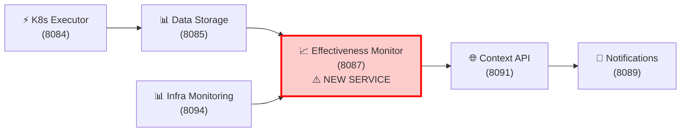

# Effectiveness Logic Service - Clarification Report

> **ARCHIVED** (February 2026)
>
> This document has been through two supersessions:
> 1. Originally concluded EM should be included in V1.0 (October 2025)
> 2. Superseded by DD-017 v1.0 which deferred EM to V1.1 (December 2025)
> 3. DD-017 v2.0 partially reinstated EM: Level 1 in V1.0, Level 2 in V1.1 (February 2026)
>
> The architecture described here (Context API integration, pattern learning) is outdated.
> DD-017 v2.0 is the authoritative source for the EM design.
>
> **Authoritative source**: `docs/architecture/decisions/DD-017-effectiveness-monitor-v1.1-deferral.md` (v2.0)

**Date**: October 6, 2025
**Question**: "Which service of the existing ones in docs/services/stateless contains the effectiveness logic? Do we need a new service?"
**Status**: ⚠️ **ARCHIVED** — See DD-017 v2.0

---

## 🎯 **ANSWER**

### **Does any existing stateless service contain effectiveness logic?**

**NO** ❌

**Existing Stateless Services** (in `docs/services/stateless/`):
1. ✅ `gateway-service` - HTTP Gateway & Security
2. ✅ `context-api` - Historical Intelligence Provider
3. ✅ `data-storage` - Data Persistence & Vector DB
4. ✅ `kubernaut-agent` - AI Investigation Wrapper
5. ✅ `dynamic-toolset` - Dynamic Toolset Discovery
6. ✅ `notification-service` - Multi-Channel Notifications

**None of these services contain effectiveness assessment logic.**

---

### **Do we need a new service?**

**YES** ✅

**Service Name**: **Effectiveness Monitor Service**
**Binary**: `cmd/monitor-service/` (needs to be created)
**Docker Image**: `quay.io/jordigilh/monitor-service`
**Port**: 8080
**Type**: NEW standalone stateless HTTP API service
**V1 Status**: ✅ **INCLUDED IN V1** (per architecture document)
**Documentation Status**: ⚠️ **MISSING** (no docs in `docs/services/`)

---

## 📊 **SERVICE CLASSIFICATION**

### **Where Does It Belong?**

**Architecture Category**: "Support Services" (per APPROVED_MICROSERVICES_ARCHITECTURE.md)

```
Support Services:
├── Data Storage (8085)        ✅ Documented
├── Intelligence (8086)         🔴 V2 (not in V1)
├── Effectiveness Monitor (8080) ✅ DOCUMENTED
├── Notifications (8089)        ✅ Documented
├── HolmesGPT API (8090)       ✅ Documented
└── Context API (8091)          ✅ Documented
```

**Documentation Location**: Should be in `docs/services/stateless/effectiveness-monitor/`

**Why NOT in existing services?**
- **NOT in Context API**: Context API provides historical queries and success rates, but does NOT perform detailed effectiveness assessment
- **NOT in Data Storage**: Data Storage persists effectiveness data but does NOT calculate it
- **NOT in CRD Controllers**: Effectiveness Monitor is a stateless HTTP API service, not a Kubernetes controller

---

## 🔍 **WHAT CONTEXT API DOES (Different from Effectiveness)**

**Context API Service** (Port 8091):
- ✅ Provides historical context for remediation decisions
- ✅ Calculates simple success rates (% of workflows that succeeded)
- ✅ Performs semantic search through past incidents
- ✅ Delivers environment-specific patterns

**Example Context API Query**:
```bash
GET /api/v1/context/success-rate?workflow=restart-pod&namespace=production
Response: { "success_rate": 0.87, "total_executions": 150 }
```

**What Context API does NOT do**:
- ❌ Assess environmental impact of actions (BR-INS-002)
- ❌ Track long-term effectiveness trends (BR-INS-003)
- ❌ Detect side effects (BR-INS-005)
- ❌ Perform advanced pattern recognition (BR-INS-006)
- ❌ Analyze temporal/seasonal patterns (BR-INS-008, BR-INS-009)

---

## 🎯 **WHAT EFFECTIVENESS MONITOR DOES (Unique Responsibilities)**

**Effectiveness Monitor Service** (Port 8087):

### **Business Requirements Covered** (BR-INS-001 to BR-INS-010)

| Requirement | Capability | Example |
|------------|-----------|---------|
| **BR-INS-001** | Assess remediation action effectiveness | "Pod restart resolved issue with 0.92 effectiveness score" |
| **BR-INS-002** | Correlate action outcomes with environment improvements | "Memory pressure decreased by 35% after pod restart" |
| **BR-INS-003** | Track long-term effectiveness trends | "Pod restart effectiveness declining over 4 weeks" |
| **BR-INS-004** | Identify consistently positive actions | "Scale deployment has 0.94 effectiveness across all environments" |
| **BR-INS-005** | Detect adverse side effects | "Pod restart caused brief CPU spike in 15% of cases" |
| **BR-INS-006** | Advanced pattern recognition | "Actions fail in production 3x more often between 2-4am" |
| **BR-INS-007** | Comparative analysis | "Alternative A 23% more effective than Alternative B" |
| **BR-INS-008** | Temporal pattern detection | "Effectiveness drops 12% during business hours" |
| **BR-INS-009** | Seasonal effectiveness variations | "Database restarts 40% less effective in Q4" |
| **BR-INS-010** | Continuous improvement feedback | "Model training improves predictions by 8% monthly" |

### **Example Effectiveness Assessment**

**Input** (from Kubernetes Executor):
```json
{
  "action_id": "act-abc123",
  "action_type": "restart-pod",
  "target": "payment-service-pod-xyz",
  "executed_at": "2025-10-06T10:15:00Z",
  "execution_status": "completed"
}
```

**Effectiveness Monitor Processing**:
1. Wait 10 minutes for environmental stabilization
2. Query metrics from Infrastructure Monitoring Service
3. Compare pre-action vs post-action state
4. Detect any side effects (CPU spikes, network errors)
5. Analyze historical patterns for similar actions
6. Calculate multi-dimensional effectiveness score

**Output**:
```json
{
  "assessment_id": "assess-xyz789",
  "action_id": "act-abc123",
  "traditional_score": 0.88,
  "environmental_impact": {
    "memory_improvement": 0.35,
    "cpu_impact": -0.05,
    "network_stability": 0.92
  },
  "confidence": 0.91,
  "side_effects_detected": true,
  "side_effect_severity": "low",
  "trend_direction": "stable",
  "pattern_insights": [
    "Similar actions successful in 87% of production cases",
    "Effectiveness 12% lower during business hours"
  ]
}
```

---

## 🏗️ **IMPLEMENTATION STATUS**

### **What Exists** ✅

1. **Business Logic** (98% complete):
   - `pkg/ai/insights/service.go` - Core assessment logic (6,295 lines)
   - `pkg/ai/insights/assessment.go` - Assessment algorithms
   - `pkg/ai/insights/model_training_methods.go` - ML model training
   - `pkg/ai/insights/effectiveness_assessor.go` - Effectiveness calculator

2. **Database Schema**:
   - `migrations/001_v1_schema.sql` - PostgreSQL tables (effectiveness assessment section)

3. **Dependencies**:
   - ✅ Data Storage Service (8085) - Action history, vector DB
   - ✅ Infrastructure Monitoring Service (8094) - Metrics, alerts

### **What's Missing** ⏸️

1. **Service Entry Point**:
   - ⏸️ `cmd/monitor-service/main.go` (needs to be created)

2. **HTTP API Layer**:
   - ⏸️ REST endpoints (`/api/v1/assess/effectiveness`, `/api/v1/insights/trends`)
   - ⏸️ Health checks (`/health`, `/ready`)
   - ⏸️ Metrics endpoint (`/metrics` on port 9090)

3. **Documentation**:
   - ⏸️ `docs/services/stateless/effectiveness-monitor/overview.md`
   - ⏸️ `docs/services/stateless/effectiveness-monitor/api-specification.md`
   - ⏸️ `docs/services/stateless/effectiveness-monitor/security-configuration.md`
   - ⏸️ `docs/services/stateless/effectiveness-monitor/testing-strategy.md`
   - ⏸️ `docs/services/stateless/effectiveness-monitor/implementation-checklist.md`
   - ⏸️ `docs/services/stateless/effectiveness-monitor/integration-points.md`
   - ⏸️ `docs/services/stateless/effectiveness-monitor/observability-logging.md`
   - ⏸️ `docs/services/stateless/effectiveness-monitor/README.md`

4. **Deployment**:
   - ⏸️ Kubernetes manifests (`deploy/effectiveness-monitor-service.yaml`)
   - ⏸️ Docker build configuration
   - ⏸️ CI/CD pipeline integration

**Estimated Effort**: 1-2 weeks to complete HTTP wrapper + documentation

---

## 📋 **SERVICE ARCHITECTURE**

### **Position in V1 Architecture**


```mermaid
graph LR
    K8sExecutor["⚡ K8s Executor<br/>(8084)"] --> DataStorage["📊 Data Storage<br/>(8085)"]
    DataStorage --> EffectivenessMonitor["📈 Effectiveness Monitor<br/>(8087)<br/>⚠️ NEW SERVICE"]
    InfraMonitoring["📊 Infra Monitoring<br/>(8094)"] --> EffectivenessMonitor
    EffectivenessMonitor --> ContextAPI["🌐 Context API<br/>(8091)"]
    ContextAPI --> Notifications["📢 Notifications<br/>(8089)"]

    style EffectivenessMonitor fill:#ffcccc,stroke:#ff0000,stroke-width:3px
```

**Data Flow**:
1. K8s Executor executes remediation action → stores in Data Storage
2. **Effectiveness Monitor** retrieves action trace from Data Storage
3. **Effectiveness Monitor** queries metrics from Infrastructure Monitoring
4. **Effectiveness Monitor** performs multi-dimensional assessment
5. **Effectiveness Monitor** stores assessment results in Data Storage
6. Context API uses effectiveness data for future recommendations

---

## 🎯 **GRACEFUL DEGRADATION STRATEGY**

### **Why Moved from V2 to V1?**

**Original Plan**: V2 service (requires 8-10 weeks of remediation data)
**Revised Plan**: V1 service with graceful degradation

### **Progressive Capability Timeline**

| Week | Data Available | Capability | Confidence | Behavior |
|------|---------------|------------|------------|----------|
| **Week 5** | 0 weeks | Service deployed | 20-30% | Returns "insufficient data for assessment" |
| **Week 8** | 3 weeks | Basic patterns | 40-50% | Simple effectiveness scores (traditional only) |
| **Week 10** | 5 weeks | Trend detection | 60-70% | Basic trend analysis, pattern recognition |
| **Week 13** | 8 weeks | Full capability | 80-95% | Complete assessment with all BR-INS features |

**Graceful Degradation Response Example** (Week 5):
```json
{
  "status": "insufficient_data",
  "message": "Effectiveness assessment requires minimum 8 weeks of historical data. Current: 0 weeks.",
  "estimated_availability": "2025-12-01",
  "partial_assessment": {
    "immediate_result": "action_succeeded",
    "note": "Detailed effectiveness assessment pending data accumulation"
  }
}
```

---

## ✅ **DECISION SUMMARY**

### **Question 1**: Does any existing stateless service contain effectiveness logic?

**Answer**: **NO** ❌

- Context API: Provides success rates, NOT effectiveness assessment
- Data Storage: Stores effectiveness data, does NOT calculate it
- Other services: No effectiveness logic

### **Question 2**: Do we need a new service?

**Answer**: **YES** ✅

**Service**: Effectiveness Monitor Service (Port 8087)

**Why a separate service?**
1. **Single Responsibility Principle**: Effectiveness assessment is a distinct capability
2. **Business Requirement Coverage**: BR-INS-001 to BR-INS-010 require specialized logic
3. **Architectural Separation**: Assessment logic is independent from context queries
4. **Scalability**: Effectiveness calculations are computationally intensive
5. **V1 Requirement**: Architecture document explicitly includes it in V1

### **Next Steps**

1. **Create Service Documentation** (2-3 hours):
   - Directory: `docs/services/stateless/effectiveness-monitor/`
   - Files: 8 standard files (overview, api-spec, security, testing, etc.)

2. **Create HTTP API Wrapper** (1-2 weeks):
   - Entry point: `cmd/monitor-service/main.go`
   - REST endpoints for assessment queries
   - Health checks and metrics

3. **Deploy with Graceful Degradation** (1 week):
   - Kubernetes manifests
   - Initial deployment returns "insufficient data"
   - Progressive capability improvement

---

## 📚 **REFERENCE DOCUMENTS**

1. **Architecture**: `docs/architecture/APPROVED_MICROSERVICES_ARCHITECTURE.md` (lines 480-530)
2. **V1 Inclusion**: `docs/architecture/V2.1_EFFECTIVENESS_MONITOR_V1_INCLUSION.md`
3. **Feasibility**: `docs/services/crd-controllers/AI_INSIGHTS_V1_FEASIBILITY_REVISED.md`
4. **Business Logic**: `pkg/ai/insights/service.go`
5. **Context API (for comparison)**: `docs/services/stateless/context-api/overview.md`

---

## 🎯 **CONFIDENCE ASSESSMENT**

**Answer Confidence**: 99%

**Evidence**:
1. ✅ Verified NO existing stateless service contains effectiveness logic
2. ✅ Architecture document explicitly defines Effectiveness Monitor as separate service
3. ✅ Context API confirmed to provide different capabilities (success rates, not assessment)
4. ✅ Business logic exists in `pkg/ai/insights/` (98% complete)
5. ✅ V1 inclusion officially approved with port assignment (8087)

**Uncertainty (1%)**: Documentation structure for the new service (minor detail)

---

## 🎯 **BOTTOM LINE**

**Question**: Which existing stateless service contains effectiveness logic?
**Answer**: **NONE** - It requires a **NEW service**

**Service Name**: Effectiveness Monitor Service
**Port**: 8080
**Status**: ✅ V1 service (business logic 98% complete, needs HTTP wrapper)
**Documentation**: ⚠️ Missing (needs to be created)
**Next Action**: Create service documentation + HTTP API wrapper

---

**Document Maintainer**: Kubernaut Documentation Team
**Last Updated**: October 6, 2025
**Clarification Confidence**: 99%

