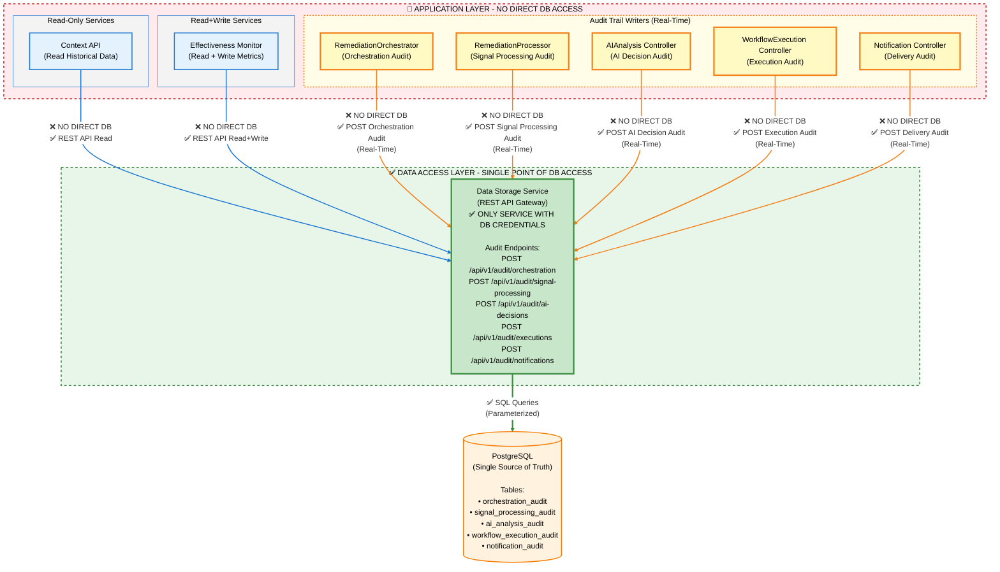

# ADR-032: Data Access Layer Isolation

## Status
**✅ APPROVED**  
**Decision Date**: November 2, 2025  
**Last Reviewed**: November 2, 2025  
**Confidence**: 100%  
**Authority Level**: **ARCHITECTURAL** - Supersedes all related Design Decisions

---

## ⚠️ SUPERSEDES ALL PRIOR DATA ACCESS DECISIONS

This ADR is the **SINGLE SOURCE OF TRUTH** for data access patterns in Kubernaut.

**Superseded Documents** (DO NOT REFERENCE - Use ADR-032 instead):
- ✅ `DD-ARCH-001-FINAL-DECISION.md` - **SUPERSEDED** by ADR-032 (data access pattern decision)
- ✅ `DD-ARCH-002-GRAPHQL-QUERY-LAYER-ASSESSMENT.md` - **SUPERSEDED** by ADR-032 (interface technology decision)
- ✅ `docs/architecture/implementation/API-GATEWAY-MIGRATION-*.md` - **SUPERSEDED** by ADR-032 (migration plans)

**Related Documents** (Still Valid, Support ADR-032):
- ✅ `DD-SCHEMA-001-data-storage-schema-authority.md` - Schema ownership (complements ADR-032)
- ✅ `ADR-030-service-configuration-management.md` - Configuration patterns
- ✅ `ADR-031-openapi-specification-standard.md` - REST API contracts

---

## Context

Kubernaut uses PostgreSQL for persistent storage of incident data, action history, effectiveness metrics, and **audit trails**. Multiple services (Context API, Effectiveness Monitor, WorkflowExecution Controller) need access to this data. Without clear architectural boundaries, we risk:

- **Security**: Multiple services with database credentials
- **Schema drift**: Services independently evolving database schema
- **Migration complexity**: Database changes affecting multiple services
- **Performance**: Unoptimized queries from application services
- **Monitoring**: Difficulty tracking database access patterns
- **⚠️ Audit Loss**: Critical audit data lost if services write directly to database without proper coordination

**Key Questions**: 
1. Which services should have direct database access?
2. How do we ensure **audit completeness** for every action and decision?

---

## 🚨 **AUDIT AS A FIRST-CLASS CITIZEN**

**CRITICAL PRINCIPLE**: Audit capabilities are **first-class citizens** in Kubernaut, not optional features.

### Audit Mandate

**REQUIREMENT**: The platform MUST create an audit entry for:
1. **Every remediation action** taken on Kubernetes resources
2. **Every AI/ML decision** made during workflow generation
3. **Every workflow execution** (start, progress, completion, failure)
4. **Every effectiveness assessment** calculated
5. **Every alert** processed and deduplicated

### Audit Completeness Requirements

1. **No Audit Loss**: Audit writes are **MANDATORY**, not best-effort
2. **Write Verification**: Audit write failures must be detected and handled
3. **Retry Logic**: Transient audit write failures must be retried
4. **Audit Monitoring**: Missing audit records must trigger alerts
5. **Compliance**: Audit data retention must meet regulatory requirements (7+ years)

---

## Decision

**PRINCIPLE**: **ONLY Data Storage Service connects directly to PostgreSQL.**

### Architectural Boundaries



**Legend**:
- **Blue boxes**: Read-only or Read+Write services (business logic queries)
- **Yellow boxes**: Audit trail writers (real-time audit data capture for V2.0 RAR generation)
- **Green box**: Data Storage Service (ONLY service with database credentials)

**Key Points**:
1. **Gateway service** is an HTTP reverse proxy/router and does NOT consume Data Storage Service directly
2. **All 5 CRD controllers** write audit trails in real-time (as soon as CRD status updates)
3. **Audit data enables V2.0 RAR generation** (BR-REMEDIATION-ANALYSIS-001 to BR-REMEDIATION-ANALYSIS-004)
4. **CRD + DB contain same audit data** for 24h, then CRDs deleted
5. **RemediationProcessor captures "front door" audit**: Signal reception, enrichment quality, classification, business priority

### Mandatory Rules

#### ✅ **ALLOWED**: Data Storage Service
- Direct SQL queries to PostgreSQL
- Schema migrations and versioning
- Query optimization and performance tuning
- Database connection pooling
- Transactional integrity

#### ❌ **FORBIDDEN**: Context API
- NO direct PostgreSQL connection
- NO database credentials in configuration
- NO SQL queries
- MUST use Data Storage Service REST API

#### ❌ **FORBIDDEN**: Effectiveness Monitor
- NO direct PostgreSQL connection
- NO database credentials in configuration
- NO SQL queries
- MUST use Data Storage Service REST API

#### ❌ **FORBIDDEN**: WorkflowExecution Controller (Remediation Orchestrator)
- NO direct PostgreSQL connection
- NO database credentials in configuration
- NO SQL queries
- MUST use Data Storage Service REST API for **action audit trace writes**
- **Purpose**: Maintain complete audit trail of every action taken during signal remediation (first-class citizen)
- **Audit Scope** (MANDATORY): 
  - Action type (restart-pod, scale-deployment, etc.)
  - Target resource (namespace, kind, name)
  - Execution start/end times
  - Action results (success/failure/output)
  - Retry attempts and final status
  - AI/ML decision rationale (why this action was chosen)
  - User context (who/what triggered the remediation)
- **Audit Failure Handling** (MANDATORY):
  - Retry audit writes up to 3 times with exponential backoff
  - Log audit write failures at ERROR level
  - Emit Prometheus metric for audit write failures
  - **DO NOT** fail workflow execution on audit write failure (degrade gracefully)
  - Alert on sustained audit write failure rate >1%
- **Rationale**: Per [ADR-024](ADR-024-eliminate-actionexecution-layer.md), business data (audit trails) belongs in Data Storage Service, not CRDs (24h TTL)

#### ℹ️ **NOT APPLICABLE**: Gateway
- Gateway is an HTTP reverse proxy/router
- Does NOT consume Data Storage Service
- Routes requests to Context API and other backend services
- NO direct PostgreSQL connection (by design - no database use case)

#### ❌ **FORBIDDEN**: Future Services
- NO direct PostgreSQL connection
- MUST use Data Storage Service REST API

---

## Rationale

### 1. **Single Point of Database Access** ⭐⭐⭐⭐⭐

**Benefit**: Database credentials in ONE service only.

**Security Impact**:
- Reduces attack surface (1 service vs. 4+ services)
- Simplifies credential rotation (1 secret vs. 4+ secrets)
- Enables fine-grained database access control (service account per table)

**Validation**:
```bash
# Verify only Data Storage has DB credentials
kubectl get secrets -A | grep postgres
# Expected: Only 'data-storage-db-secret' in 'data-storage' namespace
```

---

### 2. **Schema Authority** ⭐⭐⭐⭐⭐

**Benefit**: Data Storage Service is the **single source of truth** for schema.

**Prevents**:
- Context API adding columns breaking Data Storage queries
- Effectiveness Monitor creating incompatible indexes
- Schema drift between services

**Reinforces**: [DD-SCHEMA-001: Data Storage Schema Authority](DD-SCHEMA-001-data-storage-schema-authority.md)

---

### 3. **Performance Optimization** ⭐⭐⭐⭐

**Benefit**: Query optimization in ONE place.

**Impact**:
- Data Storage Service optimizes slow queries
- No need to update 4+ services for index changes
- Centralized query performance monitoring

**Example**:
```sql
-- BEFORE: Context API has 10+ direct queries
-- Optimization required 10+ code changes

-- AFTER: Context API uses REST API
-- Optimization in Data Storage Service only
EXPLAIN ANALYZE SELECT * FROM incidents WHERE severity = 'HIGH';
```

---

### 4. **Migration Simplicity** ⭐⭐⭐⭐⭐

**Benefit**: Database migrations in ONE service.

**Impact**:
- No coordinated deployment across 4+ services
- No rollback complexity
- No inter-service schema version conflicts

**Migration Process**:
1. Data Storage Service applies schema migration
2. Data Storage Service updates REST API (versioned endpoints)
3. Application services adopt new API at own pace (API versioning)

---

### 5. **Testability** ⭐⭐⭐⭐

**Benefit**: Application services mock Data Storage REST API.

**Testing Advantages**:
- Context API integration tests mock HTTP responses (no PostgreSQL required)
- Effectiveness Monitor unit tests mock REST client (fast, isolated)
- Data Storage integration tests validate real PostgreSQL queries

**Example**:
```go
// Context API test - NO database required
mockDataStorageServer := httptest.NewServer(http.HandlerFunc(func(w http.ResponseWriter, r *http.Request) {
    json.NewEncoder(w).Encode(mockIncidents)
}))
```

---

## Alternatives Considered

### Alternative 1: Shared Database with Direct Access ❌ REJECTED

**Approach**: All services connect directly to PostgreSQL.

**Pros**:
- ✅ No REST API overhead (~40ms)
- ✅ Direct SQL control

**Cons**:
- ❌ Database credentials in 4+ services
- ❌ Schema drift risk
- ❌ Complex migration coordination
- ❌ Difficult to enforce query patterns
- ❌ Security risk (compromised service → full DB access)

**Confidence**: 65% (rejected - high operational risk)

---

### Alternative 2: Database-per-Service ❌ REJECTED

**Approach**: Each service has its own PostgreSQL database.

**Pros**:
- ✅ Complete service autonomy
- ✅ Independent schema evolution

**Cons**:
- ❌ Data duplication (same incident in 4+ databases)
- ❌ Synchronization overhead (CDC, event streaming)
- ❌ Eventual consistency complexity
- ❌ Cannot query unified view (analytics impossible)
- ❌ Storage waste

**Confidence**: 91% (rejected - operational complexity)

---

### Alternative 3: Data Storage Service as API Gateway ✅ APPROVED

**Approach**: Data Storage Service is the ONLY service with direct database access.

**Pros**:
- ✅ Single point of database access
- ✅ Schema authority in one service
- ✅ Simplified security (1 credential vs. 4+)
- ✅ Performance optimization in one place
- ✅ Easy to test (mock HTTP vs. mock SQL)

**Cons**:
- ⚠️ REST API adds ~40ms latency (0.13% of 30s LLM response - negligible)
- ⚠️ Additional HTTP layer (complexity offset by benefits)

**Confidence**: 95% ⭐⭐⭐ (approved - optimal trade-offs)

---

## Implementation

### Phase 1: Context API Migration ✅ COMPLETE

**Status**: COMPLETE (2025-11-02)

**Changes**:
1. ✅ Data Storage Service implemented `GET /api/v1/incidents` REST API
2. ✅ Context API replaced direct SQL with HTTP client
3. ✅ Context API configuration removed database credentials
4. ✅ Context API integration tests validated REST API consumption

**Validation**:
- ✅ 13/13 Context API tests passing
- ✅ No PostgreSQL credentials in Context API configuration
- ✅ Cache hit rates maintained (>80% L1, >90% L1+L2)

---

### Phase 2: Effectiveness Monitor Migration ⏸️ PENDING

**Status**: NOT STARTED

**Required Changes**:
1. ⏸️ Data Storage Service implements Write API (`POST /api/v1/effectiveness/results`)
2. ⏸️ Effectiveness Monitor replaces direct SQL with HTTP client
3. ⏸️ Effectiveness Monitor configuration removes database credentials
4. ⏸️ Effectiveness Monitor integration tests validate REST API consumption

**Timeline**: 4-5 days (per DD-ARCH-001 migration plan)

---

### Phase 3: WorkflowExecution Controller Migration ⏸️ PENDING

**Status**: NOT STARTED

**Purpose**: **Audit Trail for Every Remediation Action (First-Class Citizen)**

**Critical Principle**: Audit is **MANDATORY**, not optional. Every action and decision must be logged.

**Required Changes**:
1. ⏸️ Data Storage Service implements Action Audit Write API (`POST /api/v1/actions/audit`)
2. ⏸️ WorkflowExecution Controller writes **MANDATORY** action audit records via REST API after each action execution
3. ⏸️ Action audit includes: action type, target resource, execution times, results, retry count, final status, AI decision rationale
4. ⏸️ Implement audit write retry logic (3 attempts, exponential backoff)
5. ⏸️ Implement audit write failure monitoring (Prometheus metrics, alerts)
6. ⏸️ WorkflowExecution Controller configuration removes database credentials (if any)
7. ⏸️ Integration tests validate audit trail completeness (100% coverage requirement)
8. ⏸️ E2E tests validate audit write retry and failure handling

**Audit Trail Requirements** (First-Class Citizen):

**Compliance & Regulatory**:
- ✅ **MANDATORY**: Complete record of all remediation actions taken on production systems
- ✅ **MANDATORY**: Audit data retention for 7+ years (regulatory requirement)
- ✅ **MANDATORY**: Immutable audit records (append-only, no updates/deletes)
- ✅ **MANDATORY**: Audit write verification (detect missing records)

**Operational & Observability**:
- ✅ **Post-Mortem**: Investigation capability for failed remediations or incidents
- ✅ **Pattern Learning**: Historical data for AI/ML pattern recognition and effectiveness tracking
- ✅ **Security Audit**: Monitoring of all Kubernetes API interactions during remediation
- ✅ **Alert on Audit Failures**: Sustained audit write failure rate >1% triggers P1 alert

**Audit Failure Handling** (Graceful Degradation):
- ✅ Retry audit writes up to 3 times (exponential backoff: 100ms, 200ms, 400ms)
- ✅ Log audit write failures at ERROR level with full context
- ✅ Emit `audit_write_failures_total` Prometheus metric
- ✅ **DO NOT** fail workflow execution on audit write failure (continue remediation)
- ✅ Alert operations team if audit write failure rate exceeds threshold

**Timeline**: 4-5 days (increased from 3-4 to account for audit retry/monitoring implementation)

**Related**:
- [ADR-024: Eliminate ActionExecution Layer](ADR-024-eliminate-actionexecution-layer.md) - Documents WorkflowExecution writes action records to Data Storage
- [ADR-025: KubernetesExecutor Service Elimination](ADR-025-kubernetesexecutor-service-elimination.md) - Documents audit trail recording pattern

---

## Verification

### Security Audit

```bash
# Verify only Data Storage has database credentials
kubectl get configmaps -A -o jsonpath='{.items[*].metadata.name}' | grep -i postgres
# Expected: Only in 'data-storage' namespace

kubectl get secrets -A -o jsonpath='{.items[*].metadata.name}' | grep -i postgres
# Expected: Only 'data-storage-db-secret'
```

### Architecture Compliance

```bash
# Verify Context API has NO database connection code
grep -r "sql.Open\|pgx.Connect\|database/sql" pkg/contextapi/
# Expected: NO MATCHES

# Verify Effectiveness Monitor has NO database connection code
grep -r "sql.Open\|pgx.Connect\|database/sql" pkg/effectiveness/
# Expected: NO MATCHES (after Phase 2 migration)

# Verify Data Storage has database connection
grep -r "sql.Open\|pgx.Connect" pkg/datastorage/
# Expected: MATCHES FOUND (ONLY in pkg/datastorage/)
```

### Performance Validation

```bash
# Measure REST API overhead
curl -w "@curl-format.txt" -o /dev/null -s "http://data-storage:8080/api/v1/incidents?severity=HIGH"
# Expected: <100ms p95
```

---

## Consequences

### Positive

1. ✅ **Security**: Database credentials in ONE service only
2. ✅ **Maintainability**: Schema migrations in ONE service
3. ✅ **Testability**: Application services mock HTTP, not SQL
4. ✅ **Performance**: Query optimization centralized
5. ✅ **Auditability**: All database access via Data Storage Service logs

### Negative

1. ⚠️ **Latency**: +40ms REST API overhead (0.13% of 30s LLM response - negligible)
2. ⚠️ **Complexity**: Additional HTTP layer (offset by centralized logic)
3. ⚠️ **Dependency**: Application services depend on Data Storage Service availability (mitigated by caching)

### Mitigation Strategies

**For Latency**:
- Multi-tier caching (Redis L1, LRU L2, HTTP L3)
- HTTP/2 connection pooling

**For Availability**:
- Circuit breaker pattern (Context API has circuit breaker)
- Exponential backoff retry (Context API has retry logic)
- Cache fallback (Context API serves stale data if Data Storage unavailable)

---

## Compliance Matrix

| Service | Direct DB Access | Uses Data Storage API | Status |
|---------|------------------|----------------------|--------|
| **Data Storage Service** | ✅ **ALLOWED** | N/A | ✅ Compliant |
| **Context API** | ❌ **FORBIDDEN** | ✅ **REQUIRED** (Read) | ✅ Compliant (migrated) |
| **Effectiveness Monitor** | ❌ **FORBIDDEN** | ✅ **REQUIRED** (Read + Write) | ⏸️ Pending (Phase 2) |
| **WorkflowExecution Controller** | ❌ **FORBIDDEN** | ✅ **REQUIRED** (Write audit traces) | ⏸️ Pending (Phase 3) |
| **Gateway** | ❌ **FORBIDDEN** | ℹ️ **N/A** (HTTP router, no DB use case) | ✅ Compliant |
| **HolmesGPT API** | ❌ **FORBIDDEN** | ✅ **REQUIRED** (via Context API) | ✅ Compliant |

---

## Related Decisions

- [DD-ARCH-001: Data Access Pattern - Final Decision](DD-ARCH-001-FINAL-DECISION.md) - Implementation plan
- [DD-SCHEMA-001: Data Storage Schema Authority](DD-SCHEMA-001-data-storage-schema-authority.md) - Schema ownership
- [ADR-030: Service Configuration Management](ADR-030-service-configuration-management.md) - Configuration patterns
- [ADR-031: OpenAPI Specification Standard](ADR-031-openapi-specification-standard.md) - REST API contracts

---

## References

### Internal Documentation
- [Data Storage Service Implementation Plan V4.3](../../services/stateless/data-storage/implementation/IMPLEMENTATION_PLAN_V4.3.md)
- [Context API Migration Complete](../../../CONTEXT-API-MIGRATION-COMPLETE.md)

### Industry Best Practices
- [Microservices.io - API Gateway Pattern](https://microservices.io/patterns/apigateway.html)
- [Martin Fowler - Gateway Aggregation Pattern](https://martinfowler.com/eaaCatalog/gateway.html)
- [12-Factor App - Backing Services](https://12factor.net/backing-services)

---

## Success Metrics

### V1 Success Criteria ✅ ACHIEVED (Context API)

1. ✅ **Security**
   - Only Data Storage Service has PostgreSQL credentials
   - Context API configuration has NO database credentials
   
2. ✅ **Architecture**
   - Context API uses Data Storage REST API exclusively
   - No direct SQL queries in Context API code
   
3. ✅ **Performance**
   - Context API query latency <200ms p95
   - Cache hit rates >80% (L1) and >90% (L1+L2)
   
4. ✅ **Testing**
   - 13/13 Context API tests passing
   - Integration tests validate REST API consumption

### V2 Success Criteria ⏸️ PENDING (Effectiveness Monitor)

1. ⏸️ **Security**
   - Effectiveness Monitor configuration has NO database credentials
   
2. ⏸️ **Architecture**
   - Effectiveness Monitor uses Data Storage REST API exclusively
   - No direct SQL queries in Effectiveness Monitor code
   
3. ⏸️ **Performance**
   - Assessment latency unchanged (<100ms p95)
   
4. ⏸️ **Testing**
   - 100% Effectiveness Monitor tests passing
   - Integration tests validate REST API consumption

### V3 Success Criteria ⏸️ PENDING (WorkflowExecution Controller - Audit Trail as First-Class Citizen)

1. ⏸️ **Security**
   - WorkflowExecution Controller configuration has NO database credentials
   
2. ⏸️ **Architecture**
   - WorkflowExecution Controller writes audit traces via Data Storage REST API exclusively
   - No direct SQL queries in WorkflowExecution Controller code
   
3. ⏸️ **Audit Completeness (MANDATORY - First-Class Citizen)**
   - 100% of remediation actions have corresponding audit records
   - Audit records include: action type, target resource, execution times, results, retry count, status, AI decision rationale, user context
   - Audit write retry logic implemented (3 attempts, exponential backoff)
   - Audit write failure monitoring active (Prometheus metrics + alerts)
   - Audit write failure rate <1% (P1 alert if exceeded)
   - **Zero tolerance for audit loss**: Missing audit records trigger alerts
   
4. ⏸️ **Performance**
   - Audit write latency <50ms p95 (including retries)
   - Audit write operations do NOT block workflow execution
   - Graceful degradation: Workflow continues even if audit write fails after retries
   
5. ⏸️ **Compliance & Regulatory**
   - Audit data immutable (append-only, no updates/deletes)
   - Audit data retention policy enforced (7+ years)
   - Audit records include all fields required for compliance
   
6. ⏸️ **Testing**
   - 100% WorkflowExecution Controller tests passing
   - Integration tests validate audit trail completeness (100% coverage)
   - Integration tests validate audit write retry logic
   - Integration tests validate audit write failure handling
   - E2E tests validate end-to-end audit trail from signal → remediation → audit record → verification
   - Load tests validate audit write performance under high load

---

## Approval

**Decision Approved By**: Project Lead  
**Approval Date**: November 2, 2025  
**Implementation Status**: Phase 1 Complete (Context API) ✅, Phase 2 Pending (Effectiveness Monitor) ⏸️

---

## Revision History

| Version | Date | Author | Changes |
|---------|------|--------|---------|
| 1.0 | 2025-11-02 | AI Assistant | Initial ADR creation based on DD-ARCH-001 |

