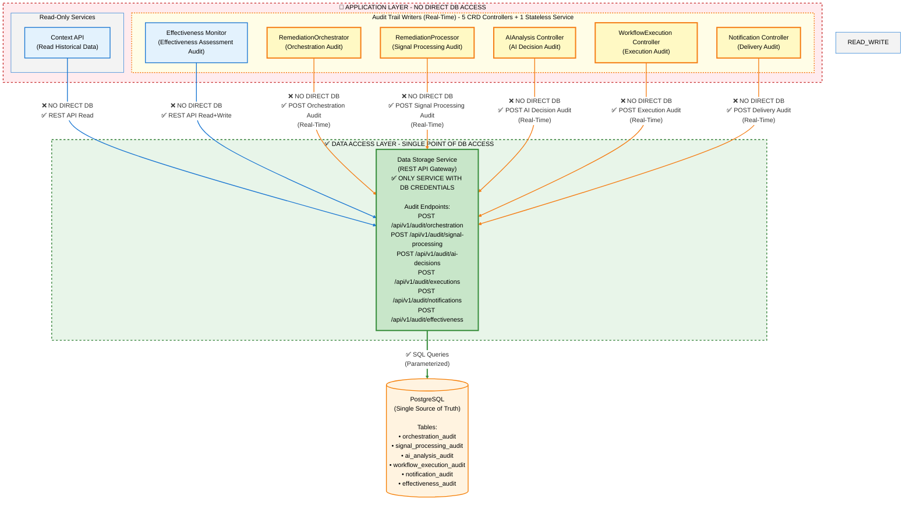

# ADR-032: Data Access Layer Isolation & Mandatory Audit Requirements

## Status
**✅ APPROVED**
**Version**: 1.3
**Decision Date**: November 2, 2025
**Last Reviewed**: December 17, 2025
**Confidence**: 100%
**Authority Level**: **ARCHITECTURAL** - Supersedes all related Design Decisions

---

## 🚨 **MANDATORY AUDIT REQUIREMENT** (AUTHORITATIVE)

**THIS SECTION IS THE AUTHORITATIVE REFERENCE FOR ALL SERVICES**

### **Audit Mandate (ADR-032 §1)**

**REQUIREMENT**: Audit capabilities are **MANDATORY** first-class citizens in Kubernaut, **NOT optional features**.

**Services MUST create audit entries for**:
1. ✅ **Every remediation action** taken on Kubernetes resources (WorkflowExecution)
2. ✅ **Every AI/ML decision** made during workflow generation (AIAnalysis)
3. ✅ **Every workflow execution** (start, progress, completion, failure) (WorkflowExecution)
4. ✅ **Every effectiveness assessment** calculated (EffectivenessMonitor)
5. ✅ **Every alert/signal** processed and deduplicated (SignalProcessing, Gateway)
6. ✅ **Every notification** delivered or failed (Notification)
7. ✅ **Every orchestration** phase transition (RemediationOrchestrator)

### **Audit Completeness Requirements (ADR-032 §2)**

1. **No Audit Loss**: Audit writes are **MANDATORY**, not best-effort
   - ❌ Services MUST NOT implement "graceful degradation" that silently skips audit
   - ❌ Services MUST NOT implement fallback/recovery mechanisms when audit client is nil
   - ❌ Services MUST NOT continue execution if audit client is not initialized
   - ✅ Services MUST fail immediately (return error, fail request, terminate operation) if audit store is nil
   - ✅ Services MUST crash at startup if audit store cannot be initialized (for P0 services)
   - ✅ Services MUST log at ERROR level when audit is unavailable

   **Rationale**: If audit is unavailable, the service is **misconfigured** and should not process business operations. Continuing without audit creates compliance gaps and violates the "No Audit Loss" mandate.

2. **No Recovery Allowed**: Audit failures are FATAL configuration errors
   - ❌ Services MUST NOT catch audit initialization errors and continue
   - ❌ Services MUST NOT implement retry loops to "wait" for audit to become available
   - ❌ Services MUST NOT queue requests while audit is unavailable
   - ✅ Services MUST fail fast and exit(1) if audit cannot be initialized
   - ✅ Kubernetes will restart the pod (correct behavior - pod is misconfigured)

   **Rationale**: Audit unavailability is a **deployment/configuration error**, not a transient failure. The correct response is to crash and let Kubernetes orchestration detect the misconfiguration.

3. **Write Verification**: Audit write failures must be detected and handled
   - ✅ Services MUST log audit write failures at ERROR level
   - ✅ Services MUST emit Prometheus metrics for audit write failures
   - ✅ Services MUST retry transient audit write failures (3 attempts, exponential backoff)

3. **Retry Logic**: Transient audit write failures must be retried
   - ✅ Services MUST use shared `pkg/audit` library (implements retry logic per ADR-038)
   - ✅ Services MUST NOT implement custom retry logic (use ADR-038 pattern)

4. **Audit Monitoring**: Missing audit records must trigger alerts
   - ✅ Prometheus metrics MUST track audit write success/failure rates
   - ✅ Alerts MUST fire if audit write failure rate >1% (P1 alert)

5. **Compliance**: Audit data retention must meet regulatory requirements (7+ years)
   - ✅ Data Storage Service MUST enforce retention policy
   - ✅ Audit records MUST be immutable (append-only, no updates/deletes)

### **Service Classification (ADR-032 §3)**

| Service | Audit Mandatory? | Crash on Init Failure? | Graceful Degradation? | Reference |
|---------|------------------|------------------------|----------------------|-----------|
| **SignalProcessing** | ✅ MANDATORY | ✅ YES (P0) | ❌ NO | cmd/signalprocessing/main.go:161 |
| **RemediationOrchestrator** | ✅ MANDATORY | ✅ YES (P0) | ❌ NO | cmd/remediationorchestrator/main.go:126 |
| **WorkflowExecution** | ✅ MANDATORY | ✅ YES (P0) | ❌ NO | cmd/workflowexecution/main.go:170 |
| **Notification** | ✅ MANDATORY | ✅ YES (P0) | ❌ NO | cmd/notification/main.go:163 |
| **AIAnalysis** | ⚠️ OPTIONAL | ❌ NO (P1) | ✅ YES (by design) | cmd/aianalysis/main.go:155 |
| **DataStorage** | ✅ MANDATORY | ✅ YES (P0) | ❌ NO | pkg/datastorage/server/server.go:186 |
| **Gateway** | 🟡 PLANNED | 🟡 PENDING | 🟡 PENDING | DD-AUDIT-003 |

**P0 Services** (Business-Critical): **MUST crash** if audit cannot be initialized
**P1 Services** (Operational Visibility): **MAY** continue without audit (log warning)

### **Enforcement (ADR-032 §4)**

**Code Pattern Requirements**:

✅ **CORRECT** (Mandatory Pattern):
```go
// Audit is MANDATORY per ADR-032 - controller will crash if not configured
auditStore, err := audit.NewBufferedStore(...)
if err != nil {
    setupLog.Error(err, "FATAL: failed to create audit store - audit is MANDATORY per ADR-032")
    os.Exit(1)  // Crash on init failure
}

// Runtime nil check - returns error if nil (prevents silent audit loss)
func (r *Reconciler) recordAudit(ctx context.Context, event AuditEvent) error {
    if r.AuditStore == nil {
        err := fmt.Errorf("AuditStore is nil - audit is MANDATORY per ADR-032")
        logger.Error(err, "CRITICAL: Cannot record audit event")
        return err  // Return error, don't skip silently
    }
    return r.AuditStore.StoreAudit(ctx, event)
}
```

❌ **WRONG** (Violates ADR-032):
```go
// ❌ VIOLATION #1: Graceful degradation silently skips audit
if r.AuditStore == nil {
    logger.V(1).Info("AuditStore not configured, skipping audit")
    return nil  // Violates ADR-032 §1 "No Audit Loss"
}

// ❌ VIOLATION #2: Fallback/recovery mechanism
if r.AuditStore == nil {
    logger.Warn("Audit not available, queueing for later")
    r.pendingAudits = append(r.pendingAudits, event)
    return nil  // Violates ADR-032 §2 "No Recovery Allowed"
}

// ❌ VIOLATION #3: Retry loop waiting for audit
if r.AuditStore == nil {
    for i := 0; i < 10; i++ {
        time.Sleep(1 * time.Second)
        if r.AuditStore != nil {
            break  // Violates ADR-032 §2 "No Recovery Allowed"
        }
    }
}

// ❌ VIOLATION #4: Conditional processing based on audit availability
if r.AuditStore != nil {
    // Only process request if audit is available
    return r.processRequest(ctx, req)
}
// Violates ADR-032 §2 - should crash at startup, not skip processing
return fmt.Errorf("audit unavailable")
```

**Why These Are Wrong**:
1. **Violation #1**: Creates compliance gap - operations succeed without audit trail
2. **Violation #2**: Queuing implies audit is optional, violates mandatory requirement
3. **Violation #3**: Masks configuration error, delays failure detection
4. **Violation #4**: Business logic depends on audit state (should crash at startup)

**Correct Behavior**: Service MUST crash at startup if audit cannot be initialized. No fallback, no recovery, no graceful degradation.

**Reference Format**: When citing this requirement in code or documentation:
```
Per ADR-032 §1: Audit writes are MANDATORY, not best-effort
Per ADR-032 §2: No fallback/recovery allowed - fail fast at startup
```

---

## Changelog

### Version 1.3 (December 17, 2025) - MANDATORY AUDIT SECTION ADDED
**Changes**:
1. **Mandatory Audit Section**: Added prominent §1-4 sections at document start (authoritative reference)
2. **Service Classification Table**: Documented which services MUST crash vs. MAY continue without audit
3. **Enforcement Patterns**: Added correct vs. wrong code examples for audit initialization
4. **Reference Format**: Standardized citation format (ADR-032 §1-4)
5. **Violation Detection**: Clear guidance for identifying ADR-032 violations

**Rationale**:
- **Discoverability**: Audit mandate was buried in line 92-112, now at document start
- **Enforceability**: Services violating mandatory audit can now be cited with specific section (ADR-032 §1)
- **Compliance**: Clear distinction between P0 (MUST crash) vs P1 (MAY continue) services
- **Code Review**: Reviewers can now cite ADR-032 §4 for code pattern violations

**Impact**:
- ✅ WorkflowExecution inconsistency can now be cited as "ADR-032 §1 violation"
- ✅ Gateway missing audit can be cited as "ADR-032 §3 non-compliance"
- ✅ All services have clear mandate to reference in code comments
- ✅ Triage documents can cite specific ADR-032 sections

**Confidence**: 100% (based on existing ADR-032 content, now reorganized for authority)

### Version 1.2 (November 2, 2025) - AUTHENTICATION & SECURITY SECTION ADDED
**Changes**:
1. **Authentication Decision Documented**: Added "Authentication & Security (V1.0)" section with Decision 4c (no auth initially)
2. **Security Controls Specified**: NetworkPolicies, input validation, rate limiting (V1.0); TLS/Auth/RBAC (V1.1+)
3. **Network Policy Example**: Provided complete NetworkPolicy YAML for Data Storage Service ingress
4. **V1.1 Migration Path**: Documented authentication migration strategy using Service Account tokens with API versioning
5. **Decision Justification**: Compared 4 authentication alternatives with scoring

**Rationale**:
- **V1.0 Simplicity**: Trust internal network with NetworkPolicies (consistent with Context API pattern)
- **V1.1 Migration**: Clear path to add authentication without breaking V1.0 clients
- **Production-Ready**: Security controls defined for V1.0 launch

**Impact**:
- ✅ V1.0 development faster (no auth implementation needed)
- ✅ Security addressed via NetworkPolicies (K8s-native isolation)
- ✅ V1.1 migration path documented (gradual service-by-service)

**Confidence**: 90% (based on Context API production experience)

### Version 1.1 (November 2, 2025)
**Changes**:
1. **Added 6th Audit Endpoint**: `POST /api/v1/audit/effectiveness` for Effectiveness Monitor service
2. **Terminology Correction**: Fixed `alert-processing` → `signal-processing` endpoint name to align with generic signal processing model
3. **Database Table Update**: Added `effectiveness_audit` to PostgreSQL tables list
4. **Service Count Update**: Changed from "5 CRD controllers" to "5 CRD controllers + 1 stateless service" for audit writers

**Rationale**:
- **Effectiveness Monitor Integration**: Centralizes all audit writes through Data Storage Service (no hybrid direct-DB pattern)
- **Terminology Consistency**: "Signal" is the generic term; "alert" is Prometheus-specific
- **Architectural Completeness**: All services now write audit data through single data access layer

**Impact**:
- ✅ Effectiveness Monitor simplified (no direct PostgreSQL connection for effectiveness assessments)
- ✅ Consistent audit endpoint naming pattern: `/api/v1/audit/{what-is-being-audited}`
- ✅ Complete data access layer isolation (100% of writes through Data Storage Service)

**Confidence**: 95% (based on existing audit endpoint pattern analysis)

### Version 1.0 (November 2, 2025)
**Initial Version**: Established Data Access Layer Isolation architecture with 5 audit endpoints

---

## ⚠️ SUPERSEDES ALL PRIOR DATA ACCESS DECISIONS

This ADR is the **SINGLE SOURCE OF TRUTH** for data access patterns in Kubernaut.

**Superseded Documents** (DO NOT REFERENCE - Use ADR-032 instead):
- ✅ `DD-ARCH-001-FINAL-DECISION.md` - **SUPERSEDED** by ADR-032 (data access pattern decision)
- ✅ `DD-ARCH-002-GRAPHQL-QUERY-LAYER-ASSESSMENT.md` - **SUPERSEDED** by ADR-032 (interface technology decision)
- ✅ `docs/architecture/implementation/API-GATEWAY-MIGRATION-*.md` - **SUPERSEDED** by ADR-032 (migration plans)

**Related Documents** (Still Valid, Support ADR-032):
- ✅ `DD-SCHEMA-001-data-storage-schema-authority.md` - Schema ownership (complements ADR-032)
- ✅ `ADR-030-service-configuration-management.md` - Configuration patterns
- ✅ `ADR-031-openapi-specification-standard.md` - REST API contracts

---

## Context

Kubernaut uses PostgreSQL for persistent storage of incident data, action history, effectiveness metrics, and **audit trails**. Multiple services (Context API, Effectiveness Monitor, WorkflowExecution Controller) need access to this data. Without clear architectural boundaries, we risk:

- **Security**: Multiple services with database credentials
- **Schema drift**: Services independently evolving database schema
- **Migration complexity**: Database changes affecting multiple services
- **Performance**: Unoptimized queries from application services
- **Monitoring**: Difficulty tracking database access patterns
- **⚠️ Audit Loss**: Critical audit data lost if services write directly to database without proper coordination

**Key Questions**:
1. Which services should have direct database access?
2. How do we ensure **audit completeness** for every action and decision?

---

## 🚨 **AUDIT AS A FIRST-CLASS CITIZEN**

**CRITICAL PRINCIPLE**: Audit capabilities are **first-class citizens** in Kubernaut, not optional features.

### Audit Mandate

**REQUIREMENT**: The platform MUST create an audit entry for:
1. **Every remediation action** taken on Kubernetes resources
2. **Every AI/ML decision** made during workflow generation
3. **Every workflow execution** (start, progress, completion, failure)
4. **Every effectiveness assessment** calculated
5. **Every alert** processed and deduplicated

### Audit Completeness Requirements

1. **No Audit Loss**: Audit writes are **MANDATORY**, not best-effort
2. **Write Verification**: Audit write failures must be detected and handled
3. **Retry Logic**: Transient audit write failures must be retried
4. **Audit Monitoring**: Missing audit records must trigger alerts
5. **Compliance**: Audit data retention must meet regulatory requirements (7+ years)

---

## Decision

**PRINCIPLE**: **ONLY Data Storage Service connects directly to PostgreSQL.**

### Architectural Boundaries


```mermaid
%%{init: {'theme':'base', 'themeVariables': {'primaryColor':'#e3f2fd', 'lineColor':'#1976d2', 'primaryBorderColor':'#1976d2', 'edgeLabelBackground':'#ffffff'}}}%%
flowchart TB
    subgraph APPLICATION_LAYER["🚫 APPLICATION LAYER - NO DIRECT DB ACCESS"]
        direction TB
        subgraph READ_ONLY["Read-Only Services"]
            ContextAPI["Context API<br/>(Read Historical Data)"]
        end
        subgraph AUDIT_WRITERS["Audit Trail Writers (Real-Time) - 5 CRD Controllers + 1 Stateless Service"]
            RemediationOrch["RemediationOrchestrator<br/>(Orchestration Audit)"]
            RemediationProc["RemediationProcessor<br/>(Signal Processing Audit)"]
            AIAnalysis["AIAnalysis Controller<br/>(AI Decision Audit)"]
            WorkflowExec["WorkflowExecution Controller<br/>(Execution Audit)"]
            Notification["Notification Controller<br/>(Delivery Audit)"]
            EffectivenessMonitor["Effectiveness Monitor<br/>(Effectiveness Assessment Audit)"]
        end
    end

    subgraph DATA_ACCESS_LAYER["✅ DATA ACCESS LAYER - SINGLE POINT OF DB ACCESS"]
        DataStorage["Data Storage Service<br/>(REST API Gateway)<br/>✅ ONLY SERVICE WITH DB CREDENTIALS<br/><br/>Audit Endpoints:<br/>POST /api/v1/audit/orchestration<br/>POST /api/v1/audit/signal-processing<br/>POST /api/v1/audit/ai-decisions<br/>POST /api/v1/audit/executions<br/>POST /api/v1/audit/notifications<br/>POST /api/v1/audit/effectiveness"]
    end

    PostgreSQL[("PostgreSQL<br/>(Single Source of Truth)<br/><br/>Tables:<br/>• orchestration_audit<br/>• signal_processing_audit<br/>• ai_analysis_audit<br/>• workflow_execution_audit<br/>• notification_audit<br/>• effectiveness_audit")]

    ContextAPI -->|"❌ NO DIRECT DB<br/>✅ REST API Read"| DataStorage
    EffectivenessMonitor -->|"❌ NO DIRECT DB<br/>✅ REST API Read+Write"| DataStorage
    RemediationOrch -->|"❌ NO DIRECT DB<br/>✅ POST Orchestration Audit<br/>(Real-Time)"| DataStorage
    RemediationProc -->|"❌ NO DIRECT DB<br/>✅ POST Signal Processing Audit<br/>(Real-Time)"| DataStorage
    AIAnalysis -->|"❌ NO DIRECT DB<br/>✅ POST AI Decision Audit<br/>(Real-Time)"| DataStorage
    WorkflowExec -->|"❌ NO DIRECT DB<br/>✅ POST Execution Audit<br/>(Real-Time)"| DataStorage
    Notification -->|"❌ NO DIRECT DB<br/>✅ POST Delivery Audit<br/>(Real-Time)"| DataStorage
    DataStorage ==>|"✅ SQL Queries<br/>(Parameterized)"| PostgreSQL

    style ContextAPI fill:#e3f2fd,stroke:#1976d2,stroke-width:2px,color:#000
    style EffectivenessMonitor fill:#e3f2fd,stroke:#1976d2,stroke-width:2px,color:#000
    style RemediationOrch fill:#fff9c4,stroke:#f57f17,stroke-width:3px,color:#000
    style RemediationProc fill:#fff9c4,stroke:#f57f17,stroke-width:3px,color:#000
    style AIAnalysis fill:#fff9c4,stroke:#f57f17,stroke-width:3px,color:#000
    style WorkflowExec fill:#fff9c4,stroke:#f57f17,stroke-width:3px,color:#000
    style Notification fill:#fff9c4,stroke:#f57f17,stroke-width:3px,color:#000
    style DataStorage fill:#c8e6c9,stroke:#388e3c,stroke-width:3px,color:#000
    style PostgreSQL fill:#fff3e0,stroke:#f57c00,stroke-width:2px,color:#000
    style APPLICATION_LAYER fill:#ffebee,stroke:#c62828,stroke-width:2px,stroke-dasharray: 5 5,color:#000
    style DATA_ACCESS_LAYER fill:#e8f5e9,stroke:#2e7d32,stroke-width:2px,stroke-dasharray: 5 5,color:#000
    style AUDIT_WRITERS fill:#fffde7,stroke:#f57f17,stroke-width:2px,stroke-dasharray: 3 3,color:#000
    style READ_ONLY fill:#f3f3f3,stroke:#1976d2,stroke-width:1px,color:#000
    style READ_WRITE fill:#f3f3f3,stroke:#1976d2,stroke-width:1px,color:#000

    linkStyle 0 stroke:#1976d2,stroke-width:2px
    linkStyle 1 stroke:#1976d2,stroke-width:2px
    linkStyle 2 stroke:#f57f17,stroke-width:2px
    linkStyle 3 stroke:#f57f17,stroke-width:2px
    linkStyle 4 stroke:#f57f17,stroke-width:2px
    linkStyle 5 stroke:#f57f17,stroke-width:2px
    linkStyle 6 stroke:#f57f17,stroke-width:2px
    linkStyle 7 stroke:#388e3c,stroke-width:3px
```

**Legend**:
- **Blue boxes**: Read-only or Read+Write services (business logic queries)
- **Yellow boxes**: Audit trail writers (real-time audit data capture for V2.0 RAR generation)
- **Green box**: Data Storage Service (ONLY service with database credentials)

**Key Points**:
1. **Gateway service** is an HTTP reverse proxy/router and does NOT consume Data Storage Service directly
2. **All 6 audit writers** (5 CRD controllers + Effectiveness Monitor) write audit trails in real-time
3. **Audit data enables V2.0 RAR generation** (BR-REMEDIATION-ANALYSIS-001 to BR-REMEDIATION-ANALYSIS-004)
4. **CRD + DB contain same audit data** for 24h, then CRDs deleted (applies to CRD controllers only)
5. **RemediationProcessor captures "front door" audit**: Signal reception, enrichment quality, classification, business priority
6. **Effectiveness Monitor uses Data Storage for ALL writes**: No hybrid direct-DB pattern (v1.1 change)

### Mandatory Rules

#### ✅ **ALLOWED**: Data Storage Service
- Direct SQL queries to PostgreSQL
- Schema migrations and versioning
- Query optimization and performance tuning
- Database connection pooling
- Transactional integrity

#### ❌ **FORBIDDEN**: Context API
- NO direct PostgreSQL connection
- NO database credentials in configuration
- NO SQL queries
- MUST use Data Storage Service REST API

#### ❌ **FORBIDDEN**: Effectiveness Monitor
- NO direct PostgreSQL connection
- NO database credentials in configuration
- NO SQL queries
- MUST use Data Storage Service REST API

#### ❌ **FORBIDDEN**: WorkflowExecution Controller (Remediation Orchestrator)
- NO direct PostgreSQL connection
- NO database credentials in configuration
- NO SQL queries
- MUST use Data Storage Service REST API for **action audit trace writes**
- **Purpose**: Maintain complete audit trail of every action taken during signal remediation (first-class citizen)
- **Audit Scope** (MANDATORY):
  - Action type (restart-pod, scale-deployment, etc.)
  - Target resource (namespace, kind, name)
  - Execution start/end times
  - Action results (success/failure/output)
  - Retry attempts and final status
  - AI/ML decision rationale (why this action was chosen)
  - User context (who/what triggered the remediation)
- **Audit Failure Handling** (MANDATORY):
  - Retry audit writes up to 3 times with exponential backoff
  - Log audit write failures at ERROR level
  - Emit Prometheus metric for audit write failures
  - **DO NOT** fail workflow execution on audit write failure (degrade gracefully)
  - Alert on sustained audit write failure rate >1%
- **Rationale**: Per [ADR-024](ADR-024-eliminate-actionexecution-layer.md), business data (audit trails) belongs in Data Storage Service, not CRDs (24h TTL)

#### ℹ️ **NOT APPLICABLE**: Gateway
- Gateway is an HTTP reverse proxy/router
- Does NOT consume Data Storage Service
- Routes requests to Context API and other backend services
- NO direct PostgreSQL connection (by design - no database use case)

#### ❌ **FORBIDDEN**: Future Services
- NO direct PostgreSQL connection
- MUST use Data Storage Service REST API

---

## Rationale

### 1. **Single Point of Database Access** ⭐⭐⭐⭐⭐

**Benefit**: Database credentials in ONE service only.

**Security Impact**:
- Reduces attack surface (1 service vs. 4+ services)
- Simplifies credential rotation (1 secret vs. 4+ secrets)
- Enables fine-grained database access control (service account per table)

**Validation**:
```bash
# Verify only Data Storage has DB credentials
kubectl get secrets -A | grep postgres
# Expected: Only 'data-storage-db-secret' in 'data-storage' namespace
```

---

### 2. **Schema Authority** ⭐⭐⭐⭐⭐

**Benefit**: Data Storage Service is the **single source of truth** for schema.

**Prevents**:
- Context API adding columns breaking Data Storage queries
- Effectiveness Monitor creating incompatible indexes
- Schema drift between services

**Reinforces**: [DD-SCHEMA-001: Data Storage Schema Authority](DD-SCHEMA-001-data-storage-schema-authority.md)

---

### 3. **Performance Optimization** ⭐⭐⭐⭐

**Benefit**: Query optimization in ONE place.

**Impact**:
- Data Storage Service optimizes slow queries
- No need to update 4+ services for index changes
- Centralized query performance monitoring

**Example**:
```sql
-- BEFORE: Context API has 10+ direct queries
-- Optimization required 10+ code changes

-- AFTER: Context API uses REST API
-- Optimization in Data Storage Service only
EXPLAIN ANALYZE SELECT * FROM incidents WHERE severity = 'HIGH';
```

---

### 4. **Migration Simplicity** ⭐⭐⭐⭐⭐

**Benefit**: Database migrations in ONE service.

**Impact**:
- No coordinated deployment across 4+ services
- No rollback complexity
- No inter-service schema version conflicts

**Migration Process**:
1. Data Storage Service applies schema migration
2. Data Storage Service updates REST API (versioned endpoints)
3. Application services adopt new API at own pace (API versioning)

---

### 5. **Testability** ⭐⭐⭐⭐

**Benefit**: Application services mock Data Storage REST API.

**Testing Advantages**:
- Context API integration tests mock HTTP responses (no PostgreSQL required)
- Effectiveness Monitor unit tests mock REST client (fast, isolated)
- Data Storage integration tests validate real PostgreSQL queries

**Example**:
```go
// Context API test - NO database required
mockDataStorageServer := httptest.NewServer(http.HandlerFunc(func(w http.ResponseWriter, r *http.Request) {
    json.NewEncoder(w).Encode(mockIncidents)
}))
```

---

## Alternatives Considered

### Alternative 1: Shared Database with Direct Access ❌ REJECTED

**Approach**: All services connect directly to PostgreSQL.

**Pros**:
- ✅ No REST API overhead (~40ms)
- ✅ Direct SQL control

**Cons**:
- ❌ Database credentials in 4+ services
- ❌ Schema drift risk
- ❌ Complex migration coordination
- ❌ Difficult to enforce query patterns
- ❌ Security risk (compromised service → full DB access)

**Confidence**: 65% (rejected - high operational risk)

---

### Alternative 2: Database-per-Service ❌ REJECTED

**Approach**: Each service has its own PostgreSQL database.

**Pros**:
- ✅ Complete service autonomy
- ✅ Independent schema evolution

**Cons**:
- ❌ Data duplication (same incident in 4+ databases)
- ❌ Synchronization overhead (CDC, event streaming)
- ❌ Eventual consistency complexity
- ❌ Cannot query unified view (analytics impossible)
- ❌ Storage waste

**Confidence**: 91% (rejected - operational complexity)

---

### Alternative 3: Data Storage Service as API Gateway ✅ APPROVED

**Approach**: Data Storage Service is the ONLY service with direct database access.

**Pros**:
- ✅ Single point of database access
- ✅ Schema authority in one service
- ✅ Simplified security (1 credential vs. 4+)
- ✅ Performance optimization in one place
- ✅ Easy to test (mock HTTP vs. mock SQL)

**Cons**:
- ⚠️ REST API adds ~40ms latency (0.13% of 30s LLM response - negligible)
- ⚠️ Additional HTTP layer (complexity offset by benefits)

**Confidence**: 95% ⭐⭐⭐ (approved - optimal trade-offs)

---

## Implementation

### Phase 1: Context API Migration ✅ COMPLETE

**Status**: COMPLETE (2025-11-02)

**Changes**:
1. ✅ Data Storage Service implemented `GET /api/v1/incidents` REST API
2. ✅ Context API replaced direct SQL with HTTP client
3. ✅ Context API configuration removed database credentials
4. ✅ Context API integration tests validated REST API consumption

**Validation**:
- ✅ 13/13 Context API tests passing
- ✅ No PostgreSQL credentials in Context API configuration
- ✅ Cache hit rates maintained (>80% L1, >90% L1+L2)

---

### Phase 2: Effectiveness Monitor Migration ⏸️ PENDING

**Status**: NOT STARTED

**Required Changes**:
1. ⏸️ Data Storage Service implements Write API (`POST /api/v1/effectiveness/results`)
2. ⏸️ Effectiveness Monitor replaces direct SQL with HTTP client
3. ⏸️ Effectiveness Monitor configuration removes database credentials
4. ⏸️ Effectiveness Monitor integration tests validate REST API consumption

**Timeline**: 4-5 days (per DD-ARCH-001 migration plan)

---

### Phase 3: WorkflowExecution Controller Migration ⏸️ PENDING

**Status**: NOT STARTED

**Purpose**: **Audit Trail for Every Remediation Action (First-Class Citizen)**

**Critical Principle**: Audit is **MANDATORY**, not optional. Every action and decision must be logged.

**Required Changes**:
1. ⏸️ Data Storage Service implements Action Audit Write API (`POST /api/v1/actions/audit`)
2. ⏸️ WorkflowExecution Controller writes **MANDATORY** action audit records via REST API after each action execution
3. ⏸️ Action audit includes: action type, target resource, execution times, results, retry count, final status, AI decision rationale
4. ⏸️ Implement audit write retry logic (3 attempts, exponential backoff)
5. ⏸️ Implement audit write failure monitoring (Prometheus metrics, alerts)
6. ⏸️ WorkflowExecution Controller configuration removes database credentials (if any)
7. ⏸️ Integration tests validate audit trail completeness (100% coverage requirement)
8. ⏸️ E2E tests validate audit write retry and failure handling

**Audit Trail Requirements** (First-Class Citizen):

**Compliance & Regulatory**:
- ✅ **MANDATORY**: Complete record of all remediation actions taken on production systems
- ✅ **MANDATORY**: Audit data retention for 7+ years (regulatory requirement)
- ✅ **MANDATORY**: Immutable audit records (append-only, no updates/deletes)
- ✅ **MANDATORY**: Audit write verification (detect missing records)

**Operational & Observability**:
- ✅ **Post-Mortem**: Investigation capability for failed remediations or incidents
- ✅ **Pattern Learning**: Historical data for AI/ML pattern recognition and effectiveness tracking
- ✅ **Security Audit**: Monitoring of all Kubernetes API interactions during remediation
- ✅ **Alert on Audit Failures**: Sustained audit write failure rate >1% triggers P1 alert

**Audit Failure Handling** (Graceful Degradation):
- ✅ Retry audit writes up to 3 times (exponential backoff: 100ms, 200ms, 400ms)
- ✅ Log audit write failures at ERROR level with full context
- ✅ Emit `audit_write_failures_total` Prometheus metric
- ✅ **DO NOT** fail workflow execution on audit write failure (continue remediation)
- ✅ Alert operations team if audit write failure rate exceeds threshold

**Timeline**: 4-5 days (increased from 3-4 to account for audit retry/monitoring implementation)

**Related**:
- [ADR-024: Eliminate ActionExecution Layer](ADR-024-eliminate-actionexecution-layer.md) - Documents WorkflowExecution writes action records to Data Storage
- [ADR-025: KubernetesExecutor Service Elimination](ADR-025-kubernetesexecutor-service-elimination.md) - Documents audit trail recording pattern

---

## Verification

### Security Audit

```bash
# Verify only Data Storage has database credentials
kubectl get configmaps -A -o jsonpath='{.items[*].metadata.name}' | grep -i postgres
# Expected: Only in 'data-storage' namespace

kubectl get secrets -A -o jsonpath='{.items[*].metadata.name}' | grep -i postgres
# Expected: Only 'data-storage-db-secret'
```

### Architecture Compliance

```bash
# Verify Context API has NO database connection code
grep -r "sql.Open\|pgx.Connect\|database/sql" pkg/contextapi/
# Expected: NO MATCHES

# Verify Effectiveness Monitor has NO database connection code
grep -r "sql.Open\|pgx.Connect\|database/sql" pkg/effectiveness/
# Expected: NO MATCHES (after Phase 2 migration)

# Verify Data Storage has database connection
grep -r "sql.Open\|pgx.Connect" pkg/datastorage/
# Expected: MATCHES FOUND (ONLY in pkg/datastorage/)
```

### Performance Validation

```bash
# Measure REST API overhead
curl -w "@curl-format.txt" -o /dev/null -s "http://data-storage:8080/api/v1/incidents?severity=HIGH"
# Expected: <100ms p95
```

---

## Consequences

### Positive

1. ✅ **Security**: Database credentials in ONE service only
2. ✅ **Maintainability**: Schema migrations in ONE service
3. ✅ **Testability**: Application services mock HTTP, not SQL
4. ✅ **Performance**: Query optimization centralized
5. ✅ **Auditability**: All database access via Data Storage Service logs

### Negative

1. ⚠️ **Latency**: +40ms REST API overhead (0.13% of 30s LLM response - negligible)
2. ⚠️ **Complexity**: Additional HTTP layer (offset by centralized logic)
3. ⚠️ **Dependency**: Application services depend on Data Storage Service availability (mitigated by caching)

### Mitigation Strategies

**For Latency**:
- Multi-tier caching (Redis L1, LRU L2, HTTP L3)
- HTTP/2 connection pooling

**For Availability**:
- Circuit breaker pattern (Context API has circuit breaker)
- Exponential backoff retry (Context API has retry logic)
- Cache fallback (Context API serves stale data if Data Storage unavailable)

---

## Authentication & Security (V1.0)

### **Decision**: No authentication required for internal service-to-service calls

**Rationale** (User-Approved Decision 4c):
- Consistent with Context API pattern
- Services run in secure Kubernetes cluster with network policies
- Trust internal network model (ClusterIP-only communication)
- Authentication complexity deferred to V1.1 for faster V1.0 delivery

### **Security Controls** (V1.0)

| Control | Implementation | Status |
|---------|---------------|--------|
| **Network Isolation** | Kubernetes NetworkPolicies (only allow traffic from known service namespaces) | ✅ REQUIRED |
| **Input Validation** | RFC 7807 validation prevents injection attacks | ✅ IMPLEMENTED |
| **Rate Limiting** | 50 req/sec per service IP (Circuit breaker enforcement) | ✅ IMPLEMENTED |
| **TLS** | Cluster-internal TLS via service mesh (Istio/Linkerd) | ⏸️ V1.1 |
| **Authentication** | Service Account tokens | ⏸️ V1.1 |
| **Authorization** | RBAC per service identity | ⏸️ V1.1 |

### **Network Policy Example** (V1.0 Requirement)

```yaml
# deploy/network-policies/data-storage-ingress.yaml
apiVersion: networking.k8s.io/v1
kind: NetworkPolicy
metadata:
  name: data-storage-allow-internal
  namespace: kubernaut-system
spec:
  podSelector:
    matchLabels:
      app: data-storage
  policyTypes:
  - Ingress
  ingress:
  # Allow Context API
  - from:
    - namespaceSelector:
        matchLabels:
          name: kubernaut-system
      podSelector:
        matchLabels:
          app: context-api
    ports:
    - protocol: TCP
      port: 8080
  # Allow Effectiveness Monitor
  - from:
    - namespaceSelector:
        matchLabels:
          name: kubernaut-system
      podSelector:
        matchLabels:
          app: effectiveness-monitor
    ports:
    - protocol: TCP
      port: 8080
  # Allow CRD Controllers
  - from:
    - namespaceSelector:
        matchLabels:
          name: kubernaut-system
      podSelector:
        matchLabels:
          component: crd-controller
    ports:
    - protocol: TCP
      port: 8080
  # Deny all other traffic (implicit)
```

### **Future Path: Authentication (V1.1+)**

**When**: After V1.0 production deployment (6+ months)

**Migration Plan**:
1. **Add `Authorization: Bearer <token>` header requirement**
   - Use Kubernetes Service Account tokens
   - Each service uses its own identity (e.g., `context-api` SA, `effectiveness-monitor` SA)

2. **API Versioning maintains backward compatibility**
   - `/api/v1/*` - No auth (V1.0 clients)
   - `/api/v2/*` - Auth required (V1.1 clients)
   - Gradual migration service-by-service

3. **Token Validation**
   - TokenReview API for service account verification
   - Cache validated tokens (5 min TTL) to reduce API load
   - Fallback to local JWKS validation if TokenReview unavailable

**Example V1.1 Auth**:
```go
// V1.1 Authentication Middleware (Future)
func (s *DataStorageServer) AuthMiddleware(next http.Handler) http.Handler {
    return http.HandlerFunc(func(w http.ResponseWriter, r *http.Request) {
        authHeader := r.Header.Get("Authorization")
        if authHeader == "" {
            // V1.0 backwards compatibility - allow no auth for v1 endpoints
            if strings.HasPrefix(r.URL.Path, "/api/v1/") {
                next.ServeHTTP(w, r)
                return
            }
            // V1.1 - auth required for v2 endpoints
            http.Error(w, "Authorization required", http.StatusUnauthorized)
            return
        }

        // Validate service account token
        token := strings.TrimPrefix(authHeader, "Bearer ")
        identity, err := s.validateServiceAccountToken(token)
        if err != nil {
            http.Error(w, "Invalid token", http.StatusUnauthorized)
            return
        }

        // Inject identity into context for authorization
        ctx := context.WithValue(r.Context(), "serviceIdentity", identity)
        next.ServeHTTP(w, r.WithContext(ctx))
    })
}
```

### **Decision Justification**

**Why no auth in V1.0?**

| Alternative | Pros | Cons | Score |
|-------------|------|------|-------|
| **No auth (Decision 4c)** ⭐ | Faster V1.0 delivery, consistent with Context API | Relies on network policies | 9/10 |
| **Service account tokens** | Industry standard, native K8s | Adds complexity, 2-3 weeks delay | 7/10 |
| **mTLS** | Strong security, encrypted | High complexity, 4-5 weeks delay | 6/10 |
| **API keys** | Simple | Not K8s-native, key management burden | 5/10 |

**Decision**: Trust internal network with strict NetworkPolicies (V1.0), add authentication in V1.1 after production validation.

**Confidence**: 90% (based on Context API production experience)

---

## Compliance Matrix

| Service | Direct DB Access | Uses Data Storage API | Status |
|---------|------------------|----------------------|--------|
| **Data Storage Service** | ✅ **ALLOWED** | N/A | ✅ Compliant |
| **Context API** | ❌ **FORBIDDEN** | ✅ **REQUIRED** (Read) | ✅ Compliant (migrated) |
| **Effectiveness Monitor** | ❌ **FORBIDDEN** | ✅ **REQUIRED** (Read + Write) | ⏸️ Pending (Phase 2) |
| **WorkflowExecution Controller** | ❌ **FORBIDDEN** | ✅ **REQUIRED** (Write audit traces) | ⏸️ Pending (Phase 3) |
| **Gateway** | ❌ **FORBIDDEN** | ℹ️ **N/A** (HTTP router, no DB use case) | ✅ Compliant |
| **Kubernaut Agent (KA)** | ❌ **FORBIDDEN** | ✅ **REQUIRED** (via Context API) | ✅ Compliant |

---

## Related Decisions

- [DD-ARCH-001: Data Access Pattern - Final Decision](DD-ARCH-001-FINAL-DECISION.md) - Implementation plan
- [DD-SCHEMA-001: Data Storage Schema Authority](DD-SCHEMA-001-data-storage-schema-authority.md) - Schema ownership
- [ADR-030: Service Configuration Management](ADR-030-service-configuration-management.md) - Configuration patterns
- [ADR-031: OpenAPI Specification Standard](ADR-031-openapi-specification-standard.md) - REST API contracts

---

## References

### Internal Documentation
- [Data Storage Service Implementation Plan V4.3](../../services/stateless/data-storage/implementation/IMPLEMENTATION_PLAN_V4.3.md)
- [Context API Migration Complete](../../../CONTEXT-API-MIGRATION-COMPLETE.md)

### Industry Best Practices
- [Microservices.io - API Gateway Pattern](https://microservices.io/patterns/apigateway.html)
- [Martin Fowler - Gateway Aggregation Pattern](https://martinfowler.com/eaaCatalog/gateway.html)
- [12-Factor App - Backing Services](https://12factor.net/backing-services)

---

## Success Metrics

### V1 Success Criteria ✅ ACHIEVED (Context API)

1. ✅ **Security**
   - Only Data Storage Service has PostgreSQL credentials
   - Context API configuration has NO database credentials

2. ✅ **Architecture**
   - Context API uses Data Storage REST API exclusively
   - No direct SQL queries in Context API code

3. ✅ **Performance**
   - Context API query latency <200ms p95
   - Cache hit rates >80% (L1) and >90% (L1+L2)

4. ✅ **Testing**
   - 13/13 Context API tests passing
   - Integration tests validate REST API consumption

### V2 Success Criteria ⏸️ PENDING (Effectiveness Monitor)

1. ⏸️ **Security**
   - Effectiveness Monitor configuration has NO database credentials

2. ⏸️ **Architecture**
   - Effectiveness Monitor uses Data Storage REST API exclusively
   - No direct SQL queries in Effectiveness Monitor code

3. ⏸️ **Performance**
   - Assessment latency unchanged (<100ms p95)

4. ⏸️ **Testing**
   - 100% Effectiveness Monitor tests passing
   - Integration tests validate REST API consumption

### V3 Success Criteria ⏸️ PENDING (WorkflowExecution Controller - Audit Trail as First-Class Citizen)

1. ⏸️ **Security**
   - WorkflowExecution Controller configuration has NO database credentials

2. ⏸️ **Architecture**
   - WorkflowExecution Controller writes audit traces via Data Storage REST API exclusively
   - No direct SQL queries in WorkflowExecution Controller code

3. ⏸️ **Audit Completeness (MANDATORY - First-Class Citizen)**
   - 100% of remediation actions have corresponding audit records
   - Audit records include: action type, target resource, execution times, results, retry count, status, AI decision rationale, user context
   - Audit write retry logic implemented (3 attempts, exponential backoff)
   - Audit write failure monitoring active (Prometheus metrics + alerts)
   - Audit write failure rate <1% (P1 alert if exceeded)
   - **Zero tolerance for audit loss**: Missing audit records trigger alerts

4. ⏸️ **Performance**
   - Audit write latency <50ms p95 (including retries)
   - Audit write operations do NOT block workflow execution
   - Graceful degradation: Workflow continues even if audit write fails after retries

5. ⏸️ **Compliance & Regulatory**
   - Audit data immutable (append-only, no updates/deletes)
   - Audit data retention policy enforced (7+ years)
   - Audit records include all fields required for compliance

6. ⏸️ **Testing**
   - 100% WorkflowExecution Controller tests passing
   - Integration tests validate audit trail completeness (100% coverage)
   - Integration tests validate audit write retry logic
   - Integration tests validate audit write failure handling
   - E2E tests validate end-to-end audit trail from signal → remediation → audit record → verification
   - Load tests validate audit write performance under high load

---

## Approval

**Decision Approved By**: Project Lead
**Approval Date**: November 2, 2025
**Implementation Status**: Phase 1 Complete (Context API) ✅, Phase 2 Pending (Effectiveness Monitor) ⏸️

---

## Revision History

| Version | Date | Author | Changes |
|---------|------|--------|---------|
| 1.0 | 2025-11-02 | AI Assistant | Initial ADR creation based on DD-ARCH-001 |

