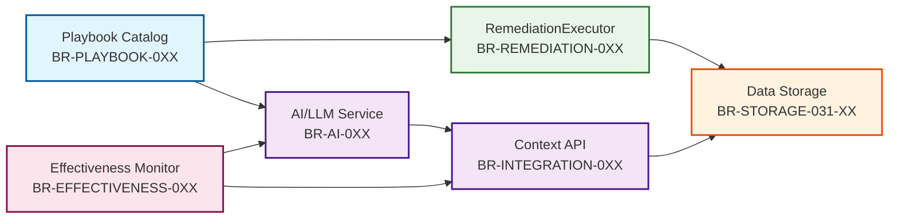

# ADR-033: Cross-Service Business Requirements

**Date**: November 5, 2025
**Status**: ✅ Approved
**Related ADR**: [ADR-033: Remediation Playbook Catalog](ADR-033-remediation-playbook-catalog.md)
**Purpose**: Define business requirements across all services impacted by ADR-033

---

## 🎯 **OVERVIEW**

ADR-033 introduces **Multi-Dimensional Success Tracking** for remediation playbooks. This is a **cross-service architectural change** that impacts **6 services**, not just Data Storage.

**Key Architectural Shift**:
- ❌ **OLD**: AI dynamically composes unique workflows (no success tracking)
- ✅ **NEW**: AI selects from catalog of proven playbooks (success tracked by incident_type + playbook)

**Pre-Release Status**: **NO BACKWARD COMPATIBILITY REQUIRED** - All changes are additive with native Go types

---

## 📊 **IMPACTED SERVICES & BR OWNERSHIP**

| Service | BR Category | Primary Responsibility | BR Count |
|---|---|---|---|
| **Data Storage** | BR-STORAGE-031-XX | Schema, aggregation APIs, migration | 6 BRs |
| **RemediationExecutor** | BR-REMEDIATION-0XX | Populate audit fields, track execution mode | 3 BRs |
| **Context API** | BR-INTEGRATION-0XX | Consume aggregation endpoints, expose to clients | 3 BRs |
| **AI/LLM Service** | BR-AI-0XX | Use success rates for playbook selection | 2 BRs |
| **Playbook Catalog** | BR-PLAYBOOK-0XX | Manage playbook registry, versioning | 3 BRs |
| **Effectiveness Monitor** | BR-EFFECTIVENESS-0XX | Consume success rate data for continuous learning | 3 BRs |
| **TOTAL** | **6 categories** | **ADR-033 Cross-Service Requirements** | **20 BRs** |

---

## 📋 **DATA STORAGE SERVICE** (BR-STORAGE-031-XX)

### **Primary Responsibilities**
- Schema migration (7 new columns)
- Aggregation REST APIs (3 new endpoints)
- Multi-dimensional success tracking
- **NO backward compatibility required (pre-release)**

### **Business Requirements**

#### **BR-STORAGE-031-01: Incident-Type Success Rate API**
**Priority**: P0
**Status**: Pending
**Description**: Expose REST API to calculate success rate aggregated by incident type (PRIMARY dimension)

**Acceptance Criteria**:
- Endpoint: `GET /api/v1/incidents/aggregate/success-rate/by-incident-type`
- Query params: `incident_type` (required), `time_range` (optional, default 7d), `min_samples` (optional, default 5)
- Response includes: total executions, successful executions, failed executions, success rate (0.0-1.0), confidence level
- Includes playbook breakdown (which playbooks were used for this incident type)
- Includes AI execution mode stats (catalog/chained/manual)

**Example**:
```bash
GET /api/v1/incidents/aggregate/success-rate/by-incident-type?incident_type=pod-oom-killer&time_range=7d

Response:
{
  "incident_type": "pod-oom-killer",
  "time_range": "7d",
  "total_executions": 100,
  "successful_executions": 85,
  "failed_executions": 15,
  "success_rate": 0.85,
  "confidence": "high",
  "min_samples_met": true,
  "breakdown_by_playbook": [
    {"playbook_id": "pod-oom-recovery", "playbook_version": "v1.2", "executions": 90, "success_rate": 0.89},
    {"playbook_id": "pod-oom-recovery", "playbook_version": "v1.1", "executions": 10, "success_rate": 0.50}
  ],
  "ai_execution_mode": {
    "catalog_selected": 90,
    "chained": 9,
    "manual_escalation": 1
  }
}
```

---

#### **BR-STORAGE-031-02: Playbook Success Rate API**
**Priority**: P0
**Status**: Pending
**Description**: Expose REST API to calculate success rate aggregated by playbook (SECONDARY dimension)

**Acceptance Criteria**:
- Endpoint: `GET /api/v1/incidents/aggregate/success-rate/by-playbook`
- Query params: `playbook_id` (required), `playbook_version` (required), `time_range` (optional), `min_samples` (optional)
- Response includes: playbook metadata, success rate, incident-type breakdown, action-level breakdown (step-by-step)
- Enables comparison of different playbook versions

**Example**:
```bash
GET /api/v1/incidents/aggregate/success-rate/by-playbook?playbook_id=pod-oom-recovery&playbook_version=v1.2

Response:
{
  "playbook_id": "pod-oom-recovery",
  "playbook_version": "v1.2",
  "total_executions": 90,
  "successful_executions": 80,
  "success_rate": 0.89,
  "breakdown_by_incident_type": [
    {"incident_type": "pod-oom-killer", "executions": 85, "success_rate": 0.90},
    {"incident_type": "container-memory-pressure", "executions": 5, "success_rate": 0.60}
  ],
  "breakdown_by_action": [
    {"action_type": "increase_memory", "step_number": 1, "executions": 90, "success_rate": 0.95},
    {"action_type": "restart_pod", "step_number": 2, "executions": 90, "success_rate": 0.93}
  ]
}
```

---

#### **BR-STORAGE-031-03: Schema Migration (7 New Columns)**
**Priority**: P0
**Status**: Pending
**Description**: Add 7 new columns to `resource_action_traces` table for multi-dimensional tracking

**Acceptance Criteria**:
- **DIMENSION 1 (PRIMARY)**: `incident_type` (required), `alert_name` (optional), `incident_severity` (required)
- **DIMENSION 2 (SECONDARY)**: `playbook_id` (required), `playbook_version` (required), `playbook_step_number` (optional), `playbook_execution_id` (required)
- **AI EXECUTION MODE**: `ai_selected_playbook` (bool), `ai_chained_playbooks` (bool), `ai_manual_escalation` (bool), `ai_playbook_customization` (JSONB)
- All new columns use native types (string, int, bool) - **NO NULL handling needed (pre-release)**
- 7 indexes created for efficient querying
- Migration script: `migrations/002_adr033_multidimensional_tracking.sql`

**Pre-Release Simplification**:
```go
// ✅ CORRECT (Pre-Release)
IncidentType string `json:"incident_type" db:"incident_type"` // REQUIRED, no nullable

// ❌ WRONG (Backward compatibility - not needed pre-release)
IncidentType sql.NullString `json:"incident_type,omitempty" db:"incident_type"`
```

---

#### **BR-STORAGE-031-04: AI Execution Mode Tracking**
**Priority**: P1
**Status**: Pending
**Description**: Track which AI execution mode was used (catalog selection, chained playbooks, manual escalation)

**Acceptance Criteria**:
- Mutually exclusive boolean flags for 3 modes
- Supports ADR-033 Hybrid Model validation (90-9-1 distribution)
- Enables analysis of AI decision patterns

**Example**:
```go
type AIExecutionModeStats struct {
    CatalogSelected  int `json:"catalog_selected"`  // 90-95% cases
    Chained          int `json:"chained"`           // 4-9% cases
    ManualEscalation int `json:"manual_escalation"` // <1% cases
}
```

---

#### **BR-STORAGE-031-05: Time-Range Filtering**
**Priority**: P0
**Status**: Pending
**Description**: Support time-range filtering for all aggregation queries

**Acceptance Criteria**:
- Supported ranges: 1h, 1d, 7d, 30d
- Default: 7d
- Uses indexed `action_timestamp` column for efficient queries
- Returns error for invalid time ranges

---

#### **BR-STORAGE-031-06: Confidence Level Calculation**
**Priority**: P1
**Status**: Pending
**Description**: Calculate confidence level based on sample size

**Acceptance Criteria**:
- `confidence`: "insufficient_data" (0 executions), "low" (<min_samples), "medium" (<20), "high" (>=20)
- `min_samples_met`: boolean flag
- Default min_samples: 5 (configurable via query param)
- Enables AI to avoid making decisions on insufficient data

---

## 🔄 **REMEDIATIONEXECUTOR SERVICE** (BR-REMEDIATION-0XX)

### **Primary Responsibilities**
- Populate `incident_type`, `playbook_id`, `playbook_version` when creating audit records
- Track AI execution mode (catalog/chained/manual)
- Generate unique `playbook_execution_id` for grouping multi-step playbooks

### **Business Requirements**

#### **BR-REMEDIATION-015: Populate Incident Type on Audit Creation**
**Priority**: P0
**Status**: Pending
**Description**: When creating audit records in Data Storage, populate `incident_type` field

**Acceptance Criteria**:
- Derive `incident_type` from RemediationRequest CRD or Prometheus alert label
- Format: kebab-case (e.g., `pod-oom-killer`, `high-cpu-usage`)
- **REQUIRED field** - all audits must have incident_type
- Map to standard incident taxonomy (if exists)

**Example**:
```go
audit := models.NotificationAudit{
    ActionID:        uuid.New().String(),
    ActionType:      "increase_memory",
    IncidentType:    "pod-oom-killer", // ✅ REQUIRED
    AlertName:       "KubePodOOMKilled",
    IncidentSeverity: "critical",
    // ... other fields
}
```

---

#### **BR-REMEDIATION-016: Populate Playbook Metadata**
**Priority**: P0
**Status**: Pending
**Description**: When executing playbooks, populate playbook metadata fields in audit records

**Acceptance Criteria**:
- `playbook_id`: Unique playbook identifier (e.g., `pod-oom-recovery`)
- `playbook_version`: Semantic version (e.g., `v1.2`)
- `playbook_execution_id`: UUID grouping all steps in single playbook run (generated by RemediationExecutor)
- `playbook_step_number`: Step position in multi-step playbooks (optional, 1-indexed)

**Example**:
```go
executionID := uuid.New().String() // Generated once per playbook run

// Step 1
audit1 := models.NotificationAudit{
    PlaybookID:          "pod-oom-recovery",
    PlaybookVersion:     "v1.2",
    PlaybookExecutionID: executionID,
    PlaybookStepNumber:  1,
    ActionType:          "increase_memory",
}

// Step 2 (same execution)
audit2 := models.NotificationAudit{
    PlaybookID:          "pod-oom-recovery",
    PlaybookVersion:     "v1.2",
    PlaybookExecutionID: executionID, // ✅ Same execution ID
    PlaybookStepNumber:  2,
    ActionType:          "restart_pod",
}
```

---

#### **BR-REMEDIATION-017: Track AI Execution Mode**
**Priority**: P1
**Status**: Pending
**Description**: Track which AI execution mode was used for this remediation

**Acceptance Criteria**:
- Set exactly ONE of: `ai_selected_playbook`, `ai_chained_playbooks`, `ai_manual_escalation` to `true`
- Optionally populate `ai_playbook_customization` JSONB with AI parameter adjustments
- Enables validation of ADR-033 Hybrid Model (90-9-1 distribution)

**Example**:
```go
// Case 1: AI selected single playbook from catalog (90% of cases)
audit := models.NotificationAudit{
    AISelectedPlaybook: true,
    AIPlaybookCustomization: json.RawMessage(`{"replicas": 5, "reason": "high load detected"}`),
}

// Case 2: AI chained multiple playbooks (9% of cases)
audit := models.NotificationAudit{
    AIChainedPlaybooks: true,
}

// Case 3: Manual escalation (1% of cases)
audit := models.NotificationAudit{
    AIManualEscalation: true,
}
```

---

## 🔗 **CONTEXT API SERVICE** (BR-INTEGRATION-0XX)

### **Primary Responsibilities**
- Consume Data Storage aggregation endpoints
- Expose aggregation data to upstream clients (AI service, dashboards)
- Migrate from `workflow_id` to `incident_type` queries

### **Business Requirements**

#### **BR-INTEGRATION-008: Expose Incident-Type Success Rate to Clients**
**Priority**: P0
**Status**: Pending
**Description**: Provide API endpoint for clients to query incident-type success rates

**Acceptance Criteria**:
- Endpoint: `GET /api/v1/context/success-rates/by-incident-type`
- Proxies to Data Storage: `/api/v1/incidents/aggregate/success-rate/by-incident-type`
- Adds Context API authentication and authorization
- Caches responses for 5 minutes (configurable)

---

#### **BR-INTEGRATION-009: Expose Playbook Success Rate to Clients**
**Priority**: P0
**Status**: Pending
**Description**: Provide API endpoint for clients to query playbook success rates

**Acceptance Criteria**:
- Endpoint: `GET /api/v1/context/success-rates/by-playbook`
- Proxies to Data Storage: `/api/v1/incidents/aggregate/success-rate/by-playbook`
- Supports playbook version comparison

---

#### **BR-INTEGRATION-010: Migrate from workflow_id to incident_type**
**Priority**: P1
**Status**: Pending
**Description**: Update all Context API queries to use `incident_type` instead of `workflow_id`

**Acceptance Criteria**:
- Remove `workflow_id` query support (deprecated in ADR-033)
- Update client documentation with migration guide
- Provide deprecation period (30 days) with warnings

---

## 🤖 **AI/LLM SERVICE** (BR-AI-0XX)

### **Primary Responsibilities**
- Select optimal playbook based on incident-type success rates
- Support playbook chaining for complex incidents
- Escalate to human when no suitable playbook exists

### **Business Requirements**

#### **BR-AI-057: Select Playbook Based on Incident-Type Success Rates**
**Priority**: P0
**Status**: Pending
**Description**: Use historical success rates to select optimal playbook for incident

**Acceptance Criteria**:
- Query Context API for incident-type success rates
- Select playbook with highest success rate for incident type
- Only use playbooks with `min_samples_met: true` and `confidence: high`
- Fall back to default playbook if no high-confidence data

**Example Decision Logic**:
```go
// Query success rates for incident type
successRates := contextAPI.GetSuccessRateByIncidentType("pod-oom-killer")

if !successRates.MinSamplesMet {
    // Use default playbook (no historical data)
    return defaultPlaybook
}

// Select playbook with highest success rate
bestPlaybook := successRates.BreakdownByPlaybook[0] // Sorted by success_rate desc
return selectPlaybook(bestPlaybook.PlaybookID, bestPlaybook.PlaybookVersion)
```

---

#### **BR-AI-058: Optimize Playbook Selection Using Historical Data**
**Priority**: P1
**Status**: Pending
**Description**: Continuously improve playbook selection using multi-dimensional success tracking

**Acceptance Criteria**:
- Track playbook selection decisions and outcomes
- Adjust selection algorithm based on historical effectiveness
- Support A/B testing of playbook versions

---

## 📚 **PLAYBOOK CATALOG SERVICE** (BR-PLAYBOOK-0XX)

### **Primary Responsibilities**
- Maintain registry of all remediation playbooks
- Support playbook versioning and deprecation
- Expose playbook metadata API for RemediationExecutor and AI services

### **Business Requirements**

#### **BR-PLAYBOOK-001: Maintain Playbook Registry**
**Priority**: P0
**Status**: Pending
**Description**: Provide centralized registry of all remediation playbooks

**Acceptance Criteria**:
- Store playbook metadata: id, version, description, tags, author, created_at
- Support CRUD operations on playbooks
- Validate playbook structure (steps, parameters, dependencies)

**Example Playbook**:
```yaml
apiVersion: playbook.kubernaut.io/v1
kind: RemediationPlaybook
metadata:
  id: pod-oom-recovery
  version: v1.2
  description: "Recover from Pod OOM Kill"
  tags: [memory, pod, oom]
  author: kubernaut-team
  created_at: "2025-11-01T00:00:00Z"
spec:
  steps:
    - name: increase_memory
      action_type: scale_resources
      parameters:
        resource: memory
        increment: 512Mi
    - name: restart_pod
      action_type: restart_pod
      parameters:
        grace_period: 30s
```

---

#### **BR-PLAYBOOK-002: Support Playbook Versioning**
**Priority**: P0
**Status**: Pending
**Description**: Support semantic versioning for playbooks

**Acceptance Criteria**:
- Version format: `vMAJOR.MINOR.PATCH` (e.g., `v1.2.3`)
- Support multiple versions of same playbook simultaneously
- Mark versions as `active`, `deprecated`, or `archived`
- Provide version comparison and changelog

---

#### **BR-PLAYBOOK-003: Expose Playbook Metadata API**
**Priority**: P0
**Status**: Pending
**Description**: Provide REST API for services to query playbook metadata

**Acceptance Criteria**:
- Endpoint: `GET /api/v1/playbooks` (list all playbooks)
- Endpoint: `GET /api/v1/playbooks/{id}/versions` (list playbook versions)
- Endpoint: `GET /api/v1/playbooks/{id}/versions/{version}` (get specific version)
- Filter by tags, status (active/deprecated)

---

## 📊 **EFFECTIVENESS MONITOR SERVICE** (BR-EFFECTIVENESS-0XX)

### **Primary Responsibilities**
- Consume success rate data from Context API
- Calculate playbook effectiveness trends
- Trigger learning feedback loops
- Provide effectiveness dashboards

### **Business Requirements**

#### **BR-EFFECTIVENESS-001: Consume Success Rate Data**
**Priority**: P1
**Status**: Pending
**Description**: Query Context API for incident-type and playbook success rates

**Acceptance Criteria**:
- Poll Context API `/incidents/aggregate/success-rate/by-incident-type` endpoint
- Poll Context API `/incidents/aggregate/success-rate/by-playbook` endpoint
- Store historical trend data in internal database
- Track success rate changes over time (7d, 30d, 90d windows)

---

#### **BR-EFFECTIVENESS-002: Calculate Playbook Effectiveness Trends**
**Priority**: P1
**Status**: Pending
**Description**: Analyze success rate trends to identify improving/declining playbooks

**Acceptance Criteria**:
- Calculate trend direction (improving/stable/declining)
- Compare current vs previous period success rates
- Identify playbooks with statistically significant changes
- Generate effectiveness scores (0.0-1.0) per playbook

**Example**:
```json
{
  "playbook_id": "pod-oom-recovery",
  "playbook_version": "v1.2",
  "current_success_rate": 0.85,
  "previous_success_rate": 0.75,
  "trend": "improving",
  "change_percent": 13.3,
  "effectiveness_score": 0.90
}
```

---

#### **BR-EFFECTIVENESS-003: Trigger Learning Feedback Loops**
**Priority**: P2
**Status**: Pending
**Description**: Notify AI/LLM Service when playbook effectiveness changes significantly

**Acceptance Criteria**:
- Publish events to AI/LLM Service when success rate drops >10%
- Publish events when new playbook versions outperform old versions
- Include trend data and recommendations in event payload
- Support configurable thresholds for feedback triggers

**Example Event**:
```json
{
  "event_type": "playbook_effectiveness_degradation",
  "playbook_id": "pod-oom-recovery",
  "playbook_version": "v1.1",
  "current_success_rate": 0.40,
  "previous_success_rate": 0.65,
  "recommended_action": "deprecate_version",
  "alternative_version": "v1.2"
}
```

---

## 📊 **BR COVERAGE SUMMARY**

| Service | BRs Defined | Tests Required | Integration Points |
|---|---|---|---|
| **Data Storage** | 6 | Unit (18) + Integration (18) | Context API, RemediationExecutor |
| **RemediationExecutor** | 3 | Unit (9) + Integration (3) | Data Storage, Playbook Catalog |
| **Context API** | 3 | Unit (6) + Integration (3) | Data Storage, AI Service |
| **AI/LLM Service** | 2 | Unit (6) + Integration (2) | Context API |
| **Playbook Catalog** | 3 | Unit (9) + Integration (3) | RemediationExecutor, AI Service |
| **Effectiveness Monitor** | 3 | Unit (9) + Integration (3) | Context API, AI Service |
| **TOTAL** | **20 BRs** | **Unit (57) + Integration (32)** | **6 services** |

---

## 🔄 **SERVICE DEPENDENCY MAP**



---

## 🎯 **IMPLEMENTATION PRIORITY**

### **Wave 1: Core Infrastructure** (Data Storage + Playbook Catalog)
1. BR-STORAGE-031-03: Schema migration ⭐⭐⭐
2. BR-PLAYBOOK-001: Playbook registry ⭐⭐⭐
3. BR-STORAGE-031-01: Incident-type API ⭐⭐⭐
4. BR-STORAGE-031-02: Playbook API ⭐⭐⭐

### **Wave 2: Execution Layer** (RemediationExecutor)
5. BR-REMEDIATION-015: Populate incident_type ⭐⭐
6. BR-REMEDIATION-016: Populate playbook metadata ⭐⭐

### **Wave 3: Integration** (Context API + AI)
7. BR-INTEGRATION-008: Expose incident-type API ⭐⭐
8. BR-AI-057: Select playbook using success rates ⭐⭐

### **Wave 4: Optimization & Monitoring** (All Services)
9. BR-REMEDIATION-017: Track AI execution mode ⭐
10. BR-AI-058: Optimize selection algorithm ⭐
11. BR-EFFECTIVENESS-001: Consume success rate data ⭐
12. BR-EFFECTIVENESS-002: Calculate trends ⭐

---

## 🔗 **RELATED DOCUMENTS**

- [ADR-033: Remediation Playbook Catalog](ADR-033-remediation-playbook-catalog.md)
- [ADR-033: BR Category Migration Plan](ADR-033-BR-CATEGORY-MIGRATION-PLAN.md)
- [ADR-033: Executor Service Naming](ADR-033-EXECUTOR-SERVICE-NAMING-ASSESSMENT.md)
- [Data Storage Implementation Plan V5.0](../../services/stateless/data-storage/implementation/IMPLEMENTATION_PLAN_V5.0.md)

---

**Confidence**: **98%** - Cross-service requirements clearly defined with 5 services

