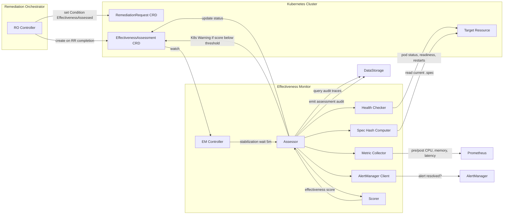
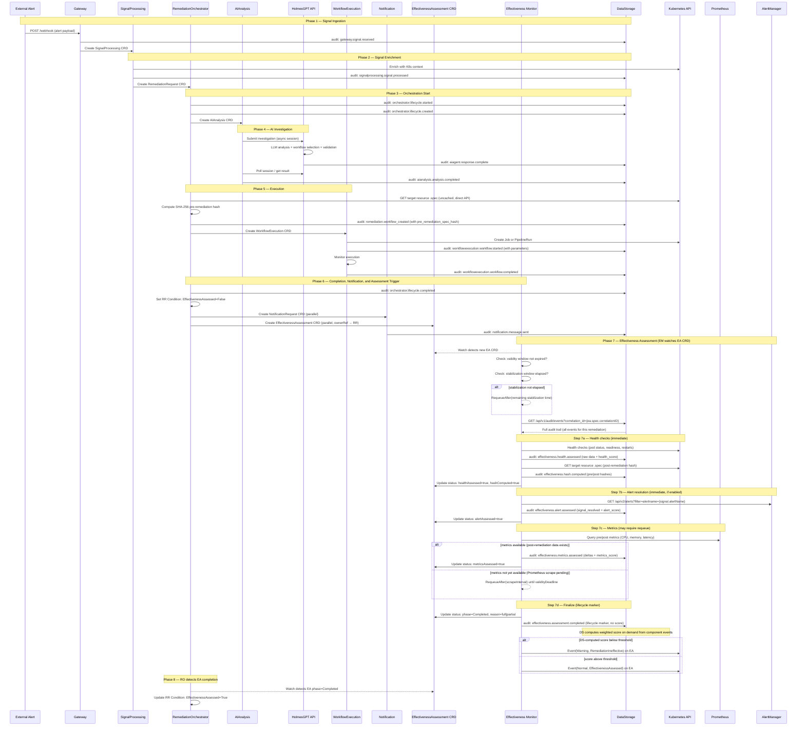
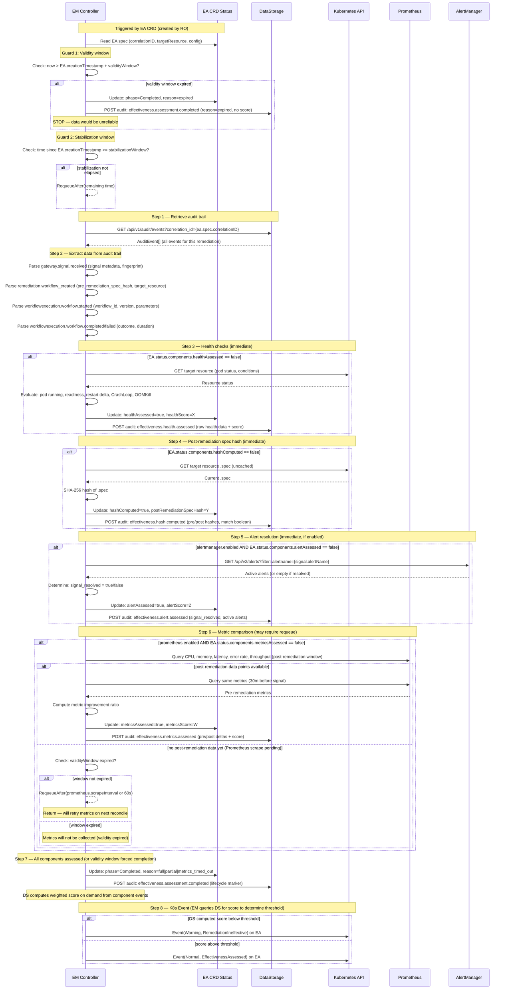
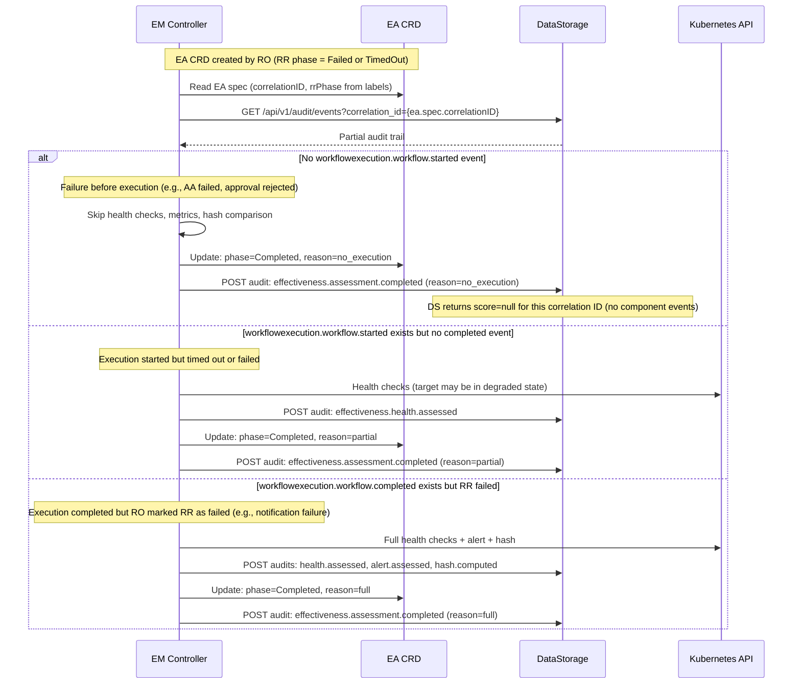
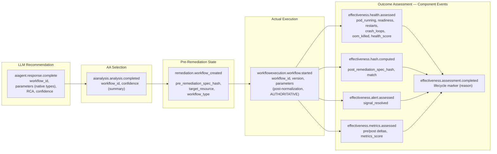
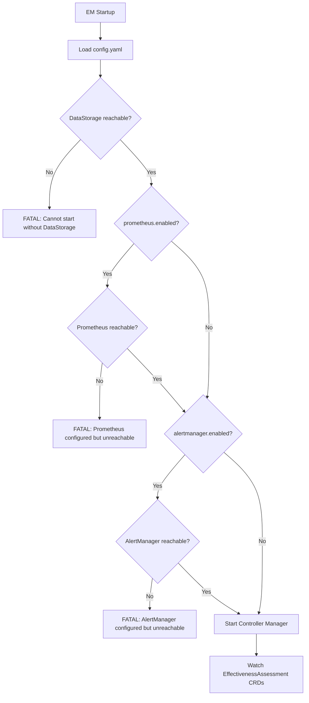

# ADR-EM-001: Effectiveness Monitor Service Integration

**Status**: PROPOSED
**Date**: 2026-02-09
**Decision Makers**: Architecture Team
**Confidence**: 90%

**Related Decisions**:
- [DD-017 v2.2](DD-017-effectiveness-monitor-v1.1-deferral.md) — EM Level 1/Level 2 scoping and design refinements
- [DD-EFFECTIVENESS-001](DD-EFFECTIVENESS-001-Hybrid-Automated-AI-Analysis.md) — Hybrid automated + AI analysis approach
- [DD-EFFECTIVENESS-003](DD-EFFECTIVENESS-003-RemediationRequest-Watch-Strategy.md) — Watch strategy (superseded by EA CRD trigger in v1.1 of this ADR)
- [DD-HAPI-016](DD-HAPI-016-remediation-history-context.md) — Remediation history context enrichment (depends on EM data)
- [DD-WORKFLOW-017](DD-WORKFLOW-017-workflow-lifecycle-component-interactions.md) — Workflow lifecycle component interactions (Phase 2: Discovery is where EM effectiveness data feeds back into LLM decisions)
- [DD-EVENT-001](../../services/crd-controllers/DD-EVENT-001-controller-event-registry.md) — Controller Kubernetes Event Registry
- DD-AUDIT-CORRELATION-002 — Correlation ID convention (`RR.Name`)

---

## Changelog

| Version | Date | Author | Changes |
|---------|------|--------|---------|
| 1.2 | 2026-02-09 | Architecture Team | EM emits individual component audit events (health, alert, metrics, hash); DS computes weighted score on demand. Assessment validity window (30m default) prevents stale data collection. Replaces single `effectiveness.assessment.completed` data event with component events + lifecycle marker. |
| 1.1 | 2026-02-09 | Architecture Team | RO-created EffectivenessAssessment CRD (follows AA/WFE/NR pattern). EM watches EA CRDs instead of RR CRDs. K8s Condition `EffectivenessAssessed` on RR. Async metrics evaluation with assessment deadline. Side-effect detection deferred to post-V1.0. Scoring formula updated (3 components: health 0.40, signal 0.35, metrics 0.25). DD-EFFECTIVENESS-003 RR-watch superseded by EA CRD trigger. |
| 1.0 | 2026-02-09 | Architecture Team | Initial ADR: EM service integration, sequence diagrams, data models, SOC2 chain |

---

## 1. Context and Problem Statement

Kubernaut's remediation pipeline flows through eight services — from signal ingestion through AI analysis to workflow execution and notification. After a remediation completes, **no service currently assesses whether it actually improved the situation**. Operators have no automated way to know if a remediation resolved the triggering alert, improved resource health, or inadvertently caused side effects.

More critically, this gap breaks the **remediation feedback loop**. During Phase 2 of the workflow lifecycle ([DD-WORKFLOW-017](DD-WORKFLOW-017-workflow-lifecycle-component-interactions.md)), HAPI enriches the LLM prompt with historical remediation context for the target resource ([DD-HAPI-016](DD-HAPI-016-remediation-history-context.md)) — previous RRs, what workflows were executed, and their outcomes. Without the EM, the "outcome" field is empty. The LLM has no way to know whether a previously applied workflow was effective, meaning it may recommend the same ineffective remediation repeatedly.

The Effectiveness Monitor (EM) fills this gap as the **final service in the remediation chain**, closing the feedback loop:

```
Signal → SP → RO → AA → HAPI/LLM → WFE → Notification
                                ↑                    ↓
                                │              EM Assessment
                                │                    ↓
                                └── DS (effectiveness data) ──→ HAPI prompt enrichment
                                    (remediation history with outcomes)
```

The EM watches for completed remediations, waits for the system to stabilize, then performs deterministic automated checks (health, metrics, alert resolution, spec hash comparison) to produce an effectiveness score. This score is stored as an audit event in DataStorage, where it becomes available to HAPI when building remediation history context for the same target resource.

### Scope

- **In scope**: Level 1 automated assessment (V1.0) — deterministic health checks, metric comparison, scoring, audit emission
- **Out of scope**: Level 2 AI-powered analysis (V1.1 — HolmesGPT PostExec), DD-HAPI-016 remediation history endpoint implementation (separate work item, joint effort with the Workflow Team per DD-WORKFLOW-017)

### Design Principles

1. **Audit-trace-only data source**: EM reads all remediation context from DataStorage audit events, never from the RemediationRequest CRD directly (DD-017 v2.1). The RR is transient and may be deleted or tampered.
2. **RO-managed lifecycle**: The Remediation Orchestrator creates the `EffectivenessAssessment` CRD — the same pattern used for AIAnalysis, WorkflowExecution, and NotificationRequest. The RO is the single lifecycle owner for all remediation sub-resources. As with the other CRDs, the spec is **immutable after creation** via CEL validation (`self == oldSelf`), enforced by the Kubernetes API server. This prevents tampering — any attempt to modify the EA spec after creation is rejected by the API server, guaranteeing the EM always operates on the original spec set by the RO.
3. **Deterministic outcomes**: No graceful degradation for Prometheus or AlertManager. If configured as enabled but unreachable, EM fails to start (DD-017 v2.1).
4. **Idempotent assessment**: The EA CRD spec is immutable (CEL: `self == oldSelf`), and the EA status tracks assessment progress. Duplicate EM reconciles check `status.phase` and `status.components` before proceeding. DS deduplicates component audit events by correlation ID + event type.
5. **EM collects, DS scores**: The EM is a **data collector** — it performs checks and emits individual component audit events (`effectiveness.health.assessed`, `effectiveness.alert.assessed`, `effectiveness.metrics.assessed`, `effectiveness.hash.computed`). **DS computes the weighted effectiveness score on demand** when queried, using whatever component events exist for a given correlation ID. This separation allows the scoring formula to evolve without re-emitting events.
6. **Assessment validity window**: Component data is only meaningful within a bounded time after remediation. If the EM cannot assess a component within the `validityWindow` (default 30m), it marks the EA as expired rather than collecting misleading data that may reflect system drift or subsequent remediations.
7. **SOC2 chain of custody**: Every hop in the remediation chain emits an audit event capturing what it decided/applied, enabling end-to-end traceability.
8. **Side-effect detection deferred**: V1.0 does not assess side effects (new alerts, collateral degradation). The complexity of determining causality and the dependency on multiple AlertManager scrapes makes this a post-V1.0 concern.

---

## 2. Integration Architecture Overview



The EM has six external integration points:

| Integration Point | Direction | Protocol | Purpose |
|-------------------|-----------|----------|---------|
| EffectivenessAssessment CRD | Watch (read + write) | K8s Watch API | Trigger assessment, track progress in status |
| DataStorage | Read + Write | HTTP REST | Query audit trail, emit assessment event |
| Kubernetes API | Read | K8s API | Health checks on target resource, post-remediation spec hash |
| Prometheus | Read | PromQL HTTP | Pre/post metric comparison |
| AlertManager | Read | HTTP REST | Alert resolution check |
| EffectivenessAssessment CRD | Write (event) | K8s Event API | Warning event when score below threshold |

> **v1.1 Note**: DD-EFFECTIVENESS-003 (Watch RemediationRequest, not WorkflowExecution) is superseded. The EM no longer watches RR CRDs. Instead, the **RO creates an EffectivenessAssessment CRD** when the RR reaches a terminal phase, following the same lifecycle pattern as AIAnalysis, WorkflowExecution, and NotificationRequest. The EM watches EA CRDs.

---

## 3. Full Remediation Lifecycle — Signal to Assessment (Happy Path)

This sequence diagram shows the complete flow from alert signal to effectiveness assessment. Every audit event emitted is annotated. Phase 7 shows the new RO-created EA CRD pattern.



---

## 4. EM Assessment Flow — Internal Logic

This diagram details the EM's internal processing. The EM is triggered by the EffectivenessAssessment CRD (created by RO), not by watching RemediationRequest CRDs directly.

The assessment is **asynchronous**: health checks and alert resolution are performed immediately after stabilization, but Prometheus metrics may require requeuing if the post-remediation scrape has not yet occurred. The EA CRD `status.components` tracks which checks have been completed, enabling restart recovery.

The EM emits **individual component audit events** as each check completes. DS computes the weighted effectiveness score on demand from these events. The EM also emits a lifecycle `effectiveness.assessment.completed` event when all components are done (or the validity window expires).



---

## 5. Failed and TimedOut Remediation Paths

Not every remediation reaches the happy path. The RO creates an EffectivenessAssessment CRD for **all terminal RR phases** (Completed, Failed, TimedOut). The EM must handle partial audit data.



---

## 6. Decision Diagram: Assessment Data Availability

This flowchart shows how the EM adapts its assessment based on the audit data available and the asynchronous nature of metric collection.

```mermaid
flowchart TD
    Start["EM Triggered by EA CRD
    (created by RO)"] --> CheckPhase{EA.status.phase?}
    CheckPhase -->|Completed| AlreadyDone[No-op: assessment already finalized]
    CheckPhase -->|Pending/Assessing| CheckValidity{"Validity window expired?
    (now > creation + validityWindow)"}
    CheckValidity -->|Yes| Expired["EA phase=Completed
    reason=expired, no score
    Emit assessment.completed (expired)"]
    CheckValidity -->|No| StabilizationWait{Stabilization window elapsed?}
    StabilizationWait -->|No| RequeueStab["RequeueAfter(remaining time)"]
    StabilizationWait -->|Yes| QueryDS[Query DS for Audit Trail]

    QueryDS --> HasWFEStarted{WFE started event exists?}

    HasWFEStarted -->|No| NoExecution["Emit assessment.completed
    reason=no_execution"]
    NoExecution --> UpdateEAComplete

    HasWFEStarted -->|Yes| HasPreHash{Pre-remediation hash exists?}
    HasPreHash -->|No| SkipHash[Skip hash comparison]
    HasPreHash -->|Yes| ComputePostHash[Compute post-remediation hash]
    ComputePostHash --> CompareHashes["Compare pre vs post hash
    Emit effectiveness.hash.computed"]
    CompareHashes --> HealthChecks

    SkipHash --> HealthChecks["K8s Health Checks
    (pod running, readiness, restarts,
    CrashLoop, OOMKill)"]
    HealthChecks --> EmitHealth["Emit effectiveness.health.assessed
    Update EA: healthAssessed=true"]
    EmitHealth --> CheckAMConfig

    CheckAMConfig{AlertManager enabled?}
    CheckAMConfig -->|Yes| QueryAM[Query AlertManager]
    QueryAM --> EmitAlert["Emit effectiveness.alert.assessed
    Update EA: alertAssessed=true"]
    EmitAlert --> CheckPromConfig
    CheckAMConfig -->|No| CheckPromConfig

    CheckPromConfig{Prometheus enabled?}
    CheckPromConfig -->|Yes| QueryProm[Query Prometheus for post-remediation metrics]
    QueryProm --> MetricsAvail{Post-remediation data available?}
    MetricsAvail -->|Yes| ComputeMetrics["Compute metric improvement ratio
    (no change = 0.0)"]
    ComputeMetrics --> EmitMetrics["Emit effectiveness.metrics.assessed
    Update EA: metricsAssessed=true"]
    EmitMetrics --> AllDone
    MetricsAvail -->|No| RequeueMetrics["RequeueAfter(scrapeInterval)
    until validityWindow expires"]
    CheckPromConfig -->|No| AllDone

    AllDone["All components assessed
    (or validity window expired for remaining)"]
    AllDone --> UpdateEAComplete["Update EA: phase=Completed
    reason=full|partial|metrics_timed_out"]
    UpdateEAComplete --> EmitLifecycle["Emit effectiveness.assessment.completed
    (lifecycle marker, no score)"]
    EmitLifecycle --> QueryScore["Query DS for computed score
    (DS aggregates component events)"]
    QueryScore --> CheckThreshold{Score below threshold?}
    CheckThreshold -->|Yes| EmitWarning[K8s Warning: RemediationIneffective]
    CheckThreshold -->|No| EmitNormal[K8s Normal: EffectivenessAssessed]
```



### Scoring Formula (V1.0) — Computed by DS On Demand

V1.0 uses three scored assessment components. Side-effect detection is deferred to post-V1.0. The **EM does not compute the final score** — it emits raw component data as individual audit events. **DS computes the weighted effectiveness score on demand** when queried, using whatever component events exist for the given correlation ID.

**DS on-demand computation:**

```
available = [c for c in components where c.event exists for this correlation_id]
total_weight = sum(c.base_weight for c in available)
score = sum(c.score * (c.base_weight / total_weight) for c in available)
# If no scored components exist → score = null
```

| Component Event | Score Field | Base Weight | Data Source |
|----------------|------------|-------------|-------------|
| `effectiveness.health.assessed` | `health_score` (0.0-1.0) | 0.40 | K8s API |
| `effectiveness.alert.assessed` | `alert_score` (0.0 or 1.0) | 0.35 | AlertManager |
| `effectiveness.metrics.assessed` | `metrics_score` (0.0-1.0) | 0.25 | Prometheus |
| `effectiveness.hash.computed` | N/A (metadata, not scored) | -- | K8s API |

Weight redistribution happens automatically by normalizing over available components:

| Available Components | health | signal_resolved | metrics |
|---------------------|--------|-----------------|---------|
| All three | 0.40 | 0.35 | 0.25 |
| Health + Alert only | 0.53 | 0.47 | -- |
| Health + Metrics only | 0.62 | -- | 0.38 |
| Health only | 1.00 | -- | -- |

#### Health Check Sub-Scoring

The `health_check_pass_rate` is a weighted composite of five checks, prioritizing running state and readiness:

| Check | Weight | Score |
|-------|--------|-------|
| `pod_running` | 0.30 | 1.0 if Running, 0.0 otherwise |
| `readiness_pass` | 0.30 | 1.0 if ready, 0.0 otherwise |
| `restart_delta` | 0.15 | 1.0 if delta ≤ 0, 0.5 if delta == 1, 0.0 if delta > 1 |
| `no_crash_loops` | 0.15 | 1.0 if no CrashLoopBackOff, 0.0 otherwise |
| `no_oom_killed` | 0.10 | 1.0 if no OOMKilled since remediation, 0.0 otherwise |

#### Metric Improvement Scoring

For each metric (CPU, memory, latency, error rate, throughput):
- **Improved**: Proportional score 0.0–1.0 based on improvement magnitude
- **No change**: 0.0 (no improvement demonstrated)
- **Degraded**: Negative proportional score (clamped to 0.0 for the component)

The `metric_improvement_ratio` is the average of individual metric scores.

---

## 7. SOC2 Chain of Custody

SOC2 Processing Integrity (CC7.1-CC7.3) requires a verifiable chain of custody from AI recommendation through actual execution to outcome assessment. Each audit event captures a specific hop in the chain.



### Parameter Traceability

The AA controller performs type normalization (`map[string]interface{}` to `map[string]string` via JSON marshaling) when extracting parameters from the HAPI response. This means:

| Event | Parameter Format | Example | Role |
|-------|-----------------|---------|------|
| `aiagent.response.complete` | Native JSON types | `{"memory_limit": 512}` | What the LLM **recommended** |
| `workflowexecution.workflow.started` | String (post-normalization) | `{"memory_limit": "512"}` | What was **actually applied** (authoritative) |

The EM reads parameters from `workflowexecution.workflow.started` because it assesses "did what was actually done work?" — not "did what was recommended work?"

---

## 8. Timing and Cooldown Alignment

The EM stabilization window and the RO's `RecentlyRemediatedCooldown` are deliberately aligned. Health checks and alert resolution are available within the cooldown window. Prometheus metrics may extend beyond it if the scrape interval is long.

```mermaid
gantt
    title Timing Alignment: WFE Completion to Assessment
    dateFormat X
    axisFormat %s

    section RO Cooldown
    RecentlyRemediatedCooldown (5m)     :active, cooldown, 0, 300

    section EM Assessment
    Stabilization Wait (5m)             :stab, 0, 300
    Health + Alert + Hash (immediate)   :assess1, 300, 310
    Metrics (may need scrape wait)      :assess2, 310, 1200
    Validity Window (30m)               :crit, validity, 0, 1800
    Validity Deadline                   :milestone, vdeadline, 1800, 1800

    section EA CRD Lifecycle
    RO creates EA CRD                   :milestone, create, 0, 0
    EM processes EA                     :active, emproc, 300, 1800
    EA phase=Completed                  :milestone, eadone, 1200, 1200
    RO updates RR Condition             :milestone, rrcond, 1201, 1201

    section Component Events in DS
    effectiveness.health.assessed       :milestone, healthev, 310, 310
    effectiveness.hash.computed         :milestone, hashev, 310, 310
    effectiveness.alert.assessed        :milestone, alertev, 310, 310
    effectiveness.metrics.assessed      :milestone, metev, 1200, 1200
    effectiveness.assessment.completed  :milestone, doneev, 1200, 1200

    section Next Remediation
    Cooldown Expires                    :milestone, expire, 300, 300
    HAPI Queries DS for Score           :crit, query, 301, 1800
```



### Critical Invariant

```
T+0:      WorkflowExecution completes → RO transitions RR to Completed
T+0:      RO creates EA CRD + NotificationRequest CRD (parallel)
T+0:      RO sets RR Condition: EffectivenessAssessed=False
T+0-5m:   RO cooldown active → new RRs for same target BLOCKED
T+5m:     EM stabilization elapsed → health, alert, hash assessed immediately
           → component events emitted to DS (health, alert, hash)
T+5m:     Cooldown expires → if signal fires again, new RR is allowed
T+5m+:    HAPI queries DS → DS computes partial score from available components
T+5m-30m: EM waits for Prometheus metrics (requeues on scrapeInterval)
           → effectiveness.metrics.assessed emitted when data arrives
           → DS recomputes score with all four components on next query
T+≤30m:   EM finalizes → effectiveness.assessment.completed (lifecycle marker)
           EA phase=Completed
T+30m:    Validity window expires — if EM hasn't started, EA marked as expired
```

**Coupling constraints**:

1. **Stabilization ≤ Cooldown**: The EM stabilization window MUST be ≤ the RO's `RecentlyRemediatedCooldown` (currently both 5m). This guarantees health and alert data are available before a new remediation can start.
2. **Validity ≥ Stabilization + longest scrape interval**: The validity window (default 30m) must accommodate the Prometheus scrape interval. For a 15m scrape interval: 5m stabilization + 15m wait + buffer = 30m.
3. **Validity is an upper bound, not a target**: Most assessments complete within 5-10m. The 30m window only matters when Prometheus is slow or the EM pod was disrupted.

> **Design choice**: Component events arrive incrementally. DS computes the score from whatever is available at query time — early queries get a partial score (health + alert), later queries get the full score (health + alert + metrics). This means HAPI may see different scores at different times for the same remediation, which is correct behavior: the score improves in accuracy as more data arrives.

---

## 9. Audit Event Data Models

### 9.1 `remediation.workflow_created` (emitted by RO)

This is a **new audit event** emitted by the Remediation Orchestrator when it creates a WorkflowExecution, just before the WFE CRD is written to the API server.

| Field | Type | Required | Description |
|-------|------|----------|-------------|
| `event_type` | string | Yes | `"remediation.workflow_created"` |
| `correlation_id` | string | Yes | `RR.Name` |
| `service` | string | Yes | `"remediationorchestrator"` |
| `target_resource` | string | Yes | `"Kind/Namespace/Name"` (e.g., `"Deployment/prod/my-app"`) |
| `pre_remediation_spec_hash` | string | Yes | SHA-256 of target resource `.spec` before remediation |
| `workflow_id` | string | Yes | Workflow catalog ID |
| `workflow_version` | string | Yes | Workflow version |
| `workflow_type` | string | Yes | Action type (e.g., `"ScaleUp"`, `"IncreaseMemory"`) |
| `remediation_request_name` | string | Yes | `RR.Name` |
| `remediation_request_namespace` | string | Yes | `RR.Namespace` |

### 9.2 EM Component Audit Events

The EM emits **individual audit events** as each assessment component completes. DS aggregates these by `correlation_id` and computes the weighted effectiveness score on demand.

All component events share these common fields:

| Field | Type | Required | Description |
|-------|------|----------|-------------|
| `correlation_id` | string | Yes | `RR.Name` (from `ea.spec.correlationID`) |
| `service` | string | Yes | `"effectivenessmonitor"` |
| `target_resource` | string | Yes | `"Kind/Namespace/Name"` |
| `ea_name` | string | Yes | Name of the EffectivenessAssessment CRD |
| `assessed_at` | string (RFC3339) | Yes | Timestamp when this component was assessed |

#### 9.2.1 `effectiveness.health.assessed`

Emitted immediately after stabilization window.

| Field | Type | Description |
|-------|------|-------------|
| `event_type` | string | `"effectiveness.health.assessed"` |
| `pod_running` | boolean | Target pod is in Running phase |
| `readiness_pass` | boolean | Readiness probe passing |
| `restart_delta` | integer | Restart count: after - before remediation |
| `crash_loops` | boolean | CrashLoopBackOff detected |
| `oom_killed` | boolean | OOMKilled since remediation |
| `health_score` | float | Weighted composite score (0.0-1.0), used by DS for scoring |

#### 9.2.2 `effectiveness.hash.computed`

Emitted immediately after stabilization window. Not scored — metadata for configuration regression detection.

| Field | Type | Description |
|-------|------|-------------|
| `event_type` | string | `"effectiveness.hash.computed"` |
| `pre_remediation_spec_hash` | string | SHA-256 from `remediation.workflow_created` event (or empty if unavailable) |
| `post_remediation_spec_hash` | string | SHA-256 of current target resource `.spec` |
| `spec_changed` | boolean | `true` if pre != post (confirms workflow modified the resource) |

#### 9.2.3 `effectiveness.alert.assessed`

Emitted immediately after stabilization window (when AlertManager is enabled).

| Field | Type | Description |
|-------|------|-------------|
| `event_type` | string | `"effectiveness.alert.assessed"` |
| `signal_resolved` | boolean | `true` if triggering alert is no longer active |
| `alert_name` | string | The alert name queried |
| `active_alerts_count` | integer | Number of matching active alerts at assessment time |
| `alert_score` | float | 1.0 if resolved, 0.0 if still active; used by DS for scoring |

#### 9.2.4 `effectiveness.metrics.assessed`

Emitted when Prometheus post-remediation data becomes available (may be delayed by scrape interval).

| Field | Type | Description |
|-------|------|-------------|
| `event_type` | string | `"effectiveness.metrics.assessed"` |
| `cpu_before` | float | Average CPU utilization 30m before signal |
| `cpu_after` | float | Average CPU during stabilization window |
| `memory_before` | float | Average memory utilization 30m before signal |
| `memory_after` | float | Average memory during stabilization window |
| `latency_p95_before_ms` | float | p95 latency before |
| `latency_p95_after_ms` | float | p95 latency after |
| `error_rate_before` | float | Error rate before |
| `error_rate_after` | float | Error rate after |
| `throughput_before_rps` | float | Request throughput before |
| `throughput_after_rps` | float | Request throughput after |
| `metrics_score` | float | Average improvement ratio (0.0-1.0), used by DS for scoring |

#### 9.2.5 `effectiveness.assessment.completed` (lifecycle marker)

Emitted when the EM finishes processing the EA CRD (all components done, validity expired, or no execution). This is a **lifecycle marker**, not a data carrier — the scored data lives in the component events above.

| Field | Type | Description |
|-------|------|-------------|
| `event_type` | string | `"effectiveness.assessment.completed"` |
| `correlation_id` | string | `RR.Name` |
| `service` | string | `"effectivenessmonitor"` |
| `ea_name` | string | EA CRD name |
| `assessment_reason` | string | `"full"`, `"partial"`, `"no_execution"`, `"metrics_timed_out"`, `"expired"` |
| `components_assessed` | array[string] | List of component event types emitted (e.g., `["health", "alert", "hash"]`) |
| `completed_at` | string (RFC3339) | When the EA reached Completed phase |

### 9.3 `workflowexecution.workflow.started` Enhancement

The existing `WorkflowExecutionAuditPayload` requires an additional field:

| New Field | Type | Description |
|-----------|------|-------------|
| `parameters` | map[string]string | Actual parameters applied to the Job/PipelineRun (SOC2 authoritative) |

### 9.4 EffectivenessAssessment CRD Definition

This is a **new CRD** created by the Remediation Orchestrator when an RR reaches a terminal phase. The EM controller watches and processes these CRDs.

**Immutable spec (anti-tampering)**: All spec fields are deterministically derived from the RR and the EM config at creation time. The CRD schema enforces spec immutability via CEL validation:

```go
// +kubebuilder:validation:XValidation:rule="self == oldSelf",message="spec is immutable after creation (ADR-001)"
```

The Kubernetes API server rejects any update that attempts to modify the spec after creation. This is the same pattern used by AIAnalysis, WorkflowExecution, NotificationRequest, and RemediationRequest CRDs. The EM can therefore trust the EA spec as authoritative — it was set by the RO at creation and cannot be tampered with.

```yaml
apiVersion: effectiveness.kubernaut.io/v1alpha1
kind: EffectivenessAssessment
metadata:
  name: ea-{rr.name}
  namespace: kubernaut-system
  ownerReferences:
    - apiVersion: remediation.kubernaut.io/v1alpha1
      kind: RemediationRequest
      name: {rr.name}
      uid: {rr.uid}
      controller: true
      blockOwnerDeletion: false  # RR deletion GC's EA — audit events in DS survive
  labels:
    kubernaut.ai/correlation-id: "{rr.name}"
    kubernaut.ai/rr-phase: "{rr.status.overallPhase}"  # Completed|Failed|TimedOut
spec:
  correlationID: "{rr.name}"
  targetResource:
    kind: Deployment
    name: my-app
    namespace: prod
  config:
    stabilizationWindow: 5m
    validityDeadline: "2026-02-09T15:30:00Z"     # creationTimestamp + validityWindow (30m default)
    scoringThreshold: 0.5
    prometheusEnabled: true
    alertManagerEnabled: true
status:
  phase: Assessing   # Pending → Assessing → Completed → Failed
  components:
    healthAssessed: false
    healthScore: null
    hashComputed: false
    postRemediationSpecHash: ""
    alertAssessed: false
    alertScore: null
    metricsAssessed: false
    metricsScore: null
  assessmentReason: ""        # "full", "partial", "no_execution", "metrics_timed_out", "expired"
  completedAt: null
  message: ""
```

**EA CRD Lifecycle:**

| Phase | Meaning |
|-------|---------|
| `Pending` | EA created by RO, EM has not yet reconciled it |
| `Assessing` | EM is actively processing (stabilization wait or component checks in progress) |
| `Completed` | Assessment finished — score computed, audit event emitted |
| `Failed` | Assessment could not be performed (e.g., DS unreachable after all retries, target namespace deleted) |

**RR Condition set by RO:**

When RO creates the EA CRD:
```yaml
conditions:
  - type: EffectivenessAssessed
    status: "False"
    reason: AssessmentInProgress
    message: "EffectivenessAssessment ea-{rr.name} created"
    lastTransitionTime: "2026-02-09T15:00:00Z"
```

When RO detects EA phase=Completed:
```yaml
conditions:
  - type: EffectivenessAssessed
    status: "True"
    reason: AssessmentCompleted
    message: "EffectivenessAssessment ea-{rr.name} completed (reason: full)"
    lastTransitionTime: "2026-02-09T15:10:00Z"
```

When RO detects EA phase=Completed with reason=expired:
```yaml
conditions:
  - type: EffectivenessAssessed
    status: "True"
    reason: AssessmentExpired
    message: "EffectivenessAssessment ea-{rr.name} expired — validity window exceeded"
    lastTransitionTime: "2026-02-09T15:30:00Z"
```

---

## 10. Configuration Schema

```yaml
# cmd/effectivenessmonitor/config.yaml
datastorage:
  url: "http://datastorage:8080"        # Required: DataStorage service URL
  timeout: 5s                            # HTTP request timeout

prometheus:
  enabled: true                          # Enable/disable metric comparison
  url: "http://prometheus:9090"          # Required when enabled
  timeout: 10s                           # PromQL query timeout
  preWindowDuration: 30m                 # Metric window before the triggering signal
  scrapeInterval: 60s                    # Expected Prometheus scrape interval (for requeue timing)

alertmanager:
  enabled: true                          # Enable/disable alert resolution check
  url: "http://alertmanager:9093"        # Required when enabled
  timeout: 5s                            # HTTP request timeout

assessment:
  stabilizationWindow: 5m               # Wait time after EA creation before assessment starts
  validityWindow: 30m                   # Hard upper bound: assessment data is only meaningful within this window
  scoringThreshold: 0.5                  # Score below which Warning event is emitted (DS computes score, EM queries it)
  maxConcurrentAssessments: 10           # controller-runtime MaxConcurrentReconciles
```

The `validityWindow` is written into each EA CRD spec and enforced by the EM:
```
validityDeadline = EA.creationTimestamp + validityWindow
```

If `now > validityDeadline`, the EM marks the EA as `expired` without collecting data — the system state may no longer reflect this remediation (the cooldown has long expired, new remediations may have run, workloads have drifted).

> **Why 30m default?** The RO cooldown is 5m. After that, new remediations can target the same resource. A 30m window provides enough margin for Prometheus scrape intervals up to 15m (stabilization 5m + scrape wait 15m + assessment 10m = 30m) while still bounding the data freshness.

### Startup Behavior



No graceful degradation at runtime. If a dependency becomes unreachable after startup, the assessment fails and is retried on the next reconcile (standard controller-runtime requeue with backoff).

---

## 11. Error Handling and Edge Cases

| Edge Case | Behavior | Rationale |
|-----------|----------|-----------|
| **RR deleted before EM assessment** | EA CRD is garbage-collected via ownerReference. Any component audit events already emitted to DS survive (immutable). Assessment is abandoned — this is acceptable; the operator explicitly deleted the RR. | ownerReference GC is intentional. DS retains whatever was emitted. |
| **RR deleted after EA reaches Completed** | No impact. The audit event has already been emitted to DS. The EA CRD is GC'd, but all data is in DS. | Assessment was already finalized. |
| **DS unavailable during assessment** | Reconcile returns error. Controller-runtime requeues with exponential backoff (5m, 10m, 20m, 30m max). | Transient failure. Audit data is immutable; assessment will succeed once DS is back. |
| **Target resource deleted after remediation** | Health checks fail. Score reflects unhealthy state. `health_checks.pod_running = false`. | EM reports what it observes. Deletion is a valid outcome that should be scored. |
| **Prometheus metrics not yet available** | EM requeues the EA reconcile after `scrapeInterval` (default 60s). If `validityDeadline` is reached without metrics, assessment completes without them. DS redistributes Prometheus weight to available components when computing the score. | Async metrics collection. Prometheus scrape intervals may be longer than the stabilization window. |
| **Prometheus returns partial data** | Assessment uses available metrics. Missing metric fields are omitted from `metric_deltas`. | Partial Prometheus data is still valuable for scoring. |
| **Multiple RRs for same target overlapping** | Each RR has its own EA CRD, assessed independently by correlation_id. EM does not deduplicate across RRs. | Each RR is a separate remediation attempt with its own audit trail and EA CRD. |
| **EM pod restart during assessment** | On restart, controller-runtime re-lists all EA CRDs. EA CRDs with `phase != Completed` trigger reconcile. The `status.components` fields indicate which checks have already been performed — EM skips completed components and continues. Stabilization time is computed from `EA.creationTimestamp`. | EA CRD status provides restart recovery. No state is lost. |
| **Duplicate reconciles for same EA** | EM checks `EA.status.phase`. If already `Completed`, reconcile is a no-op. EM checks `status.components.*Assessed` flags before each check — already-assessed components are skipped. DS deduplicates component events by correlation_id + event_type. | Idempotency via EA CRD status (primary) and DS dedup (secondary). |
| **No `remediation.workflow_created` event** | Skip hash comparison. Assessment proceeds with health checks, metrics, and alert resolution only. | Pre-remediation hash is a new event; older remediations won't have it. |
| **WFE completed but RO marked RR as Failed** | RO still creates EA CRD (for all terminal phases). EM performs full assessment. The WFE did execute; the failure may be in a subsequent phase (e.g., notification). | EM assesses execution effectiveness, independent of the RR's overall outcome. |
| **RO fails to create EA CRD** | Standard controller-runtime error handling. RO requeues the RR reconcile. EA creation is part of the RR terminal-phase handling. | Same pattern as NR creation failure. |
| **Validity window expired with partial data** | EM marks EA as Completed with `assessment_reason` = `"metrics_timed_out"` or `"partial"`. Component events already emitted remain in DS. DS computes score from available components with redistributed weights. | Validity window ensures assessments don't hang and data remains fresh. |
| **Validity window expired with NO data** | EM marks EA as Completed with `assessment_reason` = `"expired"`. No component events emitted. DS returns `score = null` for this correlation ID. | No misleading score — better to have no data than wrong data from a stale assessment. |
| **EM delayed beyond validity (e.g., DS outage)** | On first reconcile after recovery, EM checks validity window. If expired, marks EA as `expired` without collecting any data. | Prevents collecting metrics that reflect a different system state (drift, new remediations, etc.). |

---

## 12. EM Reads from Audit Trail — Event Extraction Map

When the EM queries DataStorage for the audit trail of a given `correlation_id` (from `ea.spec.correlationID`, which is the `RR.Name`), it extracts specific fields from specific event types:

| Audit Event Type | Extracted Fields | Used For |
|------------------|-----------------|----------|
| `gateway.signal.received` | `alertName`, `fingerprint`, `signalType`, `labels` | Alert identity for AlertManager query, signal metadata |
| `remediation.workflow_created` | `pre_remediation_spec_hash`, `target_resource`, `workflow_type` | Pre/post hash comparison, target identification |
| `workflowexecution.workflow.started` | `workflow_id`, `workflow_version`, `parameters`, `container_image` | What was actually executed (SOC2 authoritative) |
| `workflowexecution.workflow.completed` | `completed_at`, `duration` | Execution outcome, timing for metric windows |
| `workflowexecution.workflow.failed` | `failure_reason`, `failure_message` | Failure context for partial assessment |
| `orchestrator.lifecycle.completed` | `completed_at` | RR completion time (stabilization timer start) |
| `orchestrator.lifecycle.failed` | `failure_reason`, `failure_phase` | Which phase failed |

Events NOT read by EM (informational only, not needed for assessment):
- `signalprocessing.*` — signal enrichment details
- `aianalysis.*` — AI investigation details (Level 2 scope)
- `aiagent.*` — LLM reasoning (Level 2 scope)
- `notification.*` — delivery status

Events WRITTEN by EM (consumed by DS for scoring):
- `effectiveness.health.assessed` — health check results + `health_score`
- `effectiveness.hash.computed` — pre/post spec hash comparison (not scored)
- `effectiveness.alert.assessed` — alert resolution + `alert_score`
- `effectiveness.metrics.assessed` — metric deltas + `metrics_score`
- `effectiveness.assessment.completed` — lifecycle marker (no score)

---

## 13. Consequences

### Positive

- **Complete audit chain**: Every remediation has a traceable path from signal to outcome assessment, satisfying SOC2 Processing Integrity requirements.
- **Consistent lifecycle pattern**: RO creates the EA CRD, following the same pattern as AIAnalysis, WorkflowExecution, and NotificationRequest. No architectural divergence.
- **Observable via `kubectl`**: `kubectl get effectivenessassessments` provides real-time visibility into assessment progress, including which components have been assessed and their scores.
- **Restart-resilient**: EA CRD `status.components` tracks assessment progress. On EM restart, incomplete assessments resume from where they left off.
- **Deterministic outcomes**: No graceful degradation means operators know exactly what capabilities are active. Scoring is reproducible.
- **Immutable data source**: Reading from audit traces instead of CRDs makes the EM immune to CRD deletion, tampering, and lifecycle changes.
- **Cooldown alignment**: The 5-min stabilization/cooldown invariant guarantees health and alert effectiveness data is available before the next remediation for the same target.
- **Async metrics with incremental scoring**: EM does not block on slow Prometheus scrapes. Health and alert data are available immediately; metrics follow asynchronously. DS computes progressively more accurate scores as component events arrive.
- **Evolvable scoring**: The scoring formula lives in DS, not EM. Formula changes (weights, new components) don't require re-emitting events or redeploying EM.
- **Minimal coupling**: EM connects to DS (already deployed), K8s API (always available), and optionally Prometheus/AlertManager. No new infrastructure required.
- **DD-HAPI-016 enablement**: Once EM is operational, DS has the data needed for the remediation history context endpoint.
- **Closes the remediation feedback loop**: The LLM can now learn from past outcomes. When DD-WORKFLOW-017 Phase 2 (Discovery) runs for a repeat signal on the same target, HAPI can include "workflow X was applied with score 0.3 — try a different approach" in the prompt context. This prevents the LLM from recommending the same ineffective remediation repeatedly.
- **Validity window prevents stale data**: The 30m validity window guarantees assessment data is fresh and reflects this remediation, not subsequent system drift.

### Negative

- **New CRD + new service**: Adds operational complexity (CRD installation, deployment, monitoring, RBAC).
- **Assessment latency**: 5-min stabilization window + up to 25-min metric wait means full effectiveness data may take up to 30 minutes. Partial scores (health + alert) are available within 5 minutes.
- **DS scoring complexity**: DS must implement on-demand score computation with weight redistribution. This is lightweight (3 lines of logic) but adds a new query capability to DS.
- **Prometheus/AlertManager dependency**: When enabled, these must be available at startup. Clusters without monitoring infrastructure must explicitly disable these capabilities.
- **Formula-based scoring limitations**: The weighted formula may not capture nuanced scenarios (e.g., "CPU dropped 3% but crossed below alert threshold" vs. "CPU dropped 3% but still critical"). Level 2 AI analysis in V1.1 addresses this.
- **No side-effect detection in V1.0**: The scoring formula does not account for collateral damage. A remediation could score 1.0 while causing issues in other workloads. Post-V1.0 scope.
- **Audit trail completeness**: If a service fails to emit its audit event, the EM's assessment is degraded. This is mitigated by ADR-032 (mandatory audit emission) and the `assessment_reason` field indicating partial data.

---

## 14. Implementation Prerequisites

Before EM implementation can begin, these changes to existing services are required:

| Prerequisite | Service | Description | Issue |
|-------------|---------|-------------|-------|
| `EffectivenessAssessment` CRD definition | Platform | Define CRD schema (`effectiveness.kubernaut.io/v1alpha1`), install in cluster. | [#82](https://github.com/jordigilh/kubernaut/issues/82) |
| RO creates EA CRD on terminal phase | RO | Create EA CRD with ownerRef to RR when RR reaches Completed/Failed/TimedOut. Set RR Condition `EffectivenessAssessed=False`. Watch EA CRDs and update RR Condition when EA completes. | [#82](https://github.com/jordigilh/kubernaut/issues/82) |
| `remediation.workflow_created` audit event | RO | Emit new event with `pre_remediation_spec_hash` before creating WFE CRD. RO must query API server directly (uncached) for target resource spec. | [#82](https://github.com/jordigilh/kubernaut/issues/82) |
| Add `parameters` to WFE audit | WFE | Include `map[string]string` parameters in `workflowexecution.workflow.started` payload. | [#82](https://github.com/jordigilh/kubernaut/issues/82) |
| DS OpenAPI schema updates | DS | Add `remediation.workflow_created` and EM component event types (`effectiveness.health.assessed`, `effectiveness.alert.assessed`, `effectiveness.metrics.assessed`, `effectiveness.hash.computed`, `effectiveness.assessment.completed`) to discriminated union. Add `parameters` field to `WorkflowExecutionAuditPayload`. | [#82](https://github.com/jordigilh/kubernaut/issues/82) |
| DS on-demand score computation | DS | Implement effectiveness score computation by aggregating component events for a given correlation ID, applying base weights (health 0.40, alert 0.35, metrics 0.25) with proportional redistribution for missing components. | [#82](https://github.com/jordigilh/kubernaut/issues/82) |
| RR Condition infrastructure | RO | Add `EffectivenessAssessed` condition type to RR status. Ensure `Conditions` is in the `Always mutable` tier (already the case per DD-017 v2.1 CEL rules). | [#82](https://github.com/jordigilh/kubernaut/issues/82) |

---

## Review Checklist

Before approving this ADR for TDD implementation:

- [ ] All sequence diagrams accurately reflect the current service interactions
- [ ] The EA CRD lifecycle (Pending → Assessing → Completed → Failed) is complete
- [ ] The RO-creates-EA pattern is consistent with AA/WFE/NR patterns
- [ ] The audit event data models contain all fields needed by DD-HAPI-016
- [ ] The scoring formula and weight redistribution logic is correct (V1.0: 3 scored components, no side-effects)
- [ ] DS on-demand score computation is well-defined (base weights, redistribution)
- [ ] The timing invariant (stabilization <= cooldown) is correctly documented
- [ ] Validity window (30m) prevents stale data collection
- [ ] Component audit event schemas contain all fields DS needs for scoring
- [ ] Error handling covers all realistic failure scenarios including EA CRD GC and validity expiry
- [ ] The SOC2 chain of custody is complete (no gaps between hops)
- [ ] Configuration schema covers all operational knobs needed (including `maxWaitForMetrics`, `scrapeInterval`)
- [ ] Prerequisites are complete and tracked
- [ ] DD-EFFECTIVENESS-003 supersession is documented

---

**Status**: PROPOSED (v1.2) -- Pending architecture review before TDD implementation
**Next**: Upon approval, proceed with TDD implementation per [Issue #82](https://github.com/jordigilh/kubernaut/issues/82)
