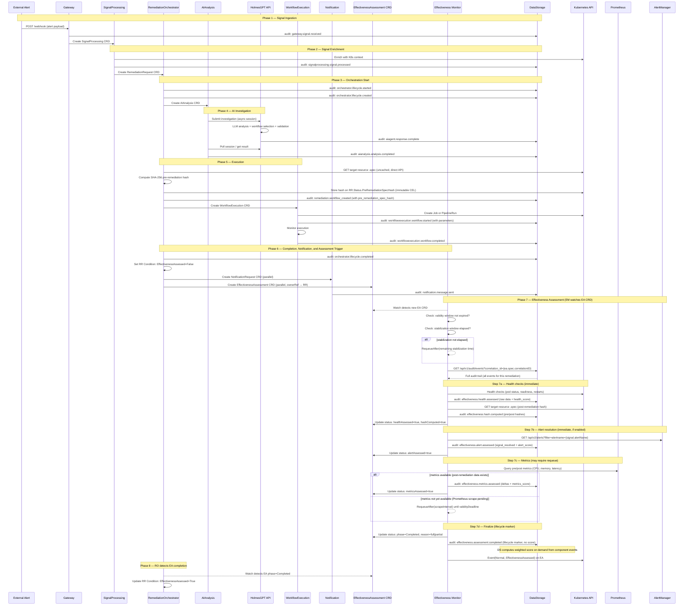
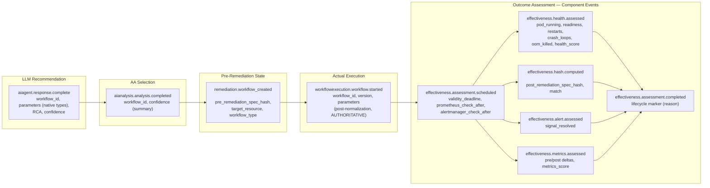

# ADR-EM-001: Effectiveness Monitor Service Integration

**Status**: PROPOSED
**Date**: 2026-02-09
**Decision Makers**: Architecture Team
**Confidence**: 90%

**Related Decisions**:
- [DD-017 v2.2](DD-017-effectiveness-monitor-v1.1-deferral.md) — EM Level 1/Level 2 scoping and design refinements
- [DD-EFFECTIVENESS-001](DD-EFFECTIVENESS-001-Hybrid-Automated-AI-Analysis.md) — Hybrid automated + AI analysis approach
- ~~[DD-EFFECTIVENESS-003](DD-EFFECTIVENESS-003-RemediationRequest-Watch-Strategy.md)~~ — Watch strategy (**fully superseded** by EA CRD trigger in v1.1; EM watches EA CRDs, not RR CRDs)
- [DD-EM-002 v1.1](DD-EM-002-canonical-spec-hash.md) — Canonical spec hashing and Spec Drift Guard
- [DD-CRD-002-EA](DD-CRD-002-effectivenessassessment-conditions.md) — Kubernetes Conditions for EffectivenessAssessment CRD
- [DD-HAPI-016](DD-HAPI-016-remediation-history-context.md) — Remediation history context enrichment (depends on EM data)
- [DD-WORKFLOW-017](DD-WORKFLOW-017-workflow-lifecycle-component-interactions.md) — Workflow lifecycle component interactions (Phase 2: Discovery is where EM effectiveness data feeds back into LLM decisions)
- [DD-EVENT-001](../../services/crd-controllers/DD-EVENT-001-controller-event-registry.md) — Controller Kubernetes Event Registry
- DD-AUDIT-CORRELATION-002 — Correlation ID convention (`RR.Name`)
- [DD-EM-002](DD-EM-002-canonical-spec-hash.md) — Canonical spec hash algorithm (shared between RO and EM for pre/post comparison)

---

## Changelog

| Version | Date | Author | Changes |
|---------|------|--------|---------|
| 2.1 | 2026-02-15 | Architecture Team | **Two-phase hash model**: Phase 1 (hash component check): capture current spec as `PostRemediationSpecHash`, compare `pre != post` (workflow changed spec?), set `CurrentSpecHash = PostRemediationSpecHash` as baseline. Phase 2 (drift guard, subsequent reconciles): re-capture current hash, compare `post != current` (spec drift?), abort if drifted. Fixes single-pass completion bug where `CurrentSpecHash` was never set. |
| 2.0 | 2026-02-15 | Architecture Team | **Pre-remediation hash on CRD path**: RO now computes `PreRemediationSpecHash` before WFE creation and stores it on `RR.Status.PreRemediationSpecHash` (immutable via CEL). EA creator copies it to `EA.Spec.PreRemediationSpecHash`. EM reads from EA spec with DataStorage fallback for backward compatibility. Eliminates EM→DS round-trip for hash comparison. Principle 1 updated. |
| 1.9 | 2026-02-14 | Architecture Team | **Batch 2 implementation**: `remediation.workflow_created` wired at both WFE creation sites (GAP-RO-1). `workflow_type` (DD-WORKFLOW-016 action_type) added end-to-end HAPI→AA→RO (GAP-RO-4). `blockOwnerDeletion` overridden to `false`. `EACreated` K8s event emitted. `no_execution` guard implemented in EM reconciler (Section 5). StabilizationWindow default corrected to 5m. Section 13.1 gap table updated with resolution status. |
| 1.8 | 2026-02-14 | Architecture Team | **Cross-service audit integration**: Added `blockOwnerDeletion` mismatch and `EventReasonEffectivenessAssessmentCreated` never emitted to Section 13.1 RO prerequisite gaps (from HAPI team audit). |
| 1.7 | 2026-02-14 | Architecture Team | **Post-implementation audit**: Health scoring updated from weighted sub-check formula to decision-tree algorithm (reflects `pkg/effectivenessmonitor/health/health.go`). Metrics Phase B (memory, latency, error rate) marked as implemented (was incorrectly listed as deferred). `spec_changed` renamed to `hash_match` (inverse semantics, matches OpenAPI). Added `total_replicas`, `ready_replicas`, `pending_count` to health payload. Added `resolution_time_seconds` to alert payload. Annotated v1.0 gaps: `alert_name`, `throughput_*`, `components_assessed`, `completed_at` not yet in OpenAPI payloads. Annotated `no_execution` and `metrics_timed_out` reconciler paths as not yet implemented. |
| 1.6 | 2026-02-14 | Architecture Team | **Typed audit sub-objects**: Principle 5 updated — EM component events now carry typed sub-objects (`health_checks`, `metric_deltas`, `alert_resolution`) alongside the human-readable `details` string. Enables DS/HAPI to extract structured assessment data without string parsing. Health assessor enhanced with CrashLoopBackOff and OOMKilled detection. OpenAPI spec updated with typed sub-object schemas. Coordinated with HAPI team via DD-HAPI-016 v1.1 and issue #82. |
| 1.5 | 2026-02-13 | Architecture Team | Clarified Principle 1: EM queries DS during reconciliation for audit context (pre-hash, signal metadata), not via polling. EM is a CRD controller watching EA CRDs, not a stateless polling service. Added DD-EM-002 (canonical spec hash algorithm) to related decisions. Removed stale DD-EFFECTIVENESS-003 reference (fully superseded by EA CRD trigger since v1.1). |
| 1.4 | 2026-02-13 | Architecture Team | EA spec simplified: EAConfig now only contains `stabilizationWindow`. Removed `scoringThreshold`, `prometheusEnabled`, `alertManagerEnabled` from EA spec. EM reads `prometheusEnabled` and `alertManagerEnabled` from its own config (EMConfig.External). ScoringThreshold removed entirely — EM no longer computes average score or compares against threshold. EM always emits Normal `EffectivenessAssessed` event on completion; `RemediationIneffective` K8s event removed. DS computes weighted effectiveness score on demand. |
| 1.3 | 2026-02-12 | Architecture Team | ValidityDeadline moved from EA spec to status (EM computes on first reconciliation). Added PrometheusCheckAfter and AlertManagerCheckAfter status fields. New `effectiveness.assessment.scheduled` audit event emitted on first reconciliation capturing all derived timing. Follows K8s spec/status convention: RO sets desired state (StabilizationWindow in spec), EM computes derived state (timing fields in status). |
| 1.2 | 2026-02-09 | Architecture Team | EM emits individual component audit events (health, alert, metrics, hash); DS computes weighted score on demand. Assessment validity window (30m default) prevents stale data collection. Replaces single `effectiveness.assessment.completed` data event with component events + lifecycle marker. |
| 1.1 | 2026-02-09 | Architecture Team | RO-created EffectivenessAssessment CRD (follows AA/WFE/NR pattern). EM watches EA CRDs instead of RR CRDs. K8s Condition `EffectivenessAssessed` on RR. Async metrics evaluation with assessment deadline. Side-effect detection deferred to post-V1.0. Scoring formula updated (3 components: health 0.40, signal 0.35, metrics 0.25). DD-EFFECTIVENESS-003 RR-watch superseded by EA CRD trigger. |
| 1.0 | 2026-02-09 | Architecture Team | Initial ADR: EM service integration, sequence diagrams, data models, SOC2 chain |

---

## 1. Context and Problem Statement

Kubernaut's remediation pipeline flows through eight services — from signal ingestion through AI analysis to workflow execution and notification. After a remediation completes, **no service currently assesses whether it actually improved the situation**. Operators have no automated way to know if a remediation resolved the triggering alert, improved resource health, or inadvertently caused side effects.

More critically, this gap breaks the **remediation feedback loop**. During Phase 2 of the workflow lifecycle ([DD-WORKFLOW-017](DD-WORKFLOW-017-workflow-lifecycle-component-interactions.md)), HAPI enriches the LLM prompt with historical remediation context for the target resource ([DD-HAPI-016](DD-HAPI-016-remediation-history-context.md)) — previous RRs, what workflows were executed, and their outcomes. Without the EM, the "outcome" field is empty. The LLM has no way to know whether a previously applied workflow was effective, meaning it may recommend the same ineffective remediation repeatedly.

The Effectiveness Monitor (EM) fills this gap as the **final service in the remediation chain**, closing the feedback loop:

```
Signal → SP → RO → AA → HAPI/LLM → WFE → Notification
                                ↑                    ↓
                                │              EM Assessment
                                │                    ↓
                                └── DS (effectiveness data) ──→ HAPI prompt enrichment
                                    (remediation history with outcomes)
```

The EM watches for completed remediations, waits for the system to stabilize, then performs deterministic automated checks (health, metrics, alert resolution, spec hash comparison) to produce an effectiveness score. This score is stored as an audit event in DataStorage, where it becomes available to HAPI when building remediation history context for the same target resource.

### Scope

- **In scope**: Level 1 automated assessment (V1.0) — deterministic health checks, metric comparison, scoring, audit emission
- **Out of scope**: Level 2 AI-powered analysis (V1.1 — HolmesGPT PostExec), DD-HAPI-016 remediation history endpoint implementation (separate work item, joint effort with the Workflow Team per DD-WORKFLOW-017)

### Design Principles

1. **CRD-first data source with audit fallback**: The EM reads assessment context primarily from the `EffectivenessAssessment` CRD spec (set immutably by the RO at creation time). **Update (v2.0)**: The pre-remediation spec hash is now propagated via the CRD path: `RR.Status.PreRemediationSpecHash` → `EA.Spec.PreRemediationSpecHash`. The EM reads it directly from `ea.Spec.PreRemediationSpecHash`, falling back to a DataStorage query of the `remediation.workflow_created` audit event only for backward compatibility with EAs created before this change. This eliminates the EM→DS round-trip for hash comparison in the common case. **Clarification (v1.5)**: The EM is a Kubernetes CRD controller that watches `EffectivenessAssessment` CRDs (not a stateless service that polls for RR completions). The EM's reconciliation is triggered by EA CRD creation/updates via the standard controller-runtime watch mechanism.
2. **RO-managed lifecycle**: The Remediation Orchestrator creates the `EffectivenessAssessment` CRD — the same pattern used for AIAnalysis, WorkflowExecution, and NotificationRequest. The RO is the single lifecycle owner for all remediation sub-resources. The EA spec contains only `stabilizationWindow` (the desired wait time before assessment); the RO sets this when creating the EA. As with the other CRDs, the spec is **immutable after creation** via CEL validation (`self == oldSelf`), enforced by the Kubernetes API server. This prevents tampering — any attempt to modify the EA spec after creation is rejected by the API server, guaranteeing the EM always operates on the original spec set by the RO.
3. **Deterministic outcomes**: No graceful degradation for Prometheus or AlertManager. If configured as enabled but unreachable, EM fails to start (DD-017 v2.1).
4. **Idempotent assessment**: The EA CRD spec is immutable (CEL: `self == oldSelf`), and the EA status tracks assessment progress. Duplicate EM reconciles check `status.phase` and `status.components` before proceeding. DS deduplicates component audit events by correlation ID + event type.
5. **EM collects, DS scores**: The EM is a **data collector** — it performs checks and emits individual component audit events (`effectiveness.health.assessed`, `effectiveness.alert.assessed`, `effectiveness.metrics.assessed`, `effectiveness.hash.computed`). Each component event carries both a human-readable `details` string (for logs/debugging) and a **typed sub-object** (`health_checks`, `metric_deltas`, `alert_resolution`) with structured assessment data that downstream consumers (DS, HAPI) can extract without string parsing. **DS computes the weighted effectiveness score on demand** when queried, using whatever component events exist for a given correlation ID. This separation allows the scoring formula to evolve without re-emitting events, and the typed sub-objects allow consumers to populate structured response fields (e.g., DD-HAPI-016 `RemediationHealthChecks`, `RemediationMetricDeltas`) directly from the ogen-typed payload.
6. **Assessment validity window**: Component data is only meaningful within a bounded time after remediation. If the EM cannot assess a component within the `validityWindow` (default 30m), it marks the EA as expired rather than collecting misleading data that may reflect system drift or subsequent remediations.
7. **Derived timing in status**: The EM computes all timing-derived fields (`validityDeadline`, `prometheusCheckAfter`, `alertManagerCheckAfter`) on first reconciliation and persists them in EA status. This follows K8s spec/status convention (RO sets spec, EM computes status), avoids redundant recomputation, prevents StabilizationWindow > ValidityDeadline misconfiguration, and provides operator observability.
8. **SOC2 chain of custody**: Every hop in the remediation chain emits an audit event capturing what it decided/applied, enabling end-to-end traceability.
9. **Side-effect detection deferred**: V1.0 does not assess side effects (new alerts, collateral degradation). The complexity of determining causality and the dependency on multiple AlertManager scrapes makes this a post-V1.0 concern.

---

## 2. Integration Architecture Overview

```mermaid
flowchart LR
    subgraph k8s [Kubernetes Cluster]
        RR[RemediationRequest CRD]
        EA[EffectivenessAssessment CRD]
        TargetRes[Target Resource]
    end

    subgraph ro [Remediation Orchestrator]
        ROCtrl[RO Controller]
    end

    subgraph em [Effectiveness Monitor]
        EMCtrl[EM Controller]
        Assessor[Assessor]
        HealthChk[Health Checker]
        MetricColl[Metric Collector]
        AMClient[AlertManager Client]
        HashComp[Spec Hash Computer]
        Scorer[Scorer]
    end

    ROCtrl -->|create on RR completion| EA
    ROCtrl -->|set Condition EffectivenessAssessed| RR
    EA -->|watch| EMCtrl
    EMCtrl -->|stabilization wait 5m| Assessor
    Assessor -->|query audit traces| DS[DataStorage]
    Assessor --> HealthChk
    HealthChk -->|pod status, readiness, restarts| TargetRes
    Assessor --> MetricColl
    MetricColl -->|pre/post CPU, memory, latency| Prom[Prometheus]
    Assessor --> AMClient
    AMClient -->|alert resolved?| AM[AlertManager]
    Assessor --> HashComp
    HashComp -->|read current .spec| TargetRes
    Assessor --> Scorer
    Scorer -->|effectiveness score| Assessor
    Assessor -->|update status| EA
    Assessor -->|emit assessment audit| DS
    Assessor -->|K8s Event(Normal, EffectivenessAssessed)| EA
```

The EM has six external integration points:

| Integration Point | Direction | Protocol | Purpose |
|-------------------|-----------|----------|---------|
| EffectivenessAssessment CRD | Watch (read + write) | K8s Watch API | Trigger assessment, track progress in status |
| DataStorage | Read + Write | HTTP REST | Query audit trail, emit assessment event |
| Kubernetes API | Read | K8s API | Health checks on target resource, post-remediation spec hash |
| Prometheus | Read | PromQL HTTP | Pre/post metric comparison |
| AlertManager | Read | HTTP REST | Alert resolution check |
| EffectivenessAssessment CRD | Write (event) | K8s Event API | Normal event on completion (EffectivenessAssessed) |

> **v1.1 Note**: DD-EFFECTIVENESS-003 (Watch RemediationRequest, not WorkflowExecution) is superseded. The EM no longer watches RR CRDs. Instead, the **RO creates an EffectivenessAssessment CRD** when the RR reaches a terminal phase, following the same lifecycle pattern as AIAnalysis, WorkflowExecution, and NotificationRequest. The EM watches EA CRDs.

---

## 3. Full Remediation Lifecycle — Signal to Assessment (Happy Path)

This sequence diagram shows the complete flow from alert signal to effectiveness assessment. Every audit event emitted is annotated. Phase 7 shows the new RO-created EA CRD pattern.



---

## 4. EM Assessment Flow — Internal Logic

This diagram details the EM's internal processing. The EM is triggered by the EffectivenessAssessment CRD (created by RO), not by watching RemediationRequest CRDs directly.

The assessment is **asynchronous**: health checks and alert resolution are performed immediately after stabilization, but Prometheus metrics may require requeuing if the post-remediation scrape has not yet occurred. The EA CRD `status.components` tracks which checks have been completed, enabling restart recovery.

The EM emits **individual component audit events** as each check completes. DS computes the weighted effectiveness score on demand from these events. The EM also emits a lifecycle `effectiveness.assessment.completed` event when all components are done (or the validity window expires).

```mermaid
sequenceDiagram
    participant Ctrl as EM Controller
    participant EA as EA CRD Status
    participant DS as DataStorage
    participant K8s as Kubernetes API
    participant Prom as Prometheus
    participant AM as AlertManager

    Note over Ctrl,EA: Triggered by EA CRD (created by RO)
    Ctrl->>EA: Read EA spec (correlationID, targetResource, config)

    Note over Ctrl: First Reconciliation: Compute Derived Timing
    Ctrl->>Ctrl: Compute ValidityDeadline = EA.creationTimestamp + config.ValidityWindow
    Ctrl->>Ctrl: Compute PrometheusCheckAfter = EA.creationTimestamp + StabilizationWindow
    Ctrl->>Ctrl: Compute AlertManagerCheckAfter = EA.creationTimestamp + StabilizationWindow
    Ctrl->>EA: Update status: validityDeadline, prometheusCheckAfter, alertManagerCheckAfter
    Ctrl->>DS: POST audit: effectiveness.assessment.scheduled (timeline computed)

    Note over Ctrl: Guard 1: Validity window
    Ctrl->>Ctrl: Check: now > EA.status.validityDeadline?
    alt validity window expired
        Ctrl->>EA: Update: phase=Completed, reason=expired
        Ctrl->>DS: POST audit: effectiveness.assessment.completed (reason=expired, no score)
        Note over Ctrl: STOP — data would be unreliable
    end

    Note over Ctrl: Guard 2: Stabilization window
    Ctrl->>Ctrl: Check: now >= EA.status.prometheusCheckAfter?
    alt stabilization not elapsed
        Ctrl-->>Ctrl: RequeueAfter(remaining time)
    end

    Note over Ctrl,DS: Step 1 — Retrieve audit trail
    Ctrl->>DS: GET /api/v1/audit/events?correlation_id={ea.spec.correlationID}
    DS-->>Ctrl: AuditEvent[] (all events for this remediation)

    Note over Ctrl: Step 2 — Extract assessment context
    Ctrl->>Ctrl: Read ea.Spec.PreRemediationSpecHash (CRD path, v2.0)
    alt PreRemediationSpecHash empty (backward compat)
        Ctrl->>Ctrl: Parse remediation.workflow_created from audit trail (DataStorage fallback)
    end
    Ctrl->>Ctrl: Parse gateway.signal.received (signal metadata, fingerprint)
    Ctrl->>Ctrl: Parse workflowexecution.workflow.started (workflow_id, version, parameters)
    Ctrl->>Ctrl: Parse workflowexecution.workflow.completed/failed (outcome, duration)

    Note over Ctrl,K8s: Step 3 — Health checks (immediate)
    alt EA.status.components.healthAssessed == false
        Ctrl->>K8s: GET target resource (pod status, conditions)
        K8s-->>Ctrl: Resource status
        Ctrl->>Ctrl: Evaluate: pod running, readiness, restart delta, CrashLoop, OOMKill
        Ctrl->>EA: Update: healthAssessed=true, healthScore=X
        Ctrl->>DS: POST audit: effectiveness.health.assessed (raw health data + score)
    end

    Note over Ctrl,K8s: Step 4 — Post-remediation spec hash (immediate)
    alt EA.status.components.hashComputed == false
        Ctrl->>K8s: GET target resource .spec (uncached)
        K8s-->>Ctrl: Current .spec
        Ctrl->>Ctrl: SHA-256 hash of .spec
        Ctrl->>EA: Update: hashComputed=true, postRemediationSpecHash=Y
        Ctrl->>DS: POST audit: effectiveness.hash.computed (pre/post hashes, match boolean)
    end

    Note over Ctrl,AM: Step 5 — Alert resolution (immediate, if enabled)
    alt alertmanager.enabled AND EA.status.components.alertAssessed == false
        Ctrl->>AM: GET /api/v2/alerts?filter=alertname={signal.alertName}
        AM-->>Ctrl: Active alerts (or empty if resolved)
        Ctrl->>Ctrl: Determine: signal_resolved = true/false
        Ctrl->>EA: Update: alertAssessed=true, alertScore=Z
        Ctrl->>DS: POST audit: effectiveness.alert.assessed (signal_resolved, active alerts)
    end

    Note over Ctrl,Prom: Step 6 — Metric comparison (may require requeue)
    alt prometheus.enabled AND EA.status.components.metricsAssessed == false
        Ctrl->>Prom: Query CPU, memory, latency, error rate, throughput (post-remediation window)
        alt post-remediation data points available
            Ctrl->>Prom: Query same metrics (30m before signal)
            Prom-->>Ctrl: Pre-remediation metrics
            Ctrl->>Ctrl: Compute metric improvement ratio
            Ctrl->>EA: Update: metricsAssessed=true, metricsScore=W
            Ctrl->>DS: POST audit: effectiveness.metrics.assessed (pre/post deltas + score)
        else no post-remediation data yet (Prometheus scrape pending)
            Ctrl->>Ctrl: Check: validityWindow expired?
            alt window not expired
                Ctrl-->>Ctrl: RequeueAfter(prometheus.scrapeInterval or 60s)
                Note over Ctrl: Return — will retry metrics on next reconcile
            else window expired
                Note over Ctrl: Metrics will not be collected (validity expired)
            end
        end
    end

    Note over Ctrl,K8s: Step 6.5 — Spec Drift Guard (DD-EM-002 v1.1)
    alt EA.status.components.hashComputed == true AND postRemediationSpecHash != ""
        Ctrl->>K8s: GET target resource .spec (re-hash current state)
        K8s-->>Ctrl: Current .spec
        Ctrl->>Ctrl: SHA-256 hash of current .spec
        alt currentHash != postRemediationSpecHash
            Note over Ctrl: Spec drift detected — resource modified since remediation
            Ctrl->>EA: Update: phase=Completed, reason=spec_drift, currentSpecHash=X
            Ctrl->>EA: Set condition: SpecIntegrity=False (SpecDrifted)
            Ctrl->>EA: Set condition: AssessmentComplete=True (SpecDrift)
            Ctrl->>DS: POST audit: effectiveness.assessment.completed (reason=spec_drift)
            Ctrl->>K8s: Event(Warning, SpecDriftDetected) on EA
            Note over Ctrl: Return — do NOT assess metrics/alerts (unreliable)
            Note over DS: DS short-circuits score to 0.0 for spec_drift (DD-EM-002 v1.1)
        else hashes match
            Ctrl->>EA: Set condition: SpecIntegrity=True (SpecUnchanged)
        end
    end

    Note over Ctrl: Step 7 — All components assessed (or validity window forced completion)
    Ctrl->>EA: Update: phase=Completed, reason=full|partial|metrics_timed_out
    Ctrl->>DS: POST audit: effectiveness.assessment.completed (lifecycle marker)
    Note over Ctrl: DS computes weighted score on demand from component events

    Note over Ctrl,K8s: Step 8 — K8s Event
    Ctrl->>K8s: Event(Normal, EffectivenessAssessed) on EA
```



---

## 5. Failed and TimedOut Remediation Paths

Not every remediation reaches the happy path. The RO creates an EffectivenessAssessment CRD for **all terminal RR phases** (Completed, Failed, TimedOut). The EM must handle partial audit data.


---

## 6. Decision Diagram: Assessment Data Availability

This flowchart shows how the EM adapts its assessment based on the audit data available and the asynchronous nature of metric collection.

```mermaid
flowchart TD
    Start["EM Triggered by EA CRD
    (created by RO)"] --> CheckPhase{EA.status.phase?}
    CheckPhase -->|Completed| AlreadyDone[No-op: assessment already finalized]
    CheckPhase -->|Pending/Assessing| ComputeTiming["Compute Derived Timing
    validityDeadline, prometheusCheckAfter,
    alertManagerCheckAfter in status"]
    ComputeTiming --> CheckValidity{"Validity window expired?
    (now > status.validityDeadline)"}
    CheckValidity -->|Yes| Expired["EA phase=Completed
    reason=expired, no score
    Emit assessment.completed (expired)"]
    CheckValidity -->|No| StabilizationWait{Stabilization window elapsed?}
    StabilizationWait -->|No| RequeueStab["RequeueAfter(remaining time)"]
    StabilizationWait -->|Yes| QueryDS[Query DS for Audit Trail]

    QueryDS --> HasWFEStarted{WFE started event exists?}

    HasWFEStarted -->|No| NoExecution["Emit assessment.completed
    reason=no_execution"]
    NoExecution --> UpdateEAComplete

    HasWFEStarted -->|Yes| HasPreHash{Pre-remediation hash exists?}
    HasPreHash -->|No| SkipHash[Skip hash comparison]
    HasPreHash -->|Yes| ComputePostHash[Compute post-remediation hash]
    ComputePostHash --> CompareHashes["Compare pre vs post hash
    Emit effectiveness.hash.computed"]
    CompareHashes --> HealthChecks

    SkipHash --> HealthChecks["K8s Health Checks
    (pod running, readiness, restarts,
    CrashLoop, OOMKill)"]
    HealthChecks --> EmitHealth["Emit effectiveness.health.assessed
    Update EA: healthAssessed=true"]
    EmitHealth --> CheckAMConfig

    CheckAMConfig{AlertManager enabled?}
    CheckAMConfig -->|Yes| QueryAM[Query AlertManager]
    QueryAM --> EmitAlert["Emit effectiveness.alert.assessed
    Update EA: alertAssessed=true"]
    EmitAlert --> CheckPromConfig
    CheckAMConfig -->|No| CheckPromConfig

    CheckPromConfig{Prometheus enabled?}
    CheckPromConfig -->|Yes| QueryProm[Query Prometheus for post-remediation metrics]
    QueryProm --> MetricsAvail{Post-remediation data available?}
    MetricsAvail -->|Yes| ComputeMetrics["Compute metric improvement ratio
    (no change = 0.0)"]
    ComputeMetrics --> EmitMetrics["Emit effectiveness.metrics.assessed
    Update EA: metricsAssessed=true"]
    EmitMetrics --> AllDone
    MetricsAvail -->|No| RequeueMetrics["RequeueAfter(scrapeInterval)
    until validityWindow expires"]
    CheckPromConfig -->|No| AllDone

    AllDone["All components assessed
    (or validity window expired for remaining)"]
    AllDone --> UpdateEAComplete["Update EA: phase=Completed
    reason=full|partial|metrics_timed_out"]
    UpdateEAComplete --> EmitLifecycle["Emit effectiveness.assessment.completed
    (lifecycle marker, no score)"]
    EmitLifecycle --> EmitEvent[K8s Event: Normal, EffectivenessAssessed]
```



### Scoring Formula (V1.0) — Computed by DS On Demand

V1.0 uses three scored assessment components. Side-effect detection is deferred to post-V1.0. The **EM does not compute the final score** — it emits raw component data as individual audit events. **DS computes the weighted effectiveness score on demand** when queried, using whatever component events exist for the given correlation ID.

**DS on-demand computation:**

```
available = [c for c in components where c.event exists for this correlation_id]
total_weight = sum(c.base_weight for c in available)
score = sum(c.score * (c.base_weight / total_weight) for c in available)
# If no scored components exist → score = null
```

| Component Event | Score Field | Base Weight | Data Source |
|----------------|------------|-------------|-------------|
| `effectiveness.health.assessed` | `health_score` (0.0-1.0) | 0.40 | K8s API |
| `effectiveness.alert.assessed` | `alert_score` (0.0 or 1.0) | 0.35 | AlertManager |
| `effectiveness.metrics.assessed` | `metrics_score` (0.0-1.0) | 0.25 | Prometheus |
| `effectiveness.hash.computed` | N/A (metadata, not scored) | -- | K8s API |

Weight redistribution happens automatically by normalizing over available components:

| Available Components | health | signal_resolved | metrics |
|---------------------|--------|-----------------|---------|
| All three | 0.40 | 0.35 | 0.25 |
| Health + Alert only | 0.53 | 0.47 | -- |
| Health + Metrics only | 0.62 | -- | 0.38 |
| Health only | 1.00 | -- | -- |

#### Health Check Sub-Scoring

The `health_check_pass_rate` uses a decision-tree algorithm that evaluates conditions in priority order, returning a fixed score at the first matching branch. This approach was chosen during implementation over the original weighted sub-check formula because it produces more intuitive scores for operators (e.g., "all ready but OOMKilled" is clearly worse than "all ready with minor restarts") and avoids counter-intuitive composite scores from independent weighted checks.

| Condition (evaluated in order) | Score | Rationale |
|-------------------------------|-------|-----------|
| Target not found (Deployment/StatefulSet missing) | 0.0 | Catastrophic — resource deleted |
| Zero total replicas (scaled to 0) | 0.0 | No pods to assess |
| CrashLoopBackOff detected | 0.0 | Active crash loop — remediation ineffective |
| No pods ready (`readyReplicas == 0`) | 0.0 | All pods unhealthy |
| Partial readiness (`readyReplicas < totalReplicas`) | 0.5 | Degraded but partially functional |
| All ready + OOMKilled since remediation | 0.25 | Running but memory pressure indicates instability |
| All ready + restarts since remediation (`restartDelta > 0`) | 0.75 | Recovered but required restarts |
| All ready, no restarts, no OOM, no crash loops | 1.0 | Ideal post-remediation state |

The health checks reported in the `health_checks` typed sub-object include: `pod_running`, `readiness_pass`, `restart_delta`, `crash_loops`, `oom_killed`, `total_replicas`, `ready_replicas`, `pending_count`. All checks are evaluated and emitted regardless of which branch determines the score, providing full observability.

> **Implementation note (v1.7)**: The original ADR v1.0–v1.6 specified a weighted formula (`pod_running` 0.30, `readiness_pass` 0.30, `restart_delta` 0.15, `no_crash_loops` 0.15, `no_oom_killed` 0.10). This was replaced during implementation with the decision-tree above. See `pkg/effectivenessmonitor/health/health.go`.

#### Metric Improvement Scoring

V1.0 compares five metrics: CPU utilization, memory utilization, latency p95, error rate, and throughput (req/s).

For each metric with `lowerIsBetter = true` (CPU, memory, latency, error rate) or `lowerIsBetter = false` (throughput):
- **Improved** (post < pre): `improvement = (pre - post) / |pre|`, clamped to [0.0, 1.0]
- **No change** (post == pre): 0.0 (no improvement demonstrated)
- **Degraded** (post > pre): 0.0 (clamped — negative scores are not propagated)
- **Pre-value is zero**: special case — 1.0 if post is also zero, 0.0 otherwise

The `metric_improvement_ratio` is the average of all individual metric scores. If no metric comparisons are available, the metrics component is not assessed (score = nil).

> **Implementation note (v1.7, updated Batch 3)**: DD-017 v2.5 originally designated memory, latency p95, and error rate as "Phase B (deferred)". During implementation, all four PromQL queries were implemented in the metrics scorer. Throughput (`http_throughput_rps`) was added in Batch 3 as the 5th PromQL query with `lowerIsBetter = false`. All five metric types are now fully implemented.

---

## 7. SOC2 Chain of Custody

SOC2 Processing Integrity (CC7.1-CC7.3) requires a verifiable chain of custody from AI recommendation through actual execution to outcome assessment. Each audit event captures a specific hop in the chain.



### Parameter Traceability

The AA controller performs type normalization (`map[string]interface{}` to `map[string]string` via JSON marshaling) when extracting parameters from the HAPI response. This means:

| Event | Parameter Format | Example | Role |
|-------|-----------------|---------|------|
| `aiagent.response.complete` | Native JSON types | `{"memory_limit": 512}` | What the LLM **recommended** |
| `workflowexecution.workflow.started` | String (post-normalization) | `{"memory_limit": "512"}` | What was **actually applied** (authoritative) |

The EM reads parameters from `workflowexecution.workflow.started` because it assesses "did what was actually done work?" — not "did what was recommended work?"

---

## 8. Timing and Cooldown Alignment

The EM stabilization window and the RO's `RecentlyRemediatedCooldown` are deliberately aligned. Health checks and alert resolution are available within the cooldown window. Prometheus metrics may extend beyond it if the scrape interval is long.


### Critical Invariant

```
T+0:      WorkflowExecution completes → RO transitions RR to Completed
T+0:      RO creates EA CRD + NotificationRequest CRD (parallel). EM computes derived timing on first reconcile
T+0:      RO sets RR Condition: EffectivenessAssessed=False
T+0:      EM first reconcile: computes validityDeadline, prometheusCheckAfter, alertManagerCheckAfter in status
T+0:      EM emits effectiveness.assessment.scheduled audit event
T+0-5m:   RO cooldown active → new RRs for same target BLOCKED
T+5m:     EM stabilization elapsed → health, alert, hash assessed immediately
           → component events emitted to DS (health, alert, hash)
T+5m:     Cooldown expires → if signal fires again, new RR is allowed
T+5m+:    HAPI queries DS → DS computes partial score from available components
T+5m-30m: EM waits for Prometheus metrics (requeues on scrapeInterval)
           → effectiveness.metrics.assessed emitted when data arrives
           → DS recomputes score with all four components on next query
T+≤30m:   EM finalizes → effectiveness.assessment.completed (lifecycle marker)
           EA phase=Completed
T+30m:    Validity window expires — if EM hasn't started, EA marked as expired
```

**Coupling constraints**:

1. **Stabilization ≤ Cooldown**: The EM stabilization window MUST be ≤ the RO's `RecentlyRemediatedCooldown` (currently both 5m). This guarantees health and alert data are available before a new remediation can start.
2. **Validity ≥ Stabilization + longest scrape interval**: The validity window (default 30m) must accommodate the Prometheus scrape interval. For a 15m scrape interval: 5m stabilization + 15m wait + buffer = 30m.
3. **Validity is an upper bound, not a target**: Most assessments complete within 5-10m. The 30m window only matters when Prometheus is slow or the EM pod was disrupted.

> **Design choice**: Component events arrive incrementally. DS computes the score from whatever is available at query time — early queries get a partial score (health + alert), later queries get the full score (health + alert + metrics). This means HAPI may see different scores at different times for the same remediation, which is correct behavior: the score improves in accuracy as more data arrives.

---

## 9. Audit Event Data Models

### 9.1 `remediation.workflow_created` (emitted by RO)

This is a **new audit event** emitted by the Remediation Orchestrator when it creates a WorkflowExecution, just before the WFE CRD is written to the API server.

| Field | Type | Required | Description |
|-------|------|----------|-------------|
| `event_type` | string | Yes | `"remediation.workflow_created"` |
| `correlation_id` | string | Yes | `RR.Name` |
| `service` | string | Yes | `"remediationorchestrator"` |
| `target_resource` | string | Yes | `"Kind/Namespace/Name"` (e.g., `"Deployment/prod/my-app"`) |
| `pre_remediation_spec_hash` | string | Yes | SHA-256 of target resource `.spec` before remediation |
| `workflow_id` | string | Yes | Workflow catalog ID |
| `workflow_version` | string | Yes | Workflow version |
| `workflow_type` | string | Yes | DD-WORKFLOW-016 action type (e.g., `"ScaleReplicas"`, `"RestartPod"`). Populated from `AIAnalysis.Status.SelectedWorkflow.ActionType`. |
| `remediation_request_name` | string | Yes | `RR.Name` |
| `remediation_request_namespace` | string | Yes | `RR.Namespace` |

### 9.2 EM Component Audit Events

The EM emits **individual audit events** as each assessment component completes. DS aggregates these by `correlation_id` and computes the weighted effectiveness score on demand.

All component events share these common fields:

| Field | Type | Required | Description |
|-------|------|----------|-------------|
| `correlation_id` | string | Yes | `RR.Name` (from `ea.spec.correlationID`) |
| `service` | string | Yes | `"effectivenessmonitor"` |
| `target_resource` | string | Yes | `"Kind/Namespace/Name"` |
| `ea_name` | string | Yes | Name of the EffectivenessAssessment CRD |
| `assessed_at` | string (RFC3339) | Yes | Timestamp when this component was assessed |

#### 9.2.0 `effectiveness.assessment.scheduled` (timeline event)

Emitted on first reconciliation when the EM transitions the EA from Pending to Assessing. Captures all derived timing values computed from the EA spec and EM config. This is the only event that records the assessment timeline, providing full observability of when each check was scheduled.

| Field | Type | Description |
|-------|------|-------------|
| `event_type` | string | `"effectiveness.assessment.scheduled"` |
| `correlation_id` | string | `RR.Name` (from `ea.spec.correlationID`) |
| `service` | string | `"effectivenessmonitor"` |
| `ea_name` | string | EA CRD name |
| `validity_deadline` | string (RFC3339) | Computed: `EA.creationTimestamp + validityWindow` |
| `prometheus_check_after` | string (RFC3339) | Computed: `EA.creationTimestamp + stabilizationWindow` |
| `alertmanager_check_after` | string (RFC3339) | Computed: `EA.creationTimestamp + stabilizationWindow` |
| `validity_window` | string | Duration from EM config (e.g., "30m0s") |
| `stabilization_window` | string | Duration from EA spec (e.g., "5m0s") |

#### 9.2.1 `effectiveness.health.assessed`

Emitted immediately after stabilization window.

| Field | Type | Description |
|-------|------|-------------|
| `event_type` | string | `"effectiveness.health.assessed"` |
| `pod_running` | boolean | Target pod is in Running phase |
| `readiness_pass` | boolean | Readiness probe passing |
| `restart_delta` | integer | Restart count: after - before remediation |
| `crash_loops` | boolean | CrashLoopBackOff detected |
| `oom_killed` | boolean | OOMKilled since remediation |
| `total_replicas` | integer | Total desired replicas at assessment time |
| `ready_replicas` | integer | Ready replicas at assessment time |
| `pending_count` | integer | Pods in Pending phase at assessment time |
| `health_score` | float | Decision-tree score (0.0-1.0), used by DS for scoring |

#### 9.2.2 `effectiveness.hash.computed`

Emitted immediately after stabilization window. Not scored — metadata for configuration regression detection.

**Two-Phase Hash Model (v2.1)**:

| Phase | Comparison | Question Answered | Action on Mismatch |
|-------|-----------|-------------------|-------------------|
| **Phase 1** (hash component check) | `pre != post` | Did the workflow modify the target spec? | Informational — logged but does not abort |
| **Phase 2** (drift guard, subsequent reconciles) | `post != current` | Has something else modified the spec since our workflow? | Abort — Prometheus/AlertManager data is unreliable |

The `pre` hash comes from `ea.Spec.PreRemediationSpecHash` (set by RO via RR status). The `post` hash is captured by the EM after stabilization. The `current` hash is re-captured on each subsequent reconcile. `CurrentSpecHash` is set to `PostRemediationSpecHash` on first capture, ensuring it's always populated even on single-pass completions.

| Field | Type | Description |
|-------|------|-------------|
| `event_type` | string | `"effectiveness.hash.computed"` |
| `pre_remediation_spec_hash` | string | SHA-256 from `ea.Spec.PreRemediationSpecHash` (CRD path, v2.0) or `remediation.workflow_created` audit event (fallback) |
| `post_remediation_spec_hash` | string | SHA-256 of target resource `.spec` after stabilization |
| `hash_match` | boolean | `true` if pre == post (spec unchanged after remediation — operational workflow like restart); `false` confirms workflow modified the resource |

#### 9.2.3 `effectiveness.alert.assessed`

Emitted immediately after stabilization window (when AlertManager is enabled).

| Field | Type | Description |
|-------|------|-------------|
| `event_type` | string | `"effectiveness.alert.assessed"` |
| `signal_resolved` | boolean | `true` if triggering alert is no longer active |
| `alert_name` | string | The alert name queried (Batch 3: `ea.Spec.SignalName` populated via OBS-1) |
| `active_alerts_count` | integer | Number of matching active alerts at assessment time |
| `alert_score` | float | 1.0 if resolved, 0.0 if still active; used by DS for scoring |
| `resolution_time_seconds` | float (nullable) | Time from remediation to alert resolution; `null` if not resolved (Batch 3: computed from `ea.Spec.RemediationCreatedAt`) |

#### 9.2.4 `effectiveness.metrics.assessed`

Emitted when Prometheus post-remediation data becomes available (may be delayed by scrape interval).

| Field | Type | Description |
|-------|------|-------------|
| `event_type` | string | `"effectiveness.metrics.assessed"` |
| `cpu_before` | float | Average CPU utilization 30m before signal |
| `cpu_after` | float | Average CPU during stabilization window |
| `memory_before` | float | Average memory utilization 30m before signal |
| `memory_after` | float | Average memory during stabilization window |
| `latency_p95_before_ms` | float | p95 latency before |
| `latency_p95_after_ms` | float | p95 latency after |
| `error_rate_before` | float | Error rate before |
| `error_rate_after` | float | Error rate after |
| `throughput_before_rps` | float | Request throughput before (Batch 3: `http_throughput_rps` PromQL query implemented) |
| `throughput_after_rps` | float | Request throughput after (Batch 3: implemented) |
| `metrics_score` | float | Average improvement ratio (0.0-1.0), used by DS for scoring |

#### 9.2.5 `effectiveness.assessment.completed` (lifecycle marker)

Emitted when the EM finishes processing the EA CRD (all components done, validity expired, or no execution). This is a **lifecycle marker**, not a data carrier — the scored data lives in the component events above.

| Field | Type | Description |
|-------|------|-------------|
| `event_type` | string | `"effectiveness.assessment.completed"` |
| `correlation_id` | string | `RR.Name` |
| `service` | string | `"effectivenessmonitor"` |
| `ea_name` | string | EA CRD name |
| `assessment_reason` | string | `"full"`, `"partial"`, `"no_execution"`, `"metrics_timed_out"`, `"expired"`, `"spec_drift"` |
| `components_assessed` | array[string] | List of component event types emitted (e.g., `["health", "alert", "hash"]`) (Batch 3: implemented in OpenAPI + `RecordAssessmentCompleted`) |
| `completed_at` | string (RFC3339) | When the EA reached Completed phase (Batch 3: implemented in OpenAPI + `RecordAssessmentCompleted`) |
| `assessment_duration_seconds` | float (nullable) | Seconds from RR creation to assessment completion (Batch 3: renamed from `resolution_time_seconds` per OBS-2) |

### 9.3 `workflowexecution.workflow.started` Enhancement

The existing `WorkflowExecutionAuditPayload` requires an additional field:

| New Field | Type | Description |
|-----------|------|-------------|
| `parameters` | map[string]string | Actual parameters applied to the Job/PipelineRun (SOC2 authoritative) |

### 9.4 EffectivenessAssessment CRD Definition

This is a **new CRD** created by the Remediation Orchestrator when an RR reaches a terminal phase. The EM controller watches and processes these CRDs.

**Immutable spec (anti-tampering)**: All spec fields are deterministically derived from the RR and the EM config at creation time. The CRD schema enforces spec immutability via CEL validation:

```go
// +kubebuilder:validation:XValidation:rule="self == oldSelf",message="spec is immutable after creation (ADR-001)"
```

The Kubernetes API server rejects any update that attempts to modify the spec after creation. This is the same pattern used by AIAnalysis, WorkflowExecution, NotificationRequest, and RemediationRequest CRDs. The EM can therefore trust the EA spec as authoritative — it was set by the RO at creation and cannot be tampered with.

```yaml
apiVersion: effectiveness.kubernaut.io/v1alpha1
kind: EffectivenessAssessment
metadata:
  name: ea-{rr.name}
  namespace: kubernaut-system
  ownerReferences:
    - apiVersion: remediation.kubernaut.io/v1alpha1
      kind: RemediationRequest
      name: {rr.name}
      uid: {rr.uid}
      controller: true
      blockOwnerDeletion: false  # RR deletion GC's EA — audit events in DS survive
spec:
  correlationID: "{rr.name}"
  remediationRequestPhase: "{rr.status.overallPhase}"  # Completed|Failed|TimedOut — immutable spec field
  targetResource:
    kind: Deployment
    name: my-app
    namespace: prod
  config:
    stabilizationWindow: 5m
status:
  phase: Assessing   # Pending → Assessing → Completed → Failed
  validityDeadline: "2026-02-09T15:30:00Z"          # Computed by EM: creationTimestamp + validityWindow
  prometheusCheckAfter: "2026-02-09T15:05:00Z"       # Computed by EM: creationTimestamp + stabilizationWindow
  alertManagerCheckAfter: "2026-02-09T15:05:00Z"     # Computed by EM: creationTimestamp + stabilizationWindow
  components:
    healthAssessed: false
    healthScore: null
    hashComputed: false
    postRemediationSpecHash: ""
    alertAssessed: false
    alertScore: null
    metricsAssessed: false
    metricsScore: null
  assessmentReason: ""        # "full", "partial", "no_execution", "metrics_timed_out", "expired"
  completedAt: null
  message: ""
```

**EA CRD Lifecycle:**

| Phase | Meaning |
|-------|---------|
| `Pending` | EA created by RO, EM has not yet reconciled it |
| `Assessing` | EM is actively processing (stabilization wait or component checks in progress) |
| `Completed` | Assessment finished — score computed, audit event emitted |
| `Failed` | Assessment could not be performed (e.g., DS unreachable after all retries, target namespace deleted) |

**RR Condition set by RO:**

When RO creates the EA CRD:
```yaml
conditions:
  - type: EffectivenessAssessed
    status: "False"
    reason: AssessmentInProgress
    message: "EffectivenessAssessment ea-{rr.name} created"
    lastTransitionTime: "2026-02-09T15:00:00Z"
```

When RO detects EA phase=Completed:
```yaml
conditions:
  - type: EffectivenessAssessed
    status: "True"
    reason: AssessmentCompleted
    message: "EffectivenessAssessment ea-{rr.name} completed (reason: full)"
    lastTransitionTime: "2026-02-09T15:10:00Z"
```

When RO detects EA phase=Completed with reason=expired:
```yaml
conditions:
  - type: EffectivenessAssessed
    status: "True"
    reason: AssessmentExpired
    message: "EffectivenessAssessment ea-{rr.name} expired — validity window exceeded"
    lastTransitionTime: "2026-02-09T15:30:00Z"
```

---

## 10. Configuration Schema

```yaml
# cmd/effectivenessmonitor/config.yaml
datastorage:
  url: "http://datastorage:8080"        # Required: DataStorage service URL
  timeout: 5s                            # HTTP request timeout

prometheus:
  enabled: true                          # EM operational config: enable/disable metric comparison (not per-EA)
  url: "http://prometheus:9090"          # Required when enabled
  timeout: 10s                           # PromQL query timeout
  preWindowDuration: 30m                 # Metric window before the triggering signal
  scrapeInterval: 60s                    # Expected Prometheus scrape interval (for requeue timing)

alertmanager:
  enabled: true                          # EM operational config: enable/disable alert resolution check (not per-EA)
  url: "http://alertmanager:9093"        # Required when enabled
  timeout: 5s                            # HTTP request timeout

assessment:
  validityWindow: 30m                   # Hard upper bound: assessment data is only meaningful within this window
  maxConcurrentAssessments: 10           # controller-runtime MaxConcurrentReconciles
```

> **Note**: `prometheus.enabled` and `alertmanager.enabled` are EM operational config — the EM decides which assessment components to run based on its own config, not per-EA. The RO only sets `stabilizationWindow` in the EA spec when creating the EA. The `stabilizationWindow` used for each EA comes from the EA spec (set by RO); the EM's `validityWindow` is used to compute `validityDeadline` in EA status.

The `validityWindow` is used by the EM to compute `validityDeadline` in the EA status on first reconciliation:
```
EA.status.validityDeadline = EA.creationTimestamp + validityWindow  (computed by EM)
EA.status.prometheusCheckAfter = EA.creationTimestamp + stabilizationWindow  (computed by EM)
EA.status.alertManagerCheckAfter = EA.creationTimestamp + stabilizationWindow  (computed by EM)
```

If `now > validityDeadline`, the EM marks the EA as `expired` without collecting data — the system state may no longer reflect this remediation (the cooldown has long expired, new remediations may have run, workloads have drifted).

> **Why 30m default?** The RO cooldown is 5m. After that, new remediations can target the same resource. A 30m window provides enough margin for Prometheus scrape intervals up to 15m (stabilization 5m + scrape wait 15m + assessment 10m = 30m) while still bounding the data freshness.

### Startup Behavior


No graceful degradation at runtime. If a dependency becomes unreachable after startup, the assessment fails and is retried on the next reconcile (standard controller-runtime requeue with backoff).

---

## 11. Error Handling and Edge Cases

| Edge Case | Behavior | Rationale |
|-----------|----------|-----------|
| **RR deleted before EM assessment** | EA CRD is garbage-collected via ownerReference. Any component audit events already emitted to DS survive (immutable). Assessment is abandoned — this is acceptable; the operator explicitly deleted the RR. | ownerReference GC is intentional. DS retains whatever was emitted. |
| **RR deleted after EA reaches Completed** | No impact. The audit event has already been emitted to DS. The EA CRD is GC'd, but all data is in DS. | Assessment was already finalized. |
| **DS unavailable during assessment** | Reconcile returns error. Controller-runtime requeues with exponential backoff (5m, 10m, 20m, 30m max). | Transient failure. Audit data is immutable; assessment will succeed once DS is back. |
| **Target resource deleted after remediation** | Health checks fail. Score reflects unhealthy state. `health_checks.pod_running = false`. | EM reports what it observes. Deletion is a valid outcome that should be scored. |
| **Prometheus metrics not yet available** | EM requeues the EA reconcile after `scrapeInterval` (default 60s). If `validityDeadline` is reached without metrics, assessment completes without them. DS redistributes Prometheus weight to available components when computing the score. | Async metrics collection. Prometheus scrape intervals may be longer than the stabilization window. |
| **Prometheus returns partial data** | Assessment uses available metrics. Missing metric fields are omitted from `metric_deltas`. | Partial Prometheus data is still valuable for scoring. |
| **Multiple RRs for same target overlapping** | Each RR has its own EA CRD, assessed independently by correlation_id. EM does not deduplicate across RRs. | Each RR is a separate remediation attempt with its own audit trail and EA CRD. |
| **EM pod restart during assessment** | On restart, controller-runtime re-lists all EA CRDs. EA CRDs with `phase != Completed` trigger reconcile. The `status.components` fields indicate which checks have already been performed — EM skips completed components and continues. Stabilization time is computed from `EA.creationTimestamp`. | EA CRD status provides restart recovery. No state is lost. |
| **Duplicate reconciles for same EA** | EM checks `EA.status.phase`. If already `Completed`, reconcile is a no-op. EM checks `status.components.*Assessed` flags before each check — already-assessed components are skipped. DS deduplicates component events by correlation_id + event_type. | Idempotency via EA CRD status (primary) and DS dedup (secondary). |
| **No pre-remediation hash available** | EM reads `ea.Spec.PreRemediationSpecHash`. If empty, falls back to DataStorage query for `remediation.workflow_created` event. If still empty, skip hash comparison. Assessment proceeds with health checks, metrics, and alert resolution only. | Pre-remediation hash is propagated via CRD path (v2.0). DataStorage fallback supports EAs created before this change. |
| **WFE completed but RO marked RR as Failed** | RO still creates EA CRD (for all terminal phases). EM performs full assessment. The WFE did execute; the failure may be in a subsequent phase (e.g., notification). | EM assesses execution effectiveness, independent of the RR's overall outcome. |
| **RO fails to create EA CRD** | Standard controller-runtime error handling. RO requeues the RR reconcile. EA creation is part of the RR terminal-phase handling. | Same pattern as NR creation failure. |
| **Target resource spec modified during assessment (spec drift)** | EM detects hash mismatch on each reconcile (Step 6.5, DD-EM-002 v1.1). EA completed immediately with `assessment_reason` = `"spec_drift"`. DS short-circuits score to **0.0** — component scores are unreliable because the spec changed (likely another remediation). `SpecIntegrity` condition set to `False/SpecDrifted`. | Prevents misleading scores when a subsequent remediation modifies the target before the assessment completes. |
| **Validity window expired with partial data** | EM marks EA as Completed with `assessment_reason` = `"metrics_timed_out"` or `"partial"`. Component events already emitted remain in DS. DS computes score from available components with redistributed weights. | Validity window ensures assessments don't hang and data remains fresh. |
| **Validity window expired with NO data** | EM marks EA as Completed with `assessment_reason` = `"expired"`. No component events emitted. DS returns `score = null` for this correlation ID. | No misleading score — better to have no data than wrong data from a stale assessment. |
| **EM delayed beyond validity (e.g., DS outage)** | On first reconcile after recovery, EM checks validity window. If expired, marks EA as `expired` without collecting any data. | Prevents collecting metrics that reflect a different system state (drift, new remediations, etc.). |

---

## 12. EM Reads from Audit Trail — Event Extraction Map

**v2.0 Update**: The pre-remediation spec hash is now read directly from `ea.Spec.PreRemediationSpecHash` (CRD path). The DataStorage query for `remediation.workflow_created` is a backward-compatibility fallback only. All other audit event queries remain unchanged.

When the EM queries DataStorage for the audit trail of a given `correlation_id` (from `ea.spec.correlationID`, which is the `RR.Name`), it extracts specific fields from specific event types:

| Audit Event Type | Extracted Fields | Used For |
|------------------|-----------------|----------|
| `gateway.signal.received` | `alertName`, `fingerprint`, `signalType`, `labels` | Alert identity for AlertManager query, signal metadata |
| `remediation.workflow_created` | `pre_remediation_spec_hash`, `target_resource`, `workflow_type` | Pre/post hash comparison, target identification |
| `workflowexecution.workflow.started` | `workflow_id`, `workflow_version`, `parameters`, `container_image` | What was actually executed (SOC2 authoritative) |
| `workflowexecution.workflow.completed` | `completed_at`, `duration` | Execution outcome, timing for metric windows |
| `workflowexecution.workflow.failed` | `failure_reason`, `failure_message` | Failure context for partial assessment |
| `orchestrator.lifecycle.completed` | `completed_at` | RR completion time (stabilization timer start) |
| `orchestrator.lifecycle.failed` | `failure_reason`, `failure_phase` | Which phase failed |

Events NOT read by EM (informational only, not needed for assessment):
- `signalprocessing.*` — signal enrichment details
- `aianalysis.*` — AI investigation details (Level 2 scope)
- `aiagent.*` — LLM reasoning (Level 2 scope)
- `notification.*` — delivery status

Events WRITTEN by EM (consumed by DS for scoring):
- `effectiveness.assessment.scheduled` — derived timing computed on first reconciliation
- `effectiveness.health.assessed` — health check results + `health_score`
- `effectiveness.hash.computed` — pre/post spec hash comparison (not scored)
- `effectiveness.alert.assessed` — alert resolution + `alert_score`
- `effectiveness.metrics.assessed` — metric deltas + `metrics_score`
- `effectiveness.assessment.completed` — lifecycle marker (no score)

---

## 13. Consequences

### Positive

- **Complete audit chain**: Every remediation has a traceable path from signal to outcome assessment, satisfying SOC2 Processing Integrity requirements.
- **Consistent lifecycle pattern**: RO creates the EA CRD, following the same pattern as AIAnalysis, WorkflowExecution, and NotificationRequest. No architectural divergence.
- **Observable via `kubectl`**: `kubectl get effectivenessassessments` provides real-time visibility into assessment progress, including which components have been assessed and their scores.
- **Restart-resilient**: EA CRD `status.components` tracks assessment progress. On EM restart, incomplete assessments resume from where they left off.
- **Deterministic outcomes**: No graceful degradation means operators know exactly what capabilities are active. Scoring is reproducible.
- **Immutable data source**: Reading from audit traces instead of CRDs makes the EM immune to CRD deletion, tampering, and lifecycle changes.
- **Cooldown alignment**: The 5-min stabilization/cooldown invariant guarantees health and alert effectiveness data is available before the next remediation for the same target.
- **Async metrics with incremental scoring**: EM does not block on slow Prometheus scrapes. Health and alert data are available immediately; metrics follow asynchronously. DS computes progressively more accurate scores as component events arrive.
- **Evolvable scoring**: The scoring formula lives in DS, not EM. Formula changes (weights, new components) don't require re-emitting events or redeploying EM.
- **Minimal coupling**: EM connects to DS (already deployed), K8s API (always available), and optionally Prometheus/AlertManager. No new infrastructure required.
- **DD-HAPI-016 enablement**: Once EM is operational, DS has the data needed for the remediation history context endpoint.
- **Closes the remediation feedback loop**: The LLM can now learn from past outcomes. When DD-WORKFLOW-017 Phase 2 (Discovery) runs for a repeat signal on the same target, HAPI can include "workflow X was applied with score 0.3 — try a different approach" in the prompt context. This prevents the LLM from recommending the same ineffective remediation repeatedly.
- **Validity window prevents stale data**: The 30m validity window guarantees assessment data is fresh and reflects this remediation, not subsequent system drift.

### Negative

- **New CRD + new service**: Adds operational complexity (CRD installation, deployment, monitoring, RBAC).
- **Assessment latency**: 5-min stabilization window + up to 25-min metric wait means full effectiveness data may take up to 30 minutes. Partial scores (health + alert) are available within 5 minutes.
- **DS scoring complexity**: DS must implement on-demand score computation with weight redistribution. This is lightweight (3 lines of logic) but adds a new query capability to DS.
- **Prometheus/AlertManager dependency**: When enabled, these must be available at startup. Clusters without monitoring infrastructure must explicitly disable these capabilities.
- **Formula-based scoring limitations**: The weighted formula may not capture nuanced scenarios (e.g., "CPU dropped 3% but crossed below alert threshold" vs. "CPU dropped 3% but still critical"). Level 2 AI analysis in V1.1 addresses this.
- **No side-effect detection in V1.0**: The scoring formula does not account for collateral damage. A remediation could score 1.0 while causing issues in other workloads. Post-V1.0 scope.
- **Audit trail completeness**: If a service fails to emit its audit event, the EM's assessment is degraded. This is mitigated by ADR-032 (mandatory audit emission) and the `assessment_reason` field indicating partial data.
- **Spec drift short-circuit**: When `assessment_reason` = `"spec_drift"`, DS overrides the weighted score to **0.0** regardless of individual component scores (DD-EM-002 v1.1). This is a hard override because component data was measured against a different spec version and is therefore unreliable.

---

## 13.1 Known V1.0 Implementation Gaps

The following items were specified in this ADR and tracked across batches. Items marked **FIXED** have been implemented and tested.

### Reconciler Logic Gaps

| Gap | ADR Reference | Impact | Priority | Status |
|-----|---------------|--------|----------|--------|
| `no_execution` reconciliation path | Section 5: "No WFE started → skip health/metrics/hash → reason=no_execution" | EAs for RRs where the workflow never ran will produce misleading scores | HIGH | **FIXED (Batch 2)**: Guard added before Step 7 component checks |
| `metrics_timed_out` reason | Section 6: distinct from `partial` when only metrics are missing at validity expiry | Operators cannot distinguish "only metrics unavailable" from "multiple components missing" | MEDIUM | **FIXED (Batch 3)**: `determineAssessmentReason` distinguishes `metrics_timed_out` with alert check (GAP-1) |
| RR terminal phase handling | Section 5: EM should branch on `kubernaut.ai/rr-phase` (Failed/TimedOut) | All EAs follow the same path regardless of RR outcome | MEDIUM | Open — EM branches on `ea.Spec.RemediationRequestPhase` for `no_execution` guard but does not differentiate Failed/TimedOut assessment paths |

### Audit Payload Gaps

| Gap | ADR Section | Status |
|-----|-------------|--------|
| `alert_name` not in OpenAPI payload | 9.2.3 | **FIXED (Batch 3)**: `SignalName` added to EA spec, used in `RecordAssessmentCompleted` (OBS-1) |
| `throughput_before/after_rps` | 9.2.4 | **FIXED (Batch 3)**: 5th PromQL query (`http_throughput_rps`) added; fields populated in `metric_deltas` |
| `components_assessed` array | 9.2.5 | **FIXED (Batch 3)**: Populated from `ea.Status.Components` flags in `RecordAssessmentCompleted` |
| `completed_at` in completed event | 9.2.5 | **FIXED (Batch 3)**: Populated from `ea.Status.CompletedAt` in `RecordAssessmentCompleted` |
| `resolution_time_seconds` in alert.assessed | 9.2.3 | **FIXED (Batch 3)**: Computed as `time.Since(ea.Spec.RemediationCreatedAt)` when alert resolved |
| `assessment_duration_seconds` in assessment.completed | 9.2.5 | **FIXED (Batch 3)**: Renamed from `resolution_time_seconds` (OBS-2); computed as `CompletedAt - RemediationCreatedAt` |

### Prerequisite Gaps (Other Services)

| Gap | Service | Impact | Status |
|-----|---------|--------|--------|
| `remediation.workflow_created` not emitted in production | RO | Pre-remediation hash comparison always empty; hash diff meaningless | **FIXED (Batch 2)**: Wired `emitWorkflowCreatedAudit` at both WFE creation sites |
| `EffectivenessAssessed` condition not set on RR | RO | No feedback to RR about assessment completion | **FIXED (Batch 3)**: Initial `False/AssessmentInProgress` on EA creation (GAP-2); terminal `True/AssessmentCompleted` or `True/AssessmentExpired` on EA completion |
| RO does not watch EA CRDs | RO | No mechanism to update RR condition when EA completes | **FIXED (Batch 3)**: `Owns(&eav1.EffectivenessAssessment{})` in `SetupWithManager`; `trackEffectivenessStatus` updates condition |
| `blockOwnerDeletion` defaults to `true` via `SetControllerReference` | RO | ADR specifies `false` (Section 8 YAML); RR deletion may block on EA finalizers | **FIXED (Batch 2)**: Override after `SetControllerReference` |
| `EventReasonEffectivenessAssessmentCreated` never emitted | RO | Constant in `reasons.go` but `Recorder.Event` never called; EA creation not observable via `kubectl describe` | **FIXED (Batch 2)**: `EventRecorder` added to EA creator |
| `no_execution` reconciliation path not implemented | EM | EAs for failed-before-execution RRs produce misleading scores | **FIXED (Batch 2)**: Guard added before Step 7 component checks |
| StabilizationWindow default 30s vs ADR 5m | RO | Config drift from specification | **FIXED (Batch 2)**: Default changed to `5 * time.Minute` |
| `workflow_type` missing from `remediation.workflow_created` payload | RO | DS remediation history has empty `workflowType` | **FIXED (Batch 2)**: `action_type` flows end-to-end HAPI→AA→RO |

---

## 14. Implementation Prerequisites

Before EM implementation can begin, these changes to existing services are required:

| Prerequisite | Service | Description | Issue |
|-------------|---------|-------------|-------|
| `EffectivenessAssessment` CRD definition | Platform | Define CRD schema (`effectiveness.kubernaut.io/v1alpha1`), install in cluster. | [#82](https://github.com/jordigilh/kubernaut/issues/82) |
| RO creates EA CRD on terminal phase | RO | Create EA CRD with ownerRef to RR when RR reaches Completed/Failed/TimedOut. Set RR Condition `EffectivenessAssessed=False`. Watch EA CRDs and update RR Condition when EA completes. | [#82](https://github.com/jordigilh/kubernaut/issues/82) |
| `remediation.workflow_created` audit event | RO | Emit new event with `pre_remediation_spec_hash` before creating WFE CRD. RO must query API server directly (uncached) for target resource spec. | [#82](https://github.com/jordigilh/kubernaut/issues/82) |
| Add `parameters` to WFE audit | WFE | Include `map[string]string` parameters in `workflowexecution.workflow.started` payload. | [#82](https://github.com/jordigilh/kubernaut/issues/82) |
| DS OpenAPI schema updates | DS | Add `remediation.workflow_created` and EM component event types (`effectiveness.health.assessed`, `effectiveness.alert.assessed`, `effectiveness.metrics.assessed`, `effectiveness.hash.computed`, `effectiveness.assessment.completed`) to discriminated union. Add `parameters` field to `WorkflowExecutionAuditPayload`. | [#82](https://github.com/jordigilh/kubernaut/issues/82) |
| DS on-demand score computation | DS | Implement effectiveness score computation by aggregating component events for a given correlation ID, applying base weights (health 0.40, alert 0.35, metrics 0.25) with proportional redistribution for missing components. | [#82](https://github.com/jordigilh/kubernaut/issues/82) |
| RR Condition infrastructure | RO | Add `EffectivenessAssessed` condition type to RR status. Ensure `Conditions` is in the `Always mutable` tier (already the case per DD-017 v2.1 CEL rules). | [#82](https://github.com/jordigilh/kubernaut/issues/82) |

---

## Review Checklist

Before approving this ADR for TDD implementation:

- [ ] All sequence diagrams accurately reflect the current service interactions
- [ ] The EA CRD lifecycle (Pending → Assessing → Completed → Failed) is complete
- [ ] The RO-creates-EA pattern is consistent with AA/WFE/NR patterns
- [ ] The audit event data models contain all fields needed by DD-HAPI-016
- [ ] The scoring formula and weight redistribution logic is correct (V1.0: 3 scored components, no side-effects)
- [ ] DS on-demand score computation is well-defined (base weights, redistribution)
- [ ] The timing invariant (stabilization <= cooldown) is correctly documented
- [ ] Validity window (30m) prevents stale data collection
- [ ] Component audit event schemas contain all fields DS needs for scoring
- [ ] Error handling covers all realistic failure scenarios including EA CRD GC and validity expiry
- [ ] The SOC2 chain of custody is complete (no gaps between hops)
- [ ] Configuration schema covers all operational knobs needed (including `maxWaitForMetrics`, `scrapeInterval`)
- [ ] Prerequisites are complete and tracked
- [ ] DD-EFFECTIVENESS-003 supersession is documented

---

**Status**: PROPOSED (v1.4) -- Pending architecture review before TDD implementation
**Next**: Upon approval, proceed with TDD implementation per [Issue #82](https://github.com/jordigilh/kubernaut/issues/82)
