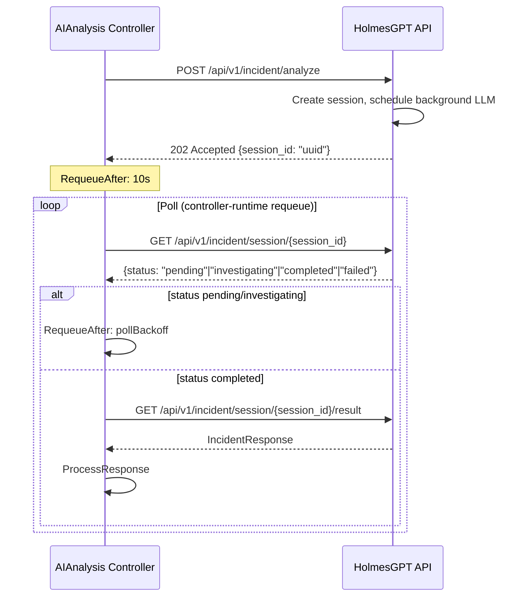
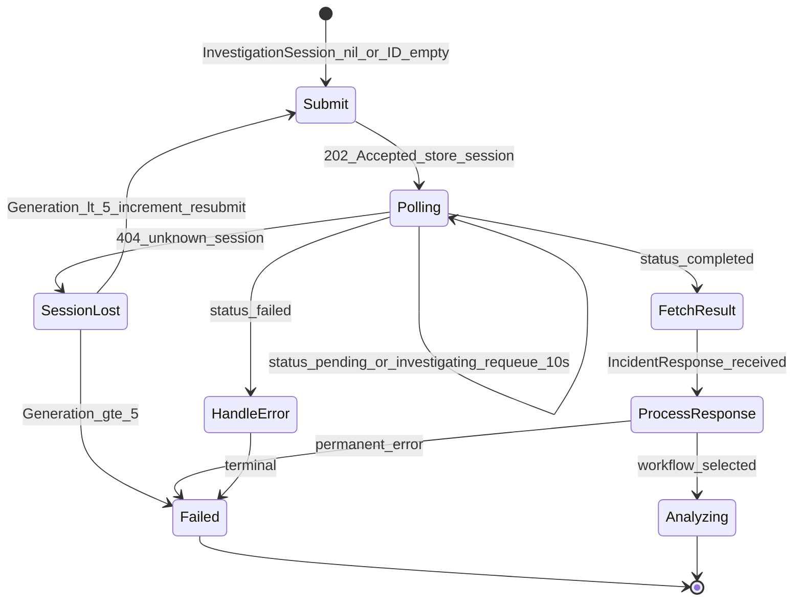

# DD-AA-HAPI-064: Session-Based Pull Design for AA-HAPI Communication

**Status**: ✅ APPROVED
**Decision Date**: 2026-02-09
**Version**: 1.0
**Authority Level**: ARCHITECTURAL
**Implements**: BR-AA-HAPI-064
**GitHub Issue**: #64

---

## Context & Problem

Current synchronous architecture: AA makes blocking HTTP call to HAPI `/api/v1/incident/analyze`, HAPI calls `investigate_issues()` synchronously (2-3 min for real LLMs), returns full result. AA goroutine blocked entire time. HTTP client timeout hardcoded to 10 minutes as workaround.

---

## Decision

### Architecture Overview

Show the async submit/poll pattern with a mermaid sequence diagram:



1. AA submits investigation → HAPI returns 202 with session_id
2. HAPI runs LLM in background (asyncio.to_thread)
3. AA polls session status with controller-runtime requeue
4. When complete, AA fetches result

### HAPI API Contract

New/modified endpoints:

| Endpoint | Method | Request | Response | Description |
|----------|--------|---------|----------|-------------|
| `/api/v1/incident/analyze` | POST | IncidentRequest | `202 {session_id: "uuid"}` | Submit (changed from 200 sync) |
| `/api/v1/incident/session/{session_id}` | GET | - | `{status: "pending"\|"investigating"\|"completed"\|"failed", progress?: string}` | Poll |
| `/api/v1/incident/session/{session_id}/result` | GET | - | IncidentResponse | Get result (only when status=completed) |

Same pattern for recovery:

| Endpoint | Method | Request | Response | Description |
|----------|--------|---------|----------|-------------|
| `/api/v1/recovery/analyze` | POST | RecoveryRequest | `202 {session_id: "uuid"}` | Submit recovery |
| `/api/v1/recovery/session/{session_id}` | GET | - | `{status, progress?}` | Poll recovery |
| `/api/v1/recovery/session/{session_id}/result` | GET | - | RecoveryResponse | Get recovery result |

Error responses:

- Poll with unknown session_id: 404 Not Found (triggers regeneration in AA)
- Get result when not completed: 409 Conflict
- Get result for failed session: 200 with error details in response body

### HAPI Session Manager

New component: `holmesgpt-api/src/session/manager.py`

```python
class SessionManager:
    """In-memory session store for async investigations."""
    sessions: Dict[str, Session]  # session_id -> Session

class Session:
    id: str  # UUID
    status: str  # pending, investigating, completed, failed
    request: dict  # original request data
    result: Optional[dict]  # investigation result (when completed)
    error: Optional[str]  # error message (when failed)
    created_at: datetime
    updated_at: datetime
```

- Sessions stored in-memory (lost on HAPI restart -- handled by AA regeneration)
- TTL cleanup: completed/failed sessions expire after 30 minutes
- Background execution: `asyncio.to_thread(investigate_issues, ...)` runs LLM call in thread pool
- Single active investigation per session (no concurrent modifications)

### AA CRD Changes

New type in `api/aianalysis/v1alpha1/aianalysis_types.go`:

```go
type InvestigationSession struct {
    ID         string       `json:"id,omitempty"`
    Generation int32        `json:"generation,omitempty"`
    LastPolled *metav1.Time `json:"lastPolled,omitempty"`
    CreatedAt  *metav1.Time `json:"createdAt,omitempty"`
}
```

New field in AIAnalysisStatus:

```go
InvestigationSession *InvestigationSession `json:"investigationSession,omitempty"`
```

New Condition in `pkg/aianalysis/conditions.go`:

```go
const ConditionInvestigationSessionReady = "InvestigationSessionReady"

const (
    ReasonSessionCreated              = "SessionCreated"
    ReasonSessionActive               = "SessionActive"
    ReasonSessionLost                 = "SessionLost"
    ReasonSessionRegenerated          = "SessionRegenerated"
    ReasonSessionRegenerationExceeded = "SessionRegenerationExceeded"
)
```

### AA Handler Flow



The InvestigatingHandler.Handle method decision tree:

1. **If `InvestigationSession` is nil or `.ID == ""`: Submit flow**
   - Build request via RequestBuilder
   - Call `client.SubmitInvestigation(ctx, req)` → returns sessionID
   - Populate `InvestigationSession{ID: sessionID, Generation: currentGen, CreatedAt: now}`
   - Set Condition InvestigationSessionReady=True, Reason=SessionCreated
   - Return `RequeueAfter: 10s`

2. **If `InvestigationSession.ID != ""`: Poll flow**
   - Call `client.PollSession(ctx, sessionID)` → returns status
   - Update `InvestigationSession.LastPolled = now`
   - Switch on status:
     - `pending`/`investigating`: Set Condition Reason=SessionActive, return `RequeueAfter: pollBackoff`
     - `completed`: Call `client.GetSessionResult(ctx, sessionID)`, process via ResponseProcessor
     - `failed`: Handle error from session, transition to Failed
   - **On 404: Regeneration flow**
     - Increment `InvestigationSession.Generation`
     - Clear `InvestigationSession.ID`
     - Set Condition InvestigationSessionReady=False, Reason=SessionLost
     - If `Generation >= MaxSessionRegenerations (5)`:
       - Set Condition Reason=SessionRegenerationExceeded
       - Emit Warning Event (DD-EVENT-001)
       - Transition to Failed, SubReason="SessionRegenerationExceeded"
       - Trigger escalation notification
     - Else: Return `RequeueAfter: 0` (immediate resubmit)

### Polling Backoff Strategy

- Initial poll: 10s after submit
- Subsequent polls: 10s, 20s, 30s (capped at 30s)
- Implementation: simple counter in handler, not exponential backoff (LLM calls have predictable duration)

### Client Interface Changes

```go
type HolmesGPTClientInterface interface {
    // Existing (kept during migration, removed after validation)
    Investigate(ctx context.Context, req *client.IncidentRequest) (*client.IncidentResponse, error)
    InvestigateRecovery(ctx context.Context, req *client.RecoveryRequest) (*client.RecoveryResponse, error)

    // New async methods
    SubmitInvestigation(ctx context.Context, req *client.IncidentRequest) (string, error)
    SubmitRecoveryInvestigation(ctx context.Context, req *client.RecoveryRequest) (string, error)
    PollSession(ctx context.Context, sessionID string) (*client.SessionStatus, error)
    GetSessionResult(ctx context.Context, sessionID string) (*client.IncidentResponse, error)
    GetRecoverySessionResult(ctx context.Context, sessionID string) (*client.RecoveryResponse, error)
}
```

HTTP client timeout: reduced from 10 minutes to 30 seconds (all calls are now short-lived).

### Error Classification

New error type in ErrorClassifier:

- `ErrorTypeSessionLost`: triggered by 404 on poll, maps to regeneration flow
- Not classified as transient/permanent -- handled by dedicated regeneration logic

New constant:

- `MaxSessionRegenerations = 5` in `pkg/aianalysis/handlers/constants.go`

New SubReason:

- `"SessionRegenerationExceeded"` added to SubReason enum in CRD

### Audit Events

- `holmesgpt.submit`: recorded when investigation is submitted (replaces `holmesgpt.call` for new flow)
- `holmesgpt.result`: recorded when result is retrieved, includes `investigationTime` (submit-to-result duration)
- `holmesgpt.session_lost`: recorded when session regeneration occurs, includes generation count

---

## Migration Strategy

1. HAPI adds async endpoints alongside existing sync endpoints
2. AA adds new client methods and handler logic
3. Feature flag or environment variable to switch between sync/async
4. Validate async in E2E tests
5. Remove sync code path and 10-minute timeout
6. Backward compatible: old sync endpoints remain during migration

---

## Consequences

### Positive

- No timeout fragility (all HTTP calls < 30s)
- Resumable across AA restarts (sessionID in CRD status)
- Progress visibility (poll status)
- Resource efficient (no blocked goroutines)
- Observable (InvestigationSession in CRD, Condition, K8s Event)
- Bounded failure (Generation cap prevents infinite retry loops)

### Negative

- Increased complexity (3 endpoints instead of 1)
- In-memory sessions lost on HAPI restart (mitigated by regeneration cap)
- More K8s API calls (status updates per poll cycle)

### Risks

- HIGH: InvestigatingHandler refactor is the most critical path in AA
- MEDIUM: HAPI session manager is new infrastructure
- LOW: CRD changes are additive (optional field)

---

## Alternatives Considered

### A. WebSocket-based streaming

Real-time progress via WebSocket from HAPI to AA.

**Rejected**: Kubernetes controllers don't naturally support WebSocket connections. Controller-runtime requeue is the idiomatic pattern.

### B. Redis-backed sessions

Persist sessions in Redis so HAPI restarts don't lose them.

**Rejected for v1**: Adds complexity. The Generation cap (5) makes in-memory viable. Can add Redis in v2 if restart frequency is problematic.

### C. Kubernetes Job for LLM calls

Submit LLM investigation as a K8s Job, AA watches Job completion.

**Rejected**: Over-engineers the solution. HAPI is a Python service, not a K8s-native workload. Would require significant HAPI restructuring.

### D. Callback/webhook pattern

HAPI calls back to AA when investigation completes.

**Rejected**: AA is a CRD controller, not an HTTP server. Would require exposing AA as a service, adding ingress complexity.

---

## Related Decisions

- BR-AA-HAPI-064: Business requirements this DD implements
- BR-ORCH-036 v3.0: Existing escalation notification (preserved)
- DD-EVENT-001: K8s Event registry (SessionRegenerationExceeded event)
- DD-CONTROLLER-001: Observed generation idempotency pattern
- DD-HAPI-015: Single-worker async architecture (HAPI side)
