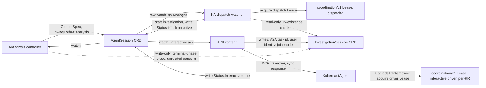

# DD-AA-KA-001: AgentSession CRD — Replacing AA↔KA HTTP Polling with K8s-Native Watch+Lease

**Status**: Accepted
**Date**: 2026-08-17
**Issues**: [#2170](https://github.com/jordigilh/kubernaut/issues/2170), [#2171](https://github.com/jordigilh/kubernaut/issues/2171), [#2172](https://github.com/jordigilh/kubernaut/issues/2172)
**Fixes**: [#2080](https://github.com/jordigilh/kubernaut/issues/2080), [#2081](https://github.com/jordigilh/kubernaut/issues/2081), the `#1713`-shaped interactive-detection dual-signal gap
**Related**: [BR-AA-KA-065](../../requirements/BR-AA-KA-065-agentsession-watch-design.md) (supersedes
[BR-AA-KA-064](../../requirements/BR-AA-KA-064-session-based-pull-design.md)), `internal/kubernautagent/mcp/session_manager.go`
(`LeaseSessionManager`, the per-object Lease primitive this decision's dispatch-Lease reuses),
`pkg/apifrontend/tools/crd_tools_session.go` (`HandleAwaitSession`, the raw-watch-on-bare-client
pattern KA's dispatch watcher copies)

## Context

Three separate async coordination defects in the AF/KA/AA triangle share one root shape: a fact
that one service knows authoritatively is being *re-derived* by another service from a different,
secondhand signal, instead of being read from the source directly. The AA↔KA leg additionally
relies on point-to-point HTTP with its own retry/backoff logic instead of K8s-native durability.

1. **#2080/#2081** (confirmed root cause via CI run
   [31990537765](https://github.com/jordigilh/kubernaut/actions/runs/31990537765),
   `E2E-FP-1189-005`): AA polls KA's REST session-status endpoint by session ID.
   KA's per-session ownership authorization (#823) means AA's poll 404s once AF has
   taken over/correlated a different session; AA regenerates, hits the 5-regeneration
   cap, and the `AIAnalysis` fails with `"Session regeneration cap exceeded"`. This is a
   deliberate authorization boundary in KA (a differently-authenticated caller cannot poll
   another caller's session), not a timing race — no amount of backoff tuning on the poll
   loop closes it, because the 404 is correct given the ownership model.
2. **`#1713`-shaped gap**: AA infers `Interactive` by watching whether an
   `InvestigationSession` (IS) CRD exists (`checkISMismatchAndCancel`,
   `pkg/aianalysis/handlers/investigating.go`), rather than reading KA's own record of when
   `UpgradeToInteractive` actually fired (`internal/kubernautagent/session/manager_interactive.go`).
   Two independent signals for the same fact (AF's IS-existence vs. KA's actual upgrade)
   can transiently disagree.
3. **AF's ack-wait**: AF polls `IS.Status.Phase` (`AwaitISPhaseActive`,
   `pkg/apifrontend/tools/crd_tools_session.go`) waiting for AA's best-effort ack write — a
   write that comes from the same code path being deleted in (2).
4. **The dispatch leg itself**: AA's *initial* submission to KA
   (`InvestigatingHandler.handleSessionSubmit` → `h.kaClient.SubmitInvestigation`) is a
   synchronous HTTP call against a fully ogen-generated OpenAPI client/server
   (`pkg/agentclient`, `internal/kubernautagent/server/handler.go`), with AA's own bespoke
   retry/backoff/error-handling covering transient failures — the same HTTP-polling-style
   architecture as (1)–(3), just in the forward direction.

## Alternatives Considered

### For the #2080/#2081 root cause

- **Option A — Single-owner handoff**: when AF takes over, have AF explicitly notify AA
  (e.g. via a new field on the `RemediationRequest` or a direct status write) that ownership
  has transferred, so AA stops polling its now-orphaned session cleanly instead of getting a
  404. Rejected: still HTTP-poll-shaped, just with an extra signal; does not remove the
  identity-authorization mismatch, only adds a second co-ordination point that itself needs
  keeping in sync.
- **Option B — Decouple session result from ownership via the IS CRD**: have KA write session
  results onto the existing `InvestigationSession` CRD instead of AA polling KA's REST
  endpoint by session ID. Rejected after tracing the actual call graph: an investigation that
  is autonomous (KA-initiated, no user "fix it") never has an `InvestigationSession` at all —
  IS only exists for interactive flows. Routing AA's *only* channel for session results
  through a CRD that does not exist for the majority (autonomous) case would make AA's
  behavior inconsistent between autonomous and interactive paths, and would still require
  AA to watch IS (a CRD it does not own) rather than something scoped to its own concern.
- **Option C — K8s-native watch + optimistic concurrency (chosen)**: introduce a new CRD,
  `AgentSession`, that exists uniformly for every investigation (autonomous or interactive),
  owned and exclusively written by KA, watched by AA (and AF). This removes the
  identity-authorization mismatch entirely: AA never authenticates against KA's per-session
  REST ownership check again, because AA never talks to that endpoint. Chosen because it
  generalizes over both autonomous and interactive cases uniformly (unlike Option B) and
  eliminates the mismatched-identity poll rather than adding a second notification path
  around it (unlike Option A).

### For the dispatch leg (AA → KA `SubmitInvestigation`)

- **Keep the HTTP forward-dispatch call, only replace the result/status leg with
  `AgentSession`**: lower blast radius (only 3 of the 4 problems above addressed), but leaves
  AA with its own bespoke HTTP retry/backoff logic for a case (KA transiently unreachable)
  that K8s's own object durability already handles for free — if KA hasn't picked up a
  `Create` yet, the object simply sits there; nothing is lost, and no custom retry state is
  needed. Rejected in favor of removing the HTTP channel end-to-end, once it was confirmed
  (`internal/kubernautagent/mcp/session_manager.go`'s `LeaseSessionManager`, already used in
  production for exclusive per-object ownership via `coordination/v1` Lease) that KA already
  has a proven, lightweight mechanism for exactly-once dispatch across replicas without
  requiring a full controller-runtime `Manager` or leader election — the one piece of
  infrastructure that would have made full removal impractical.
- **Full HTTP removal, AA creates `AgentSession.Spec`, KA watches and dispatches (chosen)**:
  AA's `Create` replaces the HTTP call outright. KA runs a raw watch
  (`crclient.WithWatch.Watch()`, mirroring AF's own `HandleAwaitSession` pattern already
  proven in this codebase) with no informer cache and no leader election. Whichever KA
  replica wins a per-`AgentSession` dispatch Lease starts the investigation; this is
  finer-grained than controller-runtime leader election, which would serialize *all*
  dispatch through a single pod.

### For how KA obtains the incident content it needs to investigate

- **`Spec: {RemediationRequestRef}` only; KA independently reconstructs the payload**:
  KA would read `RemediationRequest.Status.AIAnalysisRef` → `AIAnalysis.Spec.AnalysisRequest`
  (confirmed viable — that field already carries everything
  `RequestBuilder.BuildIncidentRequest` reads today) to rebuild the equivalent of the retired
  HTTP request body. Rejected: requires a *new* RBAC grant for KA on `RemediationRequest` and
  `AIAnalysis` (outside this design's stated RBAC scope, which is `AgentSession`-only) and a
  *new* KA-side translation function duplicating `BuildIncidentRequest`'s logic against a
  different source shape — real new surface area for zero behavioral benefit over the
  alternative below, plus a staleness risk (KA reads `AIAnalysis` at a different, later point
  in time than when AA actually decided to dispatch).
- **`Spec` embeds the incident payload directly, translated 1:1 from the retired
  `agentclient.IncidentRequest` (chosen)**: AA populates `Spec` at Create time from the exact
  same source (`AIAnalysis.Spec.AnalysisRequest`) `BuildIncidentRequest` already reads, so
  removing the HTTP channel loses no content KA previously received. KA's dispatch watcher
  reads `Spec` alone — no additional RBAC, no reconstruction logic, no staleness risk (the
  payload is a point-in-time snapshot, exactly as it was over HTTP). Free-form/nested pieces
  (`EnrichmentResults`) are carried as raw JSON on `Spec`, the same curation-agnostic
  precedent already used for `Status.Result`'s `RootCauseAnalysis`/`SelectedWorkflow`/
  `DetectedLabels` — KA's schema for these evolves independently of this CRD.

### For extending an existing CRD instead of introducing `AgentSession`

- **Extend `InvestigationSession`**: rejected — IS's `Spec` has mandatory,
  interactive-only fields (`A2ATaskID`, `UserIdentity`, `JoinMode`) and is immutable after
  creation by design (AF's own bookkeeping contract); retrofitting it to also carry
  autonomous investigations would break that immutability contract or force nullable
  interactive-only fields onto every autonomous investigation. `AgentSession` is deliberately
  minimal (`Spec: {RemediationRequestRef}` plus the incident-payload fields described below) and
  exists for every investigation uniformly.

## Decision

Introduce `AgentSession`, a new namespace-scoped CRD, deterministic 1:1-named with the
`RemediationRequest` it investigates:

- **AA creates `AgentSession`** (`Spec: {RemediationRequestRef}` plus a 1:1, lossless
  translation of the retired `agentclient.IncidentRequest` HTTP body — signal/severity/
  resource/enrichment/etc., populated from the same `AIAnalysis.Spec.AnalysisRequest`
  source `RequestBuilder.BuildIncidentRequest` already read — immutable after create,
  `ownerRef` → the AIAnalysis CR that creates it, not the RR directly (AA already holds
  that object live, so no new `RemediationRequest` RBAC grant is needed for AA either;
  cascade GC still reaches the RR transitively, since RO already sets the RR as
  AIAnalysis's own owner) at the point where it used to
  call `SubmitInvestigation`. This replaces the HTTP call with a K8s `Create` — durable
  across KA restarts, no AA-side retry logic needed. Embedding the payload directly in
  `Spec` (rather than a `RemediationRequestRef`-only design) means KA's dispatch watcher
  reads `Spec` alone — no additional `RemediationRequest`/`AIAnalysis` RBAC grant is
  needed on KA's side, and no new KA-side reconstruction logic is required.
- **KA dispatches via a raw watch, not a full controller-runtime Manager.** KA copies AF's
  existing `HandleAwaitSession` pattern to watch `AgentSession` Create events.
- **Dispatch ownership uses a *second*, distinct Lease kind**, reusing KA's existing
  `coordination/v1` Lease primitive (`LeaseSessionManager`) — keyed for dispatch-ownership
  (`dispatch-<agentsession-name>`), distinct from the existing interactive-driver Lease
  (keyed per-RR, one human driver at a time). Different replicas can win different
  `AgentSession`s' Leases concurrently — this is not a global leader-election serialization
  point.
- **Idempotency against replay/resync**: before acting on a Create/Update event, KA checks
  `AgentSession.Status.Phase` — already-set means already-started, no-op.
- **`Status` carries**: session ID, lifecycle phase, a curated result (same SI-10 curation
  precedent as `MarshalRCASubset`), and `Interactive bool`, written the instant it becomes true —
  either at dispatch time (fresh, pre-emptive interactive start, see Amendment Gap 1 below) or the
  instant `UpgradeToInteractive` succeeds (takeover of a running autonomous investigation).
- **AA watches `AgentSession.Status`** (mirrors its existing IS watch pattern:
  `WatchesRawSource` + map func + predicate) for session id/result (fixes #2080/#2081) and
  `Interactive` (fixes the `#1713`-shaped gap).
- **AF also watches `AgentSession.Status.Interactive`**, replacing its `AwaitISPhaseActive`
  poll-loop — AF no longer waits on AA's ack at all, it watches KA's own record directly.
- **`InvestigationSession` CRD is NOT removed.** It remains AF's own durable, cross-replica
  bookkeeping (A2A task ID, user identity, join mode) for reconnect/resume, independent of
  AA. AF keeps writing/owning it exactly as today; AA simply stops reading it.
- **`pkg/agentclient` and its OpenAPI spec are deleted entirely**, along with the AA-facing
  handlers in `internal/kubernautagent/server/handler.go` and the wiring in
  `cmd/aianalysis/main.go`. AF's separate MCP channel into KA is untouched.

## What gets deleted, not just added

- `pkg/agentclient` (entire ogen-generated OpenAPI client/server package), the AA-facing
  routes in `internal/kubernautagent/server/handler.go`, the OpenAPI spec source + codegen
  Makefile target, and `cmd/aianalysis/main.go`'s `agentclient.NewKubernautAgentClient` wiring.
- AA: `is_checker.go` (`HasActiveSession`, `CorrelatedSessionID`), `checkISMismatchAndCancel`,
  `tryAdoptCorrelatedSession`, `adoptCorrelatedSession`, `handleSessionLost`'s
  regeneration-cap logic (including the newly-landed `#2080` `BackoffUntil` durability guard,
  which becomes moot once the regeneration path it protects is removed),
  `handleSessionSubmit`'s HTTP retry/backoff, `applyInteractiveDetection`, and the IS
  `WatchesRawSource`/`mapISToAIAnalysis`/`ISEventPredicate` registration. AA's RBAC grant on
  `InvestigationSession` is **narrowed, not zeroed** — see Amendment Gap 1 below: Get/List/Watch
  (used for decision-making) is removed, but a narrow write-only grant survives for
  `setISTerminalPhase`/`cascadeCancelToIS` (an unrelated bookkeeping-closure concern, not
  interactive detection).
- AF: `AwaitISPhaseActive` poll-loop (`pkg/apifrontend/tools/crd_tools_session.go`) and its
  callers, replaced by a watch on `AgentSession`.
- `EventTypeAIAgentSessionLost` audit event becomes obsolete (retire, not repurpose — see
  Consequences).

## Amendment (2026-08-17): Three Gaps Found During Implementation

Evolving this same accepted decision with evidence found while implementing the remaining scope
(AA's rewrite, KA's status-writer completion, AF's watch) — not a new DD. Rationale only; test IDs
stay in the [BR-AA-KA-065](../../requirements/BR-AA-KA-065-agentsession-watch-design.md) test plan.

### Gap 1: Fresh interactive start belongs in KA's dispatch decision, not AA's Create

`BR-INTERACTIVE-010` has two interactive-entry scenarios: **takeover** of an already-running
autonomous investigation (already covered above via `UpgradeToInteractive`), and a **fresh,
pre-emptive start** — a human calls AF's MCP `start` action before AA has even reached
`Investigating`, so an `InvestigationSession` (IS) can already exist at the moment AA would
otherwise create `AgentSession`. The original decision's implicit assumption — that AA could
detect this the same way it does today (`applyInteractiveDetection`, checking IS existence before
its first HTTP submit) and record it on `AgentSession.Spec` — does not hold: `Spec` is immutable
after `Create`, so a race between AA's `Create` and a slightly-later human `start` call would still
be missed by a value baked in at create time. There is no create-time snapshot that stays correct.

**Resolution: KA's dispatcher performs the IS-existence check itself, at the actual dispatch
decision point** (`Dispatcher.dispatch()`, immediately before choosing `StartInvestigationWithContext`
vs. `StartInteractiveSessionWithContext`) — the freshest possible read, and the only read that
matters, since dispatch is the one moment the decision is actually consumed. If found, KA (a)
launches via `StartInteractiveSessionWithContext` and (b) writes `Status.Interactive = true`
immediately as part of the dispatched-status write — unifying the fresh-start and takeover cases
under the same field and the same "KA writes it the instant it's true, AA/AF only ever watch it"
rule. This requires KA to gain a narrow, read-only RBAC grant on `InvestigationSession`
(get/list/watch) it did not need before — the mirror image of AA's RBAC shrinking.

**Consequence: `AgentSessionSpec.Interactive` (if it had been added) is not needed at all,** for
the same immutable-`Spec` reason above — AA fundamentally cannot know at `Create` time whether a
session will become interactive, since the IS CRD can appear either before AA's `Create` or in the
gap between AA's `Create` and KA's actual dispatch. KA's dispatcher is the sole owner of
interactivity determination, and its only write target is `Status.Interactive`.

**`Status.Interactive=true` is an ack signal for AF's UX, not a round-trip control signal.** AF
never writes `AgentSession.Status` in response to observing it (`BR-AA-KA-065.6` applies
unconditionally, not just to the takeover case). The actual investigation launch remains AF's
existing, separate, synchronous MCP `start` call directly into KA's `session.Manager`
(`FindPendingByRemediationID` → `LaunchDeferredInvestigation`) — untouched by this decision. AF's
wait for the ack must watch `AgentSessionList` (filtered by `RemediationRequestRef.Name`), not a
named object, mirroring `HandleAwaitSession`'s existing pattern — the object may not exist yet at
fresh-start time.

### Gap 2: Terminal-status-write race in `session.Manager`

`Dispatcher.dispatch()`'s `investigateFn` originally wrapped the raw investigator call and wrote
`AgentSession.Status` directly from its own `(result, err)` return. But `session.Manager`'s
`CompleteUserDriving` and `ForceCompleteByRemediationID` can resolve a session's *true* terminal
outcome out-of-band — after the goroutine already finished into an `InteractiveHold`, or by
force-cancelling a still-running goroutine mid-flight. In the mid-flight case, `investigateFn`'s
own return value would be a cancelled/errored result, and writing `Status.Phase=Cancelled` from it
would silently discard the human's actual completed-workflow result — violating this decision's
own `BR-AA-KA-065.4` "no update may be silently dropped" requirement.

**Resolution:** terminal/interactive status-writing moves out of `Dispatcher.investigateFn`
entirely and into two nil-safe hooks on `session.Manager` (`TerminalHook`, `InteractiveUpgradeHook`),
fired from the single call sites that actually *win* a state transition (`handleInvestigationSuccess`/
`handleInvestigationFailure`, `CompleteUserDriving`, `ForceCompleteByRemediationID`,
`UpgradeToInteractive`). Whichever call site commits the transition is the only one that ever fires
the hook for that session — the race is closed by construction, not by ordering. `Dispatcher`
maintains a `remediationID -> AgentSession ObjectKey` map so the hooks can resolve which CRD to
write, since `session.Manager` has no CRD awareness of its own.

### Gap 3: KA's MCP-direct interactive fallback can create a session with no execution path

Found while tracing Gap 1's AF-wait mechanics: KA's own MCP tools (`kubernaut_investigate
action=start`, a channel independent of AA/`AgentSession` entirely) can, via
`createFallbackSession`'s zero-seed branch, create a session whose result is a static placeholder
with no backing `Investigator.Investigate()` call — existing solely so a human always has
*something* to chat with after acquiring the MCP lease. Under this decision, that placeholder has
no legitimate destination: any later `kubernaut_select_workflow` on it would resolve through the
same `TerminalHook` Gap 2 introduces, but `Dispatcher`'s `remediationID -> AgentSession ObjectKey`
map has no entry for it (AA never created an `AgentSession`, which is *why* the fallback branch was
reached) — and AA's own later, independent reconcile would create a disconnected duplicate
investigation for the same remediation, not attach to the human's chat. AF has no
"investigate-only, never remediate" terminal mode (per `pkg/apifrontend/agent/prompt.txt`) that
would make this dead end acceptable as a permanent stopping point.

**Resolution:** extend the existing fail-closed precedent already in this codepath
(`failStartOnFallbackExhausted`) to this case too — when no real session (running, user-driving, or
completed with a real RCA to seed from) exists anywhere for the RR, KA fails closed with an
actionable error instead of fabricating a directionless placeholder. This is a KA-internal MCP-tool
fix, not `AgentSession` plumbing, but is recorded here because it was surfaced directly by this
decision's own AF-wait redesign.

## Future Considerations (not a decision — revisit later)

Raised during implementation, deliberately deferred rather than decided here:

- **Should AA and KA eventually merge into one service?** This decision already removes the
  main argument for merging today — the AA↔KA coupling is now K8s-native
  (watch + `Status`) rather than HTTP-with-bespoke-retry, so the "two processes talking over a
  bespoke protocol" pain point is gone regardless of whether they stay separate processes.
  Keeping them separate still earns its keep right now: KA is the LLM/tool-execution-bound,
  credential-heavy piece with its own scaling profile (this design's dispatch-Lease explicitly
  assumes independently-scaled KA replicas racing for `AgentSession`s), while AA is a
  lightweight CRD reconciler; merging would either widen AA's credential exposure or just
  collapse the deployment count without shrinking the security boundary.
- **The v1.7 harness-split angle**: if KA's LLM/tool-calling harness (investigator, enrichment,
  workflow catalog) is later split out into its own pod, what remains of "KA" becomes a thin
  coordinator shell (watch `AgentSession`, win the dispatch Lease, track session/interactive
  state, write `Status`) — architecturally the same shape AA already has. At that point,
  merging **AA + the leftover KA-coordinator-shell** (not AA + the harness) would be the
  natural consolidation: one orchestration control plane, with the harness remaining the
  isolated, credential-heavy, horizontally-scaled execution fleet it dispatches to.
- **`AgentSession`'s durability value is independent of this question.** Even in a merged
  future, `AgentSession` (or an equivalent) would likely survive as the durable status record
  AF watches and audit reconstructs from. What would become unnecessary is specifically the
  *Lease-based multi-replica dispatch race* this decision introduces — a single merged process
  wouldn't need to race itself for work it just created in the same call stack.

## Consequences

- **RBAC surface shrinks** for AA (drops IS Get/List/Watch, retaining only a narrow write-only
  grant for terminal-phase closure — Amendment Gap 1) while KA gains two narrowly-scoped grants: the
  `AgentSession` grant (get/list/watch + status subresource update only, never full write of
  another writer's field) and a new read-only `InvestigationSession` grant (get/list/watch, for the
  dispatch-time fresh-start check — Amendment Gap 1).
- **No new heavyweight infrastructure**: no controller-runtime `Manager`, informer cache, or
  leader election is introduced anywhere in this design — both the raw-watch and the
  per-object Lease patterns already exist and are production-proven in this codebase.
- **`pkg/agentclient` and its entire OpenAPI codegen pipeline are removed**, reducing the
  AA↔KA integration surface to a single Kubernetes API rather than a bespoke REST contract
  maintained in parallel.
- **`EventTypeAIAgentSessionLost` is retired, not repurposed.** The event existed to record a
  poll-based session hand-off failure mode that no longer exists once AA never polls KA by
  session ID. There is no equivalent "spurious loss" mode under the watch-based design for it
  to be repurposed to describe; keeping it would misrepresent what actually happens.
- **Write-amplification is bounded**: at KA's fleet-load estimate of ~500 audit events/day
  (`pkg/audit/config.go`'s `RecommendedConfig` for `kubernaut-agent`, ~8 event types per
  investigation) the additional `AgentSession.Status` writes this design introduces are on
  the same order (~62 investigations/day fleet-wide), well within K8s API server limits for a
  namespace-scoped CRD.
- **Residual risk**: the exact two-Lease-kind naming/scoping (dispatch vs. interactive-driver)
  and making KA's controller-runtime client wiring in `cmd/kubernautagent` fully unconditional
  (today gated behind `interactive.enabled`, default `false`) are resolved during
  implementation per this decision's own design above, not left as open unknowns.
