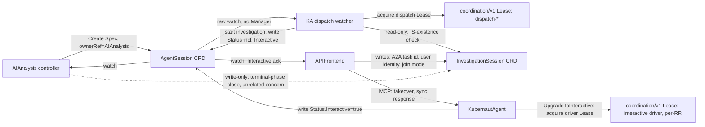

# DD-AA-KA-001: AgentSession CRD — Replacing AA↔KA HTTP Polling with K8s-Native Watch+Lease

**Status**: Accepted
**Date**: 2026-08-17
**Issues**: [#2170](https://github.com/jordigilh/kubernaut/issues/2170), [#2171](https://github.com/jordigilh/kubernaut/issues/2171), [#2172](https://github.com/jordigilh/kubernaut/issues/2172)
**Fixes**: [#2080](https://github.com/jordigilh/kubernaut/issues/2080), [#2081](https://github.com/jordigilh/kubernaut/issues/2081), the `#1713`-shaped interactive-detection dual-signal gap
**Related**: [BR-AA-KA-065](../../requirements/BR-AA-KA-065-agentsession-watch-design.md) (supersedes
[BR-AA-KA-064](../../requirements/BR-AA-KA-064-session-based-pull-design.md)), `internal/kubernautagent/mcp/session_manager.go`
(`LeaseSessionManager`, the per-object Lease primitive this decision's dispatch-Lease reuses),
`pkg/apifrontend/tools/crd_tools_session.go` (`HandleAwaitSession`, the raw-watch-on-bare-client
pattern KA's dispatch watcher copies)

## Context

Three separate async coordination defects in the AF/KA/AA triangle share one root shape: a fact
that one service knows authoritatively is being *re-derived* by another service from a different,
secondhand signal, instead of being read from the source directly. The AA↔KA leg additionally
relies on point-to-point HTTP with its own retry/backoff logic instead of K8s-native durability.

1. **#2080/#2081** (confirmed root cause via CI run
   [31990537765](https://github.com/jordigilh/kubernaut/actions/runs/31990537765),
   `E2E-FP-1189-005`): AA polls KA's REST session-status endpoint by session ID.
   KA's per-session ownership authorization (#823) means AA's poll 404s once AF has
   taken over/correlated a different session; AA regenerates, hits the 5-regeneration
   cap, and the `AIAnalysis` fails with `"Session regeneration cap exceeded"`. This is a
   deliberate authorization boundary in KA (a differently-authenticated caller cannot poll
   another caller's session), not a timing race — no amount of backoff tuning on the poll
   loop closes it, because the 404 is correct given the ownership model.
2. **`#1713`-shaped gap**: AA infers `Interactive` by watching whether an
   `InvestigationSession` (IS) CRD exists (`checkISMismatchAndCancel`,
   `pkg/aianalysis/handlers/investigating.go`), rather than reading KA's own record of when
   `UpgradeToInteractive` actually fired (`internal/kubernautagent/session/manager_interactive.go`).
   Two independent signals for the same fact (AF's IS-existence vs. KA's actual upgrade)
   can transiently disagree.
3. **AF's ack-wait**: AF polls `IS.Status.Phase` (`AwaitISPhaseActive`,
   `pkg/apifrontend/tools/crd_tools_session.go`) waiting for AA's best-effort ack write — a
   write that comes from the same code path being deleted in (2).
4. **The dispatch leg itself**: AA's *initial* submission to KA
   (`InvestigatingHandler.handleSessionSubmit` → `h.kaClient.SubmitInvestigation`) is a
   synchronous HTTP call against a fully ogen-generated OpenAPI client/server
   (`pkg/agentclient`, `internal/kubernautagent/server/handler.go`), with AA's own bespoke
   retry/backoff/error-handling covering transient failures — the same HTTP-polling-style
   architecture as (1)–(3), just in the forward direction.

## Alternatives Considered

### For the #2080/#2081 root cause

- **Option A — Single-owner handoff**: when AF takes over, have AF explicitly notify AA
  (e.g. via a new field on the `RemediationRequest` or a direct status write) that ownership
  has transferred, so AA stops polling its now-orphaned session cleanly instead of getting a
  404. Rejected: still HTTP-poll-shaped, just with an extra signal; does not remove the
  identity-authorization mismatch, only adds a second co-ordination point that itself needs
  keeping in sync.
- **Option B — Decouple session result from ownership via the IS CRD**: have KA write session
  results onto the existing `InvestigationSession` CRD instead of AA polling KA's REST
  endpoint by session ID. Rejected after tracing the actual call graph: an investigation that
  is autonomous (KA-initiated, no user "fix it") never has an `InvestigationSession` at all —
  IS only exists for interactive flows. Routing AA's *only* channel for session results
  through a CRD that does not exist for the majority (autonomous) case would make AA's
  behavior inconsistent between autonomous and interactive paths, and would still require
  AA to watch IS (a CRD it does not own) rather than something scoped to its own concern.
- **Option C — K8s-native watch + optimistic concurrency (chosen)**: introduce a new CRD,
  `AgentSession`, that exists uniformly for every investigation (autonomous or interactive),
  owned and exclusively written by KA, watched by AA (and AF). This removes the
  identity-authorization mismatch entirely: AA never authenticates against KA's per-session
  REST ownership check again, because AA never talks to that endpoint. Chosen because it
  generalizes over both autonomous and interactive cases uniformly (unlike Option B) and
  eliminates the mismatched-identity poll rather than adding a second notification path
  around it (unlike Option A).

### For the dispatch leg (AA → KA `SubmitInvestigation`)

- **Keep the HTTP forward-dispatch call, only replace the result/status leg with
  `AgentSession`**: lower blast radius (only 3 of the 4 problems above addressed), but leaves
  AA with its own bespoke HTTP retry/backoff logic for a case (KA transiently unreachable)
  that K8s's own object durability already handles for free — if KA hasn't picked up a
  `Create` yet, the object simply sits there; nothing is lost, and no custom retry state is
  needed. Rejected in favor of removing the HTTP channel end-to-end, once it was confirmed
  (`internal/kubernautagent/mcp/session_manager.go`'s `LeaseSessionManager`, already used in
  production for exclusive per-object ownership via `coordination/v1` Lease) that KA already
  has a proven, lightweight mechanism for exactly-once dispatch across replicas without
  requiring a full controller-runtime `Manager` or leader election — the one piece of
  infrastructure that would have made full removal impractical.
- **Full HTTP removal, AA creates `AgentSession.Spec`, KA watches and dispatches (chosen)**:
  AA's `Create` replaces the HTTP call outright. KA runs a raw watch
  (`crclient.WithWatch.Watch()`, mirroring AF's own `HandleAwaitSession` pattern already
  proven in this codebase) with no informer cache and no leader election. Whichever KA
  replica wins a per-`AgentSession` dispatch Lease starts the investigation; this is
  finer-grained than controller-runtime leader election, which would serialize *all*
  dispatch through a single pod.

### For how KA obtains the incident content it needs to investigate

- **`Spec: {RemediationRequestRef}` only; KA independently reconstructs the payload**:
  KA would read `RemediationRequest.Status.AIAnalysisRef` → `AIAnalysis.Spec.AnalysisRequest`
  (confirmed viable — that field already carries everything
  `RequestBuilder.BuildIncidentRequest` reads today) to rebuild the equivalent of the retired
  HTTP request body. Rejected: requires a *new* RBAC grant for KA on `RemediationRequest` and
  `AIAnalysis` (outside this design's stated RBAC scope, which is `AgentSession`-only) and a
  *new* KA-side translation function duplicating `BuildIncidentRequest`'s logic against a
  different source shape — real new surface area for zero behavioral benefit over the
  alternative below, plus a staleness risk (KA reads `AIAnalysis` at a different, later point
  in time than when AA actually decided to dispatch).
- **`Spec` embeds the incident payload directly, translated 1:1 from the retired
  `agentclient.IncidentRequest` (chosen)**: AA populates `Spec` at Create time from the exact
  same source (`AIAnalysis.Spec.AnalysisRequest`) `BuildIncidentRequest` already reads, so
  removing the HTTP channel loses no content KA previously received. KA's dispatch watcher
  reads `Spec` alone — no additional RBAC, no reconstruction logic, no staleness risk (the
  payload is a point-in-time snapshot, exactly as it was over HTTP). Free-form/nested pieces
  (`EnrichmentResults`) are carried as raw JSON on `Spec`, the same curation-agnostic
  precedent already used for `Status.Result`'s `RootCauseAnalysis`/`SelectedWorkflow`/
  `DetectedLabels` — KA's schema for these evolves independently of this CRD.

### For extending an existing CRD instead of introducing `AgentSession`

- **Extend `InvestigationSession`**: rejected — IS's `Spec` has mandatory,
  interactive-only fields (`A2ATaskID`, `UserIdentity`, `JoinMode`) and is immutable after
  creation by design (AF's own bookkeeping contract); retrofitting it to also carry
  autonomous investigations would break that immutability contract or force nullable
  interactive-only fields onto every autonomous investigation. `AgentSession` is deliberately
  minimal (`Spec: {RemediationRequestRef}` plus the incident-payload fields described below) and
  exists for every investigation uniformly.

## Decision

Introduce `AgentSession`, a new namespace-scoped CRD, deterministic 1:1-named with the
`RemediationRequest` it investigates:

- **AA creates `AgentSession`** (`Spec: {RemediationRequestRef}` plus a 1:1, lossless
  translation of the retired `agentclient.IncidentRequest` HTTP body — signal/severity/
  resource/enrichment/etc., populated from the same `AIAnalysis.Spec.AnalysisRequest`
  source `RequestBuilder.BuildIncidentRequest` already read — immutable after create,
  `ownerRef` → the AIAnalysis CR that creates it, not the RR directly (AA already holds
  that object live, so no new `RemediationRequest` RBAC grant is needed for AA either;
  cascade GC still reaches the RR transitively, since RO already sets the RR as
  AIAnalysis's own owner) at the point where it used to
  call `SubmitInvestigation`. This replaces the HTTP call with a K8s `Create` — durable
  across KA restarts, no AA-side retry logic needed. Embedding the payload directly in
  `Spec` (rather than a `RemediationRequestRef`-only design) means KA's dispatch watcher
  reads `Spec` alone — no additional `RemediationRequest`/`AIAnalysis` RBAC grant is
  needed on KA's side, and no new KA-side reconstruction logic is required.
- **KA dispatches via a raw watch, not a full controller-runtime Manager.** KA copies AF's
  existing `HandleAwaitSession` pattern to watch `AgentSession` Create events.
- **Dispatch ownership uses a *second*, distinct Lease kind**, reusing KA's existing
  `coordination/v1` Lease primitive (`LeaseSessionManager`) — keyed for dispatch-ownership
  (`dispatch-<agentsession-name>`), distinct from the existing interactive-driver Lease
  (keyed per-RR, one human driver at a time). Different replicas can win different
  `AgentSession`s' Leases concurrently — this is not a global leader-election serialization
  point.
- **Idempotency against replay/resync**: before acting on a Create/Update event, KA checks
  `AgentSession.Status.Phase` — already-set means already-started, no-op.
- **`Status` carries**: session ID, lifecycle phase, a curated result (same SI-10 curation
  precedent as `MarshalRCASubset`), and `Interactive bool`, written the instant it becomes true —
  either at dispatch time (fresh, pre-emptive interactive start, see Amendment Gap 1 below) or the
  instant `UpgradeToInteractive` succeeds (takeover of a running autonomous investigation).
- **AA watches `AgentSession.Status`** (mirrors its existing IS watch pattern:
  `WatchesRawSource` + map func + predicate) for session id/result (fixes #2080/#2081) and
  `Interactive` (fixes the `#1713`-shaped gap).
- **AF also watches `AgentSession.Status.Interactive`**, replacing its `AwaitISPhaseActive`
  poll-loop — AF no longer waits on AA's ack at all, it watches KA's own record directly.
- **`InvestigationSession` CRD is NOT removed.** It remains AF's own durable, cross-replica
  bookkeeping (A2A task ID, user identity, join mode) for reconnect/resume, independent of
  AA. AF keeps writing/owning it exactly as today; AA simply stops reading it.
- **`pkg/agentclient` and its OpenAPI spec are deleted entirely**, along with the AA-facing
  handlers in `internal/kubernautagent/server/handler.go` and the wiring in
  `cmd/aianalysis/main.go`. AF's separate MCP channel into KA is untouched.

## What gets deleted, not just added

- `pkg/agentclient` (entire ogen-generated OpenAPI client/server package), the AA-facing
  routes in `internal/kubernautagent/server/handler.go`, the OpenAPI spec source + codegen
  Makefile target, and `cmd/aianalysis/main.go`'s `agentclient.NewKubernautAgentClient` wiring.
- AA: `is_checker.go` (`HasActiveSession`, `CorrelatedSessionID`), `checkISMismatchAndCancel`,
  `tryAdoptCorrelatedSession`, `adoptCorrelatedSession`, `handleSessionLost`'s
  regeneration-cap logic (including the newly-landed `#2080` `BackoffUntil` durability guard,
  which becomes moot once the regeneration path it protects is removed),
  `handleSessionSubmit`'s HTTP retry/backoff, `applyInteractiveDetection`, and the IS
  `WatchesRawSource`/`mapISToAIAnalysis`/`ISEventPredicate` registration. AA's RBAC grant on
  `InvestigationSession` is **narrowed, not zeroed** — see Amendment Gap 1 below: Get/List/Watch
  (used for decision-making) is removed, but a narrow write-only grant survives for
  `setISTerminalPhase`/`cascadeCancelToIS` (an unrelated bookkeeping-closure concern, not
  interactive detection).
- AF: `AwaitISPhaseActive` poll-loop (`pkg/apifrontend/tools/crd_tools_session.go`) and its
  callers, replaced by a watch on `AgentSession`.
- `EventTypeAIAgentSessionLost` audit event becomes obsolete (retire, not repurpose — see
  Consequences).

## Amendment (2026-08-17): Three Gaps Found During Implementation

Evolving this same accepted decision with evidence found while implementing the remaining scope
(AA's rewrite, KA's status-writer completion, AF's watch) — not a new DD. Rationale only; test IDs
stay in the [BR-AA-KA-065](../../requirements/BR-AA-KA-065-agentsession-watch-design.md) test plan.

### Gap 1: Fresh interactive start belongs in KA's dispatch decision, not AA's Create

`BR-INTERACTIVE-010` has two interactive-entry scenarios: **takeover** of an already-running
autonomous investigation (already covered above via `UpgradeToInteractive`), and a **fresh,
pre-emptive start** — a human calls AF's MCP `start` action before AA has even reached
`Investigating`, so an `InvestigationSession` (IS) can already exist at the moment AA would
otherwise create `AgentSession`. The original decision's implicit assumption — that AA could
detect this the same way it does today (`applyInteractiveDetection`, checking IS existence before
its first HTTP submit) and record it on `AgentSession.Spec` — does not hold: `Spec` is immutable
after `Create`, so a race between AA's `Create` and a slightly-later human `start` call would still
be missed by a value baked in at create time. There is no create-time snapshot that stays correct.

**Resolution: KA's dispatcher performs the IS-existence check itself, at the actual dispatch
decision point** (`Dispatcher.dispatch()`, immediately before choosing `StartInvestigationWithContext`
vs. `StartInteractiveSessionWithContext`) — the freshest possible read, and the only read that
matters, since dispatch is the one moment the decision is actually consumed. If found, KA (a)
launches via `StartInteractiveSessionWithContext` and (b) writes `Status.Interactive = true`
immediately as part of the dispatched-status write — unifying the fresh-start and takeover cases
under the same field and the same "KA writes it the instant it's true, AA/AF only ever watch it"
rule. This requires KA to gain a narrow, read-only RBAC grant on `InvestigationSession`
(get/list/watch) it did not need before — the mirror image of AA's RBAC shrinking.

**Consequence: `AgentSessionSpec.Interactive` (if it had been added) is not needed at all,** for
the same immutable-`Spec` reason above — AA fundamentally cannot know at `Create` time whether a
session will become interactive, since the IS CRD can appear either before AA's `Create` or in the
gap between AA's `Create` and KA's actual dispatch. KA's dispatcher is the sole owner of
interactivity determination, and its only write target is `Status.Interactive`.

**`Status.Interactive=true` is an ack signal for AF's UX, not a round-trip control signal.** AF
never writes `AgentSession.Status` in response to observing it (`BR-AA-KA-065.6` applies
unconditionally, not just to the takeover case). The actual investigation launch remains AF's
existing, separate, synchronous MCP `start` call directly into KA's `session.Manager`
(`FindPendingByRemediationID` → `LaunchDeferredInvestigation`) — untouched by this decision. AF's
wait for the ack must watch `AgentSessionList` (filtered by `RemediationRequestRef.Name`), not a
named object, mirroring `HandleAwaitSession`'s existing pattern — the object may not exist yet at
fresh-start time.

**Implemented (2026-08-18, #2172)**: `AwaitAgentSessionInteractive`
(`pkg/apifrontend/tools/crd_tools_session.go`) replaces the retired `AwaitISPhaseActive` poll loop
with exactly this watch-first/poll-fallback shape against `AgentSessionList`, returning
`(bool, error)` so a timeout (expected, non-fatal) is distinguishable from an invalid-input/client
error. `ka_investigate_mcp.go`'s `awaitInvestigationReady` was updated to call it; AF's typed
client scheme (`cmd/apifrontend/backend_deps.go`) and ClusterRole
(`charts/kubernaut/templates/apifrontend/apifrontend.yaml`, `agentsessions` get/list/watch) were
updated accordingly. AA is now fully out of this ack handshake.

### Gap 2: Terminal-status-write race in `session.Manager`

`Dispatcher.dispatch()`'s `investigateFn` originally wrapped the raw investigator call and wrote
`AgentSession.Status` directly from its own `(result, err)` return. But `session.Manager`'s
`CompleteUserDriving` and `ForceCompleteByRemediationID` can resolve a session's *true* terminal
outcome out-of-band — after the goroutine already finished into an `InteractiveHold`, or by
force-cancelling a still-running goroutine mid-flight. In the mid-flight case, `investigateFn`'s
own return value would be a cancelled/errored result, and writing `Status.Phase=Cancelled` from it
would silently discard the human's actual completed-workflow result — violating this decision's
own `BR-AA-KA-065.4` "no update may be silently dropped" requirement.

**Resolution:** terminal/interactive status-writing moves out of `Dispatcher.investigateFn`
entirely and into two nil-safe hooks on `session.Manager` (`TerminalHook`, `InteractiveUpgradeHook`),
fired from the single call sites that actually *win* a state transition (`handleInvestigationSuccess`/
`handleInvestigationFailure`, `CompleteUserDriving`, `ForceCompleteByRemediationID`,
`UpgradeToInteractive`). Whichever call site commits the transition is the only one that ever fires
the hook for that session — the race is closed by construction, not by ordering. `Dispatcher`
maintains a `remediationID -> AgentSession ObjectKey` map so the hooks can resolve which CRD to
write, since `session.Manager` has no CRD awareness of its own.

**Implemented**: `internal/kubernautagent/session/manager.go`/`manager_interactive.go`/
`manager_query.go` wire `TerminalHook`/`InteractiveUpgradeHook` at every winning call site;
`internal/kubernautagent/session/terminal_hooks_2170_test.go` covers the race directly.

### Gap 3: KA's MCP-direct interactive fallback can create a session with no execution path

Found while tracing Gap 1's AF-wait mechanics: KA's own MCP tools (`kubernaut_investigate
action=start`, a channel independent of AA/`AgentSession` entirely) can, via
`createFallbackSession`'s zero-seed branch, create a session whose result is a static placeholder
with no backing `Investigator.Investigate()` call — existing solely so a human always has
*something* to chat with after acquiring the MCP lease. Under this decision, that placeholder has
no legitimate destination: any later `kubernaut_select_workflow` on it would resolve through the
same `TerminalHook` Gap 2 introduces, but `Dispatcher`'s `remediationID -> AgentSession ObjectKey`
map has no entry for it (AA never created an `AgentSession`, which is *why* the fallback branch was
reached) — and AA's own later, independent reconcile would create a disconnected duplicate
investigation for the same remediation, not attach to the human's chat. AF has no
"investigate-only, never remediate" terminal mode (per `pkg/apifrontend/agent/prompt.txt`) that
would make this dead end acceptable as a permanent stopping point.

**Resolution:** extend the existing fail-closed precedent already in this codepath
(`failStartOnFallbackExhausted`) to this case too — when no real session (running, user-driving, or
completed with a real RCA to seed from) exists anywhere for the RR, KA fails closed with an
actionable error instead of fabricating a directionless placeholder. This is a KA-internal MCP-tool
fix, not `AgentSession` plumbing, but is recorded here because it was surfaced directly by this
decision's own AF-wait redesign.

**Implemented** (#2100/#2101): `internal/kubernautagent/mcp/tools/investigate_start.go`'s
`upgradeOrCreateInteractiveSession` routes the no-real-session case through
`failStartOnFallbackExhausted` rather than `createFallbackSession`'s placeholder branch.

**Revised (2026-08-18, PR #2189 CI evidence)**: the fail-closed resolution above assumed the only
alternative to a canned placeholder was an error. CI runs of PR #2189 disproved that: several E2E
journeys explicitly exercise a user starting an interactive investigation for an RR that AA has
never touched at all -- most notably `test/e2e/fullpipeline`'s **"FP-MCP-002: AF-style fresh start
lifecycle"** (`should create RR directly and run start -> message -> complete`), with equivalents
in the `apifrontend`/`fleet`/`kubernautagent` E2E suites. That is a legitimate product journey, not
test convenience, and failing it closed was a regression, not a fix.

**Re-resolution**: `reattachOrCreateFallback` now has a third rung below "reattach to an existing
user-driving session" and "seed from a completed autonomous RCA" --
`createFreshInteractiveSession`, which starts a genuinely real investigation by reusing the exact
same signal-resolution + `RunFullInvestigation` pipeline `handleStartAutonomous` already uses for
the pure-autonomous MCP entry point (F4, #1374), then immediately calls `UpgradeToInteractive` on
it so the investigation holds for the user at its next checkpoint instead of running to autonomous
completion. `failStartOnFallbackExhausted` is now reached only when a real investigation genuinely
cannot be started at all (signal resolution unavailable/failing, or `StartInvestigation` itself
erroring, e.g. capacity exhaustion) -- not merely because no prior session/RCA existed.

**Implemented**: `internal/kubernautagent/mcp/tools/investigate_autonomous.go`'s
`createFreshInteractiveSession`; unit coverage in
`internal/kubernautagent/mcp/tools/investigate_start_fresh_investigation_test.go`
(UT-KA-2170-020/021).

### Gap 4 (2026-08-19): no mechanism stops an orphaned KA investigation once its `AgentSession` is gone or its deadline has passed

Found while investigating `E2E-1293-003` ("IS deletion cancels investigation") CI failures: the
retired HTTP path had an explicit, imperative stop signal — AA's `checkISMismatchAndCancel`
watched IS create/delete and called `kaClient.CancelSession(ctx, session.ID)` (a synchronous HTTP
RPC) whenever an interactive session's IS CRD disappeared. This decision's CRD-native channel has
no equivalent: `Dispatcher.handleEvent` explicitly discarded `watch.Deleted` events
(`evt.Type != watch.Added && evt.Type != watch.Modified`), and no field anywhere carried a
deadline KA itself could enforce. Two concrete, still-open gaps followed from this:

1. **`RemediationRequest` deletion silently leaks KA's investigation goroutine.** `AgentSession` is
   owned by the `AIAnalysis` that creates it (never directly by the RR — see "Owner reference"
   above), so RR deletion cascades `AIAnalysis` → `AgentSession` deletion transitively via
   Kubernetes' garbage collector, exactly as designed. But KA's dispatcher had nothing listening
   for that deletion, so the in-memory investigation goroutine for a remediation nobody will ever
   read the result of kept running (and burning LLM/tool budget) until it happened to finish on
   its own.
2. **A partitioned or crashed AA replica leaves KA investigating forever.** AA already
   self-enforces an absolute deadline on its own side
   (`InvestigatingHandler.checkInvestigationTimeout`, preferring `AIAnalysis.Spec.TimesOutAt`
   when RO has set an authoritative one — DD-TIMEOUT-002/#2176 — falling back to a hardcoded
   25-minute default otherwise). KA had no equivalent of its own, so it depended entirely on AA
   staying alive and reachable to ever notice a runaway investigation.

**Resolution:**

- **Delete-triggered cancellation.** `Dispatcher.handleEvent` now handles `watch.Deleted`:
  `cancelOnDelete` calls the new `session.Manager.ForceCancelByRemediationID` (mirroring the
  existing `ForceCompleteByRemediationID`'s (#1654) multi-sibling-session, iterate-then-fire-hooks-
  after-unlock pattern, but transitioning to `StatusCancelled` with no result). No CRD write is
  attempted here — the `AgentSession` is already gone by the time this fires, so the only
  actionable step is stopping the goroutine.
- **Self-enforced timeout, independent of AA.** `AgentSessionSpec` gains an optional `TimesOutAt`
  field (`*metav1.Time`), populated verbatim from `AIAnalysis.Spec.TimesOutAt` by
  `RequestBuilder.BuildAgentSessionSpec` at `AgentSession` creation time — same absolute-timestamp
  rationale as `AIAnalysis.Spec.TimesOutAt` itself (avoids AA/KA clock-skew ambiguity). Both the
  watch's Added/Modified path and the periodic resync now route through a shared
  `considerAgentSession`, which checks `isTimedOut` *before* attempting dispatch — an
  already-past-deadline `AgentSession` (e.g. created from a backlog) is never dispatched at all,
  not dispatched-then-immediately-cancelled. A still-non-terminal `AgentSession` whose deadline
  passes mid-investigation is handled by `cancelOnTimeout`: best-effort stop the in-memory
  session (if this replica happens to own it — `ErrSessionNotFound` is the expected outcome after
  a replica restart) and unconditionally write `Status.Phase = Failed` directly via `updateStatus`,
  deliberately bypassing the dispatched-map/`OnTerminal`-hook machinery (which assumes an
  in-memory session this same replica dispatched, not guaranteed true after a crash/restart).
- **What this deliberately does *not* do**: reinstate IS-deletion as a control signal. IS's role
  stays narrowed to AF-side write-only bookkeeping (per the "IS interactive detection" note
  above) — its existence or deletion has no causal effect on KA/AA control flow. The one
  user-facing "cancel my investigation" journey — MCP `kubernaut_investigate action=cancel`,
  scoped to the currently-driving user of an interactive takeover
  (`internal/kubernautagent/mcp/tools/investigate_autonomous.go`'s `handleCancel`) — already
  cascades to `AgentSession.Status.Phase = Cancelled` (and from there to AA's
  `handleSessionCancelled`, `PhaseFailed`/`ReasonInteractiveCancelled`) without touching IS or
  `AgentSession` deletion at all. `E2E-1293-003` is retired, not rewritten, because the mechanism
  it proved (IS deletion as a cancel trigger) has no remaining place in this architecture.
- **Still open (tracked as follow-up, not resolved by this amendment)**: whether the
  Console UI itself sends an explicit cancel when a user navigates away from or closes an
  in-progress interactive session — tracked separately against `kubernaut-console`.

**Implemented**: `internal/kubernautagent/session/manager_query.go`'s
`ForceCancelByRemediationID` (UT-KA-2170-001/002); `internal/kubernautagent/agentsession/dispatcher.go`'s
`cancelOnDelete`/`cancelOnTimeout`/`considerAgentSession`/`isTimedOut`
(UT-AA-2170-DELETE-001, UT-AA-2170-TIMEOUT-001/002); `AgentSessionSpec.TimesOutAt` (API type +
CRD schema); `pkg/aianalysis/handlers/request_builder.go`'s `BuildAgentSessionSpec` propagation
(UT-AA-KA-065-101 suite).

### Gap 5 (2026-08-19): a genuine KA dispatch-capacity rejection had no way to distinguish itself from a real investigation failure

Found while decomposing the 29-field `AIAnalysisStatus` god struct (a separate, behavior-preserving
refactor landed first as its own PR) and re-examining `InvestigatingHandler.handleSessionFailed`
for the sub-struct migration: KA's dispatcher already self-enforces admission control via
`session.Manager`'s configured `MaxConcurrentInvestigations` (`internal/kubernautagent/session/
store.go`) — a fresh `AgentSession` arriving when the store is already at capacity is rejected with
`session.ErrMaxInvestigationsReached` before any investigation ever starts. Before this amendment,
`Dispatcher.dispatch()` wrote that rejection to `AgentSession.Status` exactly like any other dispatch
error: `Phase=Failed`, a curated `Status.Error` string, nothing else. AA's `handleSessionFailed` had
no way to tell "KA is momentarily oversubscribed, try again shortly" apart from "the investigation
itself genuinely failed" — every capacity rejection permanently failed the `AIAnalysis`, even though
the condition is transient and self-resolving (some in-flight investigation finishes and frees a
slot within seconds). Under real fleet-wide concurrent-alert load this is a false negative: an
operator sees a permanently failed root-cause analysis for an incident KA was fully capable of
investigating, just not in that exact instant.

**Resolution:** `AgentSessionStatus` gains a new `Reason` field (`Status.Error` stays the curated
message; `Reason` is a separate, machine-readable classification, set only alongside `Error` on the
`Failed` transition — currently the sole defined value is `AgentSessionReasonCapacityExceeded`,
empty for every other failure cause). `Dispatcher.dispatch()` sets it via `errors.Is(err,
session.ErrMaxInvestigationsReached)` at the same point it already classifies the dispatch error for
the curated message, no new classification logic. AA's `handleSessionFailed` branches on
`Reason == AgentSessionReasonCapacityExceeded` *before* falling into the permanent-fail path:
`retryCapacityExceeded` builds a synthetic `apierrors.NewTooManyRequests` status error and hands it
to the already-tested `ErrorClassifier` (the same one `handleError`'s HTTP-429/rate-limit branch
already exercises for `GetOrCreate` transport errors) rather than adding a second, parallel
retry/backoff implementation. `KASession.Generation` — vestigial after the retired HTTP-session
regeneration mechanism this decision's main body already removed — is repurposed as the
capacity-exceeded retry-attempt counter, avoiding a new CRD field. Within budget: the creator's new
`DeleteForRetry` removes the stale `Failed`/`CapacityExceeded` `AgentSession` (so the *next*
`GetOrCreate` naturally falls through to `Create` instead of mutating a terminal object — mirroring
this decision's existing "no stale-object mutation" convention elsewhere), `Generation` increments,
and the reconcile returns `RequeueAfter: <classifier backoff>` with the `AIAnalysis` left in
`Investigating` — a capacity rejection is never itself an observable phase transition. Once the
budget (`ErrorClassifier`'s existing 5-attempt cap, exponential backoff, unchanged) is exhausted,
`retryCapacityExceeded` returns `(zero, false)` and `handleSessionFailed` falls through to the
unchanged permanent-fail path below it, reported identically to any other `AgentSession` failure —
by that point five self-resolving retries have not resolved it, so continuing to distinguish the
cause from a genuine failure has no remaining operator value.

**Why reuse `ErrorClassifier` instead of a dedicated capacity-retry path**: the alternative
(bespoke backoff/attempt-tracking logic specific to this one `Reason`) would duplicate exactly the
policy `handleError`'s HTTP-429 branch already encodes and already has unit coverage for. A
synthetic status error is the minimal seam that lets one retryable-error policy serve both a real
transport failure and a status-carried business rejection, without teaching `ErrorClassifier`
anything about `AgentSession` semantics.

**Business Requirements**: BR-AI-009 (retry transient errors with backoff — the same identifier
`handleError`'s pre-existing transient-error retry path in this file already uses; this amendment
extends that established retry contract to a new transient-failure cause rather than introducing a
new BR), BR-AA-KA-065 (AA↔KA channel is the `AgentSession` CRD).

**Implemented**: `api/agentsession/v1alpha1/agentsession_types.go`'s `AgentSessionStatus.Reason` +
`AgentSessionReasonCapacityExceeded`; `internal/kubernautagent/agentsession/dispatcher.go`'s
`dispatch()` (`errors.Is` tagging) and `status_writer.go`'s `writeFailedStatus` (new `reason`
parameter); `pkg/aianalysis/creator/agentsession.go`'s `AgentSessionCreator.DeleteForRetry`;
`pkg/aianalysis/handlers/investigating.go`'s `handleSessionFailed`/`retryCapacityExceeded`; AA's
`agentsessions` RBAC grant gains `delete` (`internal/controller/aianalysis/aianalysis_controller.go`
kubebuilder marker, regenerated into `config/rbac/role.yaml`, and the hand-authored Helm equivalent
`charts/kubernaut/templates/aianalysis/aianalysis.yaml` — `DeleteForRetry` is a real API call, not a
cache-backed read, so both RBAC sources needed the new verb; see RCA note below). Test coverage:
`internal/kubernautagent/agentsession/dispatcher_test.go` (UT-AA-KA-065-025),
`pkg/aianalysis/agentsession_creator_test.go` (UT-AA-KA-065-208/209),
`pkg/aianalysis/investigating_handler_session_test.go` (UT-AA-065-007/008),
`test/integration/aianalysis/capacityretry` (IT-AA-KA-065-210/211 — deliberately isolated from the
heavy shared `test/integration/aianalysis` suite's real per-process KA subprocess, which would race
a directly-seeded `AgentSession` fixture; see that package's `suite_test.go` doc comment),
`test/e2e/aianalysis/11_capacity_exceeded_retry_e2e_test.go` (E2E-AA-065 — the one layer that drives
a *genuine* `session.ErrMaxInvestigationsReached` rejection under real concurrent load against the
E2E cluster's actually-deployed KA, rather than a seeded/synthetic one).

**RCA — first CI run of E2E-AA-065 (2026-08-20)**: 23/120 bursted investigations converged to
`Failed` instead of retrying. AA's controller log showed `handleSessionFailed` correctly observed
`Reason == AgentSessionReasonCapacityExceeded` and entered `retryCapacityExceeded`, which then
failed at `DeleteForRetry` with `agentsessions.kubernaut.ai "..." is forbidden: User
"system:serviceaccount:kubernaut-system:aianalysis-controller" cannot delete resource
"agentsessions"` — exactly the fail-closed behavior `retryCapacityExceeded` documents for a delete
error (fall through to permanent failure rather than risk retrying against an object that might
still exist). Root cause: AA's pre-existing `agentsessions` RBAC grant was `get;list;watch;create`
only — `DeleteForRetry` was new production code introduced by this amendment that needed a new verb,
and neither RBAC source (`kubebuilder:rbac` marker → `config/rbac/role.yaml`, and the Helm chart's
independent hand-authored `ClusterRole`) was updated alongside it, so integration/unit tests (which
use fake/envtest clients that don't enforce RBAC) never caught the gap — only a real E2E run against
an actual API server with the real ServiceAccount surfaced it. Fixed by adding `delete` to both RBAC
sources; no Go logic changed.

**RCA — second CI run of E2E-AA-065 (2026-08-20, same day)**: after the first fix, 27/120 (worse,
not better) still ended `Failed` with the *identical* "forbidden ... cannot delete resource
"agentsessions"" error. A **third** independent `agentsessions` `ClusterRole` copy exists,
hand-rolled directly in Go inside `test/infrastructure/aianalysis_e2e.go` (the E2E harness applies
this one, not the Helm chart's -- `test/e2e/aianalysis` doesn't `helm install`, it builds the
manifest itself) -- and its own doc comment already documented one prior drift incident from the
Helm chart (CI run 32280464090, missing `create`/`get`/`list`/`watch` entirely, crash-looping the
whole pod on cache-sync timeout) without that lesson preventing a second one. Fixed by adding
`delete` there too. **Three independent copies of the same `ClusterRole` is the actual root defect**
underlying both incidents -- the fix each time is correct but narrow; the systemic gap (no single
source of truth, no parity test like the one `test/infrastructure/rbac_parity_test.go` already
enforces for AF's persona `ClusterRole`s) remains open and is exactly why this cost two RCA rounds
instead of one. Recorded as a Future Consideration below rather than fixed in this already-large
amendment.

Lesson for future `AgentSession`-verb-expanding changes in this decision's scope: grep all **three**
sources before declaring a new client call wired --
`+kubebuilder:rbac:groups=kubernaut.ai,resources=agentsessions` (→ `config/rbac/role.yaml`),
`charts/kubernaut/templates/aianalysis/aianalysis.yaml`'s `resources: ["agentsessions"]` block, and
`test/infrastructure/aianalysis_e2e.go`'s hand-rolled `ClusterRole` YAML string.

**RCA — third CI run of E2E-AA-065 (2026-08-20, same day)**: after both RBAC fixes, `DeleteForRetry`
finally executed cleanly (0/120 `Failed`), but the test still failed on a different assertion: only
90/120 reached `Completed` within the 180s `Eventually` timeout (30 stuck `Investigating`). Read
superficially, this looked like "the retry mechanism works, convergence just needs more time under
concurrent-burst load" — the timeout was raised 180s → 300s (commit `c54f28535`) on that theory.

**RCA — fourth CI run of E2E-AA-065 (2026-08-20, same day)**: the 300s timeout barely moved the
needle (92/120 `Completed`, 28 stuck `Investigating` — 2 more than the 180s run despite 120s more
budget), disproving the "just needs more time" theory. Tracing one stuck `AgentSession`
(`as-e2e-capacity-retry-ab5c814d`) end-to-end: KA's dispatcher log showed exactly **one**
`"failed to start investigation" / "maximum concurrent investigations reached"` entry for that name,
ever — no second attempt, even though AA's `DeleteForRetry` + recreate cycle should have produced
one. AA's own poll log showed the AgentSession's `Status.Phase` stuck at `""` (never even reaching
`Investigating`) for the entire remaining ~4.5 minutes of the test. Root cause, confirmed by tracing
`Dispatcher.tryDispatch`/`acquireDispatchLease`/`dispatch` (`internal/kubernautagent/agentsession/dispatcher.go`):
the per-`AgentSession`-name dispatch `Lease` (`dispatch-<name>`, `dispatchLeaseDuration` = 15 minutes)
created on the *first*, capacity-rejected attempt was never deleted when that attempt failed —
`dispatch()`'s error branch wrote the `Failed`/`CapacityExceeded` `Status` and stopped the Lease
*renewal* goroutine, but left the Lease object itself in the cluster, fresh (not stale) for the
remainder of its 15-minute duration. AA's retry deletes the `AgentSession` and recreates a new one
under the **identical name** (`AgentSessionCreator.GetOrCreate`'s naming is deterministic per
`AIAnalysis`), so the retry's `tryDispatch` → `acquireDispatchLease` hits `AlreadyExists` on the
leftover Lease and falls into `tryReclaimStaleLease`, whose `isLeaseStale` check correctly reports
"not stale yet" (the Lease is only seconds/minutes old) — so the retry is silently treated as a lost
race against another (nonexistent) in-progress dispatcher, and never dispatched again until the
15-minute window elapses. This fully explains both the fourth run's near-flat 90→92 convergence (the
15-minute block vastly exceeds either 180s or 300s test timeout, so a session unlucky enough to be
capacity-rejected on its first attempt was effectively stuck for the rest of the test) and why the
capacity-exceeded unit test (`UT-AA-KA-065-025`) never caught it: that test only asserts the *first*
rejection's `Status.Reason`, never simulates a second dispatch attempt against the same name.
Reproduced deterministically at unit-test speed (`UT-AA-KA-065-026`, added alongside the fix) before
touching the fix itself, confirming root cause without a further 15-minute E2E cycle. Fixed by having
`dispatch()`'s failure branch delete its own dispatch Lease immediately (`Dispatcher.deleteDispatchLease`,
idempotent, best-effort) whenever the investigation never started — covers the capacity-exceeded case
and, for the same reason, every other `session.Manager` rejection path, since none of them leave an
in-progress investigation for the Lease to protect. `UT-AA-KA-065-025` was also extended to assert the
Lease no longer exists after a capacity-exceeded rejection.

Lesson: a Lease (or any per-attempt claim object) acquired *before* the operation it protects is known
to have started must be released on every failure path that returns before that operation actually
begins — not just on success/normal completion. The existing `renewDispatchLease` "stop renewing on
failure" behavior looked sufficient (no more Lease *refresh* after a failure) but silently relied on
the 15-minute staleness window as the only eventual cleanup path, which is fine for "this replica
crashed mid-investigation" (the scenario the Lease was designed for) but wrong for "this attempt was
rejected before any investigation began" (the capacity-retry scenario introduced by this amendment).

**RCA — fifth CI run of E2E-AA-065 (2026-08-20, same day)**: with the Lease fix deployed, 116/120
converged to `Completed` within 300s (up from 92/120 pre-fix) and zero `Failed` — confirming Gap 6's
fix as the actual root cause, not the 180s→300s timeout bump alone. The 4 still-`Investigating`
tracked separately: each showed `Status.Phase == "Investigating"` continuously for the full test
window (never stuck at `""`), i.e. genuinely still mid-investigation, not dispatch-blocked. Raised the
timeout again, 300s → 360s, to cover this residual real tail latency (120 concurrent LLM-driven
investigations sharing a CI runner) — still comfortably inside the job's 20-minute CI budget (this run
took 16m38s at 300s).

**RCA — sixth CI run of E2E-AA-065 (2026-08-20, same day)**: the 360s timeout produced a *worse*
result than the prior 300s run -- 113/120 Completed (7 stuck) vs. 116/120 (4 stuck) -- despite 60s more
budget, and zero `Failed` again. A longer timeout making convergence worse disproves "just needs more
time": the tail is driven by the burst's absolute concurrent system load on a shared CI runner (120
simultaneous LLM-driven investigations competing for CPU/network with everything else in the job), not
by an insufficient wall-clock window -- more time doesn't help when the runner is already saturated,
and run-to-run scheduling noise on GitHub-hosted runners means the *same* timeout can yield different
tail sizes. Continuing to raise the timeout was also consuming most of this job's 20-minute CI budget
on this one spec alone (~6 of ~17 minutes). Fixed by reducing `capacityBurstOvershoot` 120 → 70 (still
20 over KA's 50-slot cap -- comfortably enough to force multiple genuine `session.ErrMaxInvestigationsReached`
rejections, which is all the test needs to prove the retry path, without needing 2.4x overshoot) and
correspondingly lowering the timeout back to 240s. This targets the actual lever (total concurrent
load) instead of continuing to expand a timeout against unpredictable CI-runner variance.

**RCA — seventh CI run of E2E-AA-065 (2026-08-20, same day)**: the burst-reduction fix (120→70)
uncovered the *opposite* failure mode on this run's (lighter-loaded) runner: all 70 investigations
converged to `Completed` in just 18.4s, but the "at least one real capacity-exceeded retry occurred"
assertion failed (`KASession.Generation` never advanced on any of the 70). The default mock LLM
scenario (keyed off `SignalName: "CrashLoopBackOff"`) completes an investigation in well under a
second, and burst *creation* itself (rate-limited by the API server across 70 concurrent `Create`
calls) apparently took longer than individual investigations took to *finish* on this lighter-loaded
run -- so completions kept freeing slots faster than new investigations arrived, and concurrent
in-flight count never actually broke through the 50-slot cap. This reveals the deeper flaw shared by
every attempt so far (120, then 70): the test relied on winning a wall-clock race between
burst-creation speed and investigation-completion speed, a fundamentally non-deterministic lever that
CI-runner scheduling variance can tip either way -- too slow a burst-creation-vs-completion ratio (a
heavily loaded runner, as in runs 4-6) produces a long convergence tail; too fast a ratio (a lightly
loaded runner, as in this run) produces zero overlap at all. Fixed by switching the burst's
`SignalName` to `"brief-investigation-test"`, an existing mock LLM scenario
(`scenario_brief_investigation.go`, already proven by `IT-AA-1376-001` to reliably hold a KA session
open for a controlled ~9-12s window) instead of the default near-instant scenario. This removes the
race entirely: with every investigation's duration now deterministic and bounded well above the burst
API-server-imposed creation window, overlap past the 50-slot cap is guaranteed regardless of runner
speed. Burst size stays at 70 (no longer needs to be large enough to "win" a timing race, just enough
to exceed the cap once overlap is guaranteed), and the timeout was lowered 240s → 120s accordingly
(bounded, deterministic per-investigation duration makes a tight timeout safe, and further reduces
this spec's share of the job's 20-minute CI budget).

Lesson (compounds the Gap 6 lesson): a test that manufactures a race condition to *prove* a fix for a
race condition must not itself depend on an unmanaged, unbounded race (wall-clock burst-creation-speed
vs. completion-speed) to do so -- it must pin down every timing variable it can (here, investigation
duration) and leave only the one variable actually under test (dispatch admission control) free to
vary.

**Final status (2026-08-20, post-fix)**: two consecutive CI runs of E2E-AA-065 with the deterministic-delay
fix passed cleanly (43.7s and 47.6s respectively, both comfortably under the 120s timeout, both with a
confirmed genuine `AgentSessionReasonCapacityExceeded` retry). The feature itself (dispatch admission
control, retry logic, Lease cleanup, RBAC) is proven correct and stable. Residual CI redness on
`E2E (aianalysis)` and `Integration (aianalysis)` in the same runs is a **different, pre-existing, already
tracked issue**: [#2204](https://github.com/jordigilh/kubernaut/issues/2204) (root-caused via live pprof +
goroutine-dump correlation on `helios08`) -- bursty concurrent `AgentSession` creation across *any* spec in
the shared per-process KA container causes legitimate LLM-tool-loop backlog that pushes some *unrelated*
specs' fixed 60s `Eventually` assertions (in `05_audit_trail_test.go`, `06_error_audit_trail_test.go`,
`03_full_flow_test.go`, `audit_flow_integration_test.go`, `metrics_integration_test.go`, and similar) past
their timeout under system-wide CI resource contention -- confirmed via timestamp correlation showing
several of these stalls beginning *before* E2E-AA-065's own burst window even started, ruling out this PR's
burst as the trigger. #2204 predates this PR, is unrelated to `AgentSessionReasonCapacityExceeded` retry
logic, and its suggested fix (raise the affected specs' `Eventually` timeouts) is out of scope for this PR.

## Amendment: #2204 — controller concurrency + deadline-driven backstop requeue (2026-08-20)

**Problem.** Once E2E-AA-065's own flakiness was fixed (previous section), CI still showed
intermittent `Integration (aianalysis)`/`E2E (aianalysis)` redness — unrelated specs
(`05_audit_trail_test.go`, `03_full_flow_test.go`, `audit_flow_integration_test.go`, etc.) tripping
their fixed 60s/120s `Eventually` timeouts under concurrent load. The user flagged this as a
regression blocking merge (not the pre-existing #2204 "out of scope" call made earlier) and
explicitly rejected raising the affected `Eventually` timeouts as the fix: *"this is a performance
issue that we must address ... we can't have a single go routine running for all requests
sequentially ... this a regression from what we had before."*

**RCA.** Two independent, compounding causes, confirmed on `helios08` with live pprof +
goroutine-dump correlation:

1. **`AIAnalysisReconciler` ran with controller-runtime's implicit `MaxConcurrentReconciles=1`**
   — unlike its `EffectivenessMonitor`/`Notification` siblings, which already expose a
   variadic-option worker count, this controller had never set one since it was first
   scaffolded (not a regression from this PR's own changes; a pre-existing gap this PR's own
   test load was the first to surface at volume). Every `AIAnalysis` CR's reconcile — including
   the `Investigating` phase's poll-and-requeue loop — serialized through a single worker per
   controller-manager process, regardless of how many KA investigations were actually running
   concurrently underneath it (confirmed KA's own dispatcher already runs investigations via
   per-`AgentSession` goroutines, refuting an initial hypothesis that KA itself was the
   single-goroutine bottleneck).
2. **The `Investigating` phase's safety-net requeue was a flat interval** (`sessionPollInterval`,
   15s production / 2s in this suite pre-fix) applied unconditionally to every still-running
   investigation regardless of how much of its actual deadline remained — adding reconcile/API-
   server volume with no relationship to when a timeout check was actually due, and deepening the
   single worker's queue backlog under (1) further.

**Fix.**

1. **`MaxConcurrentReconciles`**: `AIAnalysisReconciler.SetupWithManager` now accepts a variadic
   `maxConcurrentReconciles ...int` (mirroring the `EffectivenessMonitor`/`Notification` pattern),
   wired to `10` in `test/integration/aianalysis/suite_test.go`. Spike results: 6→2 CI failures,
   14m30s→9m51s total suite time at 10 workers; 20 workers *regressed* to 5 failures/12m30s
   (diminishing returns / added scheduling contention past this point) — 10 is retained as the
   validated value. Production wiring (`cmd/aianalysis/main.go`) is left at the controller-runtime
   default for now; this PR's evidence is from the integration suite's concurrency profile
   specifically, not a production capacity claim — revisit production's own worker count
   separately if warranted.
2. **Deadline-driven backstop requeue, replacing the flat poll interval entirely** (user-directed
   design pivot: *"instead of polling every 2 seconds, why not watch? ... there is no need to poll
   the api server when we own the resource ... I'd rather ... use the timesOutAt value for each AA
   CRD"*): `InvestigatingHandler.backstopRequeueAfter` computes the same authoritative deadline
   `checkInvestigationTimeout` already evaluates (`Spec.TimesOutAt` when RO has set it, else
   `session.CreatedAt + maxInvestigationDuration`) and requeues exactly at that deadline — one
   precisely-scheduled reconcile per investigation instead of a periodic drumbeat for its entire
   lifetime. The `AgentSession` watch (already the primary signal since this DD's core design)
   continues to wake the reconciler immediately on any real KA status write; this backstop only
   fires if KA hangs and never writes again.
3. **`sessionPollInterval` and its whole config section removed, not just replaced.** Auditing for
   "any other field belonging to the deprecated HTTP polling mechanism" (user-directed) found that
   `AgentConfig.URL` and `AgentConfig.Timeout` — doc-commented as "the Kubernaut Agent base URL" and
   "the HTTP client timeout for Kubernaut Agent calls" — had **zero production readers** anywhere in
   `cmd/aianalysis` or `pkg/aianalysis` (confirmed by repo-wide grep): AA's actual KA channel is
   `creator.AgentSessionCreator` talking to the K8s API server, which needs neither. With all three
   `AgentConfig` fields dead, the entire `Agent AgentConfig` struct/field, its `Validate()` block,
   the `agent:` section in the Helm chart config template, and the matching config testdata/tests
   were removed rather than leaving an empty vestigial section.

**Wiring Manifest** (this amendment only):

| Component | Production Entry Point | Wiring Code Location | Test proving wiring |
|---|---|---|---|
| `AIAnalysisReconciler.SetupWithManager(mgr, maxConcurrentReconciles ...int)` | `cmd/aianalysis/main.go`: `aaReconciler.SetupWithManager(mgr, cfg.MaxConcurrentReconciles)` | `internal/controller/aianalysis/aianalysis_controller.go` | `test/integration/aianalysis/suite_test.go` calls `SetupWithManager(k8sManager, 10)`; full suite run proves no regression. Production wiring itself proven by `UT-AA-2204-001b`/`config_test.go` (`MaxConcurrentReconciles` default=10, `Validate()` rejects <1) — see follow-up round below |
| `InvestigatingHandler.backstopRequeueAfter` / `investigationDeadline` | `handleSessionRunning`'s two `RequeueAfter` sites | `pkg/aianalysis/handlers/investigating.go` | `UT-AA-2204-001` (`pkg/aianalysis/investigation_timeout_test.go`) — three specs proving `RequeueAfter` tracks `Spec.TimesOutAt`/`maxInvestigationDuration`, not a flat interval, including under an active interactive session |

**Follow-up round (2026-08-20, later same day) — CI run 32384963654.** After the fixes above landed,
`E2E (aianalysis)` still showed 11 failures. Two distinct, unrelated causes:

1. **`MaxConcurrentReconciles` gap closed for real.** The Wiring Manifest row above originally left
   `cmd/aianalysis/main.go` at controller-runtime's implicit default of 1, reasoning that the evidence
   was integration-suite-specific. Must-gather RCA on this CI run showed `Full User Journey E2E`'s
   `should require approval for production environment` timing out at `Investigating` for the full 60s
   `Eventually` window in the **E2E Kind deployment**, which runs the actual `cmd/aianalysis` production
   binary, not the integration suite's envtest manager — i.e. the exact single-worker bottleneck this DD
   already diagnosed was still live in the one place that matters most. Added
   `Config.MaxConcurrentReconciles` (`internal/config/aianalysis/config.go`, default 10, `Validate()`
   rejects <1 — mirrors `EffectivenessMonitor.AssessmentConfig.MaxConcurrentReconciles`, ADR-EM-001 §10)
   and wired it: `aaReconciler.SetupWithManager(mgr, cfg.MaxConcurrentReconciles)`.
2. **Audit correlation-ID mismatch (test bug, not production).** Every `Audit Trail E2E`/`Error Audit
   Trail E2E` spec in `05_audit_trail_test.go`/`06_error_audit_trail_test.go` failed with "0 total
   events" despite `datastorage` logs confirming the batch **writes** succeeded
   (`"Batch audit events created successfully"`) — a pure query-side miss, not a lost-write bug.
   Root cause: `pkg/aianalysis/audit.getCorrelationID` (DD-AUDIT-CORRELATION-001) tags every event with
   `analysis.Spec.RemediationRequestRef.Name` when set, falling back to `RemediationID` only when the
   ref is empty. Commit `3cfb40ad4` (2026-08-19, a prior unrelated RCA) added a **distinct**
   `RemediationRequestRef.Name` (e.g. `"e2e-audit-test-rr-<suffix>"`) to these fixtures to satisfy
   `AgentSessionCreator.GetOrCreate`'s non-empty-ref requirement, without updating the tests' own
   `remediationID := analysis.Spec.RemediationID` query key (`"e2e-audit-test-<suffix>"`, no `-rr-`) to
   match — so every write landed under one correlation ID while every query searched for a different
   one. Fixed by pointing both files' query key at `analysis.Spec.RemediationRequestRef.Name` instead,
   matching what the writer actually uses (and what these helper functions' own doc comments already
   said the parameter should be).

**Wiring Manifest** (follow-up round):

| Component | Production Entry Point | Wiring Code Location | Test proving wiring |
|---|---|---|---|
| `Config.MaxConcurrentReconciles` | `cmd/aianalysis/main.go` | `internal/config/aianalysis/config.go` | `pkg/aianalysis/config_test.go`: default=10 spec + `Validate()` rejects 0 spec |

**Validation.** `go build ./...`, `golangci-lint run` (0 issues on all touched packages), and
`make test-unit-aianalysis` (419/421 passed, 2 pre-existing skips, 76.5% composite coverage) all
pass locally. `make test-integration-aianalysis` passes locally (macOS, no containerized KA —
that suite's local-Mac run doesn't exercise the containerized-KA specs at all, since Podman/Mock
LLM image builds aren't available in this session's local environment).

On `helios08`, `make test-integration-aianalysis` (40 Ginkgo procs, real containerized KA per
process) showed 35/64 failures with this amendment's diff applied. Rather than accept that at
face value, it was A/B'd against the unmodified branch tip (`ccb296333`, `git stash`/`git stash
pop`) on the *same host, same moment*: the unmodified baseline showed 33/64 failures on an
identical run — statistically the same failure rate. A third run at reduced concurrency
(`TEST_PROCS=8`) with this amendment's diff applied dropped to 7/64. All three runs' failures
share one signature: the per-process containerized KA's `agentsession-dispatcher` watch/resync
loop hitting `connect: connection refused` against its own envtest API server for the run's
duration, meaning KA never dispatches anything for that process's `AgentSession`s at all (not a
"slow investigation," a KA container that can never reach its own control plane) — a container
start/network-readiness race under N-way concurrent Podman container startup, worsening
proportionally with `N`. `podman system df` on the host showed 206GB/211GB (98%) of image storage
marked reclaimable at the time, consistent with this session's earlier, separately-diagnosed
Podman storage degradation on this same host. This is **not** this amendment's regression: it
reproduces identically on the unmodified branch tip, confirming it as the same pre-existing,
host-level #2204 contention class this DD already documents above (E2E-AA-065 section), now also
visible directly in `Integration (aianalysis)`. This host's degraded Podman state, not this PR's
code, gates how high `TEST_PROCS` can go for a clean local repro on `helios08` specifically; GitHub
Actions CI runners (this PR's actual merge gate) are separate infrastructure and are the
authoritative signal for this change.

---
### Amendment: #2204 Follow-up Round 2 — dispatch-Lease orphan fix, E2E name-collision fix, and a
### reverted `Serial` attempt (2026-08-20, `helios08` TEST_PROCS=4 validation)

**1. `kubernautagent` dispatch-Lease orphan (unit test flake).** `UT-AA-KA-065-025`/`-026`
intermittently found a leftover `dispatch-as-cap-2` Lease. RCA: `Dispatcher.tryDispatch`'s
terminal-phase bailout (added for Gap 6) re-fetches the `AgentSession` after winning the Lease; if a
*second*, concurrent `tryDispatch` call (a resync racing the first call's own status write) wins a
*new* Lease after the first call already deleted its own, then observes the session as
already-terminal on its own fresh `Get`, it returned without deleting *that* Lease — orphaning it for
the full 15-minute `dispatchLeaseDuration`. Fixed by adding `deleteDispatchLease` to that bailout path
too (`internal/kubernautagent/agentsession/dispatcher.go`).

**2. E2E `AgentSession` name collisions under `--procs` (`02_metrics_test.go`, `03_full_flow_test.go`,
`07_proactive_signal_mode_test.go`, `08_session_async_flow_test.go`,
`10_not_actionable_e2e_test.go`).** `AgentSessionCreator.GetOrCreate` derives the child
`AgentSession`'s name deterministically from `RemediationRequestRef.Name` alone (`as-<name>`), with
no ownership check against the calling `AIAnalysis`. These five files used a hardcoded (non-unique)
`RemediationRequestRef.Name` in `BeforeEach`/seed helpers; live `helios08` repro (`TEST_PROCS=4`)
showed a losing parallel process's `AIAnalysis` silently inheriting a foreign, already-terminal
`AgentSession` it doesn't own (confirmed via `ownerReference` UID mismatch), so its owner-scoped watch
never woke it again — it hung until either its own `Eventually` or the 25-minute deadline-driven
backstop. Fixed by appending `randomSuffix()` to every `RemediationRequestRef.Name` in these files.

**3. `audit_flow_integration_test.go`: a `Serial` fix was tried, measured, and reverted.** An earlier
pass (this same day) diagnosed CI run 32399213648's `Complete Workflow Audit Trail` timeout as this
file's own documented-but-never-applied "marked Serial" intent (see header comment above) and added
the `Serial` decorator to enforce it. `helios08` validation (`TEST_PROCS=4`) then measured the actual
cost: `make test-integration-aianalysis` runs three sibling Ginkgo suites in **one** CLI invocation
(`aianalysis`, `capacityretry`, `schemarejection`) sharing a single `--timeout=15m` budget
(`TEST_TIMEOUT_INTEGRATION` in the Makefile — the same 15 minutes as CI's own `timeout: 15` job-minutes
for this matrix entry). `Serial` forces this Describe's ~15 specs to run back-to-back with zero
overlap instead of spread across 4 parallel workers; measured wall time was 902s (~15m) for only 62/64
specs before the shared budget ran out entirely, leaving `capacityretry` and `schemarejection` unable
to run at all (`"Suite did not run because the timeout elapsed"`) — a deterministic, total suite
failure, strictly worse than the ~4-7% flake rate `Serial` was meant to fix. **Reverted.** The
documented 93-96% parallel pass rate is an accepted, bounded, pre-existing flake budget older than
this PR, not a regression it introduces; the real fix, if pursued, is the file's own documented
"FUTURE IMPROVEMENTS" explicit-audit-flush path, which removes the race without adding wall-clock
cost. Re-validated on `helios08` (`TEST_PROCS=4`) with the revert in place: full three-suite run
completed in 558s (well inside the 15m budget), `aianalysis` 62/64 (the 2 residual failures —
`graceful_shutdown_test.go`, `metrics_integration_test.go` — both show the same envtest-apiserver
`connection refused` signature already attributed above to this host's degraded Podman/resource
state, not this PR's code), `capacityretry` 2/2, `schemarejection` 1/1.

**4. One residual, unexplained E2E flake — flagged, not fixed.** The same `helios08` E2E validation
run (`TEST_PROCS=4`, post name-collision fix) showed 36/37 passing; the one failure
(`05_audit_trail_test.go`: `should create audit events in Data Storage for full reconciliation cycle`)
asserted exactly 1 recorded AI-agent call and got 2. This file already uses `randomSuffix()`
(fixed in an earlier round, unrelated to today's collision fix), so it is not the same root cause as
item 2 above. The `kubernautagent` pod had already restarted by the time this was investigated, so its
logs for the failure window were unavailable, and a standalone re-run (bypassing the suite's
`SynchronizedBeforeSuite` cluster bootstrap) was not achieved in the time available. Plausible
hypothesis (unconfirmed): a narrower variant of the dispatch-Lease race in item 1, where both
competing `tryDispatch` calls observe the `AgentSession` as *not yet* terminal and both proceed to
`dispatch()` before either's Lease/Status write propagates — a real double-dispatch rather than an
orphaned Lease. Confidence in this hypothesis is below the 90% bar for a code fix without
reproduction, so no change was made; flagging here for monitoring across the next few CI runs rather
than guessing at a fix. If it recurs, capture `kubernautagent` pod logs *before* any subsequent spec
can trigger a pod restart.

---
### Amendment: #2204 Follow-up Round 3 — root cause and fix for item 4's duplicate AI-agent-call flake (2026-08-20)

**Correction to Round 2 item 4 above:** the "narrower dispatch-Lease double-dispatch on KA's side"
hypothesis was wrong. The actual root cause is entirely inside the `AIAnalysis` controller (AA), not
KA, and is fully deterministic (no live race, no pprof/goroutine-dump reproduction needed) — a plain
unit test with an injected K8s API conflict reproduces it 100% of the time.

**RCA:** `status.Manager.AtomicStatusUpdate` (`pkg/aianalysis/status/manager.go`) wraps its
`updateFunc` closure in `k8sretry.RetryOnConflict`. That closure is `runInvestigatingHandler`
(`internal/controller/aianalysis/phase_handlers.go`), which calls `InvestigatingHandler.Handle` ->
`handleSessionCompleted` -> the non-idempotent, side-effecting audit write
`auditClient.RecordAIAgentResult` (the source of the `aianalysis.aiagent.call` event this test
counts). If the closure's own `Status().Update()` call hits a resourceVersion Conflict (plausible
under concurrent load — exactly what `MaxConcurrentReconciles>1`, DD-AA-KA-001's own Round 1 fix
above, or a contended CI/`helios08` host produce), `RetryOnConflict` re-runs the **entire closure**,
re-emitting the audit call, even though the eventual K8s status write only commits once. Each retry
attempt refetches a fresh copy of the object from the API server (via `apiReader`), so
`InvestigationTime` reads back as `0` on every attempt whose prior write never landed — the existing
`AA-BUG-009` idempotency guard (`InvestigationTime > 0` skip) cannot see the in-flight, uncommitted
write from the failed attempt and does not protect this path.

This is a known bug *class* already fixed for a sibling controller: see
[DD-WE-009](./DD-WE-009-terminal-audit-ordering.md) (`WorkflowExecution`, issue #1597), which
documents "audit outside the retryable closure" as this codebase's established convention — a
convention `AIAnalysis`'s own `RecordPhaseTransition` already follows (`AA-BUG-001`, see
`finalizeInvestigatingTransition`), but `RecordAIAgentResult` had been missed from that same fix.

**Reproduction:** `internal/controller/aianalysis/duplicate_audit_on_conflict_retry_test.go`
(`UT-AA-2204-101`) wires a `fake.NewClientBuilder()` with `WithInterceptorFuncs` that returns exactly
one `apierrors.NewConflict(...)` on the first `Status().Update()` call, then a real
`reconcileInvestigating` run against a fake KA client returning an already-`Completed`
`AgentSession`. Pre-fix, this reliably produced 2 `aianalysis.aiagent.call`/`aianalysis.aiagent.result`
events for 1 logical completion — reproducing the flake deterministically, matching DD-WE-009's own
spike technique.

**Fix (Option A, matching DD-WE-009 precedent):** `handleSessionCompleted`
(`pkg/aianalysis/handlers/investigating.go`) no longer calls the audit client directly. The plain
status field write (`InvestigationMetadata.InvestigationTime`) stays inside the closure (idempotent —
overwriting with the same value on retry is harmless), but `runInvestigatingHandler` now detects,
via a captured before/after comparison of that field (0 -> >0), whether *this* execution of the
closure is the one that just processed the Completed session, recording the result on a new
`investigatingUpdateOutcome.investigationTimeMs` field. `finalizeInvestigatingTransition` — which
runs exactly once, only after `AtomicStatusUpdate` has durably committed — then calls
`r.AuditClient.RecordAIAgentResult` using that value. A Conflict-retry recomputes
`investigationTimeMs` fresh on each attempt (always from a `0` baseline, since the failed attempt's
write never landed), but only the single, final `outcome` state the caller observes after
`AtomicStatusUpdate` returns is ever audited.

**Validation:** `UT-AA-2204-101` passes; full `pkg/aianalysis` (423 specs) and
`internal/controller/aianalysis` unit suites pass with zero regressions (one existing handler-level
test's assertion was moved to check the underlying `InvestigationTime` field directly, since
`RecordAIAgentResult` is no longer observable from that isolated layer by design).
`test/integration/aianalysis/capacityretry` and `.../schemarejection` suites pass unchanged against
a real envtest apiserver. The `aianalysis` integration suite's own `audit_flow_integration_test.go`
exact-count assertions (`aianalysis.aiagent.call` == 1, 9 total AA events) continue to pass, since
the audit now fires from the controller layer on the happy (non-conflicted) path exactly as before —
this fix only changes behavior when a Conflict is actually hit.

---
### Amendment: #2204 Follow-up Round 4 — unrelated `kubernautagent` CI flake, test-only fix (2026-08-20)

A separate CI run on this same push surfaced `UT-AA-KA-065-025` (from Round 2's dispatch-Lease-orphan
fix, `internal/kubernautagent/agentsession/dispatcher_test.go`) failing once:
`"a rejected (never-started) dispatch must release its Lease immediately..."` found the Lease still
present. Confirmed unrelated to Round 3 above — the failing code path (`dispatcher.go`) was untouched
by that commit.

**RCA:** the test's own assertion, not production logic, has a narrow TOCTOU window. It runs
`WithResyncInterval(20ms)` (~1500x faster than production's 30s `defaultResyncInterval`) so its
`Eventually` for `Phase==Failed` resolves quickly. But that same fast tick means a `resync` call that
snapshotted the AgentSession as still-non-terminal *just before* the winning `tryDispatch`'s
`writeFailedStatus` committed can still be in flight when the very next line's bare, synchronous
`cli.Get` for the Lease runs: it re-creates the Lease (the original was just deleted), re-fetches the
AgentSession, observes it as terminal via `tryDispatch`'s own `isTerminalPhase` branch (Round 2's own
fix), and deletes the Lease again — a self-correcting oscillation that always converges to "no
Lease", just not necessarily by the exact instant the assertion runs. Production is unaffected: at a
30s resync interval this window is negligible.

**Reproduction attempts:** 25 local runs on `helios08` (15 focused on just these two specs, 10 full-
suite at `--race --procs=4`, matching CI's exact `Makefile` invocation) — 0/25 failures. Consistent
with a rare, real race rather than a deterministic bug: low enough probability to not reproduce
locally, high enough to hit once across many CI runs.

**Fix:** changed the test's bare `cli.Get` + `Expect(...).To(BeTrue())` Lease-absence check to an
`Eventually(..., "1s", "10ms").Should(BeTrue())`, tolerating the oscillation's brief settle time
without weakening what the test actually proves (the Lease must still be gone well within a bound far
shorter than `dispatchLeaseDuration`, only not necessarily gone at the exact instant `Phase` first
reads `Failed`). No production code changed.

**Validation:** 10/10 full-suite reruns at `--race --procs=4` after the fix; `make
test-unit-kubernautagent` (35 suites, 112+ specs) passes clean on `helios08`.

## Future Considerations (not a decision — revisit later)

Raised during implementation, deliberately deferred rather than decided here:

- **Should AA and KA eventually merge into one service?** This decision already removes the
  main argument for merging today — the AA↔KA coupling is now K8s-native
  (watch + `Status`) rather than HTTP-with-bespoke-retry, so the "two processes talking over a
  bespoke protocol" pain point is gone regardless of whether they stay separate processes.
  Keeping them separate still earns its keep right now: KA is the LLM/tool-execution-bound,
  credential-heavy piece with its own scaling profile (this design's dispatch-Lease explicitly
  assumes independently-scaled KA replicas racing for `AgentSession`s), while AA is a
  lightweight CRD reconciler; merging would either widen AA's credential exposure or just
  collapse the deployment count without shrinking the security boundary.
- **The v1.7 harness-split angle**: if KA's LLM/tool-calling harness (investigator, enrichment,
  workflow catalog) is later split out into its own pod, what remains of "KA" becomes a thin
  coordinator shell (watch `AgentSession`, win the dispatch Lease, track session/interactive
  state, write `Status`) — architecturally the same shape AA already has. At that point,
  merging **AA + the leftover KA-coordinator-shell** (not AA + the harness) would be the
  natural consolidation: one orchestration control plane, with the harness remaining the
  isolated, credential-heavy, horizontally-scaled execution fleet it dispatches to.
- **`AgentSession`'s durability value is independent of this question.** Even in a merged
  future, `AgentSession` (or an equivalent) would likely survive as the durable status record
  AF watches and audit reconstructs from. What would become unnecessary is specifically the
  *Lease-based multi-replica dispatch race* this decision introduces — a single merged process
  wouldn't need to race itself for work it just created in the same call stack.
- **RBAC parity test for AA's `agentsessions` `ClusterRole`.** Gap 5's second RCA round found
  *three* independently-maintained copies of AA's `agentsessions` `ClusterRole` (kubebuilder
  marker → `config/rbac/role.yaml`, the Helm chart, and a hand-rolled copy in
  `test/infrastructure/aianalysis_e2e.go`) that have now drifted out of sync twice across two
  separate incidents, each only caught by a real E2E run days-to-weeks apart. AF already has
  exactly this class of regression test (`test/infrastructure/rbac_parity_test.go`, comparing its
  persona `ClusterRole`s for parity) — extending an equivalent check to AA's three
  `agentsessions` copies (and auditing whether any other service's E2E harness has silently
  drifted the same way) would catch this class of gap at `go build`/unit-test speed instead of a
  15-minute E2E cycle. Not done here to keep this already-large amendment scoped to the capacity-
  retry feature itself.

## Consequences

- **RBAC surface shrinks** for AA (drops IS Get/List/Watch, retaining only a narrow write-only
  grant for terminal-phase closure — Amendment Gap 1) while KA gains two narrowly-scoped grants: the
  `AgentSession` grant (get/list/watch + status subresource update only, never full write of
  another writer's field) and a new read-only `InvestigationSession` grant (get/list/watch, for the
  dispatch-time fresh-start check — Amendment Gap 1).
- **No new heavyweight infrastructure**: no controller-runtime `Manager`, informer cache, or
  leader election is introduced anywhere in this design — both the raw-watch and the
  per-object Lease patterns already exist and are production-proven in this codebase.
- **`pkg/agentclient` and its entire OpenAPI codegen pipeline are removed**, reducing the
  AA↔KA integration surface to a single Kubernetes API rather than a bespoke REST contract
  maintained in parallel.
- **`EventTypeAIAgentSessionLost` is retired, not repurposed.** The event existed to record a
  poll-based session hand-off failure mode that no longer exists once AA never polls KA by
  session ID. There is no equivalent "spurious loss" mode under the watch-based design for it
  to be repurposed to describe; keeping it would misrepresent what actually happens.
- **Write-amplification is bounded**: at KA's fleet-load estimate of ~500 audit events/day
  (`pkg/audit/config.go`'s `RecommendedConfig` for `kubernaut-agent`, ~8 event types per
  investigation) the additional `AgentSession.Status` writes this design introduces are on
  the same order (~62 investigations/day fleet-wide), well within K8s API server limits for a
  namespace-scoped CRD.
- **Residual risk**: the exact two-Lease-kind naming/scoping (dispatch vs. interactive-driver)
  and making KA's controller-runtime client wiring in `cmd/kubernautagent` fully unconditional
  (today gated behind `interactive.enabled`, default `false`) are resolved during
  implementation per this decision's own design above, not left as open unknowns.
