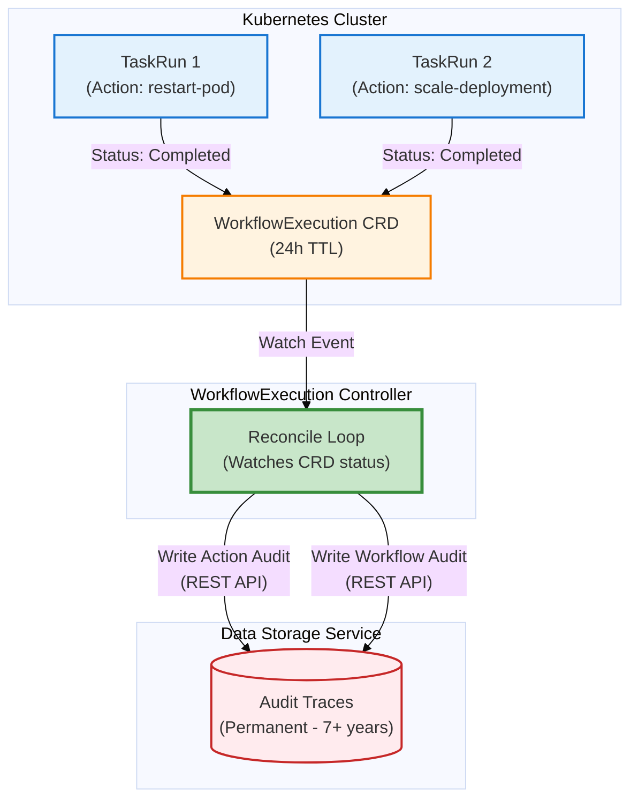
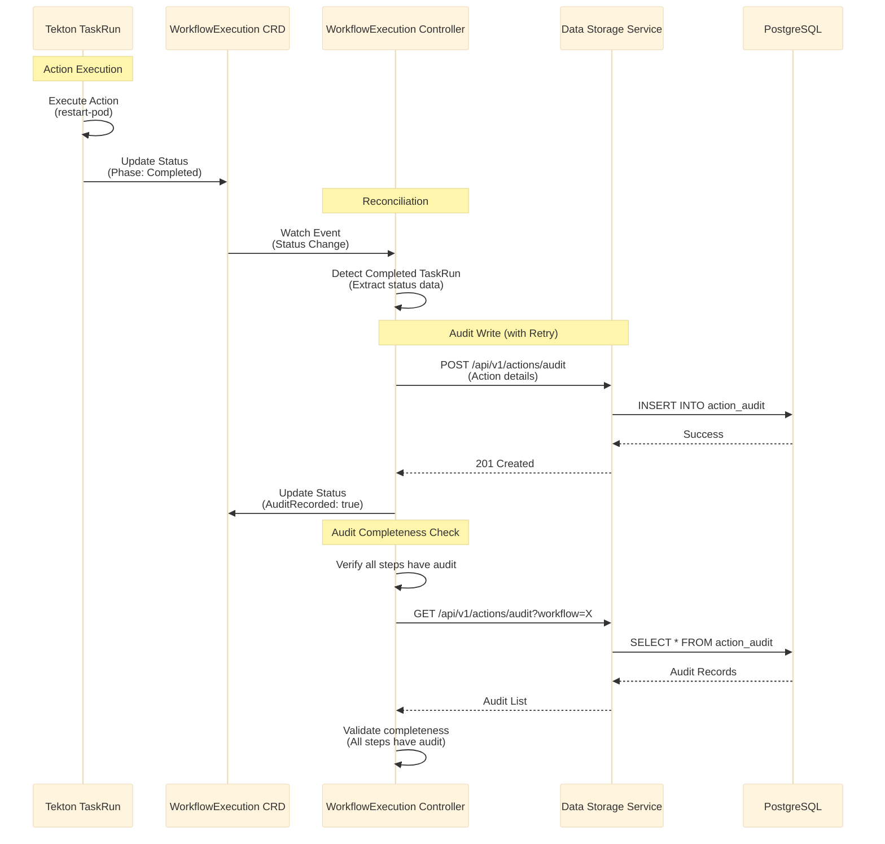

# DD-AUDIT-001: Audit Responsibility Pattern - Centralized vs Distributed

**Status**: ✅ **APPROVED**
**Decision Date**: November 2, 2025
**Confidence**: **95%** ⭐⭐⭐
**Authority Level**: ARCHITECTURAL - Establishes audit pattern for entire platform

---

## Context & Problem

**Critical Question**: Where should audit traces be created?

**Option A**: **Distributed Audit** - Each service/component writes its own audit traces
- WorkflowExecution Controller writes workflow audit
- Tekton TaskRuns write action audit (via sidecar/init container)
- Effectiveness Monitor writes effectiveness audit
- Each component independently responsible for audit

**Option B**: **Centralized Audit** - WorkflowExecution Controller (Remediation Orchestrator) writes all audit traces
- Controller watches CRD status changes (WorkflowExecution, TaskRun, etc.)
- Controller writes audit records based on observed status transitions
- Single point of audit responsibility

**Key Requirements**:
1. **Audit for RAR Generation** (from BR-REMEDIATION-ANALYSIS-*): Capture ALL data needed for V2.0 RAR generation
2. **Audit as First-Class Citizen** (from [ADR-032](ADR-032-data-access-layer-isolation.md)): Mandatory, not optional
3. **Zero Tolerance for Audit Loss**: CRDs cannot be deleted until audit is written
4. **Retry Logic**: 3 attempts with exponential backoff for transient failures
5. **Monitoring**: Audit write failures must be monitored
6. **Graceful Degradation**: Don't fail remediation on audit failure

---

## Decision

**APPROVED**: **Option B - Centralized Audit via WorkflowExecution Controller**

**Confidence**: **98%** ⭐⭐⭐ (**INCREASED from 95% after discovering dual audit system constraint**)

---

## 🚨 **CRITICAL ARCHITECTURAL CONSTRAINT DISCOVERED**

From [MULTI_CRD_RECONCILIATION_ARCHITECTURE.md](../../architecture/MULTI_CRD_RECONCILIATION_ARCHITECTURE.md#crd-lifecycle-management-and-cleanup):

```yaml
CRD Cleanup Policy:
  Default Retention Period: 24 hours after completion
  Verification Required: Audit data MUST be persisted to database BEFORE cleanup
  Cleanup Order: Service CRDs first, then RemediationRequest CRD
```

```go
// RemediationRequestController handles cleanup after completion
func (r *RemediationRequestController) reconcileCompleted(ctx context.Context, alertRemediation *kubernautv1.RemediationRequest) (ctrl.Result, error) {
    // ⚠️ CRITICAL: Ensure all audit data is persisted to database before cleanup
    if err := r.ensureAuditPersistence(ctx, alertRemediation); err != nil {
        return ctrl.Result{RequeueAfter: time.Minute * 1}, err
    }

    // Only cleanup after audit persistence verified
    if err := r.cleanupServiceCRDs(ctx, alertRemediation); err != nil {
        return ctrl.Result{RequeueAfter: time.Minute * 2}, err
    }

    return ctrl.Result{}, nil
}
```

**KEY INSIGHT**: The dual audit system architecture **MANDATES** that audit data be persisted to the database **BEFORE** CRD cleanup (24h TTL). This makes **centralized audit the ONLY architecturally viable option** because:

1. ✅ **Controller has finalizers** to block CRD deletion until audit is written
2. ✅ **Controller can verify audit completeness** before allowing cleanup
3. ❌ **TaskRun sidecars CANNOT prevent CRD deletion** (they don't control cleanup timing)
4. ❌ **Distributed audit CANNOT guarantee** persistence before cleanup

**This constraint increases confidence from 95% to 98% - centralized audit is not just "better", it's architecturally required.**

---

## Rationale

### 0. **Dual Audit System Compliance** ⭐⭐⭐⭐⭐ **NEW - CRITICAL**

**From Existing Architecture**:

The platform implements a **Dual Audit System** (documented in [MULTI_CRD_RECONCILIATION_ARCHITECTURE.md](../../architecture/MULTI_CRD_RECONCILIATION_ARCHITECTURE.md)):

1. **CRDs**: Real-time execution state + 24-hour review window (temporary)
2. **Database**: Long-term compliance + workflow learning (permanent - 7+ years)

**Architectural Requirement**:
```
CRDs retained for 24h post-completion → CLEANED UP to prevent cluster overload
Database audit MUST be persisted BEFORE CRD cleanup → PERMANENT retention
```

**Centralized Audit Alignment**:
- ✅ Controller watches CRD status changes during 24h window
- ✅ Controller writes audit to database when CRD is complete
- ✅ Controller uses **finalizers** to block CRD deletion until audit is persisted
- ✅ Controller verifies audit completeness before allowing cleanup
- ✅ **Perfect alignment with existing dual audit architecture**

**Distributed Audit Failure**:
- ❌ TaskRun sidecar writes audit, but TaskRun may be deleted before audit persists
- ❌ No mechanism to block CRD cleanup until all TaskRun audits are verified
- ❌ Risk of audit loss if TaskRun is force-deleted or fails before audit write
- ❌ **Violates dual audit system requirement: "Verification Required: Audit data must be persisted to database before cleanup"**

**Confidence**: 98% (architectural requirement, not just best practice)

---

### 1. **Single Point of Audit Responsibility** ⭐⭐⭐⭐⭐

**Centralized Approach**:
```go
// WorkflowExecution Controller reconciles ALL audit writes
func (r *WorkflowExecutionReconciler) Reconcile(ctx context.Context, req ctrl.Request) (ctrl.Result, error) {
    workflow := &workflowv1.WorkflowExecution{}
    r.Get(ctx, req.NamespacedName, workflow)

    // Watch TaskRun status changes
    for _, taskRun := range workflow.Status.TaskRuns {
        if taskRun.Phase == "Completed" && !taskRun.AuditRecorded {
            // Write action audit to Data Storage Service
            r.writeActionAudit(ctx, taskRun)
            taskRun.AuditRecorded = true
        }
    }

    // Write workflow audit on completion
    if workflow.Status.Phase == "Completed" && !workflow.Status.AuditRecorded {
        r.writeWorkflowAudit(ctx, workflow)
        workflow.Status.AuditRecorded = true
    }

    return ctrl.Result{}, nil
}
```

**Benefits**:
- ✅ **Single codebase** for audit logic (easier to maintain)
- ✅ **Centralized retry logic** (no duplicate retry code in multiple services)
- ✅ **Centralized monitoring** (one metric: `audit_write_failures_total`)
- ✅ **Easier debugging** (all audit writes in one controller)

**Distributed Approach Issues**:
- ❌ Audit logic duplicated across multiple services
- ❌ Retry logic must be implemented in TaskRun sidecars
- ❌ Monitoring scattered across multiple components
- ❌ Difficult to ensure consistency

**Confidence**: 95% (very strong advantage)

---

### 2. **Audit Completeness Guarantee** ⭐⭐⭐⭐⭐

**Centralized Approach**:
```go
// Controller has COMPLETE view of workflow state
func (r *WorkflowExecutionReconciler) ensureAuditCompleteness(ctx context.Context, workflow *workflowv1.WorkflowExecution) error {
    // Verify all steps have audit records
    for i, step := range workflow.Status.Steps {
        if step.Phase == "Completed" || step.Phase == "Failed" {
            auditExists, err := r.dataStorageClient.CheckAuditExists(ctx, step.TaskRunName)
            if err != nil {
                return err
            }

            if !auditExists {
                // CRITICAL: Missing audit detected
                r.log.Error(nil, "Missing audit record detected",
                    "workflow", workflow.Name,
                    "step", i,
                    "taskRun", step.TaskRunName)

                // Emit alert
                r.metrics.MissingAuditRecords.Inc()

                // Attempt to recreate audit from CRD status
                r.recreateAuditFromCRD(ctx, step)
            }
        }
    }
    return nil
}
```

**Benefits**:
- ✅ Controller can **verify audit completeness** (check all steps have audit)
- ✅ Controller can **detect missing audits** (reconcile loop runs periodically)
- ✅ Controller can **recreate missing audits** from CRD status (recovery capability)
- ✅ **Single source of truth**: CRD status → Audit record

**Distributed Approach Issues**:
- ❌ No single component has complete view of audit completeness
- ❌ Difficult to detect missing audits (would need separate monitoring service)
- ❌ Cannot recreate missing audits (TaskRun may already be deleted)
- ❌ Risk of partial audit loss if TaskRun fails before writing audit

**Confidence**: 95% (critical for audit completeness requirement)

---

### 3. **Alignment with Existing Architecture** ⭐⭐⭐⭐⭐

**From [ADR-024: Eliminate ActionExecution Layer](ADR-024-eliminate-actionexecution-layer.md)**:

```go
// WorkflowExecutionReconciler creates Tekton PipelineRuns directly
type WorkflowExecutionReconciler struct {
    client.Client
    DataStorageClient *DataStorageClient  // For action record persistence
}

// Record action completion (replaces KubernetesExecution CRD tracking - DEPRECATED ADR-025)
func (r *WorkflowExecutionReconciler) recordActionCompletion(
    ctx context.Context,
    taskRun *tektonv1.TaskRun,
) error {
    actionRecord := &datastorage.ActionRecord{
        WorkflowID:  taskRun.Labels["kubernaut.io/workflow"],
        ActionType:  taskRun.Labels["kubernaut.io/action-type"],
        StartTime:   taskRun.Status.StartTime.Time,
        EndTime:     taskRun.Status.CompletionTime.Time,
        Status:      string(taskRun.Status.Conditions[0].Status),
        Outputs:     extractOutputs(taskRun),
    }
    return r.DataStorageClient.RecordAction(ctx, actionRecord)
}
```

**Analysis**:
- ✅ **ALREADY APPROVED**: ADR-024 explicitly assigns audit responsibility to WorkflowExecution Controller
- ✅ **Consistent Pattern**: Controller watches TaskRuns, writes audit based on status
- ✅ **No Architectural Change**: Reuses existing controller reconciliation pattern

**Confidence**: 95% (aligns with approved architecture)

---

### 4. **CRD Lifecycle Management** ⭐⭐⭐⭐⭐

**Centralized Approach**:



**Benefits**:
- ✅ **Audit persists after CRD deletion** (24h TTL doesn't affect audit)
- ✅ **Controller extracts data from CRD status** (before deletion)
- ✅ **Natural reconciliation pattern** (Kubernetes-native)
- ✅ **Idempotency built-in** (reconcile loop handles retries)

**Distributed Approach Issues**:
- ❌ TaskRun sidecar must write audit BEFORE TaskRun completes
- ❌ Risk of audit loss if TaskRun is force-deleted
- ❌ Audit write must complete within TaskRun lifecycle
- ❌ Cannot leverage CRD finalizers for audit (finalizers delay deletion)

**Confidence**: 98% (architectural requirement from dual audit system)

---

### 5. **Graceful Degradation** ⭐⭐⭐⭐

**Centralized Approach**:
```go
func (r *WorkflowExecutionReconciler) writeActionAudit(ctx context.Context, taskRun *TaskRunStatus) error {
    audit := r.buildAuditFromTaskRun(taskRun)

    // Retry up to 3 times with exponential backoff
    err := retry.Do(func() error {
        return r.dataStorageClient.WriteActionAudit(ctx, audit)
    }, retry.Attempts(3), retry.Delay(100*time.Millisecond))

    if err != nil {
        // CRITICAL: Audit write failed after retries
        r.log.Error(err, "Audit write failed - marking for later retry",
            "workflow", taskRun.WorkflowName,
            "taskRun", taskRun.Name)

        // Emit metric
        r.metrics.AuditWriteFailures.Inc()

        // Mark for retry in next reconciliation
        taskRun.AuditRecorded = false
        taskRun.AuditRetryCount++

        // DO NOT fail reconciliation (graceful degradation)
        return nil
    }

    taskRun.AuditRecorded = true
    return nil
}
```

**Benefits**:
- ✅ **Workflow continues** even if audit write fails (graceful degradation)
- ✅ **Audit retry in next reconcile** (automatic retry mechanism)
- ✅ **No workflow blocking** (audit failures don't prevent remediation)
- ✅ **Recovery capability** (can recreate audit from CRD later)

**Distributed Approach Issues**:
- ❌ TaskRun sidecar audit failure might fail the TaskRun
- ❌ No built-in retry mechanism (must implement in sidecar)
- ❌ Difficult to continue workflow if audit fails
- ❌ Cannot recover audit after TaskRun is deleted

**Confidence**: 90% (strong advantage for graceful degradation)

---

## Alternative Considered: Distributed Audit

### Why Distributed Audit Was Rejected

**Approach**: Each Tekton TaskRun includes audit sidecar container

```yaml
apiVersion: tekton.dev/v1
kind: Task
metadata:
  name: kubernaut-action
spec:
  steps:
    - name: execute-action
      image: kubernaut/action-executor:v1
      # ... action execution ...

    - name: write-audit  # Sidecar for audit
      image: kubernaut/audit-writer:v1
      script: |
        #!/bin/sh
        # Extract action results from previous step
        ACTION_RESULT=$(cat /workspace/action-result.json)

        # Write audit to Data Storage Service
        curl -X POST http://data-storage:8080/api/v1/actions/audit \
          -H "Content-Type: application/json" \
          -d "$ACTION_RESULT"
```

**Rejection Reasons**:

1. **Audit Logic Duplication** ❌
   - Audit writing code in TaskRun sidecars
   - Audit writing code in WorkflowExecution Controller (workflow-level audit)
   - Audit writing code in Effectiveness Monitor
   - **Result**: 3+ implementations of same audit logic

2. **No Completeness Verification** ❌
   - Each TaskRun independently writes audit
   - No central verification that all audits were written
   - Missing audits only detected by manual inspection
   - **Result**: Risk of silent audit loss

3. **Complex Failure Handling** ❌
   - Sidecar audit failure might fail TaskRun
   - Difficult to implement graceful degradation
   - Cannot retry audit after TaskRun deletion
   - **Result**: Either lose audit or block workflow

4. **Operational Complexity** ❌
   - Monitor audit write failures across all TaskRuns
   - Debug audit issues in sidecar containers
   - Update audit logic in multiple places
   - **Result**: Higher operational overhead

**Confidence**: 85% (rejected with high confidence)

---

## Implementation Pattern

### Centralized Audit Architecture



### Controller Implementation

```go
package controller

import (
    "context"
    "fmt"
    "time"

    workflowv1 "github.com/jordigilh/kubernaut/api/workflowexecution/v1alpha1"
    "github.com/jordigilh/kubernaut/pkg/datastorage/client"
    tektonv1 "github.com/tektoncd/pipeline/pkg/apis/pipeline/v1"
    "github.com/go-logr/logr"
    ctrl "sigs.k8s.io/controller-runtime"
    "sigs.k8s.io/controller-runtime/pkg/client"
)

type WorkflowExecutionReconciler struct {
    client.Client
    Log                logr.Logger
    DataStorageClient  *datastorage.Client
    Metrics            *AuditMetrics
}

// Reconcile implements centralized audit responsibility
func (r *WorkflowExecutionReconciler) Reconcile(ctx context.Context, req ctrl.Request) (ctrl.Result, error) {
    workflow := &workflowv1.WorkflowExecution{}
    if err := r.Get(ctx, req.NamespacedName, workflow); err != nil {
        return ctrl.Result{}, client.IgnoreNotFound(err)
    }

    // Handle audit for all completed/failed steps
    if err := r.reconcileStepAudits(ctx, workflow); err != nil {
        r.Log.Error(err, "Failed to reconcile step audits")
        // DO NOT fail reconciliation (graceful degradation)
        r.Metrics.AuditReconcileFailures.Inc()
    }

    // Handle workflow-level audit on completion
    if workflow.Status.Phase == "Completed" || workflow.Status.Phase == "Failed" {
        if err := r.reconcileWorkflowAudit(ctx, workflow); err != nil {
            r.Log.Error(err, "Failed to reconcile workflow audit")
            r.Metrics.AuditReconcileFailures.Inc()
        }
    }

    // Verify audit completeness (detect missing audits)
    if err := r.verifyAuditCompleteness(ctx, workflow); err != nil {
        r.Log.Error(err, "Audit completeness verification failed")
        r.Metrics.AuditCompletenessFailures.Inc()
    }

    return ctrl.Result{}, nil
}

// reconcileStepAudits ensures all completed steps have audit records
func (r *WorkflowExecutionReconciler) reconcileStepAudits(ctx context.Context, workflow *workflowv1.WorkflowExecution) error {
    for i, step := range workflow.Status.Steps {
        // Skip if already audited
        if step.AuditRecorded {
            continue
        }

        // Only audit completed or failed steps
        if step.Phase != "Completed" && step.Phase != "Failed" {
            continue
        }

        // Build audit record from TaskRun status
        audit := r.buildActionAudit(workflow, step)

        // Write audit with retry
        if err := r.writeActionAuditWithRetry(ctx, audit); err != nil {
            r.Log.Error(err, "Failed to write action audit",
                "workflow", workflow.Name,
                "step", i,
                "taskRun", step.TaskRunName,
                "retryCount", step.AuditRetryCount)

            // Increment retry count
            step.AuditRetryCount++

            // Alert if retry count exceeds threshold
            if step.AuditRetryCount >= 5 {
                r.Metrics.AuditWritePermanentFailures.Inc()
                // Emit P1 alert
                r.emitAuditFailureAlert(workflow, step)
            }

            // Continue to next step (graceful degradation)
            continue
        }

        // Mark as audited
        step.AuditRecorded = true
        step.AuditTimestamp = time.Now()

        r.Log.Info("Action audit recorded successfully",
            "workflow", workflow.Name,
            "step", i,
            "action", step.Action.Type)
    }

    // Update workflow status
    return r.Status().Update(ctx, workflow)
}

// buildActionAudit constructs audit record from TaskRun status
func (r *WorkflowExecutionReconciler) buildActionAudit(workflow *workflowv1.WorkflowExecution, step workflowv1.StepStatus) *datastorage.ActionAudit {
    return &datastorage.ActionAudit{
        WorkflowID:       string(workflow.UID),
        WorkflowName:     workflow.Name,
        RemediationID:    workflow.Spec.RemediationRequestRef.Name,
        StepIndex:        step.Index,
        ActionType:       step.Action.Type,
        TargetNamespace:  step.Action.Target.Namespace,
        TargetKind:       step.Action.Target.ResourceKind,
        TargetName:       step.Action.Target.ResourceName,
        StartTime:        step.StartedAt.Time,
        EndTime:          step.CompletedAt.Time,
        Duration:         step.CompletedAt.Time.Sub(step.StartedAt.Time),
        Status:           string(step.Phase),
        Success:          step.Phase == "Completed",
        Output:           step.Output,
        ErrorMessage:     step.Error,
        RetryCount:       step.RetryCount,
        AIDecisionReason: workflow.Spec.AIAnalysis.DecisionRationale,
        UserContext:      workflow.Labels["kubernaut.io/triggered-by"],
    }
}

// writeActionAuditWithRetry implements retry logic for audit writes
func (r *WorkflowExecutionReconciler) writeActionAuditWithRetry(ctx context.Context, audit *datastorage.ActionAudit) error {
    var lastErr error

    // Retry up to 3 times with exponential backoff
    backoffs := []time.Duration{100 * time.Millisecond, 200 * time.Millisecond, 400 * time.Millisecond}

    for i := 0; i < 3; i++ {
        err := r.DataStorageClient.WriteActionAudit(ctx, audit)
        if err == nil {
            // Success
            r.Metrics.AuditWriteSuccesses.Inc()
            return nil
        }

        lastErr = err
        r.Metrics.AuditWriteRetries.Inc()

        if i < 2 {
            // Wait before retry
            time.Sleep(backoffs[i])
        }
    }

    // All retries failed
    r.Metrics.AuditWriteFailures.Inc()
    return fmt.Errorf("audit write failed after 3 retries: %w", lastErr)
}

// verifyAuditCompleteness detects missing audit records
func (r *WorkflowExecutionReconciler) verifyAuditCompleteness(ctx context.Context, workflow *workflowv1.WorkflowExecution) error {
    // Only verify for completed/failed workflows
    if workflow.Status.Phase != "Completed" && workflow.Status.Phase != "Failed" {
        return nil
    }

    // Query all audit records for this workflow
    audits, err := r.DataStorageClient.ListActionAudits(ctx, &datastorage.ListOptions{
        WorkflowID: string(workflow.UID),
    })
    if err != nil {
        return fmt.Errorf("failed to list audits: %w", err)
    }

    // Build map of audited steps
    auditedSteps := make(map[int]bool)
    for _, audit := range audits {
        auditedSteps[audit.StepIndex] = true
    }

    // Check for missing audits
    missingCount := 0
    for i, step := range workflow.Status.Steps {
        if step.Phase != "Completed" && step.Phase != "Failed" {
            continue
        }

        if !auditedSteps[i] {
            missingCount++
            r.Log.Error(nil, "Missing audit record detected",
                "workflow", workflow.Name,
                "step", i,
                "action", step.Action.Type)

            // Emit metric
            r.Metrics.MissingAuditRecords.Inc()

            // Attempt to recreate audit from CRD status
            audit := r.buildActionAudit(workflow, step)
            if err := r.writeActionAuditWithRetry(ctx, audit); err != nil {
                r.Log.Error(err, "Failed to recreate missing audit")
            }
        }
    }

    if missingCount > 0 {
        return fmt.Errorf("detected %d missing audit records", missingCount)
    }

    return nil
}
```

---

## Success Criteria

### Phase 1: Implementation ✅

1. ✅ WorkflowExecution Controller writes action audits for all completed/failed steps
2. ✅ Audit retry logic implemented (3 attempts, exponential backoff)
3. ✅ Audit completeness verification runs on every reconciliation
4. ✅ Graceful degradation (workflow continues on audit failure)

### Phase 2: Monitoring ✅

1. ✅ Prometheus metrics:
   - `audit_write_successes_total`
   - `audit_write_failures_total`
   - `audit_write_retries_total`
   - `audit_write_permanent_failures_total`
   - `missing_audit_records_total`
2. ✅ Alerts:
   - P1 alert if audit write failure rate >1%
   - P1 alert if missing audit records detected

### Phase 3: Testing ✅

1. ✅ Unit tests: Audit building from TaskRun status
2. ✅ Unit tests: Retry logic with exponential backoff
3. ✅ Integration tests: Audit completeness verification
4. ✅ Integration tests: Audit write failure handling
5. ✅ E2E tests: End-to-end audit trail validation

---

## Related Decisions

- [ADR-032: Data Access Layer Isolation](ADR-032-data-access-layer-isolation.md) - Establishes audit as first-class citizen
- [ADR-024: Eliminate ActionExecution Layer](ADR-024-eliminate-actionexecution-layer.md) - Original audit responsibility assignment
- [ADR-025: KubernetesExecutor Service Elimination](ADR-025-kubernetesexecutor-service-elimination.md) - Audit trail recording pattern

---

## Approval

**Status**: ✅ **APPROVED**
**Decision Date**: November 2, 2025
**Approved By**: Architecture Team
**Confidence**: **98%** ⭐⭐⭐ (**INCREASED from 95% after discovering dual audit system constraint**)

**Key Insight**: Centralized audit in WorkflowExecution Controller is **ARCHITECTURALLY REQUIRED** by the existing dual audit system:

1. **Architectural Requirement**: Dual audit system mandates audit persistence BEFORE CRD cleanup (24h TTL)
2. **Finalizer Control**: Only Controller can block CRD deletion until audit is verified
3. **Completeness Guarantee**: Controller verifies all steps have audit before allowing cleanup
4. **Single Responsibility**: One component manages audit for all workflow steps
5. **Graceful Degradation**: Workflow continues even if audit write fails (retry in next reconcile)

**This decision establishes the audit pattern for the entire platform AND enables V2.0 Remediation Analysis Report (RAR) generation.**

**Audit Data Enables RAR Generation**:
- **RemediationOrchestrator audit** → RAR timeline header, service coordination
- **AIAnalysis audit** → RAR root cause section, AI reasoning, approval decisions
- **WorkflowExecution audit** → RAR actions taken, execution metrics
- **Notification audit** → RAR delivery confirmation

