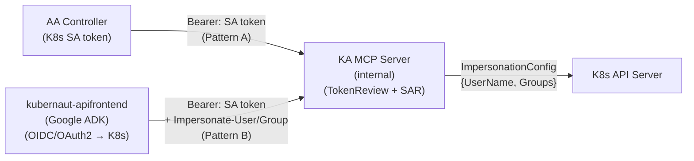

# DD-AUTH-MCP-001: MCP Endpoint Security and User Impersonation

**Status**: Proposed
**Decision Date**: 2026-04-29
**Version**: 1.0
**Confidence**: 95%
**Deciders**: Architecture Team
**Applies To**: kubernaut-agent, kubernaut-apifrontend

**Related Business Requirements**:
- BR-INTERACTIVE-001: Interactive investigation sessions
- BR-INTERACTIVE-002: MCP tool access with user-scoped RBAC
- BR-INTERACTIVE-003: Audit attribution for interactive actions

**Related Design Decisions**:
- DD-INTERACTIVE-001: Interactive mode CRD placement and timeouts (superseded by DD-INTERACTIVE-002)
- DD-INTERACTIVE-002: Dynamic takeover model
- DD-CONSOLE-001: RHDH architecture (apifrontend as MCP gateway)

---

## Changelog

| Version | Date | Author | Changes |
|---------|------|--------|---------|
| 1.0 | 2026-04-29 | AI-assisted | Initial design |

---

## Context & Problem

### Current State

Kubernaut Agent (KA) is an internal K8s service that performs autonomous AI-driven root cause analysis. It authenticates callers via K8s TokenReview + SubjectAccessReview (SAR). All K8s API calls are made using the KA service account. There is no concept of user identity for individual API calls.

Issue #703 introduces interactive mode: human users connect via MCP (Model Context Protocol) to drive or observe investigations. Interactive K8s API calls must execute under the user's identity (RBAC-scoped), not the KA service account.

### Problem Statement

How do we authenticate MCP clients, resolve their identity, and execute K8s API calls under the correct user identity -- without introducing OIDC/OAuth2 complexity into KA's binary?

### Constraints

- KA must remain internal-only (ClusterIP service, no ingress)
- KA must not validate OIDC/OAuth2 tokens (security boundary: external auth belongs in apifrontend)
- K8s API calls during interactive sessions must respect the user's RBAC
- The same MCP endpoint must serve both in-cluster K8s clients (direct) and delegated clients (via apifrontend)
- Audit trail must attribute every action to the correct identity

---

## Decision Drivers

1. **Security boundary**: OIDC validation + K8s impersonation in the same binary creates unacceptable blast radius
2. **Defense-in-depth**: Multiple independent verification layers for identity
3. **Simplicity**: KA's auth stack remains single-concern (K8s TokenReview + SAR)
4. **Auditability**: Every impersonated K8s API call must be attributable to a resolved identity
5. **Backward compatibility**: Autonomous mode (KA SA) must be completely unaffected

---

## Alternatives Considered

### Alternative A: Dual-auth in KA (OIDC + K8s) -- REJECTED

**Approach**: KA validates both OIDC tokens (external users) and K8s tokens (internal clients) using issuer-based routing.

**Pros**:
- Single deployment
- No additional service

**Cons**:
- OIDC validation library + JWKS key rotation in the same binary that executes impersonation
- Chain authenticator fallthrough creates non-deterministic routing
- Blast radius: OIDC vulnerability exposes impersonation infrastructure

**Confidence**: 40% (rejected)

### Alternative B: kubernaut-apifrontend as auth gateway -- CHOSEN

**Approach**: External authentication (OIDC/OAuth2) lives in a separate service (`kubernaut-apifrontend`). KA's MCP endpoint is internal-only with K8s TokenReview + SAR.

**Pros**:
- Clean security boundary: external auth isolated from impersonation
- KA auth stack unchanged from v1.4
- Apifrontend can evolve independently (Google ADK, multiple OIDC providers)
- Defense-in-depth: apifrontend validates external tokens, KA validates impersonation authorization

**Cons**:
- Additional service to deploy
- MCP-to-MCP proxy adds latency (~1ms internal)

**Confidence**: 95% (chosen)

---

## Decision

### Chosen: Alternative B -- kubernaut-apifrontend as auth gateway

KA's MCP endpoint is **internal-only** (ClusterIP, K8s TokenReview + SAR). External clients (RHDH Console, CLI via ingress) connect through `kubernaut-apifrontend` (separate repo, Google ADK), which handles OIDC/OAuth2 authentication and proxies to KA using MCP-to-MCP with K8s impersonation headers.

### Architecture



### Impersonation Model (Dual-Pattern)

#### Pattern A: Direct In-Cluster Clients

Bearer token = caller's K8s token. KA resolves identity via TokenReview, uses that identity for impersonated K8s calls.

```
Client → Authorization: Bearer <caller-token>
KA     → TokenReview → username + groups
KA     → rest.ImpersonationConfig{UserName: username, Groups: groups}
K8s    → API call as impersonated user
```

#### Pattern B: Delegated via apifrontend

Bearer token = apifrontend's SA token + `Impersonate-User`/`Impersonate-Group` headers. KA verifies apifrontend SA has `impersonate` RBAC via SAR, then uses delegated identity.

```
apifrontend → Authorization: Bearer <apifrontend-SA-token>
              Impersonate-User: user-a@corp
              Impersonate-Group: system:authenticated, org:team-sre
KA          → TokenReview(SA-token) → apifrontend-sa
KA          → SAR(apifrontend-sa, impersonate, users) → allowed
KA          → rest.ImpersonationConfig{UserName: "user-a@corp", Groups: [...]}
K8s         → API call as user-a@corp
```

### Effective User Extraction

```go
func extractEffectiveUser(ctx context.Context, req *http.Request, preserved http.Header) (*UserInfo, error) {
    // Pattern B detection: SA token + Impersonate-User header
    impUser := preserved.Get("Impersonate-User")
    if impUser != "" {
        // Verify caller has impersonate RBAC via SAR
        allowed, err := authorizer.CheckAccessWithGroup(ctx, callerUser,
            "", "", "users", impUser, "impersonate")
        if !allowed {
            return nil, ErrForbiddenImpersonation
        }
        groups := preserved.Values("Impersonate-Group")
        return &UserInfo{Username: impUser, Groups: groups}, nil
    }
    // Pattern A: identity from TokenReview
    return &UserInfo{Username: callerUser, Groups: callerGroups}, nil
}
```

### Header Stripping (Defense-in-Depth)

Middleware strips ALL `Impersonate-*` headers at entry, before any processing:

```go
r.Header.Del("Impersonate-User")
r.Header.Del("Impersonate-Group")
r.Header.Del("Impersonate-Uid")
for key := range r.Header {
    if strings.HasPrefix(strings.ToLower(key), "impersonate-extra-") {
        r.Header.Del(key)
    }
}
```

MCP auth handler reads from a **preserved copy** (captured before stripping) only after SAR verification for Pattern B.

### Non-K8s Tool Calls

Prometheus, DataStorage, and log queries use KA SA (no user-level auth available on those systems). This is a known limitation documented below.

### Layered Error Model

| Layer | Format | When |
|-------|--------|------|
| HTTP (auth) | RFC 7807 Problem JSON | 401/403 before MCP handler |
| HTTP (rate limit) | Plain text + `Retry-After` header | 429 |
| MCP tool | JSON-RPC `error` object | Tool-level failures |

### Error Taxonomy (Stable Codes)

| Code | HTTP | Human Message | Next Step |
|------|------|---------------|-----------|
| `auth_required` | 401 | "Authentication required" | "Provide Bearer token" |
| `auth_failed` | 401 | "Token validation failed" | "Check token validity" |
| `rbac_denied` | 403 | "Insufficient permissions" | "Request access from cluster admin" |
| `lease_held` | -- | "Session controlled by {user} since {time}" | "Wait for release or observe" |
| `session_timeout` | -- | "Session ended due to inactivity" | "Reconnect to start a new session" |
| `session_not_found` | -- | "Session not found or expired" | "Start a new investigation session" |
| `investigation_ended` | -- | "Investigation has completed" | "View results in audit trail" |
| `global_timeout` | -- | "Investigation time limit reached" | "Review findings in audit trail" |
| `rate_limited` | 429 | "Too many requests" | "Retry after {seconds} seconds" |

### Feature Gate Naming Convention

| Location | Key |
|----------|-----|
| Config.go field | `Interactive InteractiveConfig` |
| Helm values | `kubernautAgent.interactive.enabled` |
| Operator CR | `spec.kubernautAgent.interactive.enabled` |
| ConfigMap rendered | `interactive.enabled` |
| MCPConfig | `// Deprecated: v1.4 MCP client config (outbound). Not related to interactive mode.` |

### Metric Definitions

| Metric | Type | Description |
|--------|------|-------------|
| `kubernaut_interactive_sessions_active` | Gauge | Currently active interactive sessions |
| `kubernaut_interactive_takeover_total` | Counter | Total takeover events |
| `kubernaut_interactive_lease_contention_total` | Counter | Lease acquisition failures (contention) |
| `kubernaut_interactive_command_duration_seconds` | Histogram | Duration of interactive tool calls |

### Data Classification Policy

| Event Type | Classification | Redaction |
|------------|---------------|-----------|
| `aiagent.interactive.k8s_call` | Sensitive | Redact Secret data values from payloads |
| `aiagent.llm.request` | Internal | Configurable prompt verbosity |
| `aiagent.llm.response` | Internal | Configurable response verbosity |
| `aiagent.session.*` | Operational | No redaction needed |

---

## Consequences

### Positive Consequences
1. Clean security boundary: KA never touches OIDC tokens
2. KA auth stack unchanged from v1.4 (zero regression risk for autonomous mode)
3. Apifrontend can evolve independently (multiple OIDC providers, Google ADK)
4. Full audit trail with user attribution for every impersonated K8s call

### Negative Consequences
1. Additional service (apifrontend) required for external access
   - **Mitigation**: Apifrontend is optional. KA operates independently for autonomous remediation. Interactive mode is additive.
2. Non-K8s tools (Prometheus, DS) use KA SA -- no user-level auth
   - **Mitigation**: Prometheus has no user-level auth. DS access is internal. Documented as known trust boundary.

### Risks
| Risk | Likelihood | Impact | Mitigation |
|------|-----------|--------|------------|
| Apifrontend SA token compromised | Low | High | K8s RBAC of impersonated user constrains access; audit logs capture all impersonation |
| KA SA token compromised | Low | High | Feature gate disables interactive mode; autonomous mode uses KA SA normally |
| Impersonation scope unbounded | Medium | Medium | Defense-in-depth: apifrontend CEL validation, NetworkPolicy, K8s audit, KA audit events |
| Session HA (in-memory store) | Medium | Low | v1.5 single-replica. Cancel+reconstruct from DS audit events. v1.6: kubernaut#892 |

---

## Compliance

| Requirement | Status | Notes |
|-------------|--------|-------|
| BR-INTERACTIVE-001 | Pending | Interactive sessions via MCP |
| BR-INTERACTIVE-002 | Pending | User-scoped RBAC via impersonation |
| BR-INTERACTIVE-003 | Pending | Audit attribution via `acting_user` + `session_id` |

---

## Validation Strategy

1. CP-2 (SECURITY GATE): 14 penetration scenarios covering header injection, auth bypass, impersonation escalation
2. Unit tests for `extractEffectiveUser` (Pattern A, B, rejection cases)
3. Unit tests for `ValidateTokenFull` (groups extraction from TokenReview)
4. Integration tests for MCP connectivity with valid/invalid tokens
5. E2E: impersonated K8s API call reaches API server as the impersonated user

---

## Known Limitations

1. **Session HA**: In-memory session store. Pod restart loses sessions. Recovery: Lease expires (30s), client reconnects, conversation reconstructed from DS audit events. v1.6 path: kubernaut#892 (persistent session store).
2. **Impersonation scope unbounded (H-SEC-1)**: K8s doesn't support `resourceNames` for users/groups impersonation. Defense-in-depth: (1) apifrontend CEL validation, (2) NetworkPolicy, (3) K8s audit logs, (4) KA `EventTypeInteractiveK8sCall` audit events.
3. **Non-K8s tools use KA SA**: Prometheus and DS queries during interactive mode execute under KA SA, not user identity. These systems lack user-level authentication.
4. **SAR granularity**: One SAR (`services/kubernaut-agent/create`) for all MCP callers. No per-tool authorization. v1.6 path: per-tool SAR.
5. **EXT-001 divergence**: PROPOSAL-EXT-001 specified DS session persistence for v1.5. Current plan uses in-memory with cancel+reconstruct model, where the audit trail IS the session state. Rationale: cancel+reconstruct eliminates the need for a separate persistence layer. Acceptable for single-replica v1.5.

## Graceful Degradation (M-PROD-2)

Apifrontend is optional. KA operates independently for autonomous remediation. Interactive mode is additive -- apifrontend outage affects only interactive clients, not the autonomous pipeline.

## User Documentation (H-PROD-1)

PR6 (hard requirement) creates `docs/user-guide/interactive-mode.md` covering: how to enable (Helm/operator), how to connect (MCP client examples), available tools, disconnect/reconnect behavior, error handling. Ships with the feature, not deferred. Tracked by kubernaut#899.

---

## References

- [DD-INTERACTIVE-002](DD-INTERACTIVE-002-dynamic-takeover-model.md): Dynamic takeover model
- [PROPOSAL-EXT-001](../proposals/PROPOSAL-EXT-001-external-integration-strategy.md): External integration strategy
- [ADR-038](ADR-038-async-buffered-audit-ingestion.md): Async buffered audit ingestion
- kubernaut-operator#26: KA SA `impersonate` RBAC
- kubernaut#895: Authenticator `ValidateTokenFull` returning groups
- kubernaut#896: Impersonation header stripping in middleware

---

**Document Version**: 1.0
**Last Updated**: 2026-04-29
