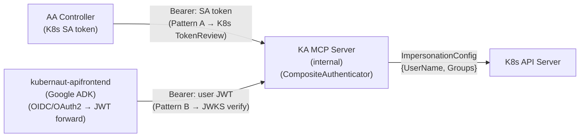

# DD-AUTH-MCP-001: MCP Endpoint Security — Trusted Intermediary Model

**Status**: Accepted
**Decision Date**: 2026-04-29
**Version**: 3.0
**Confidence**: 95%
**Deciders**: Architecture Team
**Applies To**: kubernaut-agent, kubernaut-apifrontend

**Related Business Requirements**:
- BR-INTERACTIVE-001: Interactive investigation sessions
- BR-INTERACTIVE-002: MCP tool access with user-scoped RBAC
- BR-INTERACTIVE-003: Audit attribution for interactive actions

**Related Design Decisions**:
- DD-INTERACTIVE-001: Interactive mode CRD placement and timeouts (superseded by DD-INTERACTIVE-002)
- DD-INTERACTIVE-002: Dynamic takeover model
- DD-CONSOLE-001: RHDH architecture (apifrontend as MCP gateway)

---

## Changelog

| Version | Date | Author | Changes |
|---------|------|--------|---------|
| 1.0 | 2026-04-29 | AI-assisted | Initial design: Pattern B via SA token + Impersonate-* headers |
| 2.0 | 2026-05-03 | AI-assisted | **BREAKING**: Pattern B rewritten for JWT-based identity delegation. Removed SA-token + Impersonate-header approach. Added multi-issuer architecture (KEP-3331 aligned). Forward-compatible with v1.6 SPIRE. PoC validated. AF team approved. |
| 3.0 | 2026-05-25 | AI-assisted | **BREAKING**: JWT delegation replaced by SA token trusted intermediary (#1287). AF authenticates to KA using its own SA bearer token. User identity passed as `acting_user`/`acting_user_groups` in MCP tool payload for audit only, not KA authorization. Runtime K8s impersonation removed (#1288). |

---

## Context & Problem

### Current State

Kubernaut Agent (KA) is an internal K8s service that performs autonomous AI-driven root cause analysis. It authenticates callers via K8s TokenReview + SubjectAccessReview (SAR). All K8s API calls are made using the KA service account. There is no concept of user identity for individual API calls.

Issue #703 introduces interactive mode: human users connect via MCP (Model Context Protocol) to drive or observe investigations. Interactive K8s API calls must execute under the user's identity (RBAC-scoped), not the KA service account.

### Problem Statement

How do we authenticate MCP clients, resolve their identity, and execute K8s API calls under the correct user identity -- while maintaining a clean security boundary between external OIDC authentication (in apifrontend) and internal K8s operations (in KA)?

### Constraints

- KA must remain internal-only (ClusterIP service, no ingress)
- K8s API calls during interactive sessions must respect the user's RBAC
- The same MCP endpoint must serve both in-cluster K8s clients (direct) and delegated clients (via apifrontend)
- Audit trail must attribute every action to the correct identity
- Forward-compatible with v1.6 SPIRE workload identity (#31)

---

## Decision Drivers

1. **Security boundary**: External auth isolated from K8s impersonation infrastructure
2. **Defense-in-depth**: Multiple independent verification layers for identity
3. **Tamper-proof identity**: Cryptographic signature verification, not unsigned headers
4. **Auditability**: Every impersonated K8s API call must be attributable to a resolved identity with provider metadata
5. **Backward compatibility**: Autonomous mode (KA SA) and Pattern A (direct K8s clients) completely unaffected
6. **Forward compatibility**: Multi-issuer architecture supports SPIRE addition in v1.6 without middleware refactor

---

## Alternatives Considered

### Alternative A: Dual-auth in KA (full OIDC + K8s) -- REJECTED

**Approach**: KA validates both OIDC tokens (external users) and K8s tokens (internal clients) using issuer-based routing, with full OIDC configuration (discovery, key rotation, session management).

**Pros**:
- Single deployment
- No additional service

**Cons**:
- Full OIDC stack (discovery, key rotation, session management) in the same binary that executes impersonation
- Blast radius: OIDC vulnerability exposes impersonation infrastructure
- Complexity: chain authenticator fallthrough creates non-deterministic routing

**Confidence**: 40% (rejected)

### Alternative B (v1.0): SA token + Impersonate-* headers -- SUPERSEDED

**Approach**: AF authenticates with its own SA token and injects `Impersonate-User`/`Impersonate-Group` headers. KA verifies AF's SA via TokenReview + SAR check for `impersonate` verb.

**Pros**:
- KA auth stack unchanged from v1.4

**Cons**:
- Two tokens (AF SA + user identity in headers) — more complex than necessary
- Unsigned headers — `Impersonate-*` headers are not cryptographically bound to the authenticated session
- Contradicts v1.5 header stripping (#896) — middleware strips all `Impersonate-*` headers unconditionally, requiring a "preserved copy" workaround
- Not forward-compatible with SPIRE workload identity

**Confidence**: 60% (superseded by Alternative C)

### Alternative C: JWT-based identity delegation -- CHOSEN (v2.0)

**Approach**: AF forwards the user's original Keycloak JWT to KA. KA performs lightweight JWT signature verification via JWKS (not full OIDC), extracts identity from verified claims, and uses that identity for impersonated K8s API calls.

**Pros**:
- One token, not two — AF forwards the same JWT it validated
- Tamper-proof — cryptographic signature verification, not unsigned headers
- No "preserved copy" workaround — identity comes from verified JWT claims, not stripped headers
- Forward-compatible — multi-issuer architecture adds SPIRE as a second provider in v1.6 without middleware changes
- Clean security model — KA trusts cryptographic proof, not network-level trust

**Cons**:
- KA validates JWT signatures (lightweight JWKS verification, not full OIDC)
- JWKS endpoint dependency at startup (mitigated: pre-warm with timeout, soft-disable on failure)
- JWT replay within validity window (mitigated: defense-in-depth layers, v1.6 path: short-lived internal JWTs)

**Confidence**: 95% (chosen — PoC validated, AF team approved)

**Why this differs from Alternative A**: Alternative A was rejected for bringing *full OIDC* into KA (discovery, key rotation, session management). Alternative C only performs *JWT signature verification* via a pre-configured JWKS URL — no discovery, no session management, no token exchange. The blast radius is strictly bounded to signature verification.

---

## Decision

### Chosen: Alternative C -- JWT-based identity delegation (v2.0)

KA's MCP endpoint is **internal-only** (ClusterIP, K8s TokenReview + SAR for Pattern A clients). External clients connect through `kubernaut-apifrontend`, which handles OIDC/OAuth2 authentication and **forwards the original user JWT** to KA. KA validates the JWT signature via JWKS and extracts identity from verified claims.

### Architecture



### Impersonation Model (Dual-Pattern)

#### Pattern A: Direct In-Cluster Clients (unchanged from v1.0)

Bearer token = caller's K8s token. KA resolves identity via TokenReview, uses that identity for impersonated K8s calls.

```
Client → Authorization: Bearer <caller-token>
KA     → CompositeAuthenticator → isJWT? No → K8sAuthenticator
       → TokenReview → username + groups
       → UserInfo{Username, Groups, ProviderType: "k8s:tokenreview"}
       → rest.ImpersonationConfig{UserName: username, Groups: groups}
K8s    → API call as impersonated user
```

#### Pattern B: Delegated via apifrontend (v2.0 — JWT-based)

Bearer token = user's original Keycloak JWT. KA validates signature via JWKS, extracts identity from verified claims.

```
apifrontend → Authorization: Bearer <user-keycloak-jwt>
KA          → CompositeAuthenticator → isJWT? Yes → JWTAuthenticator
            → Parse JWT (unverified) → extract iss claim
            → Route to matching JWTProviderConfig by issuer URL
            → Verify signature against JWKS endpoint
            → Extract username from configured claim path (e.g., preferred_username)
            → Extract groups from configured claim path (e.g., groups)
            → UserInfo{Username, Groups, ProviderType: "jwt:<issuer>"}
            → SAR check (username has create services/kubernaut-agent)
            → rest.ImpersonationConfig{UserName, Groups}
K8s         → API call as user
```

### CompositeAuthenticator Routing Logic

```go
func (c *CompositeAuthenticator) ValidateTokenFull(ctx context.Context, token string) (UserInfo, error) {
    if !isJWT(token) {
        return c.k8sAuth.ValidateTokenFull(ctx, token)
    }

    userInfo, err := c.jwtAuth.ValidateTokenFull(ctx, token)
    if err != nil {
        if errors.Is(err, ErrIssuerNotFound) {
            // Unknown issuer → fall back to K8s TokenReview
            return c.k8sAuth.ValidateTokenFull(ctx, token)
        }
        // Known issuer, bad token → fail-closed, NO fallback
        return UserInfo{}, err
    }
    return userInfo, nil
}
```

**Critical security property**: `ErrIssuerNotFound` (unknown provider → fallback) vs `ErrTokenInvalid` (known provider, bad token → fail-closed). This prevents an attacker from forging a JWT with a known issuer to bypass into the K8s TokenReview path.

### Multi-Issuer Architecture (KEP-3331 aligned)

KA supports multiple JWT providers via `InteractiveConfig.JWTProviders`:

```yaml
interactive:
  enabled: true
  jwtProviders:
    - name: "keycloak"
      issuer: "https://keycloak.example.com/realms/kubernaut"
      jwksURL: "https://keycloak.example.com/realms/kubernaut/protocol/openid-connect/certs"
      audience: "kubernaut-agent"
      claimMappings:
        username: "preferred_username"
        groups: "groups"
    # v1.6: SPIRE provider added here without middleware changes
    # - name: "spire"
    #   issuer: "spiffe://cluster.local"
    #   jwksURL: "https://spire-server:8081/keys"
    #   audience: "kubernaut-agent"
```

v1.5 ships with one provider (Keycloak). v1.6 adds SPIRE as a second provider — the CompositeAuthenticator and JWTAuthenticator require zero changes.

### Header Stripping (Defense-in-Depth — unchanged)

Middleware strips ALL `Impersonate-*` headers at entry, before any processing. This is orthogonal to Pattern B's JWT-based identity extraction:

```go
r.Header.Del("Impersonate-User")
r.Header.Del("Impersonate-Group")
r.Header.Del("Impersonate-Uid")
for key := range r.Header {
    if strings.HasPrefix(strings.ToLower(key), "impersonate-extra-") {
        r.Header.Del(key)
    }
}
```

Pattern B extracts identity from **verified JWT claims**, not from HTTP headers. The header stripping defense layer remains active for both patterns.

### JWKS Pre-warm at Startup

`NewJWTAuthenticator` performs a synchronous JWKS fetch with a 15-second timeout for each configured provider during construction:

```go
jwtAuth, err := auth.NewJWTAuthenticator(entries, logger)
if err != nil {
    logger.Error(err, "failed to create JWTAuthenticator; Pattern B disabled, Pattern A active")
    // authenticator = k8sAuth (Pattern A only)
} else {
    authenticator = auth.NewCompositeAuthenticator(jwtAuth, k8sAuth)
}
```

If **any** provider's JWKS endpoint is unreachable at startup, `NewJWTAuthenticator` returns an error and the `CompositeAuthenticator` is not created — Pattern B is disabled **globally**. Pattern A (K8s TokenReview) remains fully operational. For v1.5 with a single OIDC provider (Keycloak), this is equivalent to per-provider disable. Per-provider degradation may be added in v1.6 when SPIRE is introduced as a second provider.

### Non-K8s Tool Calls

Prometheus, DataStorage, and log queries use KA SA (no user-level auth available on those systems). This is a known limitation documented in Known Limitations.

### Layered Error Model

| Layer | Format | When |
|-------|--------|------|
| HTTP (auth) | RFC 7807 Problem JSON | 401/403 before MCP handler |
| HTTP (rate limit) | Plain text + `Retry-After` header | 429 |
| MCP tool | JSON-RPC `error` object | Tool-level failures |

### Error Taxonomy (Stable Codes)

| Code | HTTP | Human Message | Next Step |
|------|------|---------------|-----------|
| `auth_required` | 401 | "Authentication required" | "Provide Bearer token" |
| `auth_failed` | 401 | "Token validation failed" | "Check token validity" |
| `rbac_denied` | 403 | "Insufficient permissions" | "Request access from cluster admin" |
| `lease_held` | -- | "Session controlled by {user} since {time}" | "Wait for release or observe" |
| `session_timeout` | -- | "Session ended due to inactivity" | "Reconnect to start a new session" |
| `session_not_found` | -- | "Session not found or expired" | "Start a new investigation session" |
| `investigation_ended` | -- | "Investigation has completed" | "View results in audit trail" |
| `global_timeout` | -- | "Investigation time limit reached" | "Review findings in audit trail" |
| `rate_limited` | 429 | "Too many requests" | "Retry after {seconds} seconds" |

### Feature Gate Naming Convention

| Location | Key |
|----------|-----|
| Config.go field | `Interactive InteractiveConfig` |
| Helm values | `kubernautAgent.interactive.enabled` |
| Operator CR | `spec.kubernautAgent.interactive.enabled` |
| ConfigMap rendered | `interactive.enabled` |
| JWT providers | `kubernautAgent.interactive.jwtProviders[]` |

### Metric Definitions

| Metric | Type | Description |
|--------|------|-------------|
| `aiagent_mcp_interactive_sessions_active` | Gauge | Currently active interactive sessions |
| `aiagent_mcp_interactive_takeover_total` | Counter | Total takeover events |
| `aiagent_mcp_interactive_lease_contention_total` | Counter | Lease acquisition failures (contention) |
| `aiagent_mcp_interactive_command_duration_seconds` | Histogram | Duration of interactive tool calls |
| `aiagent_mcp_auth_provider_total` | Counter | Authentication attempts by provider type (jwt, k8s) |

### Data Classification Policy

| Event Type | Classification | Redaction |
|------------|---------------|-----------|
| `aiagent.interactive.k8s_call` | Sensitive | Redact Secret data values from payloads |
| `aiagent.llm.request` | Internal | Configurable prompt verbosity |
| `aiagent.llm.response` | Internal | Configurable response verbosity |
| `aiagent.session.*` | Operational | No redaction needed |
| `aiagent.auth.jwt_validated` | Operational | Log issuer + username, NOT token value |

---

## Consequences

### Positive Consequences
1. Clean security boundary: KA performs lightweight JWT signature verification, not full OIDC
2. Tamper-proof identity: Cryptographic signature verification replaces unsigned `Impersonate-*` headers
3. KA auth stack for Pattern A unchanged from v1.4 (zero regression risk for autonomous mode)
4. Forward-compatible: multi-issuer architecture supports SPIRE in v1.6 without middleware changes
5. Full audit trail with user attribution including provider metadata (ProviderType)
6. Apifrontend integration simplified: JWT pass-through, no token minting required

### Negative Consequences
1. KA gains a JWKS dependency at startup
   - **Mitigation**: Pre-warm with 15s timeout; failure disables Pattern B globally but Pattern A is unaffected
2. JWT replay within validity window
   - **Mitigation**: Defense-in-depth (ClusterIP, NetworkPolicy, K8s RBAC scoping, audit trail). v1.6: AF mints short-lived (30s) internal JWTs
3. Non-K8s tools (Prometheus, DS) use KA SA -- no user-level auth
   - **Mitigation**: Prometheus has no user-level auth. DS access is internal. Documented as known trust boundary

### Risks

| Risk | Likelihood | Impact | Mitigation |
|------|-----------|--------|------------|
| JWKS endpoint unavailable at startup | Medium | Low | Pre-warm with 15s timeout; Pattern B disabled globally; Pattern A unaffected |
| JWT replay within validity window | Medium | Medium | Defense-in-depth; v1.6: short-lived internal JWTs |
| ClusterRoleBinding group misconfiguration | Low | Medium | Helm values documentation; integration test; Helm template test |
| Breaking Pattern A auth | Low | Critical | CompositeAuthenticator passthrough; existing test regression suite |
| alg confusion attack (alg:none, HS256) | Low | Critical | RS256-only allowlist; explicit alg validation; PoC test verified |

---

## Compliance

| Requirement | Status | Notes |
|-------------|--------|-------|
| BR-INTERACTIVE-001 | Active | Interactive sessions via MCP |
| BR-INTERACTIVE-002 | Active | User-scoped RBAC via JWT-based impersonation |
| BR-INTERACTIVE-003 | Active | Audit attribution via `acting_user` + `session_id` + `provider_type` |

---

## Validation Strategy

1. TP-1009 test plan: 31 unit tests + 9 integration tests across 5 checkpoints
2. Unit tests for JWTAuthenticator (JWKS verification, claim extraction, multi-issuer routing)
3. Unit tests for CompositeAuthenticator (token routing, fail-closed semantics, Pattern A passthrough)
4. Integration tests for full middleware pipeline with mock JWKS
5. Security-adversarial tests: alg:none rejection, cross-provider rejection, expired JWT, claim injection
6. Pattern A regression: existing auth test suite unchanged and passing
7. Helm template tests: ClusterRoleBinding rendering with JWT group

---

## Known Limitations

1. **Session HA**: In-memory session store. Pod restart loses sessions. Recovery: Lease expires (30s), client reconnects, conversation reconstructed from DS audit events. v1.6 path: kubernaut#892 (persistent session store).
2. **Impersonation scope unbounded (H-SEC-1)**: K8s doesn't support `resourceNames` for users/groups impersonation. Defense-in-depth: (1) apifrontend CEL validation, (2) NetworkPolicy, (3) K8s audit logs, (4) KA `EventTypeInteractiveK8sCall` audit events.
3. **Non-K8s tools use KA SA**: Prometheus and DS queries during interactive mode execute under KA SA, not user identity. These systems lack user-level authentication.
4. **SAR granularity**: One SAR (`services/kubernaut-agent/create`) for all MCP callers. No per-tool authorization. v1.6 path: per-tool SAR.
5. **JWT replay**: Forwarded JWT can be replayed within its validity window. Mitigated by defense-in-depth (ClusterIP, NetworkPolicy, K8s RBAC scoping, audit trail). v1.6 path: AF mints short-lived (30s) internal JWTs.
6. **No `jti` dedup**: No JWT ID tracking for replay detection. Acceptable for v1.5 given internal-only network. v1.6 consideration.
7. **Claim mapping simplicity**: v1.5 uses dot-notation paths, not CEL expressions. Sufficient for Keycloak. v1.6 may adopt CEL for parity with AF (KEP-3331).

## Graceful Degradation (M-PROD-2)

Apifrontend is optional. KA operates independently for autonomous remediation. Interactive mode is additive -- apifrontend outage affects only interactive clients, not the autonomous pipeline. JWKS pre-warm failure disables Pattern B only; Pattern A continues to function.

## User Documentation (H-PROD-1)

PR6 (hard requirement) creates `docs/user-guide/interactive-mode.md` covering: how to enable (Helm/operator), how to connect (MCP client examples), available tools, disconnect/reconnect behavior, error handling. Ships with the feature, not deferred. Tracked by kubernaut#899.

---

## References

- [DD-INTERACTIVE-002](DD-INTERACTIVE-002-dynamic-takeover-model.md): Dynamic takeover model
- [PROPOSAL-EXT-001](../proposals/PROPOSAL-EXT-001-external-integration-strategy.md): External integration strategy
- [ADR-038](ADR-038-async-buffered-audit-ingestion.md): Async buffered audit ingestion
- kubernaut-operator#26: KA SA `impersonate` RBAC
- kubernaut#895: Authenticator `ValidateTokenFull` returning groups
- kubernaut#896: Impersonation header stripping in middleware
- kubernaut#1009: Pattern B trust-boundary mechanism
- kubernaut-apifrontend#2: KEP-3331 multi-provider OIDC
- kubernaut-apifrontend#3: MCP-to-MCP proxy (JWT forwarding)
- kubernaut-apifrontend#55: End-to-end authz enforcement
- kubernaut-apifrontend#31: SPIFFE workload identity binding (v1.6)
- TP-1009: Test plan (docs/tests/1009/TEST_PLAN.md)

---

## v1.0 → v2.0 Migration Notes

### What changed
- **Pattern B mechanism**: SA-token + Impersonate-* headers → JWT-based identity delegation
- **KA auth responsibility**: Pure K8s TokenReview → CompositeAuthenticator (K8s TokenReview + lightweight JWT JWKS verification)
- **Identity extraction**: HTTP headers (unsigned) → JWT claims (cryptographically signed)
- **`extractEffectiveUser` function**: Removed. Identity comes from CompositeAuthenticator, not from preserved header inspection

### What did NOT change
- **Pattern A**: Completely unchanged. K8s SA tokens validated via TokenReview
- **Header stripping**: `stripImpersonationHeaders` remains active for defense-in-depth
- **SAR authorization**: Both patterns go through SAR check
- **Error model**: RFC 7807 + JSON-RPC error codes unchanged
- **Feature gates**: Same `interactive.enabled` gate
- **Metrics, data classification, session management**: Unchanged

---

**Document Version**: 2.0
**Last Updated**: 2026-05-03
