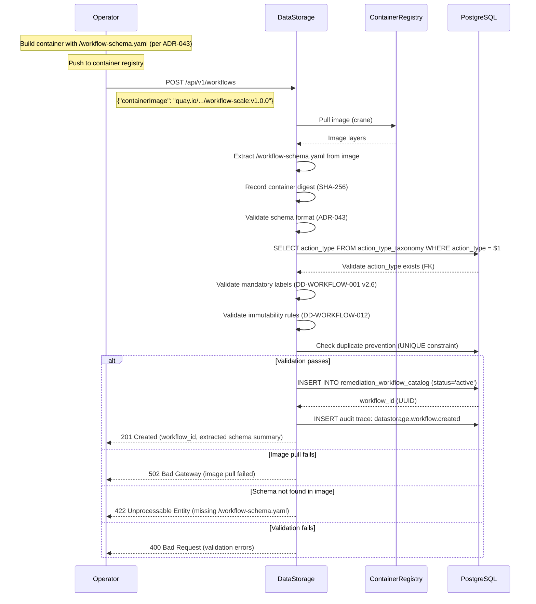
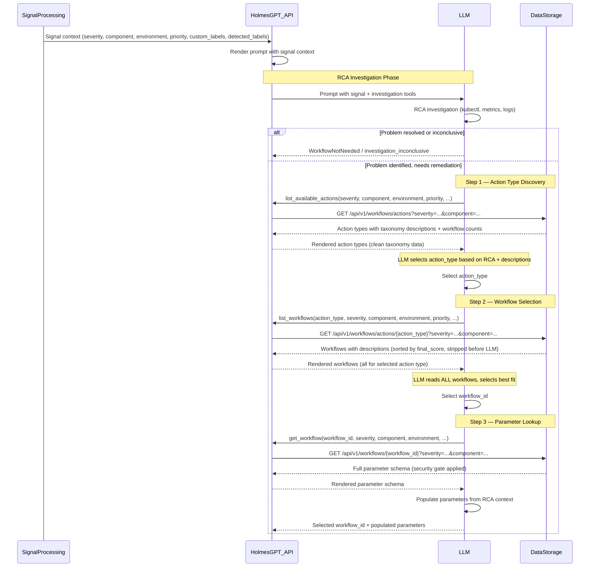
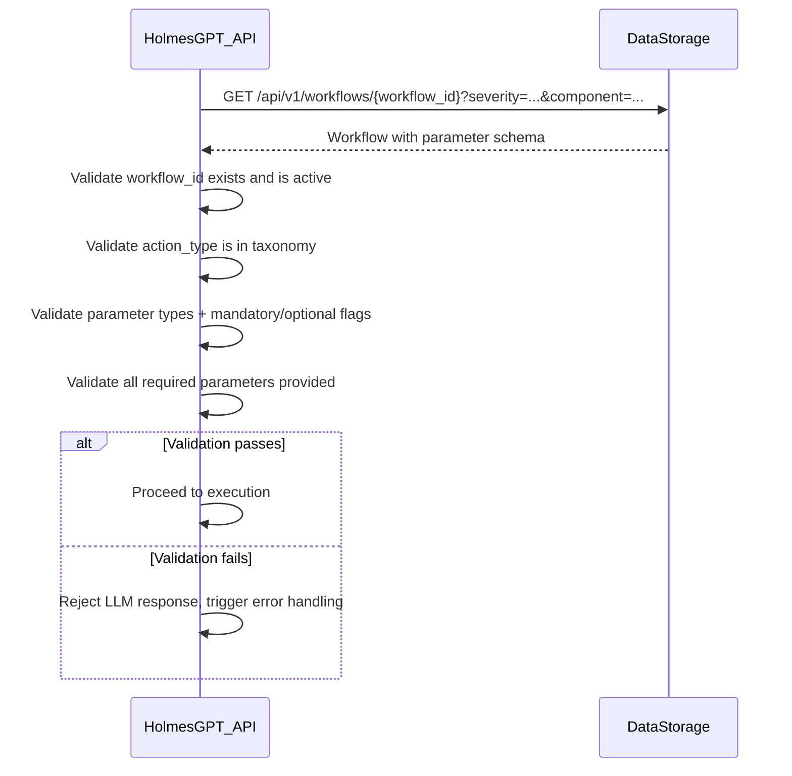
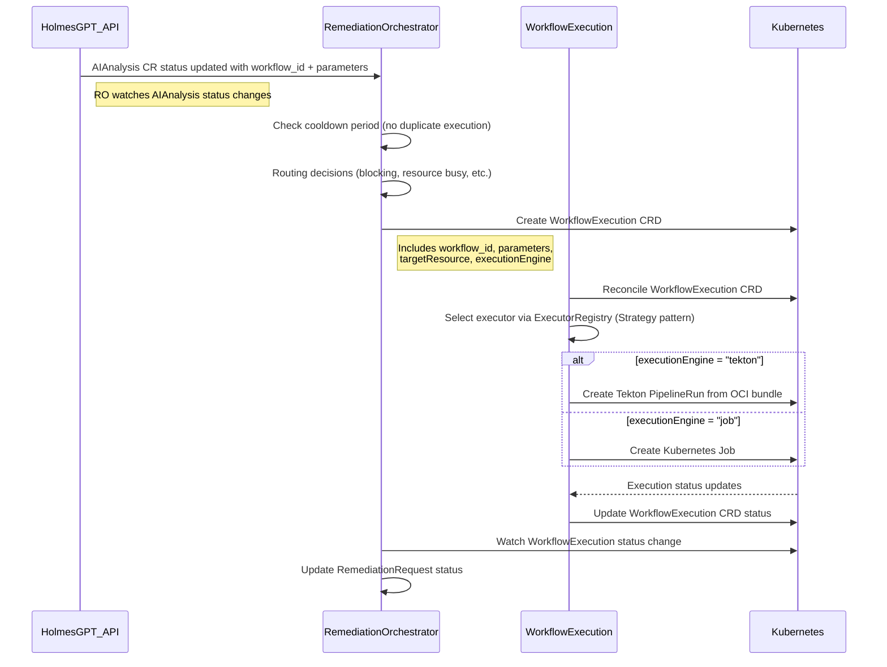
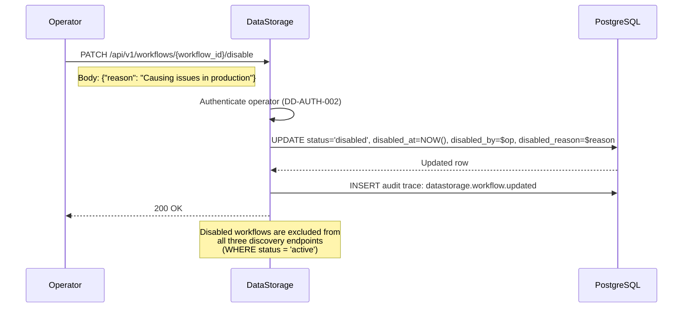
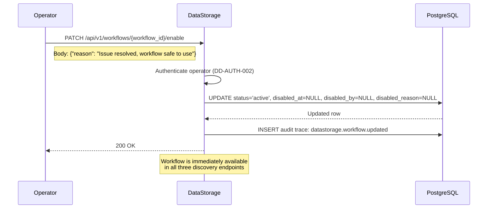
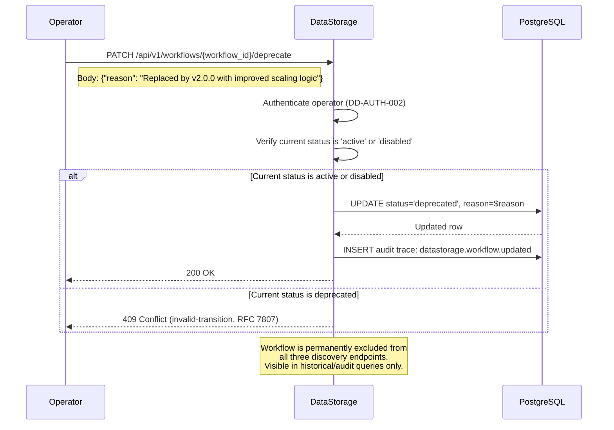
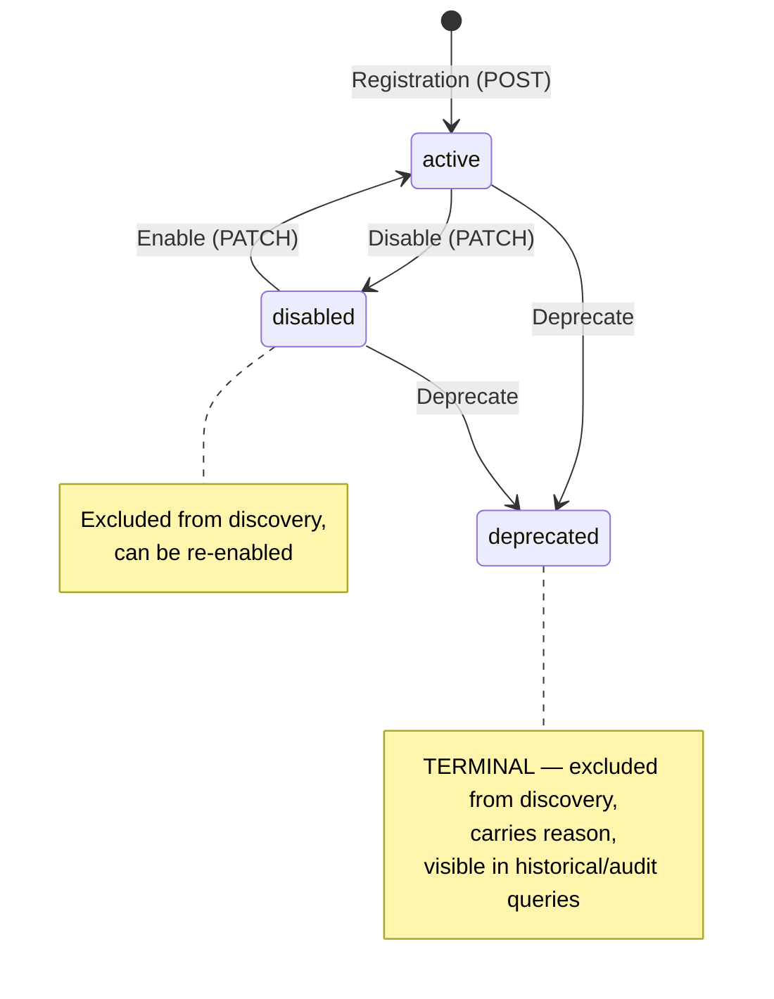
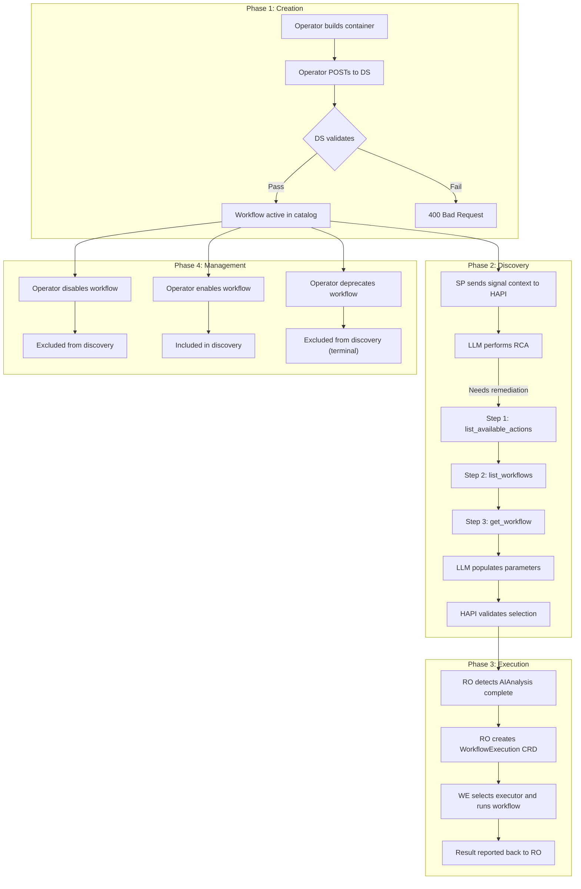

# DD-WORKFLOW-017: Workflow Lifecycle Component Interactions

**Date**: February 5, 2026
**Status**: Approved
**Decision Maker**: Kubernaut Architecture Team
**Authority**: AUTHORITATIVE - This document governs the end-to-end workflow lifecycle and component interactions
**Affects**: Data Storage Service, HolmesGPT API, Remediation Orchestrator, Signal Processing, Workflow Execution
**Related**: DD-WORKFLOW-016 (Action-Type Indexing), DD-WORKFLOW-012 (Immutability Constraints), DD-STORAGE-008 (Catalog Schema), DD-WORKFLOW-001 v2.6 (Label Schema), DD-AUDIT-003 (Audit Trace), DD-AUTH-002 (Authentication), DD-004 (RFC 7807 Error Responses)
**Supersedes**: DD-WORKFLOW-005 (Schema Extraction), DD-WORKFLOW-007 (Manual Registration)
**Version**: 1.0

---

## Changelog

### Version 1.0 (2026-02-05) -- CURRENT

- Initial version defining end-to-end workflow lifecycle
- Consolidates workflow creation, discovery, usage, and disable/enable in one document
- Aligned with `action_type` design (DD-WORKFLOW-016) and three-step discovery protocol
- Supersedes DD-WORKFLOW-005 (registration) and DD-WORKFLOW-007 (manual registration)
- V1.0 scope only: manual REST API registration

---

## Problem Statement

Workflow lifecycle documentation is fragmented across multiple documents that predate the `action_type` paradigm shift (DD-WORKFLOW-016):

- **DD-WORKFLOW-005** covers schema extraction and registration but uses the `signal_type`-based design and mixes V1.0, V1.1, and V1.2 scopes in a single document
- **DD-WORKFLOW-007** describes CLI-based manual registration, already partially superseded by the CRD approach
- **DD-WORKFLOW-008** is a version roadmap, not a component interaction specification

No single document provides a consolidated view of how components interact across the full workflow lifecycle with the `action_type` design. This creates ambiguity for implementers who need to understand the end-to-end flow for creation, discovery, usage, and operational management of workflows.

---

## Decision

Define a single authoritative document (this DD) that describes the complete workflow lifecycle for V1.0, covering four phases:

1. **Creation** (Registration): How workflows enter the catalog
2. **Discovery** (Three-Step Protocol): How the LLM discovers and selects workflows
3. **Usage** (Execution): How selected workflows are executed
4. **Operational Management** (Disable/Enable/Deprecate): How workflows are managed post-creation

Each phase specifies the components involved, the API calls between them, the validation rules, and the audit traces emitted.

---

## Scope

**V1.0 only**. This document describes the current implementation scope:

- Manual REST API registration (no CRD automation)
- `action_type`-based catalog indexing (DD-WORKFLOW-016)
- Three-step LLM discovery protocol
- Disable/enable via REST API

**Out of scope** (deferred to future versions):
- CRD-based automated registration (V1.1)
- CLI registration tool (V1.2)
- Image signing and verification (V1.2)
- Workflow versioning and rollback UI (V1.2)

---

## Components

| Component | Abbreviation | Role in Workflow Lifecycle |
|-----------|-------------|---------------------------|
| **Data Storage** | DS | Workflow catalog CRUD, OCI schema extraction, validation, audit traces |
| **HolmesGPT API** | HAPI | LLM tool orchestration, three-step discovery, post-selection validation |
| **Signal Processing** | SP | Signal enrichment, context labels |
| **Remediation Orchestrator** | RO | End-to-end remediation lifecycle management. Creates and watches CRDs sequentially (SP -> AIAnalysis -> WorkflowExecution -> Notification). Makes all routing decisions. |
| **Workflow Execution** | WE | Pure executor (no routing logic). Reconciles WorkflowExecution CRDs, selects execution engine (Tekton PipelineRun or Kubernetes Job per BR-WE-014), creates and monitors execution primitives. |
| **Operator** | -- | Human actor: registers, disables/enables workflows |
| **LLM** | -- | AI model: performs RCA, selects action type and workflow |

---

## Phase 1: Workflow Creation (Registration)

### Overview

In V1.0, workflows are registered manually by an operator via the Data Storage REST API. The operator builds a container image (OCI bundle) containing the workflow implementation and a `/workflow-schema.yaml` file (per ADR-043), pushes it to a container registry, and then provides only the **OCI image pullspec** to DS. DS pulls the image, extracts the `/workflow-schema.yaml`, validates it, and populates the catalog.

**Key design principle**: The OCI image is the **single source of truth** for all workflow metadata. The operator does not provide workflow metadata, labels, parameters, or descriptions in the registration request -- all of this is extracted from the `/workflow-schema.yaml` inside the image. This prevents tampering and ensures that the catalog entry always reflects exactly what is in the container that will be executed.

### Component Flow



### Registration Payload

The operator submits **only the OCI image pullspec** to `POST /api/v1/workflows`:

```json
{
  "containerImage": "quay.io/kubernaut-ai/workflow-scale-conservative:v1.0.0"
}
```

DS extracts all workflow metadata from the `/workflow-schema.yaml` inside the image (per ADR-043):

- `metadata.workflow_id`, `metadata.version`, `metadata.description`
- `labels` (severity, component, environment, action_type, etc.)
- `parameters` (name, type, required, constraints, etc.)
- `execution.engine` (tekton, job, etc.)

**Why pullspec-only registration?**

1. **Anti-tampering**: The catalog entry is guaranteed to match the container that will execute. An operator cannot register metadata that differs from the actual workflow image.
2. **Single source of truth**: The OCI image is the authoritative source. There is no ambiguity about where metadata lives.
3. **Decoupling**: The workflow definition is self-contained in the image. Registration is a discovery operation, not a data entry operation.

### Schema Extraction

DS extracts the schema using a container image inspection tool (e.g., `crane`):

1. Pull the image from the registry
2. Extract `/workflow-schema.yaml` from the image filesystem
3. Parse and validate the YAML against the ADR-043 schema definition
4. Record the image's SHA-256 digest for audit trail integrity

If the image does not contain `/workflow-schema.yaml` at the root, registration is rejected with a clear error.

### Validation Rules

After extracting the schema from the image, DS validates the following in order. All error responses use **RFC 7807 Problem Details** format per DD-004 (`Content-Type: application/problem+json`):

| # | Validation | Authority | HTTP Status | Error Type (DD-004) |
|---|-----------|-----------|-------------|---------------------|
| 1 | Image is pullable from registry | Infrastructure | 502 | `image-pull-failed` |
| 2 | `/workflow-schema.yaml` exists in image | ADR-043 | 422 | `schema-not-found` |
| 3 | Schema format valid (required fields, types) | ADR-043 | 400 | `validation-error` |
| 4 | `action_type` exists in `action_type_taxonomy` table | DD-WORKFLOW-016 (FK) | 400 | `unknown-action-type` |
| 5 | Mandatory labels present: `severity`, `component`, `environment` | DD-WORKFLOW-001 v2.6 | 400 | `validation-error` |
| 6 | `workflow_name` + `version` is unique (UNIQUE constraint) | DD-WORKFLOW-012 | 409 | `duplicate-workflow` |
| 7 | Description is non-empty | DD-WORKFLOW-012 | 400 | `validation-error` |
| 8 | At least one parameter defined OR explicit empty list | ADR-043 | 400 | `validation-error` |

#### RFC 7807 Error Examples

**Validation #1 — Image pull failed (502)**:

```json
{
  "type": "https://kubernaut.ai/problems/image-pull-failed",
  "title": "Bad Gateway",
  "detail": "Failed to pull image 'quay.io/kubernaut-ai/workflow-scale-conservative:v1.0.0': connection refused",
  "status": 502,
  "instance": "/api/v1/workflows"
}
```

**Validation #2 — Schema file not found (422)**:

```json
{
  "type": "https://kubernaut.ai/problems/schema-not-found",
  "title": "Unprocessable Entity",
  "detail": "Image 'quay.io/kubernaut-ai/workflow-scale-conservative:v1.0.0' does not contain /workflow-schema.yaml at the root filesystem (required by ADR-043)",
  "status": 422,
  "instance": "/api/v1/workflows"
}
```

**Validation #4 — Unknown action type (400)**:

```json
{
  "type": "https://kubernaut.ai/problems/unknown-action-type",
  "title": "Bad Request",
  "detail": "action_type 'ScaleToZero' is not registered in the action_type_taxonomy. Valid action types: ScaleReplicas, IncreaseCPULimits, RestartPod, RollbackDeployment",
  "status": 400,
  "instance": "/api/v1/workflows"
}
```

**Validation #6 — Duplicate workflow (409)**:

```json
{
  "type": "https://kubernaut.ai/problems/duplicate-workflow",
  "title": "Conflict",
  "detail": "Workflow 'scale-conservative' version '1.0.0' already exists (workflow_id: 550e8400-e29b-41d4-a716-446655440000)",
  "status": 409,
  "instance": "/api/v1/workflows"
}
```

### Audit Trace

On successful creation, DS emits:

| Event Type | Description | Authority |
|-----------|-------------|-----------|
| `datastorage.workflow.created` | Workflow added to catalog | DD-AUDIT-003 |

The audit trace includes: `workflowId`, `workflowName`, `version`, `actionType`, `containerImage`, `containerDigest` (SHA-256), `createdBy` (operator identity from auth context per DD-AUTH-002).

### Authentication

`POST /api/v1/workflows` requires authenticated operator identity per DD-AUTH-002. The operator's identity is captured in the `created_by` field and the audit trace for SOC2 CC8.1 (Attribution) compliance.

---

## Phase 2: Workflow Discovery (Three-Step Protocol)

### Overview

When a signal is detected that requires remediation, the LLM discovers available workflows through a three-step protocol defined in DD-WORKFLOW-016. This section describes the component interactions for the full discovery flow.

### Component Flow



### Step Details

Each step is fully specified in DD-WORKFLOW-016. This section provides the component interaction summary:

| Step | Tool | DS Endpoint | Input | Output | Authority |
|------|------|-------------|-------|--------|-----------|
| 1 | `list_available_actions` | `GET /api/v1/workflows/actions` | Signal context filters | Action types from taxonomy + workflow count | DD-WORKFLOW-016 |
| 2 | `list_workflows` | `GET /api/v1/workflows/actions/{action_type}` | Action type + signal context filters | Workflows with descriptions (paginated) | DD-WORKFLOW-016 |
| 3 | `get_workflow` | `GET /api/v1/workflows/{workflow_id}` | Workflow ID + signal context filters (security gate) | Full parameter schema | DD-WORKFLOW-016 |

### Filter Parity

All three DS endpoints apply the **same context filters**: severity, component, environment, priority, custom_labels, detected_labels. This is a security guarantee -- see DD-WORKFLOW-016 for details.

### Pagination

Steps 1 and 2 support pagination (default 10 items per page). Step 3 returns a single workflow or an error. For Step 1 (action type selection), the LLM may select from the first page if a clear match exists, requesting additional pages only if needed. For Step 2 (workflow selection), the LLM **must review ALL available workflows** before making a decision -- if `has_more` is true, the LLM must request subsequent pages until all workflows have been reviewed. This prevents premature selection of a less effective workflow.

### HAPI Post-Selection Validation

After the LLM returns its selected `workflow_id` and populated parameters, HAPI validates the selection by querying DS directly:



This validation uses **current data** from DS (not cached), ensuring the workflow has not been disabled or modified since the LLM's discovery queries. See DD-WORKFLOW-016 HAPI Validation section.

### Audit Traces

Discovery generates audit traces at the DS data layer for each step:

| Event Type | Component | Description | Authority |
|-----------|-----------|-------------|-----------|
| `workflow.catalog.actions_listed` | DS | Action types returned for signal context (Step 1) | DD-WORKFLOW-014 v3.0 |
| `workflow.catalog.workflows_listed` | DS | Workflows returned for selected action type (Step 2) | DD-WORKFLOW-014 v3.0 |
| `workflow.catalog.workflow_retrieved` | DS | Single workflow parameter schema retrieved (Step 3) | DD-WORKFLOW-014 v3.0 |
| `workflow.catalog.selection_validated` | DS | HAPI post-selection validation re-query result | DD-WORKFLOW-014 v3.0 |

**Note**: HAPI does **not** emit audit events. All discovery audit events are generated by DS at the data layer (per DD-AUDIT-001 and DD-WORKFLOW-014 v3.0).

---

## Phase 3: Workflow Execution

### Overview

After HAPI validates the LLM's selection, the AIAnalysis CR status is updated with the selected workflow and parameters. The Remediation Orchestrator (RO) -- which owns the end-to-end remediation lifecycle -- detects this status change and creates a WorkflowExecution CRD. The Workflow Execution (WE) controller -- a pure executor with no routing logic -- reconciles the CRD, selects the appropriate execution engine (Tekton PipelineRun or Kubernetes Job per BR-WE-014), and creates the execution primitive.

### Component Flow



### Execution Context

The WorkflowExecution CRD includes:

| Field | Source | Description |
|-------|--------|-------------|
| `workflowId` | LLM selection (validated by HAPI) | UUID of the workflow to execute |
| `executionEngine` | From workflow catalog entry (`execution.engine`) | `"tekton"` or `"job"` (per BR-WE-014) |
| `parameters` | LLM-populated (validated by HAPI) | Workflow parameters as key-value pairs |
| `targetResource` | Signal context | Kubernetes resource to remediate |
| `signalFingerprint` | SP | Unique identifier for the triggering signal |

**Note**: The `executionEngine` field is mandatory on the WorkflowExecution CRD. WE uses the `ExecutorRegistry` (Strategy pattern) to select the correct executor (`TektonExecutor` or `JobExecutor`) based on this field.

### Audit Traces

Execution generates audit traces across RO and WE:

| Event Type | Component | Description | Authority |
|-----------|-----------|-------------|-----------|
| `remediation.execution.started` | RO | WorkflowExecution CRD created | DD-AUDIT-003 |
| `workflow.execution.completed` | WE | PipelineRun or Job finished (success/failure) | DD-AUDIT-003 |
| `remediation.execution.completed` | RO | Overall remediation result | DD-AUDIT-003 |

**Note**: Discovery audit events (`workflow.catalog.*`) are listed in Phase 2. LLM decision audit events are generated by the AI Analysis Controller.

---

## Phase 4: Operational Management

### 4.1 Disable Workflow

Operators can disable a workflow to prevent it from appearing in discovery results without deleting it. This is a mutable status change per DD-WORKFLOW-012.



**Effect on Discovery**: A disabled workflow is immediately excluded from:
- `GET /api/v1/workflows/actions` (Step 1) -- action types with zero active workflows are not returned
- `GET /api/v1/workflows/actions/{action_type}` (Step 2) -- disabled workflows filtered out
- `GET /api/v1/workflows/{workflow_id}` (Step 3) -- returns 404 Not Found for a disabled workflow

**Step 3 security gate — 404 Not Found (RFC 7807)**:

When Step 3 (`get_workflow`) receives a `workflow_id` that either does not exist, is not active, or does not match the signal context filters, DS returns 404. This prevents the LLM from using workflows outside the allowed context (defense-in-depth per DD-WORKFLOW-016):

```json
{
  "type": "https://kubernaut.ai/problems/workflow-not-found",
  "title": "Not Found",
  "detail": "No active workflow found for id '550e8400-...' matching the provided signal context filters",
  "status": 404,
  "instance": "/api/v1/workflows/550e8400-e29b-41d4-a716-446655440000"
}
```

**Note**: The error intentionally does not distinguish between "workflow does not exist", "workflow is disabled/deprecated", and "workflow exists but doesn't match filters". This prevents information leakage about catalog contents.

### 4.2 Enable Workflow

Operators can re-enable a previously disabled workflow.



### 4.3 Deprecate Workflow

Operators can deprecate a workflow to permanently remove it from discovery. This is a **terminal state** -- a deprecated workflow cannot be re-enabled or disabled. To provide the same remediation capability, the operator must register a new workflow version. Deprecated workflows remain visible in historical and audit queries.



**Effect on Discovery**: Identical to disable -- the workflow is immediately excluded from all three discovery endpoints. Unlike disable, this is irreversible.

### 4.4 Status Transitions

The following status transitions are allowed per DD-WORKFLOW-012:



**Terminal state**: `deprecated` is a terminal state. Once a workflow is deprecated, it cannot be re-enabled or disabled. To offer the same remediation capability, the operator must register a new workflow version. Deprecated workflows remain visible in historical and audit queries (e.g., "which workflow was used in remediation #12345?") but are excluded from all three discovery endpoints.

All lifecycle PATCH endpoints require a mandatory `reason` field in the request body (e.g., `{"reason": "Causing OOM in production"}`). This reason is recorded in the audit event payload for SOC2 traceability.

| Transition | Endpoint | Mutable Fields Changed | Audit Event |
|-----------|----------|----------------------|-------------|
| `active -> disabled` | `PATCH /api/v1/workflows/{id}/disable` | `status`, `disabled_at`, `disabled_by`, `disabled_reason` | `datastorage.workflow.updated` |
| `disabled -> active` | `PATCH /api/v1/workflows/{id}/enable` | `status`, `disabled_at` (NULL), `disabled_by` (NULL), `disabled_reason` (NULL) | `datastorage.workflow.updated` |
| `active -> deprecated` | `PATCH /api/v1/workflows/{id}/deprecate` | `status`, `reason` | `datastorage.workflow.updated` |
| `disabled -> deprecated` | `PATCH /api/v1/workflows/{id}/deprecate` | `status`, `reason` | `datastorage.workflow.updated` |

**Invalid transitions** (rejected with 409 Conflict, RFC 7807 per DD-004):

| Attempted Transition | Error Type (DD-004) |
|---------------------|---------------------|
| `deprecated -> active` | `invalid-transition` |
| `deprecated -> disabled` | `invalid-transition` |

**RFC 7807 example — Invalid transition (409)**:

```json
{
  "type": "https://kubernaut.ai/problems/invalid-transition",
  "title": "Conflict",
  "detail": "Cannot enable workflow 'scale-conservative' (550e8400-...): current status 'deprecated' is terminal. Register a new workflow version instead.",
  "status": 409,
  "instance": "/api/v1/workflows/550e8400-e29b-41d4-a716-446655440000/enable"
}
```

**Missing reason field (400)**:

All lifecycle PATCH endpoints reject requests without a `reason` field:

```json
{
  "type": "https://kubernaut.ai/problems/validation-error",
  "title": "Bad Request",
  "detail": "Field 'reason' is required for all lifecycle transitions",
  "status": 400,
  "instance": "/api/v1/workflows/550e8400-e29b-41d4-a716-446655440000/disable"
}
```

### 4.5 Audit Trace Payload for Lifecycle Transitions

All lifecycle transitions emit a `datastorage.workflow.updated` audit event using the `CommonEnvelope` format (per ADR-034). The payload **must** include the previous and new status to provide full auditability:

```json
{
  "version": "1.0",
  "service": "data-storage",
  "operation": "workflow_status_changed",
  "status": "success",
  "payload": {
    "workflowId": "550e8400-e29b-41d4-a716-446655440000",
    "workflowName": "scale-conservative",
    "actionType": "ScaleReplicas",
    "previousStatus": "active",
    "newStatus": "disabled",
    "reason": "Causing issues in production",
    "updatedBy": "operator@example.com"
  }
}
```

| Payload Field | Type | Required | Description |
|--------------|------|----------|-------------|
| `workflowId` | string | Yes | UUID of the workflow |
| `workflowName` | string | Yes | Human-readable workflow name |
| `actionType` | string | Yes | The workflow's action type (for querying by action) |
| `previousStatus` | string | Yes | Status before the transition |
| `newStatus` | string | Yes | Status after the transition |
| `reason` | string | Yes | Mandatory on all transitions (disable, enable, deprecate) |
| `updatedBy` | string | Yes | Operator identity from auth context |

### 4.6 Authentication

All operational management endpoints require authenticated operator identity per DD-AUTH-002:

| Endpoint | HTTP Method | SOC2 Control |
|----------|-------------|-------------|
| `POST /api/v1/workflows` | POST | CC8.1 (Attribution) |
| `PATCH /api/v1/workflows/{id}/disable` | PATCH | CC8.1 (Attribution) |
| `PATCH /api/v1/workflows/{id}/enable` | PATCH | CC8.1 (Attribution) |
| `PATCH /api/v1/workflows/{id}/deprecate` | PATCH | CC8.1 (Attribution) |

---

## Cross-Reference: Authoritative Documents

This DD consolidates the workflow lifecycle but does **not** supersede the following authoritative documents:

| Document | Remains Authoritative For | Referenced In |
|----------|--------------------------|---------------|
| **DD-WORKFLOW-012** | Immutability constraints (mutable vs immutable fields) | Phase 1 (validation), Phase 4 (status transitions) |
| **DD-WORKFLOW-016** | Action-type indexing, three-step discovery protocol, SQL queries, pagination | Phase 2 (discovery) |
| **DD-WORKFLOW-001 v2.6** | Mandatory label schema (6 labels including `action_type`) | Phase 1 (validation) |
| **DD-STORAGE-008** | Database schema (`remediation_workflow_catalog` table) | Phase 1 (INSERT), Phase 4 (UPDATE) |
| **DD-AUDIT-003** | Audit trace event types and requirements | Phase 1, 3, 4 (audit traces) |
| **DD-AUTH-002** | Authentication middleware and operator identity capture | Phase 1, 4 (auth) |
| **DD-004** | RFC 7807 error response standard, error type URI convention | Phase 1 (validation errors), Phase 4 (transition errors) |
| **ADR-043** | Workflow schema definition standard (`/workflow-schema.yaml`) | Phase 1 (schema format) |

This DD **supersedes**:

| Document | Reason |
|----------|--------|
| **DD-WORKFLOW-005** | Registration is now covered here with `action_type` design. V1.1 CRD automation deferred. |
| **DD-WORKFLOW-007** | Manual registration is now covered here. CLI deferred to V1.2. |

---

## Business Requirements

### BR-WORKFLOW-017-001: OCI Image Extraction and Action Type FK Validation on Registration

- **Category**: WORKFLOW
- **Priority**: P0 (blocking for V1.0 registration)
- **Description**: MUST extract `/workflow-schema.yaml` from the OCI image provided during registration and validate that the `action_type` declared in the extracted schema exists in the `action_type_taxonomy` table. The registration payload contains only the OCI image pullspec -- all workflow metadata is extracted from the image. Workflows with unknown action types are rejected at registration time.
- **Acceptance Criteria**:
  - `POST /api/v1/workflows` accepts only `containerImage` (OCI pullspec) in the request body
  - DS pulls the image from the registry and extracts `/workflow-schema.yaml` (per ADR-043)
  - DS records the image's SHA-256 digest for audit trail integrity
  - Registration is rejected if the image is not pullable (502), schema file is missing (422), or schema is invalid (400)
  - `action_type` from extracted schema is validated against `action_type_taxonomy` (FK constraint)
  - All error responses use RFC 7807 Problem Details format per DD-004 (`Content-Type: application/problem+json`)
  - Error `detail` field clearly indicates the invalid `action_type` and lists valid options
  - Unit tests cover valid images, unpullable images, missing schema, invalid schema, valid/invalid action types
  - Unit tests verify RFC 7807 compliance: `Content-Type` header, required fields (`type`, `title`, `detail`, `status`, `instance`)

### BR-WORKFLOW-017-002: Disabled Workflow Exclusion from Discovery

- **Category**: WORKFLOW
- **Priority**: P0 (blocking for V1.0 operational safety)
- **Description**: MUST exclude disabled workflows from all three discovery endpoints. A disabled workflow must not appear in `list_available_actions`, `list_workflows`, or `get_workflow` responses. If disabling a workflow causes an action type to have zero active workflows, that action type must not appear in `list_available_actions`.
- **Acceptance Criteria**:
  - All three DS discovery endpoints filter by `status = 'active'`
  - Disabling the last active workflow for an action type removes that action type from Step 1 results
  - Re-enabling a workflow immediately restores it to discovery results
  - Integration tests verify end-to-end disable -> discovery exclusion -> enable -> discovery inclusion

### BR-WORKFLOW-017-003: Audit Traces for Lifecycle Transitions

- **Category**: WORKFLOW
- **Priority**: P0 (blocking for SOC2 compliance)
- **Description**: MUST emit audit traces for all workflow lifecycle transitions: creation, disable, enable, and deprecation. Each trace must include the operator identity, timestamp, and the transition details.
- **Acceptance Criteria**:
  - `datastorage.workflow.created` emitted on successful registration with `created_by`
  - `datastorage.workflow.updated` emitted on all status transitions with `updated_by` and old/new status
  - Audit traces are queryable via the audit API for compliance reporting
  - Unit tests verify audit trace emission for each lifecycle transition

### BR-WORKFLOW-017-004: RFC 7807 Error Responses for All Workflow Endpoints

- **Category**: WORKFLOW
- **Priority**: P0 (blocking for DD-004 compliance)
- **Description**: All HTTP error responses (4xx, 5xx) from workflow registration and lifecycle management endpoints MUST use RFC 7807 Problem Details format per DD-004. Each error response must include the `type` URI (`https://kubernaut.ai/problems/{error-type}`), `title`, `detail`, `status`, and `instance` fields, with `Content-Type: application/problem+json`.
- **Acceptance Criteria**:
  - All validation errors (400, 409, 422, 502) during registration use RFC 7807 format with domain-specific error types (e.g., `unknown-action-type`, `duplicate-workflow`, `schema-not-found`, `image-pull-failed`)
  - Invalid lifecycle transitions return 409 with error type `invalid-transition` and actionable `detail` text
  - Missing mandatory `reason` field on lifecycle PATCH endpoints returns 400 with error type `validation-error`
  - `Content-Type: application/problem+json` header is set on all error responses
  - Unit tests verify RFC 7807 compliance for every error path in the validation rules table

---

## End-to-End Lifecycle Summary



---

**Document Version**: 1.0
**Last Updated**: February 5, 2026
**Status**: Approved
**Authority**: AUTHORITATIVE - Governs workflow lifecycle component interactions (V1.0)
**Confidence**: 96%

**Confidence Gap (4%)**:
- Container registry access (~2%): DS must be able to pull images from the container registry. Private registries require image pull credentials to be configured for DS. Mitigated by supporting imagePullSecrets configuration.
- Execution flow detail (~1%): RO and WE component interactions are described at summary level. Detailed execution protocol is governed by existing WE and RO design documents.
- Deprecation API (~1%): PATCH endpoint for deprecation is defined but not yet implemented. Disable/enable is the V1.0 priority.

**Next Review**: After V1.0 implementation validates the end-to-end lifecycle flow
