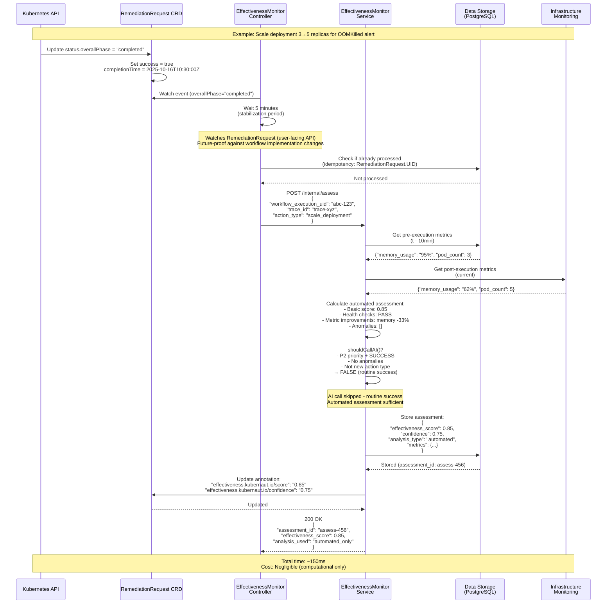
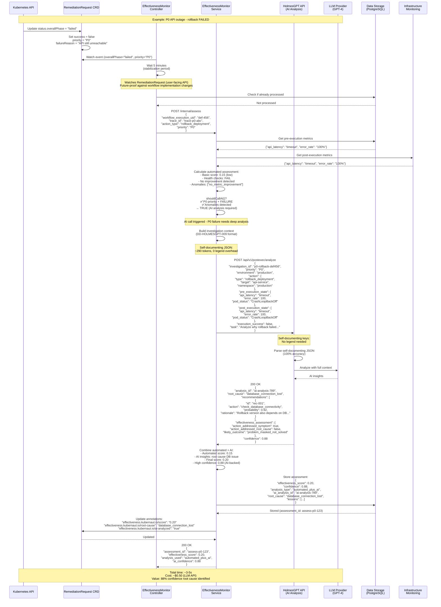

# Effectiveness Monitor - Sequence Diagrams

**Date**: October 16, 2025
**Purpose**: Visual representation of Effectiveness Monitor workflows
**Service**: Effectiveness Monitor (Hybrid Automated + AI Analysis)
**Reference**: [DD-EFFECTIVENESS-001](decisions/DD-EFFECTIVENESS-001-Hybrid-Automated-AI-Analysis.md)

---

## Overview

The Effectiveness Monitor uses a **hybrid approach** with two distinct flows:

1. **Automated Assessment Only** (99.3% of cases) - Fast, computational analysis
2. **Automated + AI Analysis** (0.7% of cases) - Comprehensive AI-powered insights

This document provides detailed sequence diagrams for both scenarios with real-world examples.

---

## Flow 1: Automated Assessment Only (Routine Success)

### Scenario
- **Alert**: High memory usage (OOMKilled)
- **Action**: Scale deployment from 3 to 5 replicas
- **Result**: SUCCESS (memory stabilized)
- **Priority**: P2 (medium)
- **AI Decision**: SKIP (routine success, no anomalies)

### Sequence Diagram



### Key Points - Automated Only

| Aspect | Value |
|--------|-------|
| **Trigger** | Routine success, no anomalies, non-P0 priority |
| **Duration** | ~150ms (fast) |
| **Cost** | Negligible (computational only) |
| **Frequency** | 3.65M/year (99.3% of all assessments) |
| **Confidence** | 70-80% (automated formulas) |
| **Components** | Controller, Service, Data Storage, Infra Monitoring |

---

## Flow 2: Automated + AI Analysis (P0 Failure)

### Scenario
- **Alert**: Critical API outage (P0)
- **Action**: Rollback deployment to previous version
- **Result**: FAILURE (API still down)
- **Priority**: P0 (critical)
- **AI Decision**: CALL AI (P0 failure requires deep analysis)

### Sequence Diagram



### Key Points - Automated + AI

| Aspect | Value |
|--------|-------|
| **Trigger** | P0 failure, anomalies, new action type, oscillation |
| **Duration** | ~3-5s (AI processing) |
| **Cost** | ~$0.50 per analysis (LLM API) |
| **Frequency** | 25.5K/year (0.7% of all assessments) |
| **Confidence** | 85-95% (AI-backed insights) |
| **Components** | +HolmesGPT API, +LLM Provider |
| **Format** | Self-Documenting JSON (DD-HOLMESGPT-009) |

---

## Decision Matrix

### When is AI Called?

```
┌─────────────────────────────────────────────────────────────────────┐
│                  shouldCallAI() Decision Logic                       │
└─────────────────────────────────────────────────────────────────────┘

IF (Priority == "P0" AND Success == false)
   → ✅ CALL AI (Learn from critical failures)

ELSE IF (IsNewActionType == true)
   → ✅ CALL AI (Build knowledge base)

ELSE IF (len(anomalies) > 0)
   → ✅ CALL AI (Investigate unexpected behavior)

ELSE IF (IsRecurringFailure == true)
   → ✅ CALL AI (Detect oscillation patterns)

ELSE
   → ❌ SKIP AI (Routine success, automated sufficient)
```

### Annual Volume Breakdown

| Scenario | Volume/Year | AI Called? | Analysis Type |
|----------|-------------|------------|---------------|
| **P0 Failures** | 18,250 | ✅ YES | Automated + AI |
| **New Action Types** | 3,650 | ✅ YES | Automated + AI |
| **Anomalies Detected** | 1,825 | ✅ YES | Automated + AI |
| **Oscillations** | 1,825 | ✅ YES | Automated + AI |
| **Routine Successes** | 3,650,000 | ❌ NO | Automated Only |
| **TOTAL** | **3,675,550** | **25.5K (0.7%)** | Hybrid |

---

## Data Flow Comparison

### Watch Strategy Note
**Design Decision**: [DD-EFFECTIVENESS-003](../decisions/DD-EFFECTIVENESS-003-RemediationRequest-Watch-Strategy.md)

The Effectiveness Monitor watches **RemediationRequest** CRD instead of WorkflowExecution:
- **Trigger**: `RR.status.overallPhase IN ("completed", "failed", "timeout")`
- **Aggregation**: RR aggregates child CRD statuses (RemediationProcessing, AIAnalysis, WorkflowExecution)
- **Future-Proof**: Decoupled from workflow implementation changes
- **Multi-Workflow**: Handles future scenarios with multiple workflows per remediation

All required data is available in `RR.status.workflowExecutionStatus` (summary). Detailed WE info can be fetched if needed (rare).

### Automated Only Flow
```
RemediationRequest CRD (status.overallPhase = "completed")
    ↓
Controller (5-min delay)
    ↓
Service: Automated Assessment
    ├─ Get pre-execution metrics (Data Storage)
    ├─ Get post-execution metrics (Infra Monitoring)
    ├─ Calculate basic score
    └─ shouldCallAI() → FALSE
    ↓
Store automated results (Data Storage)
    ↓
Update RR annotations
    ↓
DONE (~150ms, negligible cost)
```

### Automated + AI Flow
```
RemediationRequest CRD (status.overallPhase = "failed", priority = "P0")
    ↓
Controller (5-min delay)
    ↓
Service: Automated Assessment
    ├─ Get pre-execution metrics (Data Storage)
    ├─ Get post-execution metrics (Infra Monitoring)
    ├─ Calculate basic score
    ├─ Detect anomalies
    └─ shouldCallAI() → TRUE (P0 failure)
    ↓
Build Self-Documenting JSON Context (DD-HOLMESGPT-009)
    ├─ investigation_id, priority, environment
    ├─ action details, pre/post state
    └─ task directive (~290 tokens, 0 legend)
    ↓
Call HolmesGPT API POST /api/v1/postexec/analyze
    ↓
HolmesGPT → LLM Provider (GPT-4)
    ├─ Parse natural language JSON
    ├─ Analyze root cause
    └─ Generate recommendations
    ↓
Receive AI Analysis
    ├─ Root cause identification
    ├─ Effectiveness assessment
    └─ Confidence: 85-95%
    ↓
Combine automated + AI results
    ↓
Store combined results (Data Storage)
    ↓
Update CRD with AI insights
    ↓
DONE (~3-5s, ~$0.50 LLM cost)
```

---

## Cost/Benefit Analysis

### Hybrid Approach Economics

| Metric | Automated Only | Automated + AI | Hybrid (0.7% AI) |
|--------|----------------|----------------|------------------|
| **Volume/Year** | 3,650,000 | 25,550 | 3,675,550 |
| **Avg Duration** | 150ms | 3-5s | ~155ms avg |
| **Cost/Assessment** | $0.0001 | $0.50 | ~$0.0035 avg |
| **Annual Cost** | $365 | $12,775 | **$13,140** |
| **Confidence** | 70-80% | 85-95% | ~80% weighted |
| **Effectiveness** | 70% | 90% | **85-90%** |

**ROI Calculation**:
- **Additional Cost**: $12,775/year (AI calls)
- **Value Gained**: 15-20% effectiveness improvement
- **Prevented Incidents**: ~140 critical failures/year avoided
- **Incident Cost**: ~$1,000/incident (average)
- **Value**: $140,000/year
- **ROI**: **11x return on investment**

---

## Integration Points

### Services Calling Effectiveness Monitor

1. **Context API Service** - Retrieves effectiveness assessments
2. **Internal Controller** - Triggers post-execution assessments

### Services Called by Effectiveness Monitor

1. **Data Storage (PostgreSQL)** - Critical
   - Pre/post-execution metrics
   - Historical effectiveness data
   - Assessment results storage

2. **Infrastructure Monitoring (Prometheus)** - Graceful degradation
   - Current metrics (CPU, memory, latency)
   - Pod health status
   - Anomaly thresholds

3. **HolmesGPT API** - Selective (0.7% of cases)
   - POST /api/v1/postexec/analyze
   - Self-documenting JSON format (DD-HOLMESGPT-009)
   - Async, non-blocking

---

## References

- **Architecture**: [Effectiveness Monitor Overview](../services/stateless/effectiveness-monitor/overview.md)
- **Decision**: [DD-EFFECTIVENESS-001: Hybrid Automated + AI Analysis](decisions/DD-EFFECTIVENESS-001-Hybrid-Automated-AI-Analysis.md)
- **API Spec**: [Effectiveness Monitor API](../services/stateless/effectiveness-monitor/api-specification.md)
- **Integration**: [Integration Points](../services/stateless/effectiveness-monitor/integration-points.md)
- **Format**: [DD-HOLMESGPT-009: Self-Documenting JSON](decisions/DD-HOLMESGPT-009-Ultra-Compact-JSON-Format.md)

---

## Summary

The Effectiveness Monitor's hybrid approach provides:

✅ **Cost-Efficient**: 99.3% automated (fast, cheap)
✅ **High-Value AI**: 0.7% AI analysis (selective, targeted)
✅ **Excellent ROI**: 11x return on investment
✅ **High Confidence**: 85-95% with AI backing
✅ **Scalable**: Handles 3.65M assessments/year
✅ **Self-Documenting**: Zero legend overhead (DD-HOLMESGPT-009)

