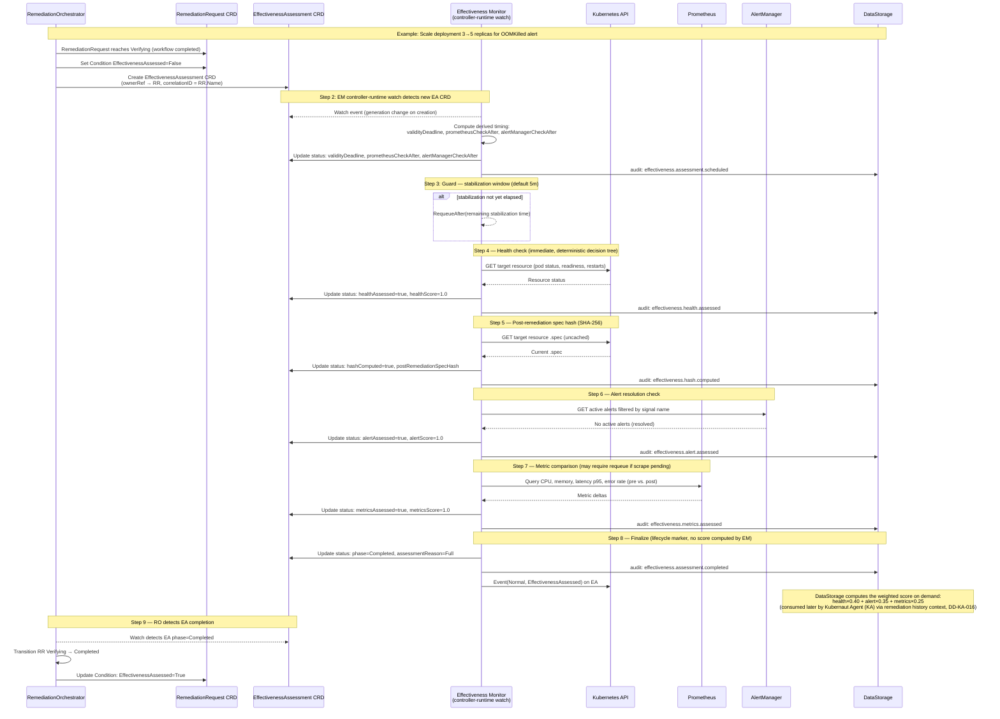
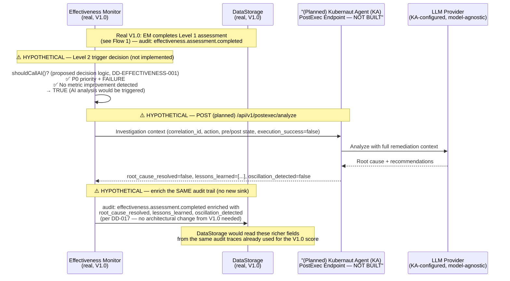

# Effectiveness Monitor - Sequence Diagrams

**Version**: v2.0
**Last Updated**: 2026-08-02
**Purpose**: Visual representation of Effectiveness Monitor (EM) workflows
**Service**: Effectiveness Monitor — a Kubernetes CRD controller (V1.0 Level 1, implemented) with a genuinely planned, **not yet built** V1.1 Level 2 AI-analysis extension
**Reference**: [DD-EFFECTIVENESS-001](decisions/DD-EFFECTIVENESS-001-Hybrid-Automated-AI-Analysis.md) (original hybrid-approach rationale and Level 2 trigger taxonomy — proposal, not spec), [DD-017](decisions/DD-017-effectiveness-monitor-v1.1-deferral.md) (current, authoritative V1.0/V1.1 scoping), [ADR-EM-001](decisions/ADR-EM-001-effectiveness-monitor-service-integration.md) (authoritative V1.0 integration architecture)

---

## 📋 Changelog

| Version | Date | Changes | Reference |
|---------|------|---------|-----------|
| v2.0 | 2026-08-02 | **#1806 CORRECTION**: Replaced the fictional "stateless HTTP service" diagrams (`EffectivenessMonitor Controller` → `EffectivenessMonitor Service` via `POST /internal/assess`, `RR` annotations, port 8080) with the real V1.0 CRD-watch flow (RO creates `EffectivenessAssessment` CRD → EM controller-runtime watch → 4 deterministic scorers → typed audit events to DataStorage → DataStorage computes weighted score on demand → RO watches EA completion). Relabeled the AI-analysis flow as "⚠️ PLANNED V1.1 — NOT YET IMPLEMENTED" and rebuilt it on top of the real EA/EM foundation instead of the fictional service-to-service call chain. Renamed "HolmesGPT API" to "(planned) Kubernaut Agent (KA) PostExec endpoint" throughout. Corrected the "Watch Strategy" note (EM watches the EA CRD, not `RemediationRequest` — `DD-EFFECTIVENESS-003` is superseded per DD-017 v2.2). Removed the "Context API Service" integration point (deprecated Nov 2025, `DD-CONTEXT-006`). Fixed the 3 references at the bottom of this document to resolve to the post-move `docs/services/crd-controllers/07-effectivenessmonitor/` paths (one — the `api-specification.md` → `crd-schema.md` rename — had already been partially corrected in a prior pass on this branch). | [#1806](https://github.com/jordigilh/kubernaut/issues/1806), [ADR-EM-001](decisions/ADR-EM-001-effectiveness-monitor-service-integration.md) |
| v1.0 | 2025-10-16 | ⚠️ **STALE (superseded by v2.0)** — Original diagrams described a fictional stateless HTTP architecture with a live selective-AI-analysis endpoint; never built as such. | — |

---

## Overview

The Effectiveness Monitor has **one implemented flow and one planned, unbuilt flow**:

1. **V1.0 Level 1 — Deterministic Automated Assessment** (✅ implemented, 100% of assessments) — a Kubernetes CRD controller reconciling `EffectivenessAssessment` (EA) CRDs, running 4 independent, deterministic component scorers. Zero AI/LLM calls.
2. **V1.1 Level 2 — AI-Powered Analysis** (⚠️ **PLANNED, NOT YET IMPLEMENTED** — a design proposal, see [DD-017](decisions/DD-017-effectiveness-monitor-v1.1-deferral.md)) — selectively triggered AI analysis via a **(planned)** Kubernaut Agent (KA) PostExec endpoint, for high-value cases (P0 failures, first-time action types, suspected oscillations, periodic batch analysis).

This document provides sequence diagrams for both: Flow 1 reflects the real, shipped V1.0 architecture; Flow 2 is a **forward-looking design proposal** for V1.1, clearly marked as such, preserved because the decision-trigger taxonomy and illustrative reasoning behind it retain genuine planning value (see [DD-EFFECTIVENESS-001](decisions/DD-EFFECTIVENESS-001-Hybrid-Automated-AI-Analysis.md)).

EM has **zero AI/LLM dependency in V1.0** — confirmed via repo-wide grep: no HolmesGPT, HAPI, or Kubernaut Agent (KA) client reference anywhere in `pkg/effectivenessmonitor/` or `internal/controller/effectivenessmonitor/`.

---

## Flow 1: V1.0 Level 1 — Deterministic Automated Assessment (✅ Implemented, 100% of Assessments)

### Scenario
- **Alert**: High memory usage (OOMKilled)
- **Action**: Scale deployment from 3 to 5 replicas
- **Result**: SUCCESS (memory stabilized, alert resolved)
- **AI involvement**: None — every check below is deterministic and rule-based

### Sequence Diagram


```mermaid
sequenceDiagram
    participant RO as RemediationOrchestrator
    participant RR as RemediationRequest CRD
    participant EA as EffectivenessAssessment CRD
    participant EM as Effectiveness Monitor<br/>(controller-runtime watch)
    participant K8s as Kubernetes API
    participant Prom as Prometheus
    participant AM as AlertManager
    participant DS as DataStorage

    Note over RO,DS: Example: Scale deployment 3→5 replicas for OOMKilled alert

    %% Step 1: RR reaches terminal/verifying phase
    RO->>RR: RemediationRequest reaches Verifying (workflow completed)
    RO->>RR: Set Condition EffectivenessAssessed=False
    RO->>EA: Create EffectivenessAssessment CRD<br/>(ownerRef → RR, correlationID = RR.Name)

    Note over EM,EA: Step 2: EM controller-runtime watch detects new EA CRD
    EM-->>EA: Watch event (generation change on creation)
    EM->>EM: Compute derived timing:<br/>validityDeadline, prometheusCheckAfter, alertManagerCheckAfter
    EM->>EA: Update status: validityDeadline, prometheusCheckAfter, alertManagerCheckAfter
    EM->>DS: audit: effectiveness.assessment.scheduled

    Note over EM: Step 3: Guard — stabilization window (default 5m)
    alt stabilization not yet elapsed
        EM-->>EM: RequeueAfter(remaining stabilization time)
    end

    Note over EM,K8s: Step 4 — Health check (immediate, deterministic decision tree)
    EM->>K8s: GET target resource (pod status, readiness, restarts)
    K8s-->>EM: Resource status
    EM->>EA: Update status: healthAssessed=true, healthScore=1.0
    EM->>DS: audit: effectiveness.health.assessed

    Note over EM,K8s: Step 5 — Post-remediation spec hash (SHA-256)
    EM->>K8s: GET target resource .spec (uncached)
    K8s-->>EM: Current .spec
    EM->>EA: Update status: hashComputed=true, postRemediationSpecHash
    EM->>DS: audit: effectiveness.hash.computed

    Note over EM,AM: Step 6 — Alert resolution check
    EM->>AM: GET active alerts filtered by signal name
    AM-->>EM: No active alerts (resolved)
    EM->>EA: Update status: alertAssessed=true, alertScore=1.0
    EM->>DS: audit: effectiveness.alert.assessed

    Note over EM,Prom: Step 7 — Metric comparison (may require requeue if scrape pending)
    EM->>Prom: Query CPU, memory, latency p95, error rate (pre vs. post)
    Prom-->>EM: Metric deltas
    EM->>EA: Update status: metricsAssessed=true, metricsScore=1.0
    EM->>DS: audit: effectiveness.metrics.assessed

    Note over EM,DS: Step 8 — Finalize (lifecycle marker, no score computed by EM)
    EM->>EA: Update status: phase=Completed, assessmentReason=Full
    EM->>DS: audit: effectiveness.assessment.completed
    EM->>K8s: Event(Normal, EffectivenessAssessed) on EA

    Note over DS: DataStorage computes the weighted score on demand:<br/>health×0.40 + alert×0.35 + metrics×0.25<br/>(consumed later by Kubernaut Agent (KA) via remediation history context, DD-KA-016)

    Note over RO,EA: Step 9 — RO detects EA completion
    RO-->>EA: Watch detects EA phase=Completed
    RO->>RO: Transition RR Verifying → Completed
    RO->>RR: Update Condition: EffectivenessAssessed=True
```

> This is a condensed illustrative walkthrough. For the fully detailed, authoritative sequence diagrams (including alert-decay cross-validation, async hash deferral, spec-drift short-circuit, and failed/timed-out paths), see [ADR-EM-001](decisions/ADR-EM-001-effectiveness-monitor-service-integration.md) §§3–5.

### Key Points - V1.0 Level 1 (Implemented)

| Aspect | Value |
|--------|-------|
| **Trigger** | RO creates an `EffectivenessAssessment` CRD for every terminal/verifying `RemediationRequest` (100% of remediations — no sampling) |
| **Duration** | Dominated by the configured stabilization window (default 5m) plus (if needed) waiting for the next Prometheus scrape — not computation time |
| **Cost** | Negligible — 4 deterministic checks (K8s API, AlertManager, Prometheus reads, SHA-256 hash); zero LLM/AI cost |
| **AI/LLM involvement** | None |
| **Components** | RO, `EffectivenessAssessment` CRD, EM controller (4 independent scorers: health, alert, metrics, hash), Kubernetes API, Prometheus, AlertManager, DataStorage |
| **Scoring** | EM never computes the final score — DataStorage computes it on demand from the component audit events |

---

## Flow 2: ⚠️ PLANNED V1.1 — NOT YET IMPLEMENTED — AI-Powered PostExec Analysis (Design Proposal)

> **⚠️ PLANNED V1.1 — NOT YET IMPLEMENTED.** Everything in this section describes a design proposal for a future Level 2 extension. **No component below exists in the codebase today.** Confirmed via repo-wide grep: zero HolmesGPT/Kubernaut Agent (KA) client references anywhere in `pkg/effectivenessmonitor/` or `internal/controller/effectivenessmonitor/`; the `POST /api/v1/postexec/analyze` endpoint does not exist in Kubernaut Agent's `openapi.json` or anywhere else in the repo. This flow is retained because the decision-trigger taxonomy and cost/benefit reasoning behind it have genuine forward-looking design value for V1.1 planning. Authority: [DD-017](decisions/DD-017-effectiveness-monitor-v1.1-deferral.md) §"V1.1 Scope: Level 2" (current, authoritative scoping) and [DD-EFFECTIVENESS-001](decisions/DD-EFFECTIVENESS-001-Hybrid-Automated-AI-Analysis.md) (original proposal — decision triggers, alternatives considered).

### Scenario
- **Alert**: Critical API outage (P0)
- **Action**: Rollback deployment to previous version
- **Result**: FAILURE (API still down)
- **AI decision (hypothetical)**: Trigger Level 2 analysis (P0 failure requires deep analysis)

### Sequence Diagram (Hypothetical — Level 2 Not Built)

This diagram picks up where Flow 1's real V1.0 lifecycle ends (`effectiveness.assessment.completed`), and shows how a future Level 2 could integrate **without a new architecture** — per DD-017 §"V1.1 Integration with DD-KA-016", Level 2 would enrich the *same* audit events with additional fields, not introduce a separate service call chain like the original (now-corrected) proposal assumed.


```mermaid
sequenceDiagram
    participant EM as Effectiveness Monitor<br/>(real, V1.0)
    participant DS as DataStorage<br/>(real, V1.0)
    participant KA as "(Planned) Kubernaut Agent (KA)<br/>PostExec Endpoint — NOT BUILT"
    participant LLM as LLM Provider<br/>(KA-configured, model-agnostic)

    Note over EM,DS: Real V1.0: EM completes Level 1 assessment<br/>(see Flow 1) — audit: effectiveness.assessment.completed

    Note over EM: ⚠️ HYPOTHETICAL — Level 2 trigger decision (not implemented)
    EM->>EM: shouldCallAI()? (proposed decision logic, DD-EFFECTIVENESS-001)<br/>✅ P0 priority + FAILURE<br/>✅ No metric improvement detected<br/>→ TRUE (AI analysis would be triggered)

    Note over EM,KA: ⚠️ HYPOTHETICAL — POST (planned) /api/v1/postexec/analyze
    EM->>KA: Investigation context (correlation_id, action, pre/post state, execution_success=false)
    KA->>LLM: Analyze with full remediation context
    LLM-->>KA: Root cause + recommendations
    KA-->>EM: root_cause_resolved=false, lessons_learned=[...], oscillation_detected=false

    Note over EM,DS: ⚠️ HYPOTHETICAL — enrich the SAME audit trail (no new sink)
    EM->>DS: audit: effectiveness.assessment.completed enriched with<br/>root_cause_resolved, lessons_learned, oscillation_detected<br/>(per DD-017 — no architectural change from V1.0 needed)

    Note over DS: DataStorage would read these richer fields<br/>from the same audit traces already used for the V1.0 score
```

### Key Points - ⚠️ Planned V1.1 Level 2 (Not Implemented)

| Aspect | Value |
|--------|-------|
| **Trigger (proposed)** | P0 failure, anomalies, new action type, suspected oscillation — see the Decision Matrix section below |
| **Duration (illustrative estimate)** | ~3-5s (AI processing) — no real measurement exists |
| **Cost (illustrative estimate)** | ~$0.50 per analysis (LLM API) — no real measurement exists |
| **Status** | ⚠️ **Design proposal only** — no code, no endpoint, no integration exists |
| **Planned integration point** | (Planned) Kubernaut Agent (KA) PostExec endpoint, per [DD-017](decisions/DD-017-effectiveness-monitor-v1.1-deferral.md) |

---

## Decision Matrix (⚠️ Proposed V1.1 Design — Not Implemented)

> The trigger logic below (`shouldCallAI()`) is a **design sketch from the original Oct 2025 proposal** ([DD-EFFECTIVENESS-001](decisions/DD-EFFECTIVENESS-001-Hybrid-Automated-AI-Analysis.md)). It does not exist as code anywhere in the repository. It is preserved here as the most reusable part of that proposal for future V1.1 planning.

### When Would AI Be Called? (Proposed)

```
┌─────────────────────────────────────────────────────────────────────┐
│         ⚠️ PROPOSED shouldCallAI() Decision Logic (NOT BUILT)       │
└─────────────────────────────────────────────────────────────────────┘

IF (Priority == "P0" AND Success == false)
   → ✅ CALL AI (Learn from critical failures)

ELSE IF (IsNewActionType == true)
   → ✅ CALL AI (Build knowledge base)

ELSE IF (len(anomalies) > 0)
   → ✅ CALL AI (Investigate unexpected behavior)

ELSE IF (IsRecurringFailure == true)
   → ✅ CALL AI (Detect oscillation patterns)

ELSE
   → ❌ SKIP AI (Routine success, automated sufficient)
```

### Annual Volume Breakdown (Illustrative — Oct 2025 Estimates, Not Measured)

| Scenario | Volume/Year (illustrative) | AI Called? (proposed) | Analysis Type |
|----------|-------------|------------|---------------|
| **P0 Failures** | 18,250 | ✅ YES | Level 1 + Level 2 (proposed) |
| **New Action Types** | 3,650 | ✅ YES | Level 1 + Level 2 (proposed) |
| **Anomalies Detected** | 1,825 | ✅ YES | Level 1 + Level 2 (proposed) |
| **Oscillations** | 1,825 | ✅ YES | Level 1 + Level 2 (proposed) |
| **Routine Successes** | 3,650,000 | ❌ NO | Level 1 only (real, V1.0) |
| **TOTAL** | **3,675,550** | **25.5K (0.7%), illustrative** | Hybrid (proposed) |

---

## Data Flow Comparison

### Watch Strategy Note (Corrected)

**Design authority**: [DD-017](decisions/DD-017-effectiveness-monitor-v1.1-deferral.md) v2.2 — **not** [DD-EFFECTIVENESS-003](decisions/DD-EFFECTIVENESS-003-RemediationRequest-Watch-Strategy.md), which is **superseded**.

The Effectiveness Monitor does **not** watch `RemediationRequest` (RR) or `WorkflowExecution` directly. Per DD-017 v2.2: "the EM no longer watches RR CRDs directly. Instead, the **RO creates an `EffectivenessAssessment` CRD** when the RR reaches a terminal phase (Completed, Failed, TimedOut) ... The EM watches EA CRDs." This provides restart recovery via `EA.status.components`, `kubectl` observability, and consistent lifecycle ownership by the RO — see [ADR-EM-001](decisions/ADR-EM-001-effectiveness-monitor-service-integration.md) §3.

`DD-EFFECTIVENESS-003`'s original rationale (decouple from workflow implementation details) is preserved by this newer pattern — RR/WorkflowExecution changes still can't break EM, since EM is triggered by an entirely separate CRD (EA) with an immutable spec.

### V1.0 Level 1 Flow (✅ Real, Implemented)
```
RemediationRequest reaches Verifying/Completed/Failed/TimedOut
    ↓
RemediationOrchestrator creates EffectivenessAssessment (EA) CRD (ownerRef → RR)
    ↓
EM controller-runtime watch detects new EA CRD
    ↓
EM computes derived timing (validityDeadline, prometheusCheckAfter, alertManagerCheckAfter)
    → audit: effectiveness.assessment.scheduled
    ↓
Wait for stabilization window (default 5m)
    ↓
Run 4 independent deterministic scorers:
    ├─ Health (Kubernetes API)       → audit: effectiveness.health.assessed
    ├─ Hash (Kubernetes API, SHA-256) → audit: effectiveness.hash.computed
    ├─ Alert (AlertManager)          → audit: effectiveness.alert.assessed
    │    (or effectiveness.alert_decay.detected if decay suspected)
    └─ Metrics (Prometheus)          → audit: effectiveness.metrics.assessed
    ↓
All components assessed (or validity window forces completion)
    → audit: effectiveness.assessment.completed (lifecycle marker, no score)
    → K8s Event(Normal, EffectivenessAssessed) on EA
    ↓
DataStorage computes weighted score on demand (health×0.40 + alert×0.35 + metrics×0.25)
    ↓
RemediationOrchestrator watches EA completion → RR Condition EffectivenessAssessed=True
    ↓
DONE (no LLM cost; duration dominated by stabilization window, not computation)
```

### ⚠️ Planned V1.1 Level 2 Flow (Design Proposal — Not Implemented)
```
Real V1.0 Level 1 completes (effectiveness.assessment.completed already emitted)
    ↓
⚠️ PROPOSED: shouldCallAI() decision (P0 failure? new action type? anomaly? oscillation?)
    ↓ (if YES, hypothetically)
⚠️ PROPOSED: Call (planned) Kubernaut Agent (KA) PostExec endpoint
    ├─ correlation_id, action details, pre/post state, execution_success
    ↓
⚠️ PROPOSED: Kubernaut Agent (KA) → LLM Provider
    ├─ Root cause validation
    ├─ Oscillation detection
    └─ Pattern learning / lesson extraction
    ↓
⚠️ PROPOSED: Enrich the SAME DataStorage audit trail with AI-derived fields
    (root_cause_resolved, lessons_learned, oscillation_detected)
    — per DD-017: no separate sink, no architectural change from V1.0 needed
    — NOTE: the original 2025 proposal routed "lessons learned" to a "Context API"
      service; that service was deprecated Nov 2025 (DD-CONTEXT-006) and is not
      part of any current or planned data flow
    ↓
NOT BUILT — illustrative only
```

---

## Cost/Benefit Analysis (⚠️ Illustrative — Oct 2025 Estimates, Level 2 Never Built)

> None of the figures below have been incurred or measured — Level 2 does not exist. Preserved as the original economic reasoning behind the two-level split, which [DD-017](decisions/DD-017-effectiveness-monitor-v1.1-deferral.md) v2.6 still treats as the current directional decision.

### Hybrid Approach Economics (Illustrative)

| Metric | Level 1 Only (real, V1.0) | + Level 2 (proposed) | Hybrid (0.7% AI, proposed) |
|--------|----------------|----------------|------------------|
| **Volume/Year** | 3,650,000 | 25,550 | 3,675,550 |
| **Avg Duration** | Dominated by stabilization window (5m), not compute | 3-5s (illustrative) | N/A — illustrative |
| **Cost/Assessment** | Negligible | $0.50 (illustrative) | ~$0.0035 avg (illustrative) |
| **Annual Cost** | ~$0 (no LLM calls) | $12,775 (illustrative) | **$13,140 (illustrative)** |
| **Confidence** | N/A (deterministic, not probabilistic) | 85-95% (illustrative) | ~80% weighted (illustrative) |

**Illustrative ROI Calculation** (Oct 2025 estimate, not validated):
- **Additional Cost**: $12,775/year (AI calls, illustrative)
- **Value Gained**: 15-20% effectiveness improvement (illustrative)
- **Prevented Incidents**: ~140 critical failures/year avoided (illustrative)
- **Incident Cost**: ~$1,000/incident average (illustrative)
- **Value**: $140,000/year (illustrative)
- **ROI**: **11x return on investment (illustrative)**

---

## Integration Points

### Services Calling Effectiveness Monitor

**None.** EM has zero HTTP business API surface (no port 8080, no REST endpoint for requesting or retrieving an assessment). The only trigger is the controller-runtime watch on the `EffectivenessAssessment` CRD. The only network listeners are Prometheus metrics (port 9090, `/metrics`) and health/readiness probes (port 8081, `/healthz`, `/readyz`).

### Services Called by Effectiveness Monitor (V1.0, Real)

1. **Kubernetes API** — Required
   - Pod/health status for the target resource
   - Current `.spec` for pre/post-remediation hash comparison

2. **DataStorage** — Required
   - Writes: 7 typed component audit events per assessment
   - Reads: `remediation.workflow_created` fallback query and pre-hash lookup

3. **Prometheus** — Optional (config toggle `external.prometheusEnabled`)
   - Pre/post metric comparison (CPU, memory, latency p95, error rate)

4. **AlertManager** — Optional (config toggle `external.alertManagerEnabled`)
   - Alert resolution check, including multi-probe alert-decay detection (BR-EM-012)

### ⚠️ Planned V1.1 Addition (Not Implemented)

5. **(Planned) Kubernaut Agent (KA) PostExec endpoint** — selectively, for high-value cases per the Decision Matrix section above. Does not exist today. See [DD-017](decisions/DD-017-effectiveness-monitor-v1.1-deferral.md).

---

## References

- **Architecture**: [Effectiveness Monitor Overview](../services/crd-controllers/07-effectivenessmonitor/overview.md)
- **Authoritative Integration Architecture**: [ADR-EM-001](decisions/ADR-EM-001-effectiveness-monitor-service-integration.md) — the real V1.0 sequence diagrams, scoring formula, and SOC2 chain of custody
- **V1.0/V1.1 Scoping Decision**: [DD-017](decisions/DD-017-effectiveness-monitor-v1.1-deferral.md) — current, authoritative Level 1 (V1.0) / Level 2 (V1.1) boundary
- **Original Hybrid-Approach Proposal**: [DD-EFFECTIVENESS-001: Hybrid Automated + AI Analysis](decisions/DD-EFFECTIVENESS-001-Hybrid-Automated-AI-Analysis.md) — decision-trigger taxonomy and alternatives-considered analysis (still-valid V1.1 design input); Level 1 architecture superseded, Level 2 not built
- **CRD Schema**: [Effectiveness Monitor CRD Schema](../services/crd-controllers/07-effectivenessmonitor/crd-schema.md) (renamed from `api-specification.md` — EM has no REST API, see [#1806](https://github.com/jordigilh/kubernaut/issues/1806))
- **Integration**: [Integration Points](../services/crd-controllers/07-effectivenessmonitor/integration-points.md)

---

## Summary

The Effectiveness Monitor's architecture, as it actually exists and is planned:

✅ **V1.0 Level 1 (implemented, real)**: 100% deterministic, CRD-watch driven, zero AI/LLM dependency, zero HTTP business API
✅ **DataStorage-computed scoring**: EM emits raw per-component audit events; DataStorage computes the weighted score on demand
⚠️ **V1.1 Level 2 (planned, not implemented)**: selective AI analysis via a (planned) Kubernaut Agent (KA) PostExec endpoint, gated on decision triggers proposed in [DD-EFFECTIVENESS-001](decisions/DD-EFFECTIVENESS-001-Hybrid-Automated-AI-Analysis.md) and scoped in [DD-017](decisions/DD-017-effectiveness-monitor-v1.1-deferral.md)
⚠️ **No live cost, latency, or ROI figures exist for Level 2** — all such figures in this document are illustrative Oct 2025 estimates, not current or measured
