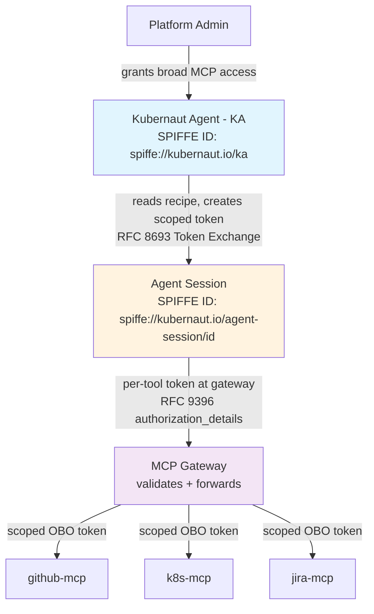
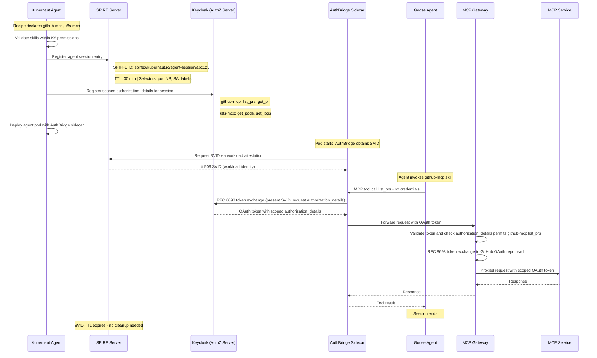
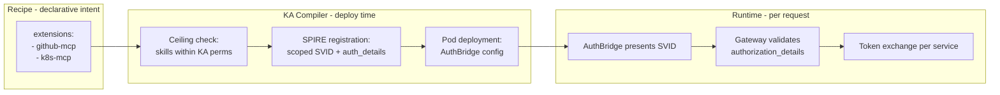
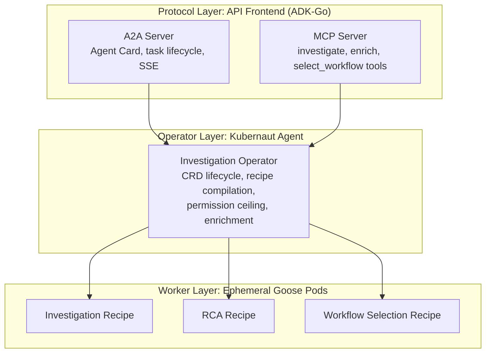
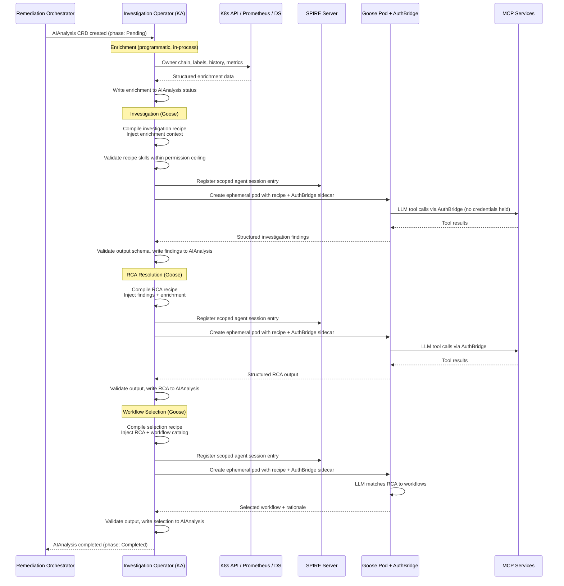
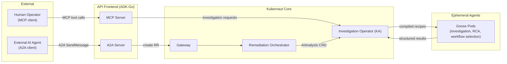

# PROPOSAL-EXT-003: Goose Runtime Adoption

**Status**: ACCEPTED
**Date**: April 15, 2026 (original); May 3, 2026 (decision accepted)
**Author**: Kubernaut Architecture Team
**Confidence**: 95% (two rounds of adversarial audit; architectural direction committed -- Goose as the LLM runtime, KA as pure orchestrator)
**Related**: [#711](https://github.com/jordigilh/kubernaut/issues/711) (Investigation Prompt Bundles), [#601](https://github.com/jordigilh/kubernaut/issues/601) (Shadow Agent), [#648](https://github.com/jordigilh/kubernaut/issues/648) (Multi-Agent Consensus / Dual Investigation), [#708](https://github.com/jordigilh/kubernaut/issues/708) (API Frontend Service), [PROPOSAL-EXT-001](PROPOSAL-EXT-001-external-integration-strategy.md) (External Integration Strategy), [PROPOSAL-EXT-002](PROPOSAL-EXT-002-investigation-prompt-bundles.md) (Investigation Prompt Bundles)

---

## Purpose

This proposal adopts [Goose](https://github.com/block/goose) (AAIF -- an extensible, open-source AI agent framework) as the LLM runtime for executing Kubernaut Agent's investigation phases. KA becomes a **pure orchestrator** with zero direct LLM consumption -- all LLM reasoning is delegated to Goose via Goose recipes. The PromptBundle abstraction defined in PROPOSAL-EXT-002 is superseded by native Goose recipes used directly.

The proposal defines a 5-phase pipeline model with `InvestigationHook` CRDs, records an ACP SDK spike using `coder/acp-go-sdk`, and establishes the invocation path: **`goose-server` (HTTP)** for the near term, with migration to ACP once the session-configuration gap closes upstream.

This evaluation was refined through two rounds of adversarial audit (14 findings resolved), covering self-correction loop compatibility, template rendering ownership, protocol consistency, audit granularity, and operational risks.

> **Decision Record (May 3, 2026)**: The architectural direction has been committed to **Option B -- Goose as the LLM runtime** for all investigation phases, **targeting v1.6**. v1.5 focuses on agentic integration (MCP server, A2A protocol, API Frontend, interactive mode) and retains the current inline execution model. Key decisions:
>
> 1. **Goose recipes directly** -- no PromptBundle wrapper. An upstream Goose PR adds nested object support in recipe templates to handle Kubernaut's rich data contract.
> 2. **KA as pure orchestrator** -- drops `runLLMLoop`, `llm.Client`, tool registry, and LangChainGo. KA compiles context, creates Goose sessions, monitors execution, collects structured output, and drives CRD lifecycle.
> 3. **`goose-server` (HTTP) invocation** -- KA invokes Goose via its HTTP server API for recipe-based session creation. Migration to ACP once the upstream gap ([goose#7596](https://github.com/block/goose/issues/7596)) closes.
> 4. **Shadow agent as a separate Goose recipe** -- KA relays `SessionUpdate` events from the primary investigation to a parallel shadow Goose session running a security-focused recipe.
> 5. **Self-correction via `Prompt()`** -- KA owns the catalog validation retry loop by sending follow-up prompts on the same Goose session, not via Goose sub-recipes.
> 6. **Deployment**: `goose-server` is added to the Kubernaut deployment in v1.6 (details deferred to implementation phase).
> 7. **Timeline**: v1.5 retains current inline execution (agentic integration focus). v1.6 implements the Goose runtime migration (~10-12 weeks for 1 dev, ~6-7 weeks for 2 devs).

---

## Table of Contents

1. [Executive Summary](#1-executive-summary)
2. [Bundle Format and Compilation](#2-bundle-format-and-compilation)
3. [Six-Phase Pipeline Model](#3-six-phase-pipeline-model)
4. [InvestigationHook CRD](#4-investigationhook-crd)
5. [What KA Keeps (Domain-Specific Orchestration)](#5-what-ka-keeps-domain-specific-orchestration)
6. [What KA Could Drop on a Future Goose Path](#6-what-ka-could-drop-on-a-future-goose-path)
7. [ACP Go SDK Spike Findings](#7-acp-go-sdk-spike-findings)
8. [Shadow Agent and Dual Investigation Fit](#8-shadow-agent-and-dual-investigation-fit)
9. [Runtime Comparison](#9-runtime-comparison)
10. [Option A vs Option B: Enhance KA vs Adopt Goose](#10-option-a-vs-option-b-enhance-ka-vs-adopt-goose)
11. [Phased Adoption Roadmap](#11-phased-adoption-roadmap)
12. [Adversarial Audit Findings and Resolutions](#12-adversarial-audit-findings-and-resolutions)
13. [Risk Register](#13-risk-register)
14. [Design Gates](#14-design-gates)
15. [Impact on PROPOSAL-EXT-002](#15-impact-on-proposal-ext-002)

**Appendices**

- [Appendix A: API Frontend Runtime Evaluation (Google ADK-Go vs Goose)](#appendix-a-api-frontend-runtime-evaluation-google-adk-go-vs-goose)
- [Appendix B: Delegated Authorization Model for Agent MCP Access](#appendix-b-delegated-authorization-model-for-agent-mcp-access)
- [Appendix C: Agent Execution Architecture](#appendix-c-agent-execution-architecture)

---

## 1. Executive Summary

KA adopts Goose as its LLM runtime. All investigation phases -- investigation, RCA resolution, workflow selection, and the shadow agent -- execute as **native Goose recipes**. KA becomes a pure orchestrator: it compiles investigation context, invokes Goose via `goose-server` HTTP API, monitors execution via `SessionUpdate` streaming, collects structured output, and drives CRD lifecycle. KA does not consume LLMs directly.

The **PromptBundle** abstraction defined in PROPOSAL-EXT-002 is superseded. Kubernaut uses Goose recipes directly, with an upstream Goose PR adding nested object support in recipe template parameters to handle Kubernaut's rich data contract (`.Signal.Namespace`, `.Enrichment.OwnerChain`, etc.). Until that PR lands, KA pre-renders the full instructions string and passes it as a flat parameter.

**Key architectural decisions:**

- **Goose recipes directly** -- no Kubernaut-native wrapper format. Recipes are the unit of investigation logic, packaged as OCI artifacts for enterprise distribution.
- **KA as pure orchestrator** -- drops `runLLMLoop`, `llm.Client`, tool registry, and LangChainGo dependency. KA retains pipeline orchestration, CRD lifecycle, signal enrichment, result assembly, permission ceiling enforcement, and audit assembly.
- **`goose-server` HTTP invocation** -- KA creates Goose sessions via `goose-server`'s HTTP API, which supports recipe-based session creation today. Migration to ACP via `coder/acp-go-sdk` once the upstream session-configuration gap ([goose#7596](https://github.com/block/goose/issues/7596)) closes.
- **Shadow agent as Goose recipe** -- a parallel Goose session running a security-focused recipe. KA relays `SessionUpdate` events from the primary session to the shadow for real-time prompt injection detection.
- **KA-driven self-correction** -- catalog validation retries are managed by KA via follow-up `Prompt()` calls on the same Goose session, not via Goose sub-recipes.
- **5-phase pipeline** with `pre-workflow-selection` as a new optional hook phase. `InvestigationHook` CRDs define optional hook phases; core phase recipes are configured in KA's YAML config.
- **A2A for hook phases** -- optional hook phases (`pre-investigation`, `pre-workflow-selection`) delegate to external A2A agents. Core phases delegate to Goose.

**Adoption roadmap:**

| Version | Goose Dependency | KA Role | Runtime |
|---------|-----------------|---------|---------|
| v1.5 | None | Current inline executor + orchestrator | Agentic integration focus: MCP server, A2A protocol, API Frontend, interactive mode. KA retains current `runLLMLoop` inline execution. `InvestigationHook` CRD design only. |
| v1.6 | **Required** -- `goose-server` in deployment | Pure orchestrator | All core phases (investigation, RCA, workflow selection) execute as Goose recipes via `goose-server` HTTP API. Shadow agent runs as a parallel Goose recipe. Hook phases can delegate to external A2A agents. |
| Future | Required; migrate to ACP | Pure orchestrator | Migrate from `goose-server` HTTP to ACP via `coder/acp-go-sdk` once upstream session-configuration gap closes. |

---

## 2. Recipe Format and Context Injection

Kubernaut uses **native Goose recipes** directly. The PromptBundle abstraction previously defined in PROPOSAL-EXT-002 is superseded -- there is no Kubernaut-specific wrapper format.

### 2.1 Goose Recipe (Native Format)

```yaml
version: 1.0.0
title: "Kubernaut Investigation"
description: "Investigate a Kubernetes alert signal and produce structured RCA"
parameters:
  - key: signal
    input_type: object
    requirement: required
    description: "Structured signal context from Kubernaut Gateway"
  - key: enrichment
    input_type: object
    requirement: required
    description: "K8s enrichment data (owner chain, labels, history)"
instructions: |
  A {{ signal.severity }} alert "{{ signal.name }}" fired for
  {{ signal.resource_kind }}/{{ signal.resource_name }} in namespace {{ signal.namespace }}.

  
  Owner chain: {{ owner.kind }}/{{ owner.name }} → 
  

  Investigate the root cause using the available Kubernetes tools.

extensions:
  - type: streamable_http
    name: k8s-tools-mcp
    uri: "http://k8s-tools.kubernaut-system.svc:8080/mcp"
    timeout: 30
  - type: streamable_http
    name: prometheus-mcp
    uri: "http://prometheus-tools.kubernaut-system.svc:8080/mcp"
    timeout: 30

response:
  json_schema:
    type: object
    properties:
      root_cause_analysis:
        type: object
        properties:
          summary: { type: string }
          severity: { type: string }
          affected_resource: { type: string }
    required: [root_cause_analysis]
```

### 2.2 Context Injection Strategy

Kubernaut's investigation context includes nested data structures (`.Signal.Namespace`, `.Enrichment.OwnerChain`, `.PriorPhaseOutputs[]`). Two mechanisms address this:

**Target state (upstream PR):** An upstream Goose PR adds nested object support in recipe template parameters, enabling `{{ signal.namespace }}`, ``, and conditional blocks. This gives Kubernaut full template expressiveness within the native Goose recipe format.

**Interim state (pre-render):** Until the upstream PR lands, KA pre-renders the full instructions string using its existing `prompt.Builder` and passes the rendered text as a single flat `{{context}}` parameter to the Goose recipe. This preserves the current prompt structure with zero loss of expressiveness.

### 2.3 Compilation Flow

KA performs the following steps before invoking Goose:

1. **Select recipe** -- based on the investigation phase and pipeline configuration
2. **Resolve extensions** -- translate OCI skill refs and `builtin://` references to live MCP endpoint URLs
3. **Inject context** -- render recipe parameters with the phase-specific data contract (signal, enrichment, prior phase outputs)
4. **Validate permissions** -- ensure all declared MCP extensions are within KA's permission ceiling (see Appendix B)
5. **Create session** -- invoke `goose-server` HTTP API with the compiled recipe

### 2.4 Impact on PROPOSAL-EXT-002

PROPOSAL-EXT-002's strategic vision -- Kubernaut as a recipe-programmable investigation platform where the domain is defined by the recipe -- remains valid and is strengthened by using Goose recipes directly. The `PromptBundle` CRD format (Section 2 of EXT-002) is superseded by native Goose recipe YAML. The pipeline model, hook points, output propagation, and OCI distribution mechanisms in EXT-002 remain applicable; only the artifact format changes.

---

## 3. Five-Phase Pipeline Model

This proposal defines a five-phase pipeline with two Goose recipe injection points: `pre-investigation` and `pre-workflow-selection`.

```
pre-investigation         (optional, Goose recipe injection, parallel)
  |
investigation             (mandatory, KA config, single recipe)
  |
rca-resolution            (mandatory, KA config, single recipe)
  |
pre-workflow-selection    (optional, Goose recipe injection, parallel)
  |
workflow-selection        (mandatory, KA config, single recipe)
```

### 3.1 Mandatory Phases (3)

Configured in KA's YAML config. Built-in Goose recipes are embedded in the binary and overridable by the operator. Exactly one recipe per mandatory phase.

### 3.2 Optional Hook Phases (2)

Defined as `InvestigationHook` CRDs (see Section 4). Zero or many per phase. Executed **in parallel** within a phase (hooks are independent of each other). KA collects all outputs and passes them as `PriorPhaseOutputs` to the next phase.

The two injection points are:

- **`pre-investigation`**: Customer SOP checks before investigation (CMDB, change freeze, compliance)
- **`pre-workflow-selection`**: Customer constraints before workflow selection (change freeze, ITSM, policy checks)

### 3.3 `pre-workflow-selection` Hook

Allows customers to inject constraints before workflow selection:

- "Only select workflows approved for production"
- "Namespace is in change freeze -- only diagnostic workflows"
- "Check ITSM for open change requests before selecting a remediation workflow"

**Template data contract**: All fields are available at this phase (`.Signal`, `.Enrichment`, `.PriorPhaseOutputs`, `.Investigation.RCANarrative`, `.Investigation.RCASummary`). This is the richest data contract of any hook phase, since it runs after both the investigation and RCA resolution have completed.

---

## 4. InvestigationHook CRD

### 4.1 Schema

```yaml
apiVersion: kubernaut.ai/v1alpha1
kind: InvestigationHook
metadata:
  name: acme-cmdb-precheck
  namespace: kubernaut-system
spec:
  phase: pre-investigation
  bundleRef: "registry.example.com/acme-cmdb-precheck@sha256:abc..."
  priority: 100
  failurePolicy: failClosed
  runtime:
    endpoint: "http://docsclaw-hooks.svc:8080/a2a"
    timeout: 30s
```

### 4.2 Field Reference

| Field | Description |
|-------|-------------|
| `phase` | Hook point: `pre-investigation` or `pre-workflow-selection` |
| `bundleRef` | OCI digest reference to the bundle artifact |
| `priority` | Execution order hint. All hooks in a phase run in parallel, but priority determines output ordering in `PriorPhaseOutputs` |
| `failurePolicy` | `failClosed` (abort pipeline, default) or `failOpen` (skip this hook, log warning) |
| `runtime.endpoint` | A2A endpoint URL for the remote hook agent |
| `runtime.timeout` | Per-hook timeout. Aggregate phase timeout in KA config caps total phase duration |

### 4.3 Benefits

- **Dynamic**: Add/remove hooks without KA restart (GitOps friendly)
- **Individual RBAC**: Each hook can have its own RBAC policy
- **K8s-native config surface**: Hook definitions are managed as Kubernetes resources with standard discovery and RBAC
- **Parallel execution**: Independent hooks execute concurrently for lower latency

**Near-term protocol scope**: v1.6 supports **A2A only** for remote hook execution. We intentionally do not add a `protocol` or `type` field yet because only one remote protocol is supported in the near term. If ACP/Goose is adopted later, the CRD should gain an explicit discriminator rather than overloading `runtime.endpoint`.

### 4.4 CRD Discovery

KA uses a `controller-runtime` shared informer cache (already a dependency at v0.23.3) to watch `InvestigationHook` CRDs. No reconciler loop is needed -- KA reads the cache at investigation time to discover hooks for each phase. The `InvestigationHook` CRD definition and OpenAPI validation schema require code generation (`make generate`, `make manifests`).

### 4.5 Failure Policy Behavior During Parallel Execution

- **`failClosed`**: When any hook in a parallel batch fails, KA cancels in-flight hooks via context cancellation and aborts the pipeline. The failing hook's error is propagated in the `InvestigationResult`.
- **`failOpen`**: KA waits for all hooks to complete. Failed hooks are skipped (logged as warnings). Successful outputs are collected into `PriorPhaseOutputs`.

---

## 5. What KA Keeps (Domain-Specific Orchestration)

KA does **not** manage CRDs for the remediation lifecycle -- it receives a `SignalContext` via HTTP and returns an `InvestigationResult`. CRD lifecycle (RemediationRequest, child CRDs) is handled by the Remediation Orchestrator upstream.

KA **does** watch `InvestigationHook` CRDs to discover optional phase hooks.

With Goose as the LLM runtime, KA retains:

| Responsibility | Description |
|---------------|-------------|
| **Pipeline orchestration** | 5-phase sequencing, hook CRD discovery, parallel hook dispatch, context propagation (`PriorPhaseOutputs`) |
| **Recipe compilation** | Recipe selection, context injection (signal, enrichment, prior phase outputs), MCP extension resolution, permission ceiling validation |
| **Goose session management** | Session creation via `goose-server` HTTP API, `SessionUpdate` event streaming, session cancellation, structured output collection |
| **API contract** | `SignalContext` in, `InvestigationResult` out -- unchanged regardless of runtime |
| **Signal enrichment** | K8s owner chain resolution, label merging, re-enrichment when RCA identifies a different target |
| **Result assembly** | Merging phase outputs into `InvestigationResult` (severity backfill, remediation target injection, detected labels, catalog enrichment) |
| **Audit assembly** | `SessionUpdate` event streaming from Goose sessions provides real-time audit data. A2A execution-trace collection for hook phases. Stored via DataStorage audit pipeline |
| **Failure policy enforcement** | `failClosed`/`failOpen` per hook, aggregate phase timeout, context cancellation for parallel hooks and Goose sessions |
| **Catalog validation (self-correction)** | KA sends follow-up `Prompt()` calls on the same Goose session when workflow selection output fails catalog validation. KA owns the retry logic and correction context injection. |
| **Shadow agent coordination** | KA relays `SessionUpdate` events from the primary investigation to a parallel shadow Goose session running a security-focused recipe. Collects verdict and applies escalation. |

---

## 6. What KA Drops

With Goose as the LLM runtime, KA drops:

| Component | Current Role | Replacement |
|-----------|-------------|-------------|
| `runLLMLoop()` | Multi-turn conversation loop | Goose session via `goose-server` HTTP API; KA uses `Prompt()` for follow-ups (self-correction) |
| `llm.Client` interface | LLM provider abstraction (LangChainGo, Vertex Anthropic) | Goose handles provider selection via `settings` |
| LangChainGo dependency | LLM SDK for multi-provider support | Goose runtime manages provider integration natively |
| Tool registry | Tool execution dispatch | Goose extension system (MCP-native); KA's builtin tools extracted to standalone MCP servers |
| LLM provider config | Model, API keys, temperature | Goose pod config + K8s Secrets |
| Token accumulation | Per-turn token tracking | Goose tracks natively; KA extracts from `SessionUpdate` events |
| Shadow agent in-process proxies | `LLMProxy`, `ToolProxy` wrappers | Shadow agent runs as a separate Goose session with a security-focused recipe |

---

## 7. ACP Go SDK Spike Findings

The [`coder/acp-go-sdk`](https://github.com/coder/acp-go-sdk) is a Go client library that provides typed bindings for the Agent Client Protocol. This section records a focused spike on what the SDK and current Goose ACP implementation prove today, and what remains missing before Kubernaut could rely on it.

### 7.1 Key Capabilities

| SDK Method | What the spike validates |
|-----------|-------------------------|
| `Initialize(...)` | ACP capability negotiation before opening a session |
| `NewSession(request)` | Session creation with `cwd` and `mcpServers` |
| `Prompt(request)` | Sending a prompt to an existing session |
| `SessionUpdate` callback | Streaming agent message chunks, thought chunks, tool calls, tool call updates, and plans |

### 7.2 What the SDK Eliminates

- **No custom ACP client plumbing**: SDK handles ACP request/response types and streamed updates.
- **No custom SSE event parser**: streamed updates are surfaced via typed callbacks.

### 7.3 Spike Appendix: Exact Request/Response Flow

The SDK README and example client demonstrate the concrete flow below:

```go
initResp, err := conn.Initialize(ctx, acp.InitializeRequest{...})
sessResp, err := conn.NewSession(ctx, acp.NewSessionRequest{
	Cwd:        mustCwd(),
	McpServers: []acp.McpServer{},
})
_, err = conn.Prompt(ctx, acp.PromptRequest{
	SessionId: sessResp.SessionId,
	Prompt:    []acp.ContentBlock{acp.TextBlock("Hello, agent!")},
})
```

The example client also demonstrates `SessionUpdate(...)` handling for:

- `AgentMessageChunk`
- `AgentThoughtChunk`
- `ToolCall`
- `ToolCallUpdate`
- `Plan`

This is enough to validate the **transport and interaction model**: session creation, prompt turns, and streaming updates are all available in the SDK today. Source references: the ACP Go SDK [README](https://raw.githubusercontent.com/coder/acp-go-sdk/main/README.md) and example client [`example/client/main.go`](https://raw.githubusercontent.com/coder/acp-go-sdk/main/example/client/main.go).

### 7.4 Current Gap: Goose ACP Lacks Recipe/Session Parity

The spike also found a material upstream limitation:

- `acp-go-sdk`'s `NewSessionRequest` currently exposes `cwd` and `mcpServers`, not a rich session payload for instructions, response schema, settings, or recipe application.
- Upstream Goose has an open issue stating that `goose-acp` does **not** yet support creating a new session from a recipe the way `goose-server` does: [aaif-goose/goose#7596](https://github.com/block/goose/issues/7596).
- As a result, the current ACP path does **not** yet prove that KA can compile a PromptBundle directly into a Goose ACP session with full parity for instructions, extensions, schema, and settings.

### 7.5 Impact on Work Estimates

The spike reduces uncertainty around the ACP interaction model, but it does **not** eliminate the need for additional upstream Goose ACP support or a custom extension method. The SDK therefore strengthens Goose as a future candidate, but it does not justify treating Goose integration as a committed near-term implementation path.

---

## 8. Shadow Agent and Dual Investigation Fit

### 8.1 Shadow Agent (#601)

The shadow agent runs as a **separate Goose session** with a security-focused recipe, in parallel with the primary investigation. KA acts as the relay between the two sessions:

1. KA creates two Goose sessions simultaneously: the **primary** (investigation/RCA/workflow recipe) and the **shadow** (security evaluation recipe).
2. As the primary session executes, KA receives `SessionUpdate` events (tool calls, LLM responses, thought chunks) via streaming.
3. KA relays each event's content to the shadow session via `Prompt()` calls, where the shadow LLM evaluates the content for prompt injection patterns.
4. The shadow recipe returns structured verdicts (`{suspicious: bool, explanation: string}`) for each evaluated step.
5. If the shadow flags suspicious content, KA cancels the primary session (context cancellation) and aborts the investigation with `HumanReviewNeeded=true`, `HumanReviewReason="alignment_check_failed"`, and an audit record.
6. If the primary investigation completes before all shadow evaluations finish, KA waits up to `verdictTimeout` (30s) for outstanding evaluations (fail-closed on timeout).

**Benefits of the recipe-based shadow agent:**

- **Extensible** -- customers can customize the shadow recipe (add domain-specific injection patterns, compliance checks, data classification rules) without modifying KA code.
- **Independent model selection** -- the shadow recipe can specify a different, cheaper LLM (`gpt-4o-mini`) via Goose `settings`, independent of the primary investigation model.
- **Consistent architecture** -- both primary and shadow use the same Goose runtime, same MCP extension system, same session management. No special-purpose in-process proxy layer.

**Migration from v1.4:** The current in-process proxy pattern (`LLMProxy`, `ToolProxy`, `Observer`, `Evaluator`) is replaced by the Goose recipe-based shadow. The fail-closed semantics, boundary token isolation, and audit trail remain identical -- only the execution mechanism changes.

### 8.2 Dual Investigation / Multi-Agent Consensus (#648)

KA's strategy config (`single`, `consensus`, `consensus-fast`) defines whether to run one or two parallel investigations:

- KA creates two Goose sessions using the **same recipe** but different provider/model settings (for example, Claude vs GPT-4o) via Goose's `settings.provider` and `settings.model` fields. Same recipe, different settings, no duplication.
- Both sessions execute in parallel, and KA collects both `InvestigationResult` structured outputs.
- The consensus algorithm (voting, merge, or comparison) runs in KA -- it is domain logic, not LLM execution.
- This is a natural fit for the Goose model: recipe defines the investigation logic, settings define the execution parameters.

---

## 9. Runtime Comparison

| Characteristic | DocsClaw | Goose |
|---|---|---|
| Footprint | ~5 MiB per pod | ~50-100 MiB (Rust binary + deps) |
| Startup | Sub-second | 1-3 seconds |
| MCP support | ConfigMap-driven | Native, first-class |
| A2A support | Native | Via MCP extension (evolving) |
| Multi-turn | Basic | Full (sub-agents, retries, recipes) |
| Structured output | Via A2A artifact | Native `response.json_schema` |
| Session continuity | No (stateless) | Yes (ACP `session/prompt`) |
| Ideal for | Simple hooks (pre/post-investigation) | Complex multi-tool phases, self-correction flows |
| Deployment | K8s-native, ConfigMap | Container, env var config |
| License | TBD (Red Hat OCTO) | Apache 2.0 |

**Recommendation**: DocsClaw or customer-managed A2A agents for lightweight hook phases in the near term. Goose remains a future option for more complex phases, contingent on ACP/API maturity.

---

## 10. Decision: Adopt Goose as LLM Runtime

> **Decision (May 3, 2026):** Option B -- Goose as the LLM runtime -- is the committed architectural direction. KA becomes a pure orchestrator with zero direct LLM consumption.

### 10.1 Option A: Enhance Existing KA (Not Selected)

Add MCP support to `runLLMLoop`. KA stays self-contained.

| Attribute | Assessment |
|-----------|-----------|
| **Effort** | ~2-3 weeks |
| **New dependency** | None |
| **Testing** | Simpler (single binary, no IPC) |
| **Provider support** | KA manages directly |
| **Sub-agent support** | Not available |
| **Recipe ecosystem** | Not available |
| **Long-term maintenance** | KA team owns full LLM stack |

**Why not selected:** Keeps KA responsible for the full LLM stack (provider abstraction, tool dispatch, multi-turn management, token tracking). Does not enable recipe-based extensibility or community ecosystem participation. Shadow agent and dual investigation require custom in-process wiring rather than leveraging the same recipe-based execution model.

### 10.2 Option B: Adopt Goose (Selected)

Delegate all LLM execution to Goose via `goose-server` HTTP API. KA becomes pure orchestrator/compiler.

| Attribute | Assessment |
|-----------|-----------|
| **Invocation** | `goose-server` HTTP API (near-term); ACP via `coder/acp-go-sdk` (future, once [goose#7596](https://github.com/block/goose/issues/7596) closes) |
| **New dependency** | `goose-server` in Kubernaut deployment |
| **Testing** | More complex (multi-process, requires Goose in CI). Mock `goose-server` for unit tests; real Goose for integration tests. |
| **Provider support** | Goose manages; must validate full matrix (Vertex AI, Azure OpenAI, Bedrock, Anthropic) |
| **Sub-agent support** | Native (Goose sub-agents) |
| **Recipe ecosystem** | Access to community recipes and extensions |
| **Long-term maintenance** | KA team focuses on orchestration; LLM execution fully delegated |
| **Shadow agent** | Runs as a separate Goose session with a security-focused recipe |
| **Self-correction** | KA sends follow-up `Prompt()` calls on the same Goose session |

### 10.3 Rationale

Adopting Goose enables:

1. **Recipe-driven investigation** -- all investigation logic (prompts, tools, output schema) is defined in Goose recipes, making Kubernaut a programmable platform where the domain is configuration, not code.
2. **Consistent execution model** -- primary investigation, shadow agent, and dual investigation all use the same Goose session mechanism. No special-purpose in-process wiring.
3. **Community ecosystem** -- access to Goose's MCP-native extension system and growing recipe ecosystem.
4. **Reduced KA complexity** -- KA drops `runLLMLoop`, `llm.Client`, tool registry, LangChainGo, and per-provider configuration. Focuses purely on orchestration.

---

## 11. Adoption Roadmap

### 11.1 v1.5: Agentic Integration (Current Inline Execution)

v1.5 focuses on the **agentic integration** milestone: MCP server, A2A protocol, API Frontend, and interactive mode. KA retains its current inline LLM execution model (`runLLMLoop`, `llm.Client`, LangChainGo).

- KA executes all phases inline (current architecture).
- `InvestigationHook` CRD design and schema definition for optional hook phases (runtime adoption deferred to v1.6).
- **No Goose runtime dependency.** The architectural direction is committed (see Decision Record above), but implementation is deferred to v1.6 to avoid overlapping two major architectural changes.
- Upstream Goose PRs (nested object support in recipe templates, ACP session-configuration gap [goose#7596](https://github.com/block/goose/issues/7596)) have additional time to mature before v1.6 implementation begins.

### 11.2 v1.6: Goose as LLM Runtime

- **`goose-server` added to Kubernaut deployment.**
- All core phases (investigation, RCA resolution, workflow selection) execute as **Goose recipes** via `goose-server` HTTP API.
- **Shadow agent** runs as a parallel Goose session with a security-focused recipe. KA relays `SessionUpdate` events from the primary session.
- **Self-correction** (catalog validation retries) managed by KA via follow-up `Prompt()` calls on the same Goose session.
- KA **drops** `runLLMLoop`, `llm.Client`, tool registry, and LangChainGo dependency.
- KA's builtin tools extracted to standalone MCP servers consumed by Goose recipes as extensions.
- Optional hook phases (`pre-investigation`, `pre-workflow-selection`) can delegate to external **A2A** runtimes (DocsClaw or customer-managed A2A agents) via `runtime.endpoint` in `InvestigationHook` CRD.
- Credential management via K8s Secrets for `goose-server` pod; must validate provider matrix (Vertex AI, Azure OpenAI, Bedrock, Anthropic).

**Estimated effort:** 10-12 weeks (1 developer) or 6-7 weeks (2 developers). See work estimate breakdown in the plan document.

### 11.3 Future: Migrate to ACP

- Migrate from `goose-server` HTTP API to ACP via `coder/acp-go-sdk` once the upstream session-configuration gap ([goose#7596](https://github.com/block/goose/issues/7596)) closes.
- ACP provides richer session management semantics (streaming, sub-agents, recipe-level configuration in session creation).
- Prerequisites:
  - Goose ACP supports recipe/session parity for instructions, extensions, schema, and settings
  - ACP Go SDK API stability validated against production workloads

---

## 12. Adversarial Audit Findings and Resolutions

Two rounds of adversarial audit produced 14 findings (3 critical, 4 high, 4 medium, 3 low). The findings below are incorporated into the revised scope and assumptions in this document.

### Round 1

#### CRITICAL-1: Self-Correction Loop vs Dropping runLLMLoop

**Problem**: Catalog validation (workflow-selection phase) retries within the same LLM session -- appending correction messages and calling `runLLMLoop` again. If the loop moves to Goose, KA loses stateful mid-session retries.

**Resolution**: Candidate future design only: if Goose becomes viable and the ACP session-configuration gap is closed, KA could use ACP Go SDK `Prompt()` calls on an existing session to continue with correction context. In that model, KA would create a Goose session, send the workflow prompt, validate the structured output, and, if invalid, send a correction message via another `Prompt()` call on the same session. That would map well to KA's current pattern where `correctionFn` appends to `messages` and re-calls `runLLMLoop`, but it should not be treated as committed until upstream ACP support is sufficient.

#### CRITICAL-2: Template Rendering Ownership

**Problem**: Unclear whether KA or Goose renders Go templates in the instructions field.

**Resolution**: KA always renders Go templates before passing to the runtime. Goose receives a **rendered string** as `instructions`, never Go template syntax. KA is the "compiler" (see Section 2).

#### CRITICAL-3: "Do Nothing" Alternative Must Be Presented

**Problem**: The plan lacked a comparison with enhancing the existing KA architecture.

**Resolution**: Section 10 presents Option A (Enhance existing KA, ~2-3w) vs Option B (Goose adoption as a future candidate), with a clear recommendation for Option A in the near term and Option B only after the Goose ACP gap is closed.

#### HIGH-1: Protocol Scope Must Be Explicit

**Problem**: Initial recommendation of KA speaking ACP directly conflicted with A2A as the sole delegation protocol defined in PROPOSAL-EXT-002.

**Resolution**: Narrow the near-term scope to **A2A only** for remote execution. v1.6 hook delegation assumes a single remote protocol and therefore does not need a `protocol` discriminator in the CRD yet. ACP remains a future evaluation track for Goose once the Goose ACP surface can support Kubernaut's required session configuration.

#### HIGH-2: Anomaly Detection in Remote Execution

**Problem**: KA's anomaly detection occurs mid-`runLLMLoop` (per-turn checks). Moving LLM execution to Goose loses this mid-loop inspection.

**Resolution**: On a future Goose path, anomaly detection would likely become a **Goose extension** -- a custom MCP server that wraps tool calls with KA's anomaly checking logic. Alternatively, KA's aggregate phase timeout + `failClosed` provides a coarser safety net. Detailed design is deferred until Goose is back in active scope.

#### HIGH-3: Audit Granularity in Remote Execution

**Problem**: Moving LLM execution to Goose could degrade real-time, per-turn audit events to post-hoc trace extraction.

**Resolution**: For the near term, v1.6 remote hooks rely on the A2A execution-trace artifact already defined in PROPOSAL-EXT-002. The ACP spike indicates that `SessionUpdate` is a promising future fit for Goose-side streaming, but that remains contingent on Goose ACP supporting the required session configuration model.

#### HIGH-4: ACP Instability

**Problem**: ACP is mid-migration (Phase 3), not yet stable. Building against an unstable protocol is risky.

**Resolution**: Goose adoption remains a future candidate only. v1.5 validates the current inline approach, and v1.6 remote hooks use A2A only. ACP stays off the critical path until Goose ACP can configure sessions with the semantics Kubernaut needs.

### Round 2

#### MEDIUM-1: Skill Translation is Non-Trivial

**Problem**: OCI digest references in `extensions[].ref` are not native Goose format.

**Resolution**: KA's skill resolver still handles OCI-to-endpoint translation, but the Goose-specific mapping is future work. Near-term remote execution remains A2A-only, so ACP extension construction is no longer assumed to be part of v1.6 scope.

#### MEDIUM-2: `submit_result` vs Goose `final_tool` Semantic Gap

**Problem**: Behavioral difference between KA's `submit_result` sentinel tool and Goose's `final_tool` concept.

**Resolution**: This remains a future Goose design concern, not a near-term delivery item. The current inline flow continues to use `submit_result`, and any Goose mapping must be revisited only after the ACP session-configuration gap is closed.

#### MEDIUM-3: Work Estimate Revised

**Problem**: Initial estimate of 5.5 weeks was optimistic.

**Resolution**: Any Goose estimate remains tentative until the ACP session-configuration gap is closed upstream. The more important near-term decision is sequencing: validate the current prompt builder first, then narrow any remote execution work to A2A.

#### MEDIUM-4: LLM Credential Migration Unaddressed

**Problem**: How Goose accesses LLM credentials (API keys, service accounts) was not specified.

**Resolution**: LLM credentials move to Goose pod via K8s Secrets. Provider compatibility matrix (Vertex AI with service accounts, Azure with managed identity, Bedrock with IAM roles) must be validated against Goose's provider support. Documented as a future prerequisite (Design Gate DG-9).

#### LOW-1: DocsClaw Structured Output Description

**Problem**: Runtime comparison table described DocsClaw structured output incorrectly.

**Resolution**: Corrected to "Via A2A artifact."

#### LOW-2: Goose License Was Disputed

**Problem**: Missing context on Goose's licensing history.

**Resolution**: Apache 2.0 confirmed. An Acceptable Use Policy (AUP) dispute in late 2025 (issue #6200) was resolved in January 2026 by removing the AUP. Noted in risk register as a governance consideration.

#### ISSUE-5: `apiVersion` in Bundle vs Goose Recipe `version`

**Problem**: Two version fields could confuse developers.

**Resolution**: Both fields are kept with distinct purposes. `version` is the bundle format version (aligned with Goose Recipe convention). `apiVersion` is a Kubernaut extension for template data contract versioning (which `.Signal`, `.Enrichment`, `.Investigation` fields are available at a given phase).

#### ISSUE-6: Goose `settings` Field is Strategically Important

**Problem**: The `settings` block in Goose Recipes (provider, model, temperature) was not discussed.

**Resolution**: Candidate future design only: if Goose ACP gains the needed session-configuration support, `settings` would likely become a pass-through field from KA strategy/config into Goose session setup. That would make dual investigation (#648) natural: same logical recipe/bundle, different provider/model settings per session. Until the upstream ACP gap is closed, this remains an intended future mapping rather than a resolved implementation detail.

---

## 13. Risk Register

| Risk | Severity | Mitigation | Phase |
|------|----------|-----------|-------|
| **`goose-server` deployment complexity** | Medium | `goose-server` is a Rust binary requiring a separate container in the Kubernaut deployment. Adds operational complexity (container image, resource limits, health checks, upgrade lifecycle). Deployment details deferred to v1.6 implementation phase. | v1.6 |
| **Goose provider matrix gaps** | Medium | Must validate Goose supports Vertex AI (service accounts), Azure (managed identity), Bedrock (IAM roles). Documented as DG-9 gate. Block v1.6 GA until validated. | v1.6 |
| **Upstream nested object PR** | Medium | Kubernaut depends on an upstream Goose PR for nested object support in recipe templates. Until it lands, KA pre-renders instructions as a flat parameter (functional but less elegant). Deferral to v1.6 gives additional time for upstream PR to land. | v1.6 |
| **Latency increase** | Medium | Goose adds IPC overhead (~50-100ms per invocation). Acceptable for investigation phases (multi-second LLM calls). Monitor aggregate pipeline latency. | v1.6 |
| **Testing complexity** | Medium | Goose in CI requires containerized `goose-server` instance. Mock `goose-server` HTTP API for unit tests; real Goose for integration tests. | v1.6 |
| **ACP protocol instability** | Medium | ACP is the future invocation path but not on the v1.5 critical path (`goose-server` HTTP used instead). Revisit once upstream gap closes. | Future |
| **Goose ACP session configuration gap** | Medium | Current Goose ACP lacks recipe/session parity ([goose#7596](https://github.com/block/goose/issues/7596)). Does not block v1.5 (using `goose-server` HTTP). Track upstream for future ACP migration. | Future |
| **`coder/acp-go-sdk` maturity** | Low | Third-party SDK (Coder). Not on the v1.5 critical path. Validate against live Goose instance before ACP migration. | Future |
| **Governance / licensing** | Low | Apache 2.0 confirmed. AUP dispute resolved. Monitor for future governance changes in Block/Goose project. | Ongoing |
| **InvestigationHook CRD adoption** | Low | CRD requires code generation and documentation. KA uses informer cache (no reconciler). Established pattern in the codebase. | v1.5 |
| **SPIRE dynamic registration throughput** | Medium | KA creates SPIRE registration entries per agent session. Must validate the SPIRE Registration API supports the required throughput and TTL semantics under concurrent load. Flagged in DG-11 / Appendix B open questions. | Future |
| **MCP Gateway RFC 9396 support** | Medium | No off-the-shelf MCP gateway reads `authorization_details` (RFC 9396) today. May require a custom Go gateway component or Envoy with ext_authz. Adds build/maintenance cost. Evaluate during DG-11 detailed design. | Future |

---

## 14. Design Gates

| Gate | Question | Status |
|------|----------|--------|
| **DG-7: Runtime selection** | How does KA select which runtime executes a given phase? | **Resolved** -- Core phases (investigation, RCA, workflow selection) execute as Goose recipes via `goose-server`. Hook phases delegate to external A2A agents. |
| **DG-8: ACP stability gate** | When is ACP stable enough for production use? | **Deferred** -- Not on v1.5 critical path. `goose-server` HTTP API is the v1.5 invocation mechanism. ACP migration revisited when upstream gap closes. |
| **DG-9: Credential management** | How do LLM credentials reach the Goose runtime? | **Deferred to v1.6** -- K8s Secrets injection into `goose-server` pod. Must validate Goose supports KA's full provider matrix (Vertex AI SA, Azure MI, Bedrock IAM) before v1.6 GA. |
| **DG-10: API Frontend runtime selection** | Which framework powers the API Frontend service (A2A + MCP endpoints)? | **Open** -- Google ADK-Go is the leading candidate. Hands-on spike required before implementation. See [Appendix A](#appendix-a-api-frontend-runtime-evaluation-google-adk-go-vs-goose). |
| **DG-11: Agent MCP credential model** | How do delegated agents (Goose or otherwise) authenticate to MCP services declared in their recipes without holding credentials? | **Open** -- Delegated authorization model using SPIRE SVIDs with RFC 8693 token exchange and RFC 9396 rich authorization requests. KA as permission ceiling. See [Appendix B](#appendix-b-delegated-authorization-model-for-agent-mcp-access). |
| **DG-12: Agent execution architecture** | How do KA, Goose, and the API Frontend divide responsibilities for investigation execution? | **Resolved** -- Three-layer architecture: ADK-Go (protocol gateway), KA (investigation operator / pure orchestrator), Goose (LLM runtime via `goose-server`). Enrichment stays programmatic in KA; investigation, RCA, workflow selection, and shadow agent delegate to Goose. See [Appendix C](#appendix-c-agent-execution-architecture). |
| **DG-13: `goose-server` deployment** | How is `goose-server` deployed alongside Kubernaut services? | **Open (v1.6)** -- Deployment topology (sidecar vs standalone pod), Helm chart integration, resource limits, health checks, upgrade lifecycle. Deferred to v1.6 implementation phase. |

---

## 15. Impact on PROPOSAL-EXT-002

PROPOSAL-EXT-002's strategic vision -- Kubernaut as a recipe-programmable investigation and remediation platform -- is strengthened by this decision. The key change is that the **PromptBundle CRD format is superseded** by native Goose recipes. The following EXT-002 sections require updates (deferred to a follow-up PR):

| EXT-002 Section | Required Change |
|----------------|----------------|
| Section 1 | Update terminology: "Prompt Bundle" → "Goose Recipe". Remove `PromptBundle` CRD kind. |
| Section 2 | Replace `PromptBundle` manifest with native Goose recipe YAML format. Remove `apiVersion`, `spec.prompt` (Go templates), `spec.skills` (OCI refs). Use Goose-native `instructions`, `extensions`, `parameters`, `response`. |
| Section 3 | Add `pre-workflow-selection` as a hook phase. Update execution model: core phases delegate to Goose via `goose-server`, hook phases delegate to A2A agents. |
| Section 3.2 | Add parallel execution within hook phases |
| Section 3.4 | Reference InvestigationHook CRD for hook phases, KA config for core phases |
| Section 5 | Update template data contract to use Goose recipe `parameters` format instead of Go template variables |
| Section 7 | Update bundle resolution for native Goose recipes (OCI distribution of Goose recipe YAML) |
| Section 11 | Update evolution path to reflect committed Goose adoption |
| Appendix B | Update WAR analogy -- KA as orchestrator, Goose as LLM runtime |
| Appendix D | Add glossary terms: Goose, `goose-server`, ACP, ACP Go SDK, Recipe, InvestigationHook, pre-workflow-selection, settings |

---

## Appendix A: API Frontend Runtime Evaluation (Google ADK-Go vs Goose)

### A.1 Scope

This appendix covers a **separate evaluation track** from the main body of this proposal. The main body evaluates Goose as a future runtime for **KA's investigation engine** (replacing `runLLMLoop`). This appendix evaluates which framework should power the **API Frontend service** ([#708](https://github.com/jordigilh/kubernaut/issues/708)) -- the new microservice that exposes Kubernaut's MCP and A2A endpoints to external operators and agents.

These are independent architectural decisions:

```
Kubernaut Architecture
├── KA (Investigation Engine)
│   ├── LLM adapter: LangChainGo (current, stays)
│   └── Future candidate: Goose via ACP (gated, see main body)
│
└── API Frontend (Protocol Layer) [#708]
    ├── A2A server: expose Kubernaut as an A2A agent
    ├── MCP server: expose investigation tools to MCP clients
    └── Candidates: Google ADK-Go (first choice) vs Goose
```

LangChainGo remains KA's LLM adapter for the investigation loop regardless of which framework powers the API Frontend.

### A.2 What the API Frontend Needs

PROPOSAL-EXT-001 defines the API Frontend as a hybrid service hosting both MCP and A2A endpoints, with CRD-based live status streaming. The runtime framework must support:

| Requirement | Description | Priority |
|---|---|---|
| **Native Go** | Kubernaut is a Go-only codebase. The framework must be idiomatic Go, not a sidecar or FFI bridge. | Must-have |
| **A2A server** | Host an A2A endpoint with Agent Card, `tasks/send`, task lifecycle, and streaming task status updates. | Must-have |
| **MCP server** | Expose Kubernaut's investigation tools (`kubernaut_investigate`, `kubernaut_enrich`, `kubernaut_select_workflow`, `kubernaut_watch`) as MCP tools to external clients. | Must-have |
| **LLM provider flexibility** | Support multiple LLM providers (Vertex AI, Azure OpenAI, Bedrock, Anthropic) for NL signal extraction and future conversational flows. | Must-have |
| **Multi-agent orchestration** | Support sub-agent delegation patterns for future multi-agent consensus and cross-cluster federation. | Should-have |
| **Streaming (SSE)** | Stream real-time CRD phase transitions to connected MCP/A2A clients. | Must-have |
| **Maturity and community** | Active development, responsive maintainers, production adoption signals. | Should-have |
| **License** | Permissive open-source license compatible with Apache 2.0. | Must-have |

### A.3 Preliminary Comparison

| Characteristic | Google ADK-Go (`google/adk-go`) | Goose (AAIF, `aaif-goose/goose`) |
|---|---|---|
| **Language** | Native Go (idiomatic, code-first) | Rust core; Go integration via `coder/acp-go-sdk` (typed client, not native runtime) |
| **A2A server** | First-class. Quickstart guides for both exposing and consuming A2A agents. Active migration to `a2a-go/v2` (A2A protocol v1). Server components in `remoteagent` and `server` packages. | Via MCP extension bridge. Goose acts as an A2A client through an MCP server that bridges A2A, not as a native A2A server endpoint. |
| **MCP server** | Supported. `mcptoolset` package wraps ADK tools as MCP tools, exposable via in-memory, stdio, or Streamable HTTP transports. | Native and first-class. Goose's core architecture is MCP-centric. |
| **MCP client** | Supported. `mcptoolset.New()` connects to external MCP servers with auto-reconnection. | Native. Goose consumes MCP servers for extensions. |
| **LLM providers** | Gemini-first, but supports other providers via LiteLLM or custom model adapters. | 15+ providers natively (OpenAI, Anthropic, Vertex AI, Azure, Bedrock, Ollama, etc.) |
| **Multi-agent** | Built-in sub-agent orchestration. Agents compose hierarchically. | Sub-agents via recipes. Multi-agent patterns supported but less structured. |
| **Streaming** | SSE via Streamable HTTP transport for MCP; A2A streaming via protocol-native mechanisms. | ACP `SessionUpdate` provides real-time streaming of agent events. |
| **Deployment model** | Go binary -- compiles into the API Frontend service directly. | Separate Rust binary (sidecar or standalone pod). Go code communicates over ACP/HTTP. |
| **Governance** | Google (open-source, Apache 2.0). Part of Google's agent ecosystem alongside A2A and Vertex AI. | AAIF / Linux Foundation (Apache 2.0). Alongside MCP and AGENTS.md under AAIF umbrella. |
| **GitHub activity** | `google/adk-go`: ~7.6k stars, active development, Go module published at `google.golang.org/adk`. | `aaif-goose/goose`: large community, frequent releases (v1.30.0 as of April 2026). |
| **K8s fit** | Compiles into a single Go binary -- same deployment pattern as all other Kubernaut services. | Requires separate container (Rust binary). Adds operational complexity (sidecar or dedicated pod). |

### A.4 Current Assessment

**Google ADK-Go is the leading candidate** for the API Frontend runtime based on:

1. **Native Go alignment**: ADK-Go compiles into the API Frontend binary directly, matching Kubernaut's single-binary-per-service deployment model. No sidecar, no IPC overhead.
2. **First-class A2A server**: ADK-Go provides both exposing (serving as an A2A agent) and consuming (delegating to remote A2A agents) quickstarts. The `a2a-go/v2` migration (PR [google/adk-go#701](https://github.com/google/adk-go/pull/701)) tracks A2A protocol v1 support.
3. **MCP server support**: `mcptoolset` allows wrapping Kubernaut's investigation tools as MCP tools, exposed via Streamable HTTP -- exactly what PROPOSAL-EXT-001 requires.
4. **Deployment simplicity**: Single Go binary, same Helm chart pattern, same CI pipeline. Goose would require a separate Rust container and an ACP communication layer.

**Goose remains valuable** in a different role:

- As a **future KA investigation runtime** (the main body of this proposal), once ACP matures.
- Its **MCP-native architecture** and **recipe ecosystem** are strengths for complex multi-tool investigation phases, not for protocol-level server hosting.
- The evaluation is not dismissive -- Goose and ADK solve different problems in Kubernaut's architecture.

### A.5 Relationship to LangChainGo

The three technologies serve distinct layers:

| Layer | Technology | Role | Changes? |
|---|---|---|---|
| KA investigation engine | LangChainGo | LLM adapter for `runLLMLoop`, tool calling, multi-turn reasoning | No -- stays as-is |
| API Frontend protocol layer | Google ADK-Go (candidate) | A2A server, MCP server, NL signal extraction | New in v1.4 |
| KA investigation engine (future) | Goose via ACP (candidate) | Potential replacement for `runLLMLoop` | Gated by ACP stability |

### A.6 Open Questions

| Question | Notes |
|---|---|
| **ADK-Go LLM provider breadth** | ADK-Go is Gemini-first. Kubernaut needs Vertex AI (Anthropic), Azure OpenAI, and Bedrock. Evaluate whether ADK-Go's model adapter layer or LiteLLM integration covers the required providers without friction. |
| **ADK-Go production readiness** | `google/adk-go` is at v0.1.0 (module path `google.golang.org/adk`). Assess API stability expectations and breaking change policy before committing. |
| **Streaming architecture** | PROPOSAL-EXT-001 requires SSE streaming of CRD phase transitions. Confirm that ADK-Go's Streamable HTTP transport can be extended for CRD-sourced events, not just agent-generated events. |
| **Agent Card hosting** | Verify that ADK-Go's A2A server implementation supports custom Agent Card fields (capabilities, skills, authentication) as defined in EXT-001 Section 3.4. |

### A.7 Next Steps

| Step | Timing | Description |
|---|---|---|
| **Hands-on spike: ADK-Go** | v1.4 pre-work | Build a minimal A2A server + MCP server using ADK-Go. Expose one Kubernaut tool (`kubernaut_investigate`) as both an A2A task and an MCP tool. Validate Agent Card serving, SSE streaming, and provider flexibility. |
| **Hands-on spike: Goose as API Frontend** | v1.4 pre-work (parallel) | Build the same minimal server using Goose (Rust binary + ACP Go client). Compare deployment complexity, latency, and operational overhead. |
| **Comparison report** | End of spike | Document findings, update this appendix with empirical results, and resolve DG-10. |
| **DG-10 resolution** | Before v1.4 implementation | Select the API Frontend runtime based on spike results. Gate: the chosen framework must satisfy all must-have requirements in Section A.2. |

---

## Appendix B: Delegated Authorization Model for Agent MCP Access

### B.1 Scope

This appendix addresses a critical security question for Kubernaut's agentic architecture: **how does an agent executing a recipe with MCP-backed skills authenticate to those MCP services without holding credentials?**

The [Agent Sandboxing Strategy](https://github.com/kagenti/kagenti/blob/feat/sandbox-k9-docs/docs/agentic-runtime/zero-secret-agents.md) establishes a zero-secret architecture where agents never possess credentials usable outside their own session. However, it does not define the **skill-to-credential mapping** -- the mechanism that routes the correct credential to the correct MCP service when an agent invokes a tool. This appendix fills that gap, grounded in industry standards from [CoSAI WS4](https://github.com/cosai-oasis/ws4-secure-design-agentic-systems) and IETF RFCs.

This model applies to any agent runtime Kubernaut might adopt (Goose, DocsClaw, customer-managed A2A agents) -- it is framework-agnostic.

### B.2 The Problem: Skill-to-Credential Mapping

A Goose recipe (or Kubernaut PromptBundle) declares multiple MCP-backed skills. Each skill may require a **different credential** with **different scopes** to access its backend service:

```yaml
extensions:
  - type: mcp
    name: github-mcp        # needs GitHub OAuth (repo:read scope)
  - type: mcp
    name: k8s-mcp           # needs K8s service account token
  - type: mcp
    name: jira-mcp          # needs Jira API token (issue:write scope)
```

The zero-secret architecture dictates that the agent never holds any of these credentials. But the infrastructure must know:

1. **Which** outbound call maps to which skill
2. **Which** credential set (provider, scope, audience) each destination requires
3. **How** to bind the recipe's skill declarations to infrastructure-level auth configuration

Without this binding, the AuthBridge sidecar cannot differentiate between an outbound call to GitHub (needing a GitHub-scoped token) and a call to Jira (needing a Jira-scoped token).

### B.3 Delegated Authorization Model

The solution is a **delegated authorization model** where KA acts as the permission ceiling and SPIRE provides short-lived, scoped identities for each agent session.

#### B.3.1 The Permission Chain



**Key constraint**: The agent's permissions are always a **strict subset** of KA's permissions. A recipe cannot declare access to an MCP service that KA itself is not authorized to reach. This prevents rogue recipes from escalating privilege.

#### B.3.2 KA as Permission Ceiling

KA enforces a ceiling check before deploying any agent:

1. KA parses the recipe and enumerates declared MCP skills
2. KA validates every skill maps to an MCP service within KA's own authorization boundary
3. If any skill references a service KA cannot access, the recipe is **rejected before the agent is created**
4. If all skills are within scope, KA creates a scoped auth context for the session

This is the same delegation pattern used by AWS IAM `sts:AssumeRole` with scope-down policies and Kubernetes RBAC impersonation -- the delegating principal must hold the superset.

### B.4 SPIRE-Based Identity Issuance

[SPIRE](https://spiffe.io/) (the SPIFFE Runtime Environment) is an approved technology in the Agent Sandboxing Strategy and is explicitly recommended by CoSAI WS4 for agentic identity.

From the [CoSAI MCP Security paper](https://github.com/cosai-oasis/ws4-secure-design-agentic-systems/blob/main/model-context-protocol-security.md) (Section 3.2.1):

> "Standards are emerging to define the identity of agents and servers. One of these is **SPIFFE / SPIRE**, which provides cryptographic workload identities that can be granted authorization to resources."

From the [CoSAI Agentic IAM paper](https://github.com/cosai-oasis/ws4-secure-design-agentic-systems/blob/main/agentic-identity-and-access-control.md) (Section 3.3):

> "**Dynamic, ephemeral IDs**: SPIFFE SVIDs, short-lived OAuth tokens, DIDs -- for dynamic or higher-risk agents (**preferred default**)"

#### B.4.1 Identity Lifecycle

SPIRE provides the **workload identity** (SVID); the authorization server (Keycloak) issues the **OAuth token with `authorization_details`**. These are distinct systems -- the SVID answers "who is this workload?", while the OAuth token answers "what is this workload allowed to do?"



#### B.4.2 Why SPIRE Fits

| Property | How SPIRE Delivers It |
|:--|:--|
| **Short-lived by design** | SVID TTLs are configurable (minutes to hours). When the agent session ends, the identity expires naturally. No revocation, no cleanup. |
| **Workload-attested** | SPIRE attests the workload based on pod properties (namespace, service account, labels). The agent cannot forge or escalate its identity. |
| **Zero-secret aligned** | A SPIFFE SVID is a cryptographic identity, not a stored secret. Issued on-demand, used for token exchange, expires. The agent never holds a reusable credential. |
| **Scope-encodable** | JWT SVIDs carry custom claims. KA encodes allowed MCP services and actions as `authorization_details` per [RFC 9396](https://datatracker.ietf.org/doc/html/rfc9396). |
| **Already approved** | Listed as an approved technology in the Agent Sandboxing Strategy. |

### B.5 Standards Alignment

The delegated authorization model is grounded in three IETF RFCs and two CoSAI WS4 publications.

#### B.5.1 RFC 8693 -- OAuth 2.0 Token Exchange

[RFC 8693](https://datatracker.ietf.org/doc/html/rfc8693) defines the mechanism for exchanging one security token for another with narrower scope. In Kubernaut's model:

- KA exchanges its own broad SPIFFE SVID for a **scoped agent session token** via SPIRE/Keycloak
- The MCP Gateway performs a second exchange: agent session token -> **per-MCP-service OAuth token** (narrowest scope)

Each hop narrows the scope. The agent can never exceed KA's authorization boundary.

From the [CoSAI MCP Security paper](https://github.com/cosai-oasis/ws4-secure-design-agentic-systems/blob/main/model-context-protocol-security.md) (Section 3.2.2):

> "Perform token exchange with the authorization server to provide full accountability (RFC 8693)"

#### B.5.2 RFC 9396 -- Rich Authorization Requests

[RFC 9396](https://datatracker.ietf.org/doc/html/rfc9396) defines `authorization_details` -- a structured, per-tool authorization descriptor carried in tokens. This solves the skill-to-credential mapping problem:

```json
{
  "type": "mcp_tool",
  "tool": "github-mcp",
  "actions": ["list_prs", "get_pr"],
  "locations": ["https://mcp-gateway:8080/github"]
}
```

Each MCP tool the agent is authorized to invoke is explicitly declared in the token. The MCP Gateway reads `authorization_details` and enforces per-tool access -- no custom claim invention needed.

From the [CoSAI MCP Security paper](https://github.com/cosai-oasis/ws4-secure-design-agentic-systems/blob/main/model-context-protocol-security.md) (Section 3.2.2):

> "Fine grained authorizations, through Rich Authorization Requests (RFC 9396), limit requests to specific resources or tool parameters"

#### B.5.3 RFC 9449 -- DPoP (Proof of Possession)

[RFC 9449](https://datatracker.ietf.org/doc/html/rfc9449) adds proof-of-possession semantics to prevent token replay. If an agent's SVID is intercepted, DPoP ensures the token cannot be used from a different workload.

From the [CoSAI MCP Security paper](https://github.com/cosai-oasis/ws4-secure-design-agentic-systems/blob/main/model-context-protocol-security.md) (Section 3.2.2):

> "Use short-lived tokens and support proof-of-possession (DPoP) to prevent replay attacks (RFC 9449)"

#### B.5.4 CoSAI WS4 -- Multi-Hop Delegation Rule

The [Agentic IAM paper](https://github.com/cosai-oasis/ws4-secure-design-agentic-systems/blob/main/agentic-identity-and-access-control.md) (Section 3.4) codifies the delegation constraint:

> "**Scope SHOULD narrow at each hop** and MUST NOT expand beyond the delegating principal's effective permissions."

This directly validates KA's role as the permission ceiling. The delegation chain narrows at every hop by construction:

```
Platform Admin -> KA (superset) -> Agent Session (scoped subset) -> Per-MCP-service (narrowest)
```

#### B.5.5 CoSAI WS4 -- Gateways as Enforcement Boundaries

The [Agentic IAM paper](https://github.com/cosai-oasis/ws4-secure-design-agentic-systems/blob/main/agentic-identity-and-access-control.md) (Section 5.1) explicitly recommends MCP servers and gateways as enforcement points:

> "MCP servers, API gateways, and service meshes SHOULD terminate and validate agent tokens (including attestation where applicable), evaluate policies per request combining agent, subject, resource, and context attributes, and forward only scoped OBO credentials downstream -- never raw upstream tokens."

### B.6 Recipe-to-Infrastructure Translation

The recipe is the source of intent; KA is the compiler that translates it into infrastructure configuration.



| Concern | Owner |
|:--|:--|
| What tools does the agent need? | **Recipe** (declares skills) |
| Is the agent allowed to use those tools? | **KA** (validates recipe against its own permissions) |
| What credentials does each tool need? | **AuthBridge + MCP Gateway** (configured by KA with scoped exchange rules) |
| Is this specific call authorized? | **MCP Gateway** (validates `authorization_details` per request) |

The recipe stays clean -- no credentials, no auth metadata. KA is the only component that bridges intent (recipe) to infrastructure (SPIRE registration + MCP Gateway policy). The agent is fully sandboxed with minimum privilege for its task.

### B.7 Implications for Kubernaut

1. **Recipes stay portable**: No credentials, no auth hints, no infrastructure coupling. Safe to store as OCI artifacts, share across environments, and version in Git.

2. **KA owns the security context**: When KA deploys an agent, it ensures the pod has the correct AuthBridge config, SPIRE registration, and network policies. Security posture is an infrastructure concern, not an agent concern.

3. **Tool authorization is decoupled from the recipe**: The MCP Gateway decides which tools an agent can use based on the scoped SVID, not based on what the recipe declares. A recipe can *request* a tool, but the gateway can deny it.

4. **No credential rotation burden on the agent**: OAuth token expiry, API key changes, and DB password rotation are handled entirely by the proxy/gateway layer. The agent is unaffected.

5. **Auditable at every layer**: SPIRE logs identity issuance, AuthBridge logs token exchanges, MCP Gateway logs tool invocations with agent and subject identifiers. This satisfies CoSAI's "prove control on demand" requirement.

### B.8 Relationship to MCP Handshake RFC

The [Zero-Trust MCP Handshake RFC](https://github.com/cosai-oasis/ws4-secure-design-agentic-systems/blob/main/rfc-mcp_handshake.md) proposes an additional layer for high-sensitivity operations: ephemeral, transaction-bound tokens with parameter binding (SHA-256 hash of tool parameters bound to the token). This adds replay protection beyond what DPoP provides.

For Kubernaut's production-sensitive workflows (e.g., remediation execution, infrastructure changes), the handshake pattern could be layered on top of the delegated authorization model:

| Data Classification | Authorization Model |
|:--|:--|
| Internal/Public (Class 4-5) | Standard delegated auth (SVID + `authorization_details`) |
| Confidential (Class 3) | Delegated auth + transaction-bound ephemeral tokens |
| PII/Sensitive (Class 1-2) | Delegated auth + ephemeral tokens + dual-agent validation |

This tiered approach aligns with the MCP Handshake RFC's phased implementation path and can be adopted incrementally as Kubernaut's agent capabilities expand.

### B.9 Open Questions

| Question | Notes |
|:--|:--|
| **SPIRE registration API for dynamic agents** | KA needs to create and delete SPIRE registration entries dynamically per agent session. Validate the SPIRE Registration API supports the required throughput and TTL semantics. |
| **MCP Gateway implementation** | Select or build the MCP Gateway that can read `authorization_details` (RFC 9396) and perform per-service token exchange. Evaluate existing options (Envoy with ext_authz, custom Go gateway, or third-party). |
| **ABAC/PBAC policy engine** | CoSAI recommends OPA/Rego, Cedar, or OpenFGA for policy evaluation. Select the engine that integrates best with Kubernaut's existing Kubernetes RBAC model. |
| **JWT SVID vs X.509 SVID** | JWT SVIDs are better for carrying `authorization_details` claims. X.509 SVIDs are better for mTLS. Determine whether AuthBridge needs both or can standardize on JWT. |
| **Integration with existing K8s RBAC** | Define how the SPIRE-based model coexists with Kubernaut's existing namespace-scoped RBAC for `InvestigationHook` CRDs and operator permissions. |

### B.10 References

| Reference | Description |
|:--|:--|
| [CoSAI WS4 -- Secure Design for Agentic Systems](https://github.com/cosai-oasis/ws4-secure-design-agentic-systems) | Repository for all CoSAI Workstream 4 publications |
| [MCP Security (CoSAI)](https://github.com/cosai-oasis/ws4-secure-design-agentic-systems/blob/main/model-context-protocol-security.md) | MCP threat model, controls, and mitigations including SPIFFE/SPIRE recommendation |
| [Agentic Identity and Access Management (CoSAI)](https://github.com/cosai-oasis/ws4-secure-design-agentic-systems/blob/main/agentic-identity-and-access-control.md) | Agent-as-first-class-identity, multi-hop delegation, ZSP, gateway enforcement |
| [Zero-Trust MCP Handshake RFC (CoSAI)](https://github.com/cosai-oasis/ws4-secure-design-agentic-systems/blob/main/rfc-mcp_handshake.md) | Transaction-bound ephemeral tokens, tiered data classification |
| [RFC 8693 -- OAuth 2.0 Token Exchange](https://datatracker.ietf.org/doc/html/rfc8693) | Standard for scope-narrowing token exchange at each delegation hop |
| [RFC 9396 -- Rich Authorization Requests](https://datatracker.ietf.org/doc/html/rfc9396) | Structured `authorization_details` for per-tool, per-action authorization |
| [RFC 9449 -- DPoP](https://datatracker.ietf.org/doc/html/rfc9449) | Proof-of-possession to prevent token replay |
| [SPIFFE / SPIRE](https://spiffe.io/) | CNCF graduated project for workload identity |
| [Agent Sandboxing Strategy](https://github.com/kagenti/kagenti/blob/feat/sandbox-k9-docs/docs/agentic-runtime/zero-secret-agents.md) | Zero-secret architecture, three security pillars, isolation profiles |


---

## Appendix C: Agent Execution Architecture

### C.1 Scope

This appendix defines the **three-layer execution architecture** for Kubernaut's agentic capabilities: how external protocol handling, investigation orchestration, and LLM-driven execution are separated across distinct components. It establishes **KA as the investigation operator** -- the canonical term for KA's role in managing the full investigation lifecycle through the operator pattern.

> **Note (May 3, 2026):** This appendix was written assuming ephemeral Goose pods as the worker model. The committed direction (targeting v1.6) uses **`goose-server` HTTP API** as the invocation mechanism rather than per-investigation ephemeral pods. The three-layer architecture and KA's operator role remain unchanged; the worker layer is `goose-server` sessions rather than ephemeral pods. v1.5 retains current inline execution while focusing on agentic integration (MCP/A2A). Deployment topology for `goose-server` is deferred to v1.6 implementation phase (DG-13).

This appendix builds on:
- **Appendix A** (API Frontend runtime evaluation -- the protocol layer)
- **Appendix B** (delegated authorization -- how agents authenticate to MCP services)
- **Main body, Section 5** (what KA keeps as domain-specific orchestration)

### C.2 The Three Layers

Kubernaut's agentic architecture separates concerns into three layers, each with a single responsibility:



| Layer | Component | Pattern | Responsibility |
|---|---|---|---|
| **Protocol** | API Frontend (ADK-Go) | Gateway | Translates between external protocols (A2A tasks, MCP tool calls) and internal Kubernaut CRDs/APIs. No domain knowledge, no state ownership. |
| **Operator** | Kubernaut Agent | Operator ([operator pattern](https://kubernetes.io/docs/concepts/extend-kubernetes/operator/)) | Owns the investigation CRD lifecycle, encodes domain knowledge, compiles recipes, enforces permission ceiling, aggregates enrichment data. Long-running, reactive controller. |
| **Worker** | Goose Pods | Ephemeral worker | Receives a fully-compiled recipe, executes LLM reasoning with tool calls, returns structured output, exits. Stateless, no domain knowledge. |

### C.3 KA as Investigation Operator

KA follows the **operator pattern** from Kubernetes and agentic workflow design. The operator pattern is characterized by:

- **Deep domain-specific operational knowledge** encoded in a long-running controller
- **CRD-based state management** -- the operator owns and drives custom resources toward desired state
- **Reactive, event-driven lifecycle** -- the operator watches for events and reconciles

The **investigation operator** encompasses the KA subsystem as a whole: the `kubernautagent` service (investigation logic, enrichment, recipe compilation) together with the `AIAnalysis` controller (CRD reconciliation, phase transitions). In v1.3, these are separate components -- the AIAnalysis controller reconciles `AIAnalysis` CRDs and invokes KA via HTTP, while KA itself is a stateless HTTP service. The operator pattern describes the **combined behavior** of these components, and future versions may unify them further.

KA satisfies all three operator characteristics:

| Operator Characteristic | How KA Implements It |
|---|---|
| Deep domain knowledge | KA knows which investigation phases to run, what enrichment data to inject, how to validate recipe permissions, how to interpret structured RCA output, and how to map findings to workflow selection. |
| CRD state management | The AIAnalysis controller reconciles `AIAnalysis` CRDs, managing phase transitions from `Pending` through `Investigating`, `Analyzing`, and `Completed`/`Failed`. KA's investigation logic drives these transitions. |
| Reactive lifecycle | The AIAnalysis controller is a long-running controller-runtime reconciler that watches `AIAnalysis` CRDs and reacts to phase changes. KA encodes the domain logic that determines the next state. |

The term **"investigation operator"** is the canonical way to reference KA's role in Kubernaut documentation going forward. It refers to the KA subsystem's combined behavior, not a single binary.

#### C.3.1 Operator Responsibilities

KA's responsibilities in the agentic architecture extend [Section 5's current responsibility table](#5-what-ka-keeps-domain-specific-orchestration) with the new concerns introduced by the Goose worker model (pod creation, permission ceiling enforcement, multi-agent coordination). The Section 5 responsibilities (pipeline orchestration, bundle compilation, API contract, signal enrichment, result assembly, audit assembly, failure policy enforcement, catalog validation) remain valid; the list below adds the execution-layer responsibilities:

1. **Recipe selection**: Based on the investigation phase and pipeline configuration, KA determines which Goose recipe to run. Core phases (investigation, RCA, workflow selection) use recipes from KA's configuration; optional phases use `InvestigationHook` CRDs.

2. **Recipe compilation**: KA renders the recipe template by injecting alert context, enrichment data, prior findings, and prompt parameters. This is the "compiler" role -- KA produces a fully-resolved Goose recipe YAML from a template plus runtime context.

3. **Permission ceiling enforcement**: Before creating an agent pod, KA validates that every MCP extension declared in the recipe is within KA's own granted permissions. Recipes requesting skills outside KA's ceiling are rejected. See [Appendix B](#appendix-b-delegated-authorization-model-for-agent-mcp-access) for the delegated authorization model.

4. **Pod creation with security**: KA creates ephemeral Goose pods with:
   - Pod Security Standards (`restricted` profile)
   - Read-only root filesystem, non-root execution, no privilege escalation
   - AuthBridge sidecar configured with scoped SPIRE entry
   - Namespace-scoped network policies limiting egress to approved MCP endpoints
   - Resource limits and TTL

5. **Result collection and validation**: KA watches for pod completion, extracts structured output (investigation findings, RCA, workflow recommendation), validates it against the expected output schema, and writes it to the `AIAnalysis` CRD status.

6. **Multi-agent coordination**: For Shadow Agent ([#601](https://github.com/jordigilh/kubernaut/issues/601)) and Dual Investigation ([#648](https://github.com/jordigilh/kubernaut/issues/648)), KA creates multiple Goose pods in parallel with different recipes or LLMs and reconciles their outputs.

7. **Enrichment aggregation**: In v1.3, enrichment runs in-process within KA (K8s-native data gathering). The architectural direction is toward A2A/MCP-based enrichment providers, with KA as the aggregator that calls providers, validates structured output, and merges results. See [Section C.4.1](#c41-enrichment-evolution).

### C.4 Phase-to-Runtime Mapping

Not all investigation phases require LLM reasoning. The architecture distinguishes between **programmatic** phases (deterministic data gathering, no LLM) and **LLM-driven** phases (reasoning, tool calling, multi-turn conversation).

| Phase | Default Runtime | Can Be Delegated? | Rationale |
|---|---|---|---|
| **Enrichment** | KA in-process (programmatic) | Yes -- future: A2A/MCP-based providers | Currently handles K8s-native enrichment (owner chain, labels, history, Prometheus). Future enrichment should be protocol-based (A2A or MCP) to support non-K8s targets (cloud infrastructure, CMDB, network topology). KA aggregates structured results from multiple providers. See [C.4.1](#c41-enrichment-evolution). |
| **Investigation** | Goose pod (recipe) | N/A (always delegated) | LLM-driven: multi-turn reasoning with tool calls (K8s inspect, logs, metrics) to build investigation findings. |
| **RCA / Resolution** | Goose pod (recipe) | N/A (always delegated) | LLM-driven: root cause analysis from investigation findings, reasoning about causality and contributing factors. |
| **Workflow Selection** | Goose pod (recipe) | N/A (always delegated) | LLM-driven: match RCA findings against workflow catalog, reason about the best remediation strategy. |
| **Pre/Post Investigation hooks** | Remote agent (A2A endpoint) | N/A (always delegated) | Delegated: executed by a remote agent at the A2A endpoint defined in the `InvestigationHook` CRD. May or may not involve LLM reasoning depending on the hook implementation. Customer-deployed, independently managed. |
| **Pre-Workflow-Selection hook** | Remote agent (A2A endpoint) | N/A (always delegated) | Delegated: same as other hooks. Common use case: policy checks, change freeze validation, ITSM integration. |

Note on security boundaries: For **Goose pods** (core LLM phases), KA creates the pod and controls the full security context (SPIRE, AuthBridge, Pod Security Standards restricted). For **remote agents** (hook phases), the remote service manages its own security -- KA only controls the A2A contract and the `failClosed`/`failOpen` policy.

#### C.4.1 Enrichment Evolution

Enrichment is programmatic and in-process in v1.3, but the architectural direction is toward **A2A/MCP-based enrichment providers**:

| Version | Enrichment Model | Scope |
|---|---|---|
| **v1.3 (current)** | KA in-process | K8s-native: owner chain, labels, remediation history, Prometheus metrics |
| **Future** | A2A/MCP-based providers, KA as aggregator | Multi-source: K8s, CMDB, cloud provider APIs, network topology, SaaS services. KA calls enrichment providers over A2A/MCP, validates structured output against the enrichment schema, and merges results. |

Enrichment must produce **structured, deterministic data** regardless of source because it directly impacts workflow selection. Making enrichment protocol-based (A2A/MCP) ensures the structured data contract is enforced at the protocol level, enabling different enrichment providers to be composed without changing KA's core logic.

In the near term, KA's built-in enrichment runs first and injects results into the Goose recipe context:

1. **Enrichment data becomes recipe context**: KA runs enrichment first, then injects the results into the Goose recipe. The investigation recipe starts with richer context, improving LLM reasoning quality and reducing unnecessary tool calls.

2. **Reduced blast radius**: Goose pods do not need access to DataStorage, the K8s owner chain, or the enrichment pipeline. They receive pre-packaged context, which means fewer MCP extensions, fewer permissions, and a tighter security boundary.

### C.5 Execution Flow

The following sequence diagram shows the complete execution flow for a single `AIAnalysis`, from enrichment through workflow selection.



### C.6 Interaction with the API Frontend

The API Frontend (protocol layer) interacts with KA but does not participate in recipe compilation or Goose pod management.



Two entry paths exist, but both converge at the CRD level to preserve the audit trail and lifecycle consistency:

- **A2A path**: External agent sends `SendMessage` to API Frontend, which creates a `RemediationRequest` via Gateway. The normal CRD pipeline triggers RO, which creates an `AIAnalysis`. The investigation operator reconciles it and manages the full investigation lifecycle including Goose pod creation.

- **MCP path**: Human operator invokes MCP tools (`kubernaut_investigate`, `kubernaut_enrich`, `kubernaut_select_workflow`) via the API Frontend. Per [#703](https://github.com/jordigilh/kubernaut/issues/703), MCP interactive mode requires a pre-existing `AIAnalysis` CRD -- the operator attaches to it rather than bypassing the CRD pipeline. The API Frontend interacts with KA for investigation operations, but the CRD lifecycle (RR, AIAnalysis) is preserved for audit, governance, and state tracking.

In both paths, the API Frontend has no visibility into Goose pods, recipe compilation, or SPIRE registration. It only sees the CRD-level status updates and KA's API responses.

### C.7 What Changes vs Current KA

| Aspect | Current KA (v1.3) | Future KA (with Goose) |
|---|---|---|
| LLM execution | In-process via `runLLMLoop` + LangChainGo | Delegates to ephemeral Goose pods per phase |
| Credentials | KA holds LLM credentials directly | Zero-secret: delegates via SPIRE/AuthBridge (Appendix B) |
| Parallelism | Single LLM call per phase | Can run parallel recipes (Shadow Agent, Dual Investigation) |
| Prompt construction | Go `prompt.Builder` builds prompt in-process | Recipe compiled from template + context, sent to Goose |
| Tool execution | Tools executed in-process (K8s client, Prometheus) | Tools accessed by Goose via MCP extensions through gateway |
| Enrichment | In-process (programmatic) | **Near-term unchanged** -- stays in-process, programmatic. Future: A2A/MCP-based enrichment providers with KA as aggregator (see C.4.1). |
| CRD lifecycle management | Reconciles AIAnalysis, manages phases | **Unchanged** -- same reconciler, same phase model |
| Domain knowledge | Encoded in KA's investigation logic | **Unchanged** -- KA retains all domain knowledge |

### C.8 Terminology

| Term | Definition |
|---|---|
| **Investigation operator** | The canonical term for KA's role. KA is a Kubernetes operator that owns the investigation CRD lifecycle, encodes domain-specific operational knowledge, and manages the full remediation investigation pipeline. |
| **Protocol gateway** | The API Frontend service. Translates external protocols (A2A, MCP) into internal Kubernaut operations. No domain knowledge. |
| **Worker** | An ephemeral Goose pod that executes a single compiled recipe and returns structured output. Stateless, no domain knowledge, no lifecycle awareness. |
| **Recipe compilation** | The process by which KA transforms a recipe template into a fully-resolved recipe YAML by injecting runtime context (enrichment data, alert details, prior findings). |
| **Permission ceiling** | KA's own set of granted MCP permissions. Delegated agents can only access MCP services that are a subset of KA's permissions. See Appendix B. |

### C.9 Open Questions

| Question | Notes |
|---|---|
| **Goose headless mode maturity** | Goose must support reliable headless execution (no interactive prompts, structured output on exit). Validate during the ACP stability spike (DG-8). |
| **Pod lifecycle for long investigations** | Some investigations may run for several minutes. Determine appropriate TTL, liveness probes, and timeout handling for Goose pods. |
| **Recipe output schema enforcement** | How does KA enforce that a Goose pod returns output conforming to the expected schema? Goose recipes support `output_schema`, but validation of actual output needs testing. |
| **Intermediate results streaming** | Can Goose stream intermediate findings back to KA during execution (e.g., for real-time status updates to MCP clients), or is output only available on pod completion? |
| **LangChainGo deprecation timeline** | Once Goose is validated as the execution runtime, define the migration path and timeline for removing `runLLMLoop` and LangChainGo from KA. |
| **Enrichment provider protocol** | Define the A2A/MCP contract for enrichment providers: structured input (signal context, target resource), structured output (enrichment schema), and how KA aggregates results from multiple providers. Must ensure deterministic, schema-validated output since enrichment directly impacts workflow selection. |

### C.10 References

| Reference | Description |
|:--|:--|
| [Operator Pattern (Kubernetes)](https://kubernetes.io/docs/concepts/extend-kubernetes/operator/) | Kubernetes documentation on the operator pattern |
| [Operator Pattern in Agentic Flows](https://www.mindstudio.ai/blog/claude-code-agentic-workflow-patterns/) | Operator as planner/coordinator with workers as executors |
| [Goose Recipes](https://block.github.io/goose/docs/tutorials/recipes-tutorial/) | Goose recipe format: instructions, extensions, parameters, output schema |
| [Goose Parallel Subrecipes](https://block.github.io/goose/docs/tutorials/subrecipes-in-parallel/) | Running multiple recipe instances concurrently |
| [Google ADK-Go](https://google.golang.org/adk) | Agent Development Kit for Go -- A2A and MCP server framework |
| [PROPOSAL-EXT-003 Appendix A](#appendix-a-api-frontend-runtime-evaluation-google-adk-go-vs-goose) | API Frontend runtime evaluation |
| [PROPOSAL-EXT-003 Appendix B](#appendix-b-delegated-authorization-model-for-agent-mcp-access) | Delegated authorization model for agent MCP access |
