# Visual Diagrams Master Document

**Purpose**: Master collection of Mermaid diagrams for all 5 CRD services
**Usage**: Copy relevant diagrams to each service's overview.md
**Date**: 2025-01-15

---

## 01-alertprocessor/ Diagrams

### Architecture Diagram
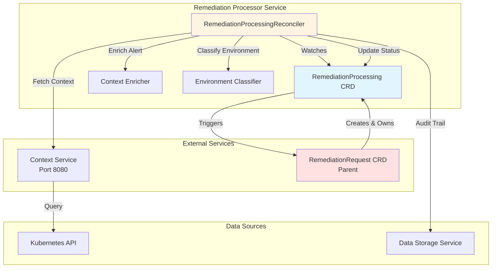

###Sequence Diagram - Enrichment Flow
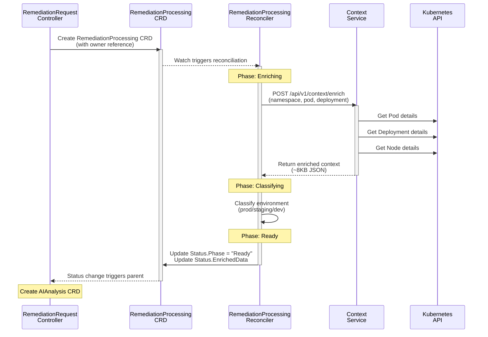

### State Machine - Reconciliation Phases
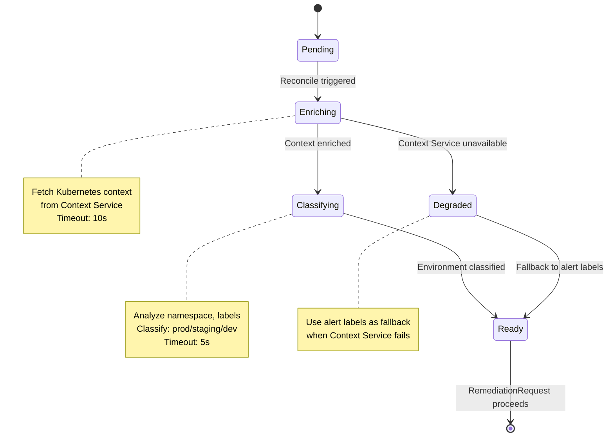

---

## 02-aianalysis/ Diagrams

### Architecture Diagram
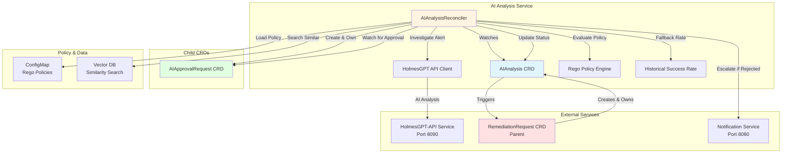

### Sequence Diagram - Approval Workflow
```mermaid
sequenceDiagram
    participant AR as RemediationRequest
    participant AIA as AIAnalysis CRD
    participant Ctrl as AIAnalysis<br/>Reconciler
    participant HG as HolmesGPT-API
    participant Rego as Rego Engine
    participant App as AIApprovalRequest<br/>CRD
    participant Not as Notification<br/>Service

    AR->>AIA: Create AIAnalysis CRD
    activate AIA
    AIA-->>Ctrl: Watch triggers reconciliation
    activate Ctrl

    Note over Ctrl: Phase: Investigating
    Ctrl->>HG: POST /api/v1/investigate<br/>(alert + context)
    activate HG
    HG-->>Ctrl: Return analysis + recommendations<br/>(confidence >80%)
    deactivate HG

    Note over Ctrl: Phase: Approving
    Ctrl->>Rego: Evaluate approval policy<br/>(action, environment, confidence)

    alt Auto-Approve (non-production, high confidence)
        Rego-->>Ctrl: AUTO_APPROVE
        Ctrl->>AIA: Status.ApprovalStatus = "Approved"
        Note over AIA: Skip to Ready
    else Manual Approval Required
        Rego-->>Ctrl: MANUAL_APPROVAL_REQUIRED
        Ctrl->>App: Create AIApprovalRequest CRD
        activate App
        Ctrl-->>App: Watch for approval decision

        alt Approved by Operator
            App->>App: Status.Decision = "Approved"
            App-->>Ctrl: Watch triggers reconciliation
            Ctrl->>AIA: Status.ApprovalStatus = "Approved"
            deactivate App
        else Rejected by Operator
            App->>App: Status.Decision = "Rejected"
            App-->>Ctrl: Watch triggers reconciliation
            Ctrl->>Not: Send escalation notification
            Ctrl->>AIA: Status.ApprovalStatus = "Rejected"
            deactivate App
        end
    end

    Note over Ctrl: Phase: Ready
    Ctrl->>AIA: Status.Phase = "Ready"
    deactivate Ctrl
    AIA-->>AR: Status change triggers parent
    deactivate AIA

    Note over AR: Create WorkflowExecution CRD
```

### State Machine - Reconciliation Phases
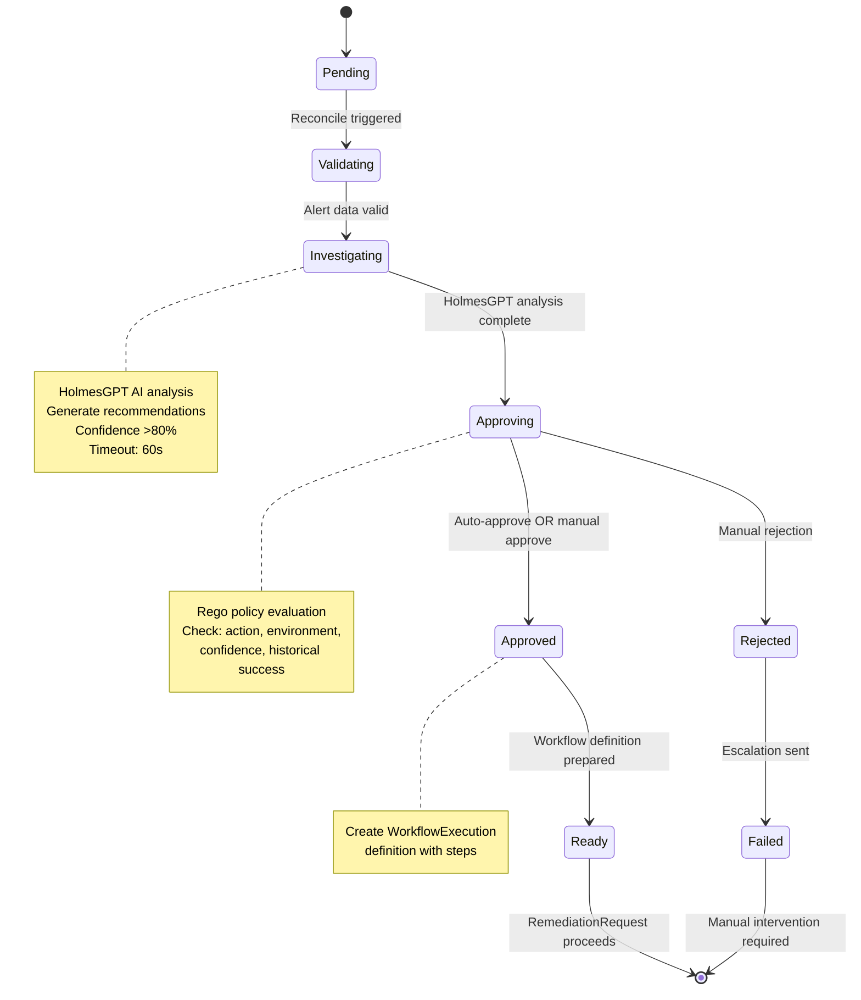

---

## 03-workflowexecution/ Diagrams

### Architecture Diagram
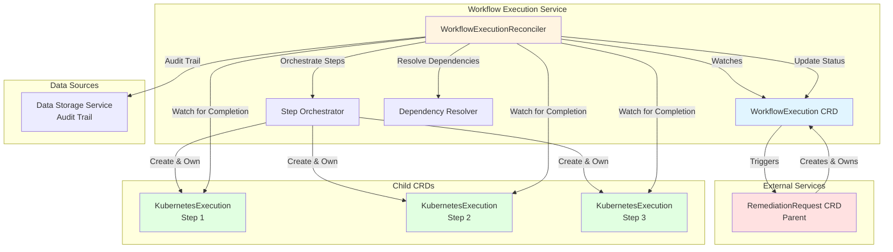

### Sequence Diagram - Step Orchestration
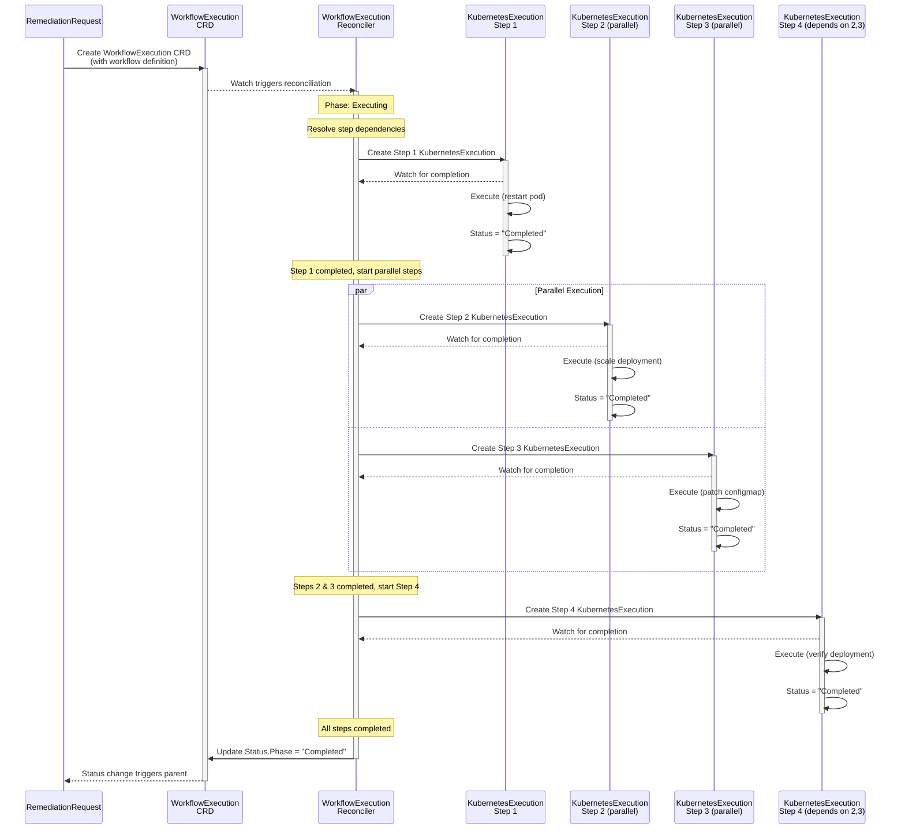

### State Machine - Step Orchestration
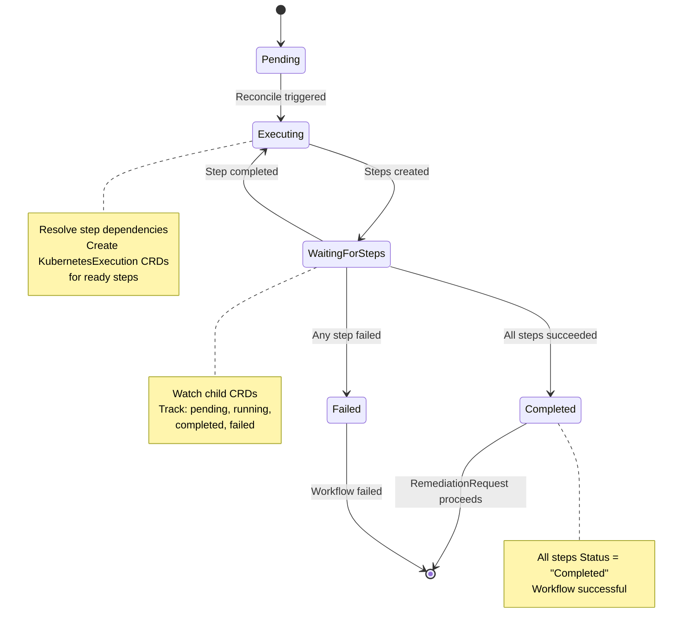

---

## 04-kubernetesexecutor/ Diagrams

### Architecture Diagram
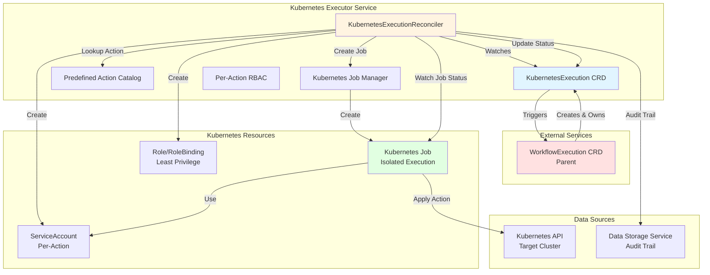

### Sequence Diagram - Job Execution Flow
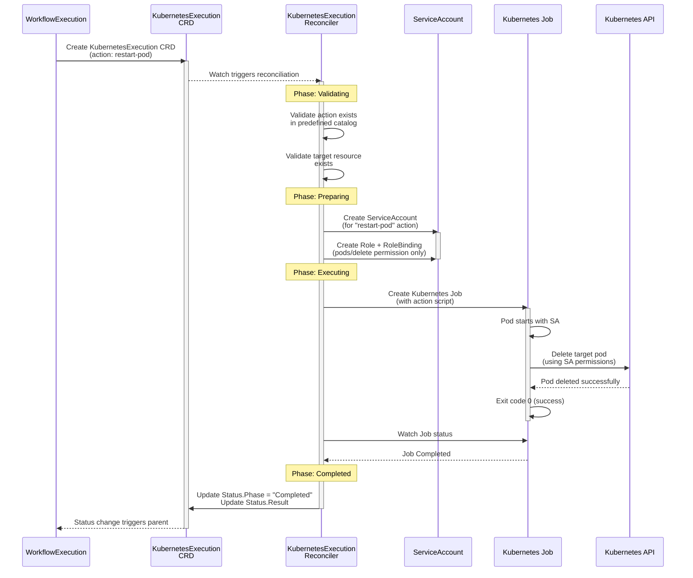

### State Machine - Job Execution Phases
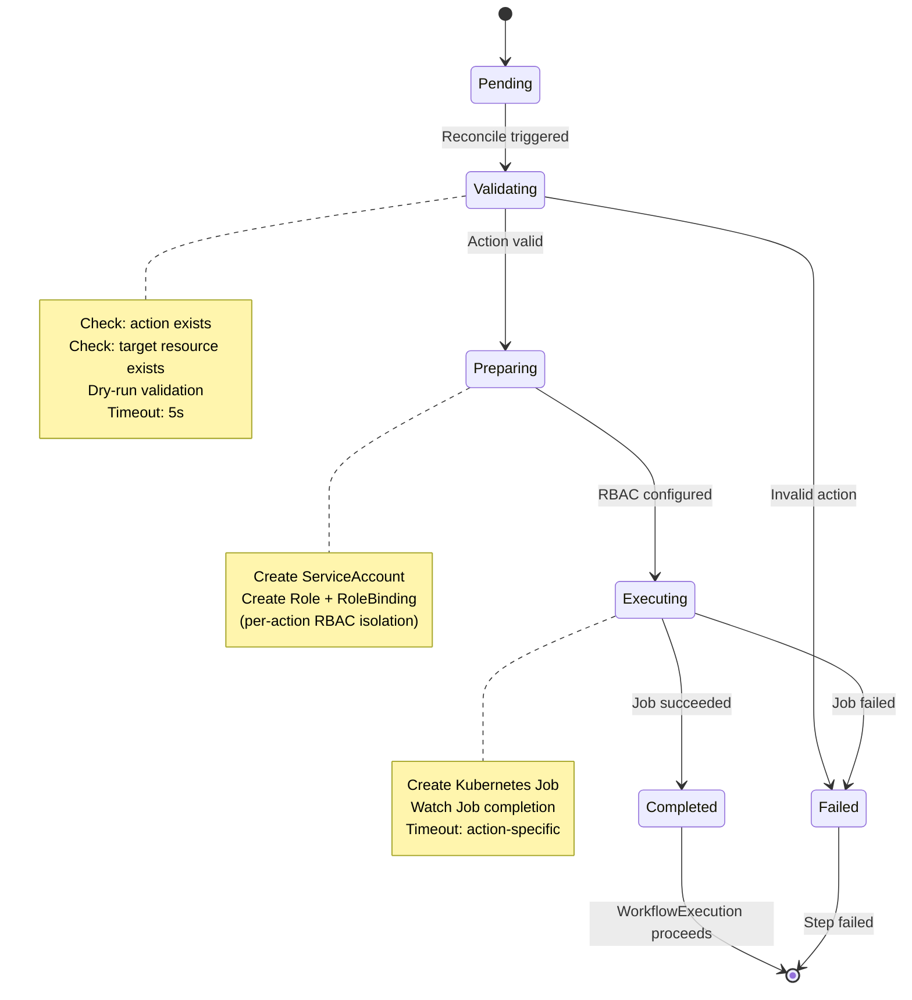

---

## 05-remediationorchestrator/ Diagrams

### Architecture Diagram
```mermaid
graph TB
    subgraph "Remediation Orchestrator (RemediationRequest Service)"
        AR[RemediationRequest CRD]
        Controller[RemediationRequestReconciler]
        StateMachine[State Machine]
        TargetingData[Targeting Data Pattern]
    end

    subgraph "Upstream"
        Gateway[Gateway Service<br/>Port 8080]
    end

    subgraph "Child CRDs (Flat Sibling Hierarchy)"
        AP[RemediationProcessing CRD]
        AIA[AIAnalysis CRD]
        WE[WorkflowExecution CRD]
    end

    subgraph "External Services"
        Notification[Notification Service<br/>Port 8080]
        DB[Data Storage Service<br/>Audit Trail]
    end

    Gateway -->|Creates| AR
    AR -->|Owns (owner ref)| AP
    AR -->|Owns (owner ref)| AIA
    AR -->|Owns (owner ref)| WE
    Controller -->|Watches| AR
    Controller -->|Create with TargetingData| AP
    Controller -->|Create with TargetingData| AIA
    Controller -->|Create with TargetingData| WE
    Controller -->|Watch Status| AP
    Controller -->|Watch Status| AIA
    Controller -->|Watch Status| WE
    Controller -->|State Transitions| StateMachine
    Controller -->|Escalate if Failed| Notification
    Controller -->|Update Status| AR
    Controller -->|Audit Trail| DB

    style AR fill:#ffe1e1
    style Controller fill:#fff4e1
    style AP fill:#e1f5ff
    style AIA fill:#e1f5ff
    style WE fill:#e1f5ff
```

### Sequence Diagram - Central Orchestration Flow
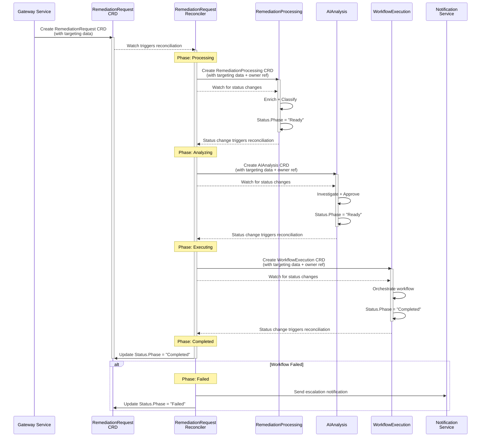

### State Machine - Central Orchestration Phases
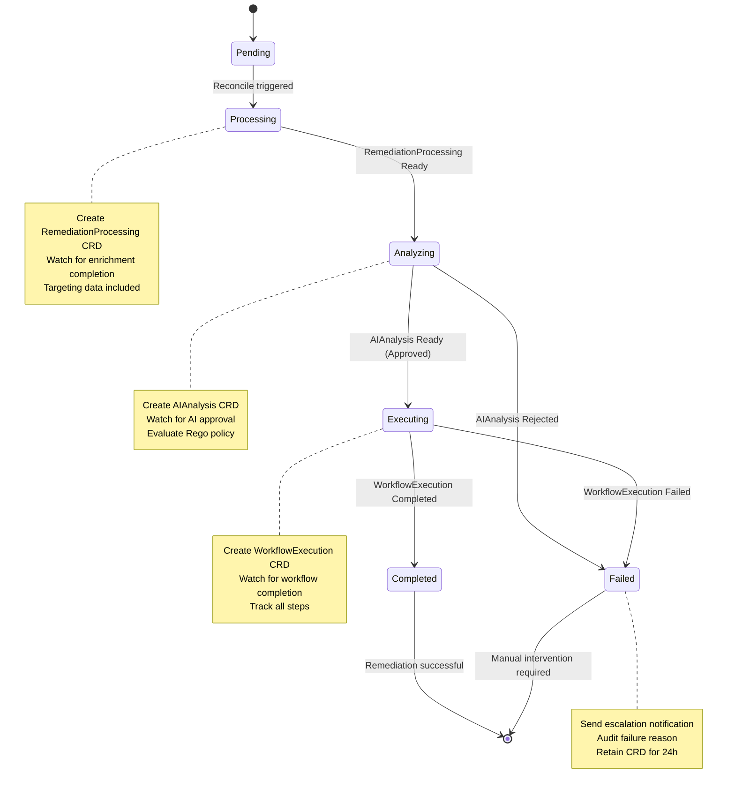

### Targeting Data Pattern
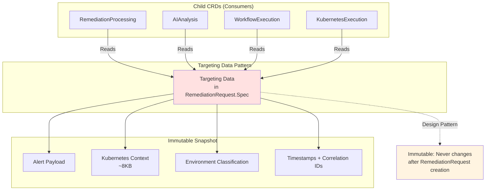

---

## Diagram Rendering Instructions

### **Viewing in Markdown**
Most modern markdown viewers (GitHub, GitLab, VS Code, Obsidian) support Mermaid natively:

1. **GitHub/GitLab**: Renders automatically
2. **VS Code**: Install "Markdown Preview Mermaid Support" extension
3. **Obsidian**: Built-in support
4. **IntelliJ/WebStorm**: Built-in support

### **Diagram Types Used**
- **Architecture (graph TB)**: Component relationships and data flow
- **Sequence (sequenceDiagram)**: Time-ordered interactions
- **State Machine (stateDiagram-v2)**: Phase transitions and lifecycle

### **Color Legend**
- **Blue (#e1f5ff)**: Current service's CRD
- **Yellow (#fff4e1)**: Controller/reconciler
- **Red (#ffe1e1)**: Parent CRD (owner)
- **Green (#e1ffe1)**: Child CRDs (owned)

---

**Total Diagrams**: 15 diagrams across 5 services
**Lines**: ~375 lines of Mermaid syntax
**Status**: ✅ Ready to integrate into overview.md files

