# Visual Diagrams Master Document

**Purpose**: Master collection of Mermaid diagrams for all 5 CRD services
**Usage**: Copy relevant diagrams to each service's overview.md
**Date**: 2025-01-15

---

## 01-alertprocessor/ Diagrams

### Architecture Diagram
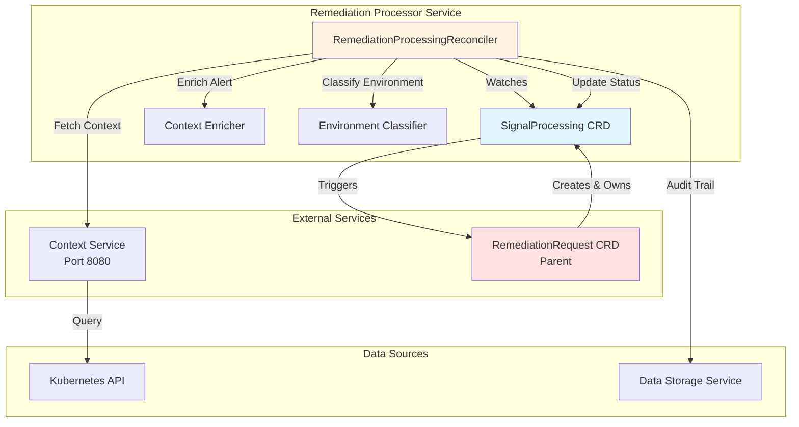
```mermaid
graph TB
    subgraph "Remediation Processor Service"
        AP[SignalProcessing CRD]
        Controller[RemediationProcessingReconciler]
        Enricher[Context Enricher]
        Classifier[Environment Classifier]
    end

    subgraph "External Services"
        CS[Context Service<br/>Port 8080]
        AR[RemediationRequest CRD<br/>Parent]
    end

    subgraph "Data Sources"
        K8S[Kubernetes API]
        DB[Data Storage Service]
    end

    AR -->|Creates & Owns| AP
    Controller -->|Watches| AP
    Controller -->|Fetch Context| CS
    CS -->|Query| K8S
    Controller -->|Classify Environment| Classifier
    Controller -->|Enrich Alert| Enricher
    Controller -->|Update Status| AP
    AP -->|Triggers| AR
    Controller -->|Audit Trail| DB

    style AP fill:#e1f5ff
    style Controller fill:#fff4e1
    style AR fill:#ffe1e1
```

###Sequence Diagram - Enrichment Flow
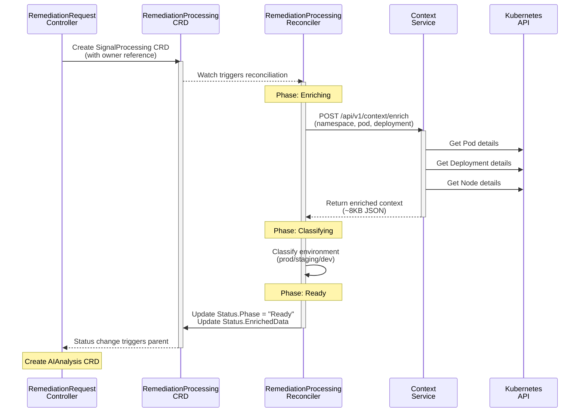
```mermaid
sequenceDiagram
    participant AR as RemediationRequest<br/>Controller
    participant AP as RemediationProcessing<br/>CRD
    participant Ctrl as RemediationProcessing<br/>Reconciler
    participant CS as Context<br/>Service
    participant K8S as Kubernetes<br/>API

    AR->>AP: Create SignalProcessing CRD<br/>(with owner reference)
    activate AP
    AP-->>Ctrl: Watch triggers reconciliation
    activate Ctrl

    Note over Ctrl: Phase: Enriching
    Ctrl->>CS: POST /api/v1/context/enrich<br/>(namespace, pod, deployment)
    activate CS
    CS->>K8S: Get Pod details
    CS->>K8S: Get Deployment details
    CS->>K8S: Get Node details
    CS-->>Ctrl: Return enriched context<br/>(~8KB JSON)
    deactivate CS

    Note over Ctrl: Phase: Classifying
    Ctrl->>Ctrl: Classify environment<br/>(prod/staging/dev)

    Note over Ctrl: Phase: Ready
    Ctrl->>AP: Update Status.Phase = "Ready"<br/>Update Status.EnrichedData
    deactivate Ctrl
    AP-->>AR: Status change triggers parent
    deactivate AP

    Note over AR: Create AIAnalysis CRD
```

### State Machine - Reconciliation Phases
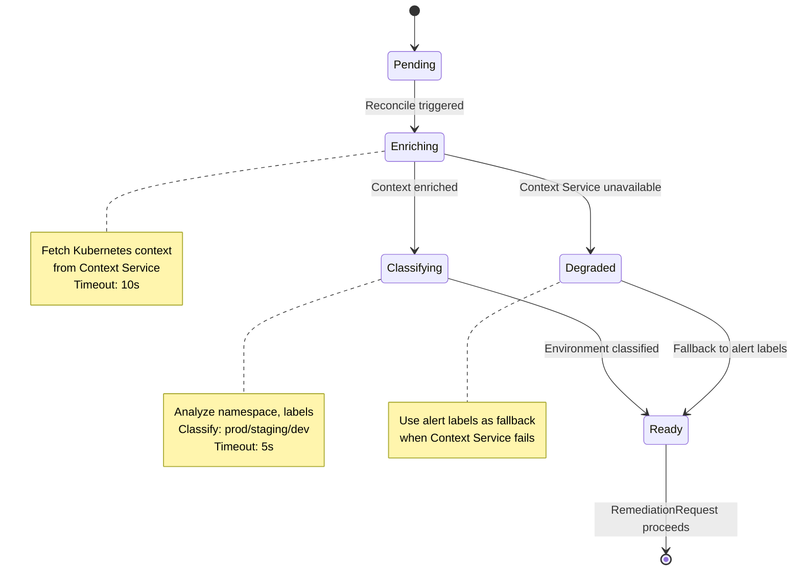
```mermaid
stateDiagram-v2
    [*] --> Pending
    Pending --> Enriching: Reconcile triggered
    Enriching --> Classifying: Context enriched
    Enriching --> Degraded: Context Service unavailable
    Classifying --> Ready: Environment classified
    Degraded --> Ready: Fallback to alert labels
    Ready --> [*]: RemediationRequest proceeds

    note right of Enriching
        Fetch Kubernetes context
        from Context Service
        Timeout: 10s
    end note

    note right of Classifying
        Analyze namespace, labels
        Classify: prod/staging/dev
        Timeout: 5s
    end note

    note right of Degraded
        Use alert labels as fallback
        when Context Service fails
    end note
```

---

## 02-aianalysis/ Diagrams

### Architecture Diagram
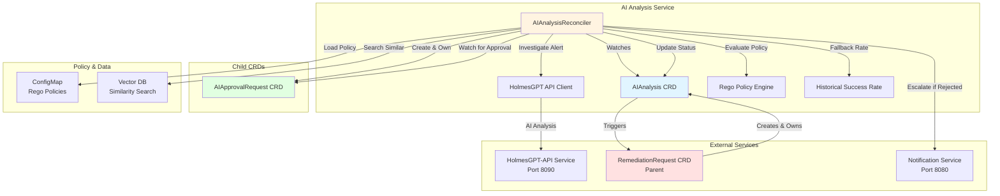
```mermaid
graph TB
    subgraph "AI Analysis Service"
        AIA[AIAnalysis CRD]
        Controller[AIAnalysisReconciler]
        HolmesAPI[HolmesGPT API Client]
        RegoEngine[Rego Policy Engine]
        HistoricalDB[Historical Success Rate]
    end

    subgraph "External Services"
        HolmesGPT[HolmesGPT-API Service<br/>Port 8090]
        AR[RemediationRequest CRD<br/>Parent]
        Notification[Notification Service<br/>Port 8080]
    end

    subgraph "Child CRDs"
        Approval[AIApprovalRequest CRD]
    end

    subgraph "Policy & Data"
        CM[ConfigMap<br/>Rego Policies]
        VectorDB[Vector DB<br/>Similarity Search]
    end

    AR -->|Creates & Owns| AIA
    Controller -->|Watches| AIA
    Controller -->|Investigate Alert| HolmesAPI
    HolmesAPI -->|AI Analysis| HolmesGPT
    Controller -->|Load Policy| CM
    Controller -->|Evaluate Policy| RegoEngine
    Controller -->|Search Similar| VectorDB
    Controller -->|Fallback Rate| HistoricalDB
    Controller -->|Create & Own| Approval
    Controller -->|Watch for Approval| Approval
    Controller -->|Escalate if Rejected| Notification
    Controller -->|Update Status| AIA
    AIA -->|Triggers| AR

    style AIA fill:#e1f5ff
    style Controller fill:#fff4e1
    style AR fill:#ffe1e1
    style Approval fill:#e1ffe1
```

### Sequence Diagram - Approval Workflow
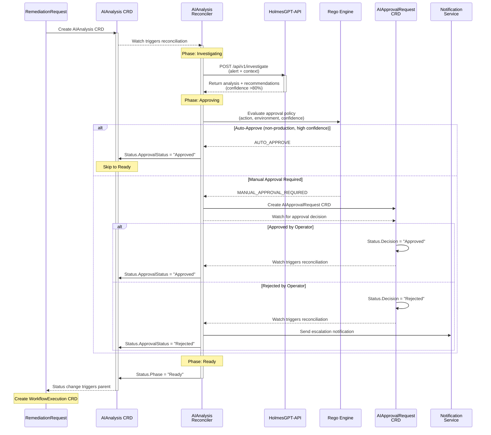
```mermaid
sequenceDiagram
    participant AR as RemediationRequest
    participant AIA as AIAnalysis CRD
    participant Ctrl as AIAnalysis<br/>Reconciler
    participant HG as HolmesGPT-API
    participant Rego as Rego Engine
    participant App as AIApprovalRequest<br/>CRD
    participant Not as Notification<br/>Service

    AR->>AIA: Create AIAnalysis CRD
    activate AIA
    AIA-->>Ctrl: Watch triggers reconciliation
    activate Ctrl

    Note over Ctrl: Phase: Investigating
    Ctrl->>HG: POST /api/v1/investigate<br/>(alert + context)
    activate HG
    HG-->>Ctrl: Return analysis + recommendations<br/>(confidence >80%)
    deactivate HG

    Note over Ctrl: Phase: Approving
    Ctrl->>Rego: Evaluate approval policy<br/>(action, environment, confidence)

    alt Auto-Approve (non-production, high confidence)
        Rego-->>Ctrl: AUTO_APPROVE
        Ctrl->>AIA: Status.ApprovalStatus = "Approved"
        Note over AIA: Skip to Ready
    else Manual Approval Required
        Rego-->>Ctrl: MANUAL_APPROVAL_REQUIRED
        Ctrl->>App: Create AIApprovalRequest CRD
        Ctrl-->>App: Watch for approval decision

        alt Approved by Operator
            App->>App: Status.Decision = "Approved"
            App-->>Ctrl: Watch triggers reconciliation
            Ctrl->>AIA: Status.ApprovalStatus = "Approved"
        else Rejected by Operator
            App->>App: Status.Decision = "Rejected"
            App-->>Ctrl: Watch triggers reconciliation
            Ctrl->>Not: Send escalation notification
            Ctrl->>AIA: Status.ApprovalStatus = "Rejected"
        end
    end

    Note over Ctrl: Phase: Ready
    Ctrl->>AIA: Status.Phase = "Ready"
    deactivate Ctrl
    AIA-->>AR: Status change triggers parent
    deactivate AIA

    Note over AR: Create WorkflowExecution CRD
```

### State Machine - Reconciliation Phases
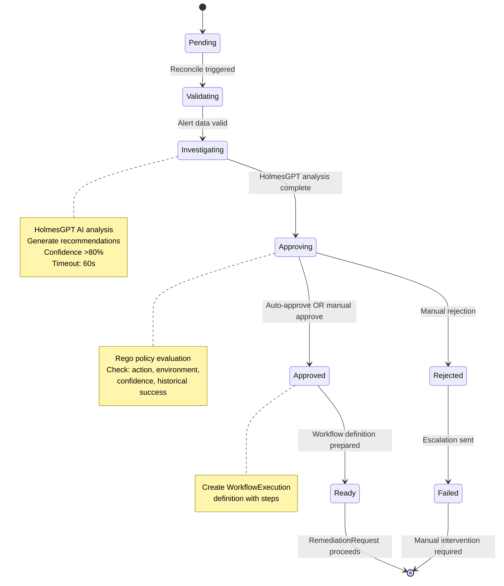
```mermaid
stateDiagram-v2
    [*] --> Pending
    Pending --> Validating: Reconcile triggered
    Validating --> Investigating: Alert data valid
    Investigating --> Approving: HolmesGPT analysis complete
    Approving --> Approved: Auto-approve OR manual approve
    Approving --> Rejected: Manual rejection
    Approved --> Ready: Workflow definition prepared
    Rejected --> Failed: Escalation sent
    Ready --> [*]: RemediationRequest proceeds
    Failed --> [*]: Manual intervention required

    note right of Investigating
        HolmesGPT AI analysis
        Generate recommendations
        Confidence >80%
        Timeout: 60s
    end note

    note right of Approving
        Rego policy evaluation
        Check: action, environment,
        confidence, historical success
    end note

    note right of Approved
        Create WorkflowExecution
        definition with steps
    end note
```

---

## 03-workflowexecution/ Diagrams

### Architecture Diagram
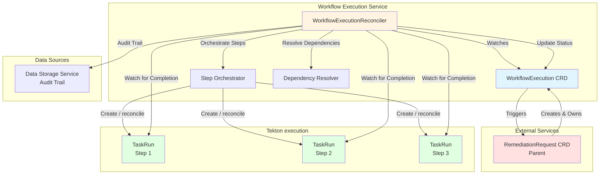
```mermaid
graph TB
    subgraph "Workflow Execution Service"
        WE[WorkflowExecution CRD]
        Controller[WorkflowExecutionReconciler]
        Orchestrator[Step Orchestrator]
        DependencyGraph[Dependency Resolver]
    end

    subgraph "External Services"
        AR[RemediationRequest CRD<br/>Parent]
    end

    subgraph "Tekton execution"
        TR1[TaskRun<br/>Step 1]
        TR2[TaskRun<br/>Step 2]
        TR3[TaskRun<br/>Step 3]
    end

    subgraph "Data Sources"
        DB[Data Storage Service<br/>Audit Trail]
    end

    AR -->|Creates & Owns| WE
    Controller -->|Watches| WE
    Controller -->|Resolve Dependencies| DependencyGraph
    Controller -->|Orchestrate Steps| Orchestrator
    Orchestrator -->|Create / reconcile| TR1
    Orchestrator -->|Create / reconcile| TR2
    Orchestrator -->|Create / reconcile| TR3
    Controller -->|Watch for Completion| TR1
    Controller -->|Watch for Completion| TR2
    Controller -->|Watch for Completion| TR3
    Controller -->|Update Status| WE
    Controller -->|Audit Trail| DB
    WE -->|Triggers| AR

    style WE fill:#e1f5ff
    style Controller fill:#fff4e1
    style AR fill:#ffe1e1
    style TR1 fill:#e1ffe1
    style TR2 fill:#e1ffe1
    style TR3 fill:#e1ffe1
```

### Sequence Diagram - Step Orchestration
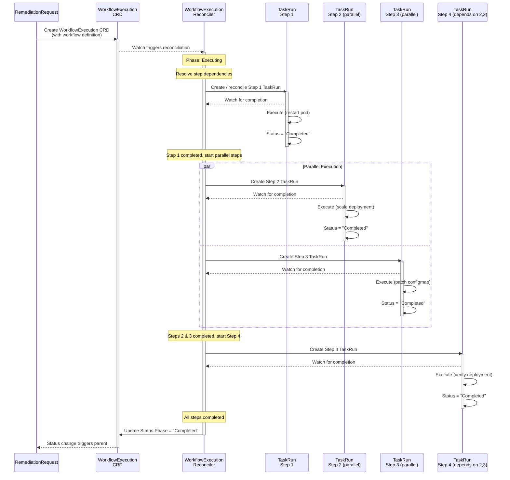
```mermaid
sequenceDiagram
    participant AR as RemediationRequest
    participant WE as WorkflowExecution<br/>CRD
    participant Ctrl as WorkflowExecution<br/>Reconciler
    participant TR1 as TaskRun<br/>Step 1
    participant TR2 as TaskRun<br/>Step 2 (parallel)
    participant TR3 as TaskRun<br/>Step 3 (parallel)
    participant TR4 as TaskRun<br/>Step 4 (depends on 2,3)

    AR->>WE: Create WorkflowExecution CRD<br/>(with workflow definition)
    activate WE
    WE-->>Ctrl: Watch triggers reconciliation
    activate Ctrl

    Note over Ctrl: Phase: Executing
    Note over Ctrl: Resolve step dependencies

    Ctrl->>TR1: Create / reconcile Step 1 TaskRun
    activate TR1
    TR1-->>Ctrl: Watch for completion
    TR1->>TR1: Execute (restart pod)
    TR1->>TR1: Status = "Completed"
    deactivate TR1

    Note over Ctrl: Step 1 completed, start parallel steps

    par Parallel Execution
        Ctrl->>TR2: Create Step 2 TaskRun
        activate TR2
        TR2-->>Ctrl: Watch for completion
        TR2->>TR2: Execute (scale deployment)
        TR2->>TR2: Status = "Completed"
        deactivate TR2
    and
        Ctrl->>TR3: Create Step 3 TaskRun
        activate TR3
        TR3-->>Ctrl: Watch for completion
        TR3->>TR3: Execute (patch configmap)
        TR3->>TR3: Status = "Completed"
        deactivate TR3
    end

    Note over Ctrl: Steps 2 & 3 completed, start Step 4

    Ctrl->>TR4: Create Step 4 TaskRun
    activate TR4
    TR4-->>Ctrl: Watch for completion
    TR4->>TR4: Execute (verify deployment)
    TR4->>TR4: Status = "Completed"
    deactivate TR4

    Note over Ctrl: All steps completed
    Ctrl->>WE: Update Status.Phase = "Completed"
    deactivate Ctrl
    WE-->>AR: Status change triggers parent
    deactivate WE
```

### State Machine - Step Orchestration
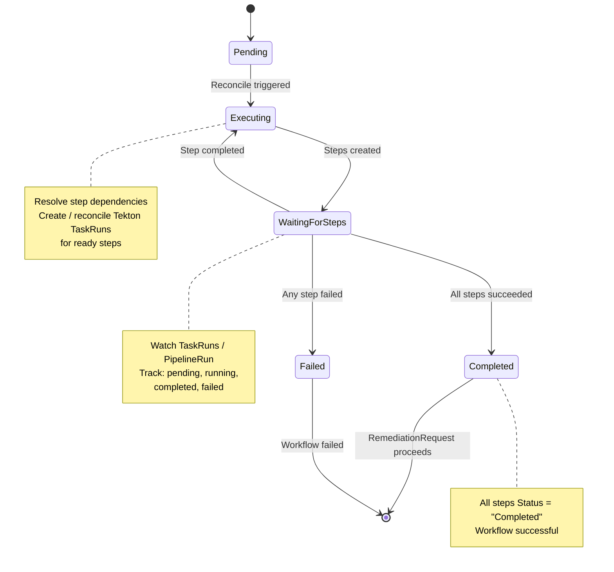
```mermaid
stateDiagram-v2
    [*] --> Pending
    Pending --> Executing: Reconcile triggered
    Executing --> WaitingForSteps: Steps created
    WaitingForSteps --> Executing: Step completed
    WaitingForSteps --> Completed: All steps succeeded
    WaitingForSteps --> Failed: Any step failed
    Completed --> [*]: RemediationRequest proceeds
    Failed --> [*]: Workflow failed

    note right of Executing
        Resolve step dependencies
        Create / reconcile Tekton TaskRuns
        for ready steps
    end note

    note right of WaitingForSteps
        Watch TaskRuns / PipelineRun
        Track: pending, running,
        completed, failed
    end note

    note right of Completed
        All steps Status = "Completed"
        Workflow successful
    end note
```

---

## 05-remediationorchestrator/ Diagrams

### Architecture Diagram
```mermaid
graph TB
    subgraph "Remediation Orchestrator (RemediationRequest Service)"
        AR[RemediationRequest CRD]
        Controller[RemediationRequestReconciler]
        StateMachine[State Machine]
        TargetingData[Targeting Data Pattern]
    end

    subgraph "Upstream"
        Gateway[Gateway Service<br/>Port 8080]
    end

    subgraph "Child CRDs (Flat Sibling Hierarchy)"
        AP[SignalProcessing CRD]
        AIA[AIAnalysis CRD]
        WE[WorkflowExecution CRD]
    end

    subgraph "External Services"
        Notification[Notification Service<br/>Port 8080]
        DB[Data Storage Service<br/>Audit Trail]
    end

    Gateway -->|Creates| AR
    AR -->|Owns (owner ref)| AP
    AR -->|Owns (owner ref)| AIA
    AR -->|Owns (owner ref)| WE
    Controller -->|Watches| AR
    Controller -->|Create with TargetingData| AP
    Controller -->|Create with TargetingData| AIA
    Controller -->|Create with TargetingData| WE
    Controller -->|Watch Status| AP
    Controller -->|Watch Status| AIA
    Controller -->|Watch Status| WE
    Controller -->|State Transitions| StateMachine
    Controller -->|Escalate if Failed| Notification
    Controller -->|Update Status| AR
    Controller -->|Audit Trail| DB

    style AR fill:#ffe1e1
    style Controller fill:#fff4e1
    style AP fill:#e1f5ff
    style AIA fill:#e1f5ff
    style WE fill:#e1f5ff
```

### Sequence Diagram - Central Orchestration Flow
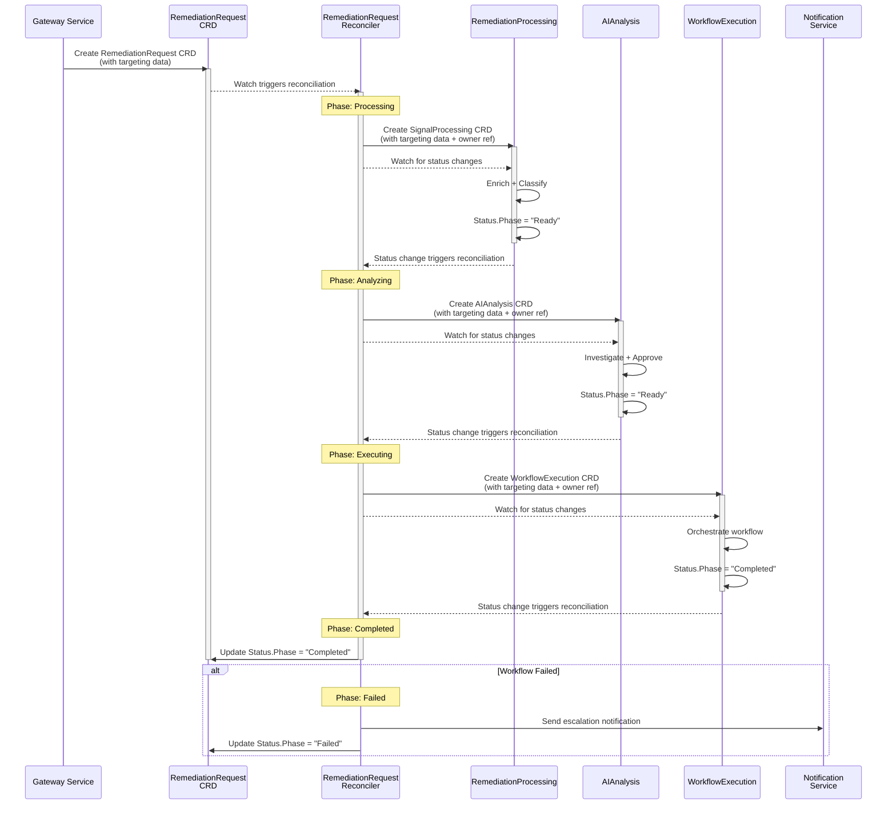
```mermaid
sequenceDiagram
    participant GW as Gateway Service
    participant AR as RemediationRequest<br/>CRD
    participant Ctrl as RemediationRequest<br/>Reconciler
    participant AP as RemediationProcessing
    participant AIA as AIAnalysis
    participant WE as WorkflowExecution
    participant Not as Notification<br/>Service

    GW->>AR: Create RemediationRequest CRD<br/>(with targeting data)
    activate AR
    AR-->>Ctrl: Watch triggers reconciliation
    activate Ctrl

    Note over Ctrl: Phase: Processing
    Ctrl->>AP: Create SignalProcessing CRD<br/>(with targeting data + owner ref)
    activate AP
    Ctrl-->>AP: Watch for status changes
    AP->>AP: Enrich + Classify
    AP->>AP: Status.Phase = "Ready"
    deactivate AP
    AP-->>Ctrl: Status change triggers reconciliation

    Note over Ctrl: Phase: Analyzing
    Ctrl->>AIA: Create AIAnalysis CRD<br/>(with targeting data + owner ref)
    activate AIA
    Ctrl-->>AIA: Watch for status changes
    AIA->>AIA: Investigate + Approve
    AIA->>AIA: Status.Phase = "Ready"
    deactivate AIA
    AIA-->>Ctrl: Status change triggers reconciliation

    Note over Ctrl: Phase: Executing
    Ctrl->>WE: Create WorkflowExecution CRD<br/>(with targeting data + owner ref)
    activate WE
    Ctrl-->>WE: Watch for status changes
    WE->>WE: Orchestrate workflow
    WE->>WE: Status.Phase = "Completed"
    deactivate WE
    WE-->>Ctrl: Status change triggers reconciliation

    Note over Ctrl: Phase: Completed
    Ctrl->>AR: Update Status.Phase = "Completed"
    deactivate Ctrl
    deactivate AR

    alt Workflow Failed
        Note over Ctrl: Phase: Failed
        Ctrl->>Not: Send escalation notification
        Ctrl->>AR: Update Status.Phase = "Failed"
    end
```

### State Machine - Central Orchestration Phases
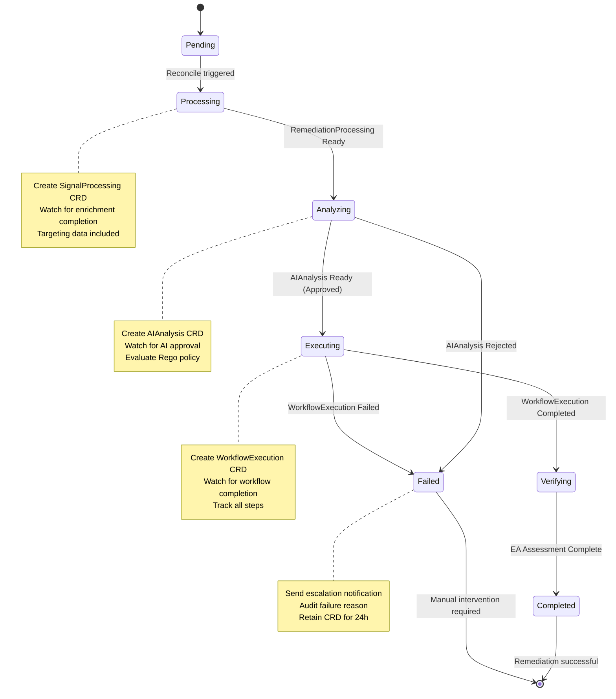
```mermaid
stateDiagram-v2
    [*] --> Pending
    Pending --> Processing: Reconcile triggered
    Processing --> Analyzing: RemediationProcessing Ready
    Analyzing --> Executing: AIAnalysis Ready (Approved)
    Analyzing --> Failed: AIAnalysis Rejected
    Executing --> Verifying: WorkflowExecution Completed
    Executing --> Failed: WorkflowExecution Failed
    Verifying --> Completed: EA Assessment Complete
    Completed --> [*]: Remediation successful
    Failed --> [*]: Manual intervention required

    note right of Processing
        Create SignalProcessing CRD
        Watch for enrichment completion
        Targeting data included
    end note

    note right of Analyzing
        Create AIAnalysis CRD
        Watch for AI approval
        Evaluate Rego policy
    end note

    note right of Executing
        Create WorkflowExecution CRD
        Watch for workflow completion
        Track all steps
    end note

    note right of Failed
        Send escalation notification
        Audit failure reason
        Retain CRD for 24h
    end note
```

### Targeting Data Pattern
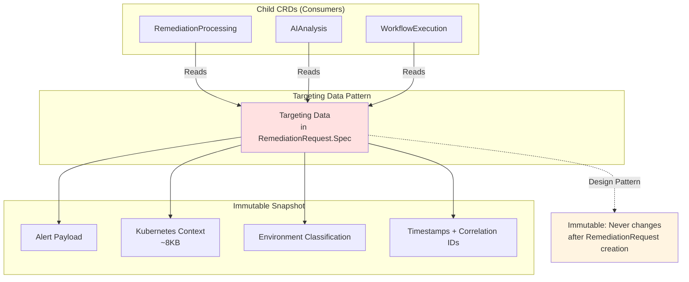
```mermaid
graph TB
    subgraph "Targeting Data Pattern"
        TD[Targeting Data<br/>in RemediationRequest.Spec]
    end

    subgraph "Immutable Snapshot"
        Alert[Alert Payload]
        K8sContext[Kubernetes Context<br/>~8KB]
        Environment[Environment Classification]
        Metadata[Timestamps + Correlation IDs]
    end

    subgraph "Child CRDs (Consumers)"
        AP[RemediationProcessing]
        AIA[AIAnalysis]
        WE[WorkflowExecution]
    end

    TD --> Alert
    TD --> K8sContext
    TD --> Environment
    TD --> Metadata

    AP -->|Reads| TD
    AIA -->|Reads| TD
    WE -->|Reads| TD

    Note[Immutable: Never changes<br/>after RemediationRequest creation]
    TD -.->|Design Pattern| Note

    style TD fill:#ffe1e1
    style Note fill:#fff4e1
```

---

## Diagram Rendering Instructions

### **Viewing in Markdown**
Most modern markdown viewers (GitHub, GitLab, VS Code, Obsidian) support Mermaid natively:

1. **GitHub/GitLab**: Renders automatically
2. **VS Code**: Install "Markdown Preview Mermaid Support" extension
3. **Obsidian**: Built-in support
4. **IntelliJ/WebStorm**: Built-in support

### **Diagram Types Used**
- **Architecture (graph TB)**: Component relationships and data flow
- **Sequence (sequenceDiagram)**: Time-ordered interactions
- **State Machine (stateDiagram-v2)**: Phase transitions and lifecycle

### **Color Legend**
- **Blue (#e1f5ff)**: Current service's CRD
- **Yellow (#fff4e1)**: Controller/reconciler
- **Red (#ffe1e1)**: Parent CRD (owner)
- **Green (#e1ffe1)**: Child CRDs (owned)

---

**Total Diagrams**: 15 diagrams across 5 services
**Lines**: ~375 lines of Mermaid syntax
**Status**: ✅ Ready to integrate into overview.md files

