> **DEPRECATED (Issue #180)**: The recovery flow (DD-RECOVERY-002/003) has been deprecated.
> The existing DS remediation-history flow (ADR-055) provides historical context on signal re-arrival.
> This document is preserved for historical reference only.

---


# Failure Recovery Flow - Approved Sequence Diagram

**Document Version**: 1.1
**Last Updated**: October 31, 2025

## 📋 Version History

| Version | Date | Changes | Author |
|---------|------|---------|--------|
| 1.1 | Oct 31, 2025 | Updated diagram: K8s Executor → Tekton Pipelines (per ADR-023, ADR-025) | AI Assistant |
| 1.0 | Oct 8, 2025 | Initial approved version (Alternative 2) | - |

---

## 📋 **Design Decision Status**

**Current Implementation**: **Alternative 2** (Approved Design)
**Status**: ✅ **Production-Ready** | **Authoritative Reference**
**Last Reviewed**: October 31, 2025
**Confidence**: 95%
**Design Decision**: [DD-001](DESIGN_DECISIONS.md#dd-001-recovery-context-enrichment-alternative-2)

**Supersedes**:
- Option A (AIAnalysis Controller queries Context API)
- Option B (Remediation Orchestrator embeds static context)

---

<details>
<summary><b>📖 Why Alternative 2? (Click to expand design history)</b></summary>

### Alternatives Considered

**Alternative 1 (Option A)**: AIAnalysis Controller queries Context API directly
- ❌ **Rejected**: Breaks temporal consistency (contexts captured at different times)
- ❌ **Rejected**: Uses stale monitoring/business contexts from initial attempt

**Alternative 2 (Option B → Final)**: RemediationProcessing enriches ALL contexts
- ✅ **Approved**: Temporal consistency (all contexts at same timestamp)
- ✅ **Approved**: Fresh monitoring/business contexts for recovery
- ✅ **Approved**: Immutable audit trail (each RP CRD is complete snapshot)
- ✅ **Approved**: Self-contained CRDs (AIAnalysis reads from spec only)

**Alternative 3**: AIAnalysis queries Context API after RP completion
- ❌ **Rejected**: Incomplete audit trail (recovery context not in RP)
- ❌ **Rejected**: Breaks temporal consistency

**Decision Rationale**: The ~1 minute "penalty" for dual enrichment (RP enriches → RR creates AIAnalysis) is actually a **feature** - it ensures fresh contexts for better AI recommendations.

**Full Analysis**: See [DESIGN_DECISIONS.md - DD-001](DESIGN_DECISIONS.md#dd-001-recovery-context-enrichment-alternative-2)

</details>

---

## ✅ **Document Status: Official Implementation Reference**

**Document Version**: 1.2 - UPDATED FOR ALTERNATIVE 2
**Date**: October 8, 2025 (Updated for Alternative 2)
**Purpose**: Official sequence diagram for step failure recovery flow with recovery loop prevention

This is the **approved and authoritative** sequence diagram for step failure recovery in Kubernaut.

**Related Documentation**:
- **Architecture**: [`STEP_FAILURE_RECOVERY_ARCHITECTURE.md`](./STEP_FAILURE_RECOVERY_ARCHITECTURE.md) - Design principles and patterns
- **Assessment**: [`FAILURE_RECOVERY_FLOW_CONFIDENCE_ASSESSMENT.md`](./FAILURE_RECOVERY_FLOW_CONFIDENCE_ASSESSMENT.md) - Analysis leading to approval
- **Superseded**: [`SCENARIO_A_RECOVERABLE_FAILURE_SEQUENCE.md`](./SCENARIO_A_RECOVERABLE_FAILURE_SEQUENCE.md) - Historical reference

---

## 🎯 **Flow Overview**

### **Enhanced Recovery Flow with Mitigations (Alternative 2)**

1. ⚙️ **Step Execution Fails** - KubernetesExecutor detects failure and updates status
2. 🔄 **Workflow Orchestrator Detection** - Detects failure, updates WorkflowExecution status to `failed`
3. 🎯 **Remediation Orchestrator Recovery Coordination** - Evaluates recovery viability, **creates new SignalProcessing CRD** (recovery)
4. 📊 **RemediationProcessing Enrichment** - Enriches with **fresh monitoring + business + recovery context** (queries Context API)
5. 🧠 **AIAnalysis Processing** - Reads all contexts from AIAnalysis spec, sends enriched prompt to HolmesGPT
6. ✅ **Recovery Workflow Execution** - New workflow created from recovery analysis, execution continues

**Key Improvements (Alternative 2 Design):**
- ✅ Recovery loop prevention (max 3 attempts)
- ✅ **Complete enrichment in RemediationProcessing Controller** (ALL contexts in one place)
- ✅ **Fresh monitoring + business + recovery context** (temporal consistency)
- ✅ **Immutable audit trail** (each SignalProcessing CRD is separate)
- ✅ **Context API integration in RemediationProcessing** (consistent enrichment pattern)
- ✅ Multiple CRD references for audit trail
- ✅ Enhanced prompt engineering for recovery
- ✅ Clear state transitions with "recovering" phase
- ✅ Pattern reuse (recovery follows same flow as initial)

---

## 📊 **Complete Sequence Diagram**

> **Note**: The diagram shows **controller instances** (not individual CRDs). Each controller manages multiple CRDs:
> - **WorkflowExecution Controller** manages WorkflowExecution CRD #1 (initial), #2 (recovery), etc.
> - **AIAnalysis Controller** manages AIAnalysis CRD #1 (initial), #2 (recovery), etc.
>
> The same controller instance watches and reconciles all CRDs of its type.

```mermaid
sequenceDiagram
    participant WO as 🔄 WorkflowExecution Controller
    participant TEK as ⚙️ Tekton Pipelines
    participant DS as 💾 Data Storage
    participant RO as 🎯 Remediation Orchestrator
    participant RP as 📊 RemediationProcessing Controller
    participant CTX as 🌐 Context API
    participant AI as 🤖 AIAnalysis Controller
    participant HGP as 🧠 HolmesGPT API
    participant NS as 📧 Notification Service

    Note over WO,TEK: 🚀 WORKFLOW ALREADY EXECUTING (Steps 1-2 completed)

    %% Step Execution Failure
    rect rgb(255, 240, 240)
        Note over WO,TEK: ❌ STEP 1: EXECUTION FAILURE

        WO->>KE: Create KubernetesExecution CRD (Step 3)
        Note over KE: Spec:<br/>• Action: scale-deployment<br/>• Timeout: 5m<br/>• Target: payment-api<br/>• Replicas: 5

        KE->>KE: Execute action
        Note over KE: Phase: validating<br/>→ validated<br/>→ executing

        KE->>KE: Action execution
        Note over KE: ❌ TIMEOUT AFTER 5m 3s<br/>Error: timeout<br/>Reason: Resource contention<br/>Details: Pods stuck terminating

        KE->>DS: Store execution failure
        Note over DS: Record complete context:<br/>• Failed action<br/>• Error details<br/>• Resource state<br/>• Cluster snapshot

        KE->>WO: Update KubernetesExecution status: failed
        Note over WO: Watch event:<br/>Step 3 execution failed
    end

    %% Workflow Orchestrator Failure Detection
    rect rgb(255, 245, 245)
        Note over WO: 🔍 STEP 2: WORKFLOW FAILURE DETECTION

        WO->>WO: Detect step failure
        Note over WO: Step 3 failed:<br/>• Action: scale-deployment<br/>• Error: timeout<br/>• Health score: 0.75

        WO->>WO: Update WorkflowExecution status
        Note over WO: Phase: executing → failed<br/><br/>Include ALL information:<br/>• Completed steps: [1, 2]<br/>• Failed step: 3<br/>• Remaining steps: [4, 5]<br/>• Execution duration: 15m<br/>• Failure details: {...}<br/>• Resource state: {...}

        WO->>DS: Store workflow failure
        Note over DS: Record:<br/>• Complete workflow state<br/>• Step execution history<br/>• Failure context<br/>• Resource snapshots

        WO->>RO: Status Update Event
        Note over RO: Watch event:<br/>WorkflowExecution #1 failed

        WO->>NS: Notify: Workflow Failed
        NS-->>NS: Send notification
        Note over NS: "⚠️ Workflow failed at step 3<br/>Evaluating recovery options..."
    end

    %% Remediation Orchestrator Recovery Coordination (ALTERNATIVE 2)
    rect rgb(255, 250, 240)
        Note over RO,RP: 🎯 STEP 3: RECOVERY COORDINATION (ALTERNATIVE 2)

        RO->>RO: Receive WorkflowExecution failure event
        Note over RO: Process failed workflow:<br/>• Workflow: workflow-exec-001<br/>• Status: failed<br/>• Failed step: 3

        RO->>RO: Evaluate recovery viability
        Note over RO: 🔒 RECOVERY LOOP PREVENTION<br/><br/>Check 1: Recovery attempts<br/>Current: 0, Max: 3 ✅<br/><br/>Check 2: Failure pattern<br/>Pattern: "scale_timeout"<br/>Same pattern count: 0 ✅<br/><br/>Check 3: Termination rate<br/>Current: 8.2%, Limit: 10% ✅<br/><br/>DECISION: SAFE TO RECOVER ✅

        alt Recovery Attempts < 3 AND Pattern Not Repeated
            %% ALTERNATIVE 2: RO creates NEW SignalProcessing CRD
            RO->>RP: Create SignalProcessing CRD #2 (recovery)
            Note over RP: Recovery processing spec:<br/>• RemediationRequestRef<br/>• Alert: {copied from original RP}<br/>• IsRecoveryAttempt: true ✅<br/>• AttemptNumber: 1<br/>• FailedWorkflowRef: wf-001<br/>• FailedStep: 3<br/>• FailureReason: timeout

            RO->>RO: Update RemediationRequest
            Note over RO: Phase: executing → recovering ✅<br/><br/>remediationProcessingRefs: [<br/>  {ref: rp-001, type: initial},<br/>  {ref: rp-002, type: recovery} ✅<br/>]<br/><br/>currentProcessingRef: rp-002 ✅<br/><br/>workflowExecutionRefs: [<br/>  {<br/>    ref: wf-001,<br/>    outcome: failed,<br/>    failedStep: 3<br/>  }<br/>]<br/><br/>recoveryAttempts: 1 ✅<br/>lastFailureTime: now()

        else Max Recovery Attempts Exceeded
            RO->>RO: Terminate remediation
            Note over RO: Phase: failed<br/>Reason: max_attempts_exceeded<br/>Escalate to manual review

        else Same Failure Pattern Repeated
            RO->>RO: Escalate to manual review
            Note over RO: Phase: failed<br/>Reason: repeated_pattern<br/>Alert: Manual intervention needed

        else Termination Rate > 10%
            RO->>RO: Accept partial success
            Note over RO: Phase: completed<br/>Result: partial_success<br/>Completed: steps 1-2
        end
    end

    %% RemediationProcessing Enrichment (ALTERNATIVE 2 - NEW SECTION)
    rect rgb(240, 250, 255)
        Note over RP,CTX: 📊 STEP 4: REMEDIATION PROCESSING ENRICHMENT (ALTERNATIVE 2)

        RP->>RP: Receive SignalProcessing CRD #2
        Note over RP: Reconcile recovery RP:<br/>• IsRecoveryAttempt: true ✅<br/>• AttemptNumber: 1<br/>• FailedWorkflowRef: wf-001<br/>• Phase: enriching

        RP->>DS: Query monitoring context (FRESH!)
        Note over DS: Current cluster state:<br/>• CPU: 82%<br/>• Memory: 95%<br/>• Pod states: 3 stuck<br/>• Timestamp: now()
        DS-->>RP: Monitoring context

        RP->>DS: Query business context (FRESH!)
        Note over DS: Current business data:<br/>• Owner: team-payments<br/>• Runbook: v2.1 (updated!)<br/>• SLA: P1<br/>• Timestamp: now()
        DS-->>RP: Business context

        RP->>CTX: Query Context API (recovery context)
        Note over CTX: GET /context/remediation/<br/>    {remediationRequestId}

        CTX->>DS: Fetch historical data
        Note over DS: Query vector DB:<br/>• Previous failures<br/>• Related alerts<br/>• Historical patterns<br/>• Successful strategies

        DS-->>CTX: Historical data
        CTX-->>RP: Context API Response
        Note over RP: Recovery context:<br/>• previousFailures: 0 (first attempt)<br/>• relatedAlerts: 2<br/>• historicalPatterns: 5<br/>• contextQuality: "complete"

        RP->>RP: Store ALL contexts
        Note over RP: EnrichmentResults:<br/>• MonitoringContext: {...} FRESH!<br/>• BusinessContext: {...} FRESH!<br/>• RecoveryContext: {...} FRESH!<br/><br/>All captured at same timestamp ✅<br/>Temporal consistency guaranteed ✅

        RP->>RP: Update status
        Note over RP: Phase: enriching → completed ✅<br/><br/>All contexts enriched:<br/>✅ Monitoring (current state)<br/>✅ Business (current ownership)<br/>✅ Recovery (historical patterns)

        RP->>RO: Status Update Event
        Note over RO: Watch event:<br/>RemediationProcessing #2 completed
    end

    %% RO Creates AIAnalysis (ALTERNATIVE 2 - NEW)
    rect rgb(245, 250, 255)
        Note over RO,AI: 🎯 STEP 5: RO CREATES AIANALYSIS (ALTERNATIVE 2)

        RO->>RO: Receive RP #2 completion event
        Note over RO: RemediationProcessing #2 completed<br/>Phase: recovering<br/><br/>Read enriched data from RP.status:<br/>• MonitoringContext ✅<br/>• BusinessContext ✅<br/>• RecoveryContext ✅

        RO->>AI: Create AIAnalysis CRD #2 with ALL contexts
        Note over AI: Recovery analysis spec:<br/>• RemediationRequestRef<br/>• RemediationProcessingRef: rp-002<br/>• EnrichmentData: {<br/>    monitoring: {...},<br/>    business: {...},<br/>    recovery: {...}<br/>  } ← ALL contexts from RP<br/>• IsRecoveryAttempt: true<br/>• AttemptNumber: 1

        RO->>RO: Update RemediationRequest
        Note over RO: Phase: recovering → analyzing ✅<br/><br/>aiAnalysisRefs: [<br/>  ai-001 (initial),<br/>  ai-002 (recovery) ✅<br/>]
    end

    %% AIAnalysis Processing (ALTERNATIVE 2)
    rect rgb(240, 248, 255)
        Note over AI,HGP: 🧠 STEP 6: AI ANALYSIS (ALTERNATIVE 2)

        AI->>AI: Receive new AIAnalysis CRD #2
        Note over AI: Reconcile:<br/>• IsRecoveryAttempt: true<br/>• AttemptNumber: 1<br/>• EnrichmentData: ALL contexts ✅

        AI->>AI: Read ALL contexts from spec
        Note over AI: Monitoring context (FRESH!):<br/>• CPU: 82%, Memory: 95%<br/>• 3 stuck pods<br/><br/>Business context (FRESH!):<br/>• Owner: team-payments<br/>• Runbook: v2.1 (updated!)<br/><br/>Recovery context (FRESH!):<br/>• Previous failures: 0<br/>• Related alerts: 2<br/>• Historical patterns: 5<br/>• Context quality: complete

        AI->>AI: Build enhanced prompt
        Note over AI: 📝 ENHANCED PROMPT ENGINEERING<br/><br/>Prompt structure:<br/>"RECOVERY ANALYSIS REQUEST<br/><br/>This is recovery attempt #1<br/>after workflow failure.<br/><br/>PREVIOUS FAILURE:<br/>• Workflow: wf-001<br/>• Failed Step: 3<br/>• Action: scale-deployment<br/>• Error: timeout (5m 3s)<br/>• Root cause: Resource<br/>  contention + stuck pods<br/><br/>CURRENT SITUATION:<br/>• Signal: HighMemoryUsage<br/>• Cluster: production<br/>• Resource: payment-api<br/>• State: {current_state}<br/><br/>IMPORTANT: The previous<br/>scale-deployment approach<br/>FAILED due to timeout.<br/><br/>Please provide an ALTERNATIVE<br/>remediation strategy that:<br/>1. Addresses root cause<br/>2. Avoids timeout issues<br/>3. Handles stuck pods<br/>4. Has faster execution"

        AI->>HGP: InvestigateSignal(enriched_context)
        Note over HGP: 🔍 HolmesGPT Analysis<br/><br/>Analyze with awareness of:<br/>• Previous failure<br/>• Root cause: contention<br/>• Failed approach: scale<br/>• Time constraint: timeout<br/><br/>Generate ALTERNATIVE plan

        HGP->>HGP: Analyze with historical context
        Note over HGP: Root cause analysis:<br/>• Memory pressure: 95%<br/>• Stuck finalizers<br/>• Pod termination blocked<br/>• Previous scale timed out<br/><br/>Alternative strategy:<br/>1. Force delete stuck pods<br/>2. Clear finalizers<br/>3. THEN scale deployment<br/>4. Shorter timeout per step

        HGP-->>AI: Recovery recommendations
        Note over AI: Alternative workflow:<br/>Steps:<br/>1. force-delete-pods<br/>   (timeout: 2m)<br/>2. clear-finalizers<br/>   (timeout: 1m)<br/>3. scale-deployment<br/>   (timeout: 3m)<br/><br/>Confidence: 0.84<br/>Reasoning: Addresses<br/>root cause of timeout

        AI->>AI: Update AIAnalysis status
        Note over AI: Phase: completed ✅<br/><br/>Recommendations:<br/>• Alternative workflow<br/>• 3 steps (vs 1 before)<br/>• Shorter timeouts<br/>• Addresses root cause<br/><br/>Confidence: 0.84

        AI->>RO: Status Update Event
        Note over RO: Watch event:<br/>AIAnalysis #2 completed
    end

    %% Recovery Workflow Creation
    rect rgb(240, 255, 240)
        Note over RO,WO: ✅ STEP 7: RECOVERY WORKFLOW EXECUTION

        RO->>RO: Receive AIAnalysis completion
        Note over RO: Process recovery analysis:<br/>• AI confidence: 0.84 ✅<br/>• Alternative approach ✅<br/>• Addresses root cause ✅

        RO->>WO: Create WorkflowExecution CRD #2
        Note over WO: Recovery workflow:<br/>• 3 steps (force-delete, clear-finalizers, scale)<br/>• Shorter timeouts<br/>• Alternative approach

        RO->>RO: Update RemediationRequest
        Note over RO: Phase: recovering → executing<br/>workflowExecutionRefs: [wf-001: failed, wf-002: in-progress]

        WO->>NS: Notify: Recovery Started
        NS-->>NS: Send notification

        WO->>KE: Execute recovery steps...
        Note over WO,TEK: ... executing 3-step recovery workflow ...<br/><br/>Step 1: force-delete-pods ✅ (45s)<br/>Step 2: clear-finalizers ✅ (12s)<br/>Step 3: scale-deployment ✅ (1m 23s)<br/><br/>Total duration: 3m 20s<br/>All steps completed successfully

        KE->>WO: All steps completed ✅
    end

    %% Recovery Success
    rect rgb(245, 255, 245)
        Note over RO,DS: 🎉 RECOVERY SUCCESSFUL - UPDATE LEARNING

        WO->>WO: All steps completed
        Note over WO: Phase: completed ✅<br/>Total steps: 3<br/>Completed: 3<br/>Failed: 0<br/>Duration: 3m 20s<br/>Health: 1.0

        WO->>RO: Status Update Event
        Note over RO: Watch event:<br/>WorkflowExecution #2 completed

        RO->>RO: Update RemediationRequest
        Note over RO: Phase: executing → completed ✅<br/><br/>workflowExecutionRefs: [<br/>  {ref: wf-001, outcome: failed},<br/>  {ref: wf-002, outcome: completed ✅}<br/>]<br/><br/>recoveryAttempts: 1<br/>recoverySuccessful: true ✅<br/>finalOutcome: success

        RO->>DS: Store recovery success
        Note over DS: Learning update:<br/>• Pattern: scale_timeout<br/>• Recovery strategy: alternative<br/>• Success: true<br/>• Alternative approach worked<br/>• Update confidence: +0.05

        RO->>NS: Notify: Remediation Completed
        NS-->>NS: Send notifications
        Note over NS: Multiple channels:<br/>• Slack: "✅ Remediation<br/>  completed via recovery"<br/>• Email: Full execution report<br/>• PagerDuty: Incident resolved<br/><br/>Details:<br/>• Initial workflow: failed<br/>• Recovery workflow: success<br/>• Total time: 18m 23s<br/>• Steps executed: 3

        Note over WO,NS: 🎯 ALTERNATIVE 2 FLOW COMPLETE: SUCCESSFUL RECOVERY
        Note over WO,NS: ✅ Recovery loop prevention active<br/>✅ Fresh contexts (monitoring + business + recovery)<br/>✅ Temporal consistency guaranteed<br/>✅ Immutable audit trail (separate RP CRDs)<br/>✅ Alternative approach succeeded<br/>✅ Complete audit trail maintained<br/>✅ Learning patterns updated
    end
```



---

## 🔄 **Recovery Attempt Progression Explained**

### **What Happens on Multiple Failures?**

Your question: *"When the original workflow fails 3 times, does the workflow orchestrator change the status to failed and then the RR Controller proceeds to create a new RemediationProcessing CR?"*

**Answer**: Yes, but with important limits. Here's the complete progression (Alternative 2):

#### **Attempt 1 (Initial Workflow)**
```
1. WorkflowExecution #1 created from AIAnalysis #1
2. Step 3 fails (timeout)
3. Workflow Orchestrator updates: WorkflowExecution #1 status = "failed"
4. Remediation Orchestrator watches failure event
5. RO evaluates: recoveryAttempts = 0 (< 3 limit) ✅
6. RO creates: RemediationProcessing #2 (recovery enrichment) ← ALTERNATIVE 2
7. RP enriches with FRESH monitoring + business + recovery context
8. RO watches RP #2 completion, creates: AIAnalysis #2
9. RO increments: recoveryAttempts = 1
```

#### **Attempt 2 (First Recovery Workflow)**
```
1. WorkflowExecution #2 created from AIAnalysis #2
2. Step 2 fails (different step, same root cause)
3. Workflow Orchestrator updates: WorkflowExecution #2 status = "failed"
4. Remediation Orchestrator watches failure event
5. RO evaluates: recoveryAttempts = 1 (< 3 limit) ✅
6. RO creates: RemediationProcessing #3 (recovery enrichment) ← ALTERNATIVE 2
7. RP enriches with FRESH monitoring + business + recovery context
8. RO watches RP #3 completion, creates: AIAnalysis #3
9. RO increments: recoveryAttempts = 2
```

#### **Attempt 3 (Second Recovery Workflow)**
```
1. WorkflowExecution #3 created from AIAnalysis #3
2. Step 1 fails (yet another failure)
3. Workflow Orchestrator updates: WorkflowExecution #3 status = "failed"
4. Remediation Orchestrator watches failure event
5. RO evaluates: recoveryAttempts = 2 (< 3 limit) ✅
6. RO creates: RemediationProcessing #4 (recovery enrichment) ← ALTERNATIVE 2
7. RP enriches with FRESH monitoring + business + recovery context
8. RO watches RP #4 completion, creates: AIAnalysis #4
9. RO increments: recoveryAttempts = 3
```

#### **Attempt 4 (Third Recovery Workflow) - LIMIT REACHED**
```
1. WorkflowExecution #4 created from AIAnalysis #4
2. Step fails again
3. Workflow Orchestrator updates: WorkflowExecution #4 status = "failed"
4. Remediation Orchestrator watches failure event
5. RO evaluates: recoveryAttempts = 3 (>= 3 limit) ❌ STOP
6. RO DOES NOT create new RemediationProcessing ← ALTERNATIVE 2
7. RO updates RemediationRequest:
   - Phase: "recovering" → "failed"
   - Reason: "max_recovery_attempts_exceeded"
   - Action: Escalate to manual review
8. RO sends notification: Manual intervention required
```

### **Key Points (Alternative 2)**

1. **Each Workflow Failure Triggers Evaluation**: Every time a WorkflowExecution status changes to "failed", the Remediation Orchestrator evaluates whether to create a new SignalProcessing CRD for recovery

2. **Maximum 3 Recovery Attempts**: The system allows up to 3 recovery attempts (4 total workflow executions: 1 initial + 3 recovery)

3. **Recovery Attempt Counter**: The `remediationRequest.status.recoveryAttempts` field tracks this. It starts at 0 and increments with each new RemediationProcessing creation for recovery

4. **Fresh Contexts Each Time**: Each RemediationProcessing enriches with CURRENT monitoring + business data, ensuring temporal consistency and accurate recovery analysis

5. **Terminal State on Limit**: When the limit is reached, the Remediation Orchestrator stops creating new SignalProcessing CRDs and updates the RemediationRequest to a terminal "failed" state

6. **Pattern Detection Can Stop Earlier**: Even before 3 attempts, if the same failure pattern repeats twice, the system escalates to manual review to avoid wasting resources

### **Visual Progression (Alternative 2)**

```ascii
Initial Analysis → Workflow #1 → ❌ Failed
                                    ↓
Recovery Check (0 < 3) ✅ → RP #2 enriches → AI #2 → Workflow #2 → ❌ Failed
                          (fresh contexts)                            ↓
Recovery Check (1 < 3) ✅ → RP #3 enriches → AI #3 → Workflow #3 → ❌ Failed
                          (fresh contexts)                            ↓
Recovery Check (2 < 3) ✅ → RP #4 enriches → AI #4 → Workflow #4 → ❌ Failed
                          (fresh contexts)                            ↓
Recovery Check (3 >= 3) ❌ STOP → No new RemediationProcessing
                                   ↓
                            RemediationRequest.status.phase = "failed"
                            Reason: "max_recovery_attempts_exceeded"
                            Escalate to manual review

🎯 ALTERNATIVE 2 BENEFIT: Each recovery sees FRESH cluster state
```

## 🔒 **Recovery Loop Prevention - Detailed Logic**

### **Decision Tree at Step 3 (Recovery Evaluation)**

```ascii
┌─────────────────────────────────────────────────────────────────┐
│  REMEDIATION ORCHESTRATOR: RECOVERY VIABILITY EVALUATION        │
├─────────────────────────────────────────────────────────────────┤
│                                                                 │
│  WorkflowExecution Failed                                       │
│         │                                                       │
│         ▼                                                       │
│  Check 1: Recovery Attempts                                     │
│  ┌───────────────────────────────────────┐                     │
│  │ Current: 0                            │                     │
│  │ Maximum: 3 (configurable)             │                     │
│  │ Status: UNDER LIMIT ✅                │                     │
│  └───────────┬───────────────────────────┘                     │
│              │                                                  │
│              ▼                                                  │
│  Check 2: Failure Pattern Repetition                            │
│  ┌───────────────────────────────────────┐                     │
│  │ Current pattern: "scale_timeout"      │                     │
│  │ Last 3 attempts: [timeout]            │                     │
│  │ Same pattern count: 1                 │                     │
│  │ Threshold: 2                          │                     │
│  │ Status: NOT REPEATED ✅               │                     │
│  └───────────┬───────────────────────────┘                     │
│              │                                                  │
│              ▼                                                  │
│  Check 3: Termination Rate Compliance                           │
│  ┌───────────────────────────────────────┐                     │
│  │ Current rate (7-day): 8.2%            │                     │
│  │ Threshold: 10% (BR-WF-541)            │                     │
│  │ Would adding termination: 8.3%        │                     │
│  │ Status: UNDER LIMIT ✅                │                     │
│  └───────────┬───────────────────────────┘                     │
│              │                                                  │
│              ▼                                                  │
│  DECISION: CREATE RECOVERY ANALYSIS ✅                          │
│  ┌───────────────────────────────────────┐                     │
│  │ Action: Create AIAnalysis CRD #2      │                     │
│  │ Type: Recovery Analysis               │                     │
│  │ Attempt: 1 of 3                       │                     │
│  │ Confidence: Proceed with recovery     │                     │
│  └───────────────────────────────────────┘                     │
│                                                                 │
└─────────────────────────────────────────────────────────────────┘
```

### **Alternative Decision Paths**

```go
// Pseudo-code for recovery decision logic
func (r *RemediationOrchestrator) evaluateRecoveryViability(
    ctx context.Context,
    remReq *RemediationRequest,
    failedWorkflow *WorkflowExecution,
) *RecoveryDecision {

    // Check 1: Recovery attempt limit
    if remReq.Status.RecoveryAttempts >= 3 {
        return &RecoveryDecision{
            Action: "TERMINATE",
            Reason: "max_recovery_attempts_exceeded",
            NextPhase: "failed",
            Notification: "⛔ Maximum recovery attempts reached. Manual review required.",
        }
    }

    // Check 2: Repeated failure pattern
    failurePattern := extractFailurePattern(failedWorkflow)
    recentFailures := getRecentFailures(remReq, 3)
    samePatternCount := countSamePattern(recentFailures, failurePattern)

    if samePatternCount >= 2 {
        return &RecoveryDecision{
            Action: "ESCALATE",
            Reason: "repeated_failure_pattern_detected",
            NextPhase: "failed",
            Notification: "⚠️ Same failure pattern detected 3 times. Escalating to manual review.",
        }
    }

    // Check 3: Termination rate compliance (BR-WF-541)
    currentRate := r.metricsCollector.GetTerminationRate(7 * 24 * time.Hour)
    if currentRate >= 0.10 {
        // Check if partial success is viable
        if canAcceptPartialSuccess(remReq, failedWorkflow) {
            return &RecoveryDecision{
                Action: "PARTIAL_SUCCESS",
                Reason: "termination_rate_limit_reached",
                NextPhase: "completed",
                Notification: "⚠️ Accepting partial success to maintain termination rate below 10%.",
            }
        } else {
            return &RecoveryDecision{
                Action: "TERMINATE",
                Reason: "termination_rate_limit_no_partial_value",
                NextPhase: "failed",
                Notification: "⛔ Termination rate at limit. No partial value achievable.",
            }
        }
    }

    // All checks passed - safe to recover
    return &RecoveryDecision{
        Action: "CREATE_RECOVERY_ANALYSIS",
        Reason: "recovery_viable",
        NextPhase: "recovering",
        Notification: "🔄 Creating recovery analysis. Attempt 1 of 3.",
    }
}
```

---

## 🌐 **Context API Integration Details**

### **Request/Response Example**

```http
GET /api/v1/context/remediation/RR-2025-001
Authorization: Bearer {token}
```

**Response (Success):**
```json
{
  "remediationRequestId": "RR-2025-001",
  "currentAttempt": 1,
  "previousFailures": [
    {
      "workflowId": "workflow-exec-001",
      "attemptNumber": 0,
      "failedStep": 3,
      "stepName": "scale-deployment",
      "action": "scale-deployment",
      "error": {
        "type": "timeout",
        "message": "Job exceeded timeout of 5m",
        "duration": "5m 3s",
        "exitCode": 1
      },
      "resourceState": {
        "namespace": "production",
        "deployment": "payment-api",
        "currentReplicas": 3,
        "desiredReplicas": 5,
        "podsTerminating": 2,
        "podsReady": 3,
        "memoryPressure": "95%",
        "cpuPressure": "78%"
      },
      "clusterState": {
        "nodeCount": 5,
        "availableMemory": "12GB",
        "availableCPU": "8 cores",
        "podCountTotal": 247
      },
      "timestamp": "2025-10-08T10:15:23Z"
    }
  ],
  "relatedAlerts": [
    {
      "fingerprint": "xyz789",
      "name": "HighCPUUsage",
      "severity": "warning",
      "timestamp": "2025-10-08T10:14:00Z",
      "correlation": 0.82
    }
  ],
  "patternHistory": {
    "patternId": "scale_timeout_production",
    "occurrences": 24,
    "successRate": 0.79,
    "lastSeen": "2025-10-08T10:15:23Z"
  },
  "contextQuality": "complete",
  "generatedAt": "2025-10-08T10:16:01Z"
}
```

**Response (Context API Unavailable):**
```http
HTTP/1.1 503 Service Unavailable
Content-Type: application/json

{
  "error": "Context API temporarily unavailable",
  "message": "Historical context cannot be retrieved",
  "fallback": "Proceed with current CRD data only"
}
```

### **Context API Integration (Successful Path)**

In this diagram, Context API is **available** and returns historical context successfully. Here's what happens:

```go
func (r *AIAnalysisReconciler) enrichWithContext(
    ctx context.Context,
    aiAnalysis *AIAnalysis,
) (*EnrichedContext, error) {

    // Fetch historical context from Context API
    contextResp, err := r.contextAPIClient.GetRemediationContext(
        ctx,
        aiAnalysis.Spec.RemediationRequestRef.Name,
    )

    if err != nil {
        // Context API unavailable - graceful degradation
        // (NOT SHOWN IN THIS DIAGRAM - Context API is available)
        r.log.Warn("Context API unavailable, proceeding with limited context",
            "error", err)

        // Emit warning event and notify operations
        r.recorder.Event(aiAnalysis, "Warning", "LimitedContext",
            "Context API unavailable - proceeding with limited context")

        // Build limited context from CRD data only
        return &EnrichedContext{
            CurrentData: extractFromCRD(aiAnalysis),
            HistoricalData: nil,
            ContextQuality: "limited",
            Warning: "Historical context unavailable",
            ConfidenceAdjustment: -0.10,
        }, nil
    }

    // ✅ SUCCESS PATH (SHOWN IN DIAGRAM)
    // Context API available - full enrichment with historical data
    r.log.Info("Context API returned complete historical context",
        "previousFailures", len(contextResp.PreviousFailures),
        "relatedAlerts", len(contextResp.RelatedAlerts))

    return &EnrichedContext{
        CurrentData: extractFromCRD(aiAnalysis),
        HistoricalData: contextResp.PreviousFailures,
        RelatedAlerts: contextResp.RelatedAlerts,
        PatternHistory: contextResp.PatternHistory,
        ContextQuality: "complete",
        Warning: "",
        ConfidenceAdjustment: 0.0, // No penalty - full context available
    }, nil
}
```

**What Context API Provides:**

1. **Previous Failure History**: Complete details of WorkflowExecution #1 failure
   - Failed step number and action
   - Error type and message
   - Resource state at failure time
   - Cluster state snapshot
   - Execution duration

2. **Related Alerts**: Other alerts from the same namespace/resource
   - Alert correlation scores
   - Temporal relationships
   - Pattern relationships

3. **Pattern History**: Learning database patterns
   - Pattern ID and occurrence count
   - Historical success rates
   - Last seen timestamps

**Impact on Recovery Analysis:**

- ✅ **Better Root Cause Understanding**: AI sees exact failure from attempt #1
- ✅ **Avoid Repeated Mistakes**: AI knows what already failed (scale-deployment with 5m timeout)
- ✅ **Context-Aware Prompts**: Prompt includes "DO NOT REPEAT: scale-deployment"
- ✅ **Alternative Strategy Selection**: AI recommends different approach (force-delete → clear-finalizers → scale)
- ✅ **Higher Confidence**: Full context leads to better recommendations (0.84 vs 0.74 without context)

---

## 🔄 **Multiple Failure Scenario Example**

### **What Happens If Recovery Workflows Keep Failing?**

Here's a complete example showing recovery attempt exhaustion:

```yaml
# After Initial Workflow Failure (Attempt 1)
apiVersion: remediation.kubernaut.io/v1
kind: RemediationRequest
metadata:
  name: high-memory-alert-abc123
status:
  phase: "recovering"
  aiAnalysisRefs:
  - name: "ai-analysis-001"  # Initial
    outcome: "completed"
  - name: "ai-analysis-002"  # Recovery #1
    outcome: "in-progress"
  workflowExecutionRefs:
  - name: "workflow-exec-001"
    outcome: "failed"
    failedStep: 3
    failureReason: "timeout"
  recoveryAttempts: 1  # First recovery attempt
  lastFailureTime: "2025-10-08T10:15:23Z"
  maxRecoveryAttempts: 3

---

# After Second Workflow Failure (Attempt 2)
status:
  phase: "recovering"
  aiAnalysisRefs:
  - name: "ai-analysis-001"  # Initial
    outcome: "completed"
  - name: "ai-analysis-002"  # Recovery #1
    outcome: "completed"
  - name: "ai-analysis-003"  # Recovery #2
    outcome: "in-progress"
  workflowExecutionRefs:
  - name: "workflow-exec-001"
    outcome: "failed"
    failedStep: 3
  - name: "workflow-exec-002"  # First recovery failed
    outcome: "failed"
    failedStep: 2
    failureReason: "resource_not_found"
  recoveryAttempts: 2  # Second recovery attempt
  lastFailureTime: "2025-10-08T10:20:45Z"

---

# After Third Workflow Failure (Attempt 3)
status:
  phase: "recovering"
  aiAnalysisRefs:
  - name: "ai-analysis-001"  # Initial
    outcome: "completed"
  - name: "ai-analysis-002"  # Recovery #1
    outcome: "completed"
  - name: "ai-analysis-003"  # Recovery #2
    outcome: "completed"
  - name: "ai-analysis-004"  # Recovery #3
    outcome: "in-progress"
  workflowExecutionRefs:
  - name: "workflow-exec-001"
    outcome: "failed"
  - name: "workflow-exec-002"
    outcome: "failed"
  - name: "workflow-exec-003"  # Second recovery failed
    outcome: "failed"
    failedStep: 1
    failureReason: "permission_denied"
  recoveryAttempts: 3  # Third recovery attempt (LAST ONE)
  lastFailureTime: "2025-10-08T10:25:12Z"

---

# After Fourth Workflow Failure (LIMIT REACHED)
status:
  phase: "failed"  # ❌ TERMINAL STATE
  reason: "max_recovery_attempts_exceeded"
  aiAnalysisRefs:
  - name: "ai-analysis-001"
    outcome: "completed"
  - name: "ai-analysis-002"
    outcome: "completed"
  - name: "ai-analysis-003"
    outcome: "completed"
  - name: "ai-analysis-004"
    outcome: "completed"
  workflowExecutionRefs:
  - name: "workflow-exec-001"
    outcome: "failed"
  - name: "workflow-exec-002"
    outcome: "failed"
  - name: "workflow-exec-003"
    outcome: "failed"
  - name: "workflow-exec-004"  # Third recovery failed
    outcome: "failed"
    failedStep: 2
    failureReason: "timeout"
  recoveryAttempts: 3  # Maximum reached
  recoverySuccessful: false
  lastFailureTime: "2025-10-08T10:30:34Z"
  finalOutcome: "failed"
  failureReason: "max_recovery_attempts_exceeded"
  escalatedToManualReview: true
  escalationTime: "2025-10-08T10:30:35Z"
```

### **Summary of Progression**

| Attempt | AIAnalysis | WorkflowExecution | Outcome | Action |
|---------|------------|-------------------|---------|--------|
| **0 (Initial)** | ai-001 | wf-001 | Failed | Create ai-002 |
| **1 (Recovery)** | ai-002 | wf-002 | Failed | Create ai-003 |
| **2 (Recovery)** | ai-003 | wf-003 | Failed | Create ai-004 |
| **3 (Recovery)** | ai-004 | wf-004 | Failed | **STOP - Max reached** |
| **4 (Blocked)** | ❌ None | ❌ None | N/A | Manual review required |

**Key Insight**: The Remediation Orchestrator creates a NEW AIAnalysis CRD after EACH workflow failure, up to the limit of 3 recovery attempts. After the 3rd recovery workflow fails (4th total workflow), it stops creating new AIAnalysis CRDs and escalates to manual review.

## 📊 **CRD State Progression (Successful Recovery)**

### **RemediationRequest Lifecycle**

```yaml
# Initial State
status:
  phase: "pending"
  aiAnalysisRefs: []
  workflowExecutionRefs: []
  recoveryAttempts: 0

# After Initial Analysis
status:
  phase: "analyzing" → "executing"
  aiAnalysisRefs:
  - name: "ai-analysis-001"
    outcome: "completed"
  workflowExecutionRefs:
  - name: "workflow-exec-001"
    outcome: "in-progress"
  recoveryAttempts: 0

# After Workflow Failure
status:
  phase: "recovering"  # ✅ NEW PHASE
  aiAnalysisRefs:
  - name: "ai-analysis-001"
    outcome: "completed"
  workflowExecutionRefs:
  - name: "workflow-exec-001"
    outcome: "failed"  # ✅ CLEAR FAILURE MARKER
    failedStep: 3
    failureReason: "timeout"
  recoveryAttempts: 0  # About to increment
  lastFailureTime: "2025-10-08T10:15:23Z"

# During Recovery Analysis
status:
  phase: "recovering"
  aiAnalysisRefs:
  - name: "ai-analysis-001"
    outcome: "completed"
  - name: "ai-analysis-002"  # ✅ RECOVERY ANALYSIS
    outcome: "in-progress"
  workflowExecutionRefs:
  - name: "workflow-exec-001"
    outcome: "failed"
  recoveryAttempts: 1  # ✅ INCREMENTED
  lastFailureTime: "2025-10-08T10:15:23Z"

# During Recovery Execution
status:
  phase: "recovering" → "executing"
  aiAnalysisRefs:
  - name: "ai-analysis-001"
    outcome: "completed"
  - name: "ai-analysis-002"
    outcome: "completed"  # ✅ RECOVERY PLAN READY
  workflowExecutionRefs:
  - name: "workflow-exec-001"
    outcome: "failed"
  - name: "workflow-exec-002"  # ✅ RECOVERY WORKFLOW
    outcome: "in-progress"
  recoveryAttempts: 1
  currentWorkflowExecution: "workflow-exec-002"

# Final Success
status:
  phase: "completed"  # ✅ SUCCESS
  aiAnalysisRefs:
  - name: "ai-analysis-001"
    outcome: "completed"
  - name: "ai-analysis-002"
    outcome: "completed"
  workflowExecutionRefs:
  - name: "workflow-exec-001"
    outcome: "failed"
  - name: "workflow-exec-002"
    outcome: "completed"  # ✅ RECOVERY SUCCESS
  recoveryAttempts: 1
  recoverySuccessful: true  # ✅ METADATA
  finalOutcome: "success"
  completedAt: "2025-10-08T10:18:43Z"
```

---

## 📋 **Enhanced Prompt Engineering**

### **Standard vs Recovery Prompts**

#### **Standard Initial Analysis Prompt**
```
INVESTIGATION REQUEST

Please analyze this Kubernetes alert and provide remediation recommendations:

Alert: HighMemoryUsage
Namespace: production
Resource: deployment/payment-api
Severity: critical
Current State:
- Memory usage: 95%
- Pods: 3/3 running
- Recent events: [...]

Please provide a structured remediation workflow with specific actions.
```

#### **Enhanced Recovery Analysis Prompt**
```
RECOVERY ANALYSIS REQUEST - ATTEMPT #1

⚠️ THIS IS A RECOVERY ATTEMPT AFTER PREVIOUS WORKFLOW FAILURE

PREVIOUS FAILURE SUMMARY:
━━━━━━━━━━━━━━━━━━━━━━━━━━━━━━━━━━━━━━━━━━━━━━━━━━━━━━━━━
Workflow ID: workflow-exec-001
Failed Step: Step 3 of 5
Action Attempted: scale-deployment
Parameters:
  - deployment: payment-api
  - namespace: production
  - replicas: 3 → 5
  - timeout: 5m

Failure Details:
  - Error Type: timeout
  - Duration: 5m 3s (exceeded timeout)
  - Exit Code: 1
  - Error Message: "Job exceeded timeout of 5m"

Resource State at Failure:
  - Current replicas: 3
  - Desired replicas: 5
  - Pods terminating: 2 (STUCK)
  - Pods ready: 3
  - Memory pressure: 95%
  - CPU pressure: 78%

Root Cause Analysis:
  - Resource contention on cluster nodes
  - Pods stuck in terminating state due to finalizers
  - Insufficient resources to schedule new pods
  - Scale operation blocked by terminating pods
━━━━━━━━━━━━━━━━━━━━━━━━━━━━━━━━━━━━━━━━━━━━━━━━━━━━━━━━━

CURRENT SITUATION (18m later):
Alert: HighMemoryUsage (still active)
Namespace: production
Resource: deployment/payment-api
Severity: critical
Current State:
- Memory usage: 96% (worsened)
- Pods: 3/3 running + 2 terminating (stuck)
- Available cluster resources: Low
- Node memory pressure: 5 nodes affected

RECOVERY REQUIREMENTS:
━━━━━━━━━━━━━━━━━━━━━━━━━━━━━━━━━━━━━━━━━━━━━━━━━━━━━━━━━
❌ DO NOT REPEAT: Simple scale-deployment (already failed)

✅ REQUIRED APPROACH:
1. Address root cause FIRST (stuck pods, finalizers, resource contention)
2. Use shorter timeouts per step (avoid 5m+ operations)
3. Include force operations where safe
4. Break into smaller, faster steps
5. Validate intermediate states

✅ PREFERRED ACTION TYPES:
- force-delete-pods (with safety checks)
- clear-finalizers
- node-resource-cleanup
- Then scale after cleanup

⏱️ TIME CONSTRAINTS:
- Total remaining time: ~25m
- Prefer steps under 3m each
- Must show progress quickly
━━━━━━━━━━━━━━━━━━━━━━━━━━━━━━━━━━━━━━━━━━━━━━━━━━━━━━━━━

Please provide an ALTERNATIVE remediation workflow that:
1. Solves the root cause identified in the failure
2. Avoids the specific failure mode (timeout on scale)
3. Uses shorter, safer operations
4. Has high confidence of success

Respond with a structured workflow in JSON format.
```

---

## 🎯 **Success Metrics**

### **Execution Timeline (Proposed Flow)**

| Phase | Duration | Cumulative | Status |
|-------|----------|------------|--------|
| Initial alert → Initial analysis | 10s | 10s | ✅ |
| Initial workflow creation | 2s | 12s | ✅ |
| Steps 1-2 execution | 8m | 8m 12s | ✅ |
| Step 3 execution (fails) | 5m 3s | 13m 15s | ❌ |
| Failure detection | 1s | 13m 16s | ✅ |
| Recovery evaluation | 2s | 13m 18s | ✅ |
| Context API query | 1s | 13m 19s | ✅ |
| Recovery analysis (HolmesGPT) | 4s | 13m 23s | ✅ |
| Recovery workflow creation | 1s | 13m 24s | ✅ |
| Recovery steps 1-3 execution | 3m 20s | 16m 44s | ✅ |
| Status updates & notifications | 5s | 16m 49s | ✅ |
| **TOTAL DURATION** | **16m 49s** | **16m 49s** | ✅ |

### **Comparison: Initial Failure vs Recovery**

| Metric | Initial Workflow | Recovery Workflow | Improvement |
|--------|------------------|-------------------|-------------|
| **Steps** | 5 planned | 3 focused | -40% steps |
| **Failed Steps** | 1 (step 3) | 0 | 100% success |
| **Execution Time** | 13m 15s (failed) | 3m 20s | -74% time |
| **Timeout Issues** | 1 (5m timeout hit) | 0 | No timeouts |
| **Root Cause Addressed** | No | Yes | ✅ |
| **Alternative Approach** | No | Yes | ✅ |

---

## 🔗 **Related Documentation**

- [Failure Recovery Flow Confidence Assessment](FAILURE_RECOVERY_FLOW_CONFIDENCE_ASSESSMENT.md) - 85% confidence analysis
- [Step Failure Recovery Architecture](STEP_FAILURE_RECOVERY_ARCHITECTURE.md) - Comprehensive architecture
- [Scenario A: Recoverable Failure Sequence](SCENARIO_A_RECOVERABLE_FAILURE_SEQUENCE.md) - Original documented flow
- [Remediation Orchestrator Overview](../services/crd-controllers/05-remediationorchestrator/overview.md)
- [Context API Specification](../services/stateless/context-api/api-specification.md)
- [AIAnalysis Controller Implementation](../services/crd-controllers/02-aianalysis/controller-implementation.md)

---

**Status**: ✅ **READY FOR IMPLEMENTATION**
**Confidence**: 85% (with P0 mitigations)
**Architecture Pattern**: Watch-based CRD coordination with recovery orchestration
**Key Innovation**: Context API integration for historical awareness
**Business Requirements**: BR-WF-541, BR-ORCH-004, BR-WF-LEARNING-001, BR-WF-HOLMESGPT-001

**Implementation Priority:**
- P0: Recovery loop prevention (max 3 attempts, pattern detection)
- P0: "recovering" phase in RemediationRequest schema
- P1: Context API integration with graceful degradation
- P1: Enhanced prompt engineering for recovery analysis
- P2: Performance monitoring and optimization

**Expected Outcome**: 90-93% recovery success rate with better audit trails, historical context awareness, and cleaner architecture compared to inline retry approach.

